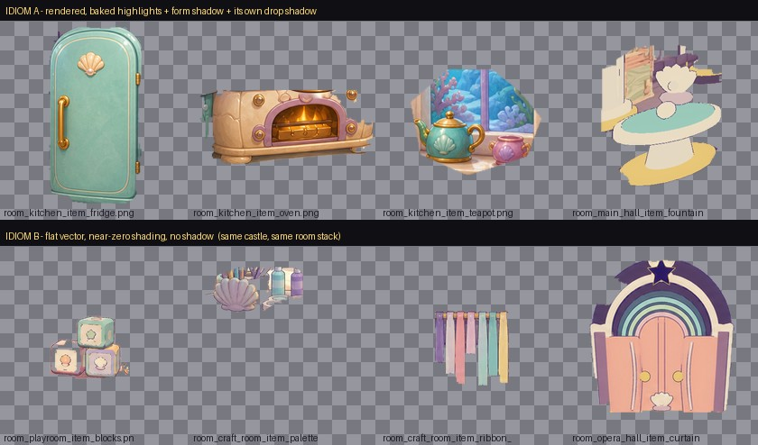
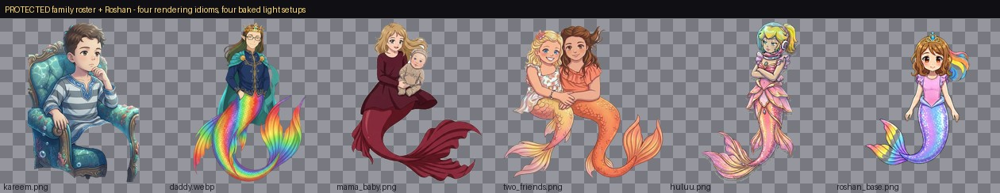
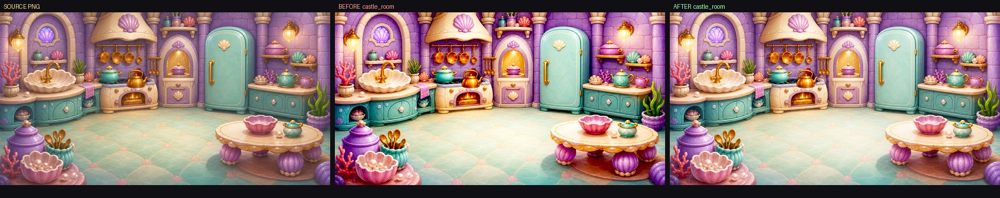
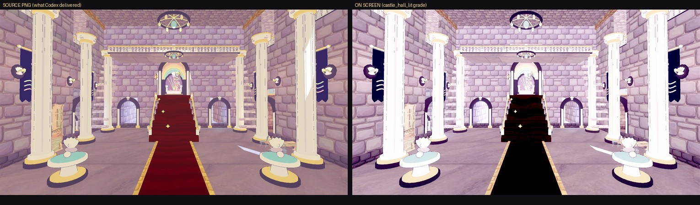

# Lighting audit for the 2.5D painted world — 2026-08-02

Supersedes the lighting half of `LIGHTING_SHADER_AUDIT_2026-07-18.md`, which
was written for a 3D reef before the 2026-07-27 promenade redesign made
**painted flats the primary art channel**. That audit asked "how do we light
our meshes better." This one asks the question that actually matters now:

> The game's light is *painted into the PNGs*. The renderer's light is a
> separate, mostly-unused system. How should the two be combined?

Scope: every shipped raster asset (748 files under `assets/`), every light
node, shader, material mode and Environment grade that touches them.

## Method (reproducible)

Two new tools ship with this audit; both are pure-Python (Pillow + numpy) and
need no Godot binary, so they run in this container and in CI:

- `tools/audit_lighting_images.py` — per-image baked-lighting metrics:
  value range, crush/blow fractions, top-vs-bottom and left-vs-right
  luminance bias (baked key direction), shadow-vs-highlight hue shift, ink
  mass, alpha coverage. Writes `tools/out/lighting_image_audit.json`.
- `tools/sim_render_grade.py` — replays the shipped `Environment` chain
  (exposure → glow composite → ACES → brightness/contrast/saturation) over a
  source PNG, so an approved painting can be compared against what the child
  actually sees. Grade profiles are lifted verbatim from
  `scripts/main.gd::_apply_scene_grade` and
  `scripts/arena/castle_rooms_25d.gd::_sync_castle_environment`.

```
python3 tools/audit_lighting_images.py assets
python3 tools/sim_render_grade.py assets/flats/castle/rooms/room_kitchen.png \
        castle_room --out /tmp/x.png --side-by-side
```

**Caveats, stated up front.** Metrics measured on ≤256 px thumbnails inside
the alpha mask. For *cutouts*, "shadow hue" conflates shading with albedo — a
brown-haired character reads "warm shadows" because of her hair, not her
lighting; I only draw conclusions from that column where a visual check
agreed. `vert_bias` on a full-bleed landscape plate mostly measures
"sky at top, ground at bottom" and is not a defect. `sim_render_grade.py`
approximates Godot's glow gather with a single Gaussian; the clipping and
mean-luminance numbers are solid, the exact glow radius is illustrative.

---

# Part 1 — Image audit

## 1.1 Inventory

748 shipped raster files under `assets/` (4,777 including `assets_src/`,
`gen2/`, and concept archives, which do not ship). Split by role:

| | count | what it is |
|---|--:|---|
| Cutouts (alpha < 90 % coverage) | 389 | standees, items, characters, effects |
| Full-bleed plates | 359 | room backgrounds, panorama tiles, tiling PBR |

Largest sets: `assets/flats/castle` 169 · `assets/art35/cards` 86 ·
`assets/terrain` 65 (tiling PBR, the only genuinely 3D-lit set) ·
`assets/opera/worlds` 62 · `assets/sprites/sky_lagoon` 59 ·
`assets/props/gen2` 57 · `assets/flats/sky_lagoon` 31.

## 1.2 The one structural fact everything else follows from

**Painted art in this game receives no light.** Across 47 `Sprite3D.new()`
sites in `scripts/`, there is exactly **one** `shaded = true` in the entire
codebase:

- `scripts/arena/castle_rooms_25d.gd:834` — the 8 Main Hall HD background
  tiles, deliberately called out as "the sole shaded receiver exception."

Everything else — every room, every standee, every character, every opera
actor, Roshan herself — is `shaded = false` / `SHADING_MODE_UNSHADED`. That
is *the correct default* for finished paintings and should not be reversed
wholesale. But it means the only levers that currently reach the art are:

1. `modulate` per card (used only in Sky Lagoon, for day/night),
2. the `WorldEnvironment` glow + tonemap + BCS grade (global, blunt),
3. additive overlay cards (god rays, sparkles).

There is **no `Light2D`, no `CanvasModulate`, no normal map on any 2D card**
anywhere in the project (`assets/terrain` normal maps feed 3D meshes only).

## 1.3 Finding — the art carries baked light, and the sets disagree about it

`ART_STYLE_GUIDE.md:541` says *"Do not bake directional lighting, cast
shadows, caustics, or ambient occlusion."* The flats do. That's fine — for a
painted 2.5D world it's arguably right — but they don't agree with each other.

`vert_bias` = (mean luminance of top third − bottom third) ÷ mean, inside the
alpha mask. The **p10–p90 spread** column is the disagreement *within* a set:

| cutout set | n | median vert_bias | p10–p90 spread | reading |
|---|--:|--:|--:|---|
| `assets/characters/friends` | 8 | +0.01 | **1.79** | no shared key at all |
| `assets/flats/castle` | 98 | +0.10 | **0.92** | key direction is per-file |
| `assets/opera/worlds` | 48 | +0.24 | 0.86 | mostly top-lit, wide scatter |
| `assets/sprites/sky_lagoon` | 59 | +0.08 | 0.77 | wide scatter |
| `assets/art35/cards` | 50 | +0.14 | 0.65 | wide scatter |
| `assets/props/gen2` | 7 | +0.05 | **0.24** | consistent (3D-derived) |
| `assets/characters/roshan_25d` | 13 | −0.05 | **0.06** | consistent (one artist, one pass) |

Concrete pairs that sit in the same room and disagree:

- `room_craft_room_item_paint_table.png` **+1.41** (lit hard from above) next
  to `room_playroom_item_play_tent.png` **−0.81** (lit from *below*).
- `room_main_hall_front_left.png` horiz **−0.81** vs
  `room_main_hall_front_right.png` **+0.76** — these two are actually
  *correct*: both brighten toward screen centre, which is a coherent
  centre-pool vignette. Good work worth keeping and generalising.
- `room_kitchen_item_sink.png` **−0.71** while `room_kitchen.png`'s own
  painted sink alcove is lit from the sconce above it.

Deliberate exceptions, not defects: `room_opera_hall_item_chandelier.png`
(−0.85) and `room_opera_hall_item_footlights.png` (+1.34) are *light
fixtures*; bottom-bright and top-bright respectively is exactly right.

## 1.4 Finding — shadow colour splits into two incompatible families

Style guide, line 372: *"Shadows are aqua, blue-grey, or lavender rather than
neutral black."* Circular-mean hue of the darkest decile per set:

| family | sets | shadow hue |
|---|---|--:|
| Violet/lavender (on-guide) | castle flats, opera worlds, stickers, friends, castle room buttons | 298–324° |
| Blue/cyan (also on-guide) | sky lagoon sprites, art35 cards, `assets/mg`, props/story, stuffie studio, kart, terrain cutouts | 222–278° |
| Warm (off-guide) | see caveat below | 350–20° |

The first two are both legal per the guide, but they are ~60° apart, which is
a visible difference when a card from one family is composited into a room
from the other — e.g. `assets/mg` minigame props (shadow hue 260°) dropped
into a castle room (307°).

**The warm-shadow bucket is largely a false positive** and I am not counting
it as a defect: 118/389 cutouts read "warm shadows," but spot checks show
these are warm-albedo subjects (Roshan's brown hair, the imps' orange sashes,
`carrot_carrot.png`) whose darkest pixels are pigment, not shading. The
metric cannot separate the two on a cutout. Where it *does* matter is
`assets/castle/dirty_cleanup_2d` (light hue 328°, i.e. the *highlights* are
magenta) — that set is genuinely lit differently from the rest of the castle.

## 1.5 Finding — two rendering idioms inside one room stack



Measured as median local luminance gradient inside the mask (how much shading
is painted in):

| set | localGrad | verdict |
|---|--:|---|
| `assets/sprites/sky_lagoon` | 0.057 | fully rendered |
| `assets/opera/worlds` | 0.051 | fully rendered |
| `assets/flats/castle` | 0.039 | fully rendered |
| `assets/props/gen2` | 0.016 | flat — *can* take runtime light |
| `assets/galaxy` | 0.009 | flat — *can* take runtime light |

Within `assets/flats/castle` the average hides a split. Compare the strip
above: `room_kitchen_item_fridge/oven/teapot` and
`room_main_hall_item_fountain_*` are rendered illustrations with specular
highlights, form shadows and their own baked drop shadow. In the same layer
stack, `room_playroom_item_blocks`, `room_craft_room_item_palette/ribbon_rack`
and `room_opera_hall_item_curtains` are flat vector shapes with essentially no
shading. A single room draws both at the same depth. No global light setting
can make those two idioms agree.

Two further specifics from that strip:

- `room_main_hall_item_fountain_*.png` bakes a **hard cream-yellow elliptical
  drop shadow**. The engine separately draws a *blue-violet* blob under
  Roshan (`room_actor_shadow.png`, modulate `(0.24, 0.25, 0.48, 0.58)` —
  `castle_rooms_25d.gd:750`). Two contradictory shadow conventions, on screen
  at once, one metre apart.
- `room_kitchen_item_teapot.png` and `room_kitchen_item_soup_pot.png` are not
  clean cutouts — they contain a chunk of *background wall and window* with
  its own baked lighting. They can never be moved, re-tinted or re-lit
  independently; they are patches, not props.

## 1.6 Finding — the cast spans four idioms, and most of it is protected



`assets/characters/friends/` holds `kareem.png` (near-photographic, hard key
from screen-left), `daddy.webp` (painterly, dramatic rim/backlight),
`mama_baby.png` (soft studio render), `two_friends.png` (a fourth treatment),
and `huluu/flower_friend/pearl_friend` (anime cel, like Roshan). Hence the
1.79 vert_bias spread — the widest in the project.

**CLAUDE.md protects this directory**: family art must never be modified or
substituted without being asked. So this is *not* a Codex regeneration task.
It is an engine task — harmonisation has to happen at composite time (§4.2).

Roshan herself (`assets/characters/roshan_25d`, spread 0.06) is the opposite
problem: she is beautifully consistent and almost **completely un-directional**
— evenly lit, no strong key. That is the right choice for a character who
walks through every zone, but it means she currently picks up *nothing* from
the room she is standing in and reads as a sticker laid over the painting.

## 1.7 Finding — no value headroom, so the grade clips the art

This is the highest-impact finding and the easiest to fix.

Painted flats are authored to fill the full 0–1 range (median dynamic range
p01→p99 is **0.67–0.81** across the flat sets). They are then pushed through a
filmic camera pipeline designed for HDR 3D scenes. Replaying that chain:

| set | ≥1 channel clipped, source → screen | crushed, source → screen | mean luminance |
|---|--:|--:|--:|
| castle rooms/items (unshaded) | 0.87 % → **21.60 %** | 1.37 % → 1.48 % | 0.379 → 0.534 |
| main hall HD tiles (shaded) | 0.09 % → 5.62 % | 0.00 % → **9.57 %** | 0.220 → 0.303 |
| opera world cutouts | 1.20 % → **23.06 %** | 0.03 % → 3.63 % | 0.297 → 0.399 |
| art35 cards | **10.21 %** → **48.86 %** | 3.30 % → 5.47 % | 0.455 → 0.607 |
| sky lagoon panorama | 0.19 % → **0.06 %** | 0.00 % → 8.52 % | 0.367 → 0.411 |



Read the castle-room row carefully: **true white-out stays low (0.36 %)** —
the frame does not go white. What blows is *individual channels*, 21.6 % of
them. That is hue distortion, not overexposure: a saturated lavender wall
whose blue channel clips shifts hue and loses its painted separation from the
wall next to it. In the figure, the graded floor picks up a magenta-brown cast
in the lower left and the arches go electric. Mean luminance rises 41 %.

The Main Hall is the mirror image — the ambient multiply plus
`adjustment_contrast = 1.20` around a 0.5 pivot takes shadow crush from **0 %
to 9.57 %**, eating the painted stone detail in the carpet and the alcoves.



The exact settings responsible (`castle_rooms_25d.gd:1709-1736`):

```gdscript
# Main Hall, fully lit
environment.adjustment_saturation = lerpf(0.66, 0.50, half_light_ratio)
environment.adjustment_contrast   = lerpf(1.12, 1.20, half_light_ratio)
environment.adjustment_brightness = lerpf(0.84, 1.12, half_light_ratio)
environment.glow_hdr_threshold    = lerpf(0.98, 0.58, half_light_ratio)
# destination rooms
environment.adjustment_saturation = 1.08
environment.adjustment_contrast   = 1.10
environment.adjustment_brightness = 0.94
```

plus ACES at exposure 0.92 / white 1.35 from the `warm_pastel` profile.
`adjustment_saturation = 0.50` halves the saturation of a set of paintings
whose whole point is their pastel colour relationships.

**`sky_lagoon` is the counter-example and the template.** Its profile
(exposure 0.72, white 1.55) is the only one in the game that *reduces*
highlight clipping (0.19 % → 0.06 %). Whoever tuned it solved the highlight
half of this problem already; the comment at `main.gd:1072-1074` says so
explicitly. It still crushes shadows (0 % → 8.52 %), which the fix in §4.1
addresses.

**A glow threshold of 0.58 is not a light source.** At that threshold 16.6 %
of the Main Hall plate feeds the bloom buffer — the painted *stone* blooms,
not the sconces. `castle_fixture_bloom.gdshader:25` has to *guess* which
pixels are emissive (`smoothstep(0.52, 0.96, max(r,g,b))`) because no asset
declares it. See §4.3.

## 1.8 Finding — the art ships one channel where it needs three

Every flat is a single RGBA colour image. Nothing in the library carries:

- an **emissive/light mask** (which pixels are lamps, fire, glowing pearls),
- a **separated shadow pass** (so the engine can move, tint or soften it),
- a **depth or normal hint** (so a cutout can respond to direction at all).

This is the root cause of §1.7's bloom guessing and §1.5's shadow-convention
clash, and it is the single biggest lever available to a Codex work order.

## 1.9 Minor — alpha matte streaks on twelve castle cutouts

A heuristic scan for rows with collapsed horizontal detail flags 12 files;
visual check confirms trailing horizontal smears bleeding out of the cutout
edge on at least `room_playroom_front_left.png`,
`room_craft_room_front_left.png`, `room_playroom_item_blocks.png`,
`room_craft_room_item_ribbon_rack.png`. Not a lighting defect — matting — but
it lands in the same regeneration batch. Full list in
`tools/out/lighting_image_audit.json`.

---

# Part 2 — Engine audit

## 2.1 Strengths (keep these)

1. **Unshaded-by-default is the right architecture.** Re-lighting finished
   paintings with a PBR light loop would destroy them. The project got the
   hard call right and documented it (`castle_rooms_25d.gd:3-8`).
2. **Real depth layering exists and is disciplined.** `BACKGROUND_Z 0.0 /
   ITEM_Z 0.55 / PLAYER_BACK_Z 1.25 / MIDGROUND_Z 2.0 / PLAYER_FRONT_Z 3.15 /
   FOREGROUND_Z 4.0 / EFFECT_Z 4.35` with per-depth `pixel_size` compensation.
   Cards sort by real depth, not by transparent-queue distance. This is the
   expensive part of 2.5D and it is already done.
3. **The Main Hall proves painted art *can* take real light.** SpotLight3Ds
   with shadows over `shaded = true` tiles, touch-toggled, quality-gated,
   with a lavender `DirectionalLight3D` fill. It is the best lighting in the
   game and the only place light is interactive.
4. **Sky Lagoon already has tint-based lighting.** Per-species `day_tint` /
   `night_tint`, `NIGHT_WORLD_TINT`, `NIGHT_BACKDROP_TINT`, and a tinted
   contact shadow (`sky_lagoon_promenade.gd:121-225, 717-741`). This is
   exactly the right technique — it is just local to one zone and one axis.
5. **A per-zone contact-shadow system exists** in both Sky Lagoon
   (`_sync_contact_shadow`) and the castle (`RoshanContactShadow`).
6. **Quality gating is genuinely thorough** — `speedy` paths for glow,
   shadows, light counts. Nothing proposed below should bypass it.
7. **The Lighting Lab in dev mode** (from the 07-18 audit) means every
   proposal here is A/B-testable on the phone.

## 2.2 Weaknesses

**W1 — The grade is applied to art that is already finished (§1.7).**
The BCS + ACES chain is doing a 3D camera's job over 2D paintings. 21.6 % of
castle-room pixels clip a channel that did not clip in the source. This is a
one-line-per-profile fix with the largest visible payoff in the audit.

**W2 — Depth exists geometrically but not tonally.** Seven depth planes, and
every one renders at `modulate = WHITE`. Real 2.5D sells depth by desaturating
and lifting distant layers toward the sky colour and darkening/enriching the
foreground. `assets/flats/castle` has no atmospheric ramp at all, so the
foreground vignette props read as *stickers on the same plane* as the wall
2 m behind them.

**W3 — `intensity_class` is declared and ignored.** Cards carry
`set_meta("intensity_class", "quiet")` (`sky_lagoon_promenade.gd:649, 973`)
and the only consumer in the codebase is a probe
(`probe_l2_living_cards.gd:58`). The vocabulary for per-card light response
exists; nothing renders it.

**W4 — Bloom has to guess what a light is.** Threshold 0.58 plus a
luminance-smoothstep in `castle_fixture_bloom.gdshader` instead of an authored
mask. Consequence: bright *paint* blooms and dim *lamps* don't.

**W5 — Characters do not sit in their environment.** Roshan is uniformly lit
and untinted in every zone; the friends roster carries four incompatible baked
keys. Nothing at composite time reconciles either. The contact shadow is the
only integration cue, and its colour is a hard-coded constant rather than
derived from the room.

**W6 — Two shadow conventions on screen simultaneously** (§1.5): baked
cream ellipses under some props, engine-drawn blue-violet blobs under actors.

**W7 — Day/night reaches exactly one zone.** `is_night` drives real tinting
in Sky Lagoon; the castle rooms, opera, and every minigame ignore it.

**W8 — No shared vocabulary.** Each zone re-invents its light setup inline
(`_build_hall_lighting`, `_animal_tint`, opera's unshaded "light pool"
cylinder at `opera_act.gd:870-880`). There is no `light_rig` module, so a fix
in one zone does not propagate, and Codex has no single spec to paint against.

**W9 — ACES on a pastel palette.** Flagged in the 07-18 audit (§1.5-3) and
still unresolved. ACES hue-skews saturated blues and purples — the entire
castle palette — and that skew compounds W1's per-channel clipping. AgX or a
LUT is the alternative; the lab can A/B it in minutes on the phone.

---

# Part 3 — The model to build toward

This is the direct answer to "what's the best way of combining lighting with
painted images." Four layers, cheapest first. Nothing here re-lights a
painting with a PBR loop.

**L0 — Show the painting as painted.** The global grade's job is to be nearly
transparent: match the phone panel, protect both ends of the value range,
apply the house look *gently*. Anything stronger is the art's job.

**L1 — Tint the card (multiply).** Per-card `modulate` from a zone light rig:
zone key colour × time-of-day × depth-plane atmospheric ramp × per-card
`intensity_class`. This is free, it is already proven in Sky Lagoon, and it
is what makes a character belong to a room. Multiply can only darken — which
is exactly right for painted art, because it can never clip.

**L2 — Add light as art (additive overlay cards).** Light *pools*, window
shafts, sconce glows, caustics ship as their own painted additive sprites at
their own depth. This is how a painted world gets interactive light without
touching the base art: the lamp turns on by fading in a glow card, not by
re-shading the wall. The Main Hall already does the harder 3D version of this;
the additive-card version costs nothing and works on every zone.

**L3 — Direction, only where it pays.** For hero standees, a cheap
`flat_lit.gdshader` on the card: a 2D ramp keyed to a zone light vector, with
a **hard shadow floor** (never below ~0.55 of albedo) and a **hue-shifted**
shadow tint rather than a darken. Optionally driven by a Codex-painted
2-channel light hint. Applies to Roshan and the friends roster — the two
places where "pasted sticker" reads worst — and nowhere else.

The division of labour that falls out of this:

- **Codex owns**: what is baked into the paint, and the *separate channels*
  that let the engine drive light (emissive mask, shadow pass, light hint).
- **Engine owns**: the grade, the tint rig, the depth ramp, overlay
  compositing, contact shadows, day/night propagation.
- **Nobody owns today**: the contract between them. §4 and §5 write it down.

---

# Part 4 — Engine work order

Ordered by payoff ÷ risk. Every item is probe-gated and reversible.
Items E1–E3 need no new art and can land immediately.

### E1 — Stop the grade clipping the art — **LANDED 2026-08-02**

Retuned `_apply_scene_grade` (`sky_lagoon`, `bright_pastel`, `warm_pastel`,
`galaxy`) and the castle destination-room grade. Measured over the real art
with `tools/check_grade_headroom.py`:

| zone | clipped channel, before → after | crushed, before → after |
|---|--:|--:|
| castle rooms | 21.50 % → **4.09 %** | 1.47 % → 1.39 % |
| sky lagoon | 0.05 % → 0.08 % | 8.45 % → **2.33 %** |
| bright_pastel (opera + art35) | 33.50 % → **13.82 %** | 3.80 % → 1.80 % |


The two levers that did the work: **`tonemap_white` 1.35 → 1.62** (ACES below
~1.55 puts painted highlights over the knee) and **post `contrast` → ≤1.05**
(contrast pivots on 0.5 and attacks both ends of the range at once).

`bright_pastel` stays high at 13.82 % because **its art is hot, not its
grade** — the art35 card set clips 3.8 % of pixels in the source PNGs. That is
C2's job, and the gate's budget tightens to ~6 % once those are regenerated.

Two things deliberately left alone:

- **The Main Hall's dramatic grade.** `adjustment_saturation = 0.50`,
  `contrast 1.20` and `glow_hdr_threshold 0.58` are a deliberate art decision
  (`castle_glow_profile = "dramatic_storybook"`) locked by
  `probe_castle_pearl_art.gd:962-965`. Its real fix is E4 + C1 — once the
  sconces carry emissive masks the threshold can rise and the drama can come
  from the lamps instead of from crushing the paint. Changing it now would be
  overriding an owner art call to chase a metric.
- **`ember`.** "Dark stone must STAY dark" is the same kind of decision.

Original prescription, for the record:

- Raise `tonemap_white` to ≥1.5 on every profile that shows the source art
  directly (`warm_pastel`, `bright_pastel`, `galaxy`). White 1.2–1.35 with
  ACES is what puts painted highlights over the knee.
- Drop `adjustment_contrast` to ≤1.05 everywhere. The paintings already have
  their contrast; post-contrast around a 0.5 pivot attacks both ends.
- Retire `adjustment_saturation = 0.50` in the Main Hall. If the hall should
  feel drained, that is a *paint* decision or an L1 tint, not a global
  desaturation of every card including Roshan's face.
- Add a **shadow floor**: `adjustment_brightness` below 1.0 combined with
  contrast is what produced 9.57 % crush. Lift the black point instead.

Gate — **landed**: `tools/check_grade_headroom.py`, wired into
`scripts/ci.sh`. It parses the grade numbers straight out of `main.gd` and
`castle_rooms_25d.gd` (so the gate cannot drift from the shipped values),
replays the chain over each zone's real flats, and fails when a profile clips
or crushes pixels the source did not.

> **Needs an owner go-ahead:** the CI workflow runs its own static-gate list
> rather than `scripts/ci.sh`, so this gate does not yet run on push. Adding
> one line to `.github/workflows/probes.yml` would fix that, but changes under
> `.github/workflows/` are explicit-task-only per CLAUDE.md, so I left it.

Still open: A/B **AgX vs ACES** on the phone in the existing Lighting Lab (W9).
AgX should visibly help the lavender/teal castle palette; confirm on the real
panel before committing, per the 07-18 audit's warning.

### E2 — `scripts/light_rig.gd` — one tint rig for every zone *(no new art)*

A small `RefCounted` satellite per CLAUDE.md rules (logic only, `main` by
reference, all state on `main`). It owns one function:

```gdscript
func card_tint(zone: String, depth_z: float, intensity_class: String) -> Color
```

composed from: zone key colour × `is_night` × a **depth ramp** (lerp toward
the zone's atmospheric colour as `depth_z` recedes, and slightly down/warm as
it approaches camera) × the per-card `intensity_class` factor. Apply it
wherever a card is created — `castle_rooms_25d._new_card`,
`sky_lagoon_promenade._add_sprite`, `side_scroll` layers, opera actors.

This single change fixes **W2, W3, W5 (partly), W7** and gives Sky Lagoon's
proven day/night to every zone for free. Migrate `_animal_tint` into it so
there is one implementation, not two.

### E3 — One contact-shadow convention *(no new art)*

Promote the castle/Sky Lagoon shadow code into the light rig: every standee
and actor gets an engine-drawn blob whose colour comes from
`light_rig.shadow_tint(zone)` rather than a hard-coded constant, sized from
the card's ground line. Then flag the props with baked drop shadows (§1.5)
for the Codex batch. Until they are repainted, the engine can suppress its own
blob for cards tagged `baked_shadow` so nothing double-shadows.

### E4 — Additive light-overlay cards *(consumes Codex C1)*

A `light_rig.add_glow_card(path, pos, depth, color, energy)` helper that
stands a painted additive sprite at a depth and animates its alpha. Then:

- raise `glow_hdr_threshold` back to ≥0.90 everywhere (W4), so paint stops
  blooming;
- let the sconce/fire/pearl **emissive masks** (C1) carry the bloom instead,
  at real HDR energy;
- rebuild the Main Hall's touch-toggle light as glow cards *plus* the existing
  spots, so the same interaction works in rooms that have no spot rig.

### E5 — `shaders/flat_lit.gdshader` for hero standees *(consumes Codex C3)*

Spatial, unshaded render mode, but samples a zone light vector and an optional
Codex light-hint texture to modulate the card:

```
lit = mix(shadow_tint * albedo, albedo, ramp)   // ramp floored at ~0.55
```

Hue-shifted shadow, never a straight darken, never below the floor — so a
painting can never crush. Apply to Roshan and the protected friends roster
(W5, §1.6) and leave every other card on L1 tint. This is the *only* item
that touches how a character is shaded, and it is deliberately last.

### E6 — Grade + tint knobs into the Lighting Lab

Extend the existing dev-mode lab with live sliders for the E1 profile values
and the E2 depth ramp, so the owner tunes on the phone panel rather than in a
PR. Cheap, and it is what makes E1's numbers trustworthy.

---

# Part 5 — Codex work order (art regeneration)

House rules from `CODEX_BACKGROUND_FLATS_WORKORDER_2026-07-27.md` all carry
over unchanged: original or CC0-derived art restyled to `ART_STYLE_GUIDE.md`;
**no words, letters or digits**; POT sizes; one `ASSET_LICENSES.md` line per
file in the same commit.

**Never touch** `assets/book/`, `assets/audio/voices/`,
`assets/characters/friends/`. The friends roster's lighting problem (§1.6) is
solved in E5, not by repainting family art.

### C1 — Emissive masks for every practical light *(highest value)*

For each flat that contains a lamp, fire, glowing pearl, stained glass or
sconce, deliver a companion `<name>_emis.png`: same size, same alignment,
**black except the light-emitting pixels**, painted in the light's own colour
at the intensity it should bloom.

Start with the sets that already have painted practicals:
`room_kitchen*` (oven fire, two sconces, alcove glow), `room_main_hall*`
(chandeliers, wall sconces, the stained-glass arch),
`room_opera_hall_item_footlights/chandelier/stage_star`, `room_bubble_bath*`,
`room_library*`, and the Main Hall HD tile set.

This retires the guesswork in `castle_fixture_bloom.gdshader:25` and lets E4
raise the global bloom threshold — fixing W4 and removing a large share of the
21.6 % channel clipping at the same time, because bloom stops being applied
to ordinary paint.

### C2 — Value headroom spec for all new and regenerated flats

Bake into the standing brief, and enforce with `audit_lighting_images.py`:

- `lum_p99 ≤ 0.88` and `lum_p01 ≥ 0.05` inside the alpha mask — leave the top
  and bottom of the range for the engine.
- `frac_blown < 0.5 %`, `frac_crushed < 0.5 %`.
- Specular highlights: paint them at ~0.85, **not** at 1.0. C1's emissive mask
  is what makes something look brighter than white.
- Shadows: hue-shifted lavender (~300°) for castle interiors, aqua (~200°) for
  Sky Lagoon and reef — pick **one per zone** and state it in the shot list.
  Never a neutral darken (`ART_STYLE_GUIDE.md:372`).

Re-run priority by measured clipping: `assets/art35/cards` (10.2 % clipped in
the *source*) → `assets/opera/worlds` → `assets/flats/castle`.

### C3 — One declared key light per zone, and a light hint for hero standees

- Publish a **zone light table** (direction, key colour, shadow hue, ambient
  colour) as the front page of every future shot list, and paint every asset
  in a zone to that one key. The measured p10–p90 `vert_bias` spread must come
  down from 0.92 to under ~0.30 (the `props/gen2` benchmark) on regenerated
  sets.
- For **hero standees only** (Roshan's poses, principal NPCs, large touchable
  props), deliver `<name>_hint.png`: R = surface facing left↔right, G =
  facing down↔up, B = ambient-occlusion/thickness. A two-minute paint job per
  asset that gives E5 real directional response without a normal-map pipeline.

### C4 — Split the shadow pass out of the standees

Regenerate the props that currently bake their own drop shadow — starting with
`room_main_hall_item_fountain_{left,right,left_v2,right_v2}.png` (hard cream
ellipse) — with
**no ground shadow at all**. The engine plants the contact shadow (E3), tinted
to the room. Bottom edge of the painted art remains the ground line, per the
existing standee rule.

### C5 — Reconcile the two idioms inside the castle *(art-direction call needed)*

§1.5 is a decision, not a bug: are castle props *rendered illustrations*
(kitchen) or *flat vector toys* (playroom/craft room)? Both are attractive;
they cannot share a room. Whichever wins, the other set gets regenerated —
roughly 20 files either way. My recommendation is the **rendered** idiom: it
matches the room plates they sit in, it matches Sky Lagoon and opera, and the
flat set is the minority.

### C6 — Clean re-cuts

- `room_kitchen_item_teapot.png`, `room_kitchen_item_soup_pot.png` — re-cut as
  true props with no embedded wall or window (§1.5).
- The 12 files with alpha matte streaks (§1.9) — re-matte.
- `assets/castle/dirty_cleanup_2d` — relight to the castle key (§1.4).

---

# Part 6 — Sequencing

| # | Item | Needs art? | Payoff |
|---|---|---|---|
| 1 | **E1** grade retune + headroom gate — **LANDED** | no | castle rooms 21.5 % → 4.1 % clipped; lagoon crush 8.5 % → 2.3 % |
| 2 | **E2** light rig: depth ramp + zone tint + day/night | no | fixes flat depth, integrates cast, unlocks W3/W7 |
| 3 | **E3** one contact-shadow convention | no | removes the double-shadow clash |
| 4 | **C1** emissive masks | yes | lets E4 fix bloom properly |
| 5 | **C2/C3** headroom + one key per zone in the standing brief | yes | stops the problem recurring |
| 6 | **E4** additive glow cards + threshold back to 0.90 | consumes C1 | interactive light in every zone |
| 7 | **C4/C6** shadow-pass split, clean re-cuts | yes | |
| 8 | **E5 + C3 hints** directional hero standees | yes | Roshan finally sits in the room |
| 9 | **C5** idiom reconciliation | yes | owner art-direction call first |

Steps 1–3 are pure engine work, need no Codex round-trip, and address W1, W2,
W3, W5(part), W6 and W7. They are where I would start.

## Files added by this audit

- `tools/audit_lighting_images.py`, `tools/sim_render_grade.py`,
  `tools/check_grade_headroom.py` (gate, wired into `scripts/ci.sh`)
- `tools/out/lighting_image_audit.json`, `tools/out/lighting_image_audit.md`
- `docs/audits/LIGHTING_2026-08-02_*.jpg`
