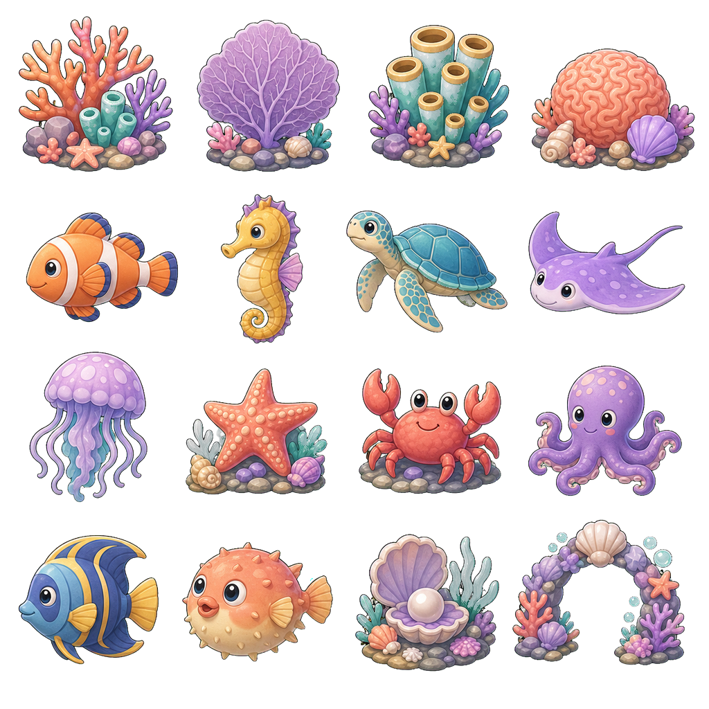
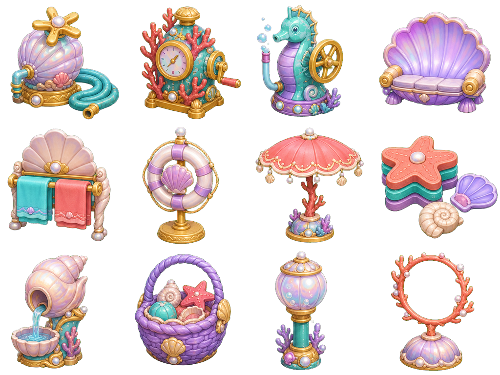
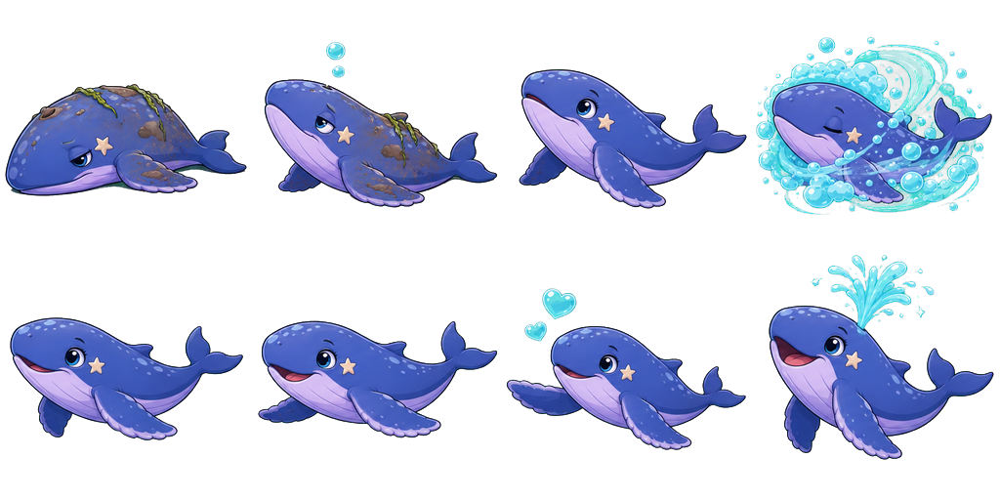
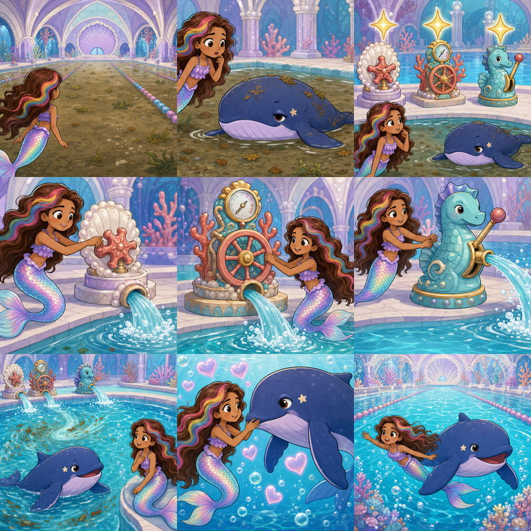
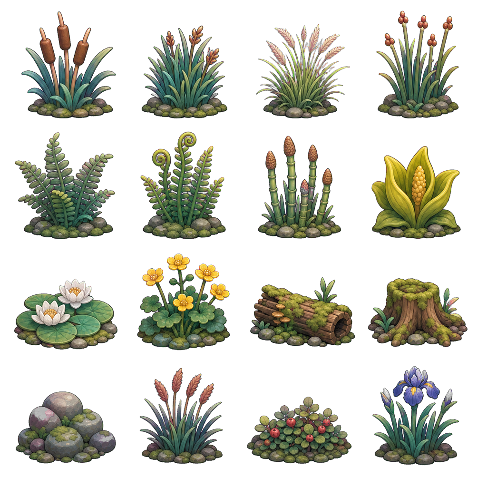

# Opus handoff — Roshan pool, whale rescue, and PNW marsh 2D art

## Handoff metadata

- Project: Mermaid Roshan: Reef of Light
- Audience: Claude Opus
- Prepared: 2026-07-26
- Runtime: Godot 4.4, Mobile renderer, 1280 × 720
- Target: Lenovo Tab M11 / Mali-G52, Speedy tier, one-finger preschool play
- Remote feature branch: `origin/codex/roshan-pool-pnw`
- Integrated content baseline: `95ba3d401d21b357744ff5b00965ec9b00b125d7`
- Integration target after an exact-head green gate: `dev`, never `master`

This packet transfers the complete generated 2D set and its current runtime
integration. It is not a request to regenerate the art or redesign Roshan.

## Owner direction and scope

The requested experience is one continuous castle-and-lagoon addition:

1. Mermaid Roshan's castle has a vast 100 × 50 pool, four times the area of a
   50 × 25 Olympic pool.
2. The pool is lush with coral and gentle sea creatures.
3. Twelve distinct deck ornaments surround it, including three visibly
   different pumps with oversized, touch-readable controls.
4. Roshan discovers cloudy water and a tired young whale. She deliberately
   fixes the three pumps, the water clears, the whale recovers, and they become
   friends.
5. Nine wordless story panels tell that sequence in preschool-readable beats.
6. The outdoor Sky Lagoon gains rooted Pacific Northwest marsh flora around
   the pond and river banks.
7. The castle's impractical tall bookshelves are replaced by four shallow,
   child-height face-out picture-book hutches. Those hutches are procedural
   meshes, not part of this 2D packet, but they are already present on the same
   feature branch.

### Explicitly out of scope

- Do not fix, alter, loosen, or work around the Opera courtyard gate or its
  probe. The owner explicitly declined including that unrelated production
  fix in this work.
- Do not modify, replace, crop, recolor, relight, recompress, or regenerate
  anything under `assets/book/`, `assets/audio/voices/`, or
  `assets/characters/friends/`.
- Do not redesign Roshan, add a crown or backpack to the storyboard, or replace
  the whale with a licensed or recognizable franchise character.
- Do not merge a red head into `dev`.

If the full trusted suite remains red only at the known Opera return check,
report the block and stop. A separately integrated upstream fix may be
reconciled normally, but this handoff does not authorize creating that fix.

## Authoritative 2D packet

The hash-verified machine-readable inventory is
`assets_src/concepts/roshan_pool_2d/OPUS_ASSET_MANIFEST_2026-07-26.csv`.
Exact generation prompts, input-reference declarations, normalization details,
and cell manifests are in
`assets_src/concepts/roshan_pool_2d/PROMPTS.md`.

| Asset | Runtime atlas | Provenance master | Grid | Runtime use |
|---|---|---|---|---|
| Pool reef life | `assets/castle/pool_2d/mermaid_pool_atlas.png` | `assets_src/concepts/roshan_pool_2d/mermaid_pool_atlas_chroma_2026-07-22.png` | 1024 × 1024, 4 × 4 | 16 unique cells, 24 placed cards |
| Pool ornaments | `assets/castle/pool_2d/poolside_ornaments_atlas.png` | `assets_src/concepts/roshan_pool_2d/poolside_ornaments_atlas_chroma_2026-07-22.png` | 1024 × 768, 4 × 3 | 12 deck objects; cells 0–2 are pumps |
| Whale states | `assets/castle/pool_2d/whale_states_atlas.png` | `assets_src/concepts/roshan_pool_2d/whale_states_atlas_chroma_2026-07-22.png` | 1024 × 512, 4 × 2 | 8 states; gameplay currently selects 0, 1, 4, and 6 |
| Rescue storyboard | `assets/castle/pool_2d/whale_rescue_storyboard.png` | `assets_src/concepts/roshan_pool_2d/whale_rescue_storyboard_2026-07-22.png` | 768 × 768, 3 × 3 | 9 opaque, wordless story panels |
| PNW marsh flora | `assets/sky_lagoon/pnw_marsh_2d/pnw_marsh_atlas.png` | `assets_src/concepts/roshan_pool_2d/pnw_marsh_atlas_chroma_2026-07-22.png` | 1024 × 1024, 4 × 4 | 16 unique non-colliding lagoon cards |

All runtime cells are exactly 256 × 256. The source masters are review and
provenance files under `assets_src/.gdignore`; runtime code must load the
processed files under `assets/`.

### Visual packet

Pool reef life:

Poolside ornaments and pumps:

Whale states:

Wordless rescue storyboard:

PNW marsh flora:

## Immutable atlas cell contracts

Cell indices are row-major and zero-based. Keep these contracts if an atlas is
reprocessed or a runtime placement is revised.

### Pool reef-life atlas

| Row | Cells |
|---|---|
| 0 | 0 branching coral; 1 lavender fan coral; 2 aqua-and-gold tube coral; 3 peach brain coral with shells |
| 1 | 4 clownfish; 5 golden seahorse; 6 sea turtle; 7 lavender manta ray |
| 2 | 8 lilac jellyfish; 9 starfish and shells; 10 coral-red crab; 11 violet octopus |
| 3 | 12 angelfish; 13 peach pufferfish; 14 pearl oyster garden; 15 shell-and-coral arch |

### Poolside ornament atlas

| Row | Cells |
|---|---|
| 0 | 0 pearl-shell pump with star valve; 1 coral-and-gold gauge pump with wheel; 2 seahorse filter pump with lever; 3 lavender clam bench |
| 1 | 4 shell towel rack; 5 life-ring stand; 6 coral-and-pearl umbrella; 7 swim toys and kickboards |
| 2 | 8 conch drinking fountain; 9 shell toy basket; 10 bubble lantern; 11 coral diving hoop |

Cells 0, 1, and 2 are the only repair targets. They must remain visually
different and readable without labels.

### Whale-state atlas

| Row | Cells |
|---|---|
| 0 | 0 dirty and resting; 1 weak bubble greeting; 2 hopeful notice; 3 washing in clear bubbles |
| 1 | 4 recovering; 5 clean and swimming; 6 friendship pose; 7 joyful fountain celebration |

The whale is one consistent individual: periwinkle back, lavender belly, cream
star near the left eye, broad flippers, and a gentle navy-purple outline. Early
states may show harmless silt and seaweed, never injury, tears, restraint, or
medical equipment.

Current gameplay maps repaired-pump counts `0, 1, 2, 3` to whale cells
`0, 1, 4, 6`. The other cells remain available for future animation or story
polish without changing the atlas.

### Rescue storyboard

1. Roshan finds the enormous pool cloudy with harmless leaves and silt.
2. She sees the tired, dirty whale and reacts with concern.
3. Three broken pumps are revealed with friendly golden guidance.
4. Roshan turns the pearl-shell pump's star valve.
5. Roshan turns the coral gauge pump's wheel.
6. Roshan pushes the seahorse pump's large lever.
7. Clear aqua water and bubbles sweep the silt away.
8. The healthy whale touches Roshan's hand with heart bubbles.
9. Roshan and her new friend swim together in the sparkling pool.

The runtime presents panels 0–2 at first meeting, one repair panel after each
pump, panels 6–8 after the third pump, and all nine on completed-story replay.
The pictures must remain wordless; voice events and a full-screen tap target
provide non-reader guidance.

### PNW marsh atlas

| Row | Cells |
|---|---|
| 0 | 0 cattails; 1 slough sedge; 2 tufted hairgrass; 3 softstem bulrush |
| 1 | 4 western sword fern; 5 deer fern; 6 horsetail; 7 yellow skunk cabbage |
| 2 | 8 white water lilies; 9 marsh marigold; 10 mossy nurse log; 11 mossy cedar stump |
| 3 | 12 mossy river stones; 13 reed seed heads; 14 bog cranberry; 15 western iris |

These are PNW wetland forms, not tropical filler. They must remain rooted or
water-seated. Do not introduce palms, cactus, desert plants, floating single
leaves, faces, or unrelated coral.

## Runtime integration map

| Responsibility | File and contract |
|---|---|
| Pool geometry, 24 reef cards, 12 ornaments, three pumps, whale states, water cleanup, input edge, save commits | `scripts/arena/castle_hall.gd` |
| Nine-panel full-screen storybook, voice events, tap-anywhere advance | `scripts/arena/pool_rescue_story.gd` |
| Story input routing and contextual `FIX!` / `STORY` action labels | `scripts/main.gd` |
| Sixteen PNW cards, pond/river placement, alpha-scissor setup, Speedy range cull | `scripts/arena/sky_lagoon.gd` |
| Pool, whale, story, ornaments, water, hutches, action-edge and passive-state checks | `scripts/probe_castle_pearl_art.gd` |
| Marsh atlas, unique indices, placement and continuity checks | `scripts/probe_l2.gd` |
| Mid-rescue persistence | `scripts/probe_load.gd` |
| Story-sheet gutter crop, exact-cell reconstruction, chroma removal, guard bands | `tools/process_pool_story_sheets.py` |

Persistent progress is stored as additive sticker keys:

- `_castle_pool_whale_met`
- `_castle_pool_pump_0`
- `_castle_pool_pump_1`
- `_castle_pool_pump_2`
- `_castle_pool_whale_friend`

Do not rename or remove these keys. One deliberate action edge repairs one
pump; proximity, idling, or holding the action must never repair anything.
Each progress bit is saved before celebratory animation so a suspended phone
does not lose the child's accomplishment.

## Runtime and Mobile constraints

- Keep every runtime texture at its current power-of-two or ≤1024 dimension.
- The two cutout families use alpha discard, mipmaps, unshaded double-sided
  cards, and a 150-unit Speedy visibility range.
- The storyboard is opaque and displayed one 256 × 256 cell at a time inside a
  672 × 672 frame.
- Do not add physics bodies, collision, shadows, lights, particles, or
  per-instance textures to the marsh and reef cards.
- Do not add an additional transparent water plane. The pool has one shared
  water material that blends from dirty olive-aqua to clean aqua.
- Preserve the 100 × 50 basin, clear dry-deck routes, three separated pump
  locations, and the whale's readable central swimming space.
- No fail state, timer pressure, damage, reading-dependent objective, or small
  precision target.
- Reuse existing family voice events through `_say()`; do not replace or
  recompress protected recordings.

## Processing and provenance

The five accepted sheets were generated with the OpenAI built-in image
generation tool on 2026-07-22.

- Pool and marsh sheets used only the in-repository style references declared
  in `PROMPTS.md`.
- Ornament, whale, and storyboard calls used no input or reference images.
- The generator exposed no deterministic seed or model-build identifier; none
  is claimed.
- `tools/prepare_generated_art.py` normalized the pool and marsh masters.
- `tools/process_pool_story_sheets.py` rebuilds the ornament, whale, and
  storyboard runtime sheets when supplied the accepted inputs and chroma
  helper described below.
- Runtime transparency uses border-sampled chroma removal, soft matte,
  despill, and exact per-cell guard bands as documented in `PROMPTS.md`.
- `ASSET_LICENSES.md` already records runtime and provenance assets as
  project-original art with no external source URL.

Do not overwrite a provenance master. If processing changes, retain the
accepted master, update the processor and hash manifest together, inspect every
cell for bleed, and update `ASSET_LICENSES.md` in the same commit.

### Known packet limits

- The tracked provenance sheets are the accepted normalized masters. The
  original generator-size outputs (1254², 1448 × 1086, and 1717 × 916) are not
  in the repository.
- `tools/process_pool_story_sheets.py` requires explicit `--ornaments`,
  `--whale`, and `--storyboard` inputs. Its default chroma helper is the
  ImageGen skill's `remove_chroma_key.py` under the current user's Codex
  installation; that helper is not vendored in this repository.
- The pool and PNW sheets were normalized with
  `tools/prepare_generated_art.py` and the same installed chroma helper. There
  is no dedicated checked-in one-command wrapper for those two accepted files.
- The runtime PNGs use Godot's default texture import settings; this feature
  does not add committed `.png.import` overrides.
- There is no separate Roshan sprite sheet, dirty-water sheet, silt sheet, or
  Sky Lagoon water sheet in this packet. Roshan is drawn into the opaque
  storyboard, while water color, cleaning, bubbles, and movement are runtime
  material or procedural behavior.

Because of those limits, treat the runtime hashes and normalized provenance
hashes as the transfer baseline. Do not claim byte-for-byte regeneration from
untracked raw outputs.

## Current validation evidence

At content baseline `95ba3d40`:

- GDScript parser checks passed for all changed scripts.
- `tools/lint_inference.py` passed for all changed scripts.
- `git diff --check` passed.
- Godot static import and analyzer stages passed in CI.
- The requested pool, whale, storyboard, pumps, PNW marsh, persistence, and
  replacement-hutch assertions passed.
- CI run `30191822705`, attempt 2, failed only at the unrelated pre-existing
  Opera courtyard return leg:
  `OPERAGATE|courtyard marquee blocked/rearm/open/return=true/true/true/false`.
- Because the trusted probe job failed, the visual-capture job was skipped and
  no new review artifact exists for this exact head.

The feature branch does not change Opera entry or return logic. The owner has
explicitly chosen not to include an Opera fix in this handoff.

## Suggested Opus continuation

1. Read `AGENTS.md`, `SECURITY.md`, this handoff, `PROMPTS.md`, and the CSV
   manifest before changing anything.
2. Fetch and inspect `origin/codex/roshan-pool-pnw`; verify the five runtime and
   five provenance hashes before accepting the packet.
3. Review every cell at phone scale and in its runtime placement. Treat isolated
   sheets as source evidence, not proof of composition.
4. Preserve atlas dimensions, cell order, save keys, action-edge behavior,
   story order, and protected-content boundaries.
5. If current `origin/dev` already contains a separately approved Opera fix,
   reconcile it normally, rerun local gates and exact-head CI, then request the
   missing Mobile capture artifact.
6. If Opera remains the sole red gate, stop and report it. Do not patch Opera,
   weaken `probe_l2.gd`, or merge the red branch.
7. Integrate into `dev` only after the exact reconciled head is fully green.
   Never commit, merge, or push `master`.

## Acceptance criteria

- All five runtime atlases match the manifest hashes or have an explicitly
  reviewed, documented replacement lineage.
- Every atlas cell is isolated, correctly indexed, fully contained, and
  readable at phone scale.
- The three pumps are visually distinct and each requires one fresh action.
- The water, whale state, persistent save state, and story panels advance in
  the same order.
- The story remains gentle, wordless, no-fail, and ends in friendship.
- All sixteen PNW cards remain ecologically coherent, grounded, non-colliding,
  and Mobile-capped.
- No protected art or voice file changes.
- Full trusted CI is green for the exact integration head, followed by human
  review of the pool, story, hutches, and marsh Mobile captures.

## Stop conditions

Stop and ask the owner rather than guessing if:

- a requested change alters Roshan's identity, the whale's defining star mark,
  the nine-beat story, or any protected family asset;
- a cell contract, save key, pool footprint, pump count, or interaction rule
  would need to change;
- a proposed visual needs new uncapped transparency, physics bodies, or lights;
- the only remaining gate is the out-of-scope Opera failure;
- reconciliation with `origin/dev` is not a fast-forward or clean merge.
