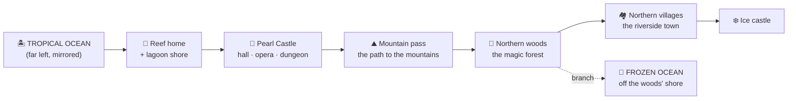

# World map proposal — stitching the game into one line (2026-07-27)

**Status: PROPOSAL. No code has been written against this.** It exists so the
geography can be approved before anything is built. Nothing in the shipped
game changes until the owner signs off on §3 and rules on §6.

---

## 1. The owner's rules (2026-07-27)

Three statements, taken as binding constraints on the layout:

1. **"Stitch the whole game together for a brief preview."**
2. **"Have the path to the mountains lead to the northern villages."**
3. **"Have the frozen ocean off the shores of the northern woods."**
4. **"Have the tropical ocean on the far left (and mirror it from right to
   left)"** — clarified: the mirror applies to **the tropical ocean set only**.
   Its layout flips horizontally so its shoreline faces inward toward the rest
   of the world; every other zone keeps its current left-to-right order.

---

## 2. Where the world actually stands today

This matters more than it sounds, because **the game is not currently stitched
at all** — it is less connected than it was two weeks ago.

Zones live in separate arena pockets, not one continuous space:

| Zone | Origin | Reached by |
|---|---|---|
| Reef home (free-swim) | `ARENA_POS` (0, −600, 0) | game start |
| Sky Lagoon | `LEVEL2_POS` (0, −1300, 0) | seabed portal |
| Pearl Castle | `CASTLE_POS` (500, −1300, 0) | lagoon castle door |
| Northern kingdom | `NORTHERN_POS` (0, −2200, 0) | Magic Cave portal |
| Butterfly World / Galaxy | 9000 | courtyard portal |
| Ember Fortress | (0, 15000, 0) | courtyard portal |

**The hub that connected them is gone.** `_enter_level2_now` now returns early
into the Sky Lagoon promenade (`main.gd:4013-4017`), so
`_populate_courtyard_touch_interactables` (`main.gd:3530-3578`) never runs. Every
destination it offered is unreachable: both ocean kingdoms, the Magic Cave to
the north, Butterfly World, Ember Fortress, both Rainbow Race legs, the Dream
Stars, the wall picture games and the secret back door. The promenade registers
four targets total — pearl plane, three playground pieces, castle gate
(`sky_lagoon_promenade.gd:217-254`).

**So "stitch the whole game together" is not a polish task — it is the
precondition.** Whatever geography is approved below, the first build step is
restoring the destinations the promenade rewrite orphaned. A preview cannot
show zones the player cannot reach.

---

## 3. The proposed world line

One left-to-right line with one branch. Travelling right is travelling onward.

**Why this order.** It satisfies all three geography rules without reversing any
zone's authored internal layout:

- **Rule 4** — the tropical ocean anchors the far left.
- **Rule 2** — the mountain pass leads onward to the villages. The northern
  kingdom's road already runs pass (z 348) → forest (z 140) → town (z −180) →
  ice castle (z −318) (`northern_kingdom.gd:60-64`), so the pass→villages road
  is *already built*. The woods sit along the way, which is what a road through
  a forest does; the rule is satisfied without touching the strip.
- **Rule 3** — the frozen ocean hangs off the woods as a **branch**, not a line
  endpoint. This is the one that needs no invention at all: the northern strip
  already has fjord water running its full length on both sides at x ±152,
  spanning z −395..+395 (`northern_kingdom.gd:398-411`). The forest heart is at
  z 140. **The shore already exists beside the woods** — the frozen ocean seam
  is a gate on that fjord, not new terrain.

### The seams

| # | Seam | Kind | Exists today? |
|---|---|---|---|
| 1 | Tropical ocean ↔ reef home | continuous water | yes — kingdom entry/return gates |
| 2 | Reef home ↔ lagoon | portal | yes — seabed portal |
| 3 | Lagoon ↔ castle | door card | yes — promenade castle gate |
| 4 | Castle ↔ mountain pass | portal | **partly** — Magic Cave exists but is orphaned |
| 5 | Pass → woods → villages → ice castle | continuous road | yes — one strip |
| 6 | Woods ↔ frozen ocean | shore gate | **no — this is the one new seam** |

Only seam 6 is genuinely new. Seam 4 needs restoring, not inventing.

---

## 4. What lives in each zone

| Zone | Contents |
|---|---|
| **Tropical ocean** | Caribbean districts: pearl (shell gardens, barrel sponges, pearl-shop ship), wreck (broken ship, treasure debris, ravine shoulders), moon (shell arch, pearl nest, anemone bowl), rainbow (race gateway, coral bouquets, starfish flats). The five friends, the Manta Pearl Shop, the wreck cave, the den. |
| **Reef home** | Start point. Seabed portal to the lagoon. |
| **Sky Lagoon** | Pearl plane, playground (slide/swing/seesaw), activity frames, castle gate. Currently the only promenade stage. |
| **Pearl Castle** | Grand Hall, **Pearl Opera Foyer** (new — opera house + demoted bell alcove), royal bedroom, basement wing (pantry, kitchen, bubble bath, craft room, royal loo), undercroft, upper story (star chamber, cloud lounge, royal library, toy room), dreaming floor (five legacy bedrooms), dungeon. |
| **Mountain pass** | Authored arch gate, flanking peaks, the veil back to the lagoon. |
| **Northern woods** | Magic forest, two spirit clearings, forest POIs, the stream and its ford. |
| **Northern villages** | Riverside town: one street, six houses, inn, smith's porch, lumber mill on its island. |
| **Ice castle** | Curtain wall, forecourt, frozen fountain, grand hall, mezzanine bedrooms. |
| **Frozen ocean** | Norwegian districts: ice (fjord crystal hummocks, frozen current sheets, cold-water benthos) and kelp (kelp threshold, lantern pods, cold-water aisles). |

---

## 5. The tropical mirror

"Mirror the tropical ocean set only." The Caribbean districts today
(`reef_districts.gd:24-31`):

| District | Today | Mirror about set midpoint (x′ = −130 − x) | Mirror about centroid (x′ = −165 − x) |
|---|---|---|---|
| pearl | (35, 30) | (−165, 30) | (−200, 30) |
| wreck | (−160, 135) | (30, 135) | (−5, 135) |
| moon | (−165, 5) | (35, 5) | (0, 5) |
| rainbow | (−40, −165) | (−90, −165) | (−125, −165) |
| *kingdom entry* | (−101, 6) | (−29, 6) | (−64, 6) |
| *destination centre* | (−165, 5) | (35, 5) | (0, 5) |

**Neither axis is free, and the doc's job is to say so plainly:**

- **Midpoint mirror** keeps the set's footprint exactly where it is (x −165..35)
  — the tidy choice geometrically. But it moves **pearl**, the home district,
  from +35 to −165: the start point, the Manta shop and the first friends all
  relocate to the far left, and wreck/moon land at +30/+35 where home used to
  be.
- **Centroid mirror** drags the footprint 35 units left and lands moon at x 0
  and wreck at x −5 — on top of the reef centre and within 35 units of the
  Norwegian `kelp` district at (−35, 165). **This one collides**; I would not
  build it.

**The cost either way.** `reef_districts.gd:33-36` states outright: *"Keeping the
authored coordinates stable preserves friends, pearls, routes and old saves."*
Mirroring the set moves `FRIEND_POSITIONS`, `GROVES` and the kingdom entry and
return gates. A saved game holds progress against those positions. This is the
one part of the request that touches the "zero tolerance for lost progress"
rule, so it needs an explicit owner call rather than a default.

---

## 6. Decisions needed before any code

1. **Which mirror axis** — midpoint (moves the home district to the far left) or
   something narrower? A third option exists that I'd recommend over both:
   **mirror the tropical set's *art and dressing* horizontally while leaving
   district coordinates untouched.** The zone reads flipped, faces inward, and
   no save, friend, pearl or route moves. If "mirror" was about how the zone
   *looks and faces* rather than where its districts sit, this costs nothing.
2. **The `kelp` anomaly** — kelp is flagged Norwegian/frozen
   (`reef_districts.gd:44`) but sits at (−35, 165), left of centre and nowhere
   near the ice district at (140, −115). Under a "tropical left, frozen off the
   northern woods" geography it is in the wrong ocean. Move it east with the
   frozen set, or re-flag it tropical?
3. **Seam 6's form** — is the frozen ocean entered by *swimming off the woods'
   fjord shore* (continuous, best for a non-reader: walk into the water and you
   are there), or by a gate/door card on the shore (cheaper, consistent with
   every other seam)?
4. **Preview scope** — does "brief preview" mean a playable end-to-end walk, or
   a capture/flythrough of each zone in order? The first is a real build; the
   second I can produce from the existing visual-review probes almost
   immediately.

---

## 7. What I recommend

Build in this order, each step independently useful:

1. **Restore the orphaned hub** (§2). Nothing else is testable until the
   destinations exist again. This alone gets you a walkable preview of the
   whole game in its current geography.
2. **Add seam 6** — the frozen-ocean shore gate beside the woods. One new seam,
   on water that is already modelled.
3. **Mirror the tropical set** per whichever option §6.1 lands on.
4. **Write the reachability probe.** No probe currently proves any door reaches
   its destination — `probe_opera.gd:27` calls `_start_opera()` directly, and
   that blind spot is exactly how the Sky Lagoon opera entrance disappeared
   without CI noticing. A stitched world needs a bot that walks every seam, or
   the next rewrite will silently unstitch it again.

Step 4 is the one I would not skip. The others can be reordered freely.
