# Battle of the Bands — Sky Lagoon review packet

**14 developed scene candidates · 19 short clip jobs · Iko Iko v89 (91 seconds) + 18-second story coda.**

[Start here](START_HERE.txt) · [Interactive board](SHOT_BOARD.html) · [Codex work order](CODEX_REFINEMENT.txt) · [Audio cues](AUDIO_CUE_SHEET.json) · [Manifest](ARCHIVE_MANIFEST.json) · [Publication receipt](REMOTE_VERIFICATION.json)

Roshan drums; Daddy Mermaid plays ukulele; Baby Eagle plays four-string/four-peg bass. Ember King leads on guitar; Ember Prince plays his elaborate **single-kick** kit with the trial crowned-flame emblem. The shared stage replaces playground equipment in the **middle Sky Lagoon meadow**, using the literal v5 panorama.

These are full-frame **scene-design candidates**, awaiting first-frame and continuity approval. Grok clips are motion/editorial reference only. Download the directory and open SHOT_BOARD.html to inspect timing with local song playback. GitHub renders the scene images below; it displays HTML as source.

## R3: Pop Star scrolling-drum interface studies

The ordered-tap mechanic is superseded. A moving bar now reaches the actual drum rim or cymbal, where the child taps. This revision contains **interfaces and silent timing fixtures only**: no authored drum part or Iko Iko chart, no production-game replacement.

[Playable UI source](ui/index.html) · [Six-state storyboard](ui/STORYBOARD.html) · [UI/Codex design brief](ui/UI_DESIGN.txt) · [Interface evidence](ui/INTERFACE_TESTS.json)

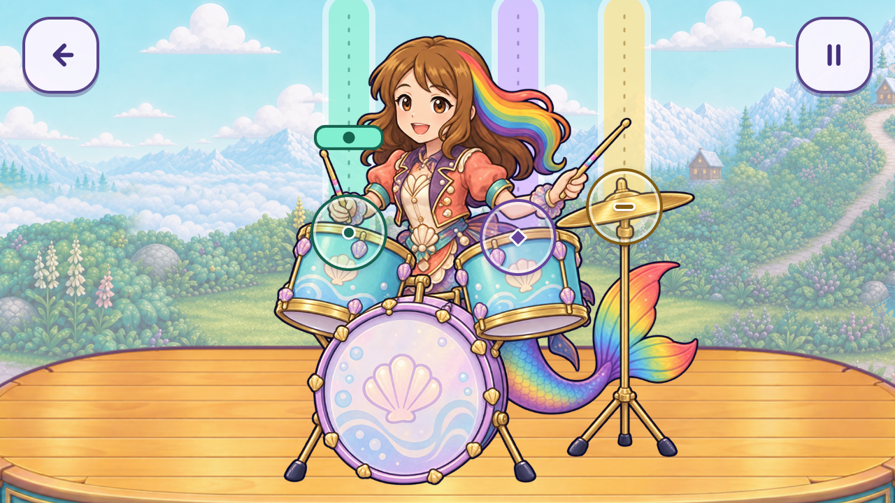

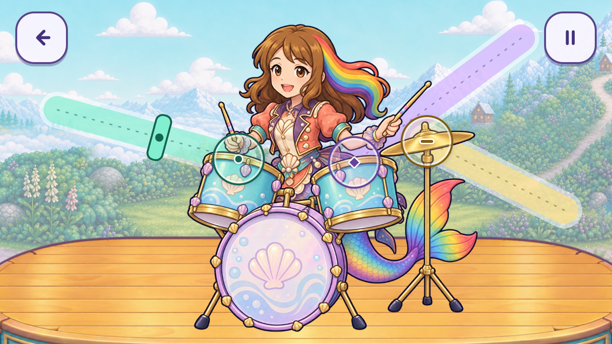

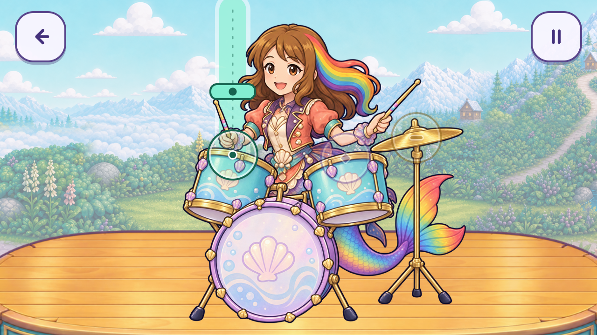

Download/serve this packet to try the interfaces. Each uses one-finger input, shape plus colour, instrument-aligned targets and gentle misses. Roshan's existing pose stays static pending a separate strike-animation pass.

**Shot 12 correction:** at 91 seconds the music is over. The King drops his guitar, then takes the candle with his hand. No magical lift. The guitar remains on stage through his departure.

## BAND-01 — Ready in the middle meadow

**0.000–3.583s.** Roshan raises her two sticks and looks to her bandmates. End: everyone is ready; the single candle stays on the supported cake.

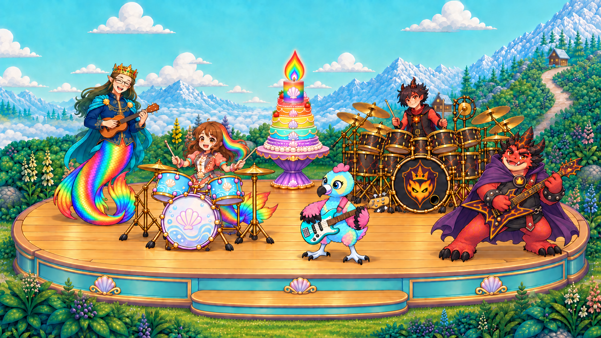

[BAND-01 card](shots/BAND-01/SHOT_PACKET.json) / [prompt](shots/BAND-01/PROMPT.txt)

## BAND-02 — Roshan starts the groove

**3.583–11.901s.** Roshan alternates two contacts on the upper tom heads with clear rebounds. End: both sticks rebound above their drumheads; she keeps a relaxed smile.

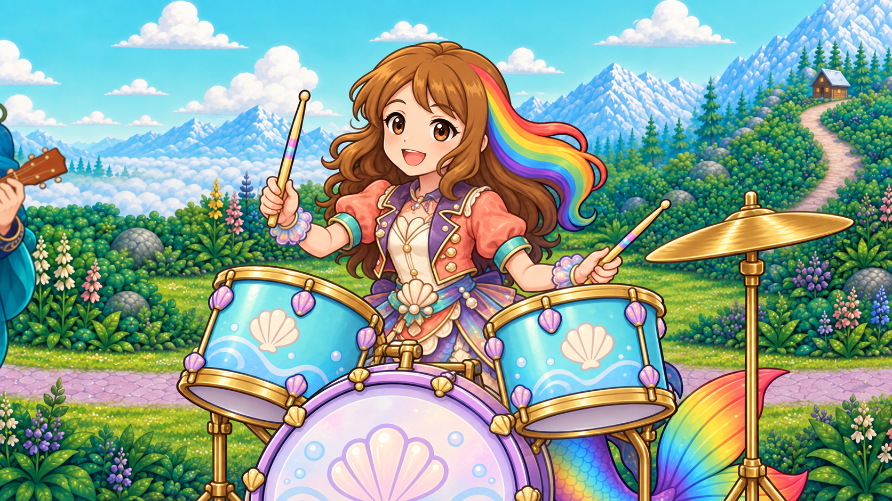

[BAND-02A card](shots/BAND-02A/SHOT_PACKET.json) / [prompt](shots/BAND-02A/PROMPT.txt) · [BAND-02B card](shots/BAND-02B/SHOT_PACKET.json) / [prompt](shots/BAND-02B/PROMPT.txt)

## BAND-03 — Daddy answers on ukulele

**11.901–18.500s.** Daddy gently strums his four-string ukulele and smiles toward roshan offscreen right. End: the ukulele stays securely held; his gaze rests on roshan.

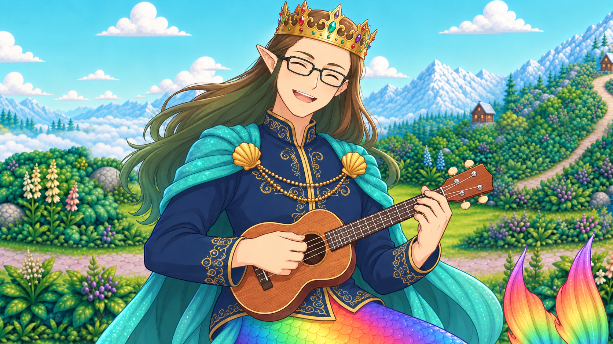

[BAND-03 card](shots/BAND-03/SHOT_PACKET.json) / [prompt](shots/BAND-03/PROMPT.txt)

## BAND-04 — Baby Eagle holds the bass line

**18.500–25.303s.** Baby eagle plucks the four-string bass with one wing while the other supports the neck. End: the bass stays secure with four strings connected to four posts and four keys.

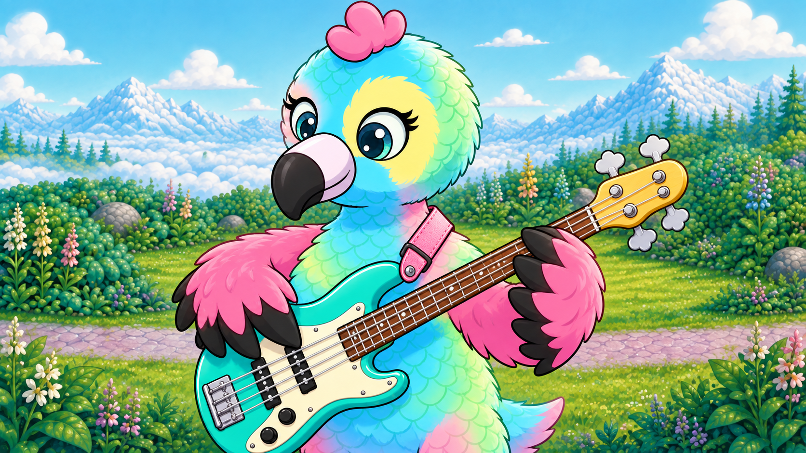

[BAND-04 card](shots/BAND-04/SHOT_PACKET.json) / [prompt](shots/BAND-04/PROMPT.txt)

## BAND-05 — King first grindcore break

**25.303–31.062s.** The king leans into a theatrical lead-guitar flourish and open-mouth growl. End: the king returns upright with his guitar strapped; the candle has not moved.

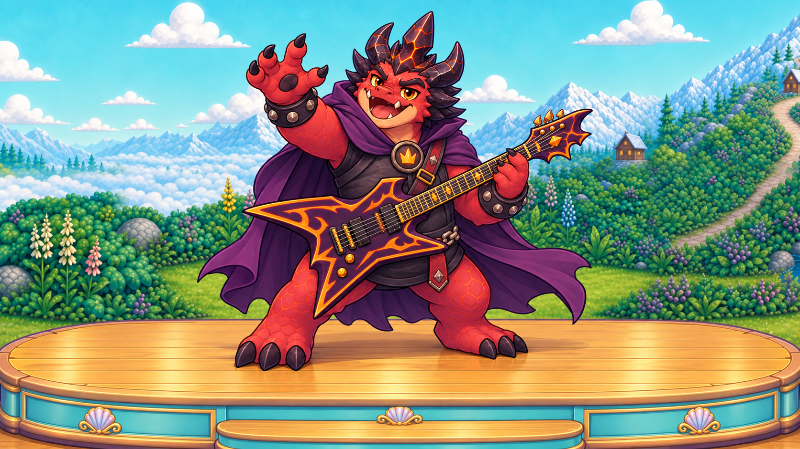

[BAND-05 card](shots/BAND-05/SHOT_PACKET.json) / [prompt](shots/BAND-05/PROMPT.txt)

## BAND-06 — Roshan answers without fear

**31.062–40.000s.** Roshan answers with two tom contacts and one light cymbal contact. End: the cymbal settles as she resumes her cheerful groove.

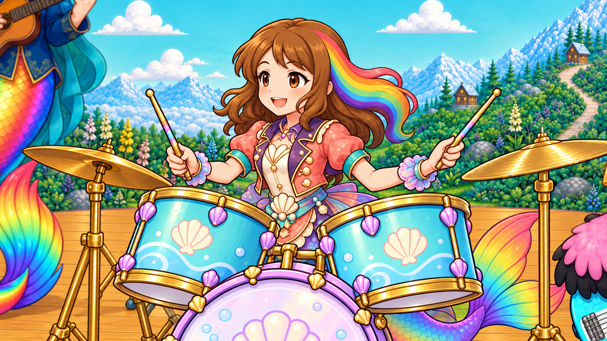

[BAND-06A card](shots/BAND-06A/SHOT_PACKET.json) / [prompt](shots/BAND-06A/PROMPT.txt) · [BAND-06B card](shots/BAND-06B/SHOT_PACKET.json) / [prompt](shots/BAND-06B/PROMPT.txt)

## BAND-07 — Family call and response

**40.000–48.268s.** Roshan cues daddy and baby eagle with a small nod; they answer on ukulele and bass. End: all three share the groove without leaving their places.

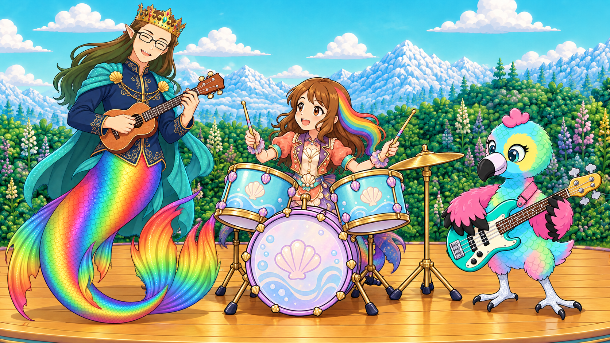

[BAND-07A card](shots/BAND-07A/SHOT_PACKET.json) / [prompt](shots/BAND-07A/PROMPT.txt) · [BAND-07B card](shots/BAND-07B/SHOT_PACKET.json) / [prompt](shots/BAND-07B/PROMPT.txt)

## BAND-08 — Prince second grindcore break

**48.268–54.027s.** The prince performs a two-stick fill around his many toms then taps a cymbal. End: both sticks rebound; the single kick drum and crowned-flame crest remain unchanged.

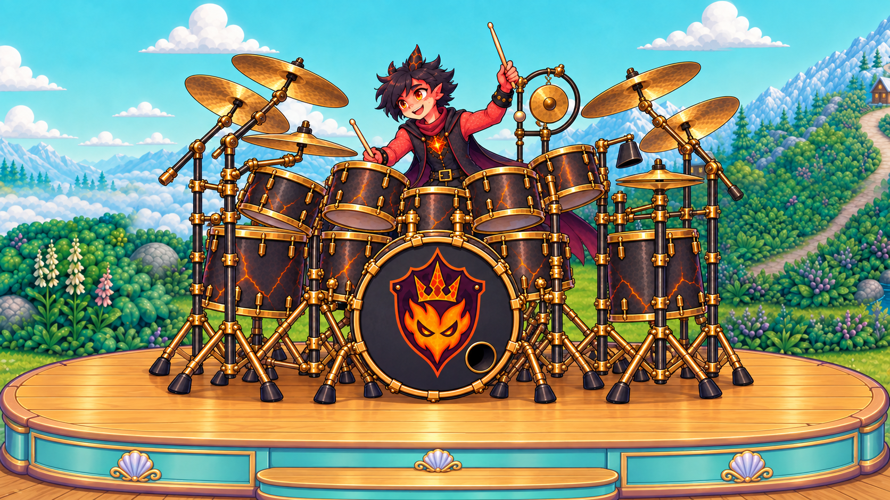

[BAND-08 card](shots/BAND-08/SHOT_PACKET.json) / [prompt](shots/BAND-08/PROMPT.txt)

## BAND-09 — Everyone finds the groove again

**54.027–76.000s.** Roshan keeps a gentle tom pulse while baby eagle answers with a bass pluck. End: roshan and baby eagle exchange a happy glance, still playing securely.

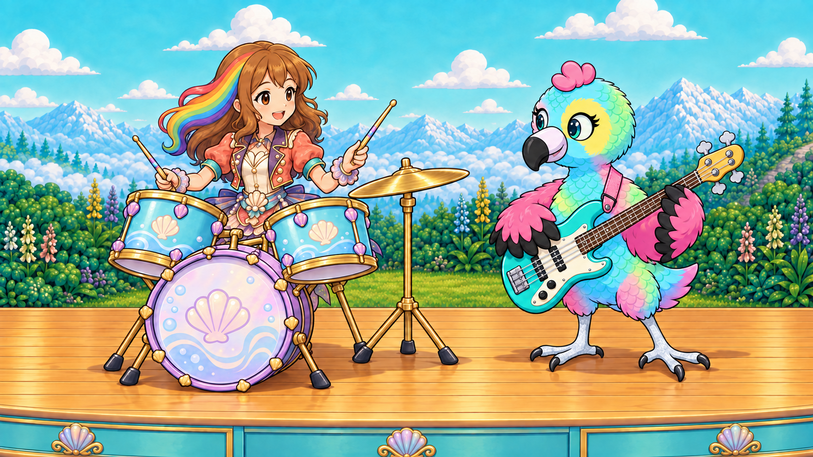

[BAND-09A card](shots/BAND-09A/SHOT_PACKET.json) / [prompt](shots/BAND-09A/PROMPT.txt) · [BAND-09B card](shots/BAND-09B/SHOT_PACKET.json) / [prompt](shots/BAND-09B/PROMPT.txt) · [BAND-09C card](shots/BAND-09C/SHOT_PACKET.json) / [prompt](shots/BAND-09C/PROMPT.txt)

## BAND-10 — Roshan completes her phrase

**76.000–83.060s.** Roshan lands a satisfying final tom contact then raises both sticks in delight. End: roshan is pleased with her successful phrase; the candle still belongs to her.

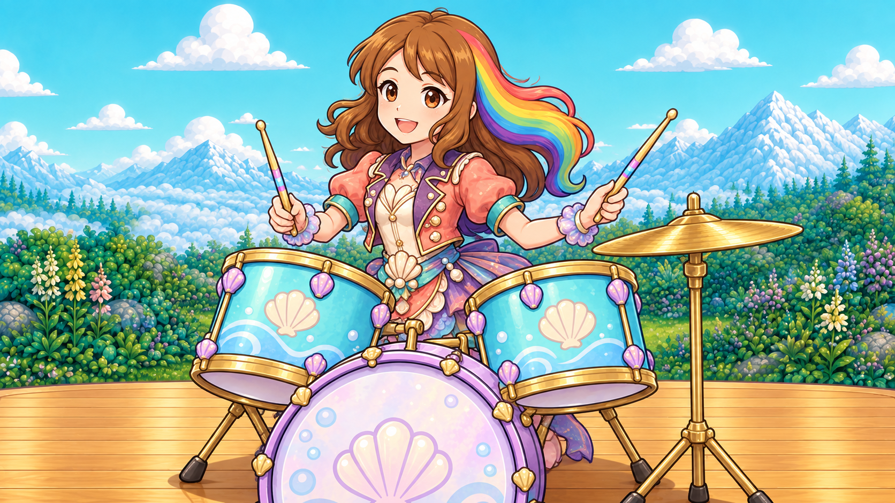

[BAND-10 card](shots/BAND-10/SHOT_PACKET.json) / [prompt](shots/BAND-10/PROMPT.txt)

## BAND-11 — Ember final interruption

**83.060–91.000s.** The king strums a final flourish as the prince lands a two-stick fill. End: their instruments settle; the king looks toward the offscreen candle.

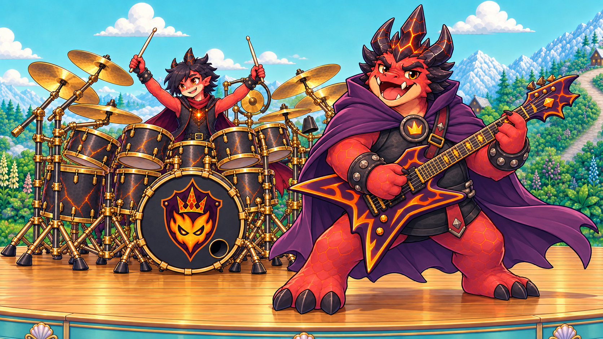

[BAND-11 card](shots/BAND-11/SHOT_PACKET.json) / [prompt](shots/BAND-11/PROMPT.txt)

## BAND-12 — The King cheats

**91.000–97.000s.** After the music ends, the king drops his guitar onto the stage, reaches over and grips the candle body with his fingers, then lifts it by hand. End: one candle is held in the king's hand; its former place on the intact cake is empty; the guitar and loose strap stay on the stage.

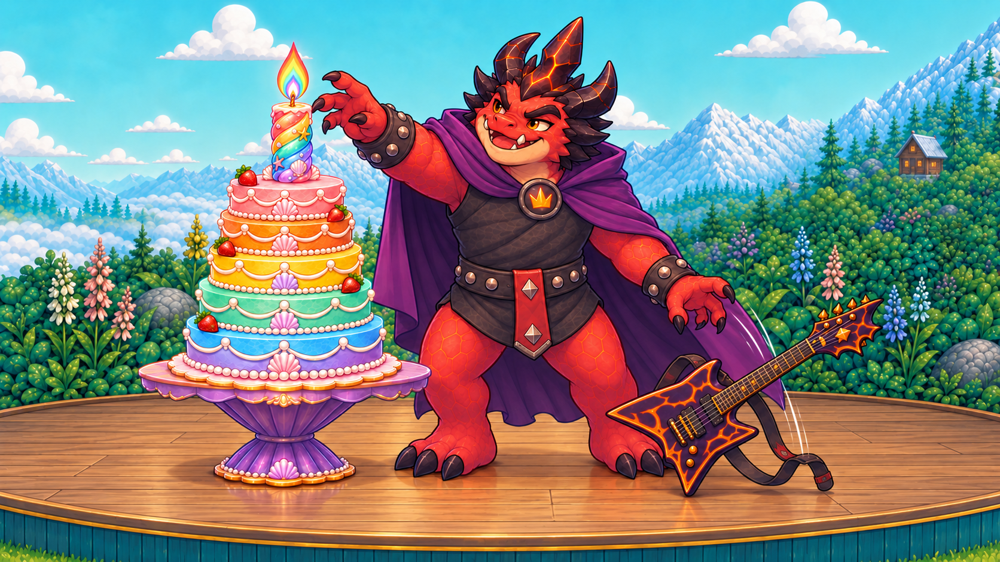

[BAND-12 card](shots/BAND-12/SHOT_PACKET.json) / [prompt](shots/BAND-12/PROMPT.txt)

**Contact/end-state study — storyboard only, never a generation binding.**

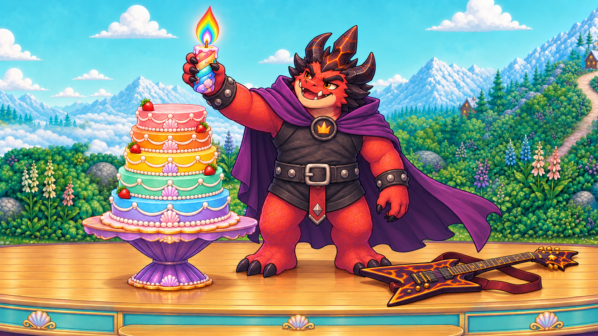

## BAND-13 — The Prince objects

**97.000–103.000s.** The prince appeals with one empty open hand; the king turns away holding the candle and the disappointed prince follows. End: king and prince leave frame together with the single candle; the discarded guitar and slack strap remain on the stage.

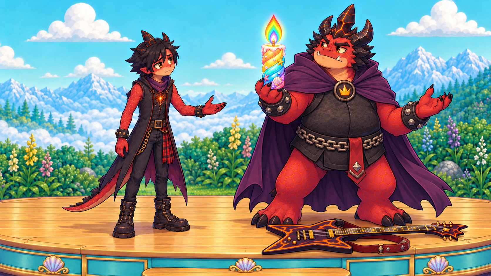

[BAND-13 card](shots/BAND-13/SHOT_PACKET.json) / [prompt](shots/BAND-13/PROMPT.txt)

## BAND-14 — Friends stay together

**103.000–109.000s.** Daddy leans gently toward roshan; baby eagle moves a small step closer as she looks up. End: roshan has her friends beside her; instruments and earned cake remain safe; the discarded guitar stays on stage outside this closer framing.

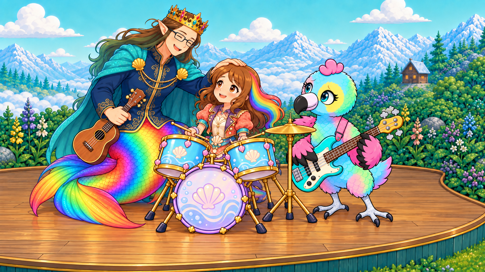

[BAND-14 card](shots/BAND-14/SHOT_PACKET.json) / [prompt](shots/BAND-14/PROMPT.txt)

## Earlier Godot staging prototype — rhythm mechanic superseded

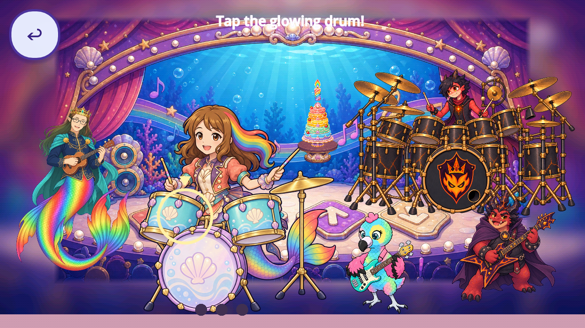

The earlier scenes/battle_of_bands_prototype.tscn preserves staging/audio/save review history. Its twelve ordered taps are superseded by the scrolling-bar design above. No Godot script or production job was changed in this interface-only revision. Historical MACHINE_VERIFICATION.json and RUNTIME_EVIDENCE.json do not validate the new browser interface.

**Archive:** consult REMOTE_VERIFICATION.json for exact published bytes. **Generation readiness: blocked** by first-frame/continuity/topology approval and continuation endpoint bindings. **Delivery acceptance: false.** Full-frame cinematic/human/device gates still apply.
