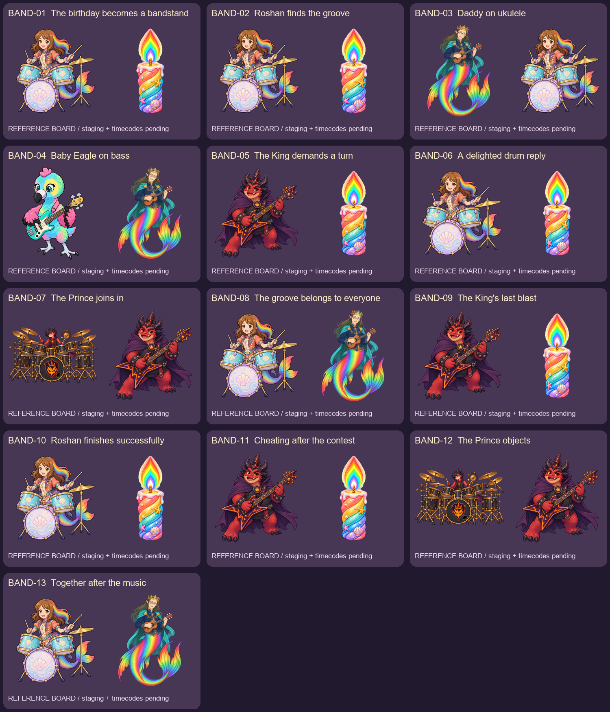

# Battle of the Bands — review handoff

Owner lineup: **Roshan — drums; Daddy Mermaid — ukulele; Baby Eagle — bass; Ember Prince — enormous metal kit with one kick; Ember King — lead guitar.** The crowned-flame Ember emblem is a trial design.

[Start here](START_HERE.txt) · [Codex refinement handoff](CODEX_REFINEMENT.txt) · [Audio cue sheet](AUDIO_CUE_SHEET.json) · [Archive manifest](ARCHIVE_MANIFEST.json)

These are reference thumbnails, not cinematic staging or generation first frames. Read the [detailed board](SHOT_BOARD.html) after downloading the packet.

- [BAND-01 — The birthday becomes a bandstand](shots/BAND-01/SHOT_PACKET.json) · [Prompt](shots/BAND-01/PROMPT.txt)
- [BAND-02 — Roshan finds the groove](shots/BAND-02/SHOT_PACKET.json) · [Prompt](shots/BAND-02/PROMPT.txt)
- [BAND-03 — Daddy on ukulele](shots/BAND-03/SHOT_PACKET.json) · [Prompt](shots/BAND-03/PROMPT.txt)
- [BAND-04 — Baby Eagle on bass](shots/BAND-04/SHOT_PACKET.json) · [Prompt](shots/BAND-04/PROMPT.txt)
- [BAND-05 — The King demands a turn](shots/BAND-05/SHOT_PACKET.json) · [Prompt](shots/BAND-05/PROMPT.txt)
- [BAND-06 — A delighted drum reply](shots/BAND-06/SHOT_PACKET.json) · [Prompt](shots/BAND-06/PROMPT.txt)
- [BAND-07 — The Prince joins in](shots/BAND-07/SHOT_PACKET.json) · [Prompt](shots/BAND-07/PROMPT.txt)
- [BAND-08 — The groove belongs to everyone](shots/BAND-08/SHOT_PACKET.json) · [Prompt](shots/BAND-08/PROMPT.txt)
- [BAND-09 — The King's last blast](shots/BAND-09/SHOT_PACKET.json) · [Prompt](shots/BAND-09/PROMPT.txt)
- [BAND-10 — Roshan finishes successfully](shots/BAND-10/SHOT_PACKET.json) · [Prompt](shots/BAND-10/PROMPT.txt)
- [BAND-11 — Cheating after the contest](shots/BAND-11/SHOT_PACKET.json) · [Prompt](shots/BAND-11/PROMPT.txt)
- [BAND-12 — The Prince objects](shots/BAND-12/SHOT_PACKET.json) · [Prompt](shots/BAND-12/PROMPT.txt)
- [BAND-13 — Together after the music](shots/BAND-13/SHOT_PACKET.json) · [Prompt](shots/BAND-13/PROMPT.txt)

**Generation blocked:** exact recording/timecodes, approved clean first frames, final bindings and review. The six-second shots are provisional coverage, not the song duration. Grok clips remain motion/editorial references. Runtime capture is a seam reference and must never be bound as generation pixels. Archive completeness, generation readiness and cinematic delivery acceptance remain separate. The production finale is not replaced by this isolated prototype.
