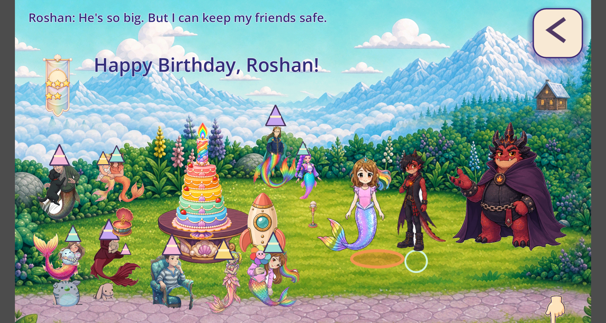
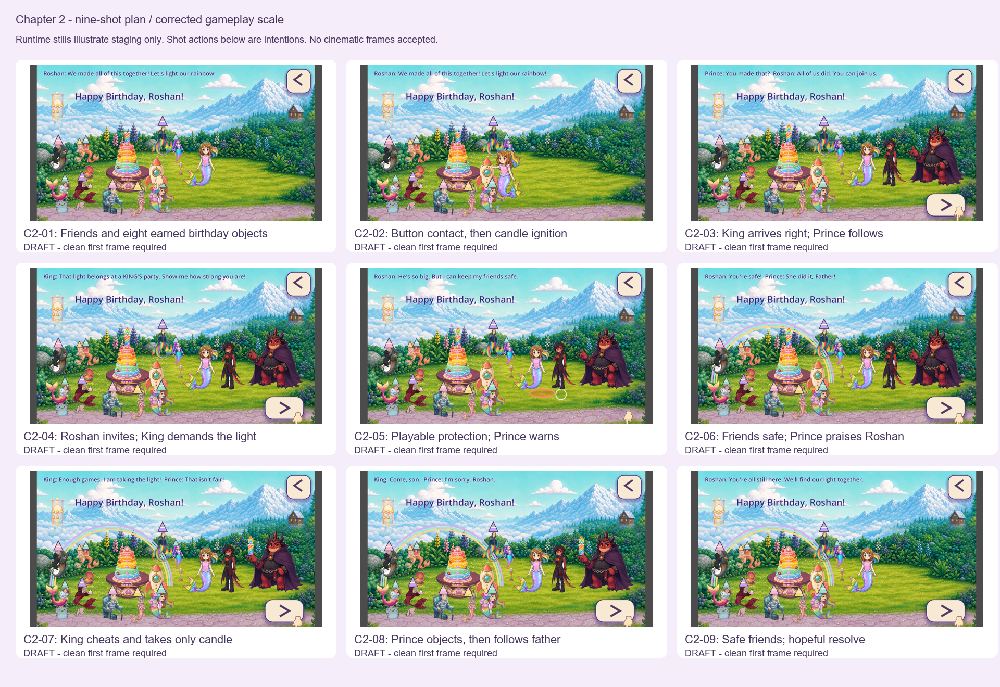

# Chapter 2 — Sky Lagoon birthday and candle theft

Owner-run Grok handoff, scale refinement V2. Nothing has been sent to Grok.

Read [the scale contract](SCALE_CONTRACT.json), inspect [the nine-shot board](SHOT_BOARD.png), and use [the planning request](GROK_COPY_PASTE.txt). The board and runtime captures are reference evidence only. Individual shot prompts are under `shots/C2-01` through `shots/C2-09`.

## Corrected scale

At a shared ground plane, Roshan is 215 visible pixels high, the Prince 230.4, and the King 288. Previously the King was 2.12 times Roshan's visible height; now he is 1.34 times. The Prince stays exactly 80% of his father's height, as required by his recovered approved identity card. Widths retain the original artwork proportions.

The candle's display frame shrinks from 148 to 90 pixels high and stays identical on the cake and in the King's hand. Roshan's final fingertip touches the upper central brass button above the rocket porthole. Guests move into the lawn staging; stuffies read as toys. The original native Sky Lagoon artwork and its middle-screen crop remain intact. The distant cabin is on a hillside, not the actors' ground plane. Do not fit the full three-screen panorama into a single shot.

The earlier six C2-02 generation attempts are unaccepted and have no framing or scale authority. Refine every future clean first frame from this consistent staging and the approved identity sources.

## Story and objects

Roshan's eight jobs produce one six-tier cake with five candied strawberries, the five-star birthday banner, the ballet stuffies and music box, Rumi's musical staging and microphone, the parked rocket, and the discovered rainbow candle. [JOB_HANDOFFS.json](JOB_HANDOFFS.json) records the precise minigame-to-object mapping. No playground equipment belongs in this final act.

Roshan protects her friends through three forgiving bunny-style boss rounds. The Prince's kindness is sincere, with conflicted loyalty and only a light hint of future affection. After Roshan succeeds, the King cheats and takes only the candle. The friends and every other earned object remain safe. His theft, rather than a forced player defeat, drives the next chapter.

## Readiness

Archive payload is locally assembled; its independent remote-verification record establishes publication. **GENERATION_READY: false. DELIVERY_ACCEPTED: false.** All nine cards remain DRAFT until their individual clean first frames and bindings receive human review. This is a complete planning/reference handoff, not an instruction to launch generation immediately. Grok video remains motion/editorial reference unless the separate full-frame delivery rules are proven frame by frame.

Owner visual review, target-device performance and child playtesting remain open. The approved source identities are preserved; the revised staging ratio is an implementation candidate.

