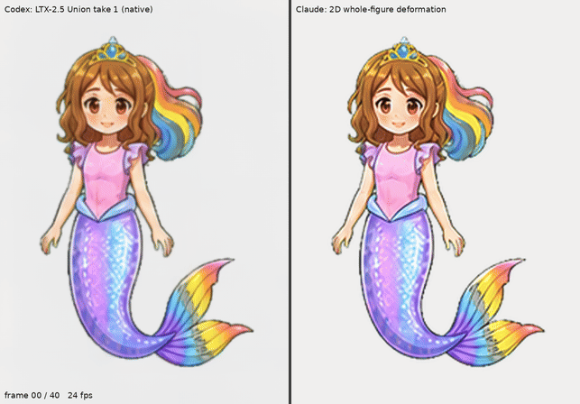

# Roshan wave: whole-figure 2D deformation (no generative model)

Status: `REFERENCE_ONLY`, owner-commissioned 2026-10-05. Baseline `f73236759755fd220cc495cc48f9e822a3d65ced` (dev).
This packet makes no runtime change, accepts no production asset, and closes no finding.

The owner reported that Codex was struggling with the animation and asked for the same
hand-raising gesture, noting "LTX is an option, but not the only option". This study keeps
Codex's exact beat timeline and canvas but swaps the medium. It uses no video model and
no ImageGen. Every frame is built only from the four approved painted wave keys in
`assets/characters/roshan_25d/roshan_gesture_a.png` (row 0), so hands and fingers cannot
smear. The method runs locally on a CPU and is fully reproducible.

## Review footage

- [Side-by-side, 24 fps](comparison/comparison_codex_vs_claude.mp4) and
  [frame-step, 6 fps](comparison/comparison_frame_step_6fps.mp4). Left: Codex's published
  [LTX-2.5 Union take 1](https://github.com/Ebonyks/mermaid-roshan-reef/tree/405cb1c6d4869c15edd032494c83f383d6e3e398/assets_src/cinematics/ltx25_union_trial_20261004)
  native frames, unmodified ([source hashes](comparison/codex_source.json)). Right: this
  study, drawn into the same 640×896 canvas. A uniform scale of 3.2025 is fitted to Codex's
  own K0 guide (NCC 0.998, [fit](data/codex_canvas_fit.json)).
- [Hand close-ups](comparison/hand_closeups.png) at frames 6, 10, 17, 20, 22, 24, 26 and 30,
  cropped to the same window in both takes.
- [Contact sheet](review/contact_sheet.png), [review movie](review/wave_review.mp4) and
  [native 256 px at 3× nearest-neighbour](review/wave_native256_x3_nearest.mp4).
- The authoritative pixels are the [41 native frames](frames/native/) (256×256 RGBA, the
  runtime cell size) and the [layered Aseprite master](wave_master.aseprite). The MP4 files
  are H.264 CRF 12–15 yuv420p viewing copies.

## Timeline (same as Codex's wave studies)

41 frames at 24 fps (1708 ms). The approved keys are K0 rest, K1 hand at shoulder,
K2 overhead and K3 lowering.

| Frames | Beat | Keys |
|---|---|---|
| 0–3 | Rest with a small anticipation tuck. Frame 0 is K0 verbatim. | K0 |
| 3–7 | Rise to the shoulder. The elbow leads and the hand trails. | K0 → K1 |
| 7–17 | Rise overhead. | K1 → K2 |
| 17–27 | Wave and lower to head height. Codex's "mid-lowering 22" is an in-between here; no redrawn key is needed. | K2 → K3 |
| 27–36 | Lower to rest. The elbow drops first and the hand follows. | K3 → K0 |
| 36–40 | Settle. Hair and tail finish their follow-through. Frame 40 is K0 verbatim. | K0 |

Frame-by-frame source drawings are in [`data/frame_sources.json`](data/frame_sources.json).

## Method

1. **Layers from approved pixels.** Each key is split into the waving arm and an arm-free
   body. The arm is the connected skin component from the palm plus its 1.5 px outline.
   An outline is kept on both layers only where it borders the bodice or sleeve. Body
   pixels that the arm covered are filled from another key's body, mapped through
   correspondences (K2's hair behind the raised arm comes from K0, for example). The fill
   stays inside the body silhouette, and nothing is invented. See [`layers/`](layers/).
2. **Body correspondences.** The study annotates 13 anchors on K0 (crown, eyes, mouth,
   neck, waist, other arm, fin tips, ponytail) and template-matches them into K1–K3. It
   then tracks 154 more feature and silhouette points, filtering them for consistency.
   That gives 167 correspondences valid in all four keys
   ([data](data/correspondences.json)). The waist root is fixed at K0's position.
3. **Timing.** Body points and arm joint angles and lengths are interpolated through the
   keys with a non-uniform Catmull-Rom Hermite, with zero velocity at rest. Overlap and
   follow-through give each part its own lag: hair 1.5 frames, the other arm and tail 2,
   ponytail 3, fin 4, forearm 1.2 and hand 2. A small anticipation lean and a 2.2° head
   tilt toward the raised hand complete the figure-wide acting.
4. **Deformation.** The body uses moving-least-squares rigid deformation (Schaefer et al.
   2006). The arm uses per-segment rigid maps (upper arm, forearm, hand) blended at the
   joints. A hidden shoulder cap, the arm's own root cross-section, sits under the body so
   rotation never opens a gap. The source sleeve is drawn back over the arm root.
5. **Drawing switches, never blends.** The arm source is the key nearest the current
   pose, and the body changes drawing twice (K0 → K2 at frame 5, K2 → K0 at frame 32).
   Every output pixel is one spatial resample of one approved drawing. There is no
   cross-dissolve, no optical-flow or temporal interpolation, and no generated pixels.
6. **Aseprite bridge.** [`wave_master.aseprite`](wave_master.aseprite) holds the visible
   `final` layer plus hidden `body`, `arm`, `cap_under_body` and `sleeve_over_arm` layers
   for touch-ups, with 24 fps durations and beat tags. A project script wrote it to the
   published file specification (`scripts/aseprite_io.py`). It has **not yet been opened
   in Aseprite**, because no binary is available in this environment.

These are declared 2D cutout/keyed animation, local deformation and tweening under
`DL-MOT-14`. The motion is genuinely whole-figure: shoulder, torso lean, head, hair, other
arm, tail and fin all move, and the body also follows the geometry drawn in all four
keys. This differs from the owner-rejected limb-only correction, which kept the body
frozen. The arm is still its own layer, so the owner decides whether this meets the
2026-10-04 coherent-figure direction.

## Machine verification

[`verification.json`](verification.json) records 21 checks, all PASS:

- The approved atlas hash is unchanged.
- There are 41 frames of 256×256 RGBA, and nothing touches the cell border.
- Frames 0 and 40 are byte-identical to the approved K0 cell, which gives a clean
  transition to and from idle.
- Six frames re-render pixel-identically.
- The waist root target stays within 0.607 px; Codex's study tolerance is 1 px.
- The eye spacing, crown–waist, neck–waist and crown–neck target distances stay inside the
  approved keys' own measured range, so there is no scale drift beyond the drawings.
- The master's `final` layer equals every exported PNG and totals 1708 ms. This round trip
  uses the project reader, not Aseprite.

Rebuild everything with [`scripts/run_all.sh`](scripts/run_all.sh). It needs Python with
numpy, scipy, opencv-python-headless and pillow, plus ffmpeg and git, and takes about six
minutes on four CPU cores. [`manifest.json`](manifest.json) lists every file's SHA-256 and
the sorted payload hash. These checks are machine checks only.

## Known defects (agent review, not owner review)

- **Shoulder seam.** Small notches and speckles where the arm root meets the sleeve and
  hair, most visible around frames 12 and 22 at 3× zoom.
- **Elbow fold.** The inner elbow is soft when the straight K2 arm is bent (frames 12–16)
  or the bent K1/K3 arm is straightened. Four keys cannot cover every elbow angle.
- **Drawing changes.** The arm changes drawing at frames 7 (relaxed to open hand), 12 and
  23 (open to open) and 33 (open to relaxed). The body changes at frames 5 and 32, which changes the face (closed to open
  smile) and the tail sparkle pattern. These are deliberate drawing changes, but they may
  read as pops when stepping frame by frame.
- **Straight-out arm.** The rise and lowering pass through a straight-out arm (frames 5–6
  and 31–33). It is readable but stiffer than a drawn in-between.
- **Ragged hair fill.** The donor-filled hair behind K2's raised arm has a slightly ragged
  edge, at about x 83–90, y 45–90 in the cell.
- **Resolution ceiling.** The review canvas is a 3.2× upscale of 256 px art, so it is
  softer than LTX's native 640×896, and detail is capped by the approved atlas. In the
  game the cell is 256 px.

Human identity, topology, motion and seam review, runtime atlas packing (`MA-ROSHAN-003`),
device playback, child review and owner acceptance are all outstanding.

## Cost

No ImageGen, video-model, paid-API or model-download calls were made; only the four pip
packages above were installed. A full CPU rebuild takes about 6 minutes. Annotation and
iteration time was not metered.

## Options after this study

- **Use this as the base.** Fix the shoulder seam in the master's hidden layers. If the
  owner wants smoother rises, commission one or two named in-between keys (for example, an
  open hand at mid-rise) under `DL-ASSET-02` and add them to the same switch-not-blend
  pipeline.
- **Use it to steer LTX.** This sequence is a coherent, painted, whole-figure motion source.
  It could replace the schematic outlines in a Union or IC-LoRA control or video-to-video
  pass, with LTX used only for added life. Generated hands would then need the same smear
  review again.
- **Other generators.** Keyframe interpolators (FILM, RIFE) ghost on arm swings this large.
  ToonCrafter and Wan first/last-frame video need a GPU and face the same hand-detail risk
  that LTX did.
