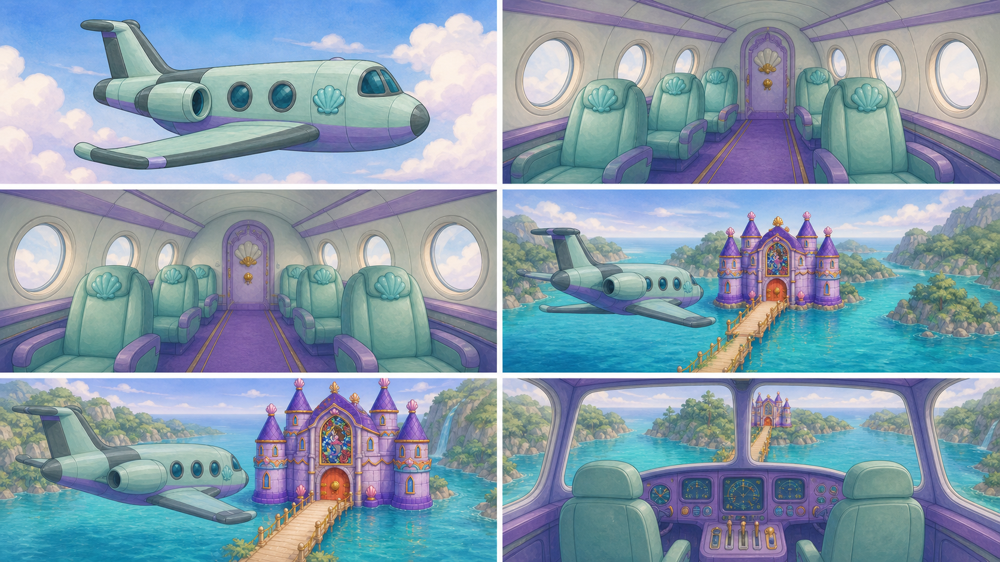
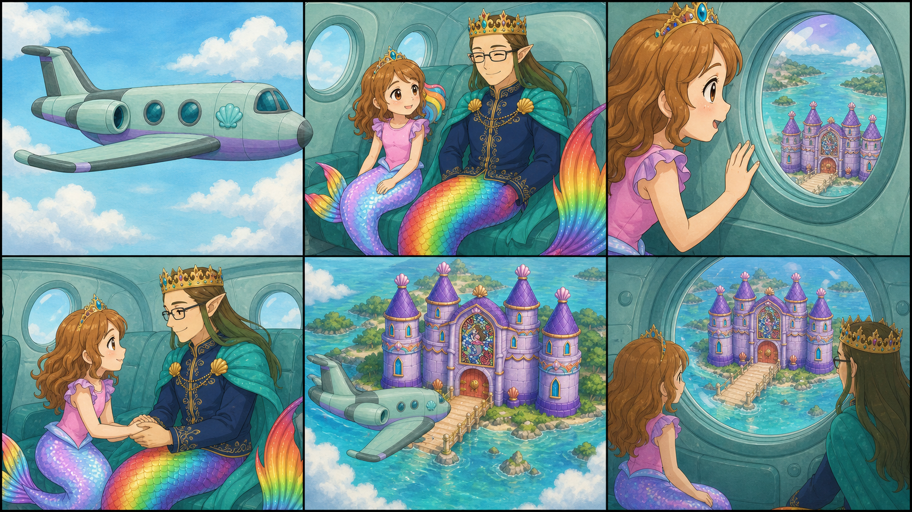

# D1-C00 — Opening Flight — Roshan and Daddy

> `ARCHIVE_COMPLETE`: true
> `GENERATION_READY`: false  
> `DELIVERY_ACCEPTED`: false  
> Grok output remains motion/editorial reference until the independent full-frame delivery audit passes.

## Use this one-link handoff

1. Review the location-depth sheet, storyboard, and character locks below.
2. Paste the shared guide once, then the scene guide.
3. Generate one shot job at a time with two to four separately approved pixel authorities.
4. Never upload either generated sheet below as `IMAGE_1` or as delivery pixels.

## Multi-angle environment depth



This is a newly generated, complete flattened narrative/topology reference. It demonstrates spatial depth and camera possibilities, but it is not an approved shot opening frame.

## Shot-aligned storyboard



| Shot | Authored visible beat |
|---|---|
| D1-C00-S01 | Wide exterior. |
| D1-C00-S02 | Interior cabin two-shot. |
| D1-C00-S03 | Roshan discovery close shot from inside the plane. |
| D1-C00-S04 | Medium two-shot in the same cabin. |
| D1-C00-S05 | Exterior reveal from behind and slightly above the exact pearl plane. |
| D1-C00-S06 | Interior forward-facing two-shot using the accepted cabin layout and both exact identities. |

## Character reference guide

| Character | Approved identity | Immutable traits | Reject |
|---|---|---|---|
| roshan |  | child face and age; brown hair with rainbow section; pink top and tiara | legs or shoes; adult redesign |
| daddy |  | adult crowned father; dark rectangular glasses; navy and gold clothing with teal cape | generic king; missing glasses or tail |

## Location authority


- Fixed entrance/exit geography, landmark order, fixture count, and scale.
- Generated angles must describe one connected volume.
- Reject invented doors, basins, platforms, duplicated fixtures, or room rotation.

## Written guides

- [Shared style and character guide](written_guide/SHARED_STYLE_AND_CHARACTER_GUIDE.txt)
- [Exact scene setup and shot copy blocks](written_guide/SCENE_GUIDE.txt)
- [Source document hashes](written_guide/SOURCE_DOCUMENTS.json)

<details>
<summary>Exact scene guide — expand to copy</summary>

```text
D1-C00 — OPENING FLIGHT: ROSHAN AND DADDY

VIDEO SETUP BLOCK — PASTE ONCE
Create six separate clips totaling 24–30 seconds. Story mission: establish Roshan and Daddy safely traveling in the exact pearl plane, let Roshan discover the Sky Lagoon world and end with both preparing to land. Use the approved Roshan front/rear identities, Daddy identity, exact pearl-plane reference, approved Sky Lagoon geography, and exact four-tower Pearl Castle. The emotional progression is wonder, reassurance through real hand contact, then shared anticipation. Do not add an otter, wildlife subplot, generic king, airplane redesign, crown change, castle redesign, or geography jump. Generate each numbered shot as its own job and assemble with straight cuts.

SHOT D1-C00-S01 COPY BLOCK
Wide exterior. The exact pearl plane glides steadily through open pastel morning clouds. Preserve plane silhouette, window count, wings, tail, pearl material, and scale. Camera makes one gentle parallel drift; the plane remains stable and does not transform. End with clearer sky opening ahead but Sky Lagoon not yet visible. No characters outside the plane, no other aircraft, no castle yet. Sound: temporary soft wind and pearl-engine hum; no voices.

SHOT D1-C00-S02 COPY BLOCK
Interior cabin two-shot. Roshan and Daddy sit together inside the same pearl plane, both with one continuous mer-tail and exact approved clothes, faces, hair, crown, glasses, and colors. The cabin architecture and windows remain fixed. Roshan leans toward the window with curiosity while Daddy watches her warmly. Locked camera, restrained natural breathing and hair motion. End on Roshan noticing something outside. Sound: temporary quiet cabin hum; no voices.

SHOT D1-C00-S03 COPY BLOCK
Roshan discovery close shot from inside the plane. Use exact child Roshan identity and preserve the established window/cabin orientation. She brightens, lifts one hand toward the window, and looks out with wonder; her rainbow hair section and continuous tail remain correct. Make one subtle push-in only. End on her delighted gaze, leaving clear eye-line space toward the unseen lagoon. No adult proportions or extra limbs. Sound: temporary cabin hum and a light wonder chime; no voices.

SHOT D1-C00-S04 COPY BLOCK
Medium two-shot in the same cabin. Daddy calmly reaches and takes Roshan's hand with anatomically correct contact; Roshan looks from the window back to him. Preserve Daddy's crown, dark rectangular glasses, long hair, navy/gold coat, teal cape, exact tail, and Roshan's exact identity. Locked camera. End with their hands visibly joined and both smiling toward the window. No floating hands, fused fingers, generic king, or embrace. Sound: temporary warm music lift and cabin hum; no voices.

SHOT D1-C00-S05 COPY BLOCK
Exterior reveal from behind and slightly above the exact pearl plane. The clouds part to reveal the approved continuous Sky Lagoon geography and exact four-tower Pearl Castle at correct scale in the distance. One slow camera pullback reveals the landscape; plane and castle do not redesign or jump position. End with a readable route from sky to lagoon dock. No invented islands, extra towers, wildlife, or small fountain castle. Sound: temporary airy reveal swell and distant water; no voices.

SHOT D1-C00-S06 COPY BLOCK
Interior forward-facing two-shot using the accepted cabin layout and both exact identities. Sky Lagoon is now visible through the correct window direction. Roshan and Daddy release their handhold naturally, orient forward, and brace gently for landing with excited calm. Locked camera; no turbulence. End on both ready and the plane beginning a smooth descent outside the window, matching D1-C01's landed-plane geography. Sound: temporary soft descent hum and hopeful music cadence; no voices.
```
</details>

## Provenance and audit state

- [Archive manifest](HANDOFF_PACKET.json)
- [Imagine status contract](IMAGINE_HANDOFF.json)
- [Perspective prompt](storyboards/PERSPECTIVE_PROMPT.txt)
- [Storyboard prompt](storyboards/STORYBOARD_PROMPT.txt)
- [Generation result IDs](storyboards/GENERATION_RESULTS.json)

Both generated sheets are `appearance_authority:false`, `bound_reference_eligible:false`, and `used_as_delivery_pixels:false` in the archive manifest. Human owner review remains required before any generated angle becomes a production authority.
