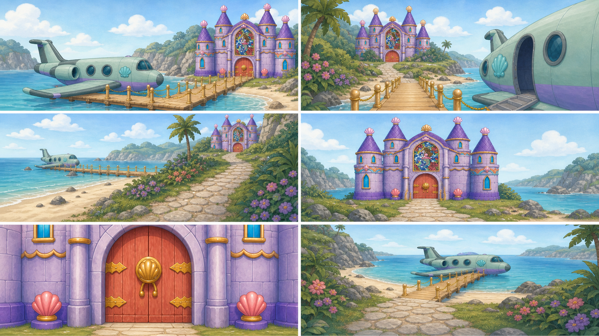
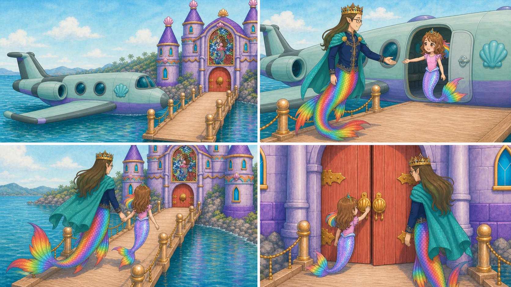
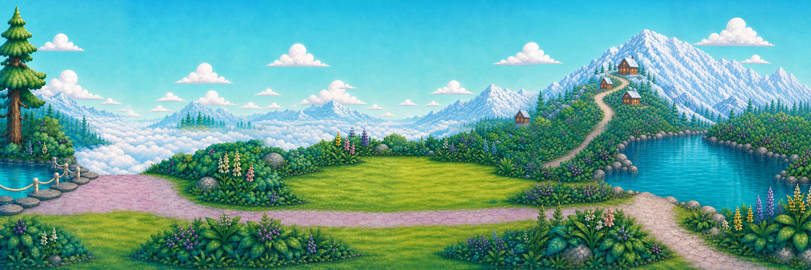

# D1-C01 — Lagoon Landing and Castle Approach

> `ARCHIVE_COMPLETE`: true
> `GENERATION_READY`: false  
> `DELIVERY_ACCEPTED`: false  
> Grok output remains motion/editorial reference until the independent full-frame delivery audit passes.

## Use this one-link handoff

1. Review the location-depth sheet, storyboard, and character locks below.
2. Paste the shared guide once, then the scene guide.
3. Generate one shot job at a time with two to four separately approved pixel authorities.
4. Never upload either generated sheet below as `IMAGE_1` or as delivery pixels.

## Multi-angle environment depth



This is a newly generated, complete flattened narrative/topology reference. It demonstrates spatial depth and camera possibilities, but it is not an approved shot opening frame.

## Shot-aligned storyboard



| Shot | Authored visible beat |
|---|---|
| D1-C01-S01 | Wide dock exterior. |
| D1-C01-S02 | Medium dock shot. |
| D1-C01-S03 | Traveling two-shot through the approved lagoon path. |
| D1-C01-S04 | Low wide-to-medium view facing the exact closed Pearl Castle doors as Roshan and Daddy arrive together. |

## Character reference guide

| Character | Approved identity | Immutable traits | Reject |
|---|---|---|---|
| roshan |  | child face and age; brown hair with rainbow section; pink top and tiara | legs or shoes; adult redesign |
| daddy |  | adult crowned father; dark rectangular glasses; navy and gold clothing with teal cape | generic king; missing glasses or tail |

## Location authority



- Fixed entrance/exit geography, landmark order, fixture count, and scale.
- Generated angles must describe one connected volume.
- Reject invented doors, basins, platforms, duplicated fixtures, or room rotation.

## Written guides

- [Shared style and character guide](written_guide/SHARED_STYLE_AND_CHARACTER_GUIDE.txt)
- [Exact scene setup and shot copy blocks](written_guide/SCENE_GUIDE.txt)
- [Source document hashes](written_guide/SOURCE_DOCUMENTS.json)

<details>
<summary>Exact scene guide — expand to copy</summary>

```text
D1-C01 — LAGOON LANDING AND CASTLE APPROACH

VIDEO SETUP BLOCK — PASTE ONCE
Create four separate clips totaling 10–12 seconds. Start with the exact pearl plane settling at the approved Sky Lagoon dock and end with Roshan and Daddy directly before the closed Pearl Castle doors. Preserve the approved lagoon panorama, dock-to-castle route, exact four-tower castle, exact plane, Roshan identity, and Daddy identity. Their travel must be continuous and physically readable. Daddy offers his hand and waits for Roshan. The final door size, hinge side, and inward opening direction must carry into D1-C02. No otter, extra escort, teleport, geography jump, redesigned castle, or plane-scale drift.

SHOT D1-C01-S01 COPY BLOCK
Wide dock exterior. The exact pearl plane completes a gentle settling motion beside the approved Sky Lagoon dock; small graphic ripples spread from contact while the fixed lagoon and four-tower castle geography remain unchanged. One short camera settle, no pan. End with the plane stationary, door aligned to the dock, and the castle route visible. No crash, splash wall, invented dock, or plane redesign. Sound: temporary soft water lap and engine winding down; no voices.

SHOT D1-C01-S02 COPY BLOCK
Medium dock shot. Daddy exits the stationary pearl plane first, turns back, and offers one open hand to Roshan, then waits. Preserve exact Daddy crown, glasses, coat, cape, hair, and continuous tail; preserve Roshan inside the doorway with exact identity. Locked camera. End just as Roshan places her hand in his with correct contact. No pulling, floating hands, legs, or additional characters. Sound: temporary water ambience and gentle fabric/pearl movement; no voices.

SHOT D1-C01-S03 COPY BLOCK
Traveling two-shot through the approved lagoon path. Roshan and Daddy move together hand-in-hand from dock toward the exact four-tower castle, their tails propelling naturally and their scale stable against the environment. One smooth side-follow camera move only. End near the castle forecourt with the same doors ahead. No teleport, new bridge, invented wildlife, changed costumes, or castle enlargement. Sound: temporary lagoon water, light magical ambience, no voices.

SHOT D1-C01-S04 COPY BLOCK
Low wide-to-medium view facing the exact closed Pearl Castle doors as Roshan and Daddy arrive together. One gentle push-in makes the doors fill the frame while preserving door seam, hinges, handles, surrounding pearl architecture, and the established inward-opening direction. End with Roshan nearest the handle, Daddy beside and slightly behind her, both identities exact. Doors remain closed for the cut. Sound: temporary lagoon ambience falling quiet and a soft anticipatory chord; no voices.
```
</details>

## Provenance and audit state

- [Archive manifest](HANDOFF_PACKET.json)
- [Imagine status contract](IMAGINE_HANDOFF.json)
- [Perspective prompt](storyboards/PERSPECTIVE_PROMPT.txt)
- [Storyboard prompt](storyboards/STORYBOARD_PROMPT.txt)
- [Generation result IDs](storyboards/GENERATION_RESULTS.json)

Both generated sheets are `appearance_authority:false`, `bound_reference_eligible:false`, and `used_as_delivery_pixels:false` in the archive manifest. Human owner review remains required before any generated angle becomes a production authority.
