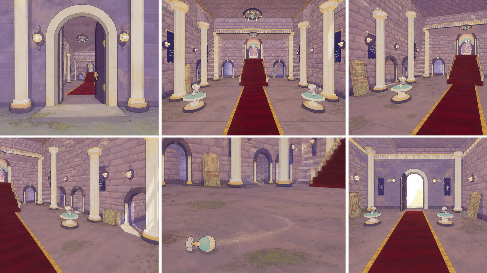
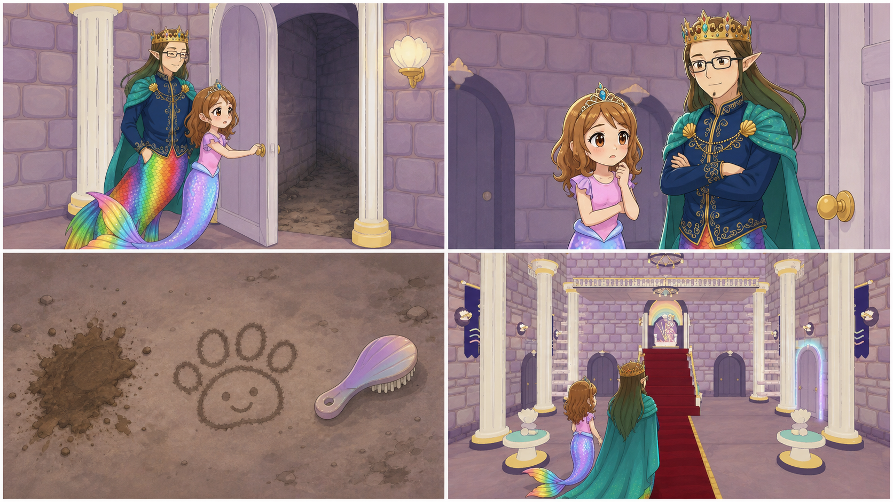
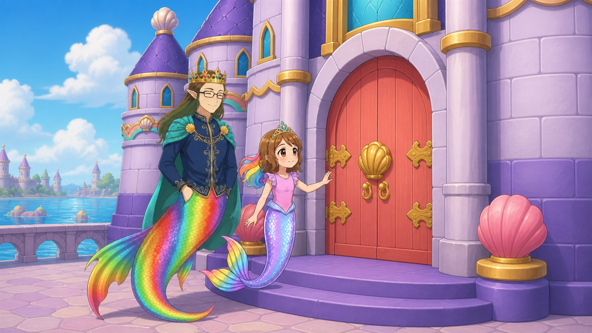
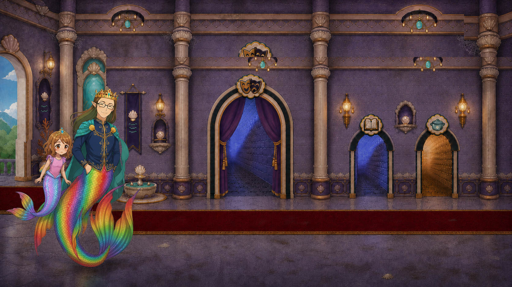
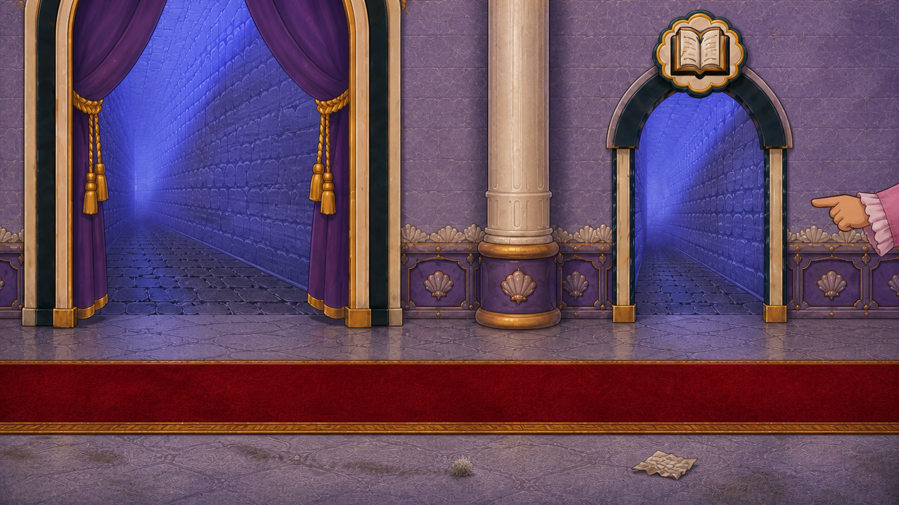
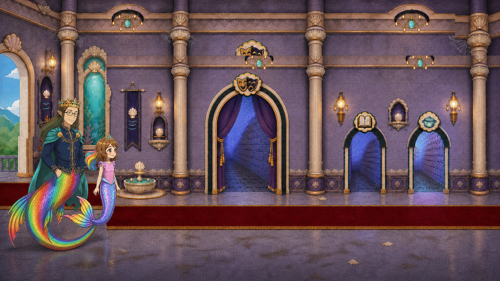

# D1-C02 — First Dirty Castle Discovery

> `ARCHIVE_COMPLETE`: true
> `GENERATION_READY`: false<br>
> `DELIVERY_ACCEPTED`: false<br>
> Grok output remains motion/editorial reference until the independent full-frame delivery audit passes.

## Use this one-link handoff

1. Review the location-depth sheet, storyboard, and character locks below.
2. Paste the shared guide once, then the scene guide.
3. Generate one shot job at a time with two to four separately approved pixel authorities.
4. Never upload either generated sheet below as `IMAGE_1` or as delivery pixels.

## Multi-angle environment depth



This is a newly generated, complete flattened narrative/topology reference. It demonstrates spatial depth and camera possibilities, but it is not an approved shot opening frame.

## Shot-aligned storyboard



| Shot | Authored visible beat |
|---|---|
| D1-C02-S01 | Exterior-to-threshold shot inheriting the accepted D1-C01 endpoint. |
| D1-C02-S02 | Geometry-locked first interior orientation from the left entrance facing approved Main Hall screen A. |
| D1-C02-S03 | Close environmental inspection within the same hall: a readable grime patch, a small friendly dust-bunny trace, and one misplaced harmless scrap sit naturally against the pearl floor and molding. |
| D1-C02-S04 | Wide coherent Main Hall orientation. |

## Character reference guide

| Character | Approved identity | Immutable traits | Reject |
|---|---|---|---|
| roshan |  | child face and age; brown hair with rainbow section; pink top and tiara | legs or shoes; adult redesign |
| daddy |  | adult crowned father; dark rectangular glasses; navy and gold clothing with teal cape | generic king; missing glasses or tail |

## Location authority


- Fixed entrance/exit geography, landmark order, fixture count, and scale.
- Generated angles must remain inside one named screen authority; screen A and
  screen B may never be merged into an invented third perspective.
- Screen A has no stair, balcony, or throne. Screen B has one short right stair
  and no balcony.
- Reject invented doors, basins, platforms, duplicated fixtures, unsupported
  reverse walls, or room rotation.
- [Machine-readable geometry lock and rejection history](LOCATION_GEOMETRY_LOCK.json)

## Geometry-locked first-frame candidates

These complete frames passed Sol topology review. Human topology, identity, and
style approval remains pending, so none is yet eligible as Grok `IMAGE_1`.

| Shot | Candidate | Current disposition |
|---|---|---|
| D1-C02-S01 |  | Blocked until the accepted D1-C01-S04 endpoint is available for inheritance/comparison. |
| D1-C02-S02 |  | Screen-A landmark order passes; human review pending. |
| D1-C02-S03 |  | Central portal → column → book portal crop passes; human review pending. |
| D1-C02-S04 |  | Screen-A wide orientation passes; human review pending. |

[First-frame review record](first_frames/FIRST_FRAME_REVIEW.json)

## Written guides

- [Shared style and character guide](written_guide/SHARED_STYLE_AND_CHARACTER_GUIDE.txt)
- [Exact scene setup and shot copy blocks](written_guide/SCENE_GUIDE.txt)
- [Source document hashes](written_guide/SOURCE_DOCUMENTS.json)

<details>
<summary>Exact scene guide — expand to copy</summary>

```text
D1-C02 — FIRST DIRTY CASTLE DISCOVERY

VIDEO SETUP BLOCK — PASTE ONCE
Create four separate clips totaling 8–10 seconds. This is the master dirty-entry grammar: cause, reaction, evidence, route. Begin on the exact exterior castle-door endpoint from D1-C01. Reveal the current Pearl Castle Main Hall as a coherent large interior with safe accumulated grime and friendly dust-bunny evidence. End with only the Bubble Bathroom route glowing as the next destination. Use approved Roshan and Daddy identities and current Main Hall architecture. The door opens inward exactly as established. Dirty lighting is dingy but child-safe. No horror, dangerous debris, invented hall, glowing all doors, cleaning before gameplay, or character drift.

SHOT D1-C02-S01 COPY BLOCK
Exterior-to-threshold shot inheriting the accepted D1-C01 endpoint. Roshan pushes the exact Pearl Castle door and it opens inward on its established hinges; Daddy remains beside and slightly behind her. One slow forward camera move follows the opening but does not cross the threshold. End with a narrow first view of the dim dirty Main Hall. Preserve both exact mermaid identities and continuous tails. Sound: temporary pearl-door creak and quiet room tone; no voices.

SHOT D1-C02-S02 COPY BLOCK
Geometry-locked first interior view from just inside the left entrance, facing the approved Main Hall screen-A wall in its established side-elevation camera family. Roshan and Daddy pause together near the entrance and react with concern, not fear. Preserve the exact left-to-right screen-A sequence: partial exterior arch, vertical entrance carpet, tall aqua window, pearl fountain, large purple-curtained central portal, book-emblem portal, then aqua bubble-emblem portal. All three portals remain open to the floor. Screen A has no stair, balcony, or throne. Dusty pearl surfaces, dull lavender shadows, and safe scattered grime belong to this exact room view. Locked camera. End with Roshan leaning forward to inspect while Daddy stays reassuringly close. No unsupported reverse wall, merged screen B, extra characters, dramatic horror light, or generic ruined castle. Sound: temporary muted hall ambience and a soft concerned music note; no voices.

SHOT D1-C02-S03 COPY BLOCK
Close environmental inspection within the same hall: a readable grime patch, a small friendly dust-bunny trace, and one misplaced harmless scrap sit naturally against the pearl floor and molding. Roshan's hand enters only to point without touching or cleaning. One short lateral camera move. End with the evidence clearly understood. No UI markers, clip-art trash, insects, danger, or cleanup completion. Sound: temporary tiny dust rustle and room ambience; no voices.

SHOT D1-C02-S04 COPY BLOCK
Wide coherent Main Hall orientation. Roshan and Daddy stand together near the entrance; the dirty hall extends around them with all room doors fixed. Only the Bubble Bathroom route gains a gentle aqua-lavender glow while every other route stays dim. One slow pullback reveals the route and preserves room topology. End with Roshan looking toward the bathroom door and Daddy following her gaze. No text, arrows, HUD, or multiple glowing doors. Sound: temporary magical route chime and restrained hall ambience; no voices.
```
</details>

## Provenance and audit state

- [Archive manifest](HANDOFF_PACKET.json)
- [Imagine status contract](IMAGINE_HANDOFF.json)
- [Perspective prompt](storyboards/PERSPECTIVE_PROMPT.txt)
- [Storyboard prompt](storyboards/STORYBOARD_PROMPT.txt)
- [Generation result IDs](storyboards/GENERATION_RESULTS.json)

Both generated sheets are `appearance_authority:false`, `bound_reference_eligible:false`, and `used_as_delivery_pixels:false` in the archive manifest. Human owner review remains required before any generated angle becomes a production authority.
