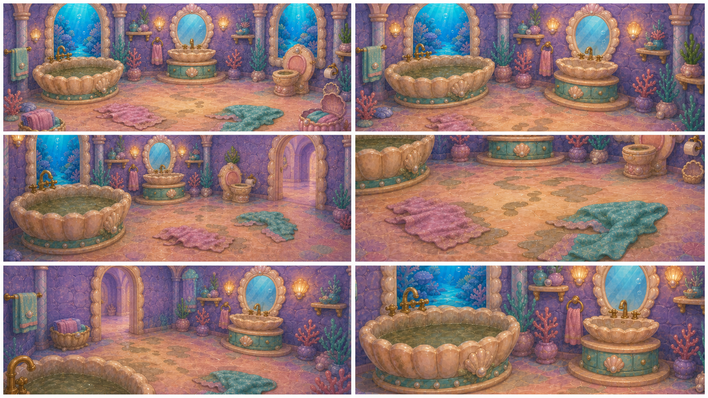
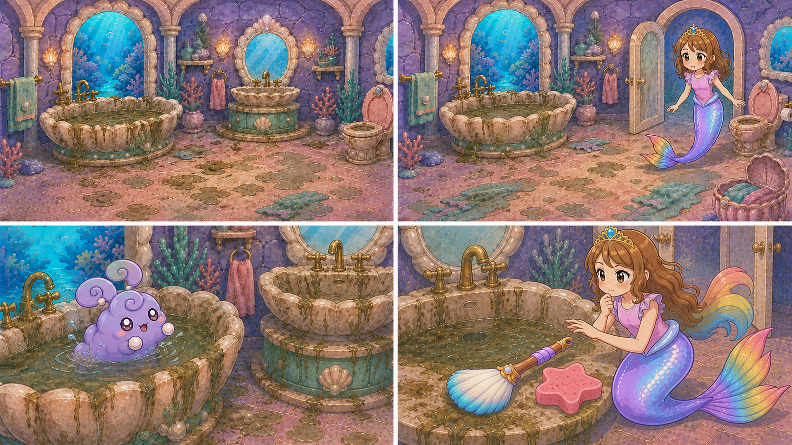
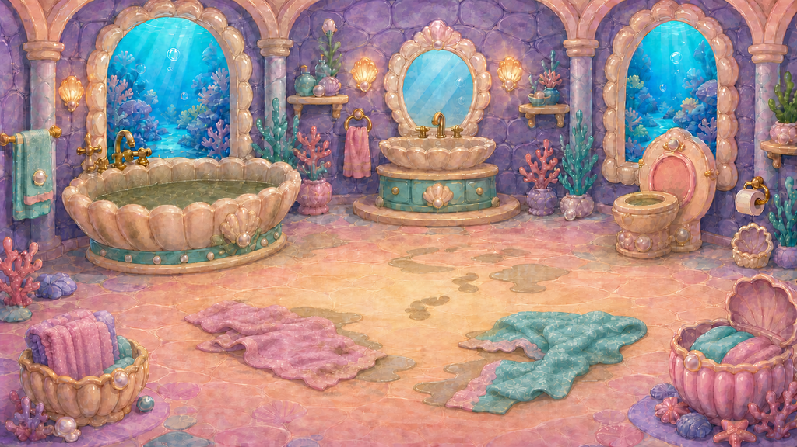

# D1-C03 — Bubble Bathroom — Dirty Entry

> `ARCHIVE_COMPLETE`: false  
> `GENERATION_READY`: false  
> `DELIVERY_ACCEPTED`: false  
> Grok output remains motion/editorial reference until the independent full-frame delivery audit passes.

## Use this one-link handoff

1. Review the location-depth sheet, storyboard, and character locks below.
2. Paste the shared guide once, then the scene guide.
3. Generate one shot job at a time with two to four separately approved pixel authorities.
4. Never upload either generated sheet below as `IMAGE_1` or as delivery pixels.

## Multi-angle environment depth



This is a newly generated, complete flattened narrative/topology reference. It demonstrates spatial depth and camera possibilities, but it is not an approved shot opening frame.

## Shot-aligned storyboard



| Shot | Authored visible beat |
|---|---|
| D1-C03-S01 | Wide empty dirty Bathroom layout lock before Roshan enters. |
| D1-C03-S02 | Inherit the approved dirty layout. |
| D1-C03-S03 | Close shot of the established dirty bathtub. |
| D1-C03-S04 | Medium reverse toward Roshan, dirty sink, and established cleaning tools. |

## Character reference guide

| Character | Approved identity | Immutable traits | Reject |
|---|---|---|---|
| roshan |  | child face and age; brown hair with rainbow section; pink top and tiara | legs or shoes; adult redesign |
| swimming_bunny |  | round lavender aquatic fluff; spiral ear curls; pearl paws and large warm eyes | land-bunny legs; duplicate or smoke form |

## Location authority



- Fixed entrance/exit geography, landmark order, fixture count, and scale.
- Generated angles must describe one connected volume.
- Reject invented doors, basins, platforms, duplicated fixtures, or room rotation.

## Written guides

- [Shared style and character guide](written_guide/SHARED_STYLE_AND_CHARACTER_GUIDE.txt)
- [Exact scene setup and shot copy blocks](written_guide/SCENE_GUIDE.txt)
- [Source document hashes](written_guide/SOURCE_DOCUMENTS.json)

<details>
<summary>Exact scene guide — expand to copy</summary>

```text
D1-C03 — BUBBLE BATHROOM: DIRTY ENTRY

VIDEO SETUP BLOCK — PASTE ONCE
Create four separate clips totaling 8–10 seconds. Start as Roshan crosses from the Main Hall into the current Bubble Bathroom. Preserve the approved bathroom's single-bathtub topology, pearl fixtures, entrance, sink, tools, dirty runtime state, Roshan identity, and the approved swimming dust bunny. The tub water and fixtures look neglected but safe. End with Roshan understanding that the tub, trapped swimmer, sink, and tools need her help. This is discovery only: no cleaning or restored water. No second bathtub, room rotation error, generic bathroom, land bunny in the tub, extra Roshan, or clip-art grime.

SHOT D1-C03-S01 COPY BLOCK
Wide empty dirty Bathroom layout lock before Roshan enters. Show one bathtub only, the established sink and cleanup tools, coherent walls and floor, dim dingy aqua-lavender light, built-in grime, and murky tub water. Locked camera with restrained dirty-water movement. End holding the entrance clear for Roshan. No character yet, no clean sparkle, no duplicated fixtures. Sound: temporary distant drip and dull room ambience; no voices.

SHOT D1-C03-S02 COPY BLOCK
Inherit the approved dirty layout. Roshan crosses the threshold cautiously with exact child face, rainbow hair section, clothes, and one continuous mer-tail. One short camera follow stops inside the room. She looks from the murky bathtub to the dirty sink. End with her body fully inside and the entrance still spatially correct. No legs, shoes, room redesign, or cleaning action. Sound: temporary soft tail movement, water drip, no voices.

SHOT D1-C03-S03 COPY BLOCK
Close shot of the established dirty bathtub. The one approved swimming dust bunny paddles weakly but safely in murky water, remaining one coherent round aquatic creature with no invented legs. Grime is integrated on the tub and waterline. Roshan appears at frame edge reacting with concern. Locked camera. End with the swimmer clearly needing rescue. No drowning terror, duplicate bunny, clean water, or clip-art dirt. Sound: temporary small paddles and gentle worried music pulse; no voices.

SHOT D1-C03-S04 COPY BLOCK
Medium reverse toward Roshan, dirty sink, and established cleaning tools. Roshan follows her gaze from the swimmer to the sink and tools, then reaches toward the nearest approved tool without beginning the scrub. One subtle push-in. End with her determined expression and hand just before contact. Preserve exact room geography and dirty state. No UI pointer, tool teleport, extra supplies, or cleanup. Sound: temporary resolve chime over quiet drips; no voices.
```
</details>

## Provenance and audit state

- [Archive manifest](HANDOFF_PACKET.json)
- [Imagine status contract](IMAGINE_HANDOFF.json)
- [Perspective prompt](storyboards/PERSPECTIVE_PROMPT.txt)
- [Storyboard prompt](storyboards/STORYBOARD_PROMPT.txt)
- [Generation result IDs](storyboards/GENERATION_RESULTS.json)

Both generated sheets are `appearance_authority:false`, `bound_reference_eligible:false`, and `used_as_delivery_pixels:false` in the archive manifest. Human owner review remains required before any generated angle becomes a production authority.
