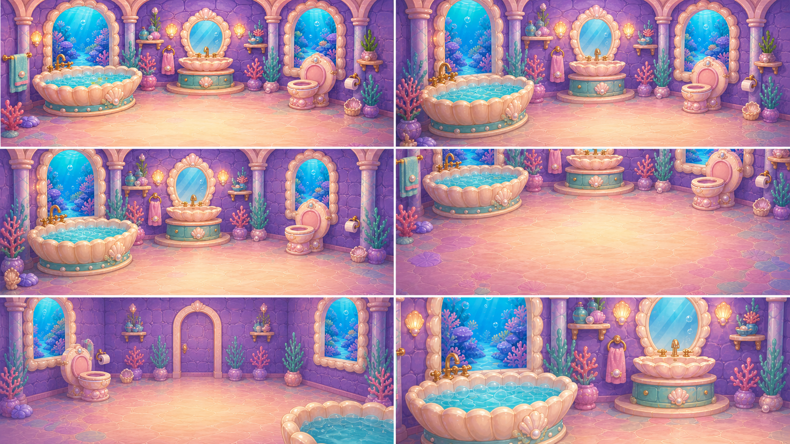
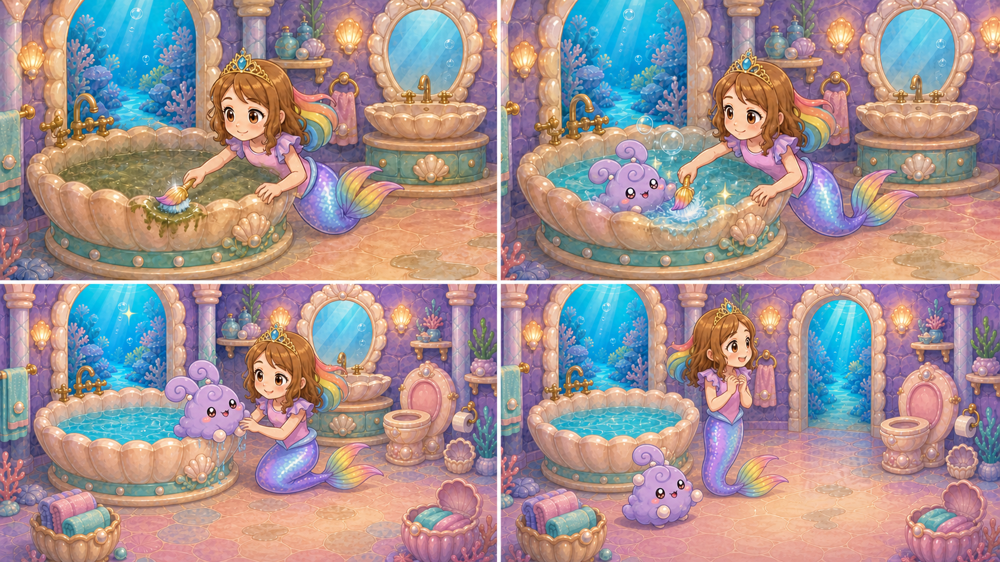
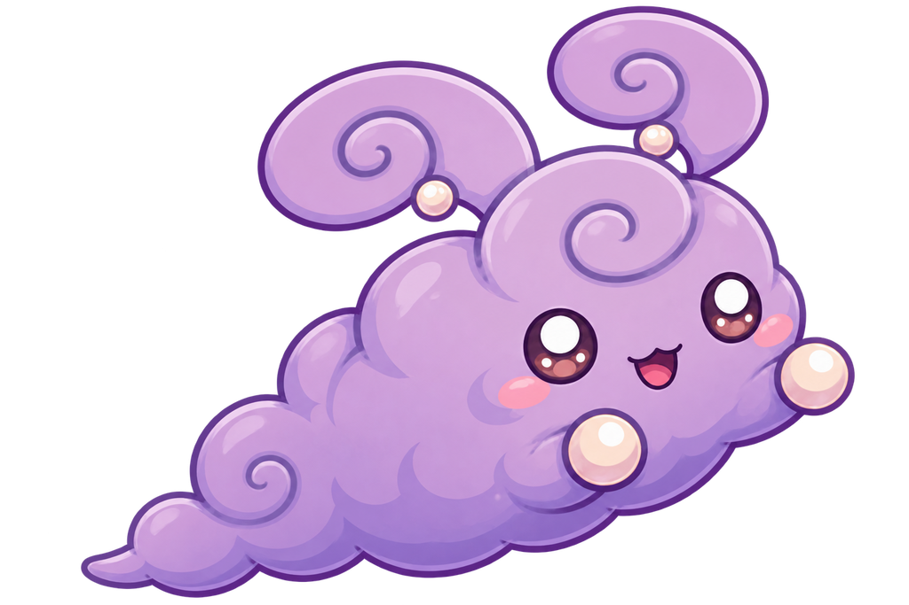
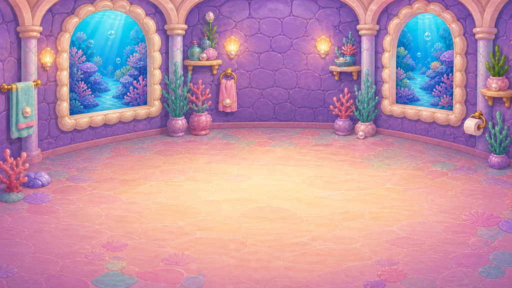

# D1-C04 — Bubble Bathroom — Restored

> `ARCHIVE_COMPLETE`: false  
> `GENERATION_READY`: false  
> `DELIVERY_ACCEPTED`: false  
> Grok output remains motion/editorial reference until the independent full-frame delivery audit passes.

## Use this one-link handoff

1. Review the location-depth sheet, storyboard, and character locks below.
2. Paste the shared guide once, then the scene guide.
3. Generate one shot job at a time with two to four separately approved pixel authorities.
4. Never upload either generated sheet below as `IMAGE_1` or as delivery pixels.

## Multi-angle environment depth



This is a newly generated, complete flattened narrative/topology reference. It demonstrates spatial depth and camera possibilities, but it is not an approved shot opening frame.

## Shot-aligned storyboard



| Shot | Authored visible beat |
|---|---|
| D1-C04-S01 | Close physical-contact shot inheriting gameplay's final dirty frame. |
| D1-C04-S02 | Medium bathtub view in the same room. |
| D1-C04-S03 | Close-to-medium recovery shot. |
| D1-C04-S04 | Wide clean Bathroom endpoint matching the approved runtime clean plate: one sparkling bathtub, clean sink and fixtures, bright pearl/aqua/lavender light, and every object in its established place. |

## Character reference guide

| Character | Approved identity | Immutable traits | Reject |
|---|---|---|---|
| roshan |  | child face and age; brown hair with rainbow section; pink top and tiara | legs or shoes; adult redesign |
| swimming_bunny |  | round lavender aquatic fluff; spiral ear curls; pearl paws and large warm eyes | land-bunny legs; duplicate or smoke form |

## Location authority



- Fixed entrance/exit geography, landmark order, fixture count, and scale.
- Generated angles must describe one connected volume.
- Reject invented doors, basins, platforms, duplicated fixtures, or room rotation.

## Written guides

- [Shared style and character guide](written_guide/SHARED_STYLE_AND_CHARACTER_GUIDE.txt)
- [Exact scene setup and shot copy blocks](written_guide/SCENE_GUIDE.txt)
- [Source document hashes](written_guide/SOURCE_DOCUMENTS.json)

<details>
<summary>Exact scene guide — expand to copy</summary>

```text
D1-C04 — BUBBLE BATHROOM: RESTORED

VIDEO SETUP BLOCK — PASTE ONCE
Create four separate clips totaling 8–10 seconds. Start from gameplay's exact final dirty state with Roshan's cleaning tool physically touching the last dirty surface. Preserve the approved one-bathtub Bathroom topology, exact Roshan, and the same swimming bunny from D1-C03. The child’s final contact causes the local water and room to clear. End on the approved clean runtime plate with the swimmer safe and Roshan looking toward the Pool route. No off-screen unexplained cleanup, second tub, character substitution, room redesign, instant whole-room flash without physical cause, or new activity completed for the player.

SHOT D1-C04-S01 COPY BLOCK
Close physical-contact shot inheriting gameplay's final dirty frame. Roshan's approved cleaning tool touches and completes one final scrub across the last grime patch on the established fixture. Preserve exact child Roshan anatomy and fixed bathroom geometry. Locked camera. End as the grime releases from the surface, not before contact. No floating tool, magic-only cleanup, extra hands, or clean room yet. Sound: temporary soft scrub and a tiny release chime; no voices.

SHOT D1-C04-S02 COPY BLOCK
Medium bathtub view in the same room. Clean clarity spreads locally through the murky tub water from the completed scrub's physical cause; the swimming bunny's paddles become stronger as the water clears. One gentle push toward the tub. End with clean water and the same coherent bunny upright and relieved. Keep remaining room cleanup subordinate and continuous. No duplicate bunny, water draining away, giant splash, or unrelated rainbow. Sound: temporary clearing-water shimmer and happy paddles; no voices.

SHOT D1-C04-S03 COPY BLOCK
Close-to-medium recovery shot. The same swimming bunny paddles to the established tub edge and exits safely onto the correct nearby dry surface, giving a small grateful bounce. Roshan steadies nearby without grabbing or changing the creature. Locked camera. End with the bunny safely clear of the tub and Roshan smiling. No legs added, flying bunny, duplicated Roshan, or changed room layout. Sound: temporary small splash, soft bounce, warm music note; no voices.

SHOT D1-C04-S04 COPY BLOCK
Wide clean Bathroom endpoint matching the approved runtime clean plate: one sparkling bathtub, clean sink and fixtures, bright pearl/aqua/lavender light, and every object in its established place. Roshan and the recovered swimmer are both present at correct scale. One slow pullback; Roshan turns her gaze toward the Pool route without leaving. End stable for gameplay transition. No dirty residue, second bathtub, new door, text, HUD, or completed pool cleanup. Sound: temporary clean-room sparkle and gentle route chime; no voices.
```
</details>

## Provenance and audit state

- [Archive manifest](HANDOFF_PACKET.json)
- [Imagine status contract](IMAGINE_HANDOFF.json)
- [Perspective prompt](storyboards/PERSPECTIVE_PROMPT.txt)
- [Storyboard prompt](storyboards/STORYBOARD_PROMPT.txt)
- [Generation result IDs](storyboards/GENERATION_RESULTS.json)

Both generated sheets are `appearance_authority:false`, `bound_reference_eligible:false`, and `used_as_delivery_pixels:false` in the archive manifest. Human owner review remains required before any generated angle becomes a production authority.
