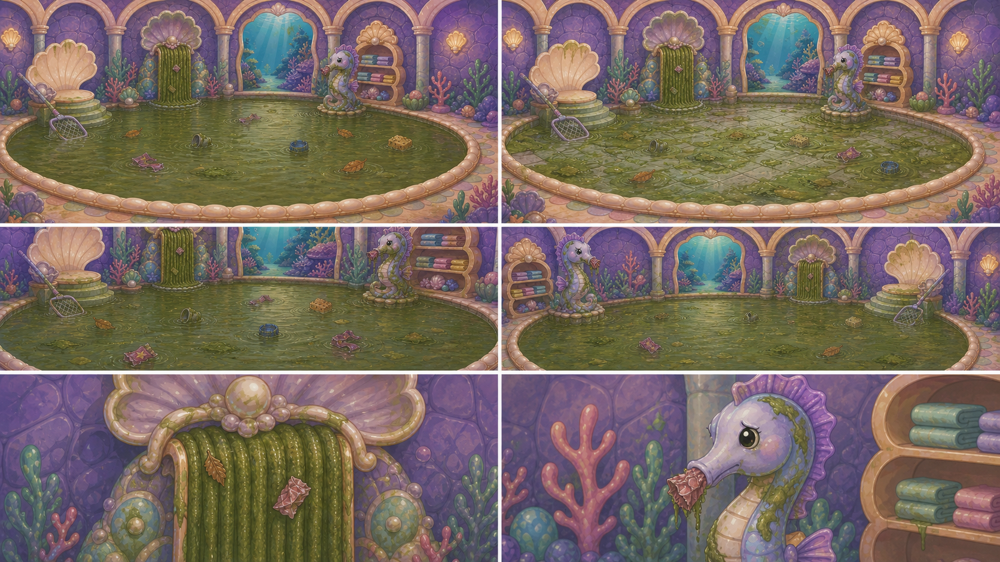
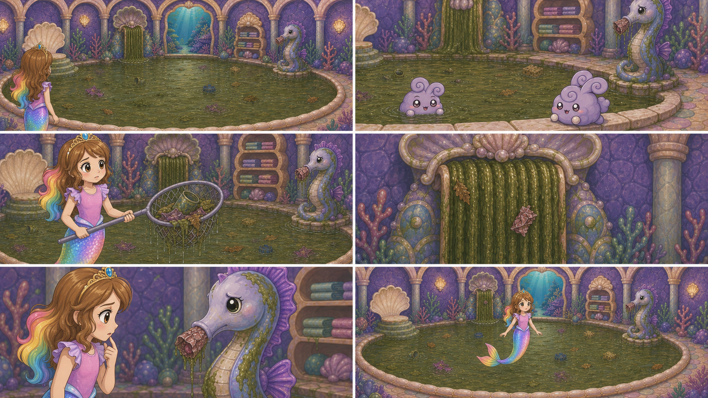

# D1-C05 — Sparkle Pool — Dirty Discovery

> `ARCHIVE_COMPLETE`: false  
> `GENERATION_READY`: false  
> `DELIVERY_ACCEPTED`: false  
> Grok output remains motion/editorial reference until the independent full-frame delivery audit passes.

## Use this one-link handoff

1. Review the location-depth sheet, storyboard, and character locks below.
2. Paste the shared guide once, then the scene guide.
3. Generate one shot job at a time with two to four separately approved pixel authorities.
4. Never upload either generated sheet below as `IMAGE_1` or as delivery pixels.

## Multi-angle environment depth



This is a newly generated, complete flattened narrative/topology reference. It demonstrates spatial depth and camera possibilities, but it is not an approved shot opening frame.

## Shot-aligned storyboard



| Shot | Authored visible beat |
|---|---|
| D1-C05-S01 | Wide doorway orientation into the exact dirty Mermaid Pool. |
| D1-C05-S02 | Low waterline view across the same giant pool. |
| D1-C05-S03 | Medium close shot of Roshan's skimmer and the established pool surface. |
| D1-C05-S04 | Close view of the exact rainbow waterfall fixture and top source. |
| D1-C05-S05 | Close view of the exact long-snouted seahorse fountain in its established position. |
| D1-C05-S06 | Final wide problem map of the same giant pool room. |

## Character reference guide

| Character | Approved identity | Immutable traits | Reject |
|---|---|---|---|
| roshan |  | child face and age; brown hair with rainbow section; pink top and tiara | legs or shoes; adult redesign |
| swimming_bunny |  | round lavender aquatic fluff; spiral ear curls; pearl paws and large warm eyes | land-bunny legs; duplicate or smoke form |

## Location authority


- Fixed entrance/exit geography, landmark order, fixture count, and scale.
- Generated angles must describe one connected volume.
- Reject invented doors, basins, platforms, duplicated fixtures, or room rotation.

## Written guides

- [Shared style and character guide](written_guide/SHARED_STYLE_AND_CHARACTER_GUIDE.txt)
- [Exact scene setup and shot copy blocks](written_guide/SCENE_GUIDE.txt)
- [Source document hashes](written_guide/SOURCE_DOCUMENTS.json)

<details>
<summary>Exact scene guide — expand to copy</summary>

```text
D1-C05 — SPARKLE POOL: DIRTY DISCOVERY

VIDEO SETUP BLOCK — PASTE ONCE
Create six separate clips totaling 12–15 seconds. Preserve the approved Mermaid Pool as one enormous room-scale pool with cream pearl coping, lavender shell arches, the rainbow waterfall fixture at its established left-center/top source, and the long-snouted seahorse fountain at established right-center. Roshan enters and discovers integrated algae, floating trash, a stopped rank waterfall, and a sick seahorse with a soggy pink trash plug visibly lodged in its mouth/nozzle. Include one land dust bunny confined to dry lower corner space and one approved swimming bunny in water; they are different individuals and stay in their proper media. Dirty light is dingy but readable. Do not let the rainbow shine or flow. Do not invent a small fountain basin, relocate fixtures, paste overlay trash, or clean anything.

SHOT D1-C05-S01 COPY BLOCK
Wide doorway orientation into the exact dirty Mermaid Pool. Roshan pauses at the threshold while the giant pool dominates the full room; fixed pearl coping, shell arches, stopped rainbow fixture left-center, and sick seahorse right-center remain in their approved positions. One slow push through the doorway. End with the whole problem geography readable. No small pool, extra basin, bright rainbow flow, or substitute mermaid. Sound: temporary rank room ambience, faint drip, no voices.

SHOT D1-C05-S02 COPY BLOCK
Low waterline view across the same giant pool. Floating leaves, wrappers, and algae sit physically in murky water with correct reflections and contact; the approved swimming bunny paddles through an open water lane while a separate land bunny stays on dry coping in a lower corner. One short lateral camera drift. End with trash depth and pool scale clear. No clip-art decals, duplicated bunnies, land bunny swimming, or clean sparkle. Sound: temporary sluggish water, tiny paddle, no voices.

SHOT D1-C05-S03 COPY BLOCK
Medium close shot of Roshan's skimmer and the established pool surface. Several wet trash pieces and algae catch naturally in the mesh as Roshan inspects them; this demonstrates the mess but does not remove the room's required trash before gameplay. Locked camera with small water response. End with debris visibly weighted inside the skimmer. No floating UI tool, dry stickers, extra hands, or completed cleaning. Sound: temporary mesh drag and wet debris movement; no voices.

SHOT D1-C05-S04 COPY BLOCK
Close view of the exact rainbow waterfall fixture and top source. It is clogged, opaque, still or barely oozing olive-brown sludge with embedded leaf and wrapper debris; the rainbow colors are dulled and do not glow or flow. One subtle upward camera tilt reveals the blocked top source. End on the obstruction. No bright rainbow, bottom-up motion, clear water, or invented catch basin. Sound: temporary thick drip and blocked gurgle; no voices.

SHOT D1-C05-S05 COPY BLOCK
Close view of the exact long-snouted seahorse fountain in its established position. It looks sick and overgrown with seaweed and soft marine growth; a soggy pink wrapper/weed plug is unmistakably lodged in its mouth/nozzle. Roshan's concerned face enters at the edge without touching it. Locked camera. End with the pink obstruction fully readable. No different animal, trash beside the mouth, flowing clean water, frightening injury, or extraction. Sound: temporary weak watery cough and room ambience; no voices.

SHOT D1-C05-S06 COPY BLOCK
Final wide problem map of the same giant pool room. Roshan stands between the stopped rank waterfall and sick seahorse, looking from one to the other; murky pool trash, both bunnies in their correct zones, algae, and fixed architecture remain coherent. One slow pullback. End with Roshan resolved to help and both cleanup causes visible. No cleaning, glowing rainbow, small basin, relocated fixture, text, or pointer. Sound: temporary gentle resolve chord over sluggish water; no voices.
```
</details>

## Provenance and audit state

- [Archive manifest](HANDOFF_PACKET.json)
- [Imagine status contract](IMAGINE_HANDOFF.json)
- [Perspective prompt](storyboards/PERSPECTIVE_PROMPT.txt)
- [Storyboard prompt](storyboards/STORYBOARD_PROMPT.txt)
- [Generation result IDs](storyboards/GENERATION_RESULTS.json)

Both generated sheets are `appearance_authority:false`, `bound_reference_eligible:false`, and `used_as_delivery_pixels:false` in the archive manifest. Human owner review remains required before any generated angle becomes a production authority.
