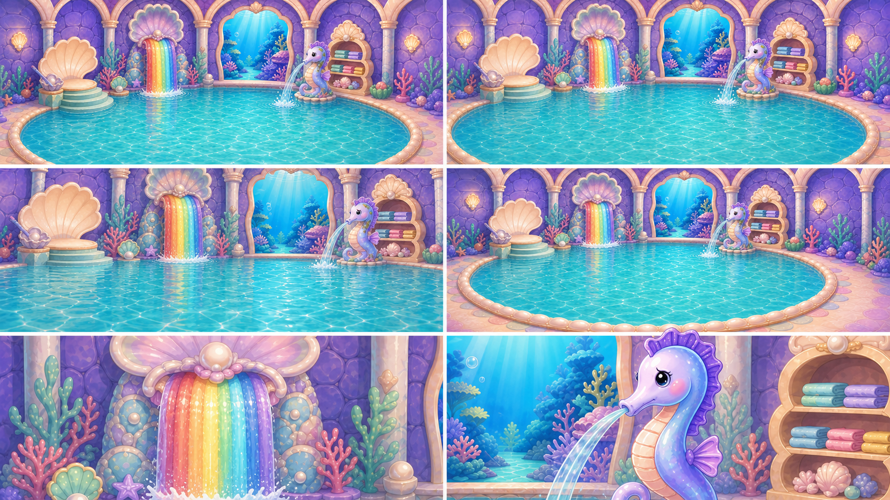
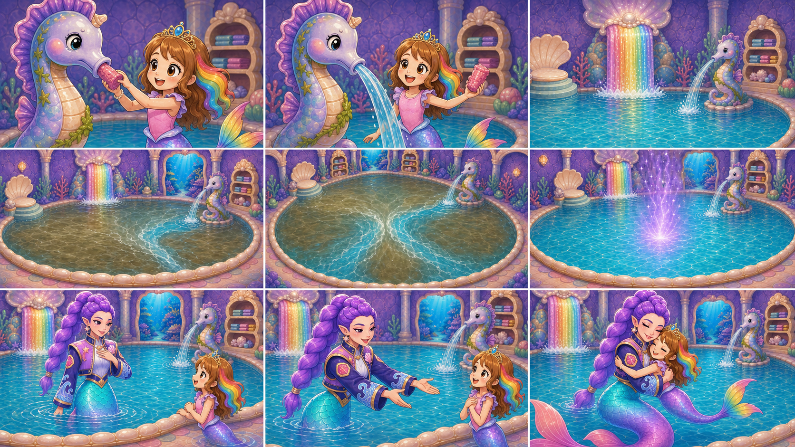
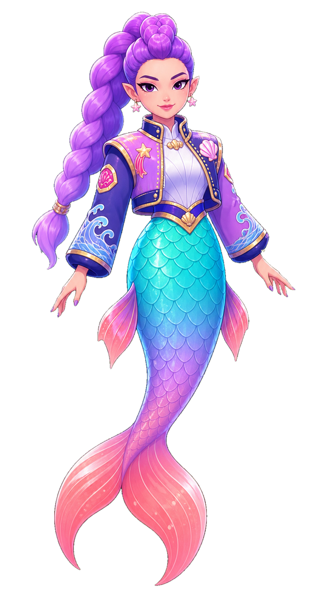
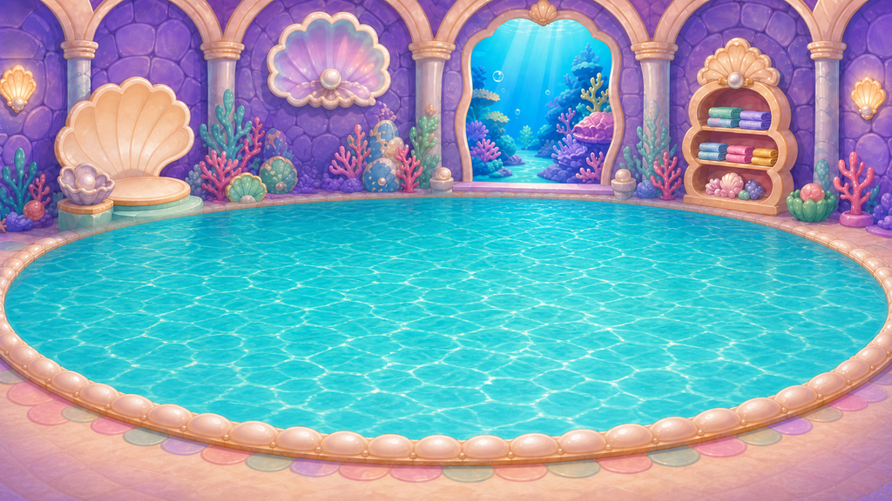

# D1-C06 — Sparkle Pool — Purification, Rumi and Hug

> `ARCHIVE_COMPLETE`: true
> `GENERATION_READY`: false  
> `DELIVERY_ACCEPTED`: false  
> Grok output remains motion/editorial reference until the independent full-frame delivery audit passes.

## Use this one-link handoff

1. Review the location-depth sheet, storyboard, and character locks below.
2. Paste the shared guide once, then the scene guide.
3. Generate one shot job at a time with two to four separately approved pixel authorities.
4. Never upload either generated sheet below as `IMAGE_1` or as delivery pixels.

## Multi-angle environment depth



This is a newly generated, complete flattened narrative/topology reference. It demonstrates spatial depth and camera possibilities, but it is not an approved shot opening frame.

## Shot-aligned storyboard



| Shot | Authored visible beat |
|---|---|
| D1-C06-S01 | Tight catalyst shot at the exact seahorse mouth. |
| D1-C06-S02 | Close shot continuing from the open seahorse nozzle. |
| D1-C06-S03 | Close view of the exact rainbow waterfall from the blocked TOP source. |
| D1-C06-S04 | Begin close on the now-flowing rainbow waterfall, then make one smooth pullback to re-establish the exact GIANT pool. |
| D1-C06-S05 | High wide view of the same giant pool. |
| D1-C06-S06 | Wide underwater-readable pool view continuing from the joined fronts. |
| D1-C06-S07 | Medium-wide pool-center shot. |
| D1-C06-S08 | Medium relationship two-shot using approved Roshan/Rumi identities and scale. |
| D1-C06-S09 | Medium-wide full-body relationship shot. |

## Character reference guide

| Character | Approved identity | Immutable traits | Reject |
|---|---|---|---|
| roshan |  | child face and age; brown hair with rainbow section; pink top and tiara | legs or shoes; adult redesign |
| rumi |  | enormous violet braided ponytail; pointed ears and star-shell earrings; navy lavender gold-trim jacket | rejected generic pool mermaid; legs or altered braid |

## Location authority



- Fixed entrance/exit geography, landmark order, fixture count, and scale.
- Generated angles must describe one connected volume.
- Reject invented doors, basins, platforms, duplicated fixtures, or room rotation.

## Written guides

- [Shared style and character guide](written_guide/SHARED_STYLE_AND_CHARACTER_GUIDE.txt)
- [Exact scene setup and shot copy blocks](written_guide/SCENE_GUIDE.txt)
- [Source document hashes](written_guide/SOURCE_DOCUMENTS.json)

<details>
<summary>Exact scene guide — expand to copy</summary>

```text
D1-C06 — SPARKLE POOL: DUAL PURIFICATION, RUMI, AND HUG

VIDEO SETUP BLOCK — PASTE ONCE
Create nine separate clips totaling 12–15 seconds in this exact causal order. Start with Roshan physically pulling the soggy pink obstruction from the established seahorse mouth. The seahorse gives the first clean flow. Then the rainbow waterfall restarts from its TOP source DOWNWARD. Camera reveals both streams entering the same GIANT room-scale pool; their purification fronts meet and clear the full water volume. Violet light rises from depth, the correct adult Rumi/Violet emerges, thanks Roshan, and gives her a full anatomically correct hug. Preserve the approved pool architecture, fixture positions, Roshan identity, Rumi identity/scale, and dirty-to-clean grade. Never use the rejected substitute mermaid. No backward/bottom-up flow, small invented fountain basin, instant unexplained cleanup, duplicate Rumi, malformed hands, fused torsos, or merged tails.

SHOT D1-C06-S01 COPY BLOCK
Tight catalyst shot at the exact seahorse mouth. Roshan grips the visible soggy pink wrapper/weed plug and pulls it completely free with one clear physical motion; the seahorse and room remain dirty. Preserve Roshan's child hands, face, clothes, and continuous tail. Locked camera. End with the pink trash in Roshan's hand and the nozzle visibly open. No magic-only removal, extra fingers, trash still inside, or water yet. Sound: temporary wet pull and soft release pop; no voices.

SHOT D1-C06-S02 COPY BLOCK
Close shot continuing from the open seahorse nozzle. The sick seahorse relaxes as its first narrow stream of clean aqua water begins and strengthens; seaweed growth loosens locally. Roshan remains nearby holding the removed pink trash away from the water. Locked camera. End with a stable clean stream entering the giant pool outside frame. No rainbow waterfall yet, backward suction, extra nozzle, or instant whole-room cleaning. Sound: temporary clean water start and relieved magical chime; no voices.

SHOT D1-C06-S03 COPY BLOCK
Close view of the exact rainbow waterfall from the blocked TOP source. A bright clean rainbow band ignites at the top and travels downward through the formerly rank channel, pushing dull sludge and debris away in a physically readable wave. One gentle downward camera tilt follows the descending front. End when the clean flow reaches the lower lip. Never start at the bottom; no upward flow, no separate basin, no seahorse in this frame. Sound: temporary rising water rush and crystalline color sweep; no voices.

SHOT D1-C06-S04 COPY BLOCK
Begin close on the now-flowing rainbow waterfall, then make one smooth pullback to re-establish the exact GIANT pool. Rainbow water visibly descends from the top fixture and enters the enormous shared pool, while the seahorse's clean stream enters from its fixed right-center position. End with both sources and the full pool geometry visible. No small fountain pool, changed arches, relocated seahorse, or reversed flow. Sound: temporary layered clean-water rush; no voices.

SHOT D1-C06-S05 COPY BLOCK
High wide view of the same giant pool. Two distinct clear-water fronts spread from the waterfall and seahorse through murky water, displacing algae and suspended grime until they meet near the center. Architecture and characters stay fixed. Locked camera. End exactly as the two fronts join in one bright ripple. No instant flash, dry floor, extra source, or floating overlay effect. Sound: temporary converging water shimmer and soft impact chime; no voices.

SHOT D1-C06-S06 COPY BLOCK
Wide underwater-readable pool view continuing from the joined fronts. Clarity expands through the entire giant water volume; natural aqua depth returns, the room brightens from dingy to pearl/aqua/lavender, and a localized violet glow begins deep below center. One slow push toward the glow. End with clean water and the violet light clearly rising but no person visible yet. No Rumi silhouette redesign, empty basin, or neon screen wash. Sound: temporary deep magical resonance and clear water ambience; no voices.

SHOT D1-C06-S07 COPY BLOCK
Medium-wide pool-center shot. The correct adult Rumi/Violet rises gracefully from the clean water through the violet glow: enormous sculpted violet braid, pointed ears, star-shell earrings, navy/lavender gold-trimmed jacket, exact aqua-to-violet-to-pink tail, coral split fin. Roshan watches from nearby coping at child scale. One gentle upward camera follow. End with Rumi fully identifiable above water. No substitute mermaid, loose hair, child Rumi, legs, changed outfit, or duplicated tail. Sound: temporary water rise and warm violet reveal chord; no voices.

SHOT D1-C06-S08 COPY BLOCK
Medium relationship two-shot using approved Roshan/Rumi identities and scale. Rumi turns to Roshan, places one hand warmly over her own heart, and clearly thanks her through expression and a gentle speaking gesture; Roshan beams. Locked camera. End with Rumi opening both arms to invite a hug. Preserve separate bodies and continuous tails. No subtitles, lip-synced synthetic dialogue, hand deformation, or extra characters. Sound: temporary quiet water and warm music; final approved dialogue will be added later.

SHOT D1-C06-S09 COPY BLOCK
Medium-wide full-body relationship shot. Roshan moves into Rumi's open arms and they complete one big affectionate hug with correct arm contact, distinct torsos, visible faces, and two separate continuous mer-tails. The clean giant pool, flowing top-down rainbow waterfall, and seahorse stream remain in their fixed background positions. One subtle pullback. End on a stable joyful embrace. No fused bodies, merged tails, extra arms, tiny pool, substitute Rumi, or kiss. Sound: temporary water sparkle and warm musical resolution; no voices.
```
</details>

## Provenance and audit state

- [Archive manifest](HANDOFF_PACKET.json)
- [Imagine status contract](IMAGINE_HANDOFF.json)
- [Perspective prompt](storyboards/PERSPECTIVE_PROMPT.txt)
- [Storyboard prompt](storyboards/STORYBOARD_PROMPT.txt)
- [Generation result IDs](storyboards/GENERATION_RESULTS.json)

Both generated sheets are `appearance_authority:false`, `bound_reference_eligible:false`, and `used_as_delivery_pixels:false` in the archive manifest. Human owner review remains required before any generated angle becomes a production authority.
