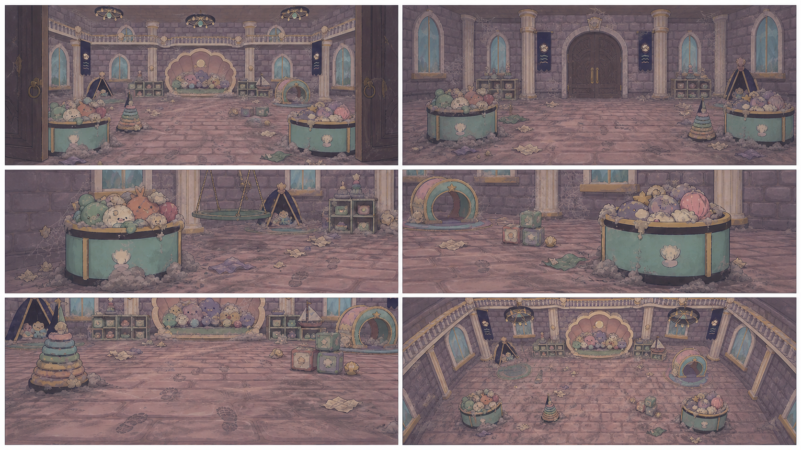
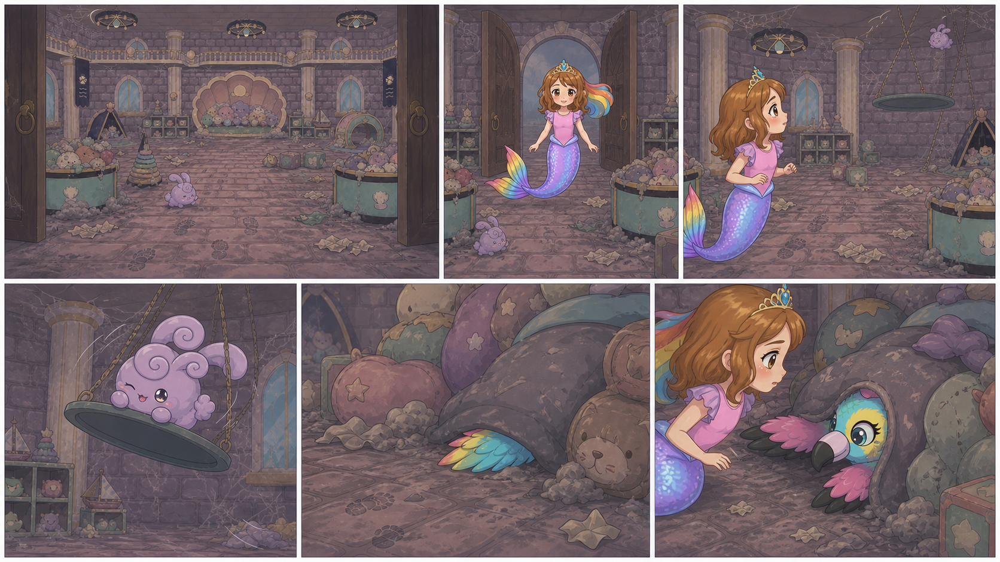
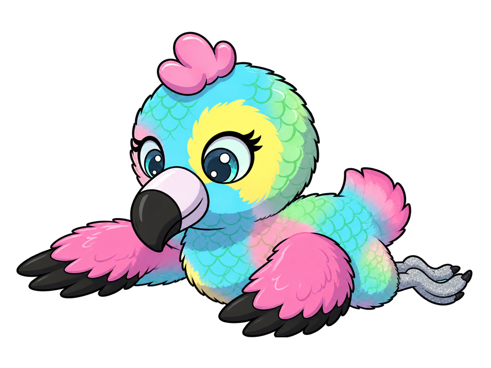
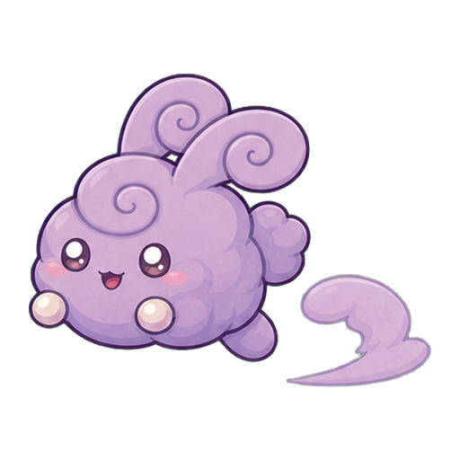

# D1-C07 — Stuffie Room — Dirty Discovery

> `ARCHIVE_COMPLETE`: false  
> `GENERATION_READY`: false  
> `DELIVERY_ACCEPTED`: false  
> Grok output remains motion/editorial reference until the independent full-frame delivery audit passes.

## Use this one-link handoff

1. Review the location-depth sheet, storyboard, and character locks below.
2. Paste the shared guide once, then the scene guide.
3. Generate one shot job at a time with two to four separately approved pixel authorities.
4. Never upload either generated sheet below as `IMAGE_1` or as delivery pixels.

## Multi-angle environment depth



This is a newly generated, complete flattened narrative/topology reference. It demonstrates spatial depth and camera possibilities, but it is not an approved shot opening frame.

## Shot-aligned storyboard



| Shot | Authored visible beat |
|---|---|
| D1-C07-S01 | Wide dirty Stuffie Room orientation before entry. |
| D1-C07-S02 | Inherit the approved dirty room layout. |
| D1-C07-S03 | Reverse medium shot toward Roshan in the same dirty room. |
| D1-C07-S04 | Close environmental shot of one approved friendly playroom dust bunny swinging gently from the established support. |
| D1-C07-S05 | Low floor-level shot following Roshan's gaze through established clutter and dust traces toward a partially obscured colorful wing. |
| D1-C07-S06 | Medium reveal of exactly one approved Baby Eagle pinned safely beneath soft room mess in its established floor location. |

## Character reference guide

| Character | Approved identity | Immutable traits | Reject |
|---|---|---|---|
| roshan |  | child face and age; brown hair with rainbow section; pink top and tiara | legs or shoes; adult redesign |
| baby_eagle_pinned |  | turquoise yellow and pink child bird; approved beak and face; full spread wings | backpack; cropped or duplicated body |
| playroom_bunny |  | round lavender fluff; friendly eyes and blush; consistent curl silhouette | smoke cloud; color-coded redesign |

## Location authority


- Fixed entrance/exit geography, landmark order, fixture count, and scale.
- Generated angles must describe one connected volume.
- Reject invented doors, basins, platforms, duplicated fixtures, or room rotation.

## Written guides

- [Shared style and character guide](written_guide/SHARED_STYLE_AND_CHARACTER_GUIDE.txt)
- [Exact scene setup and shot copy blocks](written_guide/SCENE_GUIDE.txt)
- [Source document hashes](written_guide/SOURCE_DOCUMENTS.json)

<details>
<summary>Exact scene guide — expand to copy</summary>

```text
D1-C07 — STUFFIE ROOM: DIRTY DISCOVERY

VIDEO SETUP BLOCK — PASTE ONCE
Create six separate clips totaling 9–12 seconds. Preserve the approved Stuffie Room's complete clean/dirty geography, door, baskets, floor, furniture, and unseen-wall extrapolations. Roshan enters the dirty room, sees one friendly swinging dust bunny, follows evidence to the floor, and discovers exactly one approved Baby Eagle pinned safely by the mess. Use approved Roshan, Baby Eagle pinned-state identity, and playroom bunny identity. Grime and clutter are integrated into surfaces and contact shadows. No clone interpretation of pose sheets, duplicated Baby Eagle, frightening injury, room flattening, clip-art props, or cleaning before gameplay.

SHOT D1-C07-S01 COPY BLOCK
Wide dirty Stuffie Room orientation before entry. Show the established door, both basket zones, furniture, floor mess, and connected full-room architecture in dim safe light. One friendly dust bunny is part of the environment but not yet emphasized. Locked camera. End holding the doorway clear. No Roshan yet, no clean state, no duplicated props, or theater-flat wall. Sound: temporary soft dusty room tone and fabric rustle; no voices.

SHOT D1-C07-S02 COPY BLOCK
Inherit the approved dirty room layout. Roshan crosses the threshold with exact child identity and one continuous rainbow mer-tail. One short follow camera stops inside. Her gaze moves across the clutter without touching it. End with Roshan fully inside and the entrance still spatially correct. No legs, room rotation error, cleanup, or extra character. Sound: temporary soft tail movement and room ambience; no voices.

SHOT D1-C07-S03 COPY BLOCK
Reverse medium shot toward Roshan in the same dirty room. She reacts with concern and notices motion above/near one established basket zone. Locked camera; preserve door and wall perspective. End with her eye line directed toward the swinging bunny. No terror, adult Roshan, pointer icon, or changed furnishings. Sound: temporary curious music pulse and faint rope/fabric creak; no voices.

SHOT D1-C07-S04 COPY BLOCK
Close environmental shot of one approved friendly playroom dust bunny swinging gently from the established support. Its body, ears, face, and contact remain coherent; it is playful and stuck, not falling or scary. One small pendulum-follow camera motion only. End with a harmless dust trace dropping toward the floor. No clone row, smoke creature, detached rope, or rescue completion. Sound: temporary soft swing creak and tiny bunny squeak; no voices.

SHOT D1-C07-S05 COPY BLOCK
Low floor-level shot following Roshan's gaze through established clutter and dust traces toward a partially obscured colorful wing. One slow lateral move reveals the trail without yet showing the whole bird. Keep all mess physically grounded. End with the turquoise/yellow/pink wing clearly identifiable as Baby Eagle's. No extra bird, injury, clip-art arrow, or moving furniture. Sound: temporary soft clutter rustle and concerned chord; no voices.

SHOT D1-C07-S06 COPY BLOCK
Medium reveal of exactly one approved Baby Eagle pinned safely beneath soft room mess in its established floor location. Preserve turquoise/yellow/pink anatomy, beak, wings, feet, and child proportions; the bird is alert and unharmed. Roshan kneels/floats close at correct child scale with concerned eye contact. Locked camera. End with Roshan resolving to help. No duplicate eagle, crushed body, horror, cleanup, or wrong species. Sound: temporary small hopeful chirp and resolve music; no voices.
```
</details>

## Provenance and audit state

- [Archive manifest](HANDOFF_PACKET.json)
- [Imagine status contract](IMAGINE_HANDOFF.json)
- [Perspective prompt](storyboards/PERSPECTIVE_PROMPT.txt)
- [Storyboard prompt](storyboards/STORYBOARD_PROMPT.txt)
- [Generation result IDs](storyboards/GENERATION_RESULTS.json)

Both generated sheets are `appearance_authority:false`, `bound_reference_eligible:false`, and `used_as_delivery_pixels:false` in the archive manifest. Human owner review remains required before any generated angle becomes a production authority.
