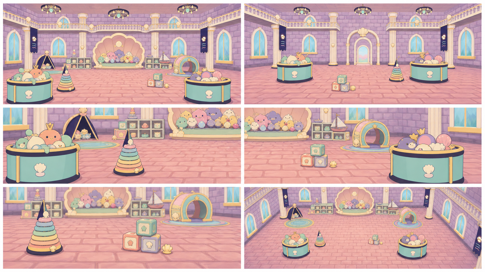
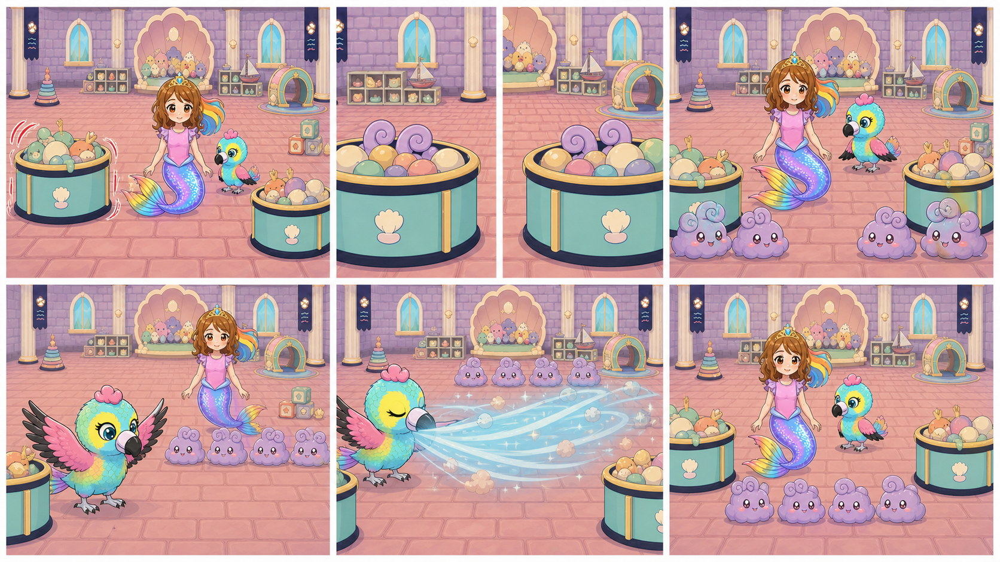
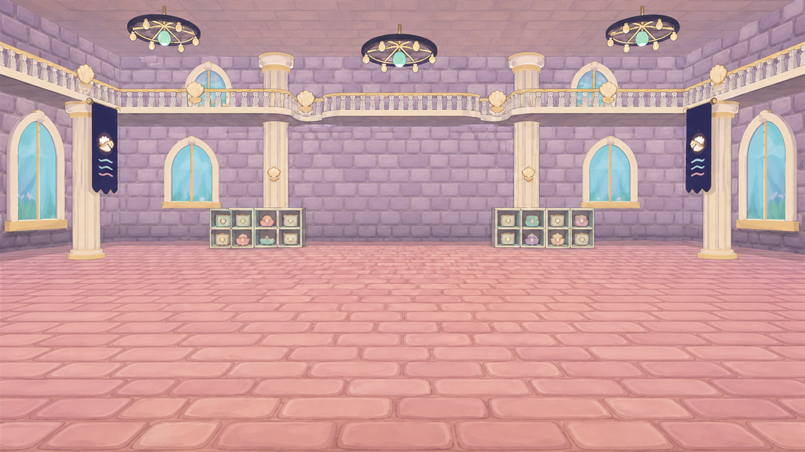

# D1-C08 — Stuffie Room — Basket and Wing-Blast Restoration

> `ARCHIVE_COMPLETE`: true
> `GENERATION_READY`: false<br>
> `DELIVERY_ACCEPTED`: false<br>
> Grok output remains motion/editorial reference until the independent full-frame delivery audit passes.

## Use this one-link handoff

1. Review the location-depth sheet, storyboard, and character locks below.
2. Paste the shared guide once, then the scene guide.
3. Generate one shot job at a time with two to four separately approved pixel authorities.
4. Never upload either generated sheet below as `IMAGE_1` or as delivery pixels.

## Multi-angle environment depth



This is a newly generated, complete flattened narrative/topology reference. It demonstrates spatial depth and camera possibilities, but it is not an approved shot opening frame.

## Shot-aligned storyboard



| Shot | Authored visible beat |
|---|---|
| D1-C08-S01 | Wide dirty calm inheriting gameplay's final Stuffie Room state. |
| D1-C08-S02 | Close shot of the established left basket. |
| D1-C08-S03 | Close shot of the established right basket in its correct room position. |
| D1-C08-S04 | Medium-wide view containing both established basket zones. |
| D1-C08-S05 | Medium hero shot of the single recovered Baby Eagle on its established perch/floor position. |
| D1-C08-S06 | Wide room shot. |
| D1-C08-S07 | Wide clean endpoint matching the approved Stuffie Room layout. |

## Character reference guide

| Character | Approved identity | Immutable traits | Reject |
|---|---|---|---|
| roshan |  | child face and age; brown hair with rainbow section; pink top and tiara | legs or shoes; adult redesign |
| baby_eagle_standing |  | turquoise yellow and pink child bird; approved beak and face; upright friendly posture | backpack; cropped or duplicated body |
| playroom_bunny |  | round lavender fluff; friendly eyes and blush; consistent curl silhouette | smoke cloud; color-coded redesign |

## Location authority



- Fixed entrance/exit geography, landmark order, fixture count, and scale.
- Generated angles must describe one connected volume.
- Reject invented doors, basins, platforms, duplicated fixtures, or room rotation.

## Written guides

- [Shared style and character guide](written_guide/SHARED_STYLE_AND_CHARACTER_GUIDE.txt)
- [Exact scene setup and shot copy blocks](written_guide/SCENE_GUIDE.txt)
- [Source document hashes](written_guide/SOURCE_DOCUMENTS.json)

<details>
<summary>Exact scene guide — expand to copy</summary>

```text
D1-C08 — STUFFIE ROOM: BASKETS AND WING-BLAST RESTORATION

VIDEO SETUP BLOCK — PASTE ONCE
Create seven separate clips totaling 9–12 seconds. Preserve the exact dirty Stuffie Room geography from D1-C07 and the gameplay endpoint. The established left basket warns, then the right basket warns; four friendly dust bunnies emerge in total. Exactly one recovered Baby Eagle prepares and performs a safe wing blast whose physical airflow reveals the clean room. End on the approved clean layout with Roshan, Baby Eagle, and friendly bunnies safe. Use exact identities. No duplicated eagle, scary tornado, violent impact, furniture relocation, instant magic flash, clip-art dust, or cleanup that begins before the wing action.

SHOT D1-C08-S01 COPY BLOCK
Wide dirty calm inheriting gameplay's final Stuffie Room state. Roshan, exactly one recovered Baby Eagle, both basket zones, and remaining soft clutter occupy their established positions. Locked camera with restrained breathing and dust settling. End when the left basket begins one small warning wobble. No cleaning yet, no extra eagle, no bunnies already outside. Sound: temporary dusty room tone and first basket rattle; no voices.

SHOT D1-C08-S02 COPY BLOCK
Close shot of the established left basket. It wobbles once and a pair of friendly approved dust-bunny ears briefly appears at the rim before ducking back. Locked camera. End with the basket still and Roshan's offscreen eye line motivated. No full emergence, monster claws, duplicated basket, or room change. Sound: temporary soft wicker/fabric rattle and tiny playful squeak; no voices.

SHOT D1-C08-S03 COPY BLOCK
Close shot of the established right basket in its correct room position. It answers with one small wobble and another friendly pair of approved ears peeks out. Locked camera. End with both warning beats understood but no cleanup. No reused left-basket geometry, scary eyes, extra props, or teleport. Sound: temporary answering basket rattle and playful squeak; no voices.

SHOT D1-C08-S04 COPY BLOCK
Medium-wide view containing both established basket zones. Four friendly playroom dust bunnies emerge in total—two from each basket—and settle visibly on the floor as four coherent individuals, not pose-sheet clones or smoke. Roshan and exactly one Baby Eagle watch. One gentle pullback. End with all four counted and clear. No fifth bunny, duplicate eagle, attack, or cleanup. Sound: temporary soft hops and cheerful rustle; no voices.

SHOT D1-C08-S05 COPY BLOCK
Medium hero shot of the single recovered Baby Eagle on its established perch/floor position. It plants its feet, spreads both approved turquoise/yellow/pink wings symmetrically, and takes a determined breath while Roshan and bunnies move safely behind the airflow line. Locked camera. End at full wing preparation. No duplicate bird, adult eagle, injury, wind yet, or wrong colors. Sound: temporary wing-feather lift and anticipatory music; no voices.

SHOT D1-C08-S06 COPY BLOCK
Wide room shot. Baby Eagle performs one safe broad wing blast; readable soft airflow moves integrated dust and lightweight clutter toward their established storage zones, revealing the clean room beneath. Furniture, walls, baskets, Roshan, and bunnies remain anchored and unharmed. One subtle camera brace only. End as the last dust clears. No tornado, characters thrown, property damage, magical flash without airflow, or topology change. Sound: temporary broad soft whoosh, fabric flutter, clean reveal chime; no voices.

SHOT D1-C08-S07 COPY BLOCK
Wide clean endpoint matching the approved Stuffie Room layout. Roshan smiles with exactly one Baby Eagle and four friendly dust bunnies; both baskets and furniture are clean and in their established places under bright pearl/lavender light. One slow pullback. Baby Eagle folds its wings and the bunnies make one small grateful bounce. End stable. No dirty residue, extra eagle/bunny, text, HUD, or new room exit. Sound: temporary cheerful chirp, small hops, warm musical cadence; no voices.
```
</details>

## Provenance and audit state

- [Archive manifest](HANDOFF_PACKET.json)
- [Imagine status contract](IMAGINE_HANDOFF.json)
- [Perspective prompt](storyboards/PERSPECTIVE_PROMPT.txt)
- [Storyboard prompt](storyboards/STORYBOARD_PROMPT.txt)
- [Generation result IDs](storyboards/GENERATION_RESULTS.json)

Both generated sheets are `appearance_authority:false`, `bound_reference_eligible:false`, and `used_as_delivery_pixels:false` in the archive manifest. Human owner review remains required before any generated angle becomes a production authority.
