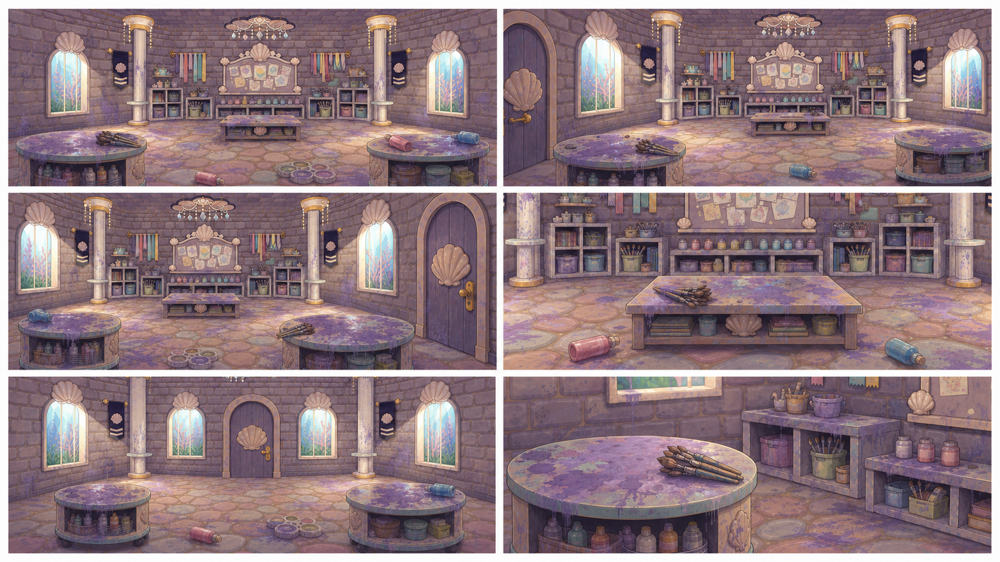
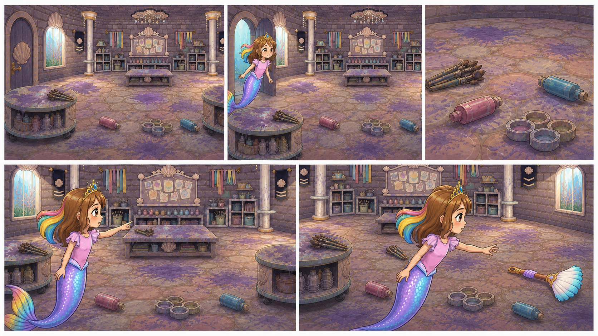
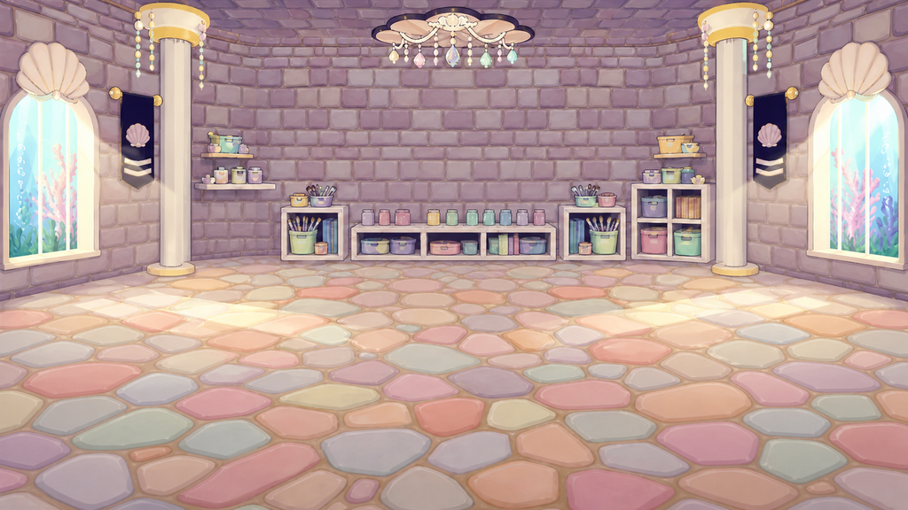

# D1-C09 — Art Room — Spilled Supplies Discovery

> `ARCHIVE_COMPLETE`: true
> `GENERATION_READY`: false<br>
> `DELIVERY_ACCEPTED`: false<br>
> Grok output remains motion/editorial reference until the independent full-frame delivery audit passes.

## Use this one-link handoff

1. Review the location-depth sheet, storyboard, and character locks below.
2. Paste the shared guide once, then the scene guide.
3. Generate one shot job at a time with two to four separately approved pixel authorities.
4. Never upload either generated sheet below as `IMAGE_1` or as delivery pixels.

## Multi-angle environment depth



This is a newly generated, complete flattened narrative/topology reference. It demonstrates spatial depth and camera possibilities, but it is not an approved shot opening frame.

## Shot-aligned storyboard



| Shot | Authored visible beat |
|---|---|
| D1-C09-S01 | Wide approved dirty Art Room topology view. |
| D1-C09-S02 | Inherit the approved dirty room and doorway perspective. |
| D1-C09-S03 | Low-to-medium inspection move across exactly four loose supply groups: approved loose brushes, pink paint bottle, blue paint bottle, and paint cups. |
| D1-C09-S04 | Counter-height environmental shot revealing exactly three established lavender paint-grime zones: desk, left counter, and right counter. |
| D1-C09-S05 | Medium reverse on Roshan with the dirty Art Room extending coherently behind her. |

## Character reference guide

| Character | Approved identity | Immutable traits | Reject |
|---|---|---|---|
| roshan |  | child face and age; brown hair with rainbow section; pink top and tiara | legs or shoes; adult redesign |

## Location authority



- Fixed entrance/exit geography, landmark order, fixture count, and scale.
- Generated angles must describe one connected volume.
- Reject invented doors, basins, platforms, duplicated fixtures, or room rotation.

## Written guides

- [Shared style and character guide](written_guide/SHARED_STYLE_AND_CHARACTER_GUIDE.txt)
- [Exact scene setup and shot copy blocks](written_guide/SCENE_GUIDE.txt)
- [Source document hashes](written_guide/SOURCE_DOCUMENTS.json)

<details>
<summary>Exact scene guide — expand to copy</summary>

```text
D1-C09 — ART ROOM: SPILLED-SUPPLIES DISCOVERY

VIDEO SETUP BLOCK — PASTE ONCE
Create five separate clips totaling 8–10 seconds. Do not generate until a human has approved the Art Room's coherent clean and dirty six-view topology set: front, left doorway, right doorway, low center, reverse toward entrance, and desk closeup. Extrapolate unseen walls as a full inhabitable pearl craft room matching the current front plate; never recycle cropped fragments of one view. Preserve exact Roshan identity and current runtime object identities: loose brush bundle, pink paint bottle, blue paint bottle, paint cups, and three lavender paint-grime zones on established counter surfaces. Start at the craft doorway and end with all four loose supply groups plus all three grime zones understood. Discovery only; no cleaning, stored duplicates, or completed custom art.

SHOT D1-C09-S01 COPY BLOCK
Wide approved dirty Art Room topology view. Show the entrance, full connected walls, counters, central work area, magic paint desk, four loose supply groups, and three integrated lavender grime zones in their established positions. Dirty light is dim but colorful and safe. Locked camera. End holding the doorway clear. No Roshan yet, no flat theater backdrop, no clip-art stickers, no duplicate supplies. Sound: temporary quiet room ambience and faint paint drip; no voices.

SHOT D1-C09-S02 COPY BLOCK
Inherit the approved dirty room and doorway perspective. Roshan crosses the threshold with exact child identity, continuous rainbow mer-tail, and correct scale. One short follow camera stops inside. She scans left-to-right across the counters and desk without touching anything. End with her eye line landing on the loose supplies. No legs, room rotation error, cleanup, or new props. Sound: temporary soft tail movement and curious music pulse; no voices.

SHOT D1-C09-S03 COPY BLOCK
Low-to-medium inspection move across exactly four loose supply groups: approved loose brushes, pink paint bottle, blue paint bottle, and paint cups. Each object rests naturally on the established surfaces with contact shadow and small believable spill evidence. One slow lateral camera move only. End with all four identities readable. No fifth group, duplicated stored copy, floating stickers, broken glass, or cleanup. Sound: temporary tiny bottle/cup settle and room ambience; no voices.

SHOT D1-C09-S04 COPY BLOCK
Counter-height environmental shot revealing exactly three established lavender paint-grime zones: desk, left counter, and right counter. One gentle pan connects the zones through coherent room geometry while Roshan's pointing hand briefly confirms her gaze without touching. End with all three locations spatially understood. No extra smear, toxic sludge, UI markers, or room redesign. Sound: temporary sticky paint ambience and soft concerned chord; no voices.

SHOT D1-C09-S05 COPY BLOCK
Medium reverse on Roshan with the dirty Art Room extending coherently behind her. She looks from the four supply groups to the three grime zones, then reaches toward the approved cleaning brush without making contact. One subtle push-in. End on her determined child expression and the room still fully dirty. No cleanup, magic desk activation, completed artwork, extra limb, or text. Sound: temporary resolve chime over quiet room tone; no voices.
```
</details>

## Provenance and audit state

- [Archive manifest](HANDOFF_PACKET.json)
- [Imagine status contract](IMAGINE_HANDOFF.json)
- [Perspective prompt](storyboards/PERSPECTIVE_PROMPT.txt)
- [Storyboard prompt](storyboards/STORYBOARD_PROMPT.txt)
- [Generation result IDs](storyboards/GENERATION_RESULTS.json)

Both generated sheets are `appearance_authority:false`, `bound_reference_eligible:false`, and `used_as_delivery_pixels:false` in the archive manifest. Human owner review remains required before any generated angle becomes a production authority.
