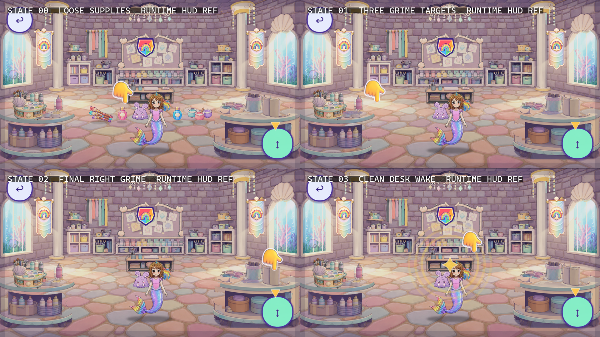
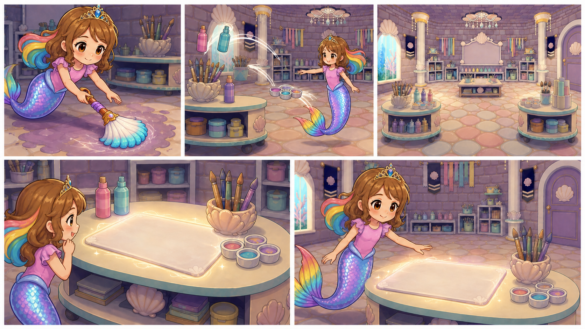

# D1-C10 — Art Room — Clean Desk Awakening

> `ARCHIVE_COMPLETE`: true<br>
> `GENERATION_READY`: false<br>
> `DELIVERY_ACCEPTED`: false<br>
> Grok output remains motion/editorial reference until the independent full-frame delivery audit passes.

## Use this one-link handoff

1. Review the environment continuity sheet, storyboard, and character locks below.
2. Paste the shared guide once, then the scene guide.
3. Generate one shot job at a time with two to four separately approved pixel authorities.
4. Never upload either sheet below as `IMAGE_1` or as delivery pixels.

## Environment continuity and runtime state



This sheet records the permitted location projection and state continuity. It is narrative/runtime evidence only and is not an approved shot opening frame.

## Shot-aligned storyboard



| Shot | Authored visible beat |
|---|---|
| D1-C10-S01 | Begin from the exact runtime last-grime state with only the small right-counter lavender grime card remaining. |
| D1-C10-S02 | Return to the locked full-front room. |
| D1-C10-S03 | Reveal the exact clean front room: all three grime cards gone, four supplies stored once, fixed counters and floor clean, rectangular center desk blank, and Roshan at runtime scale. |
| D1-C10-S04 | Use the same clean front room and center on the existing rectangular paint desk. |
| D1-C10-S05 | Remain on the clean front projection. |

## Character reference guide

| Character | Approved identity | Immutable traits | Reject |
|---|---|---|---|
| roshan |  | child face and age; brown hair with rainbow section; pink top and tiara | legs or shoes; adult redesign |

## Location authority


- The approved camera family is the single straight-on runtime front projection.
- Preserve the two windows, two columns, chandelier, ribbon rack, shell board, rectangular center desk, rear shelves, and two foreground counters.
- Reject interior doors, reverse/side walls, round furniture, duplicated fixtures, or room rotation.

## Written guides

- [Shared style and character guide](written_guide/SHARED_STYLE_AND_CHARACTER_GUIDE.txt)
- [Exact scene setup and shot copy blocks](written_guide/SCENE_GUIDE.txt)
- [Source document hashes](written_guide/SOURCE_DOCUMENTS.json)

<details>
<summary>Exact scene guide — expand to copy</summary>

```text
D1-C10 — ART ROOM: CLEAN DESK AWAKENING

VIDEO SETUP BLOCK — PASTE ONCE
Create five separate clips totaling 9–12 seconds. Match the current in-game Art Room exactly and remain on its single straight-on front projection. Runtime captures lock the rectangular center desk, rear shelves, shell idea board, ribbon rack, two windows, two columns, chandelier, two foreground counters, supply homes, and three small grime positions. Captures contain HUD and are boundary references only, never delivery pixels. The final brush contact is an authored cinematic action, not recorded gameplay. Never invent doors, reverse walls, round furniture, supply-flight paths, new storage, or a generic craft shop. End before customization UI appears.

SHOT D1-C10-S01 COPY BLOCK
Begin from the exact runtime last-grime state with only the small right-counter lavender grime card remaining. Roshan uses the approved magic cleaning brush for one physically readable contact pass; grime clears only beneath the bristles. Locked front camera with a modest right crop. End with the final grime lifted and brush stable. No floating brush, whole-room flash before contact, extra hand, new smear, room drift, or HUD. Sound: soft brush scrub and release chime; no voices.

SHOT D1-C10-S02 COPY BLOCK
Return to the locked full-front room. The four loose target cards are already absent and each supply is represented once in its established storage station. Show only a restrained sparkle settling at the existing paint-table and palette stations. Locked camera. End with no loose duplicates. No flying supplies, transport arcs, carrying montage, new cupboard, or relocated fixture. Sound: gentle placement ticks and light magic shimmer; no voices.

SHOT D1-C10-S03 COPY BLOCK
Reveal the exact clean front room: all three grime cards gone, four supplies stored once, fixed counters and floor clean, rectangular center desk blank, and Roshan at runtime scale. One small pullback within the same projection. End on a stable complete clean layout. No doorway, reverse view, extra supplies, completed painting, dust bunny, or room redesign. Sound: clean-room sparkle and warm reveal chord; no voices.

SHOT D1-C10-S04 COPY BLOCK
Use the same clean front room and center on the existing rectangular paint desk. A localized gentle glow and restrained rings wake around its blank activity surface; the physical desk does not transform or spawn a screen. Roshan watches at frame edge. One subtle front-axis push-in. End with the desk awake but blank. No HUD, pointer, text, customizer panel, completed design, neon interface, or new furniture. Sound: soft magical desk arpeggio; no voices.

SHOT D1-C10-S05 COPY BLOCK
Remain on the clean front projection. Roshan smiles and raises one hand toward the awakened blank desk, stopping just before the first gameplay touch. Locked camera. End on a stable UI-free hand-gap seam. No customizer UI, bubbles, attack splash, pointer hand, completed design, extra limb, fade, or geometry change. Sound: expectant sparkle and gentle cadence; no voices.
```
</details>

## Provenance and audit state

- [Archive manifest](HANDOFF_PACKET.json)
- [Imagine status contract](IMAGINE_HANDOFF.json)
- [Perspective prompt](storyboards/PERSPECTIVE_PROMPT.txt)
- [Storyboard prompt](storyboards/STORYBOARD_PROMPT.txt)
- [Generation result IDs](storyboards/GENERATION_RESULTS.json)

Both generated sheets are `appearance_authority:false`, `bound_reference_eligible:false`, and `used_as_delivery_pixels:false` in the archive manifest. Human owner review remains required before any generated angle becomes a production authority.
