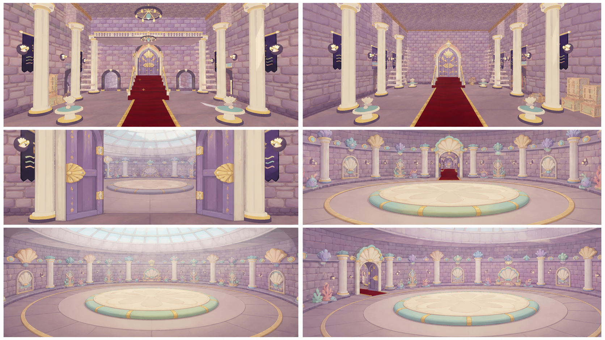
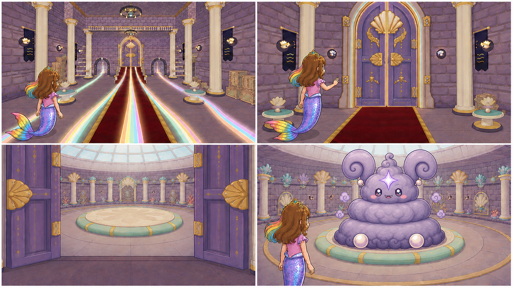
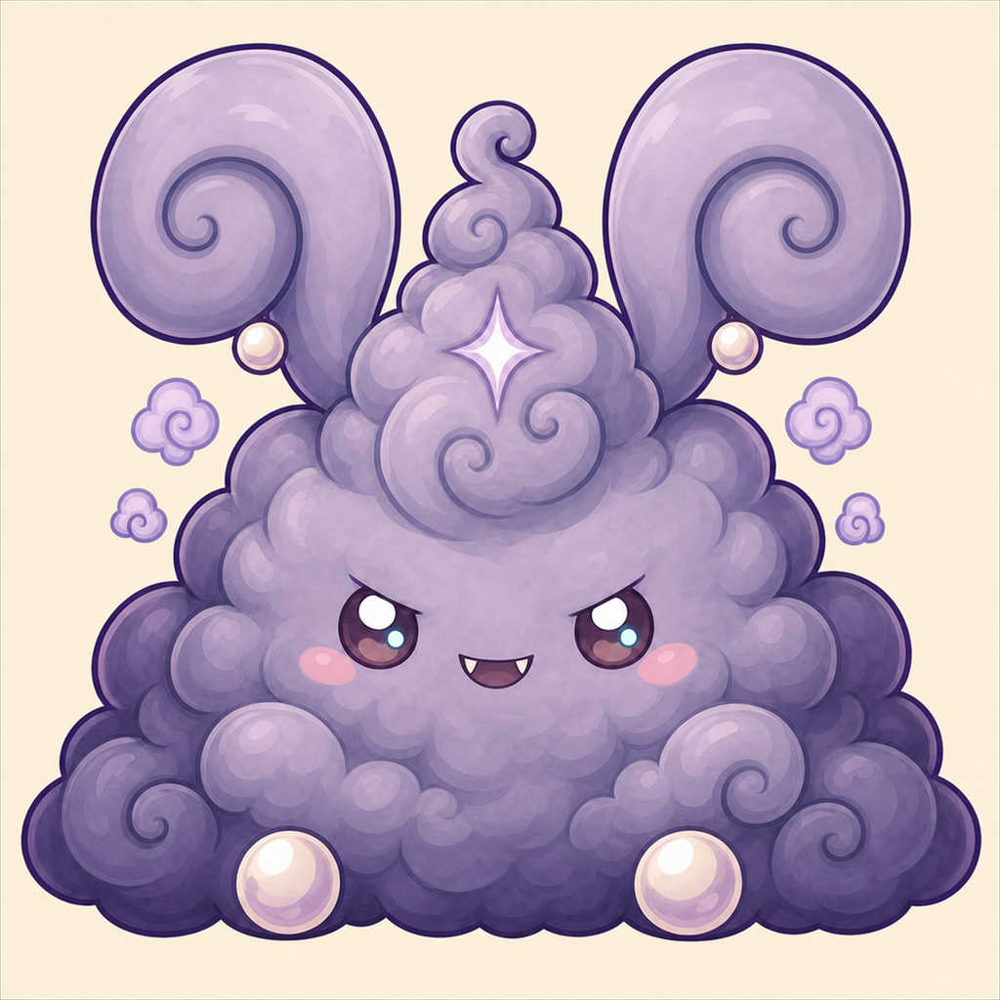
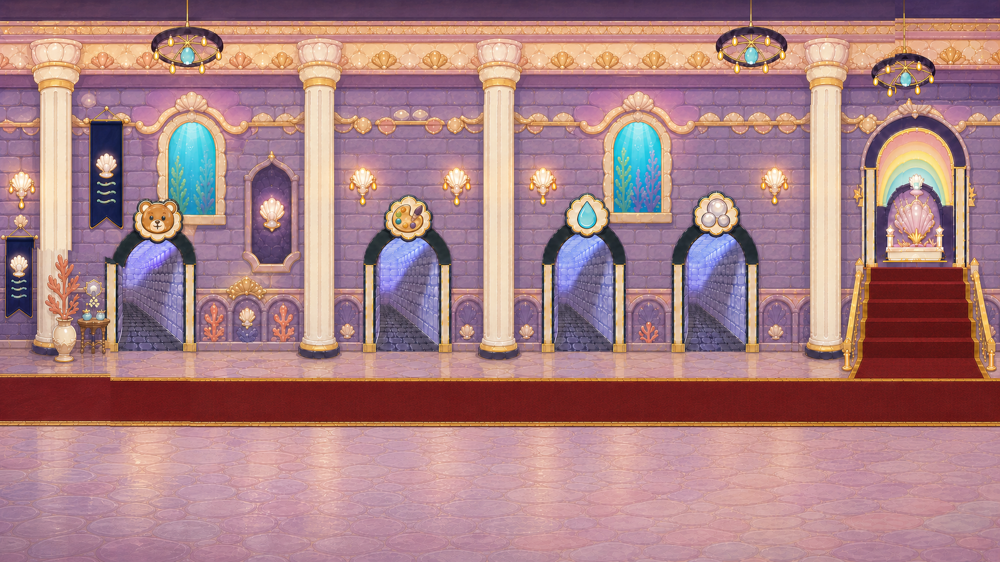

# D1-C11 — Boss Door and Grand Puff Reveal

> `ARCHIVE_COMPLETE`: true
> `GENERATION_READY`: false<br>
> `DELIVERY_ACCEPTED`: false<br>
> Grok output remains motion/editorial reference until the independent full-frame delivery audit passes.

## Use this one-link handoff

1. Review the location-depth sheet, storyboard, and character locks below.
2. Paste the shared guide once, then the scene guide.
3. Generate one shot job at a time with two to four separately approved pixel authorities.
4. Never upload either generated sheet below as `IMAGE_1` or as delivery pixels.

## Multi-angle environment depth



This is a newly generated, complete flattened narrative/topology reference. It demonstrates spatial depth and camera possibilities, but it is not an approved shot opening frame.

## Shot-aligned storyboard



| Shot | Authored visible beat |
|---|---|
| D1-C11-S01 | Wide clean Main Hall. |
| D1-C11-S02 | Medium rear/three-quarter shot using exact Roshan rear identity. |
| D1-C11-S03 | Threshold shot inheriting the accepted door endpoint. |
| D1-C11-S04 | Wide arena reveal. |

## Character reference guide

| Character | Approved identity | Immutable traits | Reject |
|---|---|---|---|
| roshan |  | child face and age; brown hair with rainbow section; pink top and tiara | legs or shoes; adult redesign |
| grand_puff |  | three-tier grey lavender body; huge spiral ears with pearl joints; plum eyes coral blush and compact grin | sharp monster teeth; missing tiers or asymmetrical ear redesign |

## Location authority



- Fixed entrance/exit geography, landmark order, fixture count, and scale.
- Generated angles must describe one connected volume.
- Reject invented doors, basins, platforms, duplicated fixtures, or room rotation.

## Written guides

- [Shared style and character guide](written_guide/SHARED_STYLE_AND_CHARACTER_GUIDE.txt)
- [Exact scene setup and shot copy blocks](written_guide/SCENE_GUIDE.txt)
- [Source document hashes](written_guide/SOURCE_DOCUMENTS.json)

<details>
<summary>Exact scene guide — expand to copy</summary>

```text
D1-C11 — BOSS DOOR AND GRAND PUFF REVEAL

VIDEO SETUP BLOCK — PASTE ONCE
Create four separate clips totaling 7–9 seconds. Preserve the approved clean Main Hall, all four restored room-route lights, exact boss door, approved arena geography, exact Roshan identity, and exact Grand Puff identity. Follow the established boss motion grammar: action, identity, playful vulnerability tell. Grand Puff is enormous and puffy but cute. His vulnerability is the same lavender four-point forehead sparkle used by gameplay, not an injury. End ready for gameplay. Do not copy the gameplay splash layout or typography into the cinematic. No title text, HUD, smoke monster, sharp teeth, threat, defeat, corpse, door redesign, or arena geography jump.

SHOT D1-C11-S01 COPY BLOCK
Wide clean Main Hall. Four restored room-route light trails—Bathroom, Pool, Stuffie, Art—travel along established architectural paths and converge gently on the exact closed boss door. Roshan stands at correct child scale watching. Locked camera; hall geometry and other doors remain fixed. End with the boss door glowing and all four source paths readable. No text, UI icons, fifth trail, dirty room, or door opening yet. Sound: temporary four soft route chimes converging into one low magical tone; no voices.

SHOT D1-C11-S02 COPY BLOCK
Medium rear/three-quarter shot using exact Roshan rear identity. She approaches the glowing boss door through the same clean hall and stops within reach, one continuous rainbow tail moving naturally. One smooth follow camera only. End with her hand just before the handle/seam and the door still closed. No legs, adult proportions, extra character, teleport, or text. Sound: temporary soft tail movement and anticipatory pulse; no voices.

SHOT D1-C11-S03 COPY BLOCK
Threshold shot inheriting the accepted door endpoint. The exact boss door opens into the approved arena with coherent floor, walls, depth, and entry orientation; Roshan remains at threshold while the empty landing zone is revealed. One gentle push through the doorway, stopping before the arena center. End with the landing zone framed. No Grand Puff yet, arena redesign, impossible giant void, scary darkness, or cut to unrelated place. Sound: temporary pearl-door movement and playful low rumble; no voices.

SHOT D1-C11-S04 COPY BLOCK
Wide arena reveal. Exact Grand Puff lands with one soft squash-and-settle motion: three-tier smoky-grey/lavender body, deep-plum curls, huge symmetrical spiral ears with pearl joints, pearl paws, curl crest, glossy plum eyes, coral blush, compact grin with exactly two small pearl teeth. He holds a clear cute identity pose, then his lavender four-point forehead sparkle gives the same playful vulnerability pulse as gameplay. Roshan remains safely at edge. Locked camera. End with Grand Puff upright, smiling, and the tell readable. No smoke body, attack, sharp teeth, injury, title text, HUD, or defeat pose. Sound: temporary soft puffy landing, comic bounce, and bright tell chime; no voices.
```
</details>

## Provenance and audit state

- [Archive manifest](HANDOFF_PACKET.json)
- [Imagine status contract](IMAGINE_HANDOFF.json)
- [Perspective prompt](storyboards/PERSPECTIVE_PROMPT.txt)
- [Storyboard prompt](storyboards/STORYBOARD_PROMPT.txt)
- [Generation result IDs](storyboards/GENERATION_RESULTS.json)

Both generated sheets are `appearance_authority:false`, `bound_reference_eligible:false`, and `used_as_delivery_pixels:false` in the archive manifest. Human owner review remains required before any generated angle becomes a production authority.
