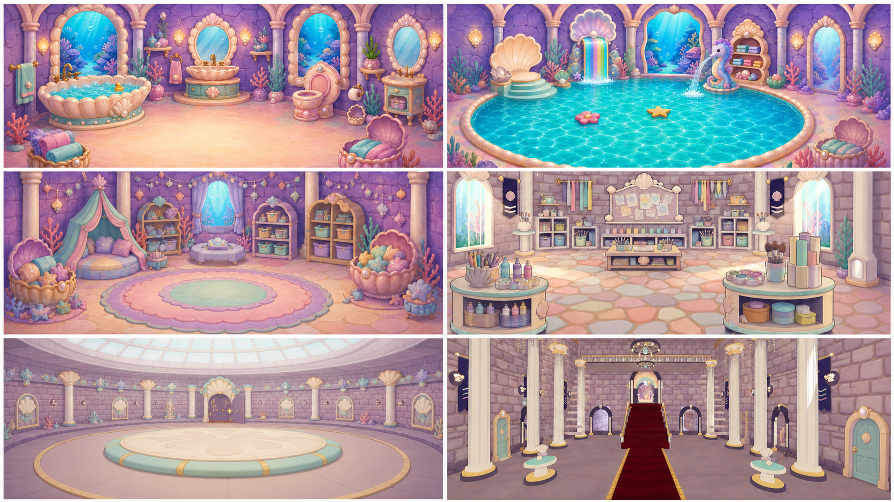
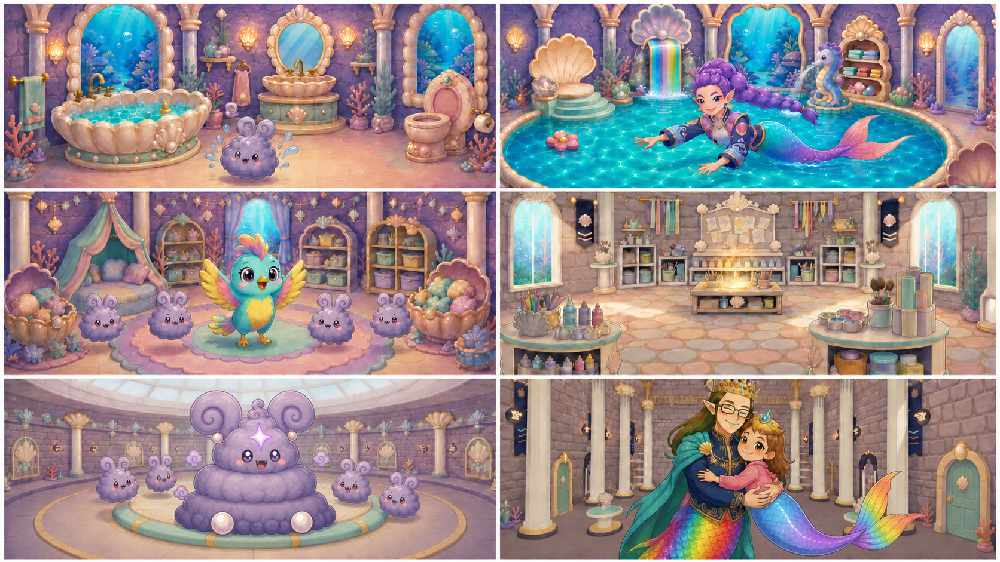
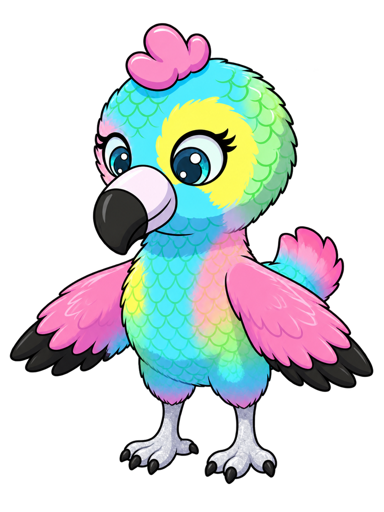
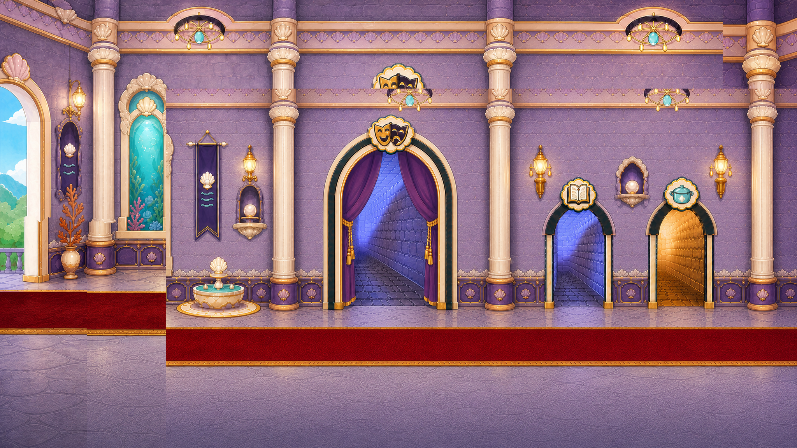

# D1-C12 — Day One Restored-Castle Celebration

> `ARCHIVE_COMPLETE`: true
> `GENERATION_READY`: false  
> `DELIVERY_ACCEPTED`: false  
> Grok output remains motion/editorial reference until the independent full-frame delivery audit passes.

## Use this one-link handoff

1. Review the location-depth sheet, storyboard, and character locks below.
2. Paste the shared guide once, then the scene guide.
3. Generate one shot job at a time with two to four separately approved pixel authorities.
4. Never upload either generated sheet below as `IMAGE_1` or as delivery pixels.

## Multi-angle environment depth



This is a newly generated, complete flattened narrative/topology reference. It demonstrates spatial depth and camera possibilities, but it is not an approved shot opening frame.

## Shot-aligned storyboard



| Shot | Authored visible beat |
|---|---|
| D1-C12-S01 | Clean Bubble Bathroom vignette inheriting D1-C04's accepted endpoint. |
| D1-C12-S02 | Clean giant Mermaid Pool vignette inheriting D1-C06's accepted endpoint. |
| D1-C12-S03 | Clean Stuffie Room vignette inheriting D1-C08's endpoint. |
| D1-C12-S04 | Clean Art Room vignette inheriting D1-C10's endpoint. |
| D1-C12-S05 | Clean boss-arena friendship vignette. |
| D1-C12-S06 | Clean Main Hall reunion. |

## Character reference guide

| Character | Approved identity | Immutable traits | Reject |
|---|---|---|---|
| roshan |  | child face and age; brown hair with rainbow section; pink top and tiara | legs or shoes; adult redesign |
| daddy |  | adult crowned father; dark rectangular glasses; navy and gold clothing with teal cape | generic king; missing glasses or tail |
| rumi |  | enormous violet braided ponytail; pointed ears and star-shell earrings; navy lavender gold-trim jacket | rejected generic pool mermaid; legs or altered braid |
| baby_eagle_standing |  | turquoise yellow and pink child bird; approved beak and face; upright friendly posture | backpack; cropped or duplicated body |
| playroom_bunny |  | round lavender fluff; friendly eyes and blush; consistent curl silhouette | smoke cloud; color-coded redesign |
| grand_puff |  | three-tier grey lavender body; huge spiral ears with pearl joints; plum eyes coral blush and compact grin | sharp monster teeth; missing tiers or asymmetrical ear redesign |
| swimming_bunny |  | round lavender aquatic fluff; spiral ear curls; pearl paws and large warm eyes | land-bunny legs; duplicate or smoke form |

## Location authority



- Fixed entrance/exit geography, landmark order, fixture count, and scale.
- Generated angles must describe one connected volume.
- Reject invented doors, basins, platforms, duplicated fixtures, or room rotation.

## Written guides

- [Shared style and character guide](written_guide/SHARED_STYLE_AND_CHARACTER_GUIDE.txt)
- [Exact scene setup and shot copy blocks](written_guide/SCENE_GUIDE.txt)
- [Source document hashes](written_guide/SOURCE_DOCUMENTS.json)

<details>
<summary>Exact scene guide — expand to copy</summary>

```text
D1-C12 — DAY ONE RESTORED-CASTLE CELEBRATION

VIDEO SETUP BLOCK — PASTE ONCE
Create six separate clips totaling 12–15 seconds and assemble them as a straight-cut clean-room montage. Every shot is one location and one generation. Inherit accepted clean endpoints from the Bathroom, Pool, Stuffie, Art Room, and Grand Puff films instead of reinventing them. End in the clean Main Hall with Roshan and Daddy reunited. Preserve all exact identities and room topology. Rumi stays in the Pool and is never moved to the Main Hall. Exactly one Baby Eagle appears in Stuffie. Grand Puff is befriended, playful, and intact. No multi-location morph, dissolves, geography mashup, extra cast, text, recap UI, or unearned new cleanup.

SHOT D1-C12-S01 COPY BLOCK
Clean Bubble Bathroom vignette inheriting D1-C04's accepted endpoint. The same recovered swimming dust bunny makes one happy paddle/bounce beside the single clean bathtub while bright pearl/aqua/lavender fixtures remain fixed. One subtle push-in. End on sparkling clean water and the safe bunny. Roshan is not required in this room recap. No second tub, dirty residue, duplicated bunny, or room redesign. Sound: temporary clean water and tiny cheerful splash; no voices.

SHOT D1-C12-S02 COPY BLOCK
Clean giant Mermaid Pool vignette inheriting D1-C06's accepted endpoint. Correct adult Rumi/Violet swims gracefully in the enormous clean shared pool while the rainbow waterfall flows top-down and the seahorse fountain flows from its fixed position. One gentle side-follow camera. End with Rumi smiling toward the room entrance. No Roshan in this recap shot, no small basin, backward flow, substitute Rumi, or relocated fixtures. Sound: temporary layered clean water and violet sparkle; no voices.

SHOT D1-C12-S03 COPY BLOCK
Clean Stuffie Room vignette inheriting D1-C08's endpoint. Exactly one recovered turquoise/yellow/pink Baby Eagle gives a small proud wing flutter while friendly playroom dust bunnies bounce once near their established baskets. Locked camera; all furniture stays fixed. End with everyone calm and safe. No duplicate eagle, wing blast cleanup, extra bunny beyond the accepted group, or room redesign. Sound: temporary happy chirp and soft hops; no voices.

SHOT D1-C12-S04 COPY BLOCK
Clean Art Room vignette inheriting D1-C10's endpoint. The blank awakened magic paint desk gives one restrained localized glow; organized brushes, pink paint, blue paint, and cups remain in their established homes. One gentle push toward the desk. End with the room ready for future play, no design completed. No Roshan required, no HUD, text, new art, loose supplies, or topology change. Sound: temporary magical desk arpeggio and clean room ambience; no voices.

SHOT D1-C12-S05 COPY BLOCK
Clean boss-arena friendship vignette. Exact Grand Puff sits upright and playful with his approved friendly dust bunnies; he gives one soft laugh/squash while the lavender forehead sparkle rests rather than signaling danger. Roshan may stand nearby only if inherited from the accepted post-gameplay endpoint. Locked camera. End with Grand Puff smiling, exactly two teeth visible. No defeat, injury, smoke, attack, title card, or boss UI. Sound: temporary puffy chuckle, tiny hops, warm cadence; no voices.

SHOT D1-C12-S06 COPY BLOCK
Clean Main Hall reunion. Exact Roshan returns to exact Daddy Mermaid; Daddy waits, opens his arms, and Roshan completes a warm child-parent embrace with correct hands, distinct torsos, and two separate continuous mer-tails. Preserve Daddy crown, glasses, hair, navy/gold coat, teal cape, tail colors, and Roshan's exact identity. The restored route lights glow softly in fixed architecture. One slow pullback. End on a stable joyful family hug. Rumi remains in the Pool and does not appear. No fused bodies, legs, extra characters, generic king, text, or fade used to hide contact. Sound: temporary warm musical resolution and clean hall ambience; final approved family voices added later.
```
</details>

## Provenance and audit state

- [Archive manifest](HANDOFF_PACKET.json)
- [Imagine status contract](IMAGINE_HANDOFF.json)
- [Perspective prompt](storyboards/PERSPECTIVE_PROMPT.txt)
- [Storyboard prompt](storyboards/STORYBOARD_PROMPT.txt)
- [Generation result IDs](storyboards/GENERATION_RESULTS.json)

Both generated sheets are `appearance_authority:false`, `bound_reference_eligible:false`, and `used_as_delivery_pixels:false` in the archive manifest. Human owner review remains required before any generated angle becomes a production authority.
