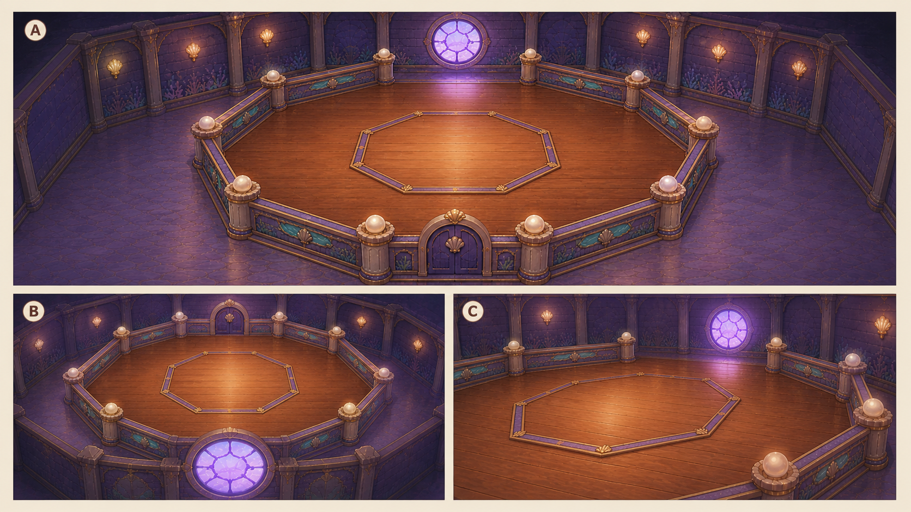
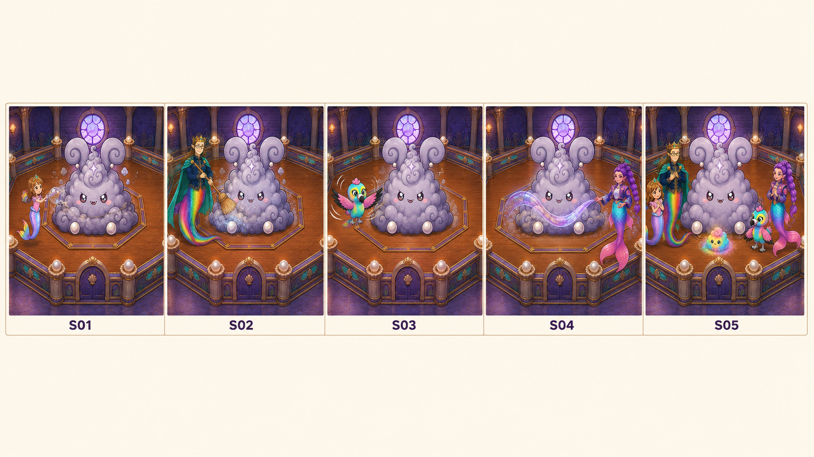
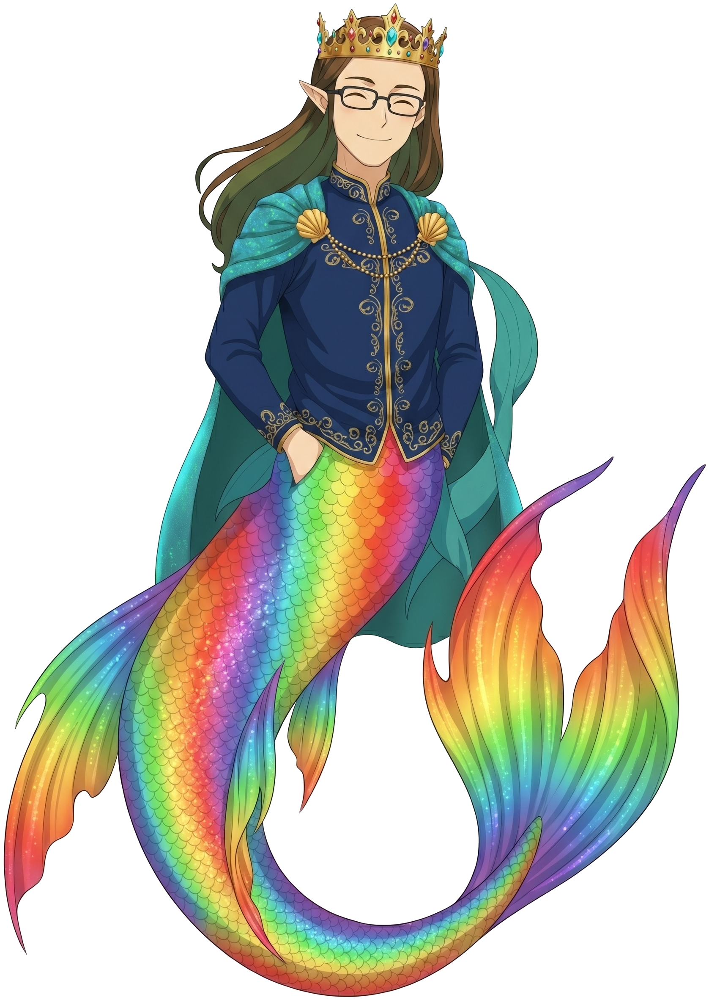
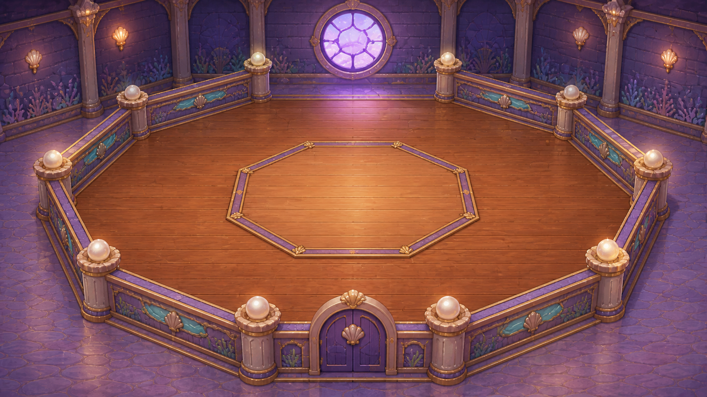

# D1-C13 — Grand Puff Friendship Completion

> `ARCHIVE_COMPLETE`: true
> `GENERATION_READY`: false  
> `DELIVERY_ACCEPTED`: false  
> Grok output remains motion/editorial reference until the independent full-frame delivery audit passes.

## Use this one-link handoff

1. Review the location-depth sheet, storyboard, and character locks below.
2. Paste the shared guide once, then the scene guide.
3. Generate one shot job at a time with two to four separately approved pixel authorities.
4. Never upload either generated sheet below as `IMAGE_1` or as delivery pixels.

## Multi-angle environment depth



This is a newly generated, complete flattened narrative/topology reference. It demonstrates spatial depth and camera possibilities, but it is not an approved shot opening frame.

## Shot-aligned storyboard



| Shot | Authored visible beat |
|---|---|
| D1-C13-S01 | Roshan and Grand Puff only. |
| D1-C13-S02 | Daddy Mermaid and Grand Puff only. |
| D1-C13-S03 | Exactly one Baby Eagle and Grand Puff only. |
| D1-C13-S04 | Rumi and Grand Puff only. |
| D1-C13-S05 | Grand Puff and exactly one small rainbow dust bunny only. |

## Character reference guide

| Character | Approved identity | Immutable traits | Reject |
|---|---|---|---|
| roshan |  | child face and age; brown hair with rainbow section; pink top and tiara | legs or shoes; adult redesign |
| daddy |  | adult crowned father; dark rectangular glasses; navy and gold clothing with teal cape | generic king; missing glasses or tail |
| baby_eagle_standing |  | turquoise yellow and pink child bird; approved beak and face; upright friendly posture | backpack; cropped or duplicated body |
| rumi |  | enormous violet braided ponytail; pointed ears and star-shell earrings; navy lavender gold-trim jacket | rejected generic pool mermaid; legs or altered braid |
| grand_puff |  | three-tier grey lavender body; huge spiral ears with pearl joints; plum eyes coral blush and compact grin | sharp monster teeth; missing tiers or asymmetrical ear redesign |

## Location authority



- Fixed entrance/exit geography, landmark order, fixture count, and scale.
- Generated angles must describe one connected volume.
- Reject invented doors, basins, platforms, duplicated fixtures, or room rotation.

## Written guides

- [Shared style and character guide](written_guide/SHARED_STYLE_AND_CHARACTER_GUIDE.txt)
- [Exact scene setup and shot copy blocks](written_guide/SCENE_GUIDE.txt)
- [Source document hashes](written_guide/SOURCE_DOCUMENTS.json)

<details>
<summary>Exact scene guide — expand to copy</summary>

```text
D1-C13 — GRAND PUFF FRIENDSHIP COMPLETION

VIDEO SETUP BLOCK — PASTE ONCE
Create five separate 16:9, 1280x720, polished 2D storybook clips totaling 15–25 seconds and assemble them with straight cuts. This is a post-gameplay cleanup bridge after the actual third-hit FRIENDS transition, before the C12 celebration. Start only from a human-approved, complete, HUD-free FRIENDS endpoint from the actual transition; D1-C11-S04 is not a substitute. Each shot is one image-to-video generation with one dominant physical action and no more than one camera move. Every accepted shot endpoint becomes the next shot's IMAGE_1. Grand Puff remains friendly, harmless, intact, and exactly himself. The arena geometry must be owner-approved before generation. No injury, defeat corpse, smoke monster, extra creatures, teleportation, room redesign, multi-shot generation, HUD, text, or protected voice imitation. Sound: temporary ambience and foley only; no voices.

SHOT D1-C13-S01 COPY BLOCK
Roshan and Grand Puff only. Roshan makes one gentle final tap or sweep through the residual dust-star around Grand Puff; Grand Puff compresses playfully without damage. Use a locked three-quarter medium or a very small push-in. End with Grand Puff centered, one readable dusty shell band and residual dust core, Roshan safe at frame edge, both holding still for endpoint extraction. Sound: soft tap/brush and tiny sparkle; no voices.

SHOT D1-C13-S02 COPY BLOCK
Daddy Mermaid and Grand Puff only. Daddy makes one broad cape/hand sweep that gathers loose dust into Grand Puff's lower curls, then returns to calm neutral. Use a locked side-medium camera. End with one controlled dust core beneath Grand Puff, Daddy at safe contact distance, and Grand Puff upright and intact. Sound: gentle cape swish and pearl chime; no voices.

SHOT D1-C13-S03 COPY BLOCK
Exactly one Baby Eagle and Grand Puff only. Baby Eagle gives one controlled wingbeat, lifting the remaining loose dust from Grand Puff's tiers; no tornado, collision, or second bird. Use a locked medium-wide camera with only a slight upward follow if necessary. End with Baby Eagle folded on an approved safe perch or foreground position and the final dirty shell isolated and readable. Sound: controlled wing whoosh and light dust lift; no voices.

SHOT D1-C13-S04 COPY BLOCK
Rumi and Grand Puff only. Rumi sends one localized violet/rainbow water-ribbon or sparkle rinse across Grand Puff's exposed shell, clearing the final grime; do not invent a basin or geography. Use a locked frontal/three-quarter camera or one gentle lateral reveal. End with Grand Puff fully clean and friendly and a small prismatic dust cradle on the floor; the rainbow bunny is not visible yet. Sound: gentle water shimmer and violet hum; no voices.

SHOT D1-C13-S05 COPY BLOCK
Grand Puff and exactly one small rainbow dust bunny only. Grand Puff gives a soft friendly poof or squash; the single rainbow dust bunny emerges from the prismatic cradle, settles beside him, and receives the resting sparkle tell. Use a locked full/medium-wide endpoint or one very slow pullback. End on a stable clean Grand Puff and exactly one calm, friendly rainbow dust bunny; this accepted frame becomes D1-C12-S05 IMAGE_1. The rainbow bunny concept remains reference-only until human identity approval and a dedicated packet exist. Sound: soft poof, warm rainbow chime, and friendly two-note cadence; no voices.
```
</details>

## Provenance and audit state

- [Archive manifest](HANDOFF_PACKET.json)
- [Imagine status contract](IMAGINE_HANDOFF.json)
- [Perspective prompt](storyboards/PERSPECTIVE_PROMPT.txt)
- [Storyboard prompt](storyboards/STORYBOARD_PROMPT.txt)
- [Generation result IDs](storyboards/GENERATION_RESULTS.json)

Both generated sheets are `appearance_authority:false`, `bound_reference_eligible:false`, and `used_as_delivery_pixels:false` in the archive manifest. Human owner review remains required before any generated angle becomes a production authority.
