# C14 approval gallery

All visuals are human-pending drafts; boards are narrative-only and are never image bindings.

## C14-S01 — A new friend, one last shared job

First frame `first_frames/D1-C14-S01_OPENING_candidate04.png` / `368fa769d410e43a3f7ef84066a5c0c2ab2c2bb53aec87230fca3a19c343293a`.

Decision: **REVISE_FRIEND_IDENTITY_AND_WEB_CONTINUITY**; human pending.

Known review findings:

- rainbow friend has a red oval forehead jewel rather than the canonical red-orange curl with white iridescent central star
- large lashed eyes still read closer to a fuzzy Eagle-like mascot than the simpler bound cloud-bunny face
- the web is high on the wall near the royal arch while S03 stages its cleanup at the column base; the sequence does not yet establish these as the same reachable web

Review caveat: Regenerate a complete frame preserving the intended five-cast screen-B composition and visible pre-clean mess. Correct the tiny friend's forehead curl/star and simpler cloud-bunny face from rainbow_dust_bunny_concept.png, and place the web at the reachable S03 column-base location.

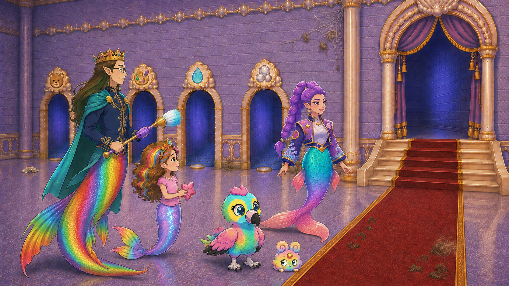

Narrative board only; never bind as IMAGE input.

Decision: **USE_AS_DRAFT_NARRATIVE_GUIDANCE_WITH_FRIEND_IDENTITY_CORRECTION**; human pending.

Known review findings:

- the rainbow friend intermittently reads as a second small Eagle/round bird in panel two and retains the jeweled/lashed face drift
- the high web and later S03 column-base web are not yet spatially reconciled

Review caveat: Narrative glance timing only. Preserve exactly one Baby Eagle plus one canonical small cloud-mound rainbow friend in every generated frame; the friend never becomes a bird. Reconcile the S01 web position with the reachable S03 column-base web before motion generation.

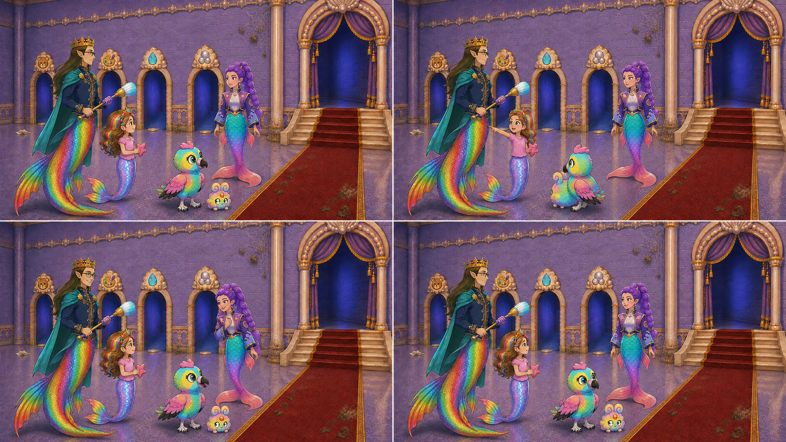

## C14-S02 — The smallest helper makes the first difference

First frame `first_frames/D1-C14-S02_OPENING_candidate02.png` / `8ca06ac43ff12d94e459bd615a6ee7cfd94024fb5ffb3cb8048ed4c7f1dc5d1d`.

Decision: **RECOMMEND_APPROVAL**; human pending.

Review caveat: The current design explicitly secures the sponge offscreen between hard cuts, so its absence is not a prop-continuity failure. First-frame recommendation only.

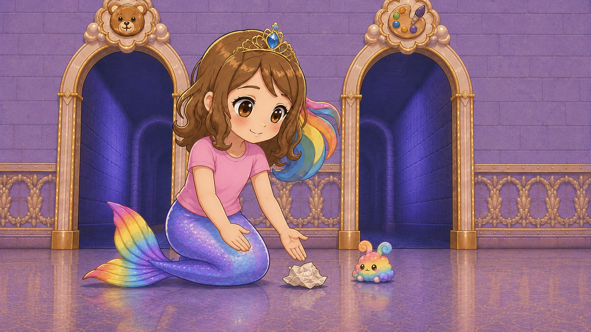

Narrative board only; never bind as IMAGE input.

Decision: **RECOMMEND_APPROVAL**; human pending.

Review caveat: One crumpled paper object remains continuous through nudge and lift. The sponge is intentionally secured offscreen under the revised design. Narrative-board recommendation only.

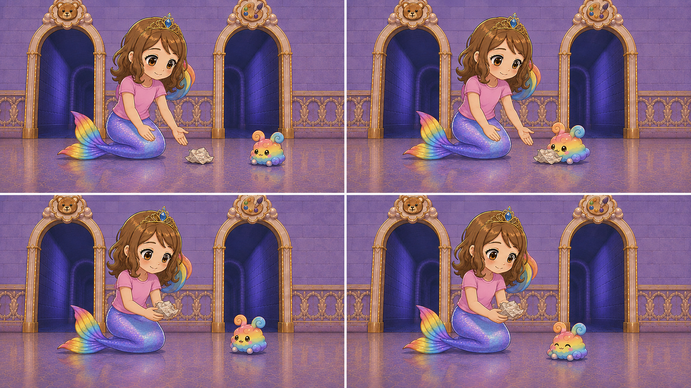

## C14-S03 — Brush and breeze

First frame `first_frames/D1-C14-S03_OPENING_candidate01.png` / `bd86816b3970abc3d8388d359e99b4fae445ca7ecde4856bdda9bbefb4ee09d8`.

Decision: **REVISE_BRUSH_SCALE**; human pending.

Known review findings:

- the brush is enlarged into an implausibly long broom, directly conflicting with the negative constraint against impossible broom length

Review caveat: Preserve action, grip, web, cast and hall. Restore the approved magic-cleaning-brush proportions with a short child-readable handle while retaining reachable contact.

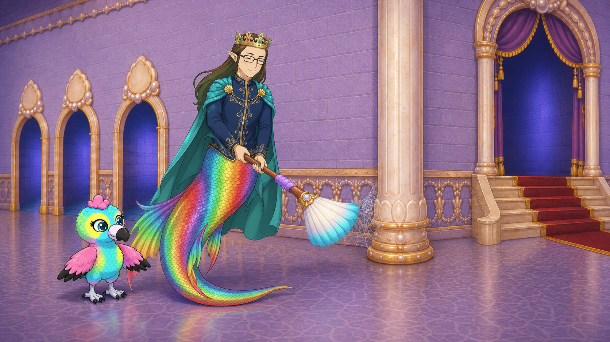

Narrative board only; never bind as IMAGE input.

Decision: **USE_AS_DRAFT_NARRATIVE_GUIDANCE_WITH_PROP_AND_SIGN_CORRECTIONS**; human pending.

Known review findings:

- oversized broom problem persists
- visible door medallions are blank or acquire small invented blue/brush-like icons instead of remaining neutral or preserving actual emblems

Review caveat: Narrative action only. Generated frames must use the correctly scaled brush and preserve actual hall-sign identity; do not copy blank or invented medallion icons.

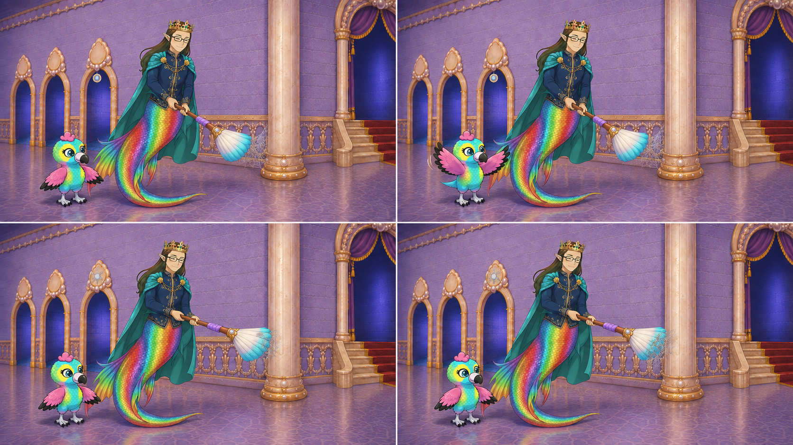

## C14-S04 — A little water, a shared wipe

First frame `first_frames/D1-C14-S04_OPENING_candidate02.png` / `06b12cb4c9163d8d6d2d893538d2fb7ab80d8c03a9e5699414058252e0cf1946`.

Decision: **REVISE_ROSHAN_TOP_ONLY**; human pending.

Known review findings:

- Roshan wears new lavender frilled sleeves instead of the invariant plain pink top

Review caveat: Preserve room, pose, sponge, grime, Rumi, camera and all contact gaps. Restore Roshan's plain approved pink short-sleeve top without frills or new costume trim.

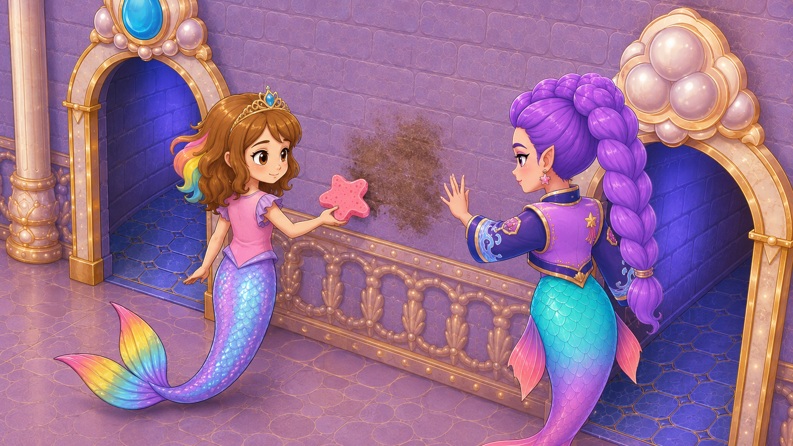

Narrative board only; never bind as IMAGE input.

Decision: **USE_AS_DRAFT_NARRATIVE_GUIDANCE_WITH_COSTUME_CORRECTION**; human pending.

Known review findings:

- Roshan's noncanonical frilled sleeves persist through the board

Review caveat: Narrative action order only. Generated frames must use Roshan's plain approved pink top with no frilled sleeves while preserving the stream-to-sponge, wipe, dirty-sponge lift and dry-wall hold.

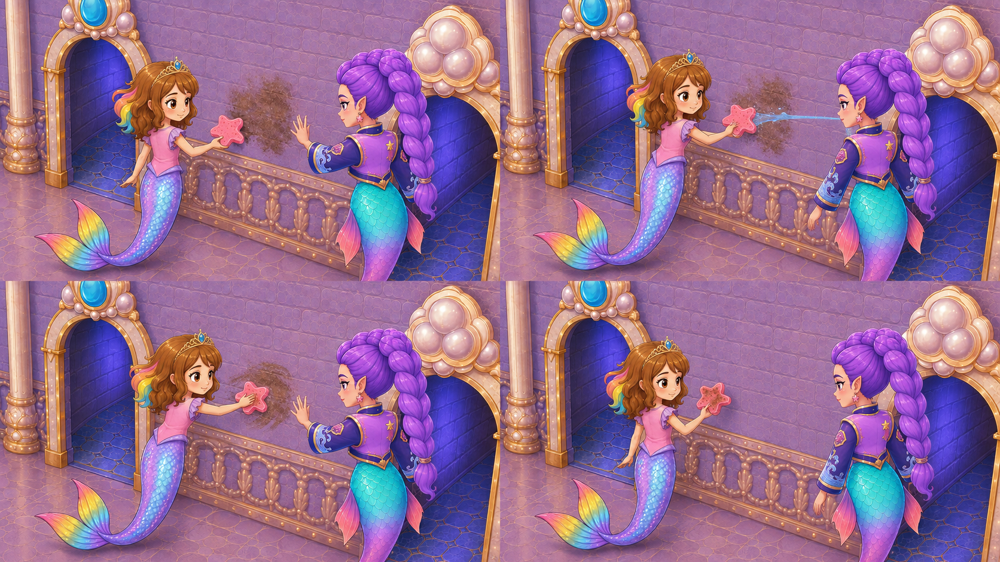

## C14-S05 — One coordinated final sweep

First frame `first_frames/D1-C14-S05_OPENING_candidate01.png` / `af681b80dfd69e1fd482b6a0945c79e635b1b3b5930dc89d633f7d4f4ff3a65c`.

Decision: **REVISE_RAINBOW_FRIEND_IDENTITY_ONLY**; human pending.

Known review findings:

- tiny friend retains the red jewel and heavily lashed mascot face instead of the canonical red-orange curl, iridescent star and simpler cloud-bunny face

Review caveat: Preserve full composition, action contacts, mess, tools, hall and all other cast. Correct only the tiny friend's canonical forehead curl/star and face details without changing its scale or position.

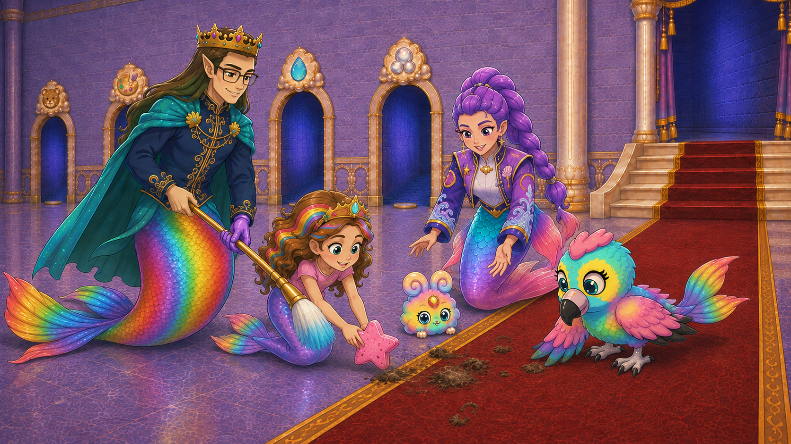

Narrative board only; never bind as IMAGE input.

Decision: **USE_AS_DRAFT_NARRATIVE_GUIDANCE_WITH_PAIL_AND_IDENTITY_CORRECTIONS**; human pending.

Known review findings:

- Rumi still invents and pours a metal pail in panel two instead of briefly dampening Roshan's sponge with her hand
- the pour reaches the floor beside the sponge and risks reading as a puddle rather than localized sponge dampening
- rainbow friend retains its incorrect jeweled/lashed face

Review caveat: Narrative team timing only. Generated frames must contain no pail: Rumi sends one thin hand-directed thread into Roshan's sponge before the wipe, with no floor puddle. Preserve Roshan's stable scale and use the canonical tiny-friend face.

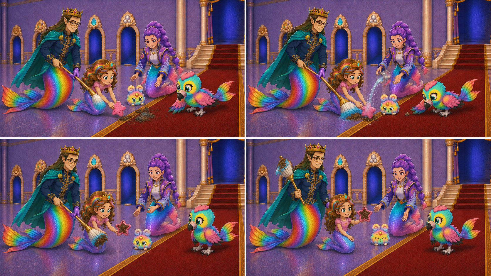

## C14-S06 — Look what we did together

First frame `first_frames/D1-C14-S06_OPENING_candidate01.png` / `13285ffdcc688046a7bc58862cd175279fa427517e1cbe8db0dd83ef0d3c067d`.

Decision: **REVISE_FRIEND_IDENTITY_AND_DIRTY_TOOL_SEAM**; human pending.

Known review findings:

- tiny friend retains the jeweled/lashed noncanonical face
- Daddy's brush tips appear pristine instead of visibly retaining or turning away the captured dirt carried from S05

Review caveat: Preserve camera, hall and company. Correct the tiny friend's face, and keep the brush's dirty bristles visibly retained or deliberately turned away without making the tool silently pristine.

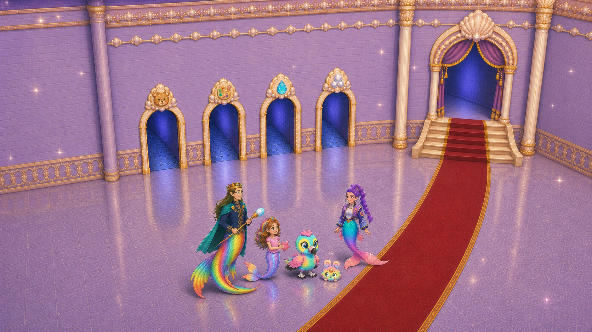

Narrative board only; never bind as IMAGE input.

Decision: **USE_AS_DRAFT_NARRATIVE_GUIDANCE_WITH_IDENTITY_AND_TOOL_SEAM_CORRECTIONS**; human pending.

Known review findings:

- rainbow friend face remains noncanonical
- brush-tip dirt continuity from S05 is not legible

Review caveat: Narrative reveal framing only. Final frames must preserve the canonical tiny-friend face and visibly retain or turn away dirty brush tips from S05; structural cleanliness is not permission to erase tool-state continuity.

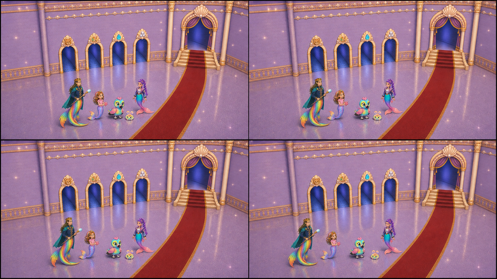
