# First-frame approval gallery

Every image below is a draft opening, not an accepted keyframe. Approve by shot ID and candidate filename/hash. Sol recommendation is not human approval. Rejected visuals remain in the archive but are never enabled as generation bindings.

[Owner-requested revisions and opening reuse](OWNER_REVISION_SUMMARY.md). The active finale is shared teamwork, not isolated helper cuts.

## D1-C01-S04 - closed-door arrival

RECOMMEND_APPROVAL; **human pending**. `D1-C01-S04_OPENING_candidate04_SKY_LAGOON.png` / SHA `c6f0e578f84dffb69364e8481be8de99fac02bed8b04a998c36cc8c13525d091`.

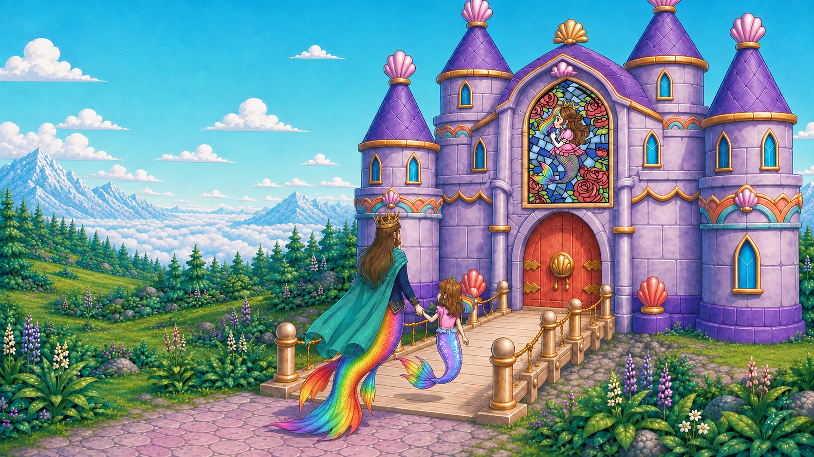

[Shot context and storyboard](shots/D1-C01-S04/README.md)

## D1-C03-S02 - bathroom threshold entry

RECOMMEND_APPROVAL; **human pending**. `luna_a_C03-S02_threshold_attempt02_ROSHAN_ALONE_DIRTY.png` / SHA `a5316be4d62c07cdcc9654e9f02dda5205a1726966c586af4951403e79f780c7`.

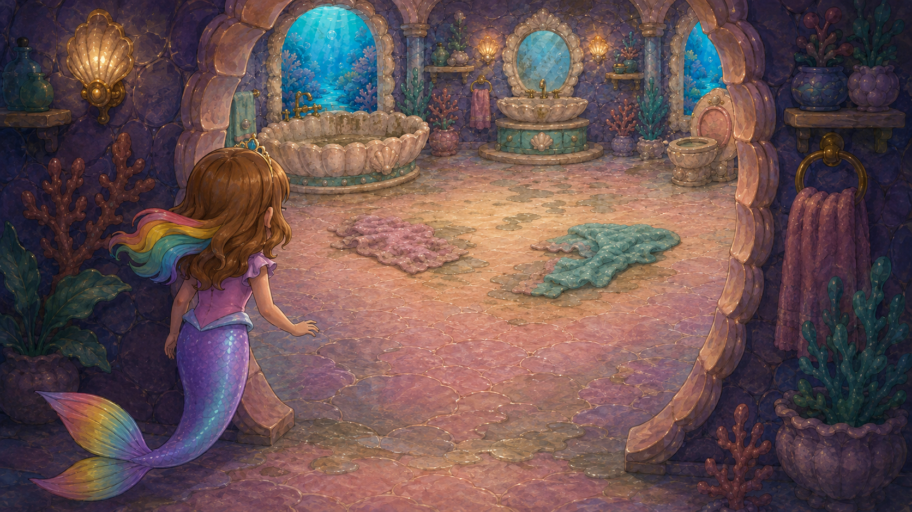

[Shot context and storyboard](shots/D1-C03-S02/README.md)

## D1-C03-S03 - swimming bunny reveal

RECOMMEND_APPROVAL; **human pending**. `luna_a_C03-S03_swimming_bunny_attempt02_DIRTY_MURKY.png` / SHA `ad731205c722ff37ec749750871e7e30051cb187a36fd43cf05cd3f676347ea6`.

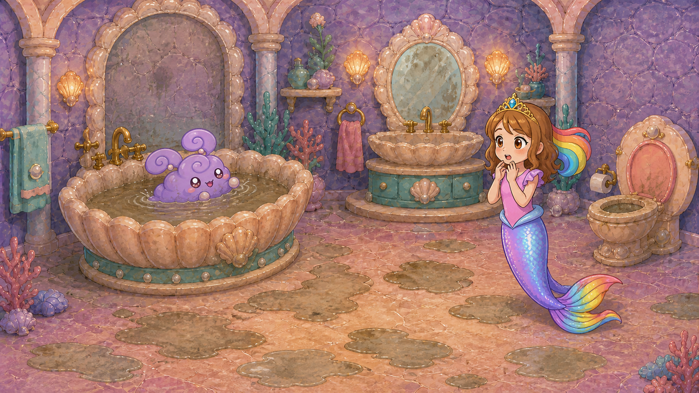

[Shot context and storyboard](shots/D1-C03-S03/README.md)

## D1-C03-S04 - basket tool precontact

RECOMMEND_APPROVAL; **human pending**. `luna_a_C03-S04_precontact_reach.png` / SHA `85935bf017b2693bd1e55f85d4f0b65cb71e1eedbf2a091575842c3d5a0749c9`.

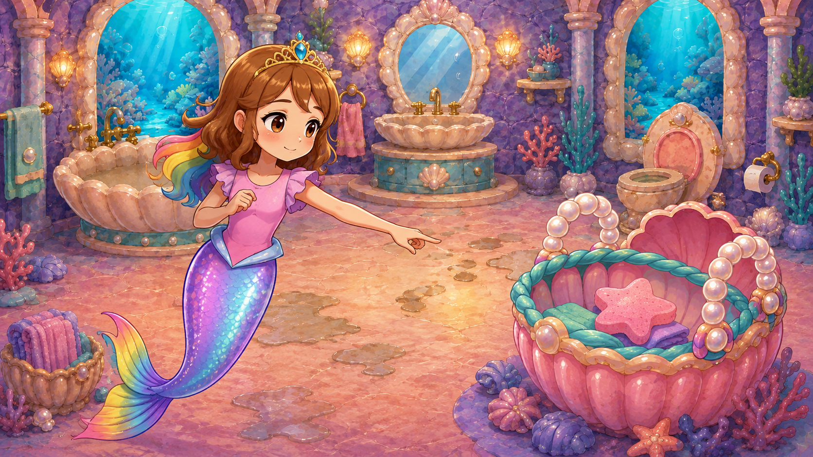

[Shot context and storyboard](shots/D1-C03-S04/README.md)

## D1-C05-S01 - dirty pool entry

RECOMMEND_APPROVAL; **human pending**. `LUNA_B_C05_S01_dirty_wide_OPENING_PENDING_HUMAN.png` / SHA `4fe31121f25bb42c76f75cfe23857691b87353a312532b39dd680df4b2d5d0b9`.

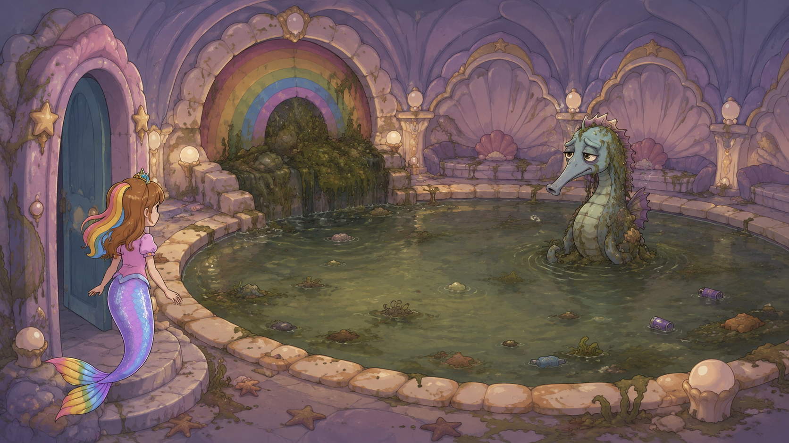

[Shot context and storyboard](shots/D1-C05-S01/README.md)

## D1-C05-S03 - weighted skimmer contact

RECOMMEND_APPROVAL; **human pending**. `LUNA_B_C05_S03_skimmer_OPENING_PENDING_HUMAN.png` / SHA `939e83a8a06e195f57e748e392b338c8d65d66da67d74b80f73abddde6d98766`.

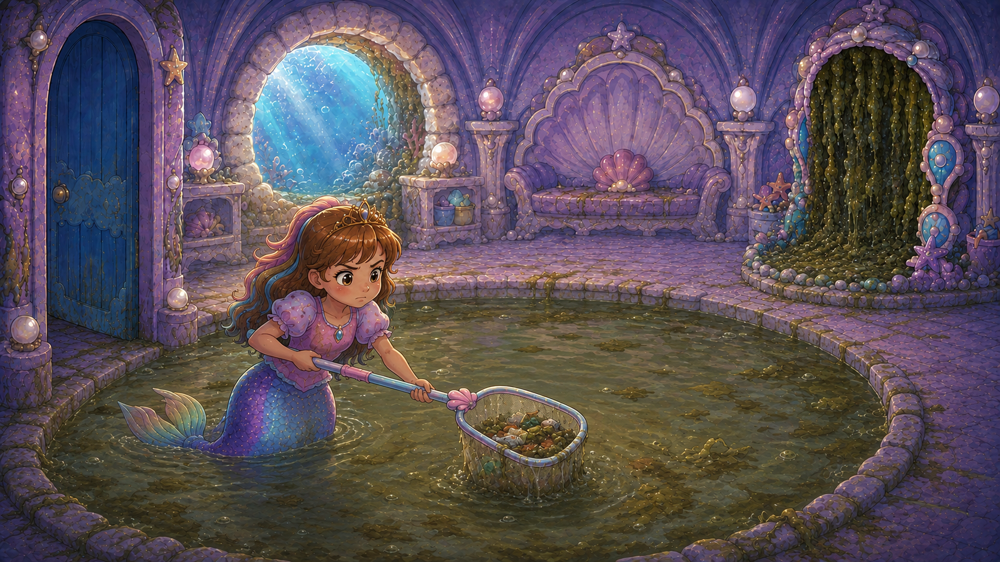

[Shot context and storyboard](shots/D1-C05-S03/README.md)

## D1-C06-S05 - two clean fronts converge

RECOMMEND_APPROVAL; **human pending**. `LUNA_B_C06_S05_two_fronts_OPENING_PENDING_HUMAN.png` / SHA `284d6481f04c64d9bf4280ddeae8eedc3e2359611c21e7c6000ee792ed57e2f4`.

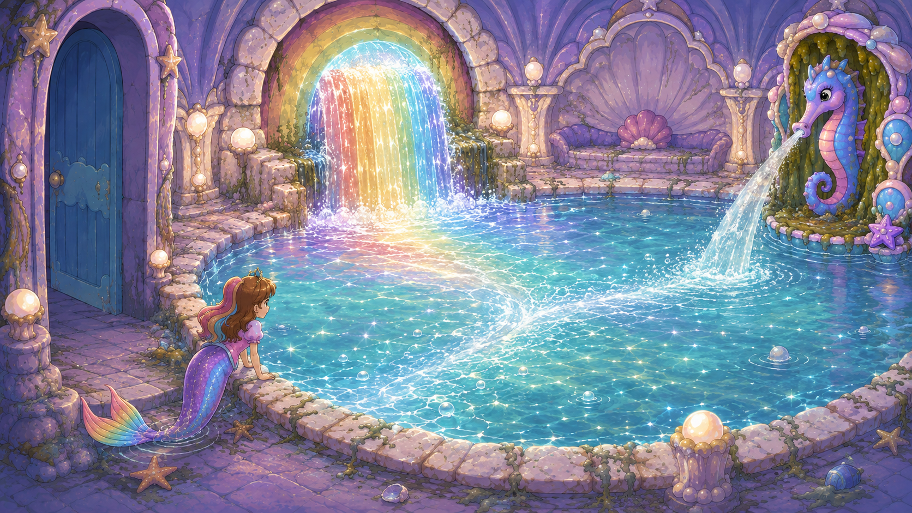

[Shot context and storyboard](shots/D1-C06-S05/README.md)

## D1-C08-S06 - post-rescue celebratory wingbeat

RECOMMEND_APPROVAL; **human pending**. `LUNA_B_C08_S06_post_two_pin_eagle_OPENING_PENDING_HUMAN.png` / SHA `c54cebb63178909ca6fdedf34e93feb3c42c47aa1421cb115b9c42f8924cae11`.

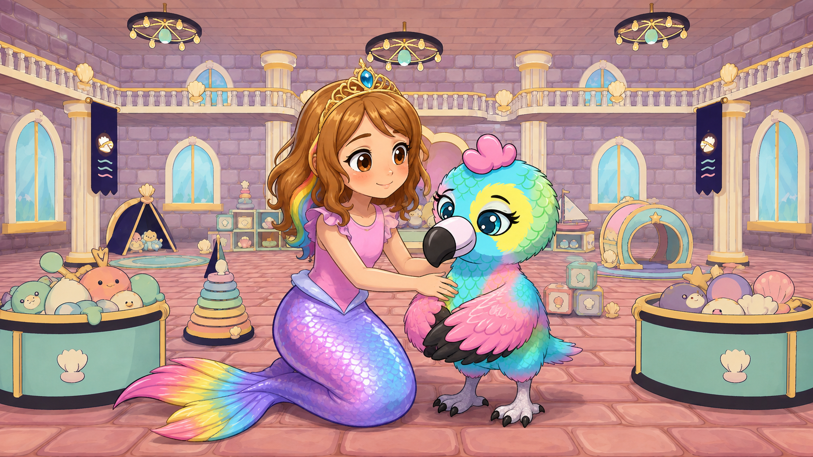

[Shot context and storyboard](shots/D1-C08-S06/README.md)

## D1-C09-S03 - four supplies in real Art Room

RECOMMEND_APPROVAL; **human pending**. `D1-C09-S03_OPENING_candidate02_ANGLE.png` / SHA `4d8c103a0a4ffdd533704757c746f1a3989c9033c5aeb0e8e77100ffc06a45e6`.

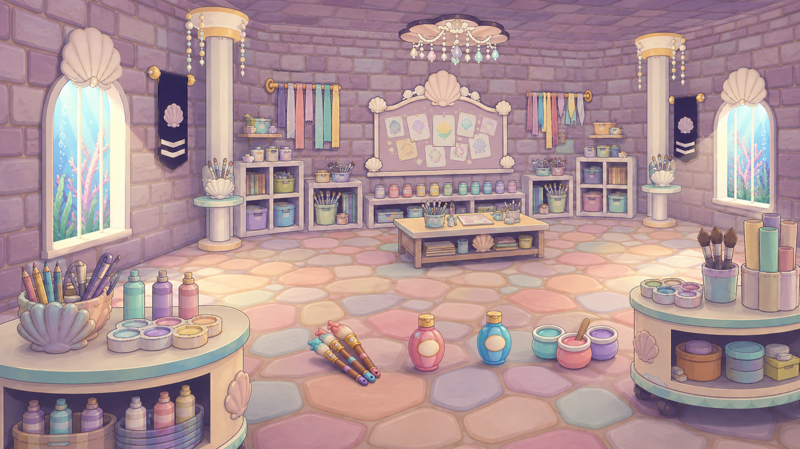

[Shot context and storyboard](shots/D1-C09-S03/README.md)

## D1-C10-S05 - desk handgap

RECOMMEND_APPROVAL_WITH_DIRECTION_AMENDMENT; **human pending**. `D1-C10-S05_OPENING_candidate02_ANGLE.png` / SHA `2c6b143ce588f9bc39efa1548e4d5d605863cff601e2f5d15de34dd305499a86`.

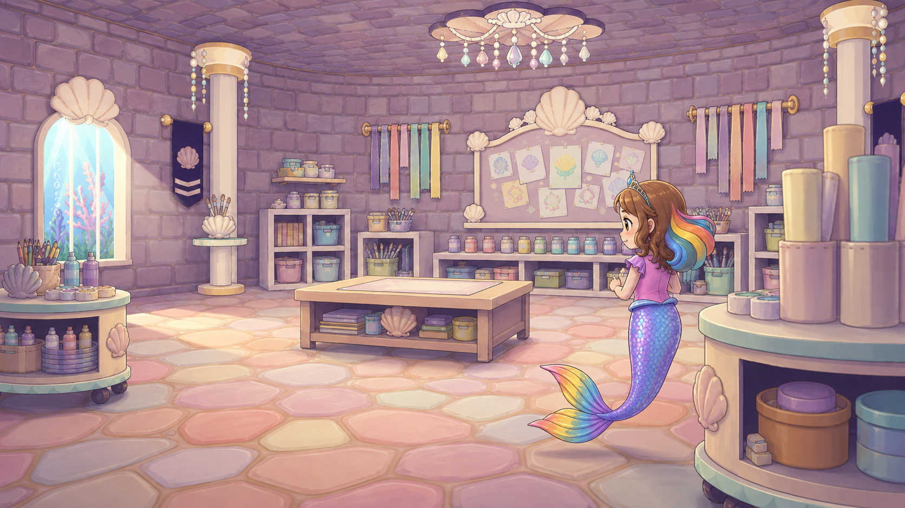

[Shot context and storyboard](shots/D1-C10-S05/README.md)

## D1-C11-S01 - four room trails through the actual curtained-arch hall

RECOMMEND_APPROVAL; **human pending**. `OWNER_C11_S01_LAYOUT_candidate02.png` / SHA `a6edd7964834cce678d1e32e5d28814895972caf1ef349291d5725b2067c266f`.

[Shot context and storyboard](shots/D1-C11-S01/README.md)

## D1-C11-S02 - rear-oblique approach to the open royal arch

RECOMMEND_APPROVAL; **human pending**. `OWNER_C11_S02_PORTAL_APPROACH_candidate02.png` / SHA `06560510c2ba6fcd6bc3ae23a5be1a89529693d751d5aef4e0d685539e6760d7`.

[Shot context and storyboard](shots/D1-C11-S02/README.md)

## D1-C11-S03 - empty dusty arena inspection

RECOMMEND_APPROVAL; **human pending**. `D1-C11-S03_OPENING_candidate02_DUSTY_ATTIC.png` / SHA `9480be180aa5810655c0b10be8714c66af4ae44a94a5a628d997905dbfe025b7`.

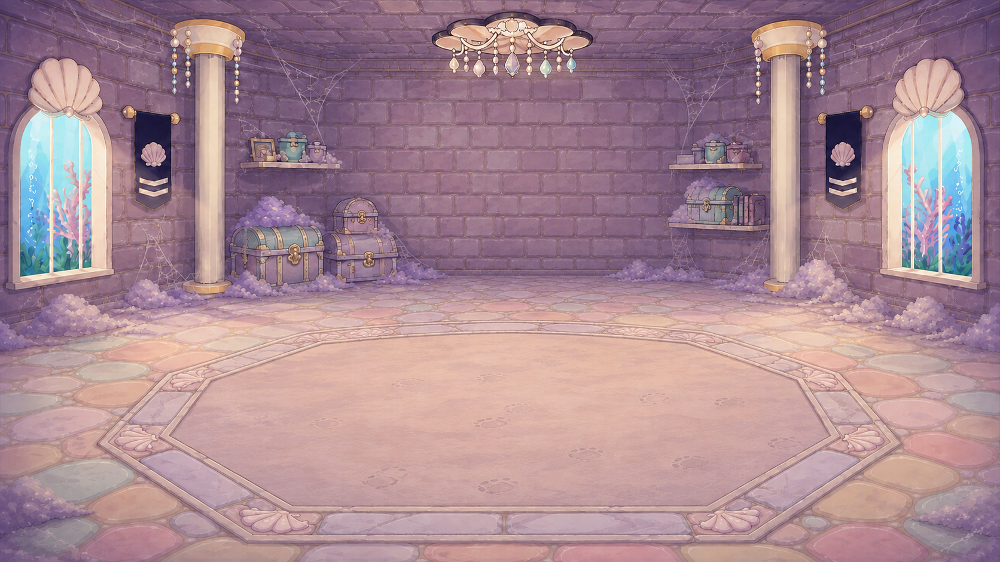

[Shot context and storyboard](shots/D1-C11-S03/README.md)

## D1-C11-S04 - intact Puff lands

RECOMMEND_APPROVAL; **human pending**. `D1-C11-S04_OPENING_candidate03_DUSTY_ATTIC.png` / SHA `60bcf1e9c6fa307629b4625f3442691d74a1e8a59c4bcea6d97550d04b955d01`.

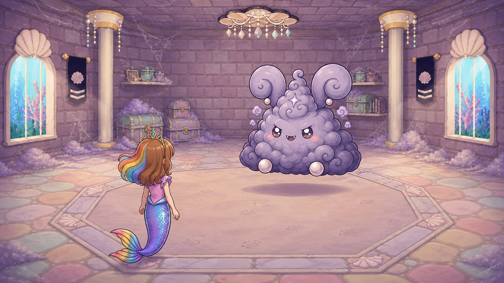

[Shot context and storyboard](shots/D1-C11-S04/README.md)

## D1-C13-S04 - full-team lather buildup on Grand Puff

RECOMMEND_APPROVAL; **human pending**. `OWNER_C13-S04_SUDS_OPENING_candidate01.png` / SHA `ae62b81dc9e8ef6cc6173f678833e6f0a0104bdb0550e08893628fa8bc95d95a`.

[Shot context and storyboard](shots/D1-C13-S04/README.md)

## D1-C13-S05 - opposite-angle team rinse and rainbow-friend reveal through cleared dust body

RECOMMEND_APPROVAL; **human pending**. `OWNER_C13-S05_SUDSY_OPENING_candidate02.png` / SHA `f65676310d8985f676363a381d075088b7e5d35be6f3313e798dbb63f1c16680`.

[Shot context and storyboard](shots/D1-C13-S05/README.md)
