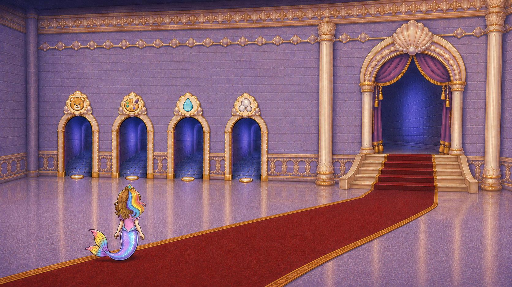
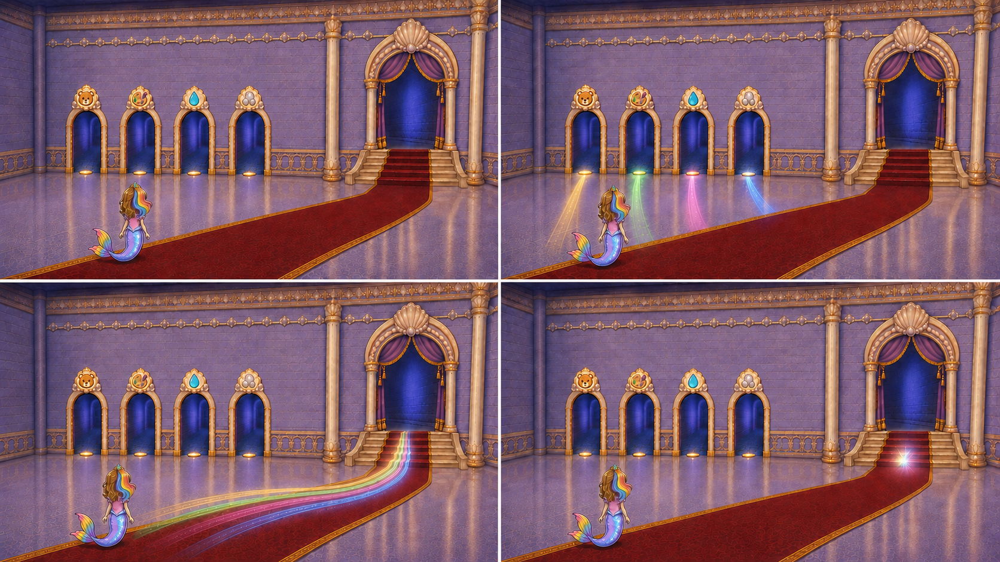
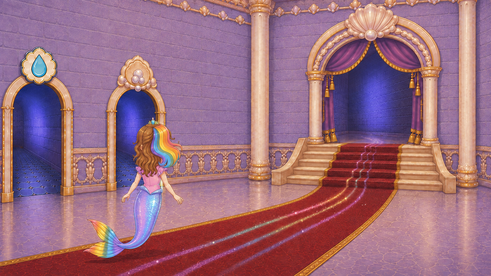
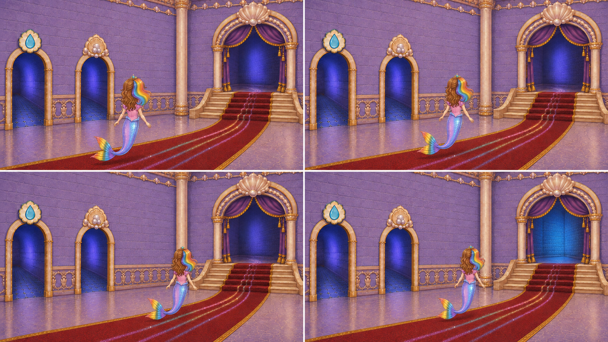
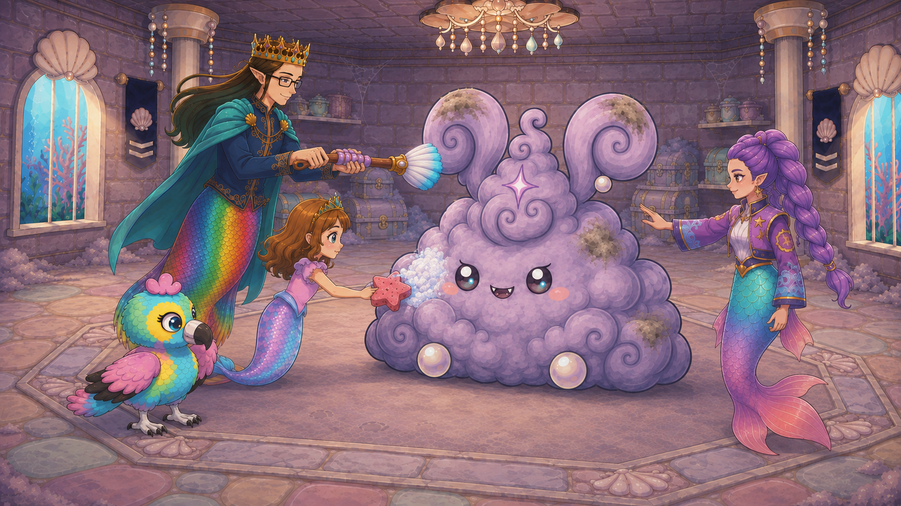
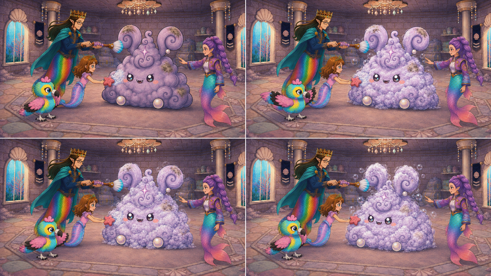
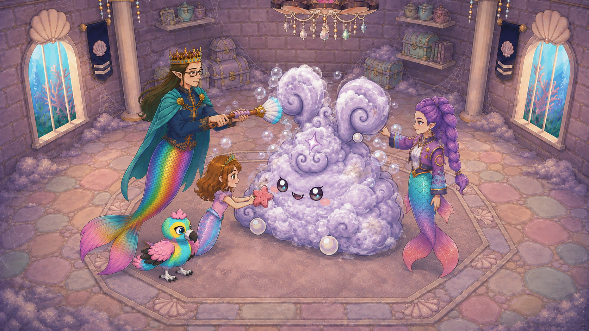

# Latest castle and teamwork revisions for approval

These four revised openings replace the earlier castle-route/approach and finale candidates. All remain human-pending. Approving these does not approve the other shots or any generated video. Boards show narrative intent only, never generation pixels.

[Actual game layout and detailed event/camera contract](CURRENT_CAMERA_AND_EVENT_AUTHORITY.md) | [All 16 first frames](FIRST_FRAME_APPROVAL.md)

## D1-C11-S01 - four room trails through the actual curtained-arch hall

owner rejected obsolete main_hall_2screen geometry and flat camera; rebuilt against runtime August 3 redraw

Camera: locked low-left oblique view diagonally along the right-half hall. Duration: 4 seconds.

Sol: RECOMMEND_APPROVAL; human approval pending. `OWNER_C11_S01_LAYOUT_candidate02.png` / SHA `a6edd7964834cce678d1e32e5d28814895972caf1ef349291d5725b2067c266f`.

[Complete shot handoff](shots/D1-C11-S01/README.md) | [Timeline prompt](shots/D1-C11-S01/PROMPT.txt) | [Frame-by-frame reconstruction prompts](shots/D1-C11-S01/FRAME_PROMPTS.txt)

Narrative order only: panel four under-depicts the final floor traces. In generated motion, hold all four faint but separately colored trails visibly through the stair-foot readiness beat; do not reduce them to only a white stair glow, and keep Roshan continuously visible. This sheet is not end-frame or motion acceptance.

## D1-C11-S02 - rear-oblique approach to the open royal arch

adjoining retained clip also approaches the obsolete rainbow door, so it must be replaced with the corrected hall

Camera: locked child-height rear three-quarter view toward the actual royal arch. Duration: 4 seconds.

Sol: RECOMMEND_APPROVAL; human approval pending. `OWNER_C11_S02_PORTAL_APPROACH_candidate02.png` / SHA `06560510c2ba6fcd6bc3ae23a5be1a89529693d751d5aef4e0d685539e6760d7`.

[Complete shot handoff](shots/D1-C11-S02/README.md) | [Timeline prompt](shots/D1-C11-S02/PROMPT.txt) | [Frame-by-frame reconstruction prompts](shots/D1-C11-S02/FRAME_PROMPTS.txt)

## D1-C13-S04 - full-team lather buildup on Grand Puff

owner requested the missing visible suds buildup and varied camera coverage

Camera: one gentle push-in under four percent from a low front-left thirty-degree view. Duration: 5 seconds.

Sol: RECOMMEND_APPROVAL; human approval pending. `OWNER_C13-S04_SUDS_OPENING_candidate01.png` / SHA `ae62b81dc9e8ef6cc6173f678833e6f0a0104bdb0550e08893628fa8bc95d95a`.

[Complete shot handoff](shots/D1-C13-S04/README.md) | [Timeline prompt](shots/D1-C13-S04/PROMPT.txt) | [Frame-by-frame reconstruction prompts](shots/D1-C13-S04/FRAME_PROMPTS.txt)

Narrative board only: Rumi's rinse is implied by her hand aim and bubbles, not visibly established water contact. Generated motion must show a thin local stream actually reaching Puff's upper-right body curls without crossing his face or ears. The board is not proof that this action has been delivered.

## D1-C13-S05 - opposite-angle team rinse and rainbow-friend reveal through cleared dust body

owner correction: coordinated cleaning visibly clears the giant outer dust form as one tiny rainbow friend emerges; endpoint must contain exactly four helpers plus one friend

Camera: locked elevated front-right twenty-five-degree wide three-quarter view. Duration: 8 seconds.

Sol: RECOMMEND_APPROVAL; human approval pending. `OWNER_C13-S05_SUDSY_OPENING_candidate02.png` / SHA `f65676310d8985f676363a381d075088b7e5d35be6f3313e798dbb63f1c16680`.

[Complete shot handoff](shots/D1-C13-S05/README.md) | [Timeline prompt](shots/D1-C13-S05/PROMPT.txt) | [Frame-by-frame reconstruction prompts](shots/D1-C13-S05/FRAME_PROMPTS.txt)

Narrative order only, not accepted keyframes or scale/identity approval. The giant dust body, face and ears must clear completely as the single rainbow friend emerges; final count is four helpers plus one tiny friend, never two coexisting bunnies. Preserve both shell-topped arena windows and room-edge dust. Keep the complete friend at or below one sixth of the former giant height at equal depth, with canonical white pearl feet; the draft endpoint needs scale/foot refinement. Eagle must move continuously, never copy the board's abrupt position change. Keep wipe/rinse contact active until the outer form clears, then settle tools. Board and endpoint are review-only, never bound generation pixels.
