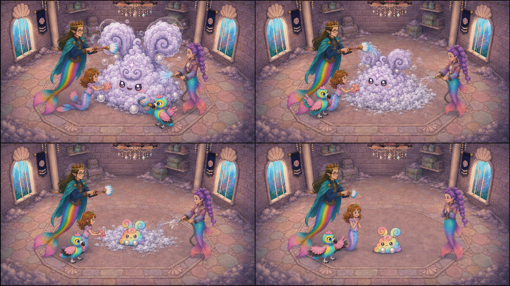
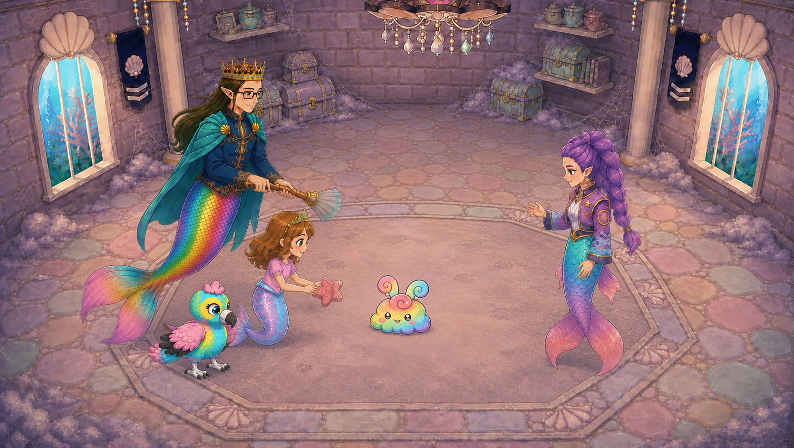
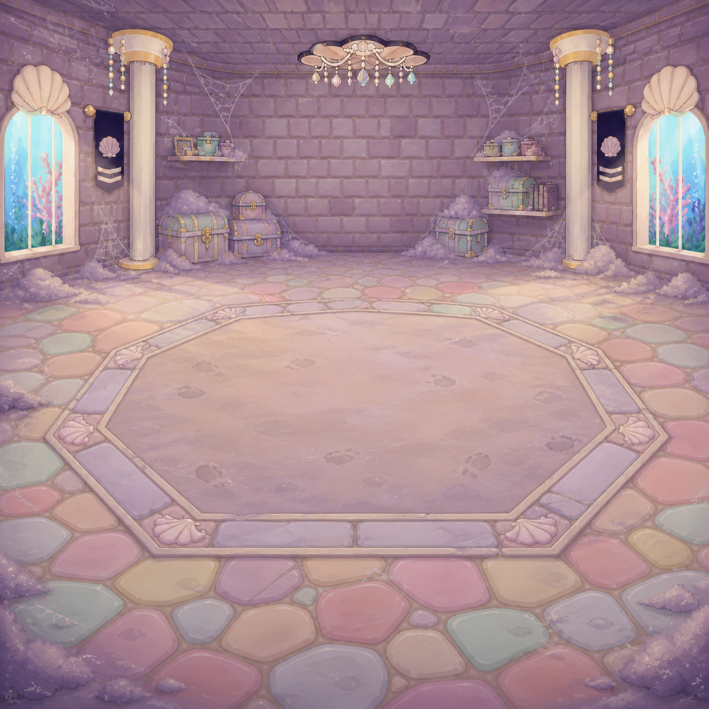

# C13-S05 owner correction — giant dust body clears as the rainbow friend emerges

Status: **PROPOSED / CANDIDATE**, human approval pending. This note records an owner-directed narrative correction; it is not a delivery acceptance or runtime change.

[Complete C13-S05 shot card, prompt and frame plan](../shots/D1-C13-S05/README.md) | [Entire V4 handoff](../README.md)

## Corrected narrative board

This replaces the earlier coexistence board. Read left to right, top to bottom. The giant disappears through the team's final cleaning; no giant body, face or ears remain in the last two panels. The board communicates event order only. Eagle's position must follow a continuous path in motion, not jump between panel positions. Do not use this board as generation pixels.

## Endpoint candidate for approval

Native candidate: 1670×942; SHA-256 `2456f253df99e7950efc643656b4aaee8146736ec0a15042f96a068bc9851320`. This resolves the two-bunny coexistence error but is not an accepted keyframe. Sol flags tiny-friend scale and canonical white pearl feet, settled tool poses and Daddy costume details for further identity refinement. Final action must keep the complete friend no taller than one sixth of the former giant at equal depth. Human approval remains pending.

## Correction

The earlier S05 direction and coexistence board required the giant Puff to remain intact beside an additional tiny rainbow friend. That wording is superseded for S05 only. The corrected event begins with the same giant foamed form and four helpers, then uses the coordinated final wipe/rinse to visibly diminish and clear the outer giant dust body while the one tiny rainbow friend emerges. By the final hold:

- exactly Roshan, Daddy, Baby Eagle and Rumi plus one tiny rainbow friend remain;
- the giant dust body, face and ears are completely absent;
- there are not two coexisting bunnies, a giant walk-off, body explosion, pain beat or additional spawn;
- the change must be authored as complete full frames, with no cross-dissolve, compositing, tween or snap.

C13-S04 remains the intact giant-lather shot and is unchanged.

## Locked stage reference

The checked authority is [`references/owner_restored_arena/dusty_attic_arena_native_1254.png`](../references/owner_restored_arena/dusty_attic_arena_native_1254.png), SHA-256 `9cb4b02dc4a56e1436ea0a6b21dccf4ef751716d213e3ff7624571f15a9e2cb6`, dimensions 1254×1254. It visibly contains two tall shell-topped blue/coral windows on the side walls, two ivory columns, a centered chandelier, chests/shelves and a stone octagon. These are the S05 geography landmarks; the older Main Hall window assumptions do not apply to this dusty-attic stage.

The preserved earlier arena contract remains appearance/layout evidence; its old solo choreography and intact-giant-plus-baby ending are superseded by this correction and CURRENT_CAMERA_AND_EVENT_AUTHORITY.md.

## Authored target ranges

At 24 fps, S05 remains 192 frames / 8 seconds with these half-open ranges:

`[0,24)` sudsy opening; `[24,96)` coordinated four-helper removal; `[96,132)` continued final wipe/rinse contact while the giant dust body visibly thins; `[132,156)` curl-part and friend peek during active wipe/rinse; `[156,174)` friend takes one small step as the final wipe/rinse clears body/face/ears completely and tools withdraw/water stops/wings fold; `[174,192)` settle with exactly four helpers and one friend.

These ranges are editorial reconstruction targets, not a claim of exact external-video frame control. The full-frame rule remains binding for any later delivery work.

## Archive disposition

The prior “giant remains intact / additional friend” language and related coexistence board remain preserved as superseded narrative history. They must not be selected for the corrected S05 event. This correction does not approve any first frame, storyboard, generated frame or runtime selection.
