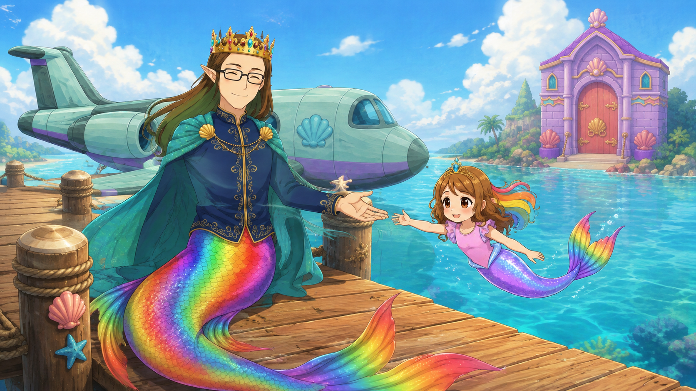
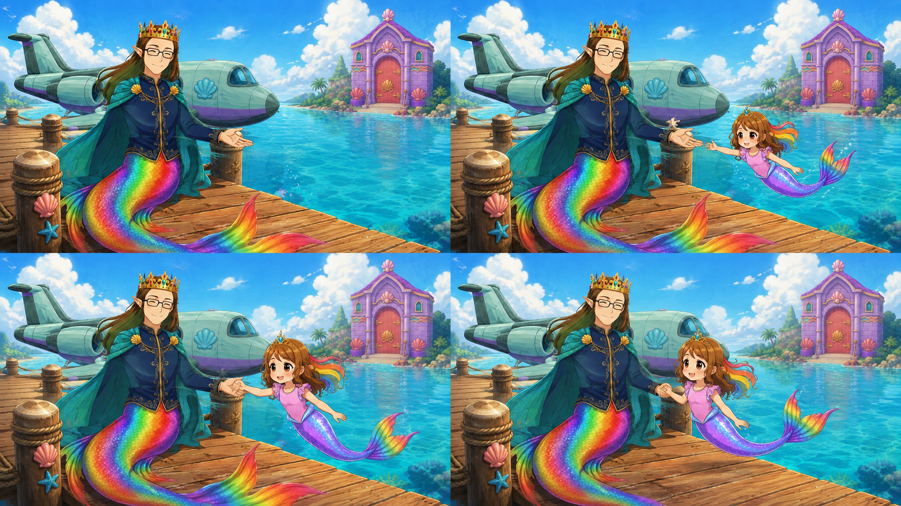
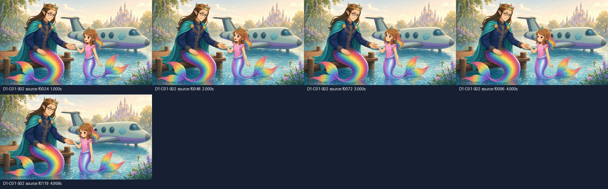

> SUPERSEDED — historical shot only, not an active generation job. See [current V4 queue](../../../README.md).

# D1-C01-S02 - dock handoffer

DRAFT - human first-frame approval pending. Motion reference only.

replace selected regen: adult/child scale and hand-tail blocking remain unstable

Game seam: follows C01-S01 dock arrival; ends before C01-S03 hand-in-hand approach

Source: C01_S02_v1_dock_handoffer_REGEN.mp4; zero-based half-open select [24, 120].

Weak source evidence: [[24, 120]]. Sampled visual evidence, not every-frame acceptance.

## First frame for approval

Sol: RECOMMEND_APPROVAL. Candidate SHA-256: `71dbbdbb4165034298e0bc3a515a408ab19724c921e65e913d8ce81df5e9100f`.



## Narrative board - never bind to Grok



## Bind only these images after approval

- [IMAGE_1 - approved_clean_first_frame](../../../first_frames/luna_a_C01-S02_handoffer_attempt02_DADDY.png)

- [IMAGE_2 - subject_identity](../../../references/2eda6f7676_daddy_daddy_master.png)

- [IMAGE_3 - subject_identity](../../../references/69827625a8_roshan_base.png)


## Shot and frame instructions

[Paste-ready single-shot prompt](PROMPT.txt) | [Every target-frame prompt](FRAME_PROMPTS.txt) | [Frame plan JSON](FRAME_PLAN.json) | [Shot card](SHOT_PACKET.json)

```text
locked camera on the first-frame layout in IMAGE_1. 0.00–1.00s: Daddy's offered hand stays still; Roshan looks at it and begins a small forward glide, with visible space between their hands. 1.00–2.00s: Roshan extends one near hand toward Daddy's palm; both continuous tails and their adult/child scale stay separate. 2.00–3.25s: Their hands meet once, fingers remain separately readable; no body growth or fused wrist, Daddy does not pull Roshan. 3.25–4.00s: Hold the stable joined-hand pose for the cut into the retained hand-in-hand approach. keep room geometry and bound identities fixed. Only Daddy and child Roshan; no Rumi before C06. Plane, dock posts, waterline and distant castle are fixed. No legs, fused hands, extra fingers, adult/child scale drift or camera motion. no HUD, text, morphing or camera drift. end: Daddy and child Roshan hold hands on the dock, with separate tails and stable scale.
Sound: soft water, dock creak, one gentle hand-contact foley; no voices.
```

## Direct underlying game references

- [sky_lagoon_plane_v5_hd_grade.png](../../../references/850d9614c2_sky_lagoon_plane_v5_hd_grade.png) - source `assets/sprites/sky_lagoon/sky_lagoon_plane_v5_hd_grade.png`

- [sky_lagoon_castle_gate_v3.png](../../../references/f1003ba7d1_sky_lagoon_castle_gate_v3.png) - source `assets/sprites/sky_lagoon/sky_lagoon_castle_gate_v3.png`

- [daddy_daddy_master.png](../../../references/2eda6f7676_daddy_daddy_master.png) - source `assets_src/cinematics/day_one_grok_handoff_v3_2026-09-04/scenes/D1-C01/visuals/handoff_art/characters/daddy_daddy_master.png`

- [roshan_base.png](../../../references/69827625a8_roshan_base.png) - source `assets/characters/roshan_25d/roshan_base.png`


## Current source frames - audit only



[Individual source frames and index manifest](../../../audit/source_frames/D1-C01-S02/SAMPLE_MANIFEST.json)


The source game assets above control event/state and location. A gameplay capture or generated board must never supply generation pixels. The first frame controls the new shot only after your explicit approval.
