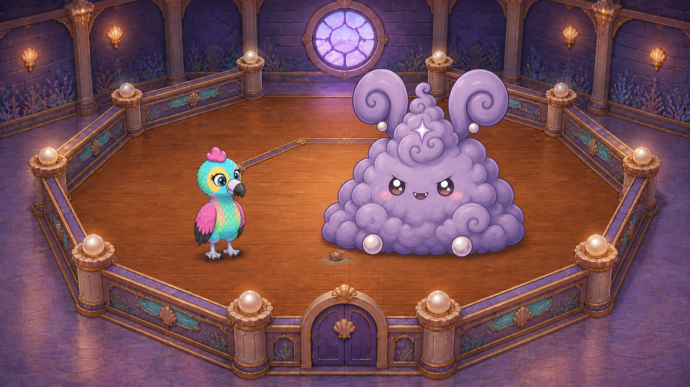
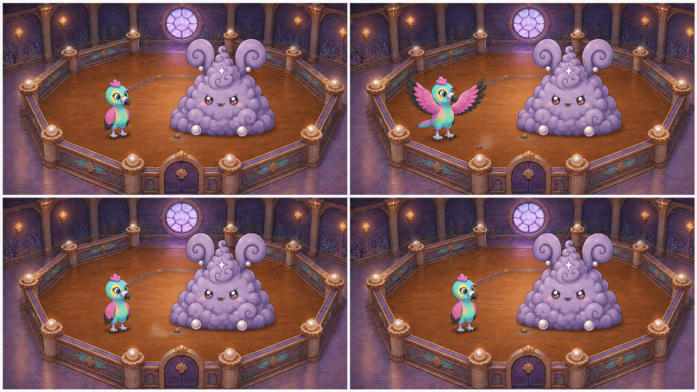

> SUPERSEDED — historical shot only, not an active generation job. See [current V4 queue](../../../README.md).

# D1-C13-S03 - controlled Eagle dust lift

DRAFT - human first-frame approval pending. Motion reference only.

Missing helper turn in the owner-directed C13 extension; no selected current clip supplies this action.

Game seam: follows C13-S02 Daddy sweep; precedes proposed shell-cradle extension

Source: Missing coverage; no current source frames; zero-based half-open select None.

Weak source evidence: []. Sampled visual evidence, not every-frame acceptance.

## First frame for approval

Sol: RECOMMEND_APPROVAL. Candidate SHA-256: `1c463ea91e1d471963da19f247271ec471a90b52448e2769b9e930dde8fe3caf`.



## Narrative board - never bind to Grok



## Bind only these images after approval

- [IMAGE_1 - approved_clean_first_frame](../../../first_frames/D1-C13-S03_OPENING_candidate02.png)

- [IMAGE_2 - subject_identity](../../../references/90c54412aa_baby_eagle_standing_BABY_EAGLE_STANDING_IDENTITY.png)

- [IMAGE_3 - subject_identity](../../../references/e585e52562_grand_puff_BOSS_DUST_BUNNY_IDENTITY.png)


## Shot and frame instructions

[Paste-ready single-shot prompt](PROMPT.txt) | [Every target-frame prompt](FRAME_PROMPTS.txt) | [Frame plan JSON](FRAME_PLAN.json) | [Shot card](SHOT_PACKET.json)

```text
locked camera on the first-frame layout in IMAGE_1. 0.00–1.00s: Eagle stands viewer-left with folded wings and both feet planted; one clean intact Puff remains viewer-right. 1.00–2.00s: Eagle makes one controlled wingbeat, lifting only the tiny residual floor-dust patch beside Puff's lower-left edge. 2.00–3.25s: The lifted dust clears gently without a ring or plume; the tiny dirt-coated shell remains on the wood. 3.25–4.00s: Eagle folds both wings and holds the grounded pose; only the little dirty shell/smudge remains for Rumi. keep room geometry and bound identities fixed. One Eagle with turquoise body, yellow eye patches, pink crest and wings with black tips; one intact lavender Puff. Arena, Puff placement, pearl rails and tiny shell position remain fixed. No dust from Puff's body, airborne Eagle, second bird, extra helper, dust ring or whole-room blast. no HUD, text, morphing or camera drift. end: Eagle is grounded with folded wings beside intact Puff, leaving only the tiny dirty shell for Rumi.
Sound: small wingbeat, controlled dust puff and settle; no voices.
```

## Direct underlying game references

- [baby_eagle.png](../../../references/da8ead4677_baby_eagle.png) - source `assets/book/baby_eagle.png`

- [dust_bunny_boss_laugh_vulnerable.png](../../../references/bdcf03aab9_dust_bunny_boss_laugh_vulnerable.png) - source `assets/sprites/dust_bunnies/boss/dust_bunny_boss_laugh_vulnerable.png`

- [DUSTY_ATTIC_OCTAGON_ARENA_MASTER.png](../../../references/ba0048fc93_DUSTY_ATTIC_OCTAGON_ARENA_MASTER.png) - source `assets_src/cinematics/day_one_grok_handoff_v3_2026-09-04/scenes/D1-C13/visuals/location_authorities/DUSTY_ATTIC_OCTAGON_ARENA_MASTER.png`


The source game assets above control event/state and location. A gameplay capture or generated board must never supply generation pixels. The first frame controls the new shot only after your explicit approval.
