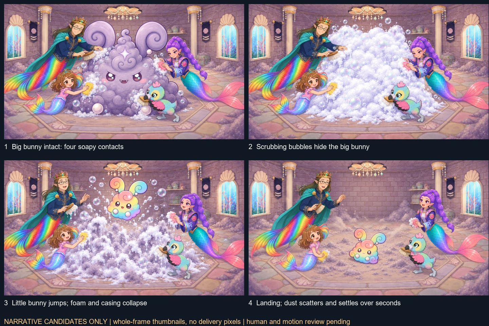

# Overnight recut: frame repair and Grok handoff

This packet audits **last night's rendered 2:11.250 film**, not the older Grok handoff. Start with [the self-contained fresh frame audit](FRAME_AUDIT.txt), also available as a [formatted report](../../../audit/OVERNIGHT_RECUT_FRAME_AUDIT_2026-09-12.md), then [the repair queue](SHOT_REPAIR_QUEUE.json). The exact video fingerprint is in [SOURCE_CUT.json](SOURCE_CUT.json).

The owner now requires the **concept-matching rainbow dust bunny to jump out of the old dusty shell while Roshan, Daddy, Rumi and Baby Eagle scrub**. This replaces the old hard-cut reveal for this revision. Read [the new direction and identity invariants](OWNER_DIRECTION.json). Historical locks do not override it.

The corrected sequence is **recognizable big bunny -> everyone scrubs with visible soap -> bubbles hide his form -> little rainbow bunny jumps as the old casing collapses -> dust scatters over the following seconds**. The big bunny has his own lavender ears at the start. The little bunny's rainbow ears/body remain hidden until the jump. No intact shell remains after collapse.

Read [Baby Eagle's new identity audit](BABY_EAGLE_IDENTITY_AUDIT.json): the original book image replaces the rejected standing/pinned redraws. Daddy must match his exact clean-shaven master, navy coat, teal cape and rainbow tail. The room must retain the original attic's low shell ceiling light, columns, windows, banners, shelf/chest positions and flush stone octagon. Earlier drifting narrative boards are rejected or superseded evidence, never appearance authorities.

The full-frame candidates show [recognizable bunny and soap](candidates/R09_big_bunny_scrub_opening.png), [bubbles hiding his form](candidates/R09_suds_endpoint.png), [jump and collapse](candidates/R10_jump_from_suds.png), and [dust settling](candidates/R11_dust_settle.png). The setup was rebuilt from the actual attic and all four character masters. These are pending human review, not accepted openings or delivered movie frames. See [generation history](REVISED_STORYBOARD_GENERATIONS.json) and [limited background measurements](BACKGROUND_CONTINUITY_CHECK.json). The contact sheet is never a generator-bound image.

## Operator sequence

1. Pilot R09 -> R10 -> R11. Review the recognizable big-bunny start, four wet-soap contacts, bubble buildup that hides his form, first little-bunny reveal at takeoff, simultaneous collapse, landing and multi-second dust dispersal before generating Hall B descendants R12/R15/R16.
2. Open each `boards/Rxx.jpg`: these are redeveloped three-beat operator boards with actual room/identity references. Images illustrate authorities; the new action is described in the captions. They are never generator-bound first frames.
3. Prepare one complete opening from each `shots/Rxx/OPENING_BRIEF.txt`. Preserve separate room and identity authority. Four-helper scenes need a complete ensemble opening proving every identity; do not evade the 2-4 image budget by omitting a helper.
4. After exact-hash human approval, bind that image as IMAGE_1 and the listed two or three identity/object images as IMAGE_2-4. Use `PROMPT.txt` only after a separate V1/V2 execution card passes the existing Imagine readiness gate. Missing IMAGE_1 is explicit; no room plate is a fallback.
5. Generate one shot per job. Review native-speed motion and every contact/reveal frame, then match endpoints in the edit. Do not bind this packet's evidence images, beat boards or HUD captures. Use their seam constraints in words.

## Delivery and frame indexing

All old indices are zero-based master frames at 24 fps, `[start,end)` with end exclusive. Each shot card maps these to source filenames, hashes and source-frame intervals. They are replacement envelopes; they do not claim every old frame independently failed. Proposed reference durations are deliberate and require reconforming the edit. Never stretch, repeat or interpolate frames to force the new action into an old duration.

The archive includes the actual approved room, character and object images, the concept, source edit plan, new rendered-frame evidence and beat boards. Its manifest inventories every payload file with source, dimensions, SHA-256, provenance and modification status. `REMOTE_VERIFICATION.json`, once present, binds the immutable GitHub content commit and is separate from the payload manifest.

**ARCHIVE_COMPLETE:** see remote verification. **GENERATION_READY: false** until complete openings, human reviews and execution cards exist. **DELIVERY_ACCEPTED: false.** This handoff specifies film repairs; it does not claim that new movies have already been generated or replace runtime media. Grok image-to-video is motion reference only under the independent full-frame delivery rule.

## Direct job links

Start with [the Grok operator brief](START_GROK.txt). Every row is one independently generated clip after opening review.

| Job | Board | Opening brief | Motion prompt |
|---|---|---|---|
| R01 Make discovery visibly dirty | [board](boards/R01.jpg) | [opening](shots/R01/OPENING_BRIEF.txt) | [prompt](shots/R01/PROMPT.txt) |
| R02 Brush contact must remove dirt | [board](boards/R02.jpg) | [opening](shots/R02/OPENING_BRIEF.txt) | [prompt](shots/R02/PROMPT.txt) |
| R03 Match the restored bathroom and recap | [board](boards/R03.jpg) | [opening](shots/R03/OPENING_BRIEF.txt) | [prompt](shots/R03/PROMPT.txt) |
| R04 Pull the plug clear before water starts | [board](boards/R04.jpg) | [opening](shots/R04/OPENING_BRIEF.txt) | [prompt](shots/R04/PROMPT.txt) |
| R05 Show two water fronts meeting | [board](boards/R05.jpg) | [opening](shots/R05/OPENING_BRIEF.txt) | [prompt](shots/R05/PROMPT.txt) |
| R06 Keep the Art Room problem present on entry | [board](boards/R06.jpg) | [opening](shots/R06/OPENING_BRIEF.txt) | [prompt](shots/R06/PROMPT.txt) |
| R07 Wipe a legible clean strip | [board](boards/R07.jpg) | [opening](shots/R07/OPENING_BRIEF.txt) | [prompt](shots/R07/PROMPT.txt) |
| R08 Finish the approach with contact and settle | [board](boards/R08.jpg) | [opening](shots/R08/OPENING_BRIEF.txt) | [prompt](shots/R08/PROMPT.txt) |
| R09 Everyone scrubs the old dust shell | [board](boards/R09.jpg) | [opening](shots/R09/OPENING_BRIEF.txt) | [prompt](shots/R09/PROMPT.txt) |
| R10 Rainbow bunny jumps out of the scrubbed shell | [board](boards/R10.jpg) | [opening](shots/R10/OPENING_BRIEF.txt) | [prompt](shots/R10/PROMPT.txt) |
| R11 Let the new friend settle and be recognized | [board](boards/R11.jpg) | [opening](shots/R11/OPENING_BRIEF.txt) | [prompt](shots/R11/PROMPT.txt) |
| R12 Carry the same friend into paper pickup | [board](boards/R12.jpg) | [opening](shots/R12/OPENING_BRIEF.txt) | [prompt](shots/R12/PROMPT.txt) |
| R13 Duster must touch and collect a web | [board](boards/R13.jpg) | [opening](shots/R13/OPENING_BRIEF.txt) | [prompt](shots/R13/PROMPT.txt) |
| R14 Water and sponge remove the wall stain | [board](boards/R14.jpg) | [opening](shots/R14/OPENING_BRIEF.txt) | [prompt](shots/R14/PROMPT.txt) |
| R15 Preserve the rainbow friend during team cleanup | [board](boards/R15.jpg) | [opening](shots/R15/OPENING_BRIEF.txt) | [prompt](shots/R15/PROMPT.txt) |
| R16 Keep the concept bunny in the clean wide | [board](boards/R16.jpg) | [opening](shots/R16/OPENING_BRIEF.txt) | [prompt](shots/R16/PROMPT.txt) |
| R17 Restore book Eagle in pinned discovery | [board](boards/R17.jpg) | [opening](shots/R17/OPENING_BRIEF.txt) | [prompt](shots/R17/PROMPT.txt) |
| R18 Restore book Eagle in recovered wingbeat | [board](boards/R18.jpg) | [opening](shots/R18/OPENING_BRIEF.txt) | [prompt](shots/R18/PROMPT.txt) |
