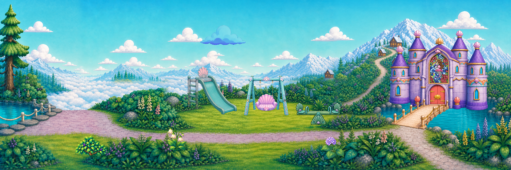

# Sky Lagoon moderate animation references — v2

Owner-requested moderate-resolution examples of all ten previous studies, with a revised importer and a layered Sky Lagoon sample. `MOTION_REFERENCE_ONLY / CANDIDATE`; new visual selection remains open.

Open [index.html](index.html) through a local web server for crisp PNG playback, pause, key scrubbing and native-pixel inspection. The running workstation preview is http://127.0.0.1:8191/. GitHub hosts the complete durable archive; local previews are staging only.

## Deliverables

| Sample | Raster keys | Editable master | PNG board |
|---|---:|---|---|
| Fir branch sway | 6 × 512×512 | [01_fir.aseprite](objects/01_fir/01_fir.aseprite) | [All keys](objects/01_fir/spritesheet.png) |
| Huckleberry leaf flutter | 6 × 512×512 | [02_huckleberry.aseprite](objects/02_huckleberry/02_huckleberry.aseprite) | [All keys](objects/02_huckleberry/spritesheet.png) |
| Hydrangea stem sway | 6 × 512×512 | [03_hydrangea.aseprite](objects/03_hydrangea/03_hydrangea.aseprite) | [All keys](objects/03_hydrangea/spritesheet.png) |
| Bellflower nod | 6 × 512×512 | [04_bellflower.aseprite](objects/04_bellflower/04_bellflower.aseprite) | [All keys](objects/04_bellflower/spritesheet.png) |
| Cloud billow | 6 × 512×512 | [05_cloud.aseprite](objects/05_cloud/05_cloud.aseprite) | [All keys](objects/05_cloud/spritesheet.png) |
| Smoke curl | 6 × 512×512 | [06_smoke.aseprite](objects/06_smoke/06_smoke.aseprite) | [All keys](objects/06_smoke/spritesheet.png) |
| Swing fore-and-aft | 6 × 512×512 | [07_swing.aseprite](objects/07_swing/07_swing.aseprite) | [All keys](objects/07_swing/spritesheet.png) |
| Seesaw rock | 6 × 512×512 | [08_seesaw.aseprite](objects/08_seesaw/08_seesaw.aseprite) | [All keys](objects/08_seesaw/spritesheet.png) |
| Castle gate open | 6 × 512×512 | [09_gate.aseprite](objects/09_gate/09_gate.aseprite) | [All keys](objects/09_gate/spritesheet.png) |
| Stained glass shimmer | 12 × 512×512 | [10_glass.aseprite](objects/10_glass/10_glass.aseprite) | [All keys](objects/10_glass/spritesheet.png) |

The set contains 54 fresh generated pose drawings plus 12 authored stained-glass light states: 66 distinct saved raster states. Nine native sheets are 1024×1536, with six 512×512 cells each. Each object has transparent PNG states, a power-of-two atlas, JSON timing and source/authoring receipts. Native sheets and source originals are preserved separately.

The [Sky Lagoon sample](scene/sky_lagoon_sample.mp4) is 1920×640, 48 frames at 12 fps (four seconds). Its [layered Aseprite master](scene/sky_lagoon_sample.aseprite) contains the approved v5 panorama, existing slide, current four-tower castle, fresh playground keys and garden/ambient studies. Fixed scenery uses linked cels. [Scene parameters](scene/SCENE_PARAMETERS.json) record every placement and the shared castle anchor.

## What changed

- Built-in `image_gen` generated larger new pose drawings from existing identity references. [PROMPT_SET.json](PROMPT_SET.json) contains the exact nine prompts and two padding-repair prompts. No CLI/API-key generation or ComfyUI video job supplied these new keys.
- The Aseprite Lua importer removes disconnected alpha dust, rejects fringe noise, registers anchors and fits the union of poses inside a 512px canvas. It uses native nearest-neighbor raster sampling, not browser/GIF enlargement. The smoke keeps intentional soft alpha; other subject contours are made opaque at alpha ≥192.
- The wide huckleberry uses uniform downsampling to keep every leaf inside the frame. One native edge tip gets a tiny Aseprite-painted closing cap in new padding, recorded in its receipt. This supplies no action pose.
- The swing reuses the larger 1338×1176 approved frame source. Six new detached-seat pitch drawings show near/far cushion and underside changes under two fixed hooks. Ropes are painted between hook and seat sockets; no sideways rotation supplies the action. Contact/perspective polish remains open.
- Seesaw beams/seats/handles have fresh tilted drawings. Axle registration and a small fixed bottom-support region replace the earlier whole-object rotation. Gate leaves open into transparent space while its façade stays fixed.
- Stained glass reuses the 880×1216 owner-supplied artwork, isolates its arch and paints twelve restrained light states. It preserves portrait geometry. In the context sample the existing castle portrait itself gets light; a different portrait is not pasted over it.

## Aseprite workflow

Open an object `.aseprite` file. The visible layer contains cleaned animation keys; one hidden native-reference cel provides the untouched first input pose. Work at 100% or integer zoom. Add intermediate drawings and revise details on new layers; the native generated sheets remain provenance inputs. The gate master stores the six opening keys; the browser/scene play its recorded forward-and-return order.

For the full environment, open `scene/sky_lagoon_sample.aseprite`. The fixed background and slide use linked cels; animated objects retain independent layers. The approved 6144×2048 panorama is uniformly downsampled for this reference sample. Runtime slicing/resolution/import acceptance is not granted by this sample.

Rebuild cleaned samples with `python -s -B production/build.py --overwrite`; use `--id 07_swing` to rebuild one. Build/recheck the environment with `python -s -B production/finish.py`; `--verify-only` reopens exports without rebuilding scenery. Use Aseprite 1.3.18.4, Python 3.13, NumPy 2.5.1, Pillow 12.3.0, SciPy 1.18.0 and FFmpeg 8.1.2. Tool paths are explicit workstation defaults near the top of each Python file and can be adjusted for another workstation. Python only reads/analyzes raster data; Aseprite authors all raster edits and composition.

Aseprite API references: [Sprite](https://www.aseprite.org/api/sprite/), [Image](https://www.aseprite.org/api/image/), [Layer](https://www.aseprite.org/api/layer/).

## Context ownership and review limits

The existing panorama is unchanged. Equipment uses current meadow anchors; the castle and bridge use `scripts/arena/sky_lagoon_layout.json`. Garden examples are study placements on open foreground grass. The generated door-leaf region is cropped into the existing castle aperture only for the motion comparison; this composition is not a runtime screenshot or cinematic delivery.

The extra fir is delivered as a standalone study and excluded from the context composite because the current shared composition contract disables that tree to protect the scenic mountain path. The painted background fir stays intact. No Roshan character animation, gameplay, save, touch, performance or engine source is changed.

These are larger pose studies, not finished smooth loops or a human hand-drawn pixel-art redraw. Six drawings per object still leave visible timing steps, AI detail/topology drift and manually authored contact limits. Owner selection, additional drawings, runtime integration, Mobile/device/child checks and cinematic gates remain open. No finding is closed.

## Evidence and delivery

[MACHINE_VERIFICATION.json](MACHINE_VERIFICATION.json) records exact native RGBA round trips for all ten masters, 66 distinct states, clear alpha margins and the layered scene first frame. [PROJECT_VERIFICATION.json](PROJECT_VERIFICATION.json) records authority/development/import/source checks. [REVIEW.json](REVIEW.json) distinguishes inspection from owner acceptance. [MANIFEST.json](MANIFEST.json) records each payload file, hash, dimensions, role, provenance and deterministic sorted payload SHA-256.

Authorized public destination: https://github.com/Ebonyks/mermaid-roshan-reef/tree/codex/sky-lagoon-moderate-animation-20261001/assets_src/cinematics/sky_lagoon_moderate_motion_v2_2026-09-30. The immutable revision and anonymous access/byte verification are recorded in `REMOTE_VERIFICATION.json` after publication. That operational receipt and the manifest itself are excluded from the payload to avoid circular hashes.

`ARCHIVE_COMPLETE` requires published exact-revision byte verification. `GENERATION_READY` is false: this is a motion-study archive, not a role-bound video shot card. `DELIVERY_ACCEPTED` is false: none of these sprite/context studies satisfies full-frame cinematic regeneration evidence. Protected originals, prior rejected studies and owner approval states are preserved.
