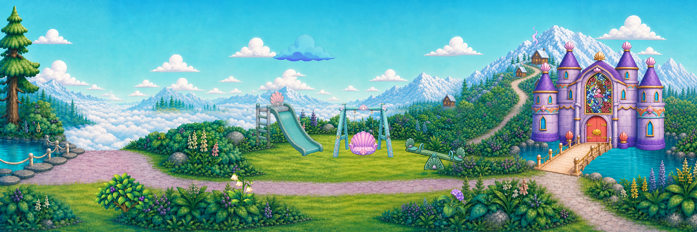

# Sky Lagoon reviewed animation reference — v3

Owner-directed audit/correction iteration of the ten moderate samples and Sky Lagoon composition. `AGENT_REVIEWED_REFERENCE_CANDIDATE`; owner, runtime, device and child acceptance remain open.

Open the local PNG gallery at http://127.0.0.1:8191/. Durable exchange record: the GitHub packet and exact anonymous byte-verification receipt.

The approved 6144×2048 panorama and shared castle/bridge anchor are preserved. The editable scene remains 1920×640, 48 frames / 12 fps / four seconds. It is an environment reference composite, not a game screenshot or accepted cinematic.

[Play the scene](scene/sky_lagoon_sample.mp4) · [Layered scene in Aseprite](scene/sky_lagoon_sample.aseprite) · [Audit and iteration log](REVIEW.json) · [Machine evidence](MACHINE_VERIFICATION.json)

| Sample | Distinct states | Editable master | Native review board |
|---|---:|---|---|
| Fir branch sway | 6 × 512×512 | [01_fir.aseprite](objects/01_fir/01_fir.aseprite) | [All states](objects/01_fir/spritesheet.png) |
| Huckleberry leaf flutter | 6 × 512×512 | [02_huckleberry.aseprite](objects/02_huckleberry/02_huckleberry.aseprite) | [All states](objects/02_huckleberry/spritesheet.png) |
| Hydrangea stem sway | 6 × 512×512 | [03_hydrangea.aseprite](objects/03_hydrangea/03_hydrangea.aseprite) | [All states](objects/03_hydrangea/spritesheet.png) |
| Bellflower nod | 6 × 512×512 | [04_bellflower.aseprite](objects/04_bellflower/04_bellflower.aseprite) | [All states](objects/04_bellflower/spritesheet.png) |
| Cloud billow | 6 × 512×512 | [05_cloud.aseprite](objects/05_cloud/05_cloud.aseprite) | [All states](objects/05_cloud/spritesheet.png) |
| Smoke curl | 6 × 512×512 | [06_smoke.aseprite](objects/06_smoke/06_smoke.aseprite) | [All states](objects/06_smoke/spritesheet.png) |
| Swing fore-and-aft | 12 × 512×512 | [07_swing.aseprite](objects/07_swing/07_swing.aseprite) | [All states](objects/07_swing/spritesheet.png) |
| Seesaw rock | 6 × 512×512 | [08_seesaw.aseprite](objects/08_seesaw/08_seesaw.aseprite) | [All states](objects/08_seesaw/spritesheet.png) |
| Castle gate open | 6 × 512×512 | [09_gate.aseprite](objects/09_gate/09_gate.aseprite) | [All states](objects/09_gate/spritesheet.png) |
| Stained glass shimmer | 12 × 512×512 | [10_glass.aseprite](objects/10_glass/10_glass.aseprite) | [All states](objects/10_glass/spritesheet.png) |

Twelve fresh swing-seat drawings keep seven shell panels, four front scrolls, one front shell/pearl and two attached gold eyelets. Its fixed approved frame is reused; foreground ropes meet each freshly drawn seat. Six fresh huckleberry drawings keep exactly two three-berry clusters; a small Aseprite mask locks the berries/junctions while new leaf silhouettes flutter. Other usable v2 keys are reused. The ten masters contain 72 distinct raster states.

The second correction pass fixes lower ropes hidden by the seat layer. Independent phases and slower garden/seesaw/cloud loops keep the environment quiet. Contact shadows ground the playground. The smoke emitter is moved to a visible cabin roof. The standalone fir remains excluded from the scene to preserve the mountain path.

All isolation, pixel cleanup, source registration, berry-junction correction, rope painting and composition use Aseprite Lua. Python only reads/analyzes image pixels. Built-in ImageGen supplied three new native sheets; no local 3060 Ti video generation or human hand drawing is claimed. The [exact prompts](PROMPT_SET.json), native sheets and prior version are retained.

Open each `.aseprite` at 100% or integer zoom for further pixel editing. The gate master contains opening pose keys; its explicit return/hold timeline is in `SAMPLES.json`. The layered scene is the complete four-second playback master.

Rebuild: `python -s -B production/refine.py`. Recheck without pixel changes: `python -s -B production/verify_v3.py`. Packet metadata: `python -s -B production/package_v3.py --hash-only`. Workstation tools: Aseprite 1.3.18.4, Python 3.13 with Pillow/NumPy/SciPy, FFmpeg 8.1.2. Paths are explicit near script tops.

The retained rejection under `review/rejected_behind_ropes/` is a deterministic reproduction of the first v3 layering defect from the same native drawings, not a claimed preserved original export. Previous v2 originals are immutable history and remain on the same branch.

Current file/scene review finds the named corrections suitable for the motion-reference purpose. Leaf/blossom micro-detail still has AI variation; the six-key flora is deliberately stepped. This is not a claim of final smooth runtime animation. Final runtime art needs selection, actual Mobile captures, gameplay contact/lifecycle evidence, device/child review and owner acceptance. No master finding is closed.

`ARCHIVE_COMPLETE` requires exact remote bytes. `GENERATION_READY` remains false (no video shot card). `DELIVERY_ACCEPTED` remains false (sprite references are not full-frame cinematic delivery).
