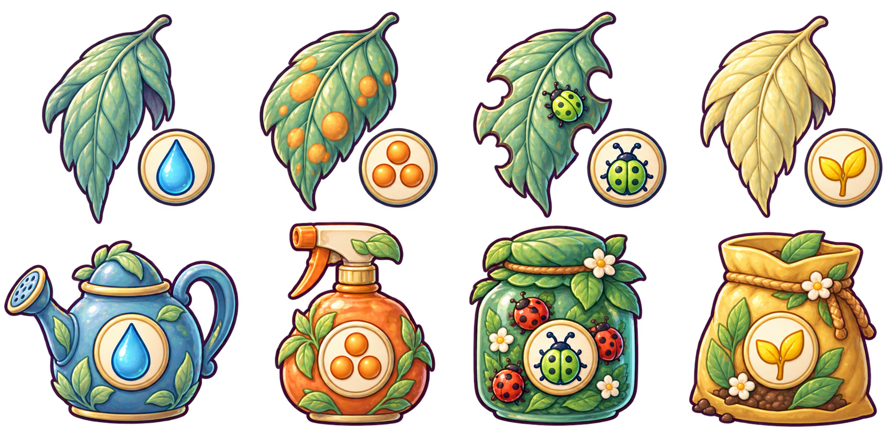

# Roshan's Tree Book — recovered art and revised handoff

**Start with the [revised game brief and role table](../../../design/ARBORIST_TREE_BOOK_HANDOFF_2026-09-29.md).**
Candy Maker is reserved for later, outside the Kitchen. The new loop is tree →
diseased leaf → medicine, with four choices and a left/right split view.

[Manifest](MANIFEST.json) · [recovered originals](RECOVERY_MANIFEST.json) ·
[new prompts and provenance](NEW_ART_PROVENANCE.json) · [interactive layout study](PREVIEW.html).

Download this directory with its relative structure and open PREVIEW.html locally
to try the review study. GitHub displays source HTML rather than running it.
The layout study is not integrated gameplay. Browser visual review was blocked
by the local-file policy in the authoring session; interaction-model checks are separate.

## New review art

The initial patient_pair.png is historical rejected spacing evidence, not
selected art. Native generation files and prompts are preserved in provenance.
Selected PNGs remain review candidates; runtime-size derivatives and import
verification are not claimed.

## Recovery and remaining gaps

63 files were recovered byte-for-byte from the old Arborist worktree: 54 PNGs,
six provenance/review files, and three preparation/audit scripts. The old
gameplay was not ported. No source worktree files were changed.

The current source table distinguishes existing pictures from missing book
animation, local medicine-use animation, additional patient cases, species
leaf references, and native-resolution scene backgrounds. Historical claims in
recovered REVIEW files do not grant current acceptance.

Repository: Ebonyks/mermaid-roshan-reef, public recipient access.
Branch: codex/arborist-art-recovery-20260929.
Publication and byte-verification receipt are linked from the final handoff.

