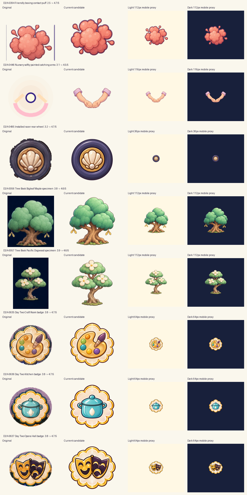

# Day Two replacement artwork — first approval batch

Status: **seven source candidates await review; nursery v4 remains style rejected**. The owner finds it improved but still too lifelike. Historical scores and all image bytes are preserved; no source or motion candidate has owner approval.

[Illustrated before/after review](index.html) · [Exact manifest and prompts](MANIFEST.json) · [Public GitHub verification receipt](REMOTE_VERIFICATION.json)

## Result and scoring

Historical Codex source opinions for the eight preserved candidates are **4.5–4.7/5**. Owner feedback supersedes the nursery v4 opinion for current style acceptance: **D2A-0446 needs simpler illustrated forms and remains an update priority**. Its4.5 score is retained as history, not a current style pass. Twelve imagegen calls and all rejected attempts remain preserved. The other seven source candidates are unchanged and await owner review.

The five criteria are identity/visual role, contour/isolation, palette/value, painted material finish and small-scale readability. Their recorded values describe the earlier Codex draft review; nursery owner feedback overrides style acceptance. These are authored visual opinions bound to exact selected hashes; this tool checks the binding and never grades a new image. No 5/5 or owner/runtime acceptance is claimed under DL-VIS-07 and DL-VIS-08.

## Local motion queue

The owner requests studies through the developed local ComfyUI workflow. [Five individual briefs and source plates](../../local_motion/day2_batch1_20260930/index.html) cover boxing puff, nursery gesture, mounted wheel, maple and dogwood. [Timestamped queue snapshot](../../local_motion/day2_batch1_20260930/QUEUE_SNAPSHOT.json) distinguishes local FIFO entries from native prompt submission. All outputs are LOCAL_MOTION_REFERENCE_ONLY. Nursery uses the rejected v4 still only to study a gentle catching gesture; motion cannot repair or approve its appearance. Navigation badges stay static.

## Individual results

| Item | Original score | Selected score | Attempts |
|---|---:|---:|---:|
| D2A-0394 — Friendly boxing contact puff | 2.5/5 | 4.7/5 | 1 |
| D2A-0446 — Nursery softly painted catching arms | 3.1/5 | 4.5/5 | 4 |
| D2A-0495 — Installed racer rear wheel | 3.2/5 | 4.7/5 | 1 |
| D2A-0056 — Tree Book Bigleaf Maple specimen | 3.8/5 | 4.6/5 | 1 |
| D2A-0057 — Tree Book Pacific Dogwood specimen | 3.9/5 | 4.6/5 | 1 |
| D2A-0635 — Day Two Craft Room badge | 3.8/5 | 4.7/5 | 1 |
| D2A-0636 — Day Two Kitchen badge | 3.8/5 | 4.7/5 | 2 |
| D2A-0637 — Day Two Opera Hall badge | 3.8/5 | 4.7/5 | 1 |

The board and HTML show inspection-only composites on neutral cream/navy mats. These are source readability proxies, not current runtime screenshots or generation inputs. Wheel previews use the actual36px draw size, nursery arms use116px, badges use64px and other proxies use112px. Comparison-board pixels never become replacement art.

## D2A-0394 — Friendly boxing contact puff

**Before 2.5/5 → candidate 4.7/5.** The unrelated vertical bars are gone. The same overlapping coral lobes and four detached droplets retain the friendly contact-effect silhouette. Plum contour and broad peach highlights stay readable on both cream and navy mats.

**Interaction/integration review:** Boxer loads PUFF_PATH and draws it in _draw_bop_fx; preserve its effect timing and contact position. This source repair does not verify live glove/mitt contact or acting.

[Original comparison reference](references/D2A-0394.png) · [Selected 1024px RGBA candidate](selected/D2A-0394.png)

Criterion scores: identity and visual role 4.8/5; contour and isolation 4.7/5; palette and value 4.6/5; painted material finish 4.6/5; small scale source readability 4.6/5.

Source: assets/opera/worlds/props/fx_bop_puff.png. Source SHA-256: 4e64dfa88aa9a6105a61cdac0f978d207eb581b822ce854ac806a88e2a1c4e5c. Selected SHA-256: eefeae63d15b20e64e63fc589d39b931f9e7960e0077bb933fed56173f4b4cb5.

## D2A-0446 — Nursery softly painted catching arms

**Before 3.1/5 → candidate 4.5/5.** Owner feedback on this exact v4 candidate: improved overall, but still too lifelike for the game. The earlier Codex4.5/5 source opinion is retained as history and does not establish current style acceptance. The palm modeling, finger articulation and soft skin shading need flatter rounded toy forms, broad painted bands and clearer navy/purple contour grouping. Attempts2/3 remain rejected for edge artifacts; v4 remains preserved as a style-rejected motion-study input. A ComfyUI gesture test cannot repair or approve its appearance.

**Interaction/integration review:** The controller draws a square up to116px wide around catch_point and draws babies separately. Check actual baby overlap, the implied connection to Roshan, palms beneath a falling baby and the separate settled-baby row before integration. The preview proves source readability only.

[Original comparison reference](references/D2A-0446.png) · [Selected 1024px RGBA candidate](selected/D2A-0446-v4.png)

Criterion scores: identity and visual role 4.7/5; contour and isolation 4.5/5; palette and value 4.7/5; painted material finish 4.5/5; small scale source readability 4.5/5.

Source: assets/opera/worlds/widgets/widget_catch_nursery_cradle.png. Source SHA-256: 9cacbc76cb577051150379a369add2576f5dc50b617d601f5b83bbe4ac0f068e. Selected SHA-256: 4a667658d53ed093e384789a62cad2f5248012cb8d8871f6bd7e8b346f3e4191.

## D2A-0495 — Installed racer rear wheel

**Before 3.2/5 → candidate 4.7/5.** The circular indigo tire and warm gold scallop hub are much clearer than the soft jagged source. The same front-facing wheel, cream shell and pearl fastener remain recognizable at 36px. Broad bands improve material reading without tread noise.

**Interaction/integration review:** RacerSurface draws this as the existing rear wheel at Rect2(19.2,-36.25,36,36). Recheck hub seating, cockpit layering and optical diameter in a real race; do not add a second painted front wheel.

[Original comparison reference](references/D2A-0495.png) · [Selected 1024px RGBA candidate](selected/D2A-0495.png)

Criterion scores: identity and visual role 4.8/5; contour and isolation 4.8/5; palette and value 4.6/5; painted material finish 4.6/5; small scale source readability 4.5/5.

Source: assets/opera/worlds/widgets/widget_crank_racer_wheel.png. Source SHA-256: 3203d9bc5297fccfb3ee86fddab6c3a217de577943a063ef37404e5276c7e003. Selected SHA-256: 694a1147d970e4fa9b78ac30ab69751dac32e9913c4eb34058d987510aa07702.

## D2A-0056 — Tree Book Bigleaf Maple specimen

**Before 3.8/5 → candidate 4.6/5.** The opaque navy plate is gone. The broad canopy, stout twisting trunk, full roots and two hanging paired winged seeds retain the specimen identity. Rounded painted values integrate better on the book paper and remain distinguishable at 112px. Canopy detail is still the busiest part of this batch.

**Interaction/integration review:** This is one distractor picture used in Tree Book page zero. It is not a new patient or authored scene. Check four-choice contrast, the quiet book page and consistent patient/specimen vocabulary in the actual split-screen layout.

[Original comparison reference](references/D2A-0056.png) · [Selected 1024px RGBA candidate](selected/D2A-0056.png)

Criterion scores: identity and visual role 4.7/5; contour and isolation 4.5/5; palette and value 4.6/5; painted material finish 4.6/5; small scale source readability 4.5/5.

Source: assets/opera/tree_book_test/lagoon_tree_bigleaf_maple.png. Source SHA-256: 6d1be41b48707e686140b30f610ed5a9f18e22be435f832a01199370a1ddacc9. Selected SHA-256: 96e59fc832cb28946b1c773ede41dd9f11c4e604ab2639f737018c0906a54e85.

## D2A-0057 — Tree Book Pacific Dogwood specimen

**Before 3.9/5 → candidate 4.6/5.** The opaque navy plate is gone. Three separate leafy canopy groups, exactly three cream blossoms, slender twisting trunk and full root base remain specific and readable. The flower count and branch silhouette distinguish this from the maple without text.

**Interaction/integration review:** This is another page-zero Tree Book distractor. Recheck equal choice-cell framing against the patient and tall-tree pictures. No species-specific patient or new story moment is created.

[Original comparison reference](references/D2A-0057.png) · [Selected 1024px RGBA candidate](selected/D2A-0057.png)

Criterion scores: identity and visual role 4.7/5; contour and isolation 4.6/5; palette and value 4.6/5; painted material finish 4.6/5; small scale source readability 4.6/5.

Source: assets/opera/tree_book_test/lagoon_tree_pacific_dogwood.png. Source SHA-256: e92e41cf81ccfdc251960a7c5599d6984b82ebb1cfc89f3f7cf0704b5dd565eb. Selected SHA-256: 02968ece09cf3cc0e16e949c4798b58b2b02c5632582c4aec73d7145432bb377.

## D2A-0635 — Day Two Craft Room badge

**Before 3.8/5 → candidate 4.7/5.** The purple-grey backing halo is removed, with a clean complete pearl/gold scalloped frame. The diagonal purple brush and five existing paint dots keep the same room meaning. The native reference has five dots although the initial prompt mistakenly listed four; source identity was retained in the result.

**Interaction/integration review:** DayTwoTransition2D uses the current room_craft_room icon. Recheck 64px and actual transition size alongside all other shared door/elevator crests; brighter edges must not compete with Roshan or duplicate a touch target.

[Original comparison reference](references/D2A-0635.png) · [Selected 1024px RGBA candidate](selected/D2A-0635.png)

Criterion scores: identity and visual role 4.8/5; contour and isolation 4.7/5; palette and value 4.6/5; painted material finish 4.7/5; small scale source readability 4.6/5.

Source: assets/ui/castle_room_buttons_v2/room_craft_room.png. Source SHA-256: eb21d47e9b3e3f1566df23a854102d0e86665aae5ec9d88a4d7275cb33ac5a24. Selected SHA-256: 04929f2cca376213f7f89e0b84212096ad83ad5dc6bed77f780adfb46a36bd74.

## D2A-0636 — Day Two Kitchen badge

**Before 3.8/5 → candidate 4.7/5.** The second candidate removes the first attempt's extra white side petals. A single pearl drop, teal pot, two handles and lid now preserve the original Kitchen meaning. Clean frame alpha and a sharp dark contour read well at 64px.

**Interaction/integration review:** DayTwoTransition2D uses the current room_kitchen icon. Recheck the shared crest family, optical size and child-safe target geometry in the actual transition; no new icon mechanism or room assignment is introduced.

[Original comparison reference](references/D2A-0636.png) · [Selected 1024px RGBA candidate](selected/D2A-0636.png)

Criterion scores: identity and visual role 4.8/5; contour and isolation 4.7/5; palette and value 4.6/5; painted material finish 4.7/5; small scale source readability 4.7/5.

Source: assets/ui/castle_room_buttons_v2/room_kitchen.png. Source SHA-256: b21287d6b927dcd425aeec590d58be441985d8bd7080cd83c1021d777c81dfe8. Selected SHA-256: 2fafa9bbbad03aed4bd71eb28fde78cf8a9fd1669783e31be0e5f5a01621dd93.

## D2A-0637 — Day Two Opera Hall badge

**Before 3.8/5 → candidate 4.7/5.** The gold smiling and purple frowning masks retain their overlap and expressive faces. The soft backing halo is removed and the complete frame reads cleanly at 64px. Its visible frame occupies slightly more canvas width than the other two new badges, so the real shared-slot optical fit still needs review.

**Interaction/integration review:** DayTwoTransition2D uses the current room_opera_hall icon. Preserve the Opera venue meaning; these decorative masks are not new acting characters. Check it with the full crest set at actual UI scale before wiring in.

[Original comparison reference](references/D2A-0637.png) · [Selected 1024px RGBA candidate](selected/D2A-0637.png)

Criterion scores: identity and visual role 4.8/5; contour and isolation 4.7/5; palette and value 4.6/5; painted material finish 4.6/5; small scale source readability 4.6/5.

Source: assets/ui/castle_room_buttons_v2/room_opera_hall.png. Source SHA-256: b7c29e845656333d53ed342445410948a055ebf4ccd6fd1553dffe0839adfb66. Selected SHA-256: 87f551f5d37fb25e5f0f89b407887d081392732e867145a4a328a9b35f5491bb.

## Reuse, provenance and technical handling

Task baseline: exact integration 29bbd80aeb539b45b1f34bb93324883addf8b0c8. Existing sources, physical-door/elevator manifest, source masters, Tree Book and specialist draw routes were inventoried. Nine earlier edits bind existing artwork; the three fresh nursery trials use only written briefs and zero bound images, as explicitly commissioned by the owner. No new baby, face, torso, unrelated scene or full actor redesign is commissioned.

- **Puff:** Existing exact source reused as edit input; unwanted bars contaminate its isolated effect. No other puff redesign commissioned.
- **Nursery:** Owner explicitly rejected the first reference-fitted sling/cuff candidate for style mismatch and commissioned fresh generation. Existing crib/bed props do not provide cupped catching arms. Fresh attempts2-4 use the written design language and no image inputs; existing baby/Roshan images were read-only context, never generation references.
- **Wheel:** Existing mounted-wheel source reused as identity input. Its 256px extracted wheel is softer/jaggier than adjacent kart art; no different steering-wheel asset can substitute its mounted role.
- **Trees:** Existing low-resolution species drawings retained as identity inputs. Opaque navy plates visibly conflict with book choice paper; ordinary copies retain that problem. New patient/story art is outside scope.
- **Badges:** The v2 icons share exact physical-door signs in elevator_picture_icon_manifest.json. Those small source crests retain the same edge/backing weakness. The older 2026-08-01 files named button masters were inspected and are complete room-scene cards (1692x929,1691x930,1619x971), not sharper copies of these isolated motifs. Reusing them as buttons would change the established pictorial navigation family. New derivatives preserve the actual palette, pot, masks and scalloped frame.

Every native 1254×1254 generated PNG is preserved byte-for-byte. Selected textures are whole-canvas aspect-preserving reductions to 1024×1024. No subject is cropped, shifted, warped, keyed, composited or locally repaired in post-processing. Native/selected hashes, complete prompts, bound reference roles/hashes and attempt decisions are in MANIFEST.json. The .gdignore keeps native, rejected and review art outside runtime import.

Selected files have true RGBA, transparent corners and a complete visible alpha>=8 footprint inside the canvas. Very faint alpha 1–7 residue can extend outside that footprint; it is recorded rather than silently deleted. The reviewed light/dark proxies show no visible plates, bars or solid edge clipping. Actual game sampling and device presentation still need review.

## Mobile replacement files

The mobile copies were separately inspected on light/dark mats at 36px (wheel), 116px (nursery arms), 64px (badges) and112px (other cues). Historical4.5–4.7/5 source opinions remain recorded after reduction; nursery is currently style rejected. Their exact reviewed hashes are recorded separately. The originals, 1254px native generations and 1024px review masters remain intact.

| Mobile file | Size | Draft source score |
|---|---:|---:|
| [D2A-0394](mobile/D2A-0394.png) | 512×512 | 4.7/5 |
| [D2A-0446](mobile/D2A-0446-v4.png) | 256×256 | 4.5/5 |
| [D2A-0495](mobile/D2A-0495.png) | 256×256 | 4.7/5 |
| [D2A-0056](mobile/D2A-0056.png) | 512×512 | 4.6/5 |
| [D2A-0057](mobile/D2A-0057.png) | 512×512 | 4.6/5 |
| [D2A-0635](mobile/D2A-0635.png) | 256×256 | 4.7/5 |
| [D2A-0636](mobile/D2A-0636.png) | 256×256 | 4.7/5 |
| [D2A-0637](mobile/D2A-0637.png) | 256×256 | 4.7/5 |

One whole-canvas Lanczos reduction directly from each selected native generation makes these copies. The eight mobile textures total **4.25 MiB of decoded RGBA**, compared with **32 MiB** for eight 1024px textures. This is a dimension-based estimate, not measured APK/VRAM savings or a device frame-rate result. Live game sampling, overlap and target-device performance remain to be tested when integration is commissioned.

## Remaining queue and next decisions

This is the initial eight-item set, not a claim that all 432 priorities are repaired. The remaining **424** original queue entries include **149 inactive, retired or reference alternatives**, plus actor atlases, background families, vector/procedural graphics and context-dependent items. Each needs its own usage/reuse decision.

The faceted racer portrait D2A-0054 should first be compared with the existing painted racer-imp family and real draw route. The ballet flower disc, Detective spotlight, opaque Painter brush and Candy cart remain route-dependent candidates. Old tail-cropped Roshan cards should give way to existing full-tail atlases where applicable. Protected doll originals remain intact; later isolation needs separate attributed derivatives. Background families require native-coverage, composition and seam review and cannot be regenerated tile by tile. None is silently marked repaired by this batch.

## Verification and user approval

Machine evidence is in [VERIFICATION.json](VERIFICATION.json): exact source/reference/prompt/output hashes, 1024 and256/512 RGBA/margins, original preservation, browser/image decoding, document authority, change coverage and the shrinking 2D gate. Full CI results are linked when available. Checks never supply visual ratings or user approval.

**Owner review remains open.** Nursery v4 is explicitly rejected for lifelike styling and needs a later simpler still revision. The other seven source candidates and the written report await owner review. All owner_approval fields remain null. Queuing or rendering a reference does not grant visual, contact, device, child, runtime or cinematic delivery acceptance. No finding is closed and no release is authorized.
