# Fashion Designer — illustrated process walkthrough

Source runtime: `6238934447cf28834874396dfbaff65effafda46` (Godot 4.7.2-stable / Mobile). Owner review: 2026-10-07.

[Open the browsable local HTML](index.html) after downloading this folder. This README also renders the complete illustrated walkthrough on GitHub. Click each panel or its **Native full-size source** link to inspect the image. Exact provisional voice files are included.

**Evidence limits:** fresh launch uses real UI input; the ten wardrobe captures are synthetic model/UI-call references. Source-asset illustrations and missing captures are marked in every affected step. No natural wardrobe-to-party/disguise/reload route, fitting/contact or target-device/child/owner acceptance is claimed. The richer design is a proposal only.

[Manifest and SHA-256 inventory](manifest.json) · [Step data](steps.json) · [Natural input observation](native/natural_input_observation.json) · [Original synthetic harness](evidence/original_synthetic_capture.gd)

The child’s current disguise activity is Garden → Garden again → finished Bow look. It has no dress placement, gardening, camouflage, hide-and-seek or pretend-show performance. Persistent clothing is implemented; those proposed play improvements are not.

## Entry and everyday clothes

### 01 · Start a fresh adventure

**NATURAL INPUT • ENTRY ONLY**

[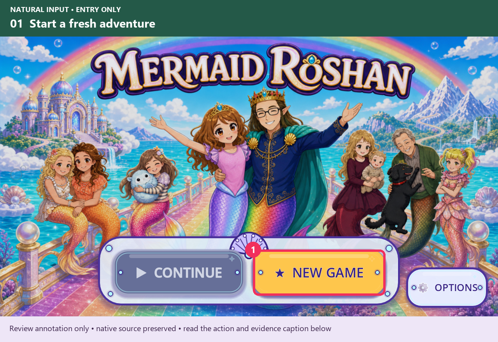](annotations/01.png)

**See:** The launch splash has New Game on the right. Continue is disabled in this isolated fresh profile.

**Input / target:** Tap New Game at (820,607), inside StartMenuNewGameButton. A real mouse press/release entered through the normal UI.

**Roshan / change:** The menu hands off to the existing Day One opening; this is entry evidence, not Fashion progress.

**Next:** Watch the opening, then follow Roshan toward the castle.

[Native full-size source](native/11-fresh-launch.png)

### 02 · The castle introduction

**NATURAL INPUT • ENTRY ONLY**

[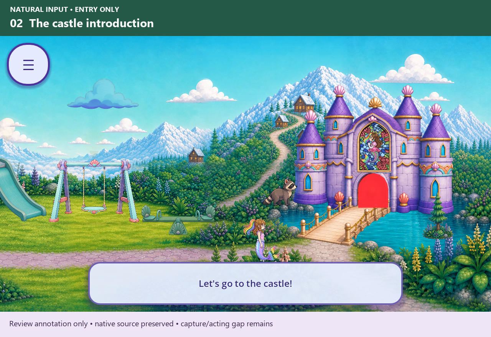](annotations/02.png)

**See:** Roshan is outside the castle. The visible message says “Let’s go to the castle!”

**Input / target:** This panel records the reached state after the opening. No additional action was injected.

**Roshan / change:** New Game → opening → castle arrival was observed. No wardrobe selection or party unlock was created.

**Next:** Play Day One and follow the real castle route. That traversal was not captured in this bounded check.

**Coverage gap:** Natural footage from this arrival through Royal Bedroom wardrobe entry is missing. The short run is not a full-route test.

[Native full-size source](native/13-after-opening.png)

### 03 · Find the shell wardrobe

**ASSET ILLUSTRATION • CAPTURE GAP**

[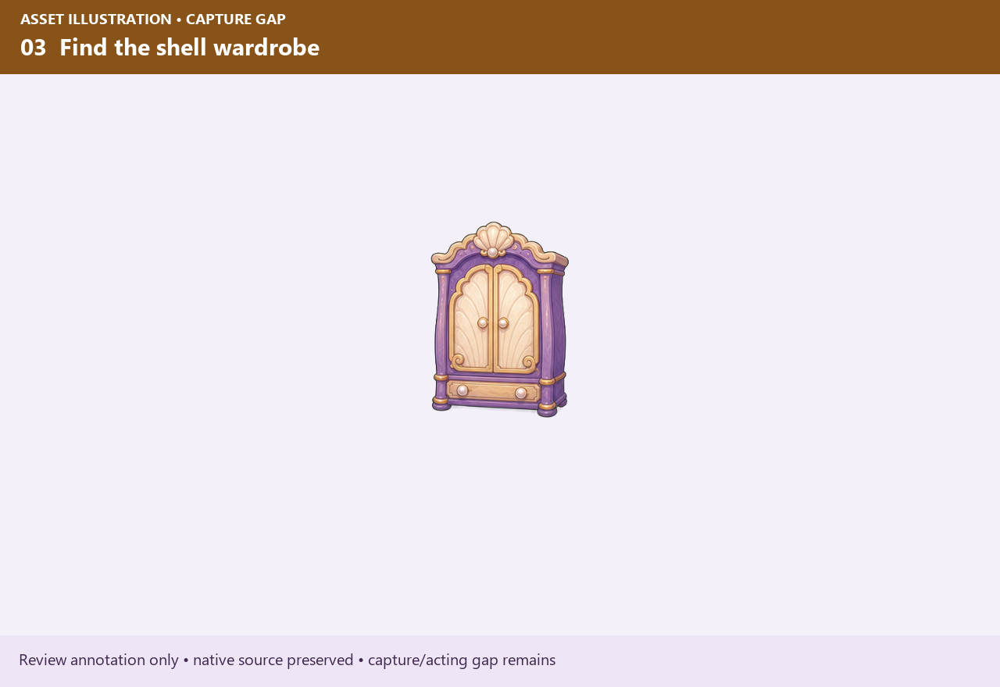](annotations/03.png)

**See:** Source artwork for the shell wardrobe in Royal Bedroom, item ID shell_wardrobe. This is a prop reference, not a room screenshot.

**Input / target:** Tap the actual wardrobe object in Royal Bedroom. Its room-authored target is the prop, not this illustration.

**Roshan / change:** The handler flashes the wardrobe through four short glint states, emits a sparkle burst and opens the old look picker. It does not make Roshan travel to or touch the wardrobe.

**Next:** In the old picker, tap the pictured Clothes button at (1080,548), size 132×132.

**Coverage gap:** Entry, glint midpoint, picker and hand/contact captures are absent. Text cue: “Pretend dress-up time! A crown, a cape, or both!” The exact entry voice/pointer is not bound by this packet.

[Native full-size source](native/asset-wardrobe.png)

### 04 · Choose who to dress

**SYNTHETIC RUNTIME REFERENCE**

[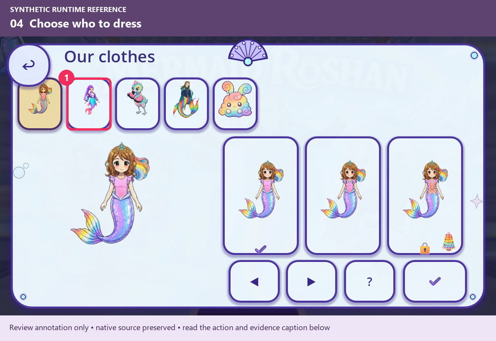](annotations/04.png)

**See:** Five portraits: Roshan, Rumi, Baby Eagle, Daddy and Rainbow Friend. The large left picture previews the chosen person.

**Input / target:** Tap a portrait. Rumi’s target is (171,106), size 116×136. Portraits are the visual choice cue.

**Roshan / change:** The selected portrait turns warm gold; the preview and three clothing cards rebuild for that person. No fitting animation occurs.

**Next:** Choose one of that person’s clothing cards.

**Voice:** “Tap a friend, then tap their clothes!” [Listen](audio/roshan_fashion_choose.ogg) — provisional; human acceptance pending.

[Native full-size source](native/01-wardrobe-1280x720.png)

### 05 · Rumi has her own saved look

**SYNTHETIC RUNTIME REFERENCE**

[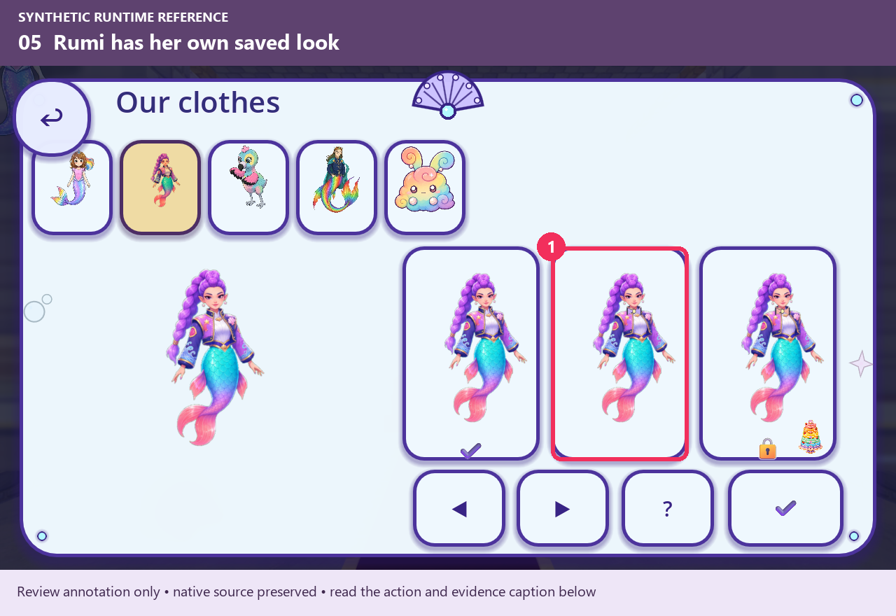](annotations/05.png)

**See:** Rumi replaces Roshan in the preview and clothing cards; the selected Rumi portrait is highlighted.

**Input / target:** Tap an unlocked pictured outfit on the right. Original and Ribbon are always available; Party and Garden depend on earned milestones.

**Roshan / change:** The look replaces Rumi’s texture and saves independently of Roshan’s choice. The existing capture was staged by direct model/UI calls; it does not prove a natural tap.

**Next:** Select another friend or return to Roshan.

**Voice:** “We will keep these clothes on!” [Listen](audio/roshan_fashion_changed.ogg) — provisional; human acceptance pending.

[Native full-size source](native/02-rumi-1280x720.png)

### 06 · Try a ribbon on Roshan

**ASSET ILLUSTRATION • CAPTURE GAP**

[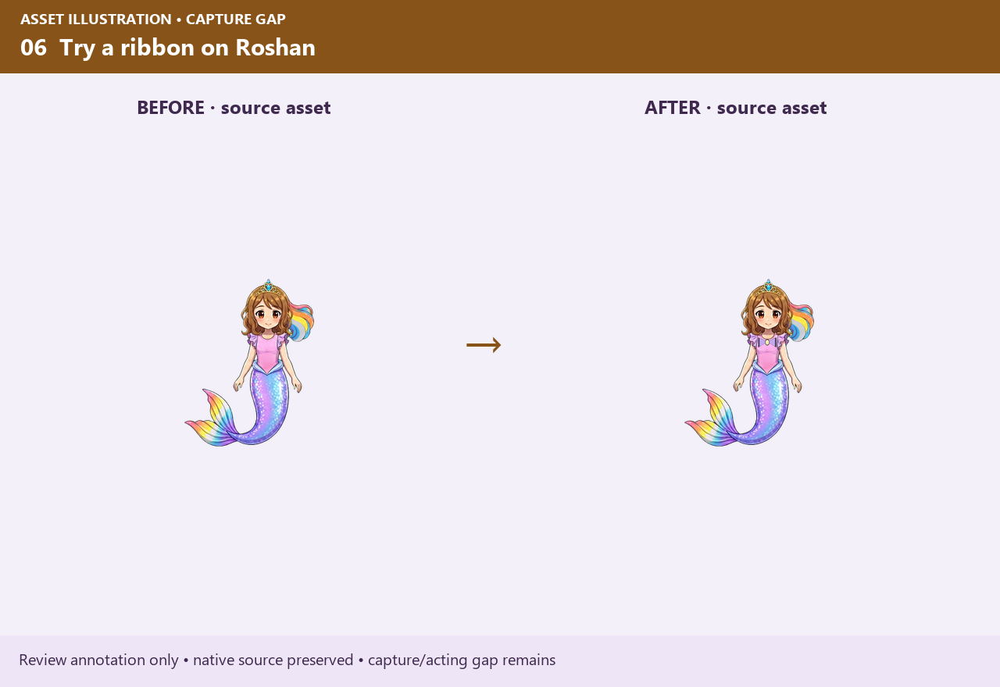](annotations/06.png)

**See:** The existing ribbon derivative is shown alone so its change is inspectable. This is not a captured equip moment.

**Input / target:** In the wardrobe choose Roshan, then the Ribbon card, the middle card on page one.

**Roshan / change:** Original → ribbon detail on existing Roshan. The model equips, saves immediately, refreshes the portrait and emits a bounded sparkle burst. No drag, sewing or physical dressing is implemented.

**Next:** Keep exploring clothes; leaving does not undo the choice.

**Voice:** “We will keep these clothes on!” [Listen](audio/roshan_fashion_changed.ogg) — provisional; human acceptance pending.

**Coverage gap:** Actual before / press / sparkle / after sequence was not captured. This illustration cannot establish the transition.

[Native full-size source](native/asset-ribbon.png)

### 07 · Dress Baby Eagle

**ASSET ILLUSTRATION • CAPTURE GAP**

[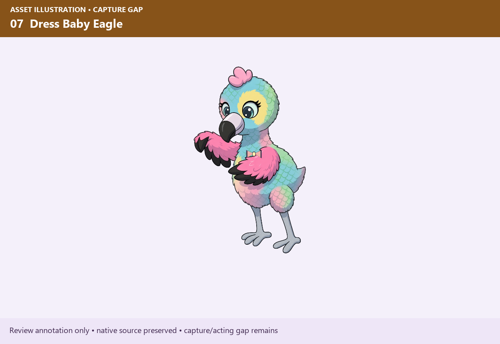](annotations/07.png)

**See:** Existing Baby Eagle Party derivative: accessory changes on the original character.

**Input / target:** Tap the third portrait (297,106), then its unlocked outfit card. The party look shown requires the party milestone.

**Roshan / change:** Baby Eagle’s outfit is saved separately and used by the companion texture lookup. No cape fitting or Eagle reaction is authored.

**Next:** Tap Daddy or Rainbow Friend to dress them.

**Voice:** “Tap a friend, then tap their clothes!” [Listen](audio/roshan_fashion_choose.ogg) — provisional; human acceptance pending.

**Coverage gap:** No native Baby Eagle chooser/equip/world-reload capture is available.

[Native full-size source](native/asset-eagle.png)

### 08 · Dress Daddy

**ASSET ILLUSTRATION • CAPTURE GAP**

[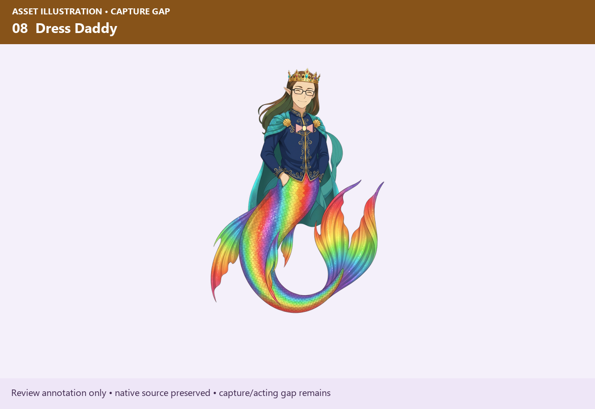](annotations/08.png)

**See:** Existing Daddy Party derivative; this is accessory clothing rather than a new tailored coat.

**Input / target:** Tap the fourth portrait (423,106), then a pictured unlocked outfit.

**Roshan / change:** Daddy’s saved selection updates participating family/world portraits. The illustration proves only the available source pixels.

**Next:** Choose Rainbow Friend or finish.

**Voice:** “Tap a friend, then tap their clothes!” [Listen](audio/roshan_fashion_choose.ogg) — provisional; human acceptance pending.

**Coverage gap:** No native Daddy chooser, family appearance or save-reload capture is available.

[Native full-size source](native/asset-daddy.png)

### 09 · Dress Rainbow Friend

**ASSET ILLUSTRATION • CAPTURE GAP**

[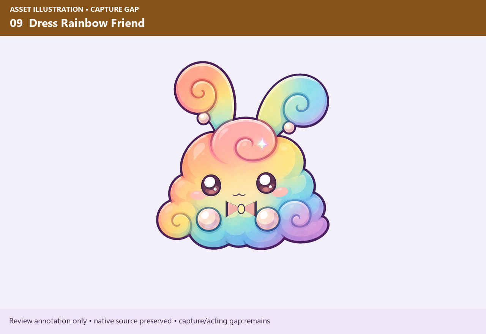](annotations/09.png)

**See:** Existing Rainbow Friend Party derivative, reused without a character redraw.

**Input / target:** Tap the fifth portrait (549,106), then an unlocked clothing card.

**Roshan / change:** The saved selection is independent of the other four people. This is a texture change; there is no wrap fitting animation.

**Next:** Browse the next clothing page or close the wardrobe.

**Voice:** “Tap a friend, then tap their clothes!” [Listen](audio/roshan_fashion_choose.ogg) — provisional; human acceptance pending.

**Coverage gap:** No native Rainbow Friend equip, following or save-reload capture is available.

[Native full-size source](native/asset-rainbow.png)

### 10 · Locked clothes explain where to earn them

**SYNTHETIC RUNTIME REFERENCE**

[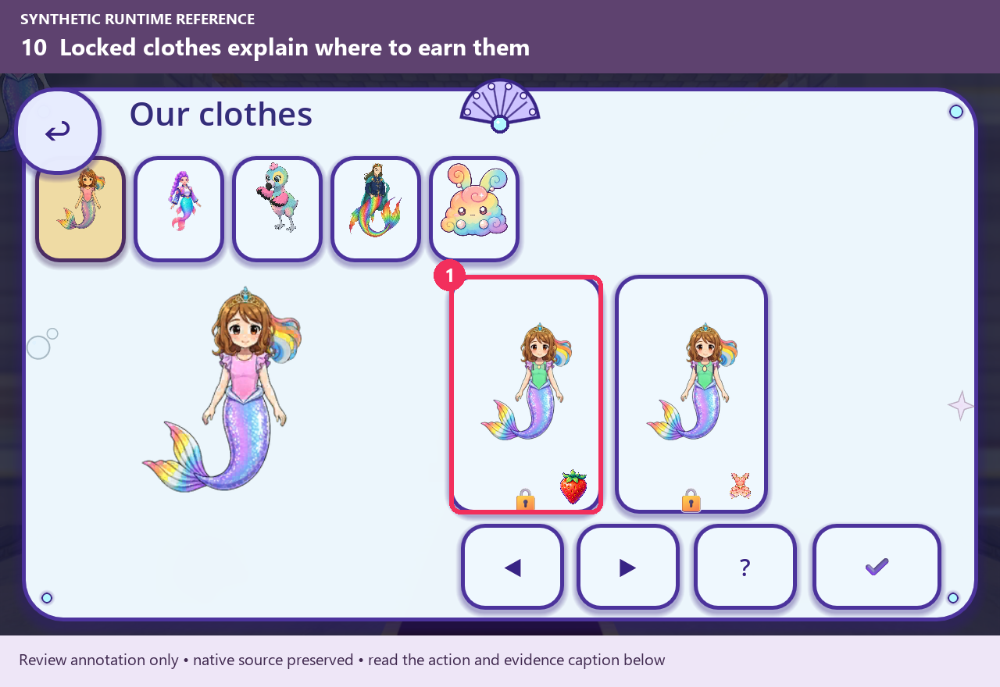](annotations/10.png)

**See:** The next Roshan page shows Garden and Garden Disguise with locks and source pictures. On page one, Party has a cake picture.

**Input / target:** Tap Next at (738,577), size 132×110. Tap a locked card to hear its source cue; it never equips locked clothes.

**Roshan / change:** Party earns the party looks; Farmer strawberries / earned Farmer progress earns Garden. Finishing disguise practice earns the disguise. Unlocking makes a choice available; it does not automatically change anyone’s look.

**Next:** Earn the pictured milestone, then reopen the wardrobe and choose the look.

**Voice:** “Help grow our strawberries to unlock these clothes!” [Listen](audio/roshan_fashion_locked_garden.ogg) — provisional; human acceptance pending.

[Native full-size source](native/03-locked-source-1280x720.png)

### 11 · Leave wearing the selected look

**SYNTHETIC RUNTIME REFERENCE**

[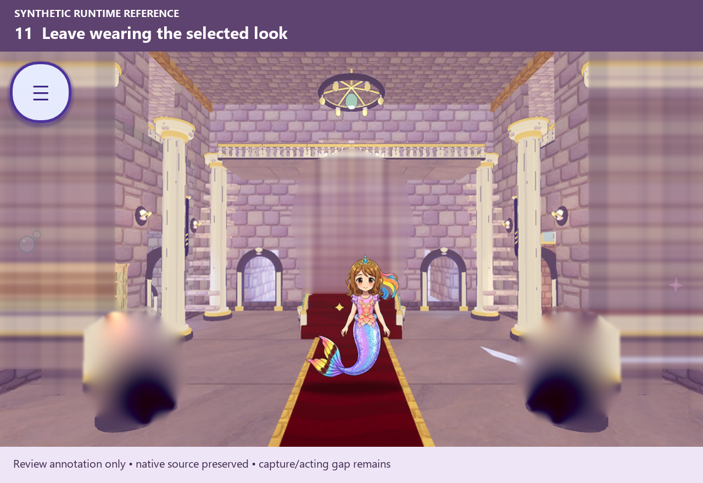](annotations/11.png)

**See:** A diagnostic world capture shows Roshan in the party look in Throne Hall. The older harness used the bedroom alias, which resolved here; this is not a Royal Bedroom capture.

**Input / target:** In the wardrobe tap the bottom-right check at (1040,577), size 165×110, or the top-left Back button.

**Roshan / change:** The overlay closes and the equipped look remains in the world. Roshan’s position in this screenshot was staged, so it proves composition only.

**Next:** Return to normal play. Reopening should display saved choices.

**Coverage gap:** Natural leave, cross-room traversal and close/relaunch captures are missing. Save/re-entry model checks are machine evidence, not visible player-route proof.

[Native full-size source](native/06-dress-in-castle-1280x720.png)

## The pre-party special dress

### 12 · Finish preparations and touch the party table

**ASSET ILLUSTRATION • CAPTURE GAP**

[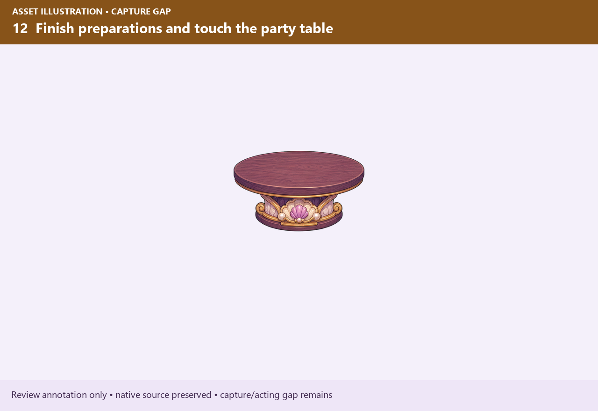](annotations/12.png)

**See:** The existing dining-table source stands for the Main Hall party display. This isolated prop is not the finished in-room party table.

**Input / target:** After all eight preparation careers and the rainbow candle are ready, tap the Main Hall party display/rainbow hotspot. ChapterTwoPartyTableTouch occupies room coordinates (285,352), size 710×238.

**Roshan / change:** The real route asks for Roshan’s dress before first lawn ignition. Room text says “Your friends are waiting outside! Tap the rainbow to visit the party!”

**Next:** The special-dress page opens.

**Coverage gap:** Natural eight-job completion and party-hotspot entry capture are absent. MA-PLAY-005 tracks the existing fresh-play Chapter 2 route problem; this packet does not repair or close it. Room text is source-backed; its exact voice/pointer is not captured.

[Native full-size source](native/asset-table.png)

### 13 · Put on the special dress

**SYNTHETIC RUNTIME REFERENCE**

[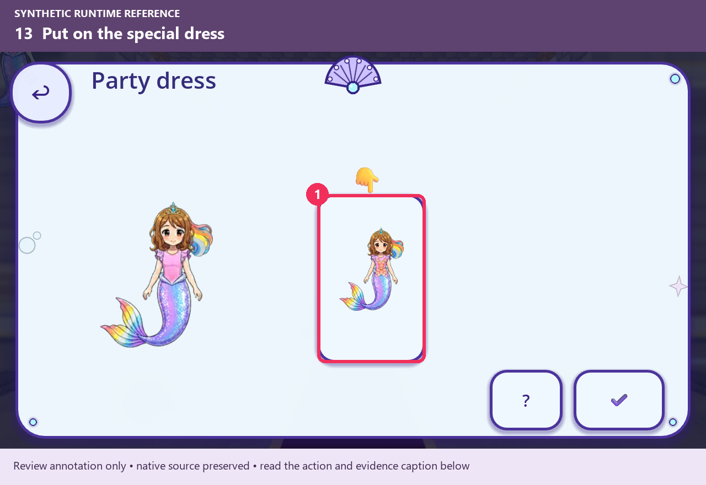](annotations/13.png)

**See:** The Party dress page offers one outfit card and a downward hand pointer above it.

**Input / target:** Tap the dress card at (575,258), size 196×306. Help repeats the same instruction.

**Roshan / change:** The intentional choice equips the party look, writes the outfit and dress milestone, then closes the wardrobe. The child does not drag a garment or personalise its flower/bow in this alpha.

**Next:** The deferred normal route opens the lawn party before Iko Iko / Ember King.

**Voice:** “Let's get dressed for our party! Tap your special dress!” [Listen](audio/roshan_fashion_party_dress.ogg) — provisional; human acceptance pending.

[Native full-size source](native/04-before-party-1280x720.png)

### 14 · Inspect the equipped dress

**SYNTHETIC RUNTIME REFERENCE**

[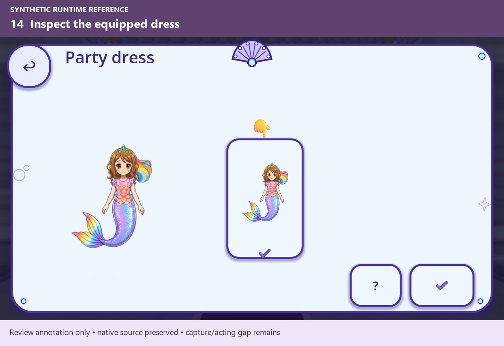](annotations/14.png)

**See:** Roshan’s preview has the floral party clothing; the card carries a check.

**Input / target:** This image was made by direct model equip followed by reopening the dress page. In normal play, selecting the dress closes this page immediately.

**Roshan / change:** Before: original clothing in step 13. After: party clothing shown here. The midpoint, Roshan’s physical dressing and the natural lawn handoff are not recorded.

**Next:** Normal gameplay proceeds onto the lawn. This reopened diagnostic page is not an additional child step.

**Coverage gap:** No actual dress fitting/contact or admiration acting exists. No natural party arrival / Iko Iko / Ember King capture is included.

[Native full-size source](native/05-dress-equipped-1280x720.png)

## Later disguise practice

### 15 · Open the mask button after the story

**SYNTHETIC RUNTIME REFERENCE**

**See:** The wide-screen clothes page includes the mask button at lower left after Chapter 2 story completion. It is not an Opera career card.

**Input / target:** Open clothes, then tap FashionDisguisePlay at design coordinates (55,577), size 180×110. At wide aspects, the stage scales these coordinates.

**Roshan / change:** The wardrobe switches to a pictured three-phase practice. No Fashion Opera star is added and the eight birthday preparation bits are unchanged.

**Next:** Start or resume the first incomplete practice phase.

**Coverage gap:** Practice entry was staged by setting the story-complete flag and calling the UI method. Natural unlock and mask-button press are not captured.

[Native full-size source](native/10-wide-phone-1920x900.png)

### 16 · Phase 1: pick Garden

**SYNTHETIC RUNTIME REFERENCE**

[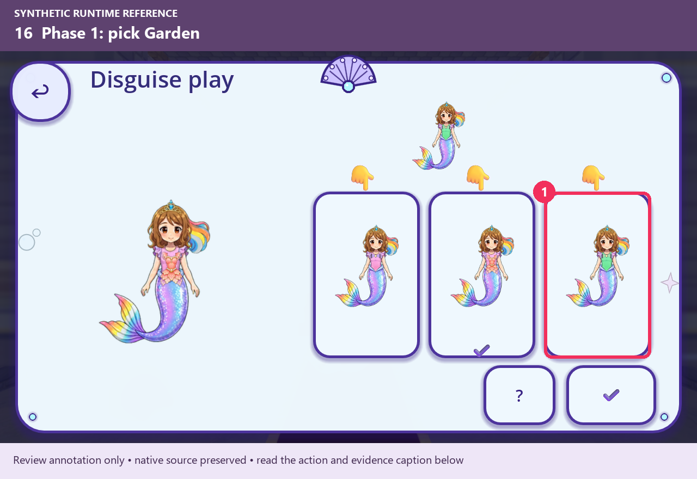](annotations/16.png)

**See:** A small Garden Roshan picture is above three full-character outfit cards: Ribbon, Party and Garden.

**Input / target:** Tap the Garden card on the right at (999,258), size 196×306. Static hand pointers sit above all cards.

**Roshan / change:** Correct pick: equips Garden and saves practice prefix 1; next prompt opens. Roshan’s torso changes to green. There is no garden station, prop selection or gardening act.

**Next:** Phase 2 replaces the goal picture with Garden Rumi.

**Voice:** “Tap the garden outfit in the picture!” [Listen](audio/roshan_fashion_role_pick.ogg) — provisional; human acceptance pending.

[Native full-size source](native/07-disguise-role-1280x720.png)

### 17 · Phase 2: choose Garden again

**SYNTHETIC RUNTIME REFERENCE**

[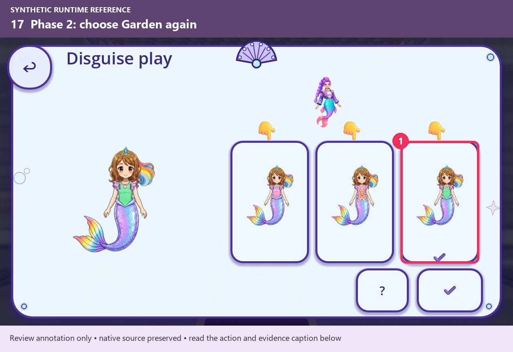](annotations/17.png)

**See:** Garden Rumi is now the goal picture. Roshan is already wearing Garden, which is checked on the right.

**Input / target:** Tap the same Garden card again. A Ribbon or Party choice repeats the gentle help cue without advancing.

**Roshan / change:** Practice prefix becomes 3. Usually no visible clothing change occurs because phase 1 already equipped Garden. No plant camouflage, movement or Rumi hide-and-seek is implemented.

**Next:** Phase 3 offers a single Bow card.

**Voice:** “Let us blend in! Pick clothes like our garden friend!” [Listen](audio/roshan_fashion_blend_pick.ogg) — provisional; human acceptance pending.

[Native full-size source](native/08-disguise-blend-1280x720.png)

### 18 · Phase 3: choose the finished bow look

**SYNTHETIC RUNTIME REFERENCE**

[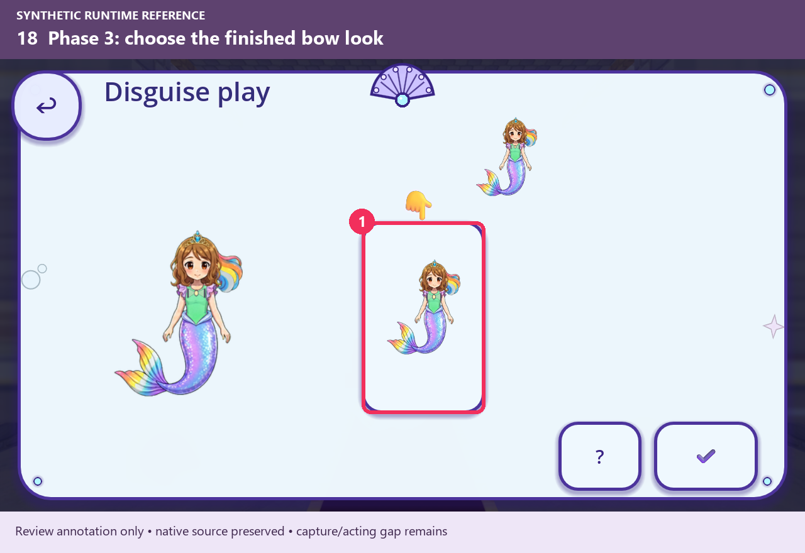](annotations/18.png)

**See:** One card labelled Bow pictures the full finished disguise, not an isolated bow piece or attachment socket.

**Input / target:** Tap that card at (575,258), size 196×306.

**Roshan / change:** The model saves prefix 7, grants the Garden Disguise once, records the reward and equips it. The UI then returns to the normal clothes page and says the done cue.

**Next:** Keep wearing the reward in normal play.

**Voice:** “Tap the bow to finish our disguise!” [Listen](audio/roshan_fashion_finish_piece.ogg) — provisional; human acceptance pending.

**Coverage gap:** The old diagnostic harness stopped before this choice. There is no input midpoint, completed page or reward-transition screenshot.

[Native full-size source](native/09-disguise-bow-1280x720.png)

### 19 · The persistent reward

**ASSET ILLUSTRATION • CAPTURE GAP**

[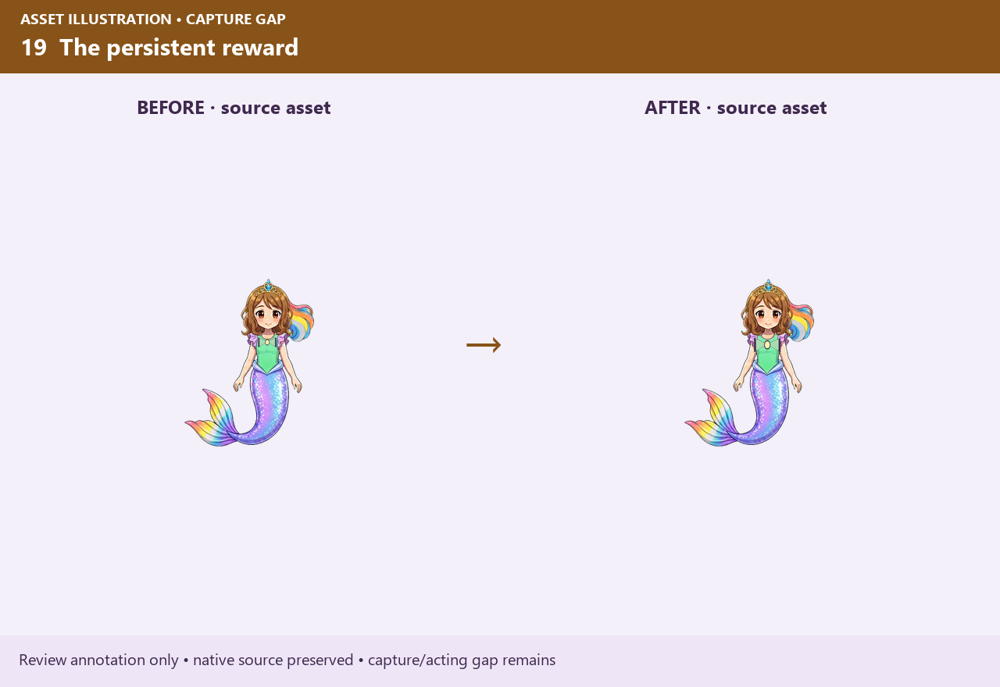](annotations/19.png)

**See:** The existing Garden Disguise derivative illustrates the earned look. It is not a captured completion screen.

**Input / target:** No further confirmation is needed. Leave clothes with Check / Back.

**Roshan / change:** Garden → finished disguise with its accessory. The done cue plays on the ordinary wardrobe. Reward is once-only; no score, loss, timer or party star.

**Next:** Return later with the reward available as an everyday choice.

**Voice:** “Our disguises are ready!” [Listen](audio/roshan_fashion_done.ogg) — provisional; human acceptance pending.

**Coverage gap:** Native before / bow contact / completion / return / reload evidence is missing. The alpha has no authored bow-placement contact or pretend-show finish.

[Native full-size source](native/asset-disguise.png)

## Persistence and variants

### 20 · Return, resume and replay limits

**SYNTHETIC RUNTIME REFERENCE**

[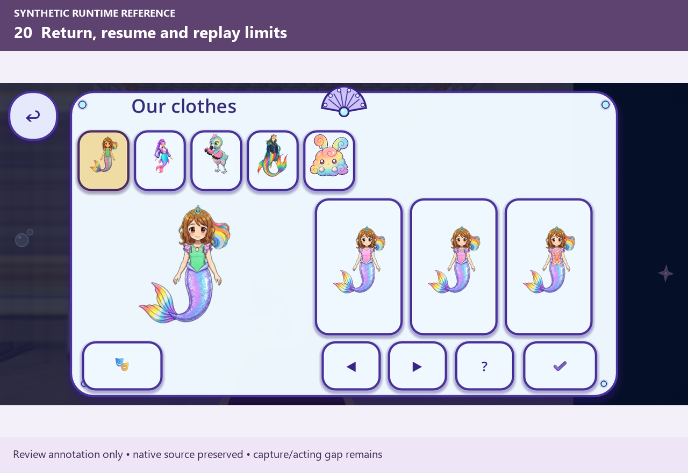](annotations/20.png)

**See:** The ordinary wardrobe remains available in free play and preserves five independent character choices.

**Input / target:** Reopen the wardrobe and choose any owned look. If practice was unfinished, the mask button resumes its first incomplete phase.

**Roshan / change:** Saved prefixes and outfits survive reload in machine probes. Completed practice redirects to normal clothes with the done cue; there is currently no reset button for a fresh round.

**Next:** Use the wardrobe for repeated dressing; completed disguise practice is not a replayable minigame yet.

**Coverage gap:** No natural close/relaunch capture is available. Existing model/UI save probes prove data behavior, not the complete child route.

[Native full-size source](native/10-wide-phone-1920x900.png)

### 21 · World and Opera presentation

**SYNTHETIC RUNTIME REFERENCE**

**See:** The diagnostic Throne Hall capture is one world appearance example. Other participating scenes use the shared texture lookup.

**Input / target:** Continue normal play to see chosen clothes on recurring characters where their shared renderer is used.

**Roshan / change:** Career uniforms retain their activity-specific presentation; fixed owner-selected Day One clips retain their flattened original pixels. There is no separate Fashion Opera career or authored costume reaction here.

**Next:** Review actual wardrobe-to-world, Opera return and family appearances on a device.

**Coverage gap:** Castle companion, Rumi, family/lawn, kart, Galaxy, combat/dungeon, Conservatory and Opera return natural captures are absent. Source integration is not visual acceptance.

[Native full-size source](native/06-dress-in-castle-1280x720.png)

## Proposed redesign — not yet playable

### P1 · Make clothes for a friend

**PROPOSED • NOT YET PLAYABLE**

[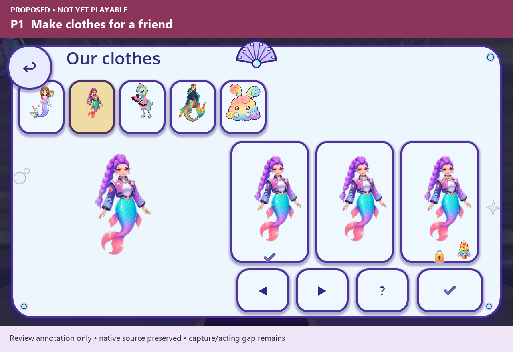](annotations/P1.png)

**See:** Current Rumi chooser is used only as a reference for the proposed dressing doll.

**Input / target:** Proposed: choose a friend, then a distinct garment, pattern and accessory from pictured hangers. Every everyday combination is welcome.

**Roshan / change:** Proposed: garments fit visibly onto the friend; use a dress for Rumi, coat for Daddy, cape for Baby Eagle and wrap for Rainbow Friend. These tailored garments and contact animations are missing sources, not existing gameplay.

**Next:** Admire the outfit together and save it immediately.

**Coverage gap:** Proposal only. Current alpha uses small outfit variants and card taps. No new garment/acting art was generated for this walkthrough.

[Native full-size source](native/02-rumi-1280x720.png)

### P2 · A birthday dressing ritual

**PROPOSED • NOT YET PLAYABLE**

[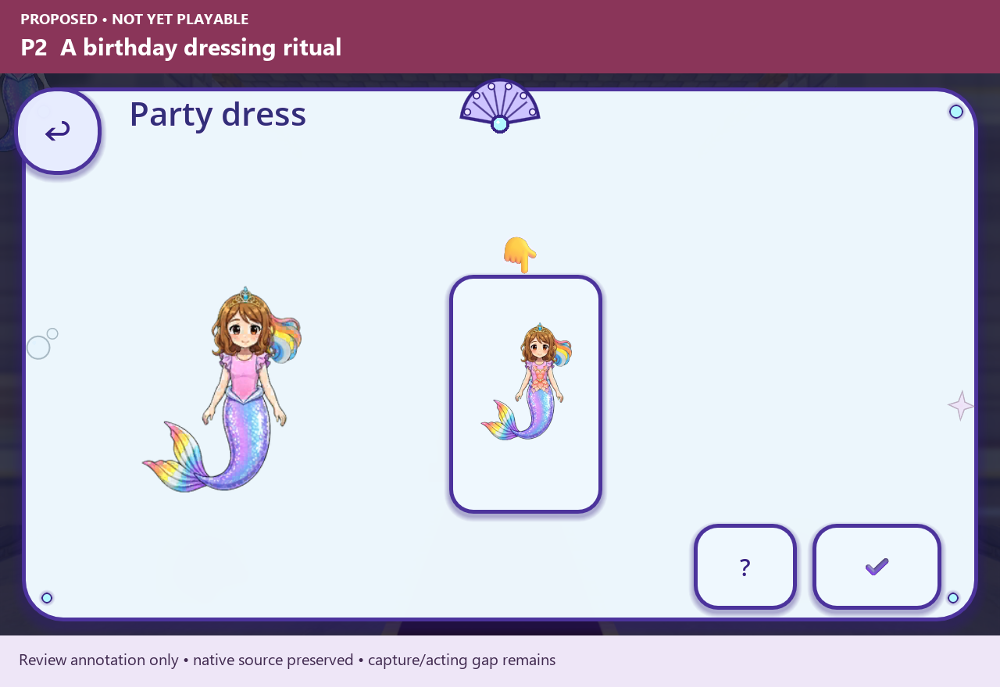](annotations/P2.png)

**See:** The existing special-dress page anchors the owner-required placement before the party / Iko Iko / Ember King.

**Input / target:** Proposed: open the special dress, choose a flower or bow, and place it on Roshan with one generous gesture.

**Roshan / change:** Proposed: Roshan looks down at the fitted dress, admires it and enters the party in her personalised look. Keep save immediate and Back safe.

**Next:** The birthday begins after the dressing beat.

**Coverage gap:** Personalisation, placement contact and admiration are not implemented. This screenshot is a reference, not a new storyboard scene.

[Native full-size source](native/04-before-party-1280x720.png)

### P3 · Dress for a role, then act it

**PROPOSED • NOT YET PLAYABLE**

[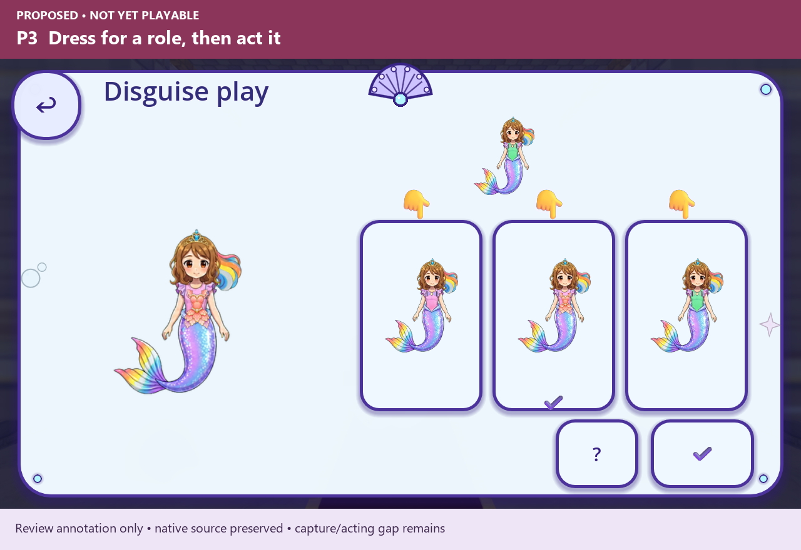](annotations/P3.png)

**See:** The existing Garden choice is a limited costume reference for a later pretend-play rehearsal.

**Input / target:** Proposed: pick role clothes and a pictured prop, then help the friend act that role through one simple touch activity.

**Roshan / change:** Proposed: Roshan travels to the station, visibly uses the prop and completes the act before advancing. Role-specific clothes, location, actions and exact voice/pointer need authoring.

**Next:** Try blending into a friendly setting.

**Coverage gap:** Role rehearsal and a specific narrative disguise mission are not playable or bound. Preserve later story placement; do not treat this proposal as canon approval.

[Native full-size source](native/07-disguise-role-1280x720.png)

### P4 · Blend, finish a friend and play together

**PROPOSED • NOT YET PLAYABLE**

[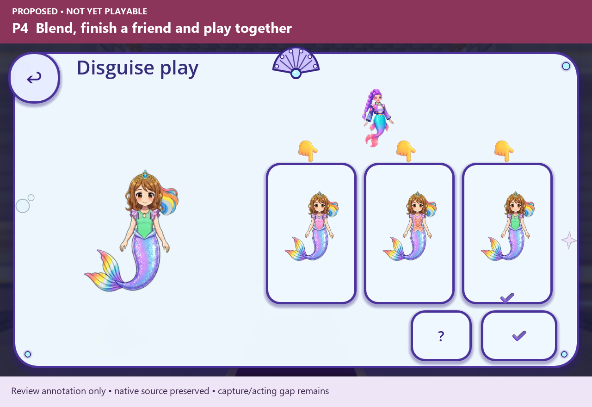](annotations/P4.png)

**See:** The current Garden Rumi picture is a reference for a friend-based disguise activity.

**Input / target:** Proposed: choose a flower or leaf silhouette, swim among plants for gentle hide-and-seek, then fit a missing piece onto a friend.

**Roshan / change:** Proposed: placement has generous contact, the friend reacts, and both join a pretend show. Roshan remains recognisable. A mismatch invites another playful try without losing progress.

**Next:** The earned clothes remain wearable across the game and the rehearsal can be replayed.

**Coverage gap:** Camouflage shapes, hiding location, fitting/contact, friend reaction, show and repeat-round flow are missing. No invented gameplay screenshot or new art is supplied.

[Native full-size source](native/08-disguise-blend-1280x720.png)

## Verification and remaining acceptance

The runtime baseline passed the frozen local suite (82 probes; log SHA-256 `8e0650a0d814c88d053cfe3709879f7b9ccfc9b35c8182e4515547922e967826`) and exact-head remote [topic Probe Suite 37603992197](https://github.com/Ebonyks/mermaid-roshan-reef/actions/runs/37603992197) and [PR Probe Suite 37604042115](https://github.com/Ebonyks/mermaid-roshan-reef/actions/runs/37604042115). This packet changes only non-runtime review material and documentation. These machine results do not prove natural-route capture, device, child or owner acceptance.

MA-VIS-006 / MA-PLAY-004 / MA-PLAY-005 remain in their existing lifecycles. No defect is closed. No 4.6/5 quality score is asserted.

Native capture limit: one actual UI target; the opening then reaches the castle introduction. No phase/completion callback or save edit was used. The ten old captures explicitly use synthetic state and direct UI/model calls; the original harness is retained for inspection. The before/after dress comparison includes a reopened diagnostic page, not a natural extra child step.

Packet asset rows in ASSET_LICENSES.md retain their source attribution; copying a provisional asset here does not accept its pixels or voice. The original capture manifest retains its historical baseline; runtime source binding is separately checked at this packet’s source commit.

[Audit impact](../../../design/audit_impacts/fashion-walkthrough-20261007.json) · [Current feature brief](../../../design/FASHION_DESIGNER_ROSHAN_2026-10-06.md) · [Packet check](evidence/verification.json)
