# Magician visual walkthrough — October 7, 2026

Status: **SOURCE_BACKED_REVIEW / NATIVE_CAPTURE_GAPS**. This package illustrates the current owned Magician source; it is not accepted runtime evidence, 4.6/5 clearance or a gameplay change. The development goal remains paused for its pending owner answers.

Browse the self-contained [walkthrough](index.html) locally, or inspect this ordered GitHub version. [Full contact sheet](KEY_SEQUENCE.png) · [step-to-image manifest](WALKTHROUGH_MANIFEST.json) · [source snapshot](SOURCE_SNAPSHOT.json) · [packet hashes](FILES.json).

The normal sequence is three practice activities, then five stage activities. In-world entry uses the Castle Opera Hall. The temporary elevator variant repeats the same engine with no durable rewards; the current eight-career birthday roster excludes Magician.

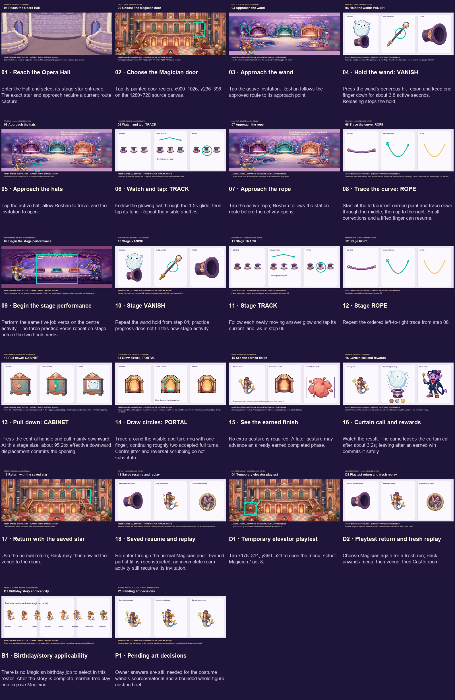

## 01 — Reach the Opera Hall

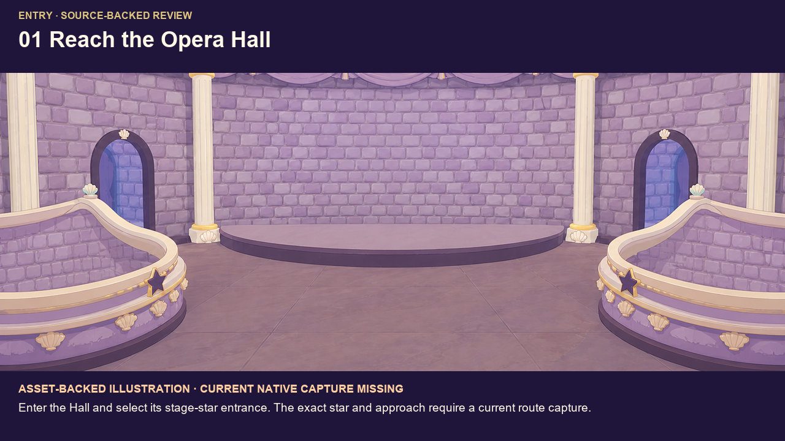

Enter the Hall and select its stage-star entrance. The exact star and approach require a current route capture.

**Cue:** When the venue opens: “The grand foyer is open! Tap a glowing show door!” (home).

**Roshan / moving parts:** The room route opens the 2D venue; this is entry, not earned magic progress.

**Before → after:** The Castle room gives way to the painted Opera House.

**Next:** Select the Magician door in step 02.

**Coverage gap:** Normal fresh-save journey and stage-star screen/input have not been captured. MA-PLAY-005 remains a separate story-route blocker; this review does not repair it.

## 02 — Choose the Magician door

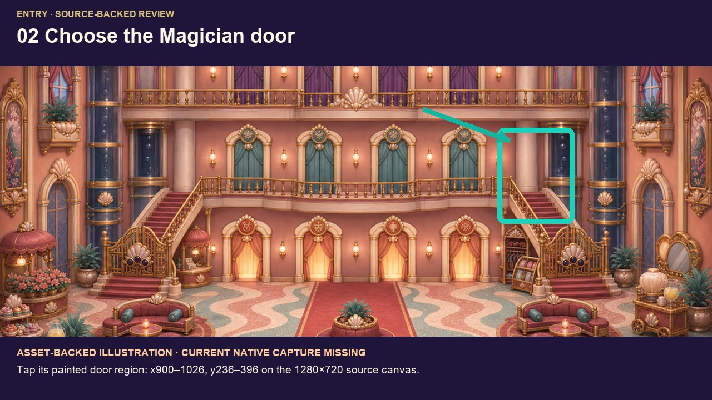

Tap its painted door region: x900–1026, y236–396 on the 1280×720 source canvas.

**Cue:** Entry configuration: “Abracadabra! Face the magician imp in a whole illusion duel: hide and track the bunny-fish, melt the rope, open the cabinet and charge the giant star portal!”

**Roshan / moving parts:** The venue actor moves toward the selected doorway for 0.55s before the launch callback.

**Before → after:** The career room opens at the first practice activity, or a valid saved checkpoint.

**Next:** Find the wand invitation in step 03.

**Coverage gap:** Painting reconstruction and measured hit region are source-backed; no current native launch screenshot or audible entry recording is verified.

## 03 — Approach the wand

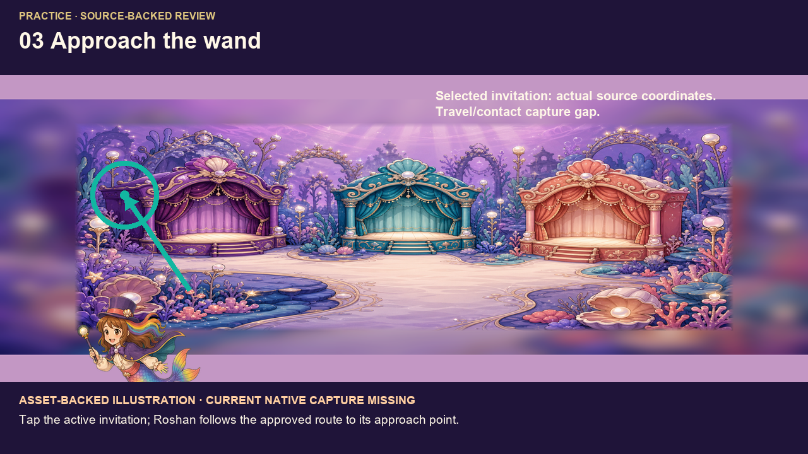

Tap the active invitation; Roshan follows the approved route to its approach point.

**Cue:** “Hold the wand to hide Lamba under a hat!” — op_magician_vanish_stage.

**Roshan / moving parts:** The travel atlas is selected during the route. Arrival and the hotspot opening finish before the task opens.

**Before → after:** The activity reveals from its room object; walking alone earns no VANISH progress.

**Next:** Keep one finger on the wand in step 04.

**Coverage gap:** Roshan’s entire approach/arrival/hand contact needs a native input capture. The static illustration does not establish embodied acting.

## 04 — Hold the wand: VANISH

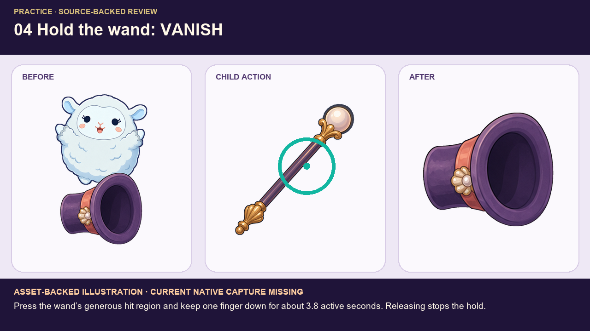

Press the wand’s generous hit region and keep one finger down for about 3.8 active seconds. Releasing stops the hold.

**Cue:** “Hold the wand to hide Lamba under a hat!” — op_magician_vanish_stage.

**Roshan / moving parts:** The wand moves/rotates, a separate hat moves across, and the Lamba reveal cutout fades. Roshan uses the reviewed work-row cell 0 (atlas cell 8).

**Before → after:** The reveal cutout becomes hidden by 72% fill; the hat and star finish are held after earned completion.

**Next:** After the 2.2s finished-picture hold, select the hat invitation (step 05).

**Coverage gap:** The current cutout includes hat pixels: this is the exact source asset, not an isolated-Lamba repair. Whole-figure wand/hand contact, timing and finish occlusion remain uncaptured.

## 05 — Approach the hats

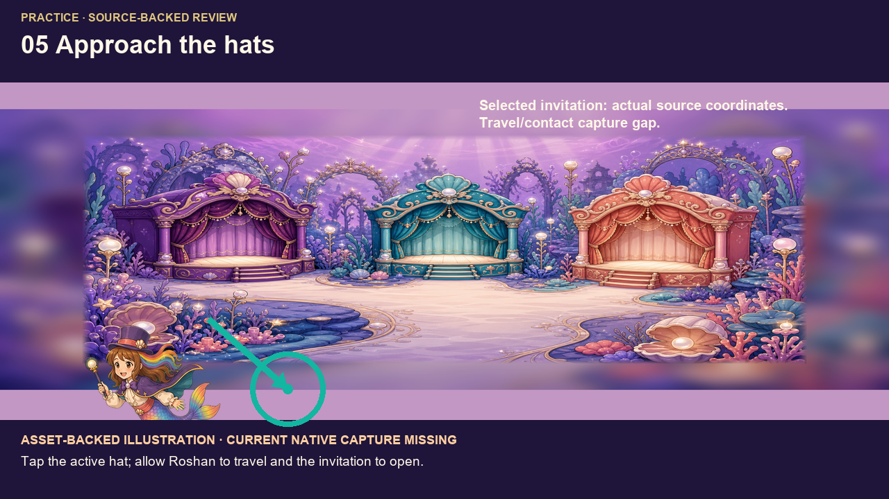

Tap the active hat; allow Roshan to travel and the invitation to open.

**Cue:** “Follow the glowing hat through the shuffle!” — op_magician_track.

**Roshan / moving parts:** The actor travels to the pool station, then changes to the reviewed presenting pose.

**Before → after:** The hat activity appears; the shuffle is about to show the answer.

**Next:** Watch and choose in step 06.

**Coverage gap:** No current travel/contact transition capture for this station.

## 06 — Watch and tap: TRACK

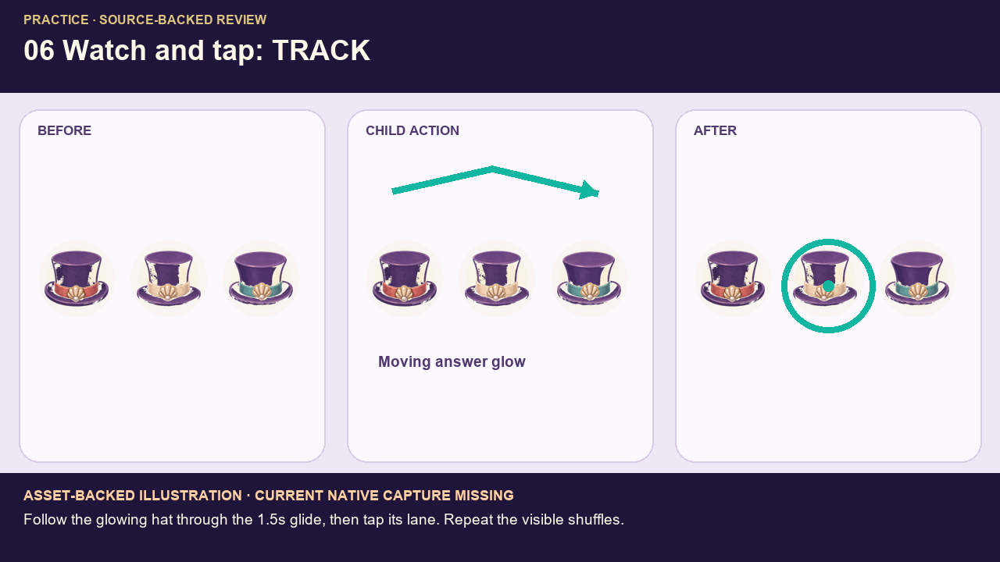

Follow the glowing hat through the 1.5s glide, then tap its lane. Repeat the visible shuffles.

**Cue:** “Follow the glowing hat through the shuffle!” — op_magician_track.

**Roshan / moving parts:** The answer glow glides from the flashed lane to the target lane; a decoy arc crosses it. Roshan stays in reviewed idle cell 2. The code does not shuffle the three painted hats themselves.

**Before → after:** A correct choice pays one unit, selects a new target and starts another shuffle; goal is 5 units. A wrong pick re-flashes the same answer and uses mercy credit.

**Next:** After the earned finish hold, open the rope invitation in step 07.

**Coverage gap:** The illustrated arrow names glow travel, not physical hat relocation. Current native answer visibility, wrong-choice feedback and acting are missing.

## 07 — Approach the rope

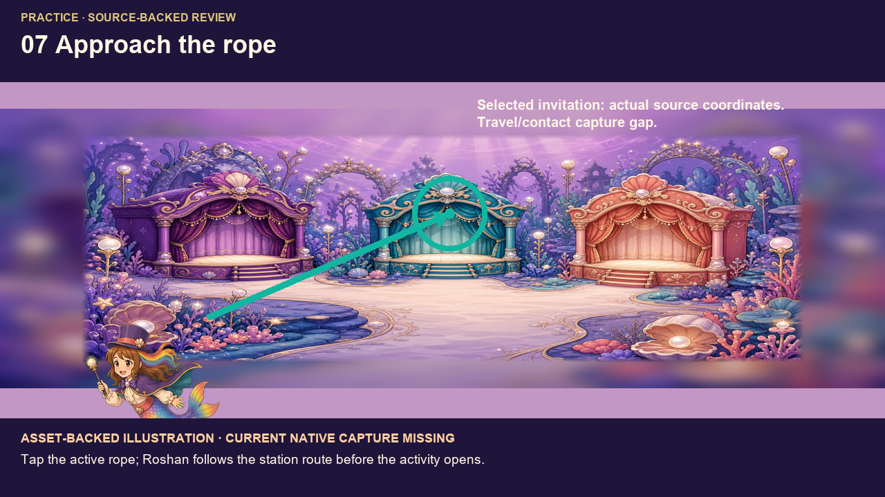

Tap the active rope; Roshan follows the station route before the activity opens.

**Cue:** “Swipe the knotted rope into one long ribbon!” — op_magician_rope_stage.

**Roshan / moving parts:** Her travel sequence reaches the teal station; reviewed idle cell 3 presents the activity.

**Before → after:** The ordered rope trace becomes available.

**Next:** Trace left to right in step 08.

**Coverage gap:** Current approach/arrival, exact visible rope/corridor alignment and hand contact need native captures.

## 08 — Trace the curve: ROPE

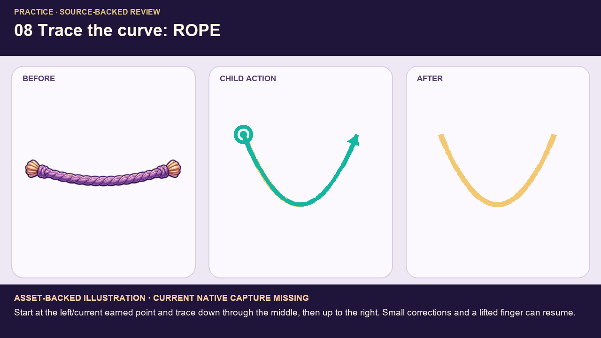

Start at the left/current earned point and trace down through the middle, then up to the right. Small corrections and a lifted finger can resume.

**Cue:** “Swipe the knotted rope into one long ribbon!” — op_magician_rope_stage.

**Roshan / moving parts:** Accepted forward travel follows the broad corridor; reverse scrubbing, a large shortcut or off-path travel earns nothing. Roshan presents in idle cell 3.

**Before → after:** The earned traced line extends to the endpoint. The code draws a curved path, not a newly authored straightening-rope animation.

**Next:** After the finish hold, the stage performance begins (step 09).

**Coverage gap:** The illustrated gold curve follows the source formula; it is not a game screenshot. Whole-rope transformation and Roshan’s truthful contact are unverified.

## 09 — Begin the stage performance

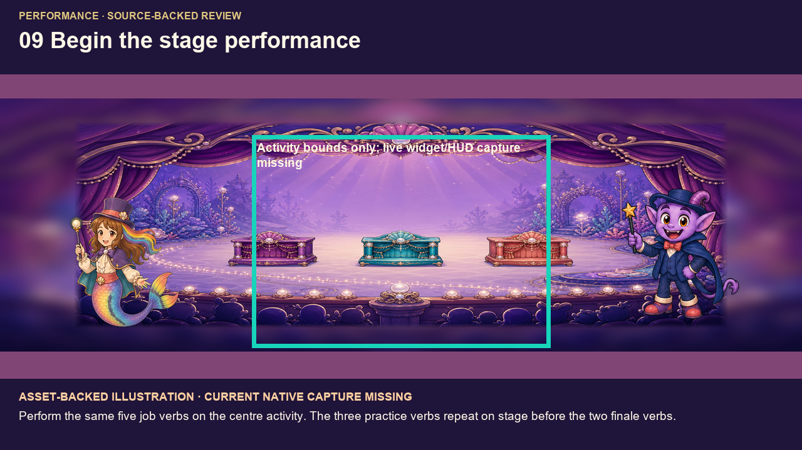

Perform the same five job verbs on the centre activity. The three practice verbs repeat on stage before the two finale verbs.

**Cue:** The VANISH instruction starts again: “Hold the wand to hide Lamba under a hat!”

**Roshan / moving parts:** Stage setup places a 300px actor at (48,264), a 220px rival at (974,294), and a 476×340 activity at (402,216).

**Before → after:** Room invitation walking ends; stage phases open directly. Competition timing begins only with accepted real stage input.

**Next:** Stage VANISH → TRACK → ROPE (steps 10–12).

**Coverage gap:** The composition is an asset-board layout from code, with no runtime HUD/timing capture. Rival timing and local actor/tool contact remain open.

## 10 — Stage VANISH

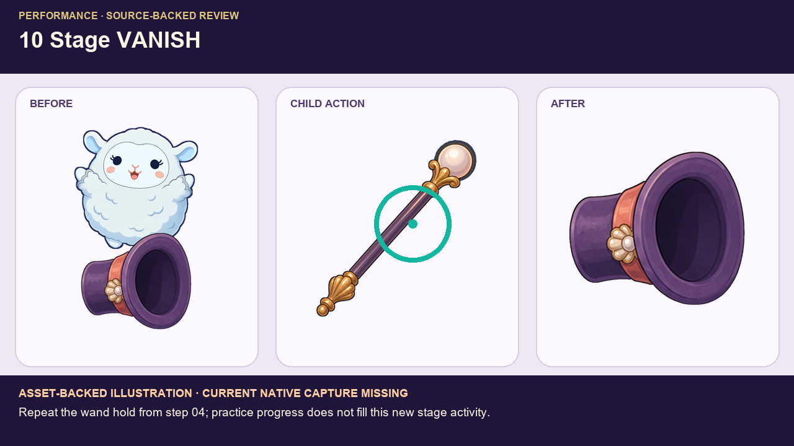

Repeat the wand hold from step 04; practice progress does not fill this new stage activity.

**Cue:** “Hold the wand to hide Lamba under a hat!” — op_magician_vanish_stage.

**Roshan / moving parts:** The same object-state motion runs beside the rival performance; Roshan’s reviewed work pose remains the same.

**Before → after:** A newly earned hidden-Lamba endpoint counts toward the stage performance.

**Next:** Finish hold, then stage TRACK (step 11).

**Coverage gap:** Shared object art/gesture is illustrated again to show ordered stage coverage. No earned native replay has been captured.

## 11 — Stage TRACK

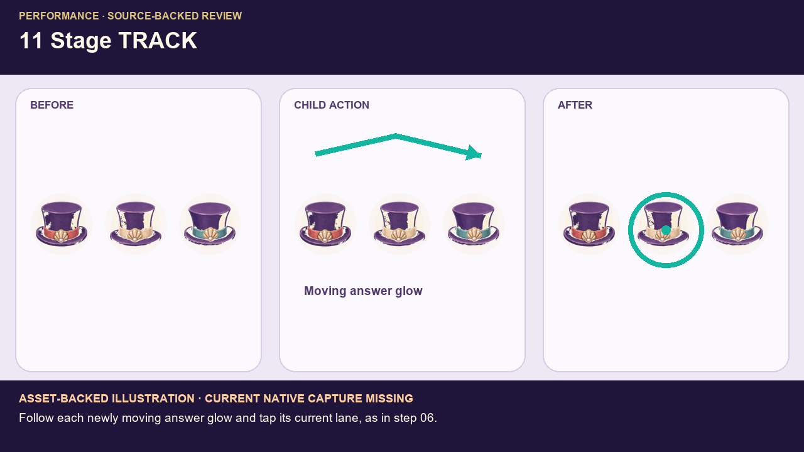

Follow each newly moving answer glow and tap its current lane, as in step 06.

**Cue:** “Follow the glowing hat through the shuffle!” — op_magician_track.

**Roshan / moving parts:** The presenting pose and live glow/decoy repeat; stage input additionally records performance misses and progress quarters.

**Before → after:** Five units of this stage’s earned work complete the phase.

**Next:** Finish hold, then stage ROPE (step 12).

**Coverage gap:** Stage target sequence depends on phase index and rival step. No invented fixed answer order is shown.

## 12 — Stage ROPE

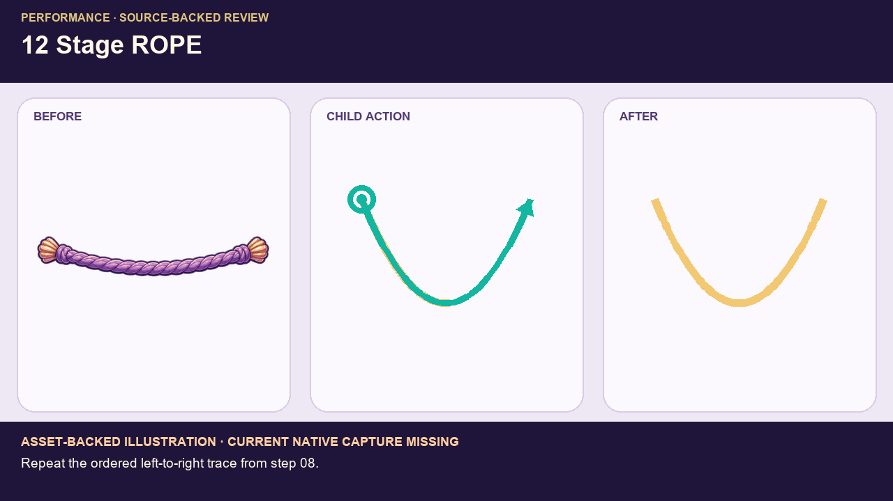

Repeat the ordered left-to-right trace from step 08.

**Cue:** “Swipe the knotted rope into one long ribbon!” — op_magician_rope_stage.

**Roshan / moving parts:** The path fills from genuine forward motion; the presenting actor pose does not itself prove rope contact.

**Before → after:** Reaching the earned endpoint completes this stage phase and banks the checkpoint.

**Next:** Finish hold, then CABINET (step 13).

**Coverage gap:** There is no native midpoint/contact or earned endpoint capture for this stage repeat.

## 13 — Pull down: CABINET

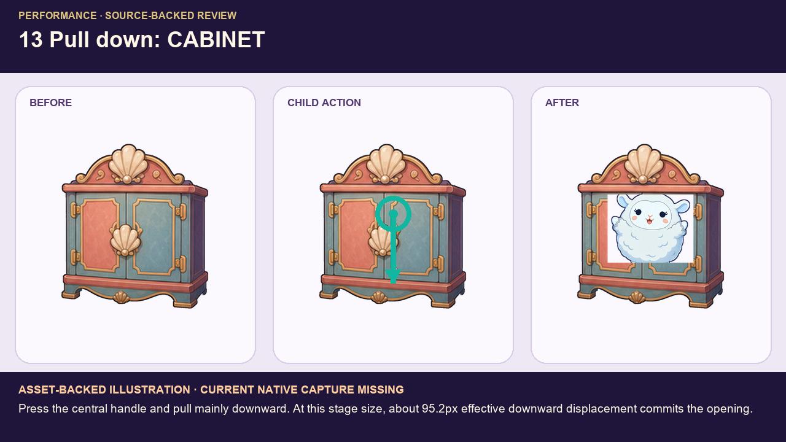

Press the central handle and pull mainly downward. At this stage size, about 95.2px effective downward displacement commits the opening.

**Cue:** “Swipe down to open the magic cabinet!” — op_magician_cabinet_stage.

**Roshan / moving parts:** The handle follows the pull. A full pull commits the reveal, then opening time continues toward its endpoint; Roshan stays in reviewed idle cell 3.

**Before → after:** The closed cutout fades and the Lamba reveal fades in. A partial released/cancelled pull resets and re-hints; the committed opening remains earned.

**Next:** Finish hold, then the star portal in step 14.

**Coverage gap:** The current implementation crossfades two full cabinet images; this board does not prove physical door articulation or hand/handle contact.

## 14 — Draw circles: PORTAL

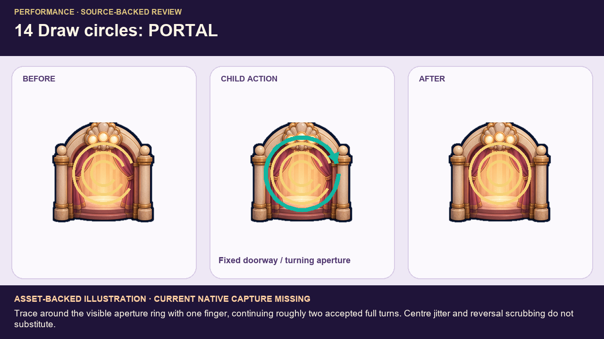

Trace around the visible aperture ring with one finger, continuing roughly two accepted full turns. Centre jitter and reversal scrubbing do not substitute.

**Cue:** “Draw circles to open the star portal!” — op_magician_portal_stage.

**Roshan / moving parts:** The aperture rotates and fills; columns, curtains and threshold remain upright. The doorway eases/fades in. Roshan uses reviewed idle cell 3.

**Before → after:** The aperture closes its gaps and gains a finish glow when its goal reaches 2 units.

**Next:** The earned final picture holds (step 15), then the curtain call.

**Coverage gap:** Ring geometry matches the staged input candidate, which passed 59 component checks; current native acting/contact, full-speed finish and device playback remain missing.

## 15 — See the earned finish

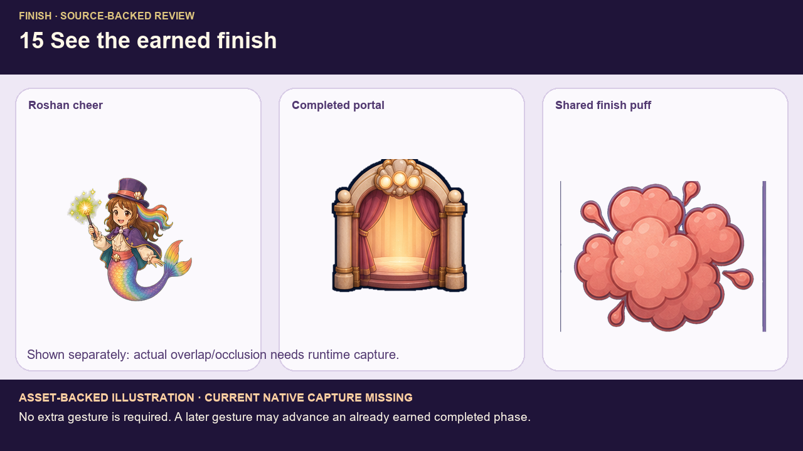

No extra gesture is required. A later gesture may advance an already earned completed phase.

**Cue:** The phase instruction is not evidence of a distinct spoken finish line; the staged act uses a success yay at curtain call.

**Roshan / moving parts:** The world accepts completion, selects cheer, emits the shared puff and holds the picture for 2.2s.

**Before → after:** Only then does phase advance finish the whole act.

**Next:** The medal/result curtain call follows in step 16.

**Coverage gap:** The puff/actor may obscure the portal: that known review risk is illustrated as source constituents, not accepted finish playback.

## 16 — Curtain call and rewards

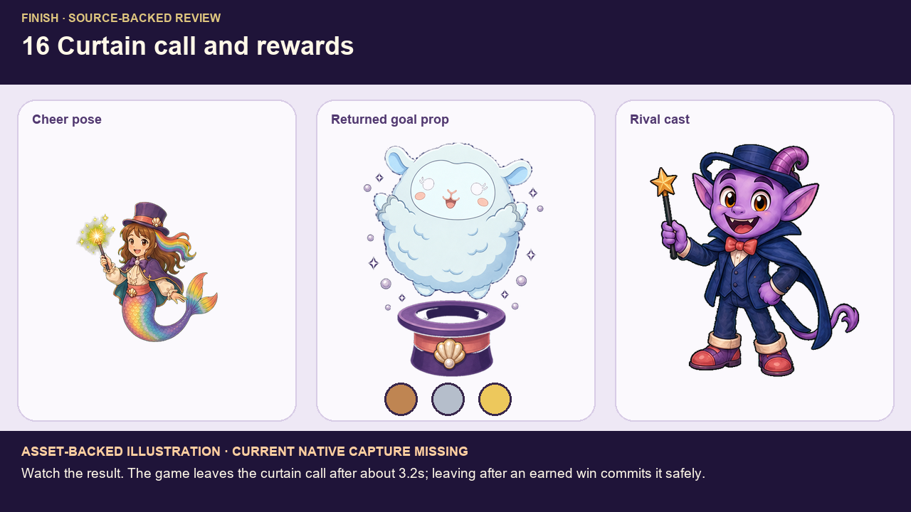

Watch the result. The game leaves the curtain call after about 3.2s; leaving after an earned win commits it safely.

**Cue:** The two-act branch plays the existing success yay; it does not speak the configured “Roshan’s star portal wins…” line on this path.

**Roshan / moving parts:** The activity is hidden, the cast is restaged, Roshan cheers and the goal prop returns. The result overlay shows tier and token change/balance.

**Before → after:** A completed performance earns at least bronze. Only improvements to the best tier add Encore tokens (bronze 1, silver +2, gold +3).

**Next:** The normal route saves its star/pearls and returns to the Hall (step 17).

**Coverage gap:** The medal sketch is a documentation key derived from the overlay’s code, not a screenshot. No current earned result or audible yay has been captured.

## 17 — Return with the saved star

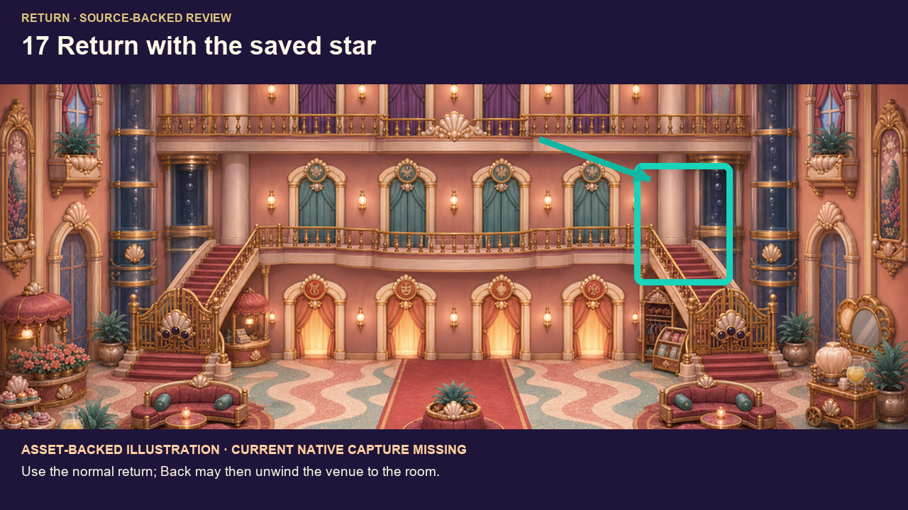

Use the normal return; Back may then unwind the venue to the room.

**Cue:** The exact route-return voice must be observed; no new instruction is invented here.

**Roshan / moving parts:** The act cleans up its nodes, callbacks, music and input before restoring the route.

**Before → after:** Normal completion keeps Magician’s bit 8, pays 3 pearls first time or 1 on replay, and removes its finished performance checkpoint.

**Next:** Choose the Magician again, or resume an unfinished run (step 18).

**Coverage gap:** Actual reward-before-return and restored Hall controls need current native/save evidence.

## 18 — Saved resume and replay

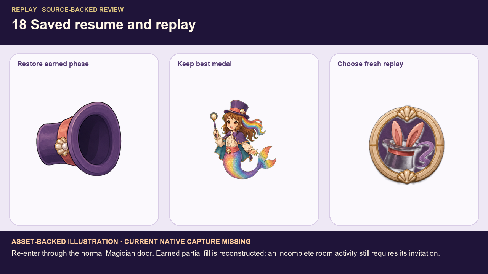

Re-enter through the normal Magician door. Earned partial fill is reconstructed; an incomplete room activity still requires its invitation.

**Cue:** The resumed phase requests its own exact instruction again.

**Roshan / moving parts:** The checkpoint binds practice/stage identity, source phase, mode and earned progress. The staged repair cancels transient input on focus loss without erasing fill.

**Before → after:** The best medal stays monotonic. Same/lower-tier replays do not mint more Encore tokens; normal completed replays retain the 1-pearl reward.

**Next:** Continue that phase or complete another performance.

**Coverage gap:** No new save was created or edited for this walkthrough. Exact close/reload/resume/input evidence remains pending.

## D1 — Temporary elevator playtest

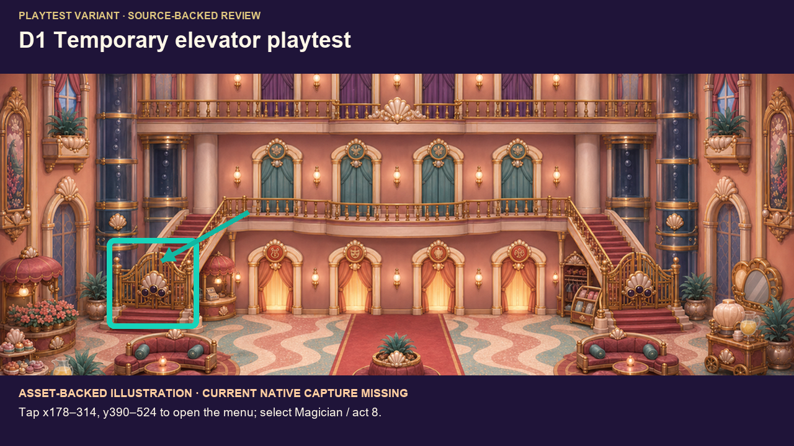

Tap x178–314, y390–524 to open the menu; select Magician / act 8.

**Cue:** The menu has picture buttons and tooltips; no voiced Magician menu instruction is established by this source.

**Roshan / moving parts:** The owner-requested temporary launcher uses the shipping engine in a fresh dev_playtest context.

**Before → after:** It runs the same 3-practice + 5-stage sequence shown in steps 03–16.

**Next:** After completion or Back, the job menu reopens (D2).

**Coverage gap:** Elevator/menu/career-selection native panels are missing; this illustration marks the source hit region and selected costume.

## D2 — Playtest return and fresh replay

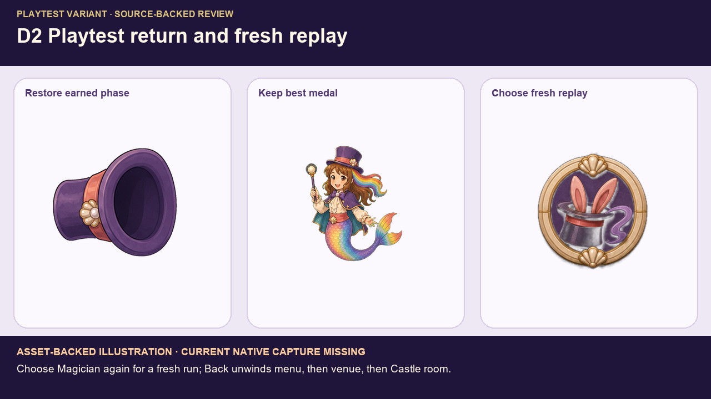

Choose Magician again for a fresh run; Back unwinds menu, then venue, then Castle room.

**Cue:** No extra completion voice is commissioned; the normal stage yay may still play.

**Roshan / moving parts:** The result shows its normal evaluated tier, but token change and balance are shown as zero.

**Before → after:** This context skips durable stars, pearls, mastery writes and performance checkpoints. It is deliberately not a saved child replay.

**Next:** Return to normal play for persistent rewards.

**Coverage gap:** The source policy is verified by reading; no runtime before/after save-byte comparison is claimed.

## B1 — Birthday/story applicability

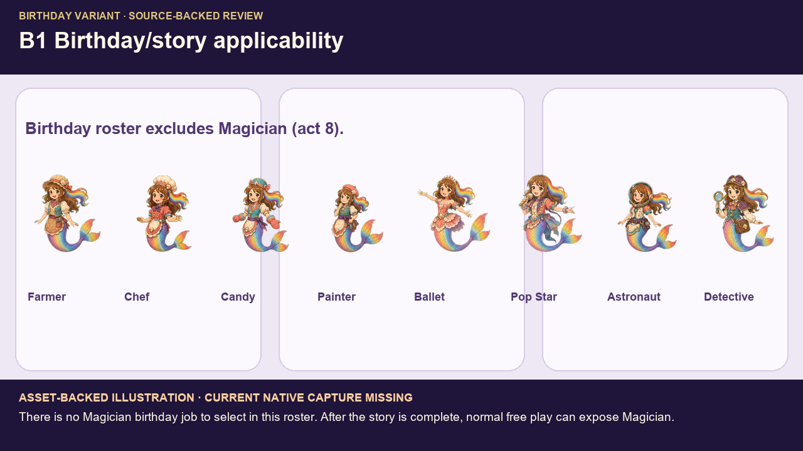

There is no Magician birthday job to select in this roster. After the story is complete, normal free play can expose Magician.

**Cue:** No Magician birthday instruction is implemented in the authoritative eight-career spine.

**Roshan / moving parts:** Farmer → Chef → Candy Maker → Painter → Ballerina → Pop Star → Astronaut → Detective own the party work.

**Before → after:** Magician act 8 is outside the party mask 0x2C4F. An older venue comment about a Magician party contribution is not current flow authority.

**Next:** Use the normal Hall route or the explicit temporary playtest variant.

**Coverage gap:** Birthday Magician is NOT_APPLICABLE by roster, not a fabricated missing task. Fresh-save reachability is separately unverified under MA-PLAY-005.

## P1 — Pending art decisions

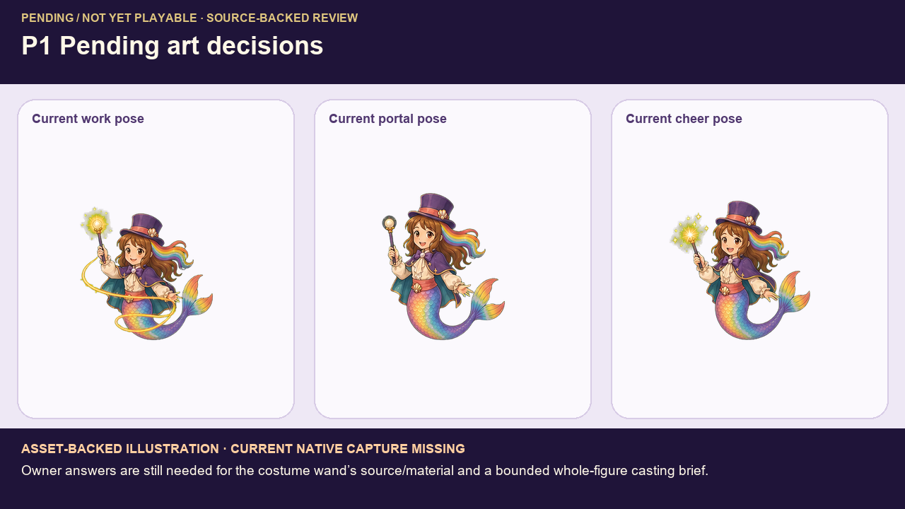

Owner answers are still needed for the costume wand’s source/material and a bounded whole-figure casting brief.

**Cue:** These are review questions, not new child instructions.

**Roshan / moving parts:** A future casting action must move as one coordinated whole drawing, retaining constant head/arm/hand/body size and truthful contact.

**Before → after:** The earlier limb-only/cuff and finish studies remain rejected. This request generates no keys, changes no pose and resets no attempt cap.

**Next:** Keep dependent artistic work paused until the owner answers.

**Coverage gap:** No proposed replacement gameplay flow or new artwork is being presented as implemented.

## Evidence and publication

Every PNG is a review derivative. Source originals, voices and saves remain unchanged. The manifest records source paths, exact hashes, dimensions, edits, input provenance and per-step gaps. The two dirty source scripts are frozen as text snapshots, separately from the inherited baseline. Source illustrations and prior diagnostics never establish DL-QA-11.

Inherited runtime baseline `96274aab9cebd563b10846a4a48de5d017588563` has [green probe run 37564552946](https://github.com/Ebonyks/mermaid-roshan-reef/actions/runs/37564552946). This does not verify the staged candidate or these illustrations as gameplay. Full candidate/world verification, current natural-route captures, independent visual review and device/child/owner acceptance remain pending. No new generation or paid job occurred; prior rejected art attempts remain counted.

The audit impact is [magician-visual-walkthrough-20261007.json](../../../design/audit_impacts/magician-visual-walkthrough-20261007.json). Public GitHub publication must be verified at its exact immutable revision before claiming delivery.
