# Opera career games: mechanics and scene-quality re-audit

> Historical baseline: this report predates the reconciled Racer, Geologist, Teacher and Opera Hall changes. Its captured verdicts remain unchanged as evidence for their recorded source revisions; they do not describe or accept the current dev-based candidate. See `design/OPERA_RACER_ENGINE_INTEGRATION_2026-09-05.md`, `design/GEOLOGIST_REBUILD_2026-09-05.md`, `design/TEACHER_LEARNING_ENGINE_2026-09-05.md`, `design/OPERA_TWO_ACT_PERFORMANCES_2026-09-05.md`, and `audit/minigame_art_quality_2026-09-05/current_scope_addendum.md` for later scope.

[Current source follow-up](minigame_art_quality_2026-09-05/current_mechanics_followup.md) distinguishes current runtime flows and calibration from the historical findings below.

**5 September 2026 · 14 live careers · 57 free-play phases · subjective editorial review**

The rebuild has produced several distinct interactions: Detective's lens and evidence board, Ballerina's guided gestures, Boxer's telegraphed sparring, Astronaut's pipe puzzles, and Nursery's adaptive catching. Those are the strongest foundations for the next iteration. The main remaining weakness is inconsistency between those specialist interactions and the generic hold, circle, swipe, and glowing-answer tasks around them. In several careers, the painted room promises much more physical play than the activity delivers.

The most consequential findings are a **reproduced Chapter 2 Ballerina progression block**, **Racer's finale ending after a 324-degree finger circle instead of a driving loop**, **semantic choice tasks awarding partial credit for wrong answers**, **Geologist's missing object/voice presentation**, and **Nursery/Detective's malformed scene framing**. Ordinary free-play also loses unfinished career progress on exit. The best next investment is to repair these contracts, preserve completed work, and connect each gesture to a visible object transformation. Adding another career or another generic phase would yield less benefit.

This audit evaluates the child's actual audience constraints: one four-year-old, one finger, no reading-dependent objective, no fail state, short sessions, preserved progress, and the approved polished 2D storybook medium. It is advisory evidence, not a replacement for the master audit or owner/device acceptance. No game, art master, family recording, protected asset, or production probe was changed.

## Reading the scores

Overall scores are editorial judgments, not statistically measured ratings or arithmetic averages. **1** means materially incomplete or blocked; **2** means recognizable but missing the central play promise; **3** means usable with substantial thinness or inconsistency; **4** means strong preschool play with specific remaining defects; **5** requires exceptional execution and owner acceptance in the real runtime context. None earns 5 here. Tenths communicate relative judgment only; differences of 0.1 should not drive scheduling.

“Room art” rates the observed entry composition, including framing and actor integration. It does **not** rate the active widget, native-resolution compliance, or Android performance. Those are evaluated separately in each review. A beautiful room cannot grant a mechanic or a technical gate a pass. Mechanics confidence is high for traced code contracts and the reproduced Ballet defect, moderate for child experience; target-device polish confidence remains limited.

| Career | Overall /5 | Room art /5 | What is strongest | What most needs improvement |
|---|---:|---:|---|---|
| [Pastry Chef](#pastry-chef) | 3.8 | 4.5 | Coherent ingredient-to-cake sequence; forgiving oven timing | Long first pour; crude active oven; fixed product |
| [Detective](#detective) | 4.0 | 3.0 | Room-scale lens search and truthful clue dragging | Reduced scene framing, repeated clue layout, dark targets |
| [Ballerina](#ballerina) | 4.1* | 4.4 | Watch/act handoff, generous tracing, retained gesture progress | Chapter 2 stalls; unrelated VO length extends intermediate holds |
| [Candy Maker](#candy-maker) | 4.1 | 4.3 | Clear specialist pour and shape sorting | Fixed recipe/order; generic wrapping |
| [Stuffie Surgeon](#stuffie-surgeon) | 3.6 | 4.3 | Gentle care sequence, real scanning and bandaging | Diagnosis is a glowing-answer task; repeated treatment grammar |
| [Farmer](#farmer) | 3.9 | 4.2 | Safe pull/release toss and visible herd journey | Crops do not connect the phases; repeated target setup |
| [Boxer](#boxer) | 4.4 | 4.1 | Most complete action progression and telegraphing | Repetitive Title loop; flat foreground glove rendering |
| [Magician](#magician) | 3.7 | 4.6 | Theatrical sequence and direct cabinet reveal | Shuffle accepts early answers; wrong answers can advance |
| [Painter](#painter) | 3.4 | 4.5 | Forgiving reveal brush and freely placed stamps | Actual artwork is predetermined and not retained in a meaningful gallery |
| [Astronaut](#astronaut) | 4.0 | 4.4 | Pipe causality, same-hub valve manipulation | Late phases lose depth; story parking borrows kart context |
| [Racer](#racer) | 2.3 | 4.4 | Excellent circuit painting and wheel repair | The finale has no live driving decisions or laps |
| [Nursery](#nursery) | 3.7 | 2.8 | Adaptive catching, gentle burp pacing, blanket transformation | Broken room framing; Catch demonstration points the wrong way |
| [Pop Star](#pop-star) | 3.5 | 4.6 | Brief, forgiving musical echo | Dance is a generic choice task; weak finale recall |
| [Geologist](#geologist) | 1.8 | 1.8 | Recognizable costume and forgiving specimen sorter | Three abstract activities, no painted cave, no phase-specific VO keys |

*Ballerina's ordinary free-play mechanic alone is about **4.6/5**. Its current Chapter 2 implementation is **1/5 until the blocker is repaired**. The overall 4.1 describes the career's strong design with a serious alternate-route defect; it must never be read as permission to ship the blocked story route. The story variants are not all visually captured in this review.*

## Scope, sources, and evidence strength

Two **Sol** agents independently reviewed seven mechanics each; a **Luna** agent reviewed the source art and all live career entry compositions, and another **Luna** agent cross-checked timing, input credit, persistence, tutorial routing, and the Chapter 2 Ballet contract. The primary review reconciled their ratings, rejected recommendations that would unnecessarily remove accessible tap controls or constrain creative stamp placement, checked native-source dimensions, and inspected fresh active-phase captures. These are complementary reviews, not a statistical panel of human playtesters.

The integration source is [origin/dev cc931b8](https://github.com/Ebonyks/mermaid-roshan-reef/tree/cc931b8f4e0849faa674b9ea4020d15c1b15e8d1). Visual diagnostics ran on local [f2535ad](https://github.com/Ebonyks/mermaid-roshan-reef/tree/f2535adc192f9cc8bb89d07daba005f38be6f43d). The relevant Opera runtime scripts and art are unchanged between those heads; they are not identical repository-wide. The isolated report branch starts at cc931b8. Findings exclude `LEGACY_PHASES`, the retired career indices, and unintegrated Teacher art. All 14 currently live careers are covered even though their entry doors are distributed around Castle rooms rather than all inside the Opera Hall.

Evidence types are kept distinct:

- **Source-derived:** actual phase routing, goals, hit conditions, animation constants, assist timing, and save contracts. A goal of six is not necessarily six gestures: several specialists map one full path to six units.
- **Observed desktop rendering:** 50 route screenshots at 1280×720 and 1600×720, plus 57 additional staged activity frames, on **official Godot 4.7.2-stable**, Mobile renderer, NVIDIA RTX 3060 Ti. The report includes a contact sheet for every career. Activity phases were opened programmatically and photographed at their initial open state; they are not natural playthrough recordings or completion/mistake evidence. This bypassed walking and retained the entry actor position, so actor contact in these phase-open stills cannot establish normal station arrival. Entry compositions and source routing remain the evidence for those claims.
- **Reproduced contract failure:** real Ballet specialist-to-world signals with current Chapter 2 phase data, using a disposable diagnostic. This isolates the defect without pretending to have completed the entire birthday story.
- **Competitor evidence:** current official Google Play/developer descriptions, plus selected developer-provided promotional screenshots viewed on the listings. These establish advertised mechanics and visual presentation. They do not establish sustained frame rate, actual touch latency, monetization-free behavior, or exact tutorial duration.
- **Not measured:** a four-year-old's first-run success, on-device audio overlap, thumb occlusion, touch-to-response latency, 30-fps/overdraw performance on the Lenovo Tab M11, or uncut first-launch competitor tutorial time. No precise competitor tutorial length is invented.

The earlier [job-gimmick comparison](https://github.com/Ebonyks/mermaid-roshan-reef/blob/cc931b8f4e0849faa674b9ea4020d15c1b15e8d1/OPERA_JOB_GIMMICKS_2026-07-25.md), [widget input audit](https://github.com/Ebonyks/mermaid-roshan-reef/blob/cc931b8f4e0849faa674b9ea4020d15c1b15e8d1/OPERA_WIDGET_INPUT_AUDIT_2026-08-02.md), and [quality audit](https://github.com/Ebonyks/mermaid-roshan-reef/blob/cc931b8f4e0849faa674b9ea4020d15c1b15e8d1/OPERA_MINIGAME_QUALITY_AUDIT_2026-08-09.md) are historical context. The present live phase tables and specialist routes decide what exists now. Earlier findings about 13 careers/52 phases, older Ballet/Boxer behavior, or a two-lap racer cannot automatically be carried forward.

## Introduction, tutorial, and pacing assessment

There is no separate currently active Chapter 2 tutorial level: `INITIAL_TUTORIAL_ACTS` is empty, `tutorial_phase_is_active()` returns false, and the current story overrides disable the old tutorial flag. The first story phase teaches in context. The dormant one-phase tutorial route should not be counted as part of today's player experience.

The shared introduction is a sound preschool structure: the objective speaks, a named object glows, Roshan travels to it, the activity opens from that station, and a ghost shows the gesture. The task is not required to wait through a long instruction screen. What varies is whether the actual activity obeys a clear **watch → your turn → response → assist** contract. Ballet Pose and Pop Star Rhythm do; Magician TRACK currently does not.

| Event | Verified current value | Interpretation and evaluation |
|---|---|---|
| Walk to station | 250 px/s | Duration depends on path length; do not count as a fixed tutorial time. Travel should reveal the next object rather than delay a known action. |
| Hotspot opening | 0.62 s | Short and spatially meaningful. Measure input buffering so eager touches are not discarded. |
| Activity reveal | Scale 0.78→1 in 0.28 s; fade 0.20 s | Clear station-to-action handoff; overlapping animations are not summed as a mandatory 0.48 s delay. |
| Generic ghost | 2.4 s loop | Reasonable cycle, but a finger arrow is insufficient when the key rule is lateral intercept or hidden-answer memory. |
| Room prompt / approach | Rehint at 9 s; auto-approach at 20 s | Helps reach a station; it must not complete the activity. Consider earlier specific help only after observed confusion. |
| Open-task rehint | 9 s, Ballet 7 s in shared world | Distinguish the shared timer from specialist assist timers. Repeated VO needs a single speaking owner. |
| Ballet teaching | Pose demo 2.15 s; Ribbon/Twirl 1.55 s | Pose owns the watch turn. Ribbon and Twirl demos are interruptible. Assist starts after 5/10 s of available child-turn inactivity. |
| Boxing teaching | 2.4 s ghost; both hands shown over 4.8 s | One finger may work the gloves sequentially; never require simultaneous two-finger use. |
| Generic completion picture | 2.2 s per phase | Across five phases this alone adds 11 s. Keep payoff readable, but avoid unrelated pauses and duplicate congratulations. |
| Specialist completion | Boxing 1.1 s, Belt 2.2 s; Nursery Catch 0.8 s | Faster where the next action already carries the reward. |
| Ballet intermediate hold | At least about 3.10 s from longest phase-set VO | Wrong source of duration: use the current relevant clip/response, not the longest unrelated instruction. |
| Phase gap | Ordinary 1.0 s / finale 2.6 s; input-skippable | These are not unconditionally additive tutorial delays. Ballet/Boxer use zero generic gap. |
| Final curtain | About 3.2 s | Separate the post-win celebration from mechanic duration and from the last 2.2 s picture. |

Source owners: [scripts/opera_world_hotspot_2d.gd:15-16](https://github.com/Ebonyks/mermaid-roshan-reef/blob/cc931b8f4e0849faa674b9ea4020d15c1b15e8d1/scripts/opera_world_hotspot_2d.gd#L15), [scripts/opera_career_world_2d.gd:2230-2407,3179-3209,4205-4249,4385-4455](https://github.com/Ebonyks/mermaid-roshan-reef/blob/cc931b8f4e0849faa674b9ea4020d15c1b15e8d1/scripts/opera_career_world_2d.gd#L2230), [scripts/opera_ballet_surface.gd:18-41,247-274](https://github.com/Ebonyks/mermaid-roshan-reef/blob/cc931b8f4e0849faa674b9ea4020d15c1b15e8d1/scripts/opera_ballet_surface.gd#L18), [scripts/opera_boxing_surface.gd:21-24,832-852](https://github.com/Ebonyks/mermaid-roshan-reef/blob/cc931b8f4e0849faa674b9ea4020d15c1b15e8d1/scripts/opera_boxing_surface.gd#L21), and [scripts/chapter_two_director.gd:24,232-233,601-653](https://github.com/Ebonyks/mermaid-roshan-reef/blob/cc931b8f4e0849faa674b9ea4020d15c1b15e8d1/scripts/chapter_two_director.gd#L24).

**Timing targets for the next playtest, not competitor facts:** demonstrate one novel rule in roughly 1.5–3 seconds; make hold progress change visibly several times rather than filling an unexplained meter; try Chef's initial pour at 4.5–6 seconds; let replay skip known demonstrations through real input; rate-limit spoken corrections so a child can hear the consequence. Do not impose a blanket career duration before measuring first-run and repeat play separately. A puzzle should be allowed to take longer than a decorative hold.

Official comparators support learning through action, not a numerical tutorial race. Thinkrolls Space explicitly describes successive lessons and unlimited retries; Dr. Panda Candy Factory describes machine experimentation without time pressure; Toca's cooking play emphasizes tool combinations and guest reactions. The useful benchmark is how quickly a new rule becomes physically understandable, and what the child can change after learning it. Exact first-launch tutorial seconds for these products remain unknown in this audit.

## Deep artwork assessment: painting, playable scene, and master gates

The approved Roshan family is stable: face, brown hair, rainbow forelock and tail, proportions, warm colored contours, and costume identities remain recognizable. The Geologist atlas maintains that identity too. Most painterly rooms share rounded shell architecture, pearl/brass trim, aqua water, lavender/plum shadows, and warm activity landmarks. Chef, Magician, Painter, Astronaut, Racer, and Pop Star are particularly successful *room illustrations*.

A comprehensive playable scene needs more than an excellent background. It needs a readable floor, contact and occlusion, one authoritative version of each object, an understandable approach route, and a transformation at the exact location touched. The strongest examples are Detective searching the actual room, Astronaut's valve rotating around its painted hub, Racer's wrench acting at the missing wheel, Nursery's blanket covering its baby, and Ballet's shared drawn/hit-test path. The weakest are Geologist naming physical samples while displaying generic circles, and Chef replacing its exquisite oven landmark with a blunt brown rectangle.

**Confirmed technical coverage problem, with the correct asset chain:** the backdrop loader prefers the four 1024×1024 world tiles; it does not simply display the 1024×576 thumbnail. The two tile rows contribute 576 pixels each, producing an active **2048×1152** source region. However, the promotion tool builds that region with a blurred enlarged surround and native art pasted in the center, then pads it to a 2048 square before slicing. Eleven actual `world_*_native.png` sources are **1672×941**; Detective and Nursery are **1254×1254**. A padded 2048 master is not native 2048×2048 coverage. Neither tile dimensions nor an attractive screenshot closes the owner's per-playable-screen native-background requirement. Source: [tools/build_opera_codex_art.py:24,244-261](https://github.com/Ebonyks/mermaid-roshan-reef/blob/cc931b8f4e0849faa674b9ea4020d15c1b15e8d1/tools/build_opera_codex_art.py#L24) and [scripts/opera_world_backdrop_2d.gd:89-191](https://github.com/Ebonyks/mermaid-roshan-reef/blob/cc931b8f4e0849faa674b9ea4020d15c1b15e8d1/scripts/opera_world_backdrop_2d.gd#L89).

The required repair begins with an inventory of approved larger originals. Reconstruct from suitable existing native art where available. If no sufficient master exists, record the exact coverage/composition gap and limit any new artwork to it. Do not stretch the nursery, count upscaling or padding as native detail, independently regenerate objects across tile joins, or redesign the approved rooms for novelty. No generation was performed for this audit.

The observed frame also exposes shared composition weaknesses:

- **Blurred borders are visible at the normal 1280×720 aspect**, not merely on ultrawide screens. They reduce the feeling of a single complete world. Both Detective and Nursery have unusually small central scenes, with navy or cyan bands and entry characters outside the convincing floor. Nursery is the more conspicuous example. The absent nursery thumbnail is not itself the cause: its tile family exists and is loaded.
- **Large translucent polygon spotlights cross already-painted lighting.** The tile branch invokes the shared spotlights. Hard diagonal wedges flatten authored values and sometimes cross actors and targets. Keep lighting restrained and true 2D; reduce intrusive overlays before adding any effects.
- **Active widgets often fall below the room's material quality.** Simple circles, rectangles, even-weight outlines, and flat fills can remain useful collision/debug geometry, but a large foreground oven, glove, care prop, or specimen should match the approved storybook surfaces. Reuse existing cutouts/states first. New art should cover a named missing role, not every asset in the career.
- **Decorative density competes with the child's next action.** Foreground coral, small dishes, shelves, and tiny highlights are attractive at desktop size but may compete at phone size. Quiet inactive stations and strengthen one broad value cue behind the active object; do not outline every decoration.
- **The large top-right white disk is the pause control.** It is safe and discoverable but often the strongest contrast in the room. Retain an adequate touch target; test a less dominant visual treatment rather than blindly shrinking it.
- **The wide captures letterbox the 16:9 composition with navy sides.** No entry-frame actor clipping was observed from widening to 1600×720. This establishes only those captured compositions, not every activity's safe area.

| Master-quality dimension | Current finding | What would close the concern |
|---|---|---|
| True Canvas medium | Opera's reviewed interactions use 2D; no proposed 3D workaround | Keep every repair in Canvas/Node2D; global zero-debt audit still required |
| Identity and style | Strong Roshan continuity; most rooms cohesive; Geologist world visibly below family | In-context review of costume, face, silhouette, contour and material at phone size |
| Native art coverage | Current padding/slicing does not meet native per-screen rule | Verified sufficient original dimensions and a seam-free full composition |
| Contact and occlusion | Good explicit stations, but some objects/actors float or compete with baked copies | Idle/open/input/completion captures of every station; one object, one visible state |
| Readability | Large landmarks help; darkest and busiest scenes need focus tuning | Four-year-old identifies the actionable object without reading or adult pointing |
| Performance | Desktop Mobile rendering observed, not target Android measured | Lenovo Tab M11 Speedy-tier 30-fps/overdraw and touch-latency evidence |
| Acceptance | All numerical scores are provisional editorial judgments | Human/owner runtime review and all blocking master gates; no inferred 5/5 |

The current whole-game 2D audit reports **UNSATISFIED: 0 model files, 56 production 3D files, 66 probe 3D files, 1 3D scene file, and 1 configuration debt item**. This differs from the older synchronized 513/70 snapshot; neither “debt shrank” nor “Opera is 2D” means the game-wide zero-debt rule is satisfied. The report does not alter the canonical master claim.

### What the competitor artwork usefully demonstrates

The official [Dr. Panda Candy Factory](https://play.google.com/store/apps/details?id=com.drpanda.drpandacandyfactory) mixing screenshot uses visibly connected tanks, colored vessels, a large valve, and a receiving vat. The mechanism's physical relationship survives a simple flat style. Its description advertises experimenting with color, flavor, and shape and guest reactions. The design inference for Roshan is to show material moving through an understandable machine and preserve the chosen product across phases; copying its visual style or content volume is unnecessary.

The inspected [Sago Mini World](https://play.google.com/store/apps/details?hl=en_US&id=com.sagosago.World.googleplay) dinosaur promotional scene uses large characters, quiet distant shapes, clear overlaps, and restrained foreground detail. It is a promotional image, not an observed touch session. Its transferable visual lesson is hierarchy and contact: rich scene interpretation does not require uniform detail everywhere. Roshan should retain its more painterly identity while borrowing that restraint around the child's finger.

## Game-by-game findings

Each sheet begins with the real route-entry view, followed by the current phase-open views in order. They are diagnostic stills, not accepted completion frames. Open the linked full sheet to inspect the active surfaces. Timing below is derived from current code unless explicitly identified as a proposed target; competitor timing remains unknown.

## Pastry Chef — 3.8/5

**Room composition: 4.5/5.** Overall includes the mechanic, teaching, persistence and visible activity limitations described here.

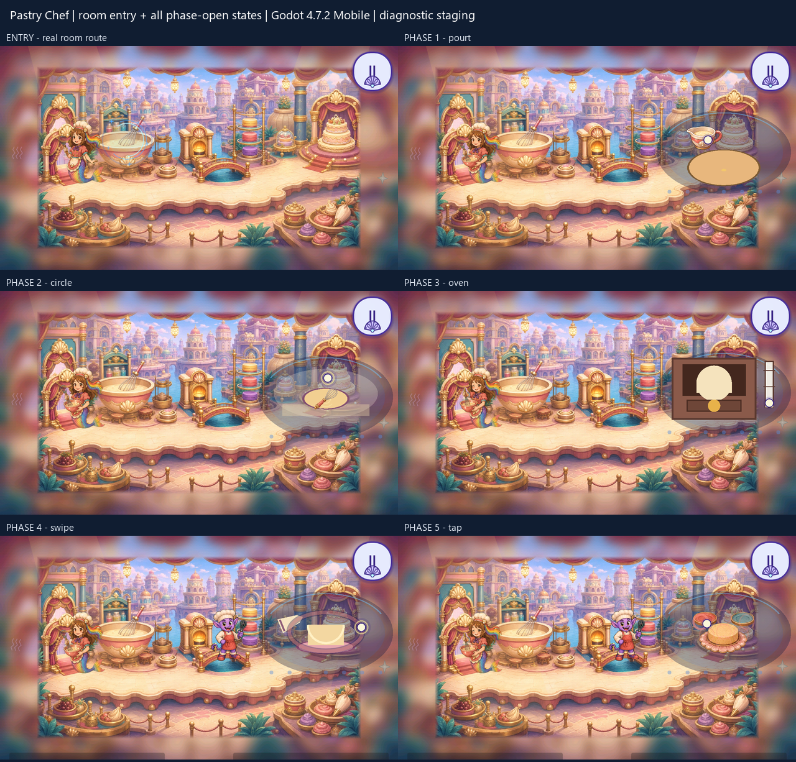

[Open full diagnostic sheet](opera_mechanics_2026-09-05/chef_sheet.png).

### Exact sequence and timing

1. **MIX — `pourt`, goal 5.0.** Tip sparkling batter into the bowl.
2. **STIR — `circle`, goal 2.0.** Two full credited revolutions.
3. **BAKE — `oven`, nominal goal 6.0.** Watch heat, then tap the mitt/handle.
4. **FROST — `swipe`, goal 6.0.** Follow one ordered frosting route.
5. **TOP — `tap`, goal 7.0.** Place seven toppings at seven distinct anchors.

The authoritative definitions are [scripts/opera_career_world_2d.gd:238-244](https://github.com/Ebonyks/mermaid-roshan-reef/blob/cc931b8f4e0849faa674b9ea4020d15c1b15e8d1/scripts/opera_career_world_2d.gd#L238), and the room route is bowl → bowl → oven → cake stage → cake stage ([scripts/opera_career_world_2d.gd:375-377](https://github.com/Ebonyks/mermaid-roshan-reef/blob/cc931b8f4e0849faa674b9ea4020d15c1b15e8d1/scripts/opera_career_world_2d.gd#L375)). The contest begins at FROST ([scripts/opera_career_world_2d.gd:355-370](https://github.com/Ebonyks/mermaid-roshan-reef/blob/cc931b8f4e0849faa674b9ea4020d15c1b15e8d1/scripts/opera_career_world_2d.gd#L355)).

**Code-derived timing:** MIX has a 0.8-second tilt-in; its fill then depends on declining reserve, so its ideal source-derived uninterrupted lower bound is about **10.4 seconds** including tilt, not a declared duration ([scripts/opera_gesture_surface.gd:6078-6126](https://github.com/Ebonyks/mermaid-roshan-reef/blob/cc931b8f4e0849faa674b9ea4020d15c1b15e8d1/scripts/opera_gesture_surface.gd#L6078)). STIR is two honest same-sign revolutions and rejects straight-center scrubbing ([scripts/opera_gesture_surface.gd:1181-1195](https://github.com/Ebonyks/mermaid-roshan-reef/blob/cc931b8f4e0849faa674b9ea4020d15c1b15e8d1/scripts/opera_gesture_surface.gd#L1181)). BAKE reaches earliest acceptable heat at 45% of an eight-second heat rise, **3.6 seconds**; the full-quality band extends through 80%, about **6.4 seconds**, while late removal remains safe at reduced quality ([scripts/opera_gesture_surface.gd:879-890,985-1010](https://github.com/Ebonyks/mermaid-roshan-reef/blob/cc931b8f4e0849faa674b9ea4020d15c1b15e8d1/scripts/opera_gesture_surface.gd#L879)). FROST's full authored path maps to all six goal units, so one successful continuous trace can finish it ([scripts/opera_gesture_surface.gd:1658-1691,1732-1778](https://github.com/Ebonyks/mermaid-roshan-reef/blob/cc931b8f4e0849faa674b9ea4020d15c1b15e8d1/scripts/opera_gesture_surface.gd#L1658)). TOP uses seven one-use anchors ([scripts/opera_gesture_surface.gd:286-297,2859-2890](https://github.com/Ebonyks/mermaid-roshan-reef/blob/cc931b8f4e0849faa674b9ea4020d15c1b15e8d1/scripts/opera_gesture_surface.gd#L286)). Add five 2.2-second completion holds, station travel, and human gesture time.

### Pros

- The verbs form a coherent transformation: liquid → mixed batter → baked cake → icing → authored placement.
- BAKE teaches anticipation without a fail state. A generous golden window rewards observation, and an overdone cake still completes.
- FROST is substantially better than a generic swipe: it requires ordered, corridor-bound movement with jump/reversal protection.
- Toppings use distinct anchors rather than accepting seven taps in one place, so the visible cake truthfully accumulates work.

### Cons

- MIX is an outlier. Its roughly 10.4-second best-case hold/tilt is nearly three times the explicit 3.6-3.8-second holds elsewhere and arrives as the first verb.
- The outcome is always the same cake. Topping locations are authored anchors, not composition choices.
- The active oven is a flat brown rectangle with simple circles beside an ornate painted oven landmark. The fresh BAKE frame confirms a substantial illustration-quality drop and a loss of object continuity; this is not merely a suspected code-rendering issue.
- A free-play interruption before the final curtain call loses all five-phase position; an interruption in MIX loses its entire fill.

### Prioritized improvements

1. **P1:** tune MIX to a measured 4.5-6-second continuous completion or split its feedback into five visible pours that each bank. This preserves the “pour” fiction and makes interruption less costly.
2. **P1:** checkpoint completed phases in free-play.
3. **P2:** offer two or three child-selected topping palettes/layout zones, with every selection changing the final cake and curtain-call prop.
4. **P2:** replace only the active code-drawn bowl/oven roles with isolated painted-state cutouts, preserving the existing heat and fill logic.

**Closest official comparator:** [Toca Boca Jr / Toca Kitchen 2](https://play.google.com/store/apps/details?hl=en_US&id=com.tocaboca.tocakitchen2) advertises multiple ingredients/tools, combinations, and guest reactions without rules or stress. The useful gap is not more steps; it is expressive combinations and visible character reactions. Its tutorial length and exact action timing are unknown.

### Observed room art and scene integration

Pros: The richest room composition in the set. The live frame has an immediate left-to-right read: mixing bowl, oven, display racks, bridge, and celebration cake. The bowl and cake are oversized enough for a one-finger child, while the city beyond gives the work area depth. Roshan's chef costume has a clean silhouette and her warm colors separate from the lavender/pink room. The source card, runtime painting, and actor agree on a single light direction.

Cons: The lower foreground has many small bowls, fruit trays, ropes, and plants; at phone size it becomes decorative noise around the actual phase stations. Roshan overlaps the left edge of the mixing bowl, and the shared blue gesture ring partly cuts across the bowl rim. The spotlight wedge and blurred border are obvious against the otherwise polished room.

Improve: Keep the approved painting. Add a quiet value break or small clear floor island behind the active bowl/oven/cake station and place the input cue inside that island. Audit the baked cake against the separate goal_chef prop at every phase so the prop changes state without a duplicate cake.

## Detective — 4.0/5

**Room composition: 3.0/5.** Overall includes the mechanic, teaching, persistence and visible activity limitations described here.

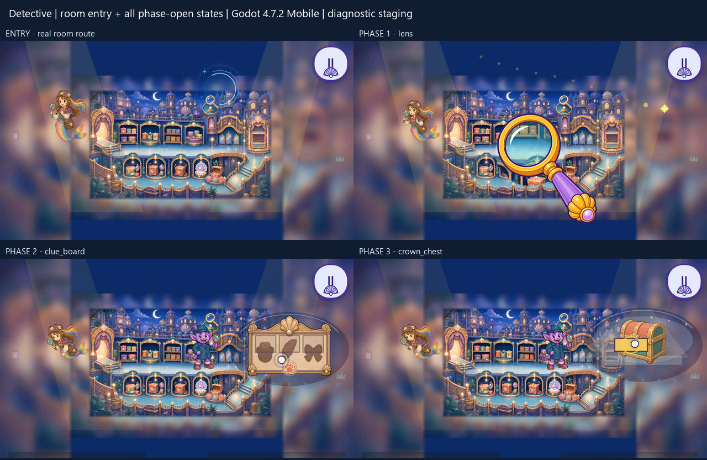

[Open full diagnostic sheet](opera_mechanics_2026-09-05/detective_sheet.png).

### Exact sequence and timing

1. **SEARCH — lens, goal 3.** Sweep the room and dwell on three clues.
2. **CASE BOARD — clue board, goal 3.** Drag three ordered clue tokens to silhouettes.
3. **CROWN — crown chest, goal 1.** Tap the handle/answer under the spotlight.

Definitions: [scripts/opera_career_world_2d.gd:245-249](https://github.com/Ebonyks/mermaid-roshan-reef/blob/cc931b8f4e0849faa674b9ea4020d15c1b15e8d1/scripts/opera_career_world_2d.gd#L245); stations: magnifier tower → evidence shelves → treasure dais ([scripts/opera_career_world_2d.gd:377](https://github.com/Ebonyks/mermaid-roshan-reef/blob/cc931b8f4e0849faa674b9ea4020d15c1b15e8d1/scripts/opera_career_world_2d.gd#L377)). The contest/finale starts at CASE BOARD ([scripts/opera_career_world_2d.gd:355-370](https://github.com/Ebonyks/mermaid-roshan-reef/blob/cc931b8f4e0849faa674b9ea4020d15c1b15e8d1/scripts/opera_career_world_2d.gd#L355)).

**Code-derived timing:** the one-time theft/instruction presentation totals **6.6 seconds** (2.8 + 3.8), though task interaction is not proven to be blocked for its full length ([scripts/opera_career_world_2d.gd:41-44,3872-3914](https://github.com/Ebonyks/mermaid-roshan-reef/blob/cc931b8f4e0849faa674b9ea4020d15c1b15e8d1/scripts/opera_career_world_2d.gd#L41)). Each clue requires a **0.45-second dwell**, so fixed dwell alone is 1.35 seconds plus lens travel ([scripts/opera_career_world_2d.gd:4035-4067](https://github.com/Ebonyks/mermaid-roshan-reef/blob/cc931b8f4e0849faa674b9ea4020d15c1b15e8d1/scripts/opera_career_world_2d.gd#L4035)). After **12 seconds** without a find, one remaining clue glistens and the prompt repeats ([scripts/opera_career_world_2d.gd:29-35,4015-4034](https://github.com/Ebonyks/mermaid-roshan-reef/blob/cc931b8f4e0849faa674b9ea4020d15c1b15e8d1/scripts/opera_career_world_2d.gd#L29)). Board mismatches return over **0.38 seconds** with no loss ([scripts/opera_gesture_surface.gd:3421-3499](https://github.com/Ebonyks/mermaid-roshan-reef/blob/cc931b8f4e0849faa674b9ea4020d15c1b15e8d1/scripts/opera_gesture_surface.gd#L3421)). The chest succeeds on one generous handle touch; its open crossfade continues for roughly 0.44 seconds during the completion hold ([scripts/opera_gesture_surface.gd:3584-3615](https://github.com/Ebonyks/mermaid-roshan-reef/blob/cc931b8f4e0849faa674b9ea4020d15c1b15e8d1/scripts/opera_gesture_surface.gd#L3584)).

### Pros

- SEARCH uniquely makes the painted room the play surface. Nearby decorative objects shimmer and react, giving the flat scene spatial depth and interpretive purpose.
- Three clue dwell points, a trail to the next clue, and a 12-second escalation balance exploration with support.
- The ghost lens cannot score, preserving interaction truth.
- CASE BOARD is a real object-to-destination drag with smooth, no-loss correction.

### Cons

- Fresh entry and phase views show a substantially reduced central scene with navy upper/lower bands and blurred outer material. Roshan enters outside the convincing painted room. This is a framing/contact defect as well as a contrast problem; the underlying scene and lens mechanic deserve a larger coherent playable field.

- The clue set/order is deterministic. Re-entry and replay teach coordinates rather than observation.
- Board matches are silhouettes in a fixed order; the player need not infer a relationship between evidence pieces.
- The crown resolution is a single highlighted tap after much richer mechanics, so the payoff is mechanically anticlimactic.
- The 6.6-second opening may overlap an already-active search; runtime/audio capture is required to confirm whether instruction and agency compete.

### Prioritized improvements

1. **P1:** repair the scene source/crop and route-entry contact alongside Nursery, preserving the existing lens-to-room coordinate mapping. Then choose three clues from a larger authored set and generate the trail only after initial exploration or assist time.
2. **P1:** make the board spatially semantic: match footprint to shoe, ribbon to costume, or jewel shape to socket, with the first pair demonstrated.
3. **P2:** let the crown finale require a short evidence-confirmation gesture, such as selecting the matched crest and then opening the chest.
4. **P2:** broaden ordinary room-object reactions, following the existing 0.55-second reaction cooldown ([scripts/opera_career_world_2d.gd:3962-3991](https://github.com/Ebonyks/mermaid-roshan-reef/blob/cc931b8f4e0849faa674b9ea4020d15c1b15e8d1/scripts/opera_career_world_2d.gd#L3962)), to reward curiosity without scoring it.

**Closest official comparators:** [Pango Hide & Seek](https://play.google.com/store/apps/details?id=air.com.studiopango.pangoWhereAreYou) advertises no-stress interactive scenes where children look, touch, move, open, and lift objects across 15+ worlds. [Hidden Folks](https://play.google.com/store/apps/details?hl=en_US&id=com.adriaandejongh.hiddenfolks) advertises hundreds of interactive details and target hints. Roshan already matches their no-fail spirit; it needs clue-set variation and more meaningful environment reactions. Tutorial duration and exact hint timing for both comparators are unknown.

### Observed room art and scene integration

Pros: The night palette is distinctive and the room tells a clear story: clue boxes, shelves, bridge, clock/magnifier, and the final chest. The moon and lanterns make the room feel like a real place rather than a widget backdrop. The magnifier costume is an especially strong job read. The route capture shows the lens cue placed above the painted magnifier tower, with the glass aligned to authored lens geometry (scripts/opera_career_world_2d.gd:25-31).

Cons: The convincing painted room occupies a small central window, with large navy bands and blurred outer material; entry Roshan floats outside its left edge. It is also the darkest painterly room. Blue-on-blue shelves and small clue boxes lose value separation, and the large blue spotlight wedge fights the night lighting. The density that makes the case fun also makes the valid clue targets compete with decorative boxes. The blurred border is noticeable and feels like an unrelated enlargement of the room.

Improve: First reconstruct a coherent full-frame source/crop and register entry Roshan to its floor; do not stretch the smaller room. Preserve the night mood but lift clue-bearing shelves, chest, and footprints by one broad lavender/aqua value band. Use the existing magnifier screen-space zoom; do not add bright rings to every object. Reserve the glow for the active clue and ensure the painted magnifier tower is not duplicated by the animated lens prop.

## Ballerina — 4.1/5

**Room composition: 4.4/5.** Overall includes the mechanic, teaching, persistence and visible activity limitations described here.

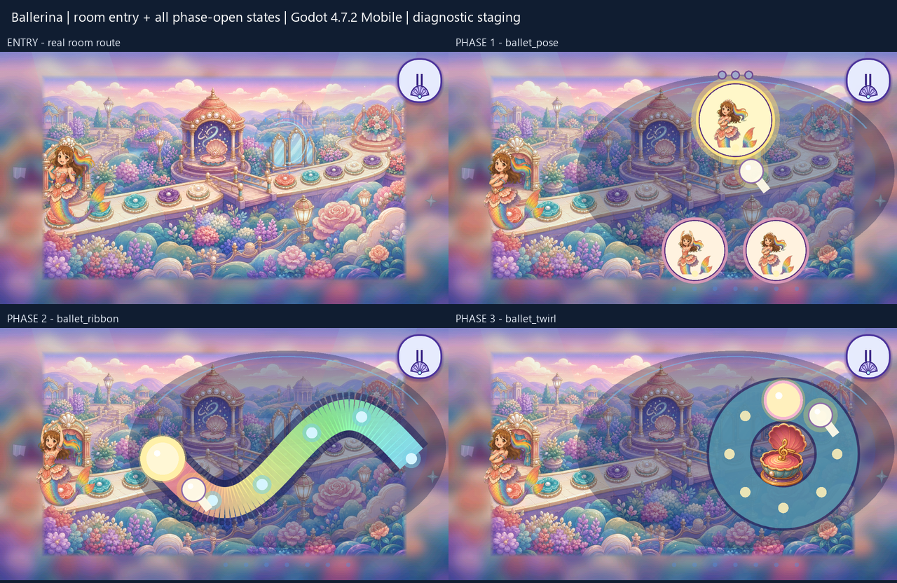

[Open full diagnostic sheet](opera_mechanics_2026-09-05/ballerina_sheet.png).

### Exact live sequence and timing

1. **PEARL MIRROR** — `ballet_pose`, three completed pose rounds.
2. **RIBBON TRAIL** — `ballet_ribbon`, one complete path.
3. **GRAND TWIRL** — `ballet_twirl`, one complete orbit.

The shipping phase authority is [scripts/opera_career_world_2d.gd:250-253](https://github.com/Ebonyks/mermaid-roshan-reef/blob/cc931b8f4e0849faa674b9ea4020d15c1b15e8d1/scripts/opera_career_world_2d.gd#L250); the stations are the trifold mirror, wave tuffets, and rose finale stage ([scripts/opera_career_world_2d.gd:378](https://github.com/Ebonyks/mermaid-roshan-reef/blob/cc931b8f4e0849faa674b9ea4020d15c1b15e8d1/scripts/opera_career_world_2d.gd#L378)). This is a recital rather than a rival contest; the rival remains hidden at the curtain call ([scripts/opera_career_world_2d.gd:3427-3430](https://github.com/Ebonyks/mermaid-roshan-reef/blob/cc931b8f4e0849faa674b9ea4020d15c1b15e8d1/scripts/opera_career_world_2d.gd#L3427)).

The pose watch demonstration lasts 2.15 seconds; ribbon and twirl demonstrations use 1.55-second action cycles. First and strong assistance arrive after five and ten seconds of child-turn inactivity ([scripts/opera_ballet_surface.gd:18-41](https://github.com/Ebonyks/mermaid-roshan-reef/blob/cc931b8f4e0849faa674b9ea4020d15c1b15e8d1/scripts/opera_ballet_surface.gd#L18), [scripts/opera_ballet_surface.gd:247-274](https://github.com/Ebonyks/mermaid-roshan-reef/blob/cc931b8f4e0849faa674b9ea4020d15c1b15e8d1/scripts/opera_ballet_surface.gd#L247)). The Mirror blocks input during its initial demonstration and then emits a ready event so the shorter “your turn” voice can play alone ([scripts/opera_ballet_surface.gd:314-327](https://github.com/Ebonyks/mermaid-roshan-reef/blob/cc931b8f4e0849faa674b9ea4020d15c1b15e8d1/scripts/opera_ballet_surface.gd#L314); [scripts/opera_career_world_2d.gd:3016-3020](https://github.com/Ebonyks/mermaid-roshan-reef/blob/cc931b8f4e0849faa674b9ea4020d15c1b15e8d1/scripts/opera_career_world_2d.gd#L3016)). This is the best tutorial sequencing in the audited group: watch, clear handoff, act.

Pose options progress from two choices to three and three. Wrong choices replay the unresolved example; two wrong actions raise assistance. At assistance level one the answer glows; at level two the correct pose grows 10% and alternatives dim ([scripts/opera_ballet_surface.gd:293-311](https://github.com/Ebonyks/mermaid-roshan-reef/blob/cc931b8f4e0849faa674b9ea4020d15c1b15e8d1/scripts/opera_ballet_surface.gd#L293), [scripts/opera_ballet_surface.gd:407-430](https://github.com/Ebonyks/mermaid-roshan-reef/blob/cc931b8f4e0849faa674b9ea4020d15c1b15e8d1/scripts/opera_ballet_surface.gd#L407), [scripts/opera_ballet_surface.gd:567-588](https://github.com/Ebonyks/mermaid-roshan-reef/blob/cc931b8f4e0849faa674b9ea4020d15c1b15e8d1/scripts/opera_ballet_surface.gd#L567)). Ribbon input must start at the current leading pearl, stay in a wide corridor, and only forward progress banks ([scripts/opera_ballet_surface.gd:433-468](https://github.com/Ebonyks/mermaid-roshan-reef/blob/cc931b8f4e0849faa674b9ea4020d15c1b15e8d1/scripts/opera_ballet_surface.gd#L433)). Twirl accepts either initial direction, locks that direction, and ignores reversals or discontinuous jumps without erasing progress ([scripts/opera_ballet_surface.gd:494-548](https://github.com/Ebonyks/mermaid-roshan-reef/blob/cc931b8f4e0849faa674b9ea4020d15c1b15e8d1/scripts/opera_ballet_surface.gd#L494)).

### Pros

- The sequence increases motor complexity cleanly: discrete visual match, constrained tracing, then continuous circular control.
- Every input rule is represented by the same geometry used for painting, hit-testing, ghost demonstration, and progress. This avoids the common “finger appears correct but collision says wrong” defect.
- Error handling is exemplary for the audience. Accepted work is banked; only the unfinished round/path/orbit is retaught.
- The lush rehearsal-garden master is unusually strong: mirrors, tuffets, bandstand, bridge, and finale rose create a believable journey rather than three menu cards. The specialist surface reuses the Roshan pose atlas inside pearl/shell framing, keeping identity stable while making poses large enough to compare.
- No generic backing card is drawn; the action grows from a named room landmark. Navy/purple outlines, coral/teal/gold accents, shell frames, and the authored world are coherent.

### Cons

- The interaction represents ballet through portraits, a pearl trace, and a shell orbit. It teaches fine-motor grammar more strongly than full-body rhythm or timing. Roshan's pose changes help, but Ribbon and Twirl do not ask the child to follow a short visible movement phrase.
- Intermediate completion hold time is computed from the longest Ballet voice across the phase set rather than the current phase clip ([scripts/opera_career_world_2d.gd:346-353](https://github.com/Ebonyks/mermaid-roshan-reef/blob/cc931b8f4e0849faa674b9ea4020d15c1b15e8d1/scripts/opera_career_world_2d.gd#L346), then used at `3058-3066`). A short completed action can therefore wait for unrelated longer VO, making the recital feel sticky.
- The illustrated background is very dense. Hotspot glow and specialist zoom solve most of the readability risk, but the trifold mirror competes with other tall arches at a glance.
- **Chapter 2 blocks after one Ribbon/Twirl traversal.** Its Stuffies phases use goals 6.0 and 2.0 ([scripts/chapter_two_career_scene_adapter.gd:32-35](https://github.com/Ebonyks/mermaid-roshan-reef/blob/cc931b8f4e0849faa674b9ea4020d15c1b15e8d1/scripts/chapter_two_career_scene_adapter.gd#L32)). The specialist emits at most 1.0 total normalized path/orbit progress, then marks the local mode complete and blocks further input ([scripts/opera_ballet_surface.gd:282-289](https://github.com/Ebonyks/mermaid-roshan-reef/blob/cc931b8f4e0849faa674b9ea4020d15c1b15e8d1/scripts/opera_ballet_surface.gd#L282), `314-316`, `433-468`). The world divides that single unit by the external goal and waits for 6.0/2.0 ([scripts/opera_career_world_2d.gd:3037-3057](https://github.com/Ebonyks/mermaid-roshan-reef/blob/cc931b8f4e0849faa674b9ea4020d15c1b15e8d1/scripts/opera_career_world_2d.gd#L3037)). Free-play goals of 1.0 are correct; Chapter 2 is not.
- Chapter 2 Stuffies Mirror has an empty `vo` key and a specialist after-demo fallback. Audit the actual initial prompt and after-demo clip together; the empty key alone does not prove total silence or sufficient spoken teaching.

### Prioritized improvements

1. **P0 — Fix Chapter 2 Ballet's unit contract.** Set Stuffies Ribbon and Bow goals to 1.0, or explicitly make the specialist support repeat-count goals. Add a probe that performs one valid full path/orbit and asserts phase completion.
2. **P1 — Use the current phase's voice duration for the intermediate hold**, clamped to a child-friendly ceiling. Preserve the final 2.2-second picture.
3. **P1 — Add one short “phrase” finale** using the already-shown pose bands: pose cue, half-ribbon arc, full twirl, with each completed component banked. It would turn mastered gestures into a recital without introducing failure.
4. **P2 — Reduce hotspot competition** by locally dimming distant arches/flowers while the active station breathes, rather than altering the approved master.

**Closest official comparator evidence:** [Move Ballerina](https://play.google.com/store/apps/details?id=com.sunstorm.ballerinalife3d) advertises dragging limbs into positions, starting with simple stretches and building to stage performance. Its older-audience 3D presentation is not an art model for this game. The transferable pattern is direct movement-to-pose causality and a performance payoff; exact correction/tutorial timings are unknown.

### Observed room art and scene integration

Pros: A graceful, open garden path with large pearl dance pads, mirrors, and a central shell bandstand. The long S-curve gives the ribbon and travel phase an obvious visual route. Roshan's coral costume and rainbow tail read cleanly against the pastel landscape. The source master and runtime route frame have excellent calm clusters rather than evenly distributed clutter.

Cons: The central stage and mirrors are visually close in value, and the repeated round pads can read as decoration before the first cue. Roshan's tail and the left pad occupy the same small region. The shared spotlight polygon is more visible here than the authored light and slightly damages the soft garden atmosphere.

Improve: Use a single animated pearl step as the active landmark and keep other pads quiet. Give the active ribbon a warm highlight that follows the painted path, preserving the authored shell and flower contours. Keep the current specialist posed atlas and avoid replacing it with generic dance animation.

## Candy Maker — 4.1/5

**Room composition: 4.3/5.** Overall includes the mechanic, teaching, persistence and visible activity limitations described here.

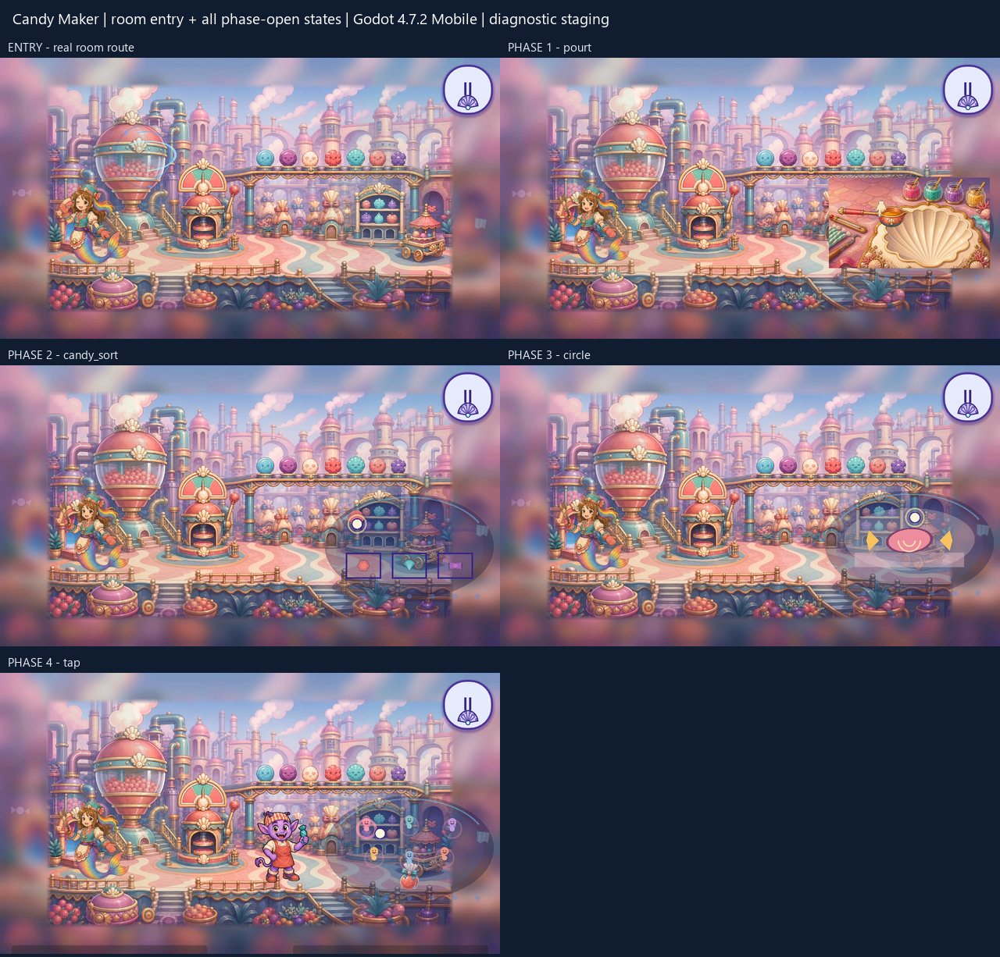

[Open full diagnostic sheet](opera_mechanics_2026-09-05/candymaker_sheet.png).

### Exact sequence and timing

1. **SYRUP — `pourt`, goal 5.** Tilt into the mold.
2. **SORT — specialist sort, goal 6.** Drag six pieces into matching shape bins.
3. **WRAP — circle, goal 1.8.** Complete 1.8 credited revolutions.
4. **SHARE — anchored tap, goal 6.** Give one candy to each recipient.

Definitions: [scripts/opera_career_world_2d.gd:255-260](https://github.com/Ebonyks/mermaid-roshan-reef/blob/cc931b8f4e0849faa674b9ea4020d15c1b15e8d1/scripts/opera_career_world_2d.gd#L255); stations: vat → press → cottage → cart ([scripts/opera_career_world_2d.gd:379](https://github.com/Ebonyks/mermaid-roshan-reef/blob/cc931b8f4e0849faa674b9ea4020d15c1b15e8d1/scripts/opera_career_world_2d.gd#L379)). Contest starts at SHARE ([scripts/opera_career_world_2d.gd:355-370](https://github.com/Ebonyks/mermaid-roshan-reef/blob/cc931b8f4e0849faa674b9ea4020d15c1b15e8d1/scripts/opera_career_world_2d.gd#L355)).

**Code-derived timing:** Candy's specialist pour declares **3.0 seconds** of fill plus tilt, documented as about **3.5 seconds** total ([scripts/opera_gesture_surface.gd:124,6103-6106](https://github.com/Ebonyks/mermaid-roshan-reef/blob/cc931b8f4e0849faa674b9ea4020d15c1b15e8d1/scripts/opera_gesture_surface.gd#L124)). SORT uses the fixed sequence `[0,1,2,2,0,1]`; the live piece drifts and loops without penalty until grabbed, while wrong bins return the same piece ([scripts/opera_gesture_surface.gd:169-180,4507-4571](https://github.com/Ebonyks/mermaid-roshan-reef/blob/cc931b8f4e0849faa674b9ea4020d15c1b15e8d1/scripts/opera_gesture_surface.gd#L169)). WRAP requires 1.8 real revolutions. SHARE uses six distinct one-use anchors rather than six taps on one target ([scripts/opera_gesture_surface.gd:286-297,2859-2890](https://github.com/Ebonyks/mermaid-roshan-reef/blob/cc931b8f4e0849faa674b9ea4020d15c1b15e8d1/scripts/opera_gesture_surface.gd#L286)).

### Pros

- SYRUP is the most polished full-bleed specialist card among these seven, with explicit vessel/mold/lip geometry and a short, legible fill.
- SORT requires shape discrimination and direct manipulation; errors preserve the current candy.
- The four phases describe an understandable production-to-social-delivery arc.
- SHARE depicts recipients responding to the child's placement, providing an emotional endpoint.

### Cons

- Every replay uses the same six-piece sort order and the same mold/product.
- WRAP is a generic circular quota; it does not distinguish left/right wrapper ends or create varied packages.
- Recipient faces and hands are code-drawn, which likely undershoots the full-bleed syrup art and painted candy town.
- There is no ingredient, flavor, mold, wrapper, or recipient choice despite a “workshop” premise.

### Prioritized improvements

1. **P1:** randomize the six-piece order while retaining one highlighted first match and never removing accepted pieces.
2. **P1:** let the child choose one of three flavor colors and one of three molds before pouring; propagate those choices through SORT, WRAP, SHARE, and the finale prop.
3. **P2:** turn WRAP into two forgiving end twists or one trace that visibly tightens an authored wrapper, rather than an abstract revolution counter.
4. **P2:** provide painted isolated recipient/hand states consistent with the city art.

**Closest official comparator:** [Little Panda's Candy Shop](https://play.google.com/store/apps/details?hl=en_US&id=com.sinyee.babybus.candy) advertises ingredient choice, machines, ten molds, packaging, selling, and customer outcomes. Roshan's four verbs are more compact and likely better suited to a short session; adding one meaningful product choice would capture much of the comparator's replay value without its breadth. Tutorial duration and phase timings are unknown.

### Observed room art and scene integration

Pros: Excellent job specificity. The large glass candy vat, color row, syrup press, bag shelves, and parade cart all support the mechanic without text. The palette is warm and inviting, and the live Roshan cutout's cap, apron, and colored gloves are legible. The room has a strong horizontal conveyor read that helps pour, sort, wrap, and share feel like one job.

Cons: Pipes, chimneys, glass, candies, and repeated arches produce a high-detail wall behind the active objects. The factory is bright enough that the gesture ring can disappear over pale candy or steam. The cart is narrow compared with the vat and press, so the share phase may have less immediate visual weight.

Improve: Keep the room but reserve a slightly darker aqua value behind the active station. Scale the live cart prop only within the painted cart footprint; do not add a second cart over the background. Make pour fill and wrap progress use the existing candy material colors, not generic blue progress effects.

## Stuffie Surgeon — 3.6/5

**Room composition: 4.3/5.** Overall includes the mechanic, teaching, persistence and visible activity limitations described here.

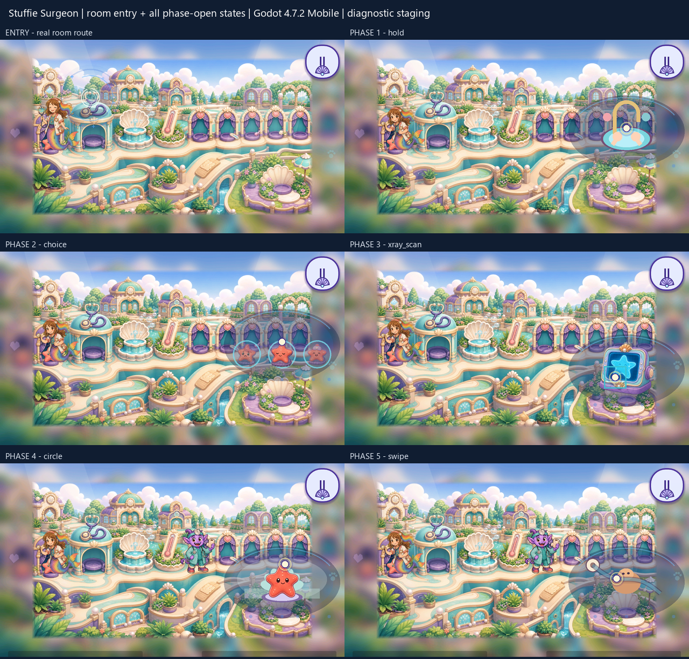

[Open full diagnostic sheet](opera_mechanics_2026-09-05/doctor_sheet.png).

### Exact sequence and timing

1. **WASH — hold, 3.6.** Hold the basin for 3.6 real seconds.
2. **FIND — choice, goal 4.** Tap four successive plushies with a glowing ouch.
3. **X-RAY — specialist scan, goal 2.** Drag a scanner over two ordered sore spots.
4. **CAST — circle, goal 1.8.** Wrap 1.8 revolutions around the patient.
5. **BANDAGE — authored swipe, goal 5.** Follow one ordered bandage route.

Definitions: [scripts/opera_career_world_2d.gd:261-267](https://github.com/Ebonyks/mermaid-roshan-reef/blob/cc931b8f4e0849faa674b9ea4020d15c1b15e8d1/scripts/opera_career_world_2d.gd#L261); stations: clinic → triage → exam → exam → recovery ([scripts/opera_career_world_2d.gd:380](https://github.com/Ebonyks/mermaid-roshan-reef/blob/cc931b8f4e0849faa674b9ea4020d15c1b15e8d1/scripts/opera_career_world_2d.gd#L380)). Contest starts at CAST ([scripts/opera_career_world_2d.gd:355-370](https://github.com/Ebonyks/mermaid-roshan-reef/blob/cc931b8f4e0849faa674b9ea4020d15c1b15e8d1/scripts/opera_career_world_2d.gd#L355)).

**Code-derived timing:** WASH is an exact real-time 3.6-second hold because the world adds frame delta while held ([scripts/opera_career_world_2d.gd:4240-4249](https://github.com/Ebonyks/mermaid-roshan-reef/blob/cc931b8f4e0849faa674b9ea4020d15c1b15e8d1/scripts/opera_career_world_2d.gd#L4240)). FIND presents three lanes; the target is initially flashed for 1.4 seconds and reflashed for 1.2 seconds, but input is not required to wait for the flash ([scripts/opera_gesture_surface.gd:949-959](https://github.com/Ebonyks/mermaid-roshan-reef/blob/cc931b8f4e0849faa674b9ea4020d15c1b15e8d1/scripts/opera_gesture_surface.gd#L949)). X-RAY has two fixed ordered spots; any press can begin scanning, but a real drag of at least three pixels must cross the next spot within a generous scanner radius. Findings bank permanently for that phase and never time out ([scripts/opera_gesture_surface.gd:141-147,4232-4295](https://github.com/Ebonyks/mermaid-roshan-reef/blob/cc931b8f4e0849faa674b9ea4020d15c1b15e8d1/scripts/opera_gesture_surface.gd#L141)). CAST is 1.8 revolutions. BANDAGE's authored path maps one valid journey to all five units ([scripts/opera_gesture_surface.gd:1658-1691](https://github.com/Ebonyks/mermaid-roshan-reef/blob/cc931b8f4e0849faa674b9ea4020d15c1b15e8d1/scripts/opera_gesture_surface.gd#L1658)).

### Pros

- The sequence models hygiene, assessment, imaging, treatment, and aftercare in a safe order.
- WASH visibly fills/bubbles and does not accept a tap as a hold.
- X-RAY and BANDAGE require continuous movement; the ghost cannot complete them.
- CAST's patient and roll respond causally as wrap progress accumulates.

### Cons

- FIND is “tap the illuminated answer,” not examination or symptom recognition.
- X-RAY checks two hidden coordinates in fixed order. It creates search movement but little interpretation of an X-ray.
- CAST and BANDAGE are two successive wrapping gestures, reducing variety near the finale.
- The active wash basin/hands are code-drawn despite the premium clinic backdrop; Doctor's pale room also contains several similar booths, weakening station distinction.

### Prioritized improvements

1. **P1:** show a brief non-reading symptom animation—limp, loose seam, shiver—then ask the child to pick the matching plush without keeping the answer glowing. Re-enable the glow after a short idle assist.
2. **P1:** make X-RAY order-free and place one relevant bone/foreign object plus harmless decorative details; discovery should depend on inspection, not the next array index.
3. **P2:** replace either CAST or BANDAGE on replay with a distinct care action such as placing a patch, gently brushing, or choosing a comfort item.
4. **P2:** add two or three patient/condition combinations and show each recovered patient at the curtain call.

**Closest official comparator:** [Pepi Doctor](https://play.google.com/store/apps/details?id=com.pepiplay.pepidoctor) advertises three hand-drawn patients, five conditions, 20+ tools, an X-ray broken-bone activity, and no win/lose rules for ages 2-6. The useful lesson is patient/condition variation and visible tool causality. Its tutorial length and task timing are unknown.

### Observed room art and scene integration

Pros: Brightest, most child-safe clinical translation. The basin, starfish fountain, row of soft exam booths, thermometer, and shell recovery bed are instantly readable. The medical job is softened into plush care, exactly in the project's broad value-band style. Roshan's doctor coat and stethoscope are clear, and the room gives her a safe left-side entry.

Cons: The long row of identical teal booths dominates the middle and makes the individual patient/object states easy to lose. The lower bridge, pool, plants, and shells are attractive but compete with the phase targets. The scene is slightly flatter than Chef or Painter because most objects share the same cream/aqua value family.

Improve: Let the active booth or starfish gain a warm coral rim and dim only inactive booth interiors. Keep the row physically painted and pulse the exact booth rather than floating a new card. Keep X-ray and cast effects within the same soft, satin material language as the patient props.

## Farmer — 3.9/5

**Room composition: 4.2/5.** Overall includes the mechanic, teaching, persistence and visible activity limitations described here.

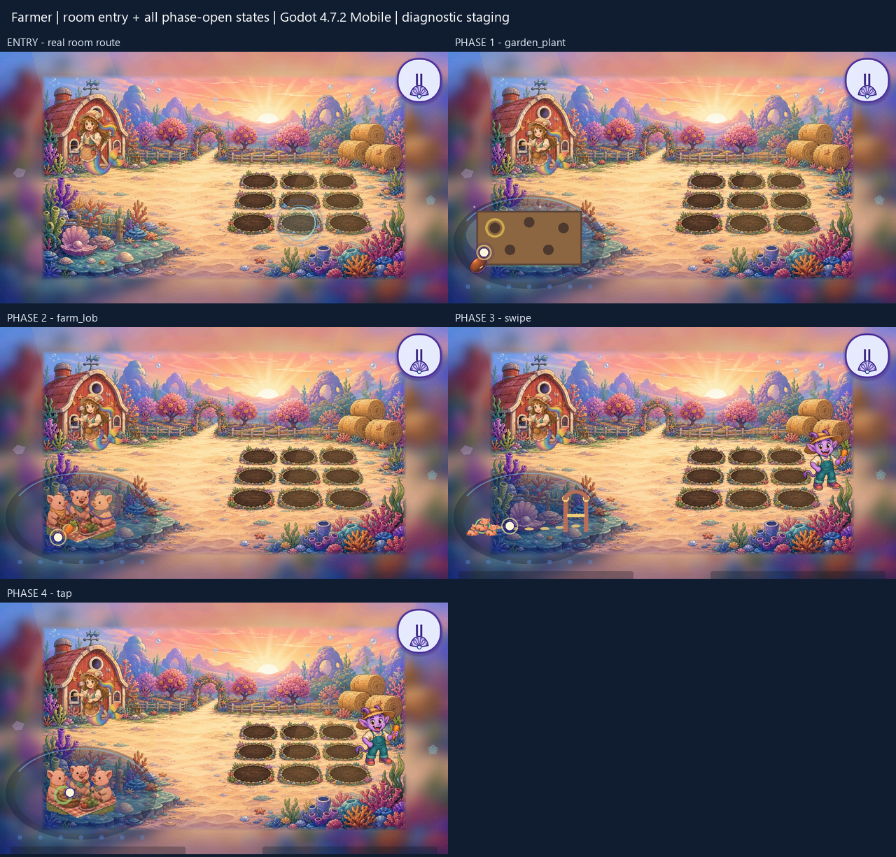

[Open full diagnostic sheet](opera_mechanics_2026-09-05/farmer_sheet.png).

### Exact sequence and timing

1. **PLANT — garden specialist, goal 5.** Plant five deterministic holes.
2. **TOSS — farm lob, goal 4.** Pull back and release four vegetables toward a pig.
3. **HERD — authored rightward swipe, goal 6.** Move a three-pig group through the gate in one complete lane journey.
4. **PICNIC — anchored tap, goal 3.** Place one snack by each pig.

Definitions: [scripts/opera_career_world_2d.gd:268-273](https://github.com/Ebonyks/mermaid-roshan-reef/blob/cc931b8f4e0849faa674b9ea4020d15c1b15e8d1/scripts/opera_career_world_2d.gd#L268); stations: seed beds → hay bales → barn doors → blossom arch ([scripts/opera_career_world_2d.gd:381](https://github.com/Ebonyks/mermaid-roshan-reef/blob/cc931b8f4e0849faa674b9ea4020d15c1b15e8d1/scripts/opera_career_world_2d.gd#L381)). Contest starts at HERD ([scripts/opera_career_world_2d.gd:355-370](https://github.com/Ebonyks/mermaid-roshan-reef/blob/cc931b8f4e0849faa674b9ea4020d15c1b15e8d1/scripts/opera_career_world_2d.gd#L355)).

**Code-derived timing:** PLANT has five exact normalized holes, and the code explicitly permits either dragging the live seed or directly tapping the glowing hole ([scripts/opera_gesture_surface.gd:260-266,3696-3753](https://github.com/Ebonyks/mermaid-roshan-reef/blob/cc931b8f4e0849faa674b9ea4020d15c1b15e8d1/scripts/opera_gesture_surface.gd#L260)). TOSS requires at least 11% of the smaller surface dimension in pull-back and alignment ≥0.55. Each flight lasts **0.9 seconds**, and the first three successes add **0.42 seconds** before reset, so animation alone contributes about **4.86 seconds** to four successful tosses ([scripts/opera_gesture_surface.gd:198-213,4844-4918](https://github.com/Ebonyks/mermaid-roshan-reef/blob/cc931b8f4e0849faa674b9ea4020d15c1b15e8d1/scripts/opera_gesture_surface.gd#L198)). Misses loop the vegetable back without consuming it. HERD maps one valid sweep from about 16% to 84% width to the entire six-unit goal ([scripts/opera_gesture_surface.gd:1505-1525](https://github.com/Ebonyks/mermaid-roshan-reef/blob/cc931b8f4e0849faa674b9ea4020d15c1b15e8d1/scripts/opera_gesture_surface.gd#L1505)). PICNIC has three distinct anchors ([scripts/opera_gesture_surface.gd:286-297](https://github.com/Ebonyks/mermaid-roshan-reef/blob/cc931b8f4e0849faa674b9ea4020d15c1b15e8d1/scripts/opera_gesture_surface.gd#L286)).

### Pros

- TOSS has the best physical feel potential: anticipation, release, parabolic travel, contact, pig reaction, and safe retry.
- HERD converts the quota into an authored spatial journey rather than six arbitrary swipes.
- PICNIC ends with care rather than competition and avoids same-spot mashing through anchors.
- Farmer's backdrop is among the clearest full scenes, with a natural path from beds to barn and picnic area.

### Cons

- Direct tap planting is an intentional accessible alternative to dragging. It should still visibly carry a seed into the hole so both controls preserve the planting fiction.
- The garden is a code-drawn plot with circle holes and stems; the transformation is clear but visually simpler than the surrounding world.
- TOSS repeats one target setup four times and does not meaningfully vary distance, food, or pig preference.
- The planted crop does not become the food being tossed or persist into the picnic, weakening continuity across the production chain.

### Prioritized improvements

1. **P1:** retain both direct tap and forgiving seed drag. On a tap, animate the same approved seed traveling to the selected hole, so accessibility does not weaken causality.
2. **P1:** carry crop identity through the run: planted color/shape becomes the tossed vegetable and picnic snack.
3. **P2:** vary pig position or preference across the four tosses while retaining generous alignment and return-on-miss.
4. **P2:** replace garden/gate ground with isolated painted states and retain code-owned progress/collision.

**Closest official comparator:** [Little Panda's Farm](https://play.google.com/store/apps/details?hl=en&id=com.sinyee.babybus.garden) advertises planting, watering/fertilizing/protecting crops, animal care, processing/selling produce, and many products. Roshan should remain shorter, but one visible crop-through-picnic continuity would make its four verbs feel like one system. Tutorial duration and action timing are unknown.

### Observed room art and scene integration

Pros: The cleanest objective layout. The barn, blossom arch, hay bales, and 3x3 soil beds are all large and separated; a child can understand where planting and feeding happen from the picture alone. Sunset lighting gives the scene a strong warm focal point and the farmer costume is highly legible.

Cons: The empty sand center is very large, while the actual soil beds occupy a small right-side block. The nine dark holes are visually similar and can look like holes in the stage rather than a sequence of safe targets. The rainbow coral foreground is beautiful but visually louder than the barn path.

Improve: Keep the 3x3 geometry but give the next bed a broad green rim and a single planted state, using the painted soil as the base. Keep the active area near the visual center during feeding and herding through the existing path anchors. Do not add floating green badges on top of the baked beds.

## Boxer — 4.4/5

**Room composition: 4.1/5.** Overall includes the mechanic, teaching, persistence and visible activity limitations described here.

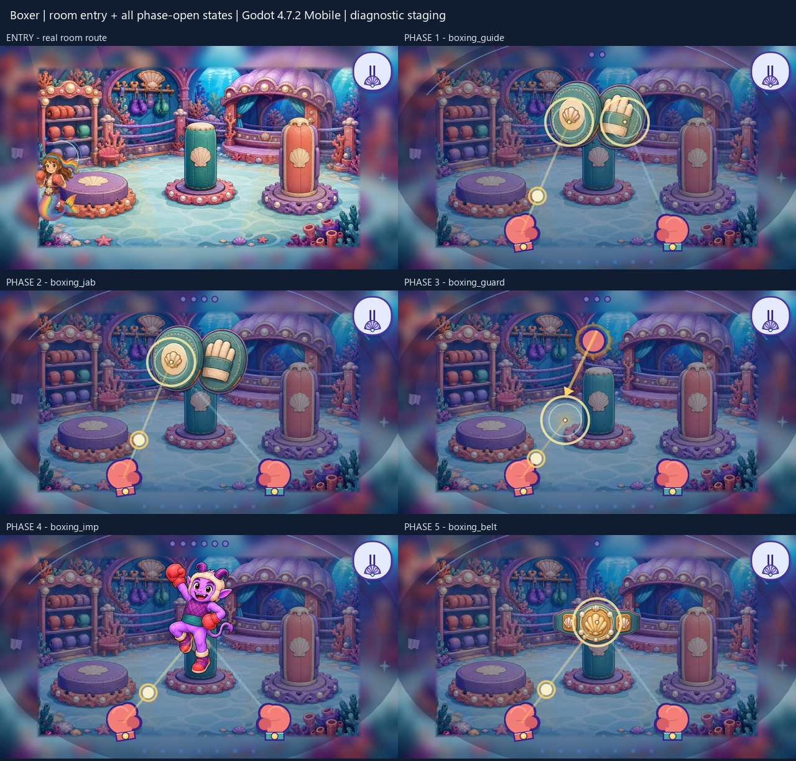

[Open full diagnostic sheet](opera_mechanics_2026-09-05/boxer_sheet.png).

### Exact live sequence and timing

1. **GLOVE GUIDE** — move both gloves, in either order, to their glowing mitts; goal 2.
2. **JAB PRACTICE** — four forward punches at changing pads; goal 4.
3. **SOFT GUARD** — place either glove in the alternating guard bubble for three checks; goal 3.
4. **TITLE IMP** — land six punches only during the bright recovery opening; goal 6.
5. **BELT** — one forward punch into the championship belt.

The phase authority is [scripts/opera_career_world_2d.gd:274-279](https://github.com/Ebonyks/mermaid-roshan-reef/blob/cc931b8f4e0849faa674b9ea4020d15c1b15e8d1/scripts/opera_career_world_2d.gd#L274); stations progress from glove wall to sparring mat, heavy bag, then pavilion ([scripts/opera_career_world_2d.gd:382](https://github.com/Ebonyks/mermaid-roshan-reef/blob/cc931b8f4e0849faa674b9ea4020d15c1b15e8d1/scripts/opera_career_world_2d.gd#L382)). The specialist uses two independently owned finger/glove controls and cancels touches if application focus is lost ([scripts/opera_boxing_surface.gd:409-478](https://github.com/Ebonyks/mermaid-roshan-reef/blob/cc931b8f4e0849faa674b9ea4020d15c1b15e8d1/scripts/opera_boxing_surface.gd#L409), `297-300`). A punch only counts after 62% forward travel in Guide/Belt or 70% in Jab/Imp ([scripts/opera_boxing_surface.gd:527-586](https://github.com/Ebonyks/mermaid-roshan-reef/blob/cc931b8f4e0849faa674b9ea4020d15c1b15e8d1/scripts/opera_boxing_surface.gd#L527)).

The ghost loop is 2.4 seconds and alternates hands over 4.8 seconds ([scripts/opera_boxing_surface.gd:832-852](https://github.com/Ebonyks/mermaid-roshan-reef/blob/cc931b8f4e0849faa674b9ea4020d15c1b15e8d1/scripts/opera_boxing_surface.gd#L832)). Assistance begins at five seconds and strengthens at ten, widening each target by 18 pixels per level ([scripts/opera_boxing_surface.gd:21-24](https://github.com/Ebonyks/mermaid-roshan-reef/blob/cc931b8f4e0849faa674b9ea4020d15c1b15e8d1/scripts/opera_boxing_surface.gd#L21), `303-329`, `599-600`). Guard checks every 3.2 seconds; assistance adds 0.7 seconds ([scripts/opera_boxing_surface.gd:343-363](https://github.com/Ebonyks/mermaid-roshan-reef/blob/cc931b8f4e0849faa674b9ea4020d15c1b15e8d1/scripts/opera_boxing_surface.gd#L343)). The Title Imp cycles through 1.15-second windup, 0.38-second charge, 1.7-second open/recovery, and 0.85-second guard; assistance adds 0.45 seconds to windup and 0.5 to recovery ([scripts/opera_boxing_surface.gd:366-390](https://github.com/Ebonyks/mermaid-roshan-reef/blob/cc931b8f4e0849faa674b9ea4020d15c1b15e8d1/scripts/opera_boxing_surface.gd#L366)). Punching a closed guard bounces harmlessly and restarts the demo ([scripts/opera_boxing_surface.gd:544-572](https://github.com/Ebonyks/mermaid-roshan-reef/blob/cc931b8f4e0849faa674b9ea4020d15c1b15e8d1/scripts/opera_boxing_surface.gd#L544)). Friendly hits change only short-lived sound/FX; they never remove progress ([scripts/opera_boxing_surface.gd:167-176](https://github.com/Ebonyks/mermaid-roshan-reef/blob/cc931b8f4e0849faa674b9ea4020d15c1b15e8d1/scripts/opera_boxing_surface.gd#L167)).

### Pros

- This is a real mechanic progression, not five reskins: reach, aim, defend, read a telegraph, celebrate.
- Two glove ownership supports either one finger or opportunistic two-finger play without requiring multitouch.
- The Title Imp has excellent anticipatory timing. Windup, charge, recovery star, and guard make “when to punch” readable while every mistake remains playful.
- The illustrated underwater gym is compositionally excellent. Glove shelves, low mats, two kinds of heavy bag, bell tower, and pavilion are distinct by silhouette and value. The walk through them tells a training story.
- First-person gloves are a good flat-art-to-scene interpretation: they keep the opponent and environment visible and make the finger feel embodied. Target halos and short impact puffs are legible on the dense master.

### Cons

- Six Title openings can become repetitive. Even under clean play, each accepted punch is separated by recovery/guard/windup state, so the finale's dramatic peak is also its longest repeated loop.
- Dominant gloves are code-drawn circles/polygons while the room, opponent, belt, mitts, and puffs are painted assets ([scripts/opera_boxing_surface.gd:613-801](https://github.com/Ebonyks/mermaid-roshan-reef/blob/cc931b8f4e0849faa674b9ea4020d15c1b15e8d1/scripts/opera_boxing_surface.gd#L613)). The palette is consistent, but texture, line variation, and volume are visibly flatter than the master art.
- The first-person switch hides the full Roshan actor after the station opens ([scripts/opera_career_world_2d.gd:2390-2393](https://github.com/Ebonyks/mermaid-roshan-reef/blob/cc931b8f4e0849faa674b9ea4020d15c1b15e8d1/scripts/opera_career_world_2d.gd#L2390)). It improves control clarity but loses some costume-performance payoff until the curtain.
- No bespoke Chapter 2 Boxer phase set exists ([scripts/chapter_two_career_scene_adapter.gd:54](https://github.com/Ebonyks/mermaid-roshan-reef/blob/cc931b8f4e0849faa674b9ea4020d15c1b15e8d1/scripts/chapter_two_career_scene_adapter.gd#L54)), so any Chapter 2 route inherits the shipping sequence rather than adapting it to the birthday story.

### Prioritized improvements

1. **P1 — Vary the six Title openings without adding failure:** alternate left/right recovery star, high/low safe target, and a double-open on the last beat. Preserve the same generous windows.
2. **P1 — Derive two painted glove cutouts from approved Boxer art** and keep the current vector shapes as collision/fallback only. Match the master’s navy outline, coral value bands, and soft highlight texture.
3. **P2 — Show Roshan in a small diegetic mirror or shadow during first-person play** so costume identity persists without shrinking the hit area.
4. **P2 — Give Chapter 2 a three-beat friendly-bout cut** (Guide, Guard, shorter Title) if that story scene becomes user-facing.

**Closest official comparator evidence:** [Fiete Sports](https://play.google.com/store/apps/details?id=com.ahoiii.FieteSports) includes boxing in an illustrated sports collection with expressive animation and medals. Its public description does not establish exact boxing controls or tutorial timing, so no control-level superiority is claimed. It supports the broader comparison of sport-specific verbs within one coherent illustrated shell.

### Observed room art and scene integration

Pros: Strong specialist room with a readable padded ring, glove shelf, hanging gloves, and two upright training pads. The shell/brass trim makes it belong to the Opera family while the cool floor gives the boxer costume contrast. The route frame has a clear left-side Roshan and enough open floor for touch input.

Cons: The upper shelf and hanging gloves are close in hue to the ring ropes, so the scene can become a wall of purple/teal. The tall center and right pads are large but visually similar; the active target needs a reliable state cue. The shared spotlight wedge is most disruptive against the cyan floor.

Improve: Keep the two-glove specialist geometry and reuse approved painted glove artwork where available and give the active pad a warm lit-edge state with a softer, short-lived contact flash. Maintain a clear feet zone below the pads for the one-finger interpretation. Audit the painted ring ropes against glove animation so no glove appears to pass behind a baked rope incorrectly.

## Magician — 3.7/5

**Room composition: 4.6/5.** Overall includes the mechanic, teaching, persistence and visible activity limitations described here.

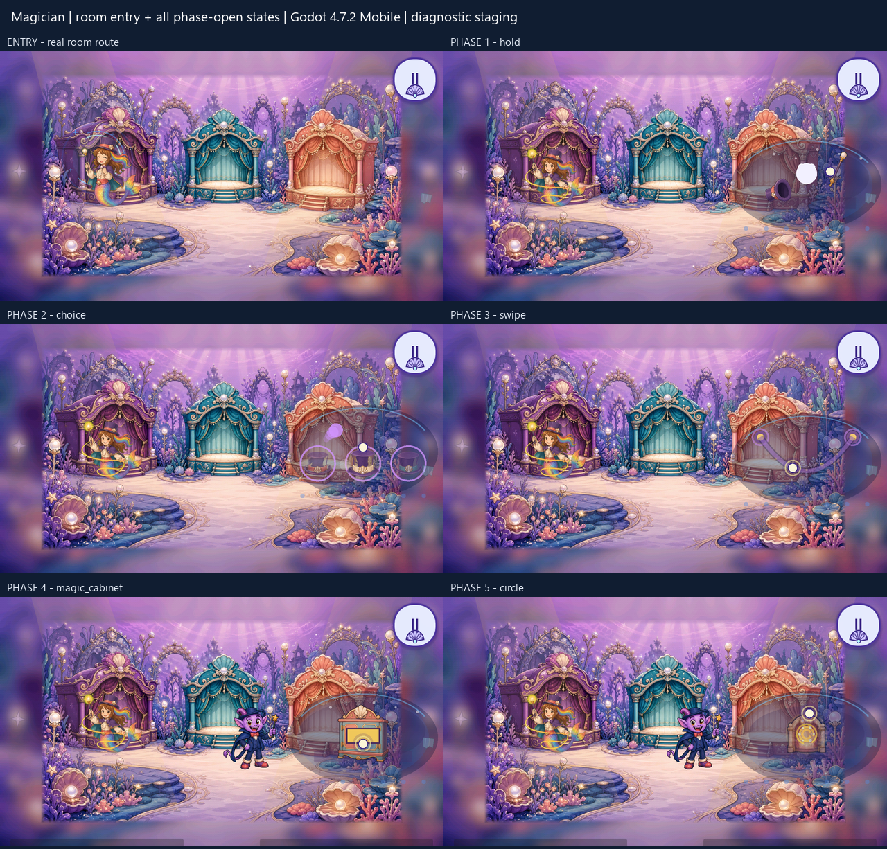

[Open full diagnostic sheet](opera_mechanics_2026-09-05/magician_sheet.png).

### Exact sequence and timing

1. **VANISH — hold, 3.8.** Hold the wand while the hat covers Lamba.
2. **TRACK — choice, goal 5.** Follow a glowing hat through five shuffles.
3. **ROPE — authored swipe, goal 5.** Trace the rope into a long ribbon.
4. **CABINET — specialist downward drag, goal 1.** Pull the cabinet open.
5. **PORTAL — circle, goal 2.** Charge two revolutions.

Definitions: [scripts/opera_career_world_2d.gd:281-287](https://github.com/Ebonyks/mermaid-roshan-reef/blob/cc931b8f4e0849faa674b9ea4020d15c1b15e8d1/scripts/opera_career_world_2d.gd#L281); stations: violet stage → tide pool → teal stage → rose stage → rose stage ([scripts/opera_career_world_2d.gd:383](https://github.com/Ebonyks/mermaid-roshan-reef/blob/cc931b8f4e0849faa674b9ea4020d15c1b15e8d1/scripts/opera_career_world_2d.gd#L383)). Contest starts at CABINET ([scripts/opera_career_world_2d.gd:355-370](https://github.com/Ebonyks/mermaid-roshan-reef/blob/cc931b8f4e0849faa674b9ea4020d15c1b15e8d1/scripts/opera_career_world_2d.gd#L355)).

**Code-derived timing:** VANISH requires an exact 3.8-second hold and only starts from the wand hit area; touching elsewhere produces guidance rather than progress ([scripts/opera_gesture_surface.gd:1031-1041,3319-3418](https://github.com/Ebonyks/mermaid-roshan-reef/blob/cc931b8f4e0849faa674b9ea4020d15c1b15e8d1/scripts/opera_gesture_surface.gd#L1031)). TRACK begins a **1.5-second** shuffle with a 2.2-second answer flash ([scripts/opera_gesture_surface.gd:5232-5238](https://github.com/Ebonyks/mermaid-roshan-reef/blob/cc931b8f4e0849faa674b9ea4020d15c1b15e8d1/scripts/opera_gesture_surface.gd#L5232)), but the generic choice press path has no shuffle-in-progress gate ([scripts/opera_gesture_surface.gd:949-954](https://github.com/Ebonyks/mermaid-roshan-reef/blob/cc931b8f4e0849faa674b9ea4020d15c1b15e8d1/scripts/opera_gesture_surface.gd#L949)). The world starts the shuffle after the activity opens and immediately starts another after each success ([scripts/opera_career_world_2d.gd:2445-2448,3156-3167](https://github.com/Ebonyks/mermaid-roshan-reef/blob/cc931b8f4e0849faa674b9ea4020d15c1b15e8d1/scripts/opera_career_world_2d.gd#L2445)). The real target pays 1.0 while hats are still moving; the visual shuffle does not gate hit testing. ROPE is one ordered authored journey. CABINET requires a downward movement of at least max(70 px, 28% of height); early release resets safely ([scripts/opera_gesture_surface.gd:3791-3858](https://github.com/Ebonyks/mermaid-roshan-reef/blob/cc931b8f4e0849faa674b9ea4020d15c1b15e8d1/scripts/opera_gesture_surface.gd#L3791)). PORTAL requires two honest revolutions while the doorway stays stable and only its ring responds.

### Pros

- The career has the strongest theatrical escalation: vanish, track, transform, reveal, portal.
- VANISH correctly gates input to the wand and couples hold progress to hat movement and subject fade.
- CABINET is a bespoke direct-manipulation payoff with a generous threshold and safe reset.
- The giant themed room landmarks make each trick spatially memorable.

### Cons

- TRACK accepts a correct target tap during its 1.5-second shuffle. A wrong tap after the 0.6-second cooldown also adds 0.05 to world phase progress. This is confirmed by the live input and scoring path, not merely suspected from the animation.
- The answer remains visibly identified, so five repetitions measure following a highlight more than object permanence.
- VANISH's patient/hat ground is partly code-drawn, while retained authored art suggests a richer storybook presentation.
- ROPE and PORTAL are variations on familiar swipe/circle quotas and always resolve the same trick.

### Prioritized improvements

1. **P1:** gate choice input until the 1.5-second shuffle ends, then remove the answer glow for a short child-turn window. Wrong answers must pay zero semantic progress, while accepted correct work remains banked. On a wrong or idle response, replay slowly with the current glow and never fail.
2. **P1:** vary the start/end lane and use two or three harmless hat/subject combinations across replay.
3. **P2:** make ROPE's path visibly change knots into a continuous ribbon segment by segment, using isolated painted states.
4. **P2:** let the child select a portal color/symbol before charging it and preserve that choice into the finale.

**Closest official comparator:** [Kid-E-Cats Circus](https://play.google.com/store/apps/details?hl=en&id=com.devgame.kid.e.cats.circus.show.games.toddlers) advertises magician transformations, six replayable circus mini-games, friends, and multiple reactions. Roshan has a more coherent five-trick arc; it needs correct memory-turn timing and outcome variation. Comparator tutorial and per-trick timing are unknown.

### Observed room art and scene integration

Pros: One of the best complete scenes. Three theatrical shell doors have distinct plum, teal, and coral identities; the open floor, pearl lamps, and curved inlaid path naturally support tracking, rope, cabinet, and portal. The magician costume matches the stage without disappearing into it. Color and silhouette do most of the tutorial work.

Cons: The purple-on-purple room is near the lower contrast limit, especially in the lower-left shell bed and background arches. The central floor is so clean that a generic spotlight can look pasted over it. The three doors are large enough to compete with the active portal if all are pulsing.

Improve: Keep the three-door composition and silence inactive doors. Reserve a single star/pearl highlight for the current object. For the portal, build the animation from the painted shell/pearl palette and keep the portal's bright state bounded so it does not wash out Roshan's face.

## Painter — 3.4/5

**Room composition: 4.5/5.** Overall includes the mechanic, teaching, persistence and visible activity limitations described here.

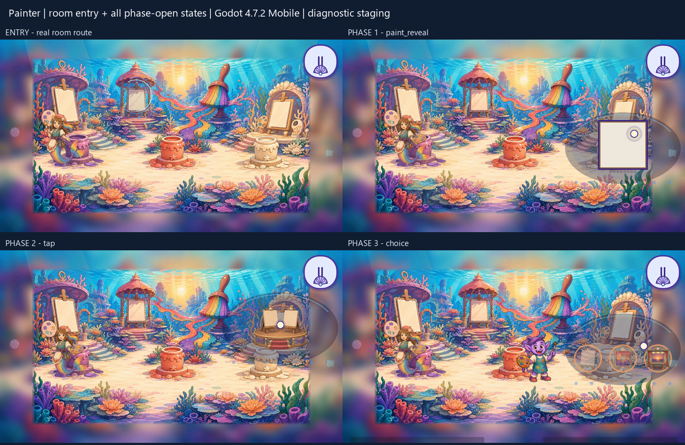

[Open full diagnostic sheet](opera_mechanics_2026-09-05/painter_sheet.png).

### Exact sequence and timing

1. **PAINT — reveal specialist, goal 1.** Brush at least 62% of a 10×6 grid: at least **38 of 60 cells**.
2. **STAMPS — free tap, goal 5.** Place any five stamps at finger positions.
3. **GALLERY — choice, goal 1.** Tap the glowing frame.

Definitions: [scripts/opera_career_world_2d.gd:288-292](https://github.com/Ebonyks/mermaid-roshan-reef/blob/cc931b8f4e0849faa674b9ea4020d15c1b15e8d1/scripts/opera_career_world_2d.gd#L288); stations: gazebo easel → rainbow brush → arch easel ([scripts/opera_career_world_2d.gd:384](https://github.com/Ebonyks/mermaid-roshan-reef/blob/cc931b8f4e0849faa674b9ea4020d15c1b15e8d1/scripts/opera_career_world_2d.gd#L384)). Contest starts at GALLERY ([scripts/opera_career_world_2d.gd:355-370](https://github.com/Ebonyks/mermaid-roshan-reef/blob/cc931b8f4e0849faa674b9ea4020d15c1b15e8d1/scripts/opera_career_world_2d.gd#L355)).

**Code-derived timing:** PAINT uses a 10×6 grid and `PAINT_REQUIRED_COVERAGE = 0.62` ([scripts/opera_gesture_surface.gd:185-193](https://github.com/Ebonyks/mermaid-roshan-reef/blob/cc931b8f4e0849faa674b9ea4020d15c1b15e8d1/scripts/opera_gesture_surface.gd#L185)). The square canvas reveals a predetermined texture under gray cells; each brush sample hits a cell plus cardinal neighbors, and completion is checked on drag movement rather than initial press ([scripts/opera_gesture_surface.gd:4688-4800](https://github.com/Ebonyks/mermaid-roshan-reef/blob/cc931b8f4e0849faa674b9ea4020d15c1b15e8d1/scripts/opera_gesture_surface.gd#L4688)). STAMPS deliberately accepts free placement rather than anchors ([scripts/opera_gesture_surface.gd:322-325,939-948](https://github.com/Ebonyks/mermaid-roshan-reef/blob/cc931b8f4e0849faa674b9ea4020d15c1b15e8d1/scripts/opera_gesture_surface.gd#L322)); there is no minimum separation, so five rapid taps can satisfy it. GALLERY is the generic three-lane glowing-answer choice.

### Pros

- Brush movement genuinely uncovers cells and creates continuous visible progress.
- STAMPS permits free placement, the clearest expressive agency in the seven careers.
- The painter backdrop is a strong interpretation of flat artwork into a full scene, with easels, colored light, brush landmark, and gallery architecture.
- The 62% threshold allows an imperfect preschool scribble to succeed.

### Cons

- PAINT is erasure/reveal of a predetermined sunrise, not painting; brush color and stroke decisions do not alter the final art.
- Five stamps may overlap at one coordinate. That is a valid creative choice, but the current system gives little expressive feedback beyond counting to five.
- The finished result does not appear to preserve the child's exact brush/stamp choices into GALLERY or later revisits.
- GALLERY asks for a correct glowing frame rather than letting the child choose where to hang their own work.

### Prioritized improvements

1. **P1:** change GALLERY from an answer test to a real choice: all three frames are valid, and the selected frame visibly receives the player's own finished canvas.
2. **P1:** preserve stamp positions and chosen frame through the curtain call and, ideally, the save file as a compact layout.
3. **P1:** add a three-color palette or two brush types whose marks remain visible over the revealed sunrise. Keep the 62% assist threshold and offer a ghost stroke only after idle.
4. **P2:** keep overlapping stamps valid; provide a playful combined mark or reaction and a large optional stamp/color selector. Do not impose a spacing test on a creative activity.

**Closest official comparator:** [Crayola Create & Play](https://play.google.com/store/apps/details?hl=en&id=com.crayolallc.crayola_create_and_play) advertises crayons, paint, stamps, stickers, glitter, tracing, pixel/glow art, lessons, and a gallery. Matching its breadth is unnecessary, but Roshan needs one persistent creative decision and an authentic gallery choice to fulfill the painter fantasy. Comparator tutorial duration and tool timing are unknown.

### Observed room art and scene integration

Pros: Exceptional visual translation. Three easels, matching paint pots, a central gazebo, and a giant rainbow brush communicate the job immediately. The large brush is a memorable world landmark rather than a generic icon. The scene uses an excellent warm/cool balance: aqua water and coral flora frame the cream painting floor, while Roshan's painter costume reads cleanly on the left.

Cons: The giant brush and rainbow paint stream are the strongest visual mass, so the actual easels can become secondary. The left easel/paint pot group is close to Roshan's tail, and the central paint pot is easy to mistake for the active target in a quick glance. Thin easel lines may soften on a low-end phone.

Improve: Give the active easel a broad painted glow in its own color and leave the giant brush as a static story landmark. Use thick, rounded paint strokes that match the room's broad material bands; avoid drawing thin vector trails over the painterly canvas.

## Astronaut — 4.0/5

**Room composition: 4.4/5.** Overall includes the mechanic, teaching, persistence and visible activity limitations described here.

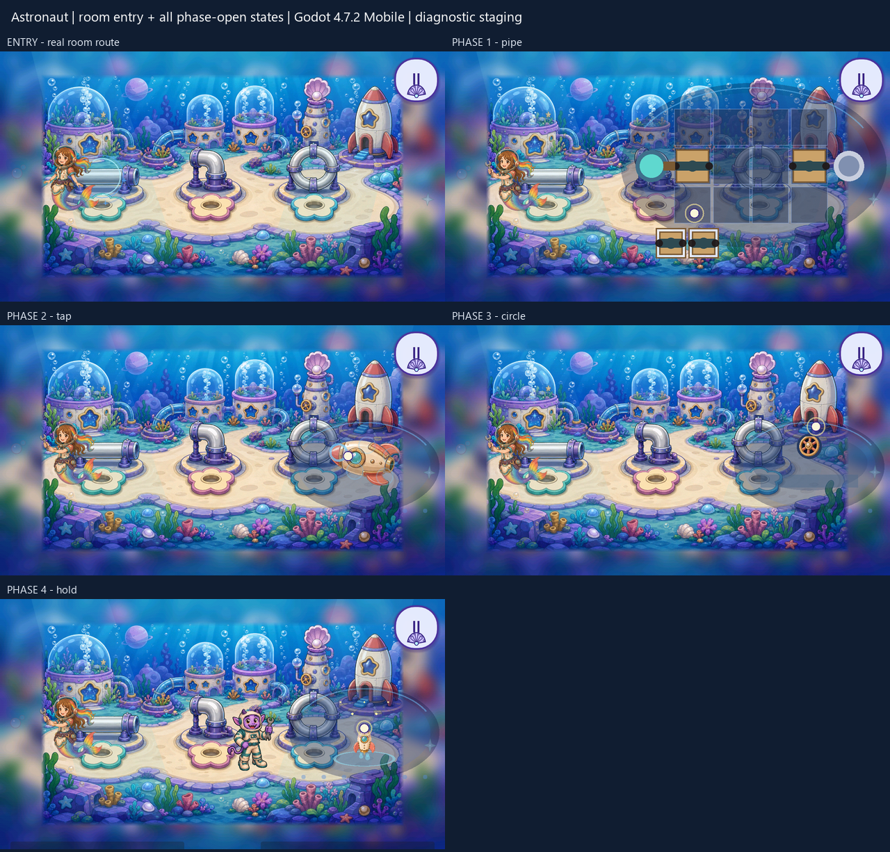

[Open full diagnostic sheet](opera_mechanics_2026-09-05/astronaut_sheet.png).

### Exact live sequence and timing

1. **PIPES** — complete three pipe boards.
2. **PATCH** — tap five anchored leaks on the rocket.
3. **VALVE** — turn 1.8 full revolutions.
4. **LAUNCH** — sustain contact for 4.5 seconds.

Authority: [scripts/opera_career_world_2d.gd:293-297](https://github.com/Ebonyks/mermaid-roshan-reef/blob/cc931b8f4e0849faa674b9ea4020d15c1b15e8d1/scripts/opera_career_world_2d.gd#L293), mapped to coolant tank, pipe planter, valve/periscope, and launch dais at [scripts/opera_career_world_2d.gd:385](https://github.com/Ebonyks/mermaid-roshan-reef/blob/cc931b8f4e0849faa674b9ea4020d15c1b15e8d1/scripts/opera_career_world_2d.gd#L385).

Pipes uses pre-rotated pieces, no timer, and no failure. Round 1 has two straight pieces and no obstacle; Round 2 adds a bend route, five tray choices, and one sleeping imp; Round 3 changes exit direction, adds two imps, and provides six pieces ([scripts/opera_gesture_surface.gd:65-96](https://github.com/Ebonyks/mermaid-roshan-reef/blob/cc931b8f4e0849faa674b9ea4020d15c1b15e8d1/scripts/opera_gesture_surface.gd#L65)). Fuel advances every 1.2 seconds while incomplete and every 0.35 seconds once the path is complete. It waits at the last valid pipe; after eight seconds the needed cell twinkles, and after 16 seconds a wrong nonfixed pipe returns itself to the tray ([scripts/opera_gesture_surface.gd:5488-5526](https://github.com/Ebonyks/mermaid-roshan-reef/blob/cc931b8f4e0849faa674b9ea4020d15c1b15e8d1/scripts/opera_gesture_surface.gd#L5488), `5607-5735`). Each solved board pauses one second before the next.

Patch uses five authored anchor positions over the rocket ([scripts/opera_gesture_surface.gd:286-296](https://github.com/Ebonyks/mermaid-roshan-reef/blob/cc931b8f4e0849faa674b9ea4020d15c1b15e8d1/scripts/opera_gesture_surface.gd#L286)). Valve's finger pivot and isolated wheel art share the same hub; the code explicitly occludes the painted valve before rotating the cutout ([scripts/opera_gesture_surface.gd:2396-2417](https://github.com/Ebonyks/mermaid-roshan-reef/blob/cc931b8f4e0849faa674b9ea4020d15c1b15e8d1/scripts/opera_gesture_surface.gd#L2396)). Launch is a literal 4.5-second hold with the rocket/glow filling in response.

### Pros

- Pipes is one of Opera's best educational mechanics. It introduces topology in three small steps, permits drag or tap-select/tap-place, and lets the child revise any nonfixed tile.
- Assistance is spatially exact and delayed appropriately. Fuel waiting at the gap communicates the problem before the explicit hint appears.
- The master art and verb sequence align unusually well. A huge visible pipe system leads across a luminous space city to the rocket, so the flat illustration already contains the activity's causal story.
- Patch anchors, same-hub Valve rotation, and growing Launch glow attach abstract gestures to objects. This avoids the “circle anywhere” feeling seen in Racer and Geologist.
- Thinkrolls' penalty-free experiment pattern is present in miniature: trial, visible consequence, revise, gentle auto-correction.

### Cons

- Complexity jumps sharply between Pipe boards 1 and 2: two obvious straight pieces becomes five candidates plus a bend and obstacle. The assist catches a stuck child, but there is no explicit transition that names the new rule visually.
- Patch is five target taps with no decision beyond finding sparkle anchors. Valve is a repeated rotation, and Launch is a long hold. After Pipes, the last three phases reduce cognitive depth rather than culminating in it.
- The 4.5-second Launch hold is the longest literal sustained contact in this subset. On a small phone it can feel like waiting unless the rocket supplies continuous, staged audiovisual escalation.
- Chapter 2 replaces Launch with **READY PARK**, but assigns `widget_context: "push_racer"` and has no phase VO ([scripts/chapter_two_career_scene_adapter.gd:61-65](https://github.com/Ebonyks/mermaid-roshan-reef/blob/cc931b8f4e0849faa674b9ea4020d15c1b15e8d1/scripts/chapter_two_career_scene_adapter.gd#L61)). That causes an astronaut story beat to borrow Racer push art/geometry, weakening both career identity and spoken accessibility.

### Prioritized improvements

1. **P1 — Give Chapter 2 READY PARK an astronaut-specific push context and voice line.** Reuse the approved rocket cutout and draw a short parking rail/dock, rather than the kart.
2. **P1 — Make Pipe board progression explicit.** Before Round 2, show the sleeping imp settle onto the forbidden cell; before Round 3, animate the exit beacon moving upward. Keep each transition under one second and immediately interactive.
3. **P1 — Add one choice to the last three beats:** Patch leaks in an observable sequence, Valve stops at a broad lit alignment, and Launch has three visible stages during the same hold. Do not add failure or a countdown that can expire.
4. **P2 — Reduce Launch contact to about 3.2–3.8 seconds if device playtesting shows finger fatigue**, while preserving the full visual buildup.

**Closest official comparator evidence:** [Thinkrolls Space](https://play.google.com/store/apps/details?hl=en_US&id=com.avokiddo.games.thinkrolls_space) describes matching/moving objects to clear a path, successive lessons, unlimited retries and no time limits. Opera Pipes has the useful miniature version: trial, blocked flow at the actual gap, revision and safe assistance. Introduce the new bend/obstacle rule visibly rather than adding content volume. Exact tutorial duration is unknown.

### Observed room art and scene integration

Pros: Strong toy engineering room. Bubble domes, colored pipe loops, a launch rocket, coolant tanks, and flower-shaped floor ports make the pipe/patch/valve/launch sequence pictorial. The astronaut suit has excellent warm/cool contrast, and the foreground pipe stations are large enough for one-finger interaction.

Cons: The scene has many circular domes and pipe bends, producing a repeated shape rhythm. The large top-right pause button and circular touch ring can blend into the blue underwater field. Small bubble highlights and star ports are attractive but make the active endpoint less obvious.

Improve: Treat the source pipes as the single authoritative route and animate only the matching live segment/port. Give the active endpoint a warm pearl light, then return it to the authored blue after completion. Keep the launch rocket's existing proportions; do not add a separate rocket card in front of the painted rocket.

## Racer — 2.3/5

**Room composition: 4.4/5.** Overall includes the mechanic, teaching, persistence and visible activity limitations described here.

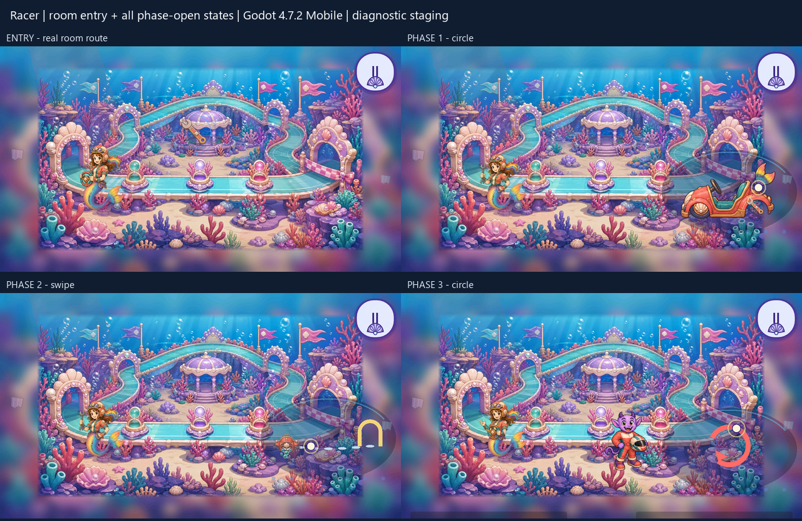

[Open full diagnostic sheet](opera_mechanics_2026-09-05/racer_sheet.png).

### Exact live sequence and timing

1. **TUNE** — turn the wrench for 1.8 revolutions to install/settle the missing rear wheel.
2. **TO THE LINE** — follow a rightward long-push journey to move the kart along a visible route; goal 5.
3. **RACE** — draw 0.9 of one full circle; that completes the finale.

Authority: [scripts/opera_career_world_2d.gd:299-302](https://github.com/Ebonyks/mermaid-roshan-reef/blob/cc931b8f4e0849faa674b9ea4020d15c1b15e8d1/scripts/opera_career_world_2d.gd#L299), with stations at pit pavilion, start arch, and finish arch ([scripts/opera_career_world_2d.gd:386](https://github.com/Ebonyks/mermaid-roshan-reef/blob/cc931b8f4e0849faa674b9ea4020d15c1b15e8d1/scripts/opera_career_world_2d.gd#L386)). TUNE correctly uses the rear-wheel hub as both finger pivot and rendered wrench pivot; only the missing rear wheel grows into the arch ([scripts/opera_gesture_surface.gd:2046-2104](https://github.com/Ebonyks/mermaid-roshan-reef/blob/cc931b8f4e0849faa674b9ea4020d15c1b15e8d1/scripts/opera_gesture_surface.gd#L2046), `2166-2189`). TO THE LINE is a special rightward-only long-push route, rather than generic swipe accumulation ([scripts/opera_gesture_surface.gd:1506-1586](https://github.com/Ebonyks/mermaid-roshan-reef/blob/cc931b8f4e0849faa674b9ea4020d15c1b15e8d1/scripts/opera_gesture_surface.gd#L1506)).

RACE is explicitly a reused circle gesture. The source confirms that one honest turn wins, with no timer, placement, or fail ([scripts/opera_career_world_2d.gd:467-470](https://github.com/Ebonyks/mermaid-roshan-reef/blob/cc931b8f4e0849faa674b9ea4020d15c1b15e8d1/scripts/opera_career_world_2d.gd#L467)). At goal 0.9, the required accepted motion is 324 degrees. This preserves kindness but does not create racing decisions.

### Pros

- The world master is outstanding: a giant cream track, pit garages, stands, tunnel, start/finish shell, and clear foreground route create immediate racing fantasy with strong perspective.
- TUNE is a model causal micro-interaction. The finger turns at the actual wheel hub; a missing wheel appears and settles instead of an unrelated meter filling.
- TO THE LINE turns setup into a visible journey and uses the same red/coral kart family, but switches from a side-view repair cutout to a separate rear-view mover. The concept carries forward; this is not the identical artwork or viewpoint.
- No losing finish position or expired race timer blocks the child. The shared finale can still weight speed in ovation quality; safe completion is not the same as absence of evaluative pressure.

### Cons

- The marketed configuration promises “TWO laps,” steering, zoom strips, and a TURBO tap ([scripts/opera_house.gd:111-116](https://github.com/Ebonyks/mermaid-roshan-reef/blob/cc931b8f4e0849faa674b9ea4020d15c1b15e8d1/scripts/opera_house.gd#L111)). None exists in the live three-phase route. The final 0.9-circle gesture is a material fiction/mechanic mismatch.
- The phase labelled RACE is shorter and mechanically simpler than TUNE. A child can finish the “Grand Prix” with roughly one circular finger movement while the richly painted track remains mostly scenery.
- Because RACE has an explicit empty widget, it falls through to the generic center circle/arrow rather than a kart-specific steering object ([scripts/opera_career_world_2d.gd:302](https://github.com/Ebonyks/mermaid-roshan-reef/blob/cc931b8f4e0849faa674b9ea4020d15c1b15e8d1/scripts/opera_career_world_2d.gd#L302); [scripts/opera_gesture_surface.gd:1345-1385](https://github.com/Ebonyks/mermaid-roshan-reef/blob/cc931b8f4e0849faa674b9ea4020d15c1b15e8d1/scripts/opera_gesture_surface.gd#L1345)). The painting suggests track navigation; the control suggests drawing practice.
- The rival and bottom progress bars can imply a contest, but the child does not see their own steering affect track position, lane, speed strip, or lap state. There is little mastery or replay variation.
- Chapter 2 Racer has an empty bespoke phase set ([scripts/chapter_two_career_scene_adapter.gd:67](https://github.com/Ebonyks/mermaid-roshan-reef/blob/cc931b8f4e0849faa674b9ea4020d15c1b15e8d1/scripts/chapter_two_career_scene_adapter.gd#L67)), so there is no alternate correction there.

### Prioritized improvements

1. **P1 — Rebuild RACE as an actual no-fail driving loop.** Trial one-finger horizontal steering on a short two-lap track with soft rails. Require recent intentional input for race progress; waiting safely must not become a passive win. Every actively played route should reach a celebratory finish.
2. **P1 — Reconcile the configuration promise with actual play:** use occasional large boost opportunities and a visible finish. Keep optional boost reachable with the same finger; do not require simultaneous steering and button input. The listed two-lap/steering text is configuration evidence, not proof of the actual spoken entry clip.
3. **P1 — Make lap state visual and nonverbal:** two giant pearls/checkered shells fill at the finish arch. Avoid a numeric counter.
4. **P1 — Preserve current TUNE and TO THE LINE art/logic.** They are good setup phases; keep circular manipulation at the wheel-repair station, where it makes physical sense.
5. **P2 — Give the rival a parallel lane with authored, predetermined near-miss beats** while guaranteeing Roshan's celebratory finish. This adds drama without a fail state.

**Closest official comparator evidence:** [Racing Kids](https://yateland.com/apps/racing-kids/) explicitly describes lane-change swipes, tap nitro, obstacles/power-ups and short races. The important comparison is continuous agency and a visible finish, not its number of tracks. Opera currently offers neither steering nor lap decisions in RACE. Competitor first-launch and race durations were not measured.

### Observed room art and scene integration

Pros: The circuit is unusually coherent as a scene: arched start/finish gates, looping track, flags, center pavilion, and three pearl checkpoints all read at once. The racer costume and steering wheel make Roshan's role obvious. The room gives the race a clear direction without needing a text label.

Cons: The center wrench pavilion is a large non-track object and competes with the three checkpoints. The repeated coral foreground can reduce track-edge contrast. In the route frame the left Roshan and lower-left arch are close, so the steering cue needs to avoid the coral cluster.

Improve: Keep the full painted circuit and place the active checkpoint pulse on the existing pearl dais. Use a broad track-color lane highlight for the race phase instead of a generic arrow. Keep the wrench as the tune-up landmark and ensure its animated crank is registered to the same painted center.

## Pop Star — 3.5/5

**Room composition: 4.6/5.** Overall includes the mechanic, teaching, persistence and visible activity limitations described here.

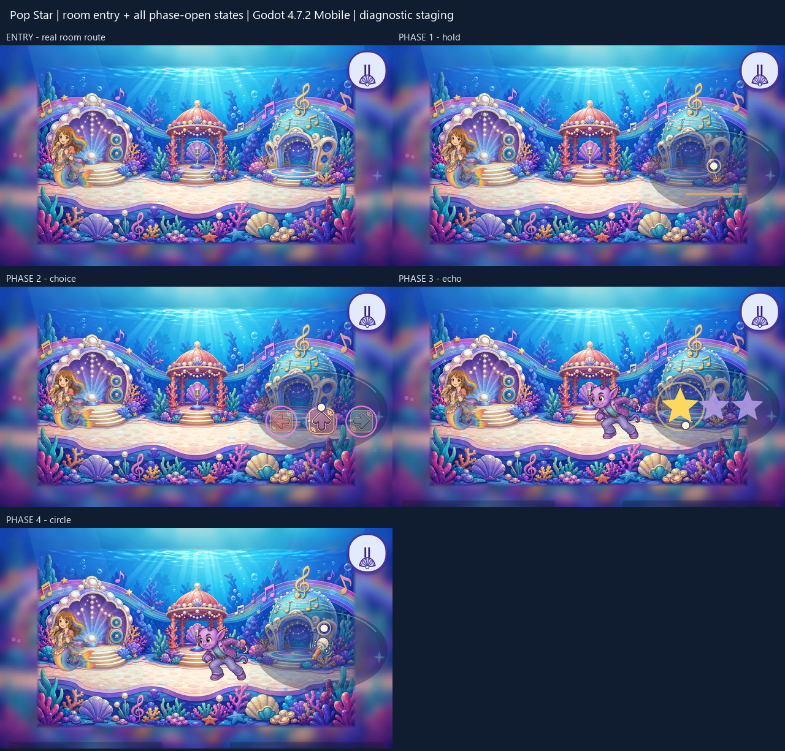

[Open full diagnostic sheet](opera_mechanics_2026-09-05/popstar_sheet.png).

### Exact live sequence and timing

1. **SOUND CHECK** — hold the microphone for 3.8 seconds.
2. **DANCE** — make six correct selections among three lanes/arrows.
3. **RHYTHM** — echo three verses: `[left, right]`, `[left, middle, right]`, `[right, middle, left]`.
4. **ENCORE** — complete 1.8 circular revolutions.

Authority: [scripts/opera_career_world_2d.gd:311-315](https://github.com/Ebonyks/mermaid-roshan-reef/blob/cc931b8f4e0849faa674b9ea4020d15c1b15e8d1/scripts/opera_career_world_2d.gd#L311), at microphone gazebo, record dais, then shell stage ([scripts/opera_career_world_2d.gd:388](https://github.com/Ebonyks/mermaid-roshan-reef/blob/cc931b8f4e0849faa674b9ea4020d15c1b15e8d1/scripts/opera_career_world_2d.gd#L388)). Sound Check's approved microphone pulses and leans slightly while expanding waves and notes appear; it does not spin as a whole ([scripts/opera_gesture_surface.gd:2580-2614](https://github.com/Ebonyks/mermaid-roshan-reef/blob/cc931b8f4e0849faa674b9ea4020d15c1b15e8d1/scripts/opera_gesture_surface.gd#L2580)).

Dance is currently the generic `choice` mode, not the richer dormant `dance_sequence` surface. It displays three lane objects, briefly lights the answer, and changes the target after success; a wrong selection keeps the target and reflashes it ([scripts/opera_career_world_2d.gd:3156-3170](https://github.com/Ebonyks/mermaid-roshan-reef/blob/cc931b8f4e0849faa674b9ea4020d15c1b15e8d1/scripts/opera_career_world_2d.gd#L3156); [scripts/opera_gesture_surface.gd:2668-2681](https://github.com/Ebonyks/mermaid-roshan-reef/blob/cc931b8f4e0849faa674b9ea4020d15c1b15e8d1/scripts/opera_gesture_surface.gd#L2668), `2818-2823`). Generic miss pay can award 0.05 after its cooldown ([scripts/opera_gesture_surface.gd:395-400](https://github.com/Ebonyks/mermaid-roshan-reef/blob/cc931b8f4e0849faa674b9ea4020d15c1b15e8d1/scripts/opera_gesture_surface.gd#L395)), so enough spaced wrong choices can theoretically advance a correctness task.

Rhythm is much stronger. Each demonstrated star sounds/lights for a 0.55-second step, then the child can answer at any tempo. Tapping during the demonstration is harmless. A wrong star replays the verse after 0.9 seconds; a completed verse begins the next after 0.7 seconds ([scripts/opera_gesture_surface.gd:110-119](https://github.com/Ebonyks/mermaid-roshan-reef/blob/cc931b8f4e0849faa674b9ea4020d15c1b15e8d1/scripts/opera_gesture_surface.gd#L110), `5840-5904`).

### Pros

- The music-city master is a beautiful interpretation of the theme. Speaker towers, microphones, spotlights, rainbow bridge, and the giant directional dance dais make the career readable before any overlay appears.
- Sound Check has good causal animation: held energy becomes visible sound waves and notes around a recognizable microphone.
- Rhythm is appropriately short and scaffolded: 2, 3, then 3 notes. It tests order and auditory memory without timing pressure.
- Harmless eager taps and automatic replay make Rhythm accessible to a four-year-old while preserving semantic correctness.
- The echo pads use lit/unlit star textures with a consistent palette, although the large active stars are much flatter and simpler than the surrounding painterly room ([scripts/opera_gesture_surface.gd:5907-5910](https://github.com/Ebonyks/mermaid-roshan-reef/blob/cc931b8f4e0849faa674b9ea4020d15c1b15e8d1/scripts/opera_gesture_surface.gd#L5907)).

### Cons

- Dance underuses the master art. The painting contains a prominent four-direction pad, and the gesture surface already contains a four-pad sequence `[0,2,3,1]` with call-and-response and prefix-preserving retry ([scripts/opera_gesture_surface.gd:154](https://github.com/Ebonyks/mermaid-roshan-reef/blob/cc931b8f4e0849faa674b9ea4020d15c1b15e8d1/scripts/opera_gesture_surface.gd#L154), `4345-4438`), but the live phase still routes to a three-choice, six-success lane exercise.
- The three-choice interaction teaches visual target selection rather than dance rhythm, movement order, or beat. It also conflicts with the four arrows visibly painted into the world.
- Wrong-choice trickle progress is inappropriate here and in Geologist Layers. Kindness should preserve progress and reteach; it should not eventually accept the wrong semantic answer.
- Two of four phases are long continuous gestures: 3.8-second hold and 1.8 rotations. They create spectacle but limited musical agency.
- Chapter 2 repeats this pattern with Rumi. Its Rhythm `vo` is empty, and Encore asks for goal 2.0 while its spoken line says “one big encore spin” ([scripts/chapter_two_career_scene_adapter.gd:68-72](https://github.com/Ebonyks/mermaid-roshan-reef/blob/cc931b8f4e0849faa674b9ea4020d15c1b15e8d1/scripts/chapter_two_career_scene_adapter.gd#L68)).

### Prioritized improvements

1. **P1 — Trial the existing `dance_sequence` specialist for DANCE.** Use the painted four-arrow dais, play the four-step call, accept the child at any tempo, and preserve a correct prefix after a wrong pad. Set the external goal to one completed phrase. Compare it with an expressive movement-response version before adoption: duplicating Rhythm's memory test would not necessarily improve the career.
2. **P1 — Remove miss-credit from semantic choice/echo tasks.** Keep the same answer and replay the cue without decreasing banked correct work.
3. **P1 — Add an audible response to every Dance and Rhythm pad**, pitched consistently with its color/direction, and let Roshan's atlas pose change on accepted pads.
4. **P1 — Add/fix Chapter 2 Rhythm VO and reconcile “one spin” with the 2.0-revolution goal.**
5. **P2 — Make Encore assemble the learned four-note phrase under the circular flourish**, so the finale recalls mastery rather than introducing another generic motor loop.

**Closest official comparator evidence:** [Kids Music: Piano, Xylo, Drums](https://play.google.com/store/apps/details?id=com.rvappstudios.kids.games.music.baby.piano.songs.lucas.and.friends) describes instrument responses, a note-sequence Music Trail and exploration; [Piano Kids](https://play.google.com/store/apps/details?id=com.orange.kidspiano.music.songs) describes stepwise note guidance. The useful benchmark is an audible, recognizable musical consequence for every pad. Neither source establishes tutorial duration or latency.

### Observed room art and scene integration

Pros: The clearest music-world identity. The shell speaker stage, center microphone gazebo, right treble-clef pavilion, floating notes, and broad cream dance floor create a very strong hierarchy. The pop-star costume, microphone, and rainbow light all agree with the scene's authored warm/cool lighting. The route capture makes sound check, dance, rhythm, and encore distinct without text.

Cons: Saturation is high across the whole frame; foreground coral and floating notes can compete with the current arrow/lane cue. The active microphone sits near the center of the gazebo where the shared ring and spotlight overlap. The spotlight wedge visibly flattens the authored blue water-light pattern.

Improve: Keep the music-note decoration but dim inactive notes and reserve a single warm note color for the current beat. Pulse the painted microphone and speaker footprint rather than adding a second microphone icon. Soften or mask the shared spotlight over the water caustic field.

## Nursery — 3.7/5

**Room composition: 2.8/5.** Overall includes the mechanic, teaching, persistence and visible activity limitations described here.

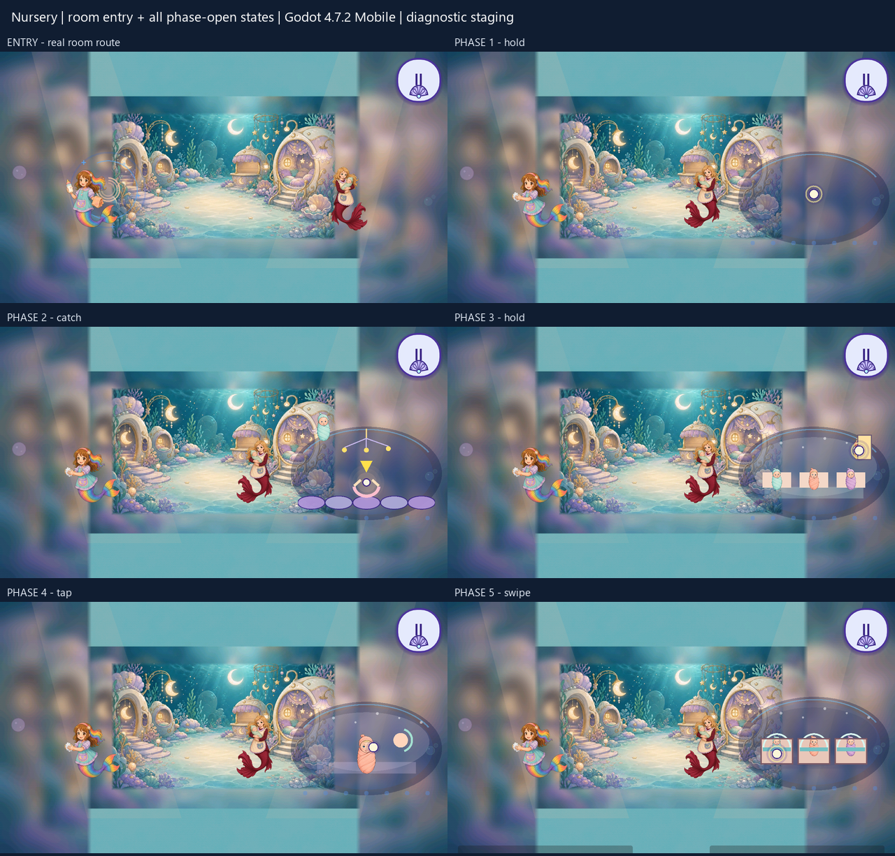

[Open full diagnostic sheet](opera_mechanics_2026-09-05/nursery_sheet.png).

### Exact live sequence and timing

1. **WASH HANDS** — hold 3.4 seconds.
2. **CATCH BABIES** — catch five falling babies.
3. **FEED** — hold the bottle 4.0 seconds.
4. **BURP** — four accepted taps, each at least 0.55 seconds after the preceding accepted tap. An early tap pays zero and makes a happy bounce.
5. **BEDTIME** — complete one downward blanket drag for each of three babies.

Authority: [scripts/opera_career_world_2d.gd:304-309](https://github.com/Ebonyks/mermaid-roshan-reef/blob/cc931b8f4e0849faa674b9ea4020d15c1b15e8d1/scripts/opera_career_world_2d.gd#L304), at basin, cushions, bottle nook, cushions, and moon bed ([scripts/opera_career_world_2d.gd:387](https://github.com/Ebonyks/mermaid-roshan-reef/blob/cc931b8f4e0849faa674b9ea4020d15c1b15e8d1/scripts/opera_career_world_2d.gd#L387)). Pace enforcement is at [scripts/opera_career_world_2d.gd:3123-3130](https://github.com/Ebonyks/mermaid-roshan-reef/blob/cc931b8f4e0849faa674b9ea4020d15c1b15e8d1/scripts/opera_career_world_2d.gd#L3123), so the fastest possible four accepted Burp taps span at least 1.65 seconds from first to fourth.

Catch spawns the first baby after 0.18 seconds. One baby falls at a time for the first two catches, then up to two can overlap; spawn spacing tightens from 1.02 seconds toward a 0.64-second floor ([scripts/opera_nursery_catch.gd:64-78](https://github.com/Ebonyks/mermaid-roshan-reef/blob/cc931b8f4e0849faa674b9ea4020d15c1b15e8d1/scripts/opera_nursery_catch.gd#L64), `172-181`). The first baby takes about 4.2 seconds from spawn to the catch line at the initial speed (`(0.74 - -0.12) / 0.205`, code-derived). Touch or drag positions the cradle and grants two seconds of live-input memory; without recent input, no catch is awarded ([scripts/opera_nursery_catch.gd:89-128](https://github.com/Ebonyks/mermaid-roshan-reef/blob/cc931b8f4e0849faa674b9ea4020d15c1b15e8d1/scripts/opera_nursery_catch.gd#L89), `192-204`). After two misses, babies fall more slowly, spawn near the current cradle, and the catch width expands. Misses land on pillows for 1.25 seconds and can never lose the phase ([scripts/opera_nursery_catch.gd:131-169](https://github.com/Ebonyks/mermaid-roshan-reef/blob/cc931b8f4e0849faa674b9ea4020d15c1b15e8d1/scripts/opera_nursery_catch.gd#L131)).

Bedtime enforces a start on the next blanket, a downward drag of max(48 px, 20% of surface height), and rejects upward or overly diagonal motion by immediately replaying the demonstration. Each completed blanket stays tucked; the next begins its ghost animation ([scripts/opera_gesture_surface.gd:3162-3263](https://github.com/Ebonyks/mermaid-roshan-reef/blob/cc931b8f4e0849faa674b9ea4020d15c1b15e8d1/scripts/opera_gesture_surface.gd#L3162)). The ghost completes the stroke over 1.65 seconds ([scripts/opera_gesture_surface.gd:4004-4015](https://github.com/Ebonyks/mermaid-roshan-reef/blob/cc931b8f4e0849faa674b9ea4020d15c1b15e8d1/scripts/opera_gesture_surface.gd#L4004)).

### Pros

- The sequence is a coherent care routine, not an arbitrary set of gestures. Hand washing precedes contact; feeding precedes burping; tucking ends the session calmly.
- Catch has excellent adaptive difficulty. It waits for real input, increases from one to two fallers only after success, and responds to misses by slowing, steering nearer, and widening the cradle.
- Pillow landings make safety literal in the scene. Caught babies remain visible together in the cradle ([scripts/opera_nursery_catch.gd:284-291](https://github.com/Ebonyks/mermaid-roshan-reef/blob/cc931b8f4e0849faa674b9ea4020d15c1b15e8d1/scripts/opera_nursery_catch.gd#L284)), so progress is readable without text.
- Burp is rare, meaningful restraint training: mashing does not advance, but it also does not punish.
- Bedtime is a true object transformation. The blanket visibly grows down over the baby rather than merely moving an arrow ([scripts/opera_gesture_surface.gd:3266-3288](https://github.com/Ebonyks/mermaid-roshan-reef/blob/cc931b8f4e0849faa674b9ea4020d15c1b15e8d1/scripts/opera_gesture_surface.gd#L3266)).
- The underlying moonlit nursery illustration has a calm value structure and warm resting pods. Its current live framing does not preserve the intended full-room effect; see the scene review below.

### Cons

- The valid WASH phase-open capture shows the activity over a reduced central nursery image with cyan bands and a generic hold cue. This lowers the delivered scene quality substantially despite strong Catch/Bedtime logic.

- Catch's idle cue is a downward arrow above the cradle, while the required skill is horizontal positioning under a falling baby ([scripts/opera_nursery_catch.gd:270-275](https://github.com/Ebonyks/mermaid-roshan-reef/blob/cc931b8f4e0849faa674b9ea4020d15c1b15e8d1/scripts/opera_nursery_catch.gd#L270)). The voice explains “slide,” but the visual tutorial does not demonstrate the cradle's lateral intercept.
- A missed baby triggers `competition.note_miss()` and a three-second Faron miss line ([scripts/opera_career_world_2d.gd:3299-3308](https://github.com/Ebonyks/mermaid-roshan-reef/blob/cc931b8f4e0849faa674b9ea4020d15c1b15e8d1/scripts/opera_career_world_2d.gd#L3299)). The baby is safe, but repeated long voice responses may overlap the next spawn and feel more corrective than the pillow animation.
- Feed is four seconds of sustained contact with limited decision-making. It needs exceptionally good staged response to avoid feeling passive.
- Bedtime's cribs and blankets are code-drawn rectangles/arcs over an intricate painted nursery ([scripts/opera_gesture_surface.gd:3266-3288](https://github.com/Ebonyks/mermaid-roshan-reef/blob/cc931b8f4e0849faa674b9ea4020d15c1b15e8d1/scripts/opera_gesture_surface.gd#L3266)). They are readable, but the texture and contours are visibly less authored than the room and baby sprites.
- Chapter 2 Nursery has no bespoke phase set ([scripts/chapter_two_career_scene_adapter.gd:74](https://github.com/Ebonyks/mermaid-roshan-reef/blob/cc931b8f4e0849faa674b9ea4020d15c1b15e8d1/scripts/chapter_two_career_scene_adapter.gd#L74)).

### Prioritized improvements

1. **P1 — Replace the Catch idle arrow with a ghost cradle path** from current x to the lowest baby's x. Slow or briefly hover the first baby until the child first touches the cradle.
2. **P1 — Shorten and rate-limit Faron's miss response.** Let the pillow poof and baby's safe giggle teach the result; reserve VO for the first miss after a quiet interval.
3. **P1 — Add causal stages to Feed:** bottle tilts, milk level drops, baby changes expression, then a satisfied glow. Keep the same one-finger hold and bank progress across brief lifts if device testing shows fatigue.
4. **P2 — Derive crib/blanket cutouts from the approved nursery art** or use painted soft-edge textures while retaining current collision geometry.

**Closest official comparator evidence:** [Baby Panda Care](https://play.google.com/store/apps/details?hl=en_US&id=com.sinyee.babybus.care) describes age-appropriate food, washing, lullaby and cradle swinging, ending with a sleeping baby. Compare the physical care response and calm payoff, not the number of activities. Nursery's adaptive catching is a strong distinct element; exact competitor teaching and feeding durations are unknown.

### Observed room art and scene integration

Pros: The underlying nursery painting is beautiful and emotionally appropriate: moon-shell beds, warm bottles, soft cushions, hanging mobile, and a quiet aqua night field. Roshan's nurse costume reads well, and Faron gives the job a real care partner rather than another generic rival. The source image itself meets the Opera family's broad rounded material language.

Cons: The current live frame is visibly broken compared with the other 13. The sharp nursery scene occupies only a reduced central window with large cyan bands above and below and blurred side material; it does not fill the playable frame with the same authority as the other worlds. Four tile cards are present and loaded; the absent thumbnail is not itself the explanation. The active source/crop and actor-floor registration must be repaired. Faron's red tail/apron is a strong warm accent but is much more saturated than the soft night nursery and can pull attention away from the active baby.

Improve: Reconstruct Nursery from an approved high-resolution full-frame source with the same 16:9 framing and per-screen native coverage as the other rooms; remove the cyan bands by repairing the source/tile crop, not by stretching the scene. Keep the moonlit value hierarchy, give the active basin/bottle/bed one warm cue, and dim inactive mobiles. Review Faron and Roshan together at phone size so their silhouettes remain partners without competing with the baby.

## Geologist — 1.8/5

**Room composition: 1.8/5.** Overall includes the mechanic, teaching, persistence and visible activity limitations described here.

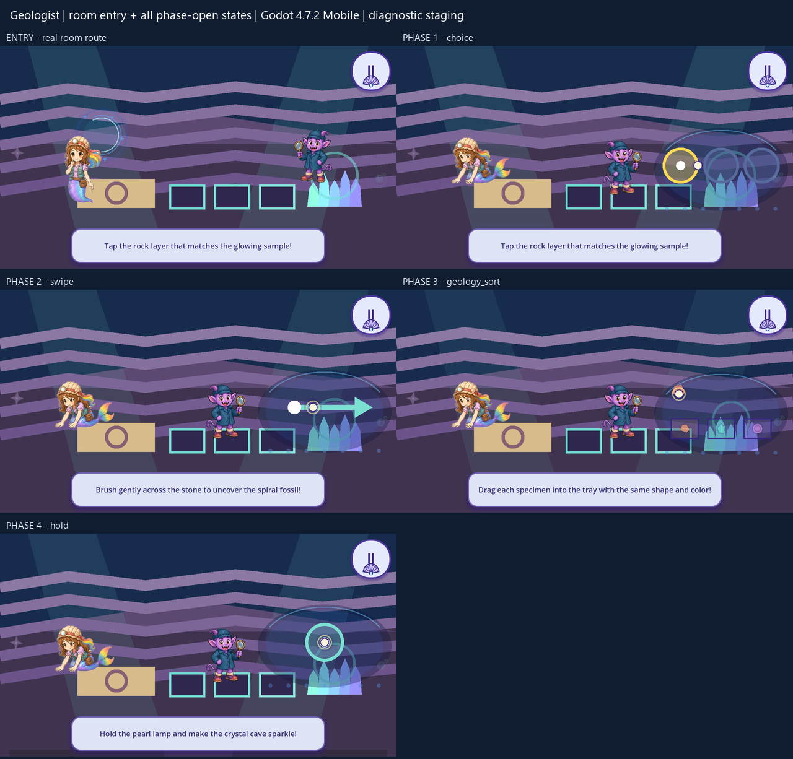

[Open full diagnostic sheet](opera_mechanics_2026-09-05/geologist_sheet.png).

### Exact live sequence and timing

1. **LAYERS** — three correct choices among generic circles.
2. **FOSSIL** — accumulate goal 5 through repeated generic swipe distance.
3. **SORT** — drag six specimens in fixed order `[0,1,2,2,0,1]` into matching shape/color trays.
4. **CRYSTAL** — hold for 4.0 seconds.

Authority: [scripts/opera_career_world_2d.gd:317-321](https://github.com/Ebonyks/mermaid-roshan-reef/blob/cc931b8f4e0849faa674b9ea4020d15c1b15e8d1/scripts/opera_career_world_2d.gd#L317); stations are layer wall, fossil table, specimen trays, and crystal gallery ([scripts/opera_career_world_2d.gd:389](https://github.com/Ebonyks/mermaid-roshan-reef/blob/cc931b8f4e0849faa674b9ea4020d15c1b15e8d1/scripts/opera_career_world_2d.gd#L389)). All four phases omit `vo`, so the free-play prompt falls back to a generic event rather than a phase-specific recorded key ([scripts/opera_career_world_2d.gd:2493-2506](https://github.com/Ebonyks/mermaid-roshan-reef/blob/cc931b8f4e0849faa674b9ea4020d15c1b15e8d1/scripts/opera_career_world_2d.gd#L2493)). For a non-reader, that is a material accessibility gap.

LAYERS and FOSSIL explicitly set `widget: ""`, so they bypass the object-family assets and draw only generic three-circle choice or a large arrow ([scripts/opera_gesture_surface.gd:1345-1395](https://github.com/Ebonyks/mermaid-roshan-reef/blob/cc931b8f4e0849faa674b9ea4020d15c1b15e8d1/scripts/opera_gesture_surface.gd#L1345)). CRYSTAL similarly draws a center hold ring. The prompts name a glowing sample, rock layer, stone, spiral fossil, pearl lamp, and crystal cave, but those causal objects are not rendered in their interaction surfaces.

SORT is the one substantial phase. A specimen travels slowly on a belt at max(24 px/s, 8% of surface width/s) and loops without penalty. Dragging to the correct one of three silhouette bins advances; a wrong bin returns the same specimen and restarts the demo ([scripts/opera_gesture_surface.gd:4479-4571](https://github.com/Ebonyks/mermaid-roshan-reef/blob/cc931b8f4e0849faa674b9ea4020d15c1b15e8d1/scripts/opera_gesture_surface.gd#L4479)). The geology branch supplies three rock-like shapes and distinct coral/aqua/lavender colors, then six progress dots ([scripts/opera_gesture_surface.gd:4575-4685](https://github.com/Ebonyks/mermaid-roshan-reef/blob/cc931b8f4e0849faa674b9ea4020d15c1b15e8d1/scripts/opera_gesture_surface.gd#L4575)).

### Pros

- The career's intended narrative arc is good: observe layers, excavate, classify, illuminate a discovery.
- Station geography is concrete and child-readable in data: broad striped wall, spiral fossil table, three trays, and tall crystal cluster ([scripts/opera_stage_paths.gd:31-39](https://github.com/Ebonyks/mermaid-roshan-reef/blob/cc931b8f4e0849faa674b9ea4020d15c1b15e8d1/scripts/opera_stage_paths.gd#L31)). The route gives the job a beginning and destination.
- Sort uses both shape and color, has large bins, loops indefinitely, preserves the current item on a wrong drop, and provides a ghost replay. This is appropriate preschool classification.
- The Roshan geologist animation atlas exists and is used for the player, so the protagonist's costume identity has a stronger source than a generic standee ([scripts/opera_career_world_2d.gd:1121-1137](https://github.com/Ebonyks/mermaid-roshan-reef/blob/cc931b8f4e0849faa674b9ea4020d15c1b15e8d1/scripts/opera_career_world_2d.gd#L1121)).

### Cons

- **There is no dedicated painted Geologist world master or tile set in the inspected assets.** The backdrop loader attempts `world_geologist.png`, then falls back to code drawing when no painting/tiles exist ([scripts/opera_world_backdrop_2d.gd:67-73](https://github.com/Ebonyks/mermaid-roshan-reef/blob/cc931b8f4e0849faa674b9ea4020d15c1b15e8d1/scripts/opera_world_backdrop_2d.gd#L67), `239-254`). The fallback is a set of 34-pixel polylines, a rectangular slab, rectangular trays, and polygon crystals ([scripts/opera_world_backdrop_2d.gd:528-561](https://github.com/Ebonyks/mermaid-roshan-reef/blob/cc931b8f4e0849faa674b9ea4020d15c1b15e8d1/scripts/opera_world_backdrop_2d.gd#L528)). It does not meet the finish, depth, lighting, or material richness of the Ballerina, Boxer, Astronaut, Racer, Nursery, and Popstar masters.
- Layer Wall and Fossil have isolated SVG hotspot art, but the actual activities do not use it. The game moves from a named object to an abstract UI gesture, breaking scene continuity.
- The prompt says “matches the glowing sample,” yet LAYERS shows no sample or layer strata. Correctness is arbitrary from the image alone.
- The prompt says “uncover the spiral fossil,” yet FOSSIL has no stone, brush, reveal mask, or fossil state. It is repeated arrow-following.
- The prompt says “hold the pearl lamp,” yet CRYSTAL shows only a generic hold target. There is no growing illumination, refraction, crystal-by-crystal response, or discovery reward.
- Sort reuses Candy Sort's belt and sequence. The rock silhouettes help, but the conveyor language feels industrial and detached from the cave inspection tables.
- The companion is the Detective rival reused because it already carries a magnifier/explorer coat ([scripts/opera_career_world_2d.gd:1141-1145](https://github.com/Ebonyks/mermaid-roshan-reef/blob/cc931b8f4e0849faa674b9ea4020d15c1b15e8d1/scripts/opera_career_world_2d.gd#L1141)). This is economical and sufficiently readable; replacing this partner is not a priority compared with the missing scene and activity objects.
- Compared with Dinosaur Park and Smithsonian, no found object becomes a persistent, assembled, animated discovery. The career ends with generic progress rather than a scientific payoff.

### Prioritized improvements

1. **P1 — Add phase-specific recorded prompts for all four phases.** This must precede any claim that the career works for a non-reader.
2. **P1 — Inventory reusable art, then fill the missing Geologist world role with a full-frame 2D master** with the already-defined four landmarks and clear floor route. Match Opera's painted value bands, soft depth, shell architecture, navy/purple contours, and aqua/lavender light. Reuse the layered-rock and fossil hotspot art as references/cutouts where quality permits.
3. **P1 — Replace LAYERS with literal sample-to-stratum matching.** Show one large sample and three broad painted strata; touching a stratum makes the sample nest into it. Three rounds can change texture/color while keeping placement constant.
4. **P1 — Replace FOSSIL with a persistent brush-reveal mask.** A wide forgiving finger corridor should clear dust from the actual spiral fossil; bank every cleared patch and never erase progress.
5. **P1 — Recompose SORT as a specimen table, not a candy conveyor.** Keep its proven drag/drop and retry logic, but place a tray of six rocks beside three recessed silhouette slots in the cave. Each sorted specimen should remain visible.
6. **P1 — Make CRYSTAL a causal lighting finale.** The held pearl lamp should move or brighten, illuminate clusters in three stages, add reflected color to the cave, and reveal the saved fossil/specimen display. Four seconds is acceptable only if every second changes the scene.
7. **P2 — Retain the readable existing explorer partner** unless an already-approved alternative improves the scene. A new companion is not needed to repair the core geology mechanic or art gap.

**Closest official comparator evidence:** [Dinosaur Park](https://yateland.com/apps/dinosaur-park/) links excavation, lab assembly and an animated discovery. [Smithsonian: Dinosaurs](https://play.google.com/store/apps/details?id=com.playdatedigital.diggingfordinosaurs) describes cracking, brushing and assembling fossils. Both make gestures cumulative material changes. Opera should preserve a discovered object across its four short phases, without importing reading loads, currencies or their content volume. Exact timings are unknown.

### Observed room art and scene integration

Pros: The job verbs are clear in the current frame: Roshan's hard hat/vest, layered rock sample, three specimen trays, crystal group, and explorer imp with magnifier. The Geologist atlas has good identity continuity and strong work/cheer poses. The flat scene also leaves large, touchable controls and a clear bottom instruction bubble.

Cons: It is not visually in the same quality class as the other careers. There is no painterly world_geologist.png or 2x2 stage/world tile family; the live scene is the code-native _draw_geologist fallback in scripts/opera_world_backdrop_2d.gd:528-553. The capture shows broad dark polygon wedges, five irregular lavender strata bands, simple cyan-outlined boxes, a tan sample card, and a crystal silhouette. The characters appear float-mounted over those shapes instead of standing in a coherent room. The reused rival_detective.png is a readable explorer imp but does not provide a geology-specific identity (scripts/opera_career_world_2d.gd:1141-1144). The scene is legible as a diagram, but it breaks the approved storybook-to-scene promise and the flat-art master quality bar.

Improve: After inventorying suitable existing originals, fill the named missing cave role with one approved painterly crystal-cave master from the existing Opera palette and protected Roshan identity, with a 2048+ native playable frame and extracted station objects only where animation requires them. The room should contain a readable wall layer, fossil table, specimen trays, and crystal gallery with real floors/feet contact. Keep the Geologist atlas; replace the generic Detective rival only if a suitable approved partner exists. Do not try to hide the gap with more polygons, a blur, or extra HUD decoration.

## Story variants and persistence: do not equate free-play with Chapter 2

The review's 57 screenshots and free-play scores do not prove every birthday-story override. The adapter changes both meaning and mechanic contracts. The following source findings must travel with any work order. Source: [scripts/chapter_two_career_scene_adapter.gd:20-74](https://github.com/Ebonyks/mermaid-roshan-reef/blob/cc931b8f4e0849faa674b9ea4020d15c1b15e8d1/scripts/chapter_two_career_scene_adapter.gd#L20) and [scripts/chapter_two_director.gd:601-653](https://github.com/Ebonyks/mermaid-roshan-reef/blob/cc931b8f4e0849faa674b9ea4020d15c1b15e8d1/scripts/chapter_two_director.gd#L601).

| Career | Current Chapter 2 difference | Audit consequence |
|---|---|---|
| Chef | Mix/Stir/Bake/Stack/Frost uses staged birthday-cake assets; Stack has no phase VO key | Stronger material continuity than fixed free-play cake; test voice and stack-state semantics separately |
| Detective | Storybook board uses taps; final clue is an unlit rainbow candle, not the free-play chest | Free-play drag-board praise does not apply unchanged; verify storybook/candle visual and spoken agreement |
| Ballerina | Stuffie Mirror goal 3; Ribbon goal 6; Twirl goal 2 | Confirmed normalized-unit block on Ribbon and Twirl; repair before story acceptance |
| Candy Maker | Coat/Sort/Glaze/Place strawberries on the actual cake; all four VO keys empty | Better intended product continuity; verify the same strawberries persist and each new action has usable spoken guidance |
| Doctor | Four phases, omits Bandage; Cast is 2.0 revolutions | Shorter care arc; do not apply five-phase duration estimates |
| Farmer | Gather five strawberries, fill basket, deliver to kitchen; pickup persistence exists | This is a different activity from Plant/Toss/Herd/Picnic; useful model for meaningful inventory continuity and checkpoints |
| Boxer / Magician / Racer / Nursery | Empty bespoke phase lists | No alternate mechanic repair can be assumed from a story scene name |
| Painter | Birthday banner with a persistent-prop destination in Main Hall | Credit the persistent story object; this still does not prove the child's exact stamp/brush composition is serialized |
| Astronaut | Build/Patch/Valve/Ready Park; rocket must remain unlaunched | Repair the `push_racer` context and relevant voice binding; retain the story's parked end state |
| Pop Star | Rumi staging uses three choices; Rhythm VO key empty; Encore goal 2 with “one big spin” text | Reconcile prompt, recording, gesture units and subject staging; do not blindly transplant free-play Dance |
| Geologist | Not in this adapter's 13-career story order | Do not count it as a tested Chapter 2 scene |

An empty `vo` key is **not proof of total silence**: the shared code can fall back to a generic event. It is proof that the named phase has no dedicated binding there. For new story actions, a generic fallback or written caption may fail to explain what a non-reader should do. Audit the actual clip that plays; reuse an accurate approved recording if available. Never alter or substitute the protected family originals without the owner's request.

### Reproduced Ballerina blocker

The diagnostic enters the actual Ballerina world, injects the adapter's current story phase data, and drives the real specialist's press/drag handlers along its own path/orbit geometry. It does not inject fake success amounts. The actual gesture signal reaches the live world callback. It is a focused reproduction, not a complete Chapter 2 playthrough.

| Story phase | World goal | World progress after complete gesture | Specialist complete / input blocked | Completion hold started |
|---|---:|---:|---|---|
| Stuffies Twirl / ribbon | 6.0 | 1.0 | true / true | No, 0.0 s |
| Stuffies Bow / twirl | 2.0 | 1.0 | true / true | No, 0.0 s |

The specialist caps normalized progress at one and refuses more input, while the world waits for six or two units. The player is stranded at **16.7% or 50% of the external goal**. The smallest coherent repair is to use goal 1.0 for each complete path/orbit; repeated traversals require a deliberate specialist reset contract instead. Verify the repaired story route with real touch-shaped input and a checkpoint/reload after each phase. [Diagnostic output](opera_mechanics_2026-09-05/ballet-diagnostic.log); the diagnostic script is preserved alongside it.

### Interruption is still too expensive

Normal free-play saves the star/reward only when the full act is won. Leaving midway discards the current career's phase position and partial work. The already-earned star is safe, but that is not equivalent to keeping the child's unfinished activity. Source: [scripts/opera_house.gd:251-301](https://github.com/Ebonyks/mermaid-roshan-reef/blob/cc931b8f4e0849faa674b9ea4020d15c1b15e8d1/scripts/opera_house.gd#L251).

Chapter 2 saves completed phase masks through a callback after the completion hold and a **1.5-second debounced save**. It is not an instantaneous disk checkpoint at the first visual success frame. Strawberry collection has more granular pickup retention; most partial gestures do not. Source: [scripts/opera_career_world_2d.gd:3200-3209](https://github.com/Ebonyks/mermaid-roshan-reef/blob/cc931b8f4e0849faa674b9ea4020d15c1b15e8d1/scripts/opera_career_world_2d.gd#L3200), [scripts/main.gd:4170-4177,7320-7333](https://github.com/Ebonyks/mermaid-roshan-reef/blob/cc931b8f4e0849faa674b9ea4020d15c1b15e8d1/scripts/main.gd#L4170), [scripts/save_state.gd:37,64](https://github.com/Ebonyks/mermaid-roshan-reef/blob/cc931b8f4e0849faa674b9ea4020d15c1b15e8d1/scripts/save_state.gd#L37), and [scripts/chapter_two_director.gd:413-425](https://github.com/Ebonyks/mermaid-roshan-reef/blob/cc931b8f4e0849faa674b9ea4020d15c1b15e8d1/scripts/chapter_two_director.gd#L413).

Prioritize free-play checkpoints at completed semantic units. Add defaulted save fields, preserve every existing key, and resume with a short visual reminder. For unusually long work such as pouring or a painted composition, decide whether to bank substeps or the compact actual state. Test home/background, pause exit, route re-entry, reload during the completion hold, and reload before/after debounce. A shorter tutorial cannot compensate for lost progress.

The shared finale competition also mixes speed and care into ovation quality (`speed_quality * 0.58 + care_quality * 0.42`). Even cooperative-care careers can therefore reward speed indirectly. All careers may remain winnable, yet a slower child can still receive less applause. Reconsider that fit for Nursery and Geologist: reward completed care/discovery and expressive outcomes rather than rushing. Do not add timers, lost lives, or a losing rival outcome to create depth.

## Recommended work order and proof of improvement

These are scoped recommendations, not authorization to redesign protected art or change the acceptance rules. **P0** is a confirmed progression block. **P1** addresses a central mechanic, accessibility, persistence, or major visual contract. **P2** is refinement after that contract works. The art gates remain blocking even when the scheduling label is P1 rather than P0.

| Order | Specific repair | Why now | Evidence required before calling it better |
|---|---|---|---|
| 1 · P0 | Chapter 2 Ballet normalized goals | Real input cannot complete the story phases | One full valid ribbon and orbit advance; interruption resumes; wrong movement never erases work |
| 2 · P1 | Semantic credit and watch/answer contract | Magician, Pop Star and other generic choices can reward wrong selections; shuffle is tappable while moving | Correct input during a watch-only shuffle pays zero; wrong answers never increment semantic progress; no-loss assist remains |
| 3 · P1 | Free-play checkpoints | Short-session requirement is contradicted by whole-career restart | Reload/pause matrix preserves completed units and all old saves; no accidental passive awards |
| 4 · P1 | Nursery/Detective framing and native-source audit | Strong care/search mechanics are presented in malformed room frames | Exact native-source dimensions, consistent tile crop, active-frame floor/contact and both supported aspects |
| 5 · P1 | Geologist physical objects and spoken guidance | Current activity does not display what its prompt names | Sample-to-stratum match, actual fossil reveal, retained specimens, staged crystal response; usable voice and visual cue for every action |
| 6 · P1 | Racer finale | The core racing promise is absent | Continuous causal steering, visible track/lap progress and celebratory finish; inactive input cannot win; safe rails and no failure |
| 7 · P1 | Chef opening and active oven art | Long first interaction followed by conspicuous visual quality drop | Compare measured 4.5–6 s candidate pour against current ~10.4 s ideal; preserve heat window; reuse approved oven states and pivot geometry |
| 8 · P1 | Painter ownership and meaningful display | Creative career produces a largely fixed, unretained result | Child's palette/stamp/frame choices appear in the finished work and survive return; overlapping stamps remain a valid choice |
| 9 · P1 | Pop Star Dance and finale relationship | Music world has more promise than three glowing choices | Trial the existing specialist with age-appropriate phrase length; audible pad responses and retained correct prefix; no second redundant memory test |
| 10 · P2 | Targeted replay variation and art focus | Best mechanics are too deterministic; active objects compete with decorations | Small authored variation sets, same generous tolerances, scene-to-object continuity, full phase evidence at phone size |

For Racer, explore a **single-finger** steering area with a short continuously advancing route, soft rail correction, two pictorial lap markers, and occasional optional boost choices. Do not add a separate required steering finger and turbo finger. Require recent intentional interaction to advance toward the win; if input stops, the kart can wait safely. The suggested two laps follow the existing configuration's promise, not a claim that two laps are intrinsically better than one. Validate pacing before expanding content.

For Pop Star, the dormant four-pad sequence is a candidate to evaluate, not a guaranteed upgrade. It could duplicate the existing echo task. Test a movement-response phrase or expressive sound layer against the current lane exercise and keep whichever makes the child feel that their action produces music. Likewise, keep Farmer's direct-tap planting fallback and Painter's freedom to overlap stamps; restricting valid simple actions is not polish.

### A concrete next test session

Use the Lenovo Tab M11 with Mobile renderer and the Speedy tier. Separate first exposure from replay; use a temporary test save. Record touch positions, the actual screen, and audio together. Begin with Ballet's story repair, Chef, Nursery, Racer, Geologist and Magician; then validate the remaining eight careers. Avoid treating adult success as child readiness.

For each phase, record: arrival-to-first-intentional-action time; demo duration and whether input is available; first error and recovery; assist delay; actual active-play duration; completion-picture duration; redundant or overlapping voice; pause/reload outcome; and the child's next-object identification without adult pointing. Inspect idle, open, active input, midpoint, mistake/assist, completion, and return-to-room frames. Measure frame pacing and touch response during the largest translucent effects. Distinguish “the child explored happily for 20 seconds” from “the child was stuck for 20 seconds.”

The success criterion is stronger causal play with less confusion and preserved work. It is not faster completion in every game. Keep search and experimentation open-ended where the child is engaged; shorten only non-informative holding, repeated explanation, and waiting after understood actions.

## Validation results and publication status

| Check | Observed result | What it does and does not establish |
|---|---|---|
| Exact engine | 4.7.2.stable.official.ed1daf0bf | Correct baseline; no 4.4/4.7-dev or 4.7.1 validation substituted |
| Existing Opera gameplay probe | ALL OK, all 14 careers / 57 phases | Useful lifecycle/probe result; does not disprove the story contract defect or prove visual polish |
| Route visual probe | 50 images, each individual route/aspect row PASS; overall FAIL | Current harness still expects 4.7.1; valid images remain inspectable, but no visual-acceptance PASS claimed |
| Capture validator | FAIL | Old expected 13-career matrix, version, counts and route assumptions do not match current 14-career evidence |
| Existing gameplay widget captures | Rejected from visual evidence | Some files contain identical cropped start-menu art despite gameplay ALL OK; refreshed diagnostic captures were required |
| Additional activity staging | 57 full 1280×720 images; menu=false throughout | Correct visible phase-open states, programmatically staged; not active touch/completion coverage |
| Ballet contract diagnostic | Reproduced block in both story gestures | Real specialist/world signal path with current adapter goals; not a whole-story playthrough |
| Borderless minigame art audit | ALL OK for its 2 subjects | Does not grant all 57 activities visual approval |
| Diegetic hotspot art audit | ALL OK for 4 hashes, 2 alpha states, 1 object | Narrow structural evidence, not all-station scene review |
| Roshan animation audit | ALL OK for 13 careers / 208 frames | Current coverage excludes the 14th career; no inferred Geologist pass |
| Whole-game 2D inventory | UNSATISFIED | Remaining exact debt described above; no zero-debt acceptance |
| Remote integration Probe Suite | Green at cc931b8, [run 33952167742](https://github.com/Ebonyks/mermaid-roshan-reef/actions/runs/33952167742) | Existing remote baseline evidence, not validation of a new report commit |
| Full local `scripts/ci.sh` on clean cc931b8 | FAIL before gameplay in 2 typography contract tests | Existing stale U+2019 allowlist and Dust Boss source-line fixture mismatch; no full local all-OK claim |

The audit and its visual packet are delivered locally in an isolated worktree. **GitHub publication is pending**, because the project's mandatory pre-commit full-suite gate failed on the unchanged baseline. The report does not weaken that gate, patch unrelated typography tests, commit unvalidated work, merge to dev, or claim a release. The exact failure log is included. Documentation/evidence checks for this packet are recorded in the accompanying validation log.

The packet contains the 14 annotated career sheets, the raw key defect frames, the source-dimension inventory, capture/reproduction scripts, relevant logs, and a SHA-256 manifest. All screenshots are diagnostic views of existing project material, with inherited source rights; contact sheets only resize whole frames and add labels. They are not newly commissioned runtime art, cinematic generation references, or accepted delivery frames. Protected originals remain untouched.
