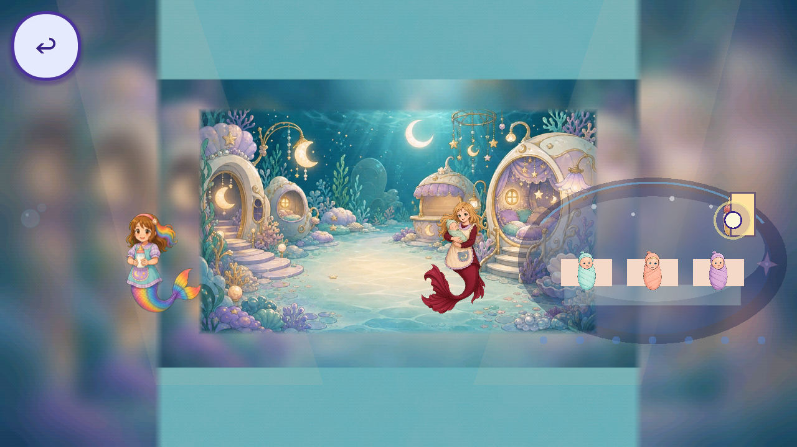
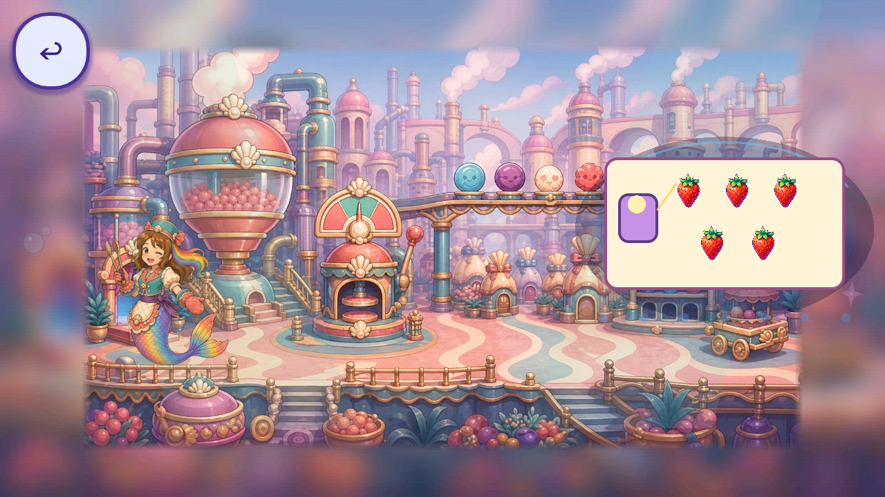
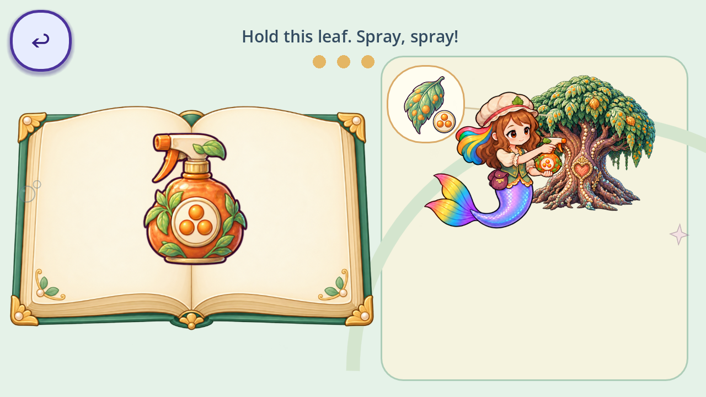

# Draft expanded Day Two job graphics audit

This library expands the first source-art review into the actual job experience: Opera training and freeplay, all eight Day Two birthday job catalogs, shared room entrances, current character poses, controls, effects and persistent cake/candle output studies. The main conclusion is that stronger individual pictures alone will not resolve the visible problems. Several activities combine polished scenery with flat procedural work objects, distant contact points and duplicate subjects. Reuse the suitable approved images, then refine their scale, placement, material and action continuity.

Open the [illustrated library](index.html) to inspect every source and diagnostic frame, search by career, and read each phase evaluation. The [original source and planned-contest review](../day2_art_library_2026-09-30/REPORT.md) remains available with its history. This expansion adds evidence; it does not rewrite earlier opinions as accepted runtime grades.

## Coverage and evidence

The original task specified Day Two. This pass covers its jobs and training comprehensively at the current catalog and source level. Shared Castle room art and a few Day One critters appear because those rooms are career entrances. Day One cleaning-game actions have not been claimed as audited. Planned final-act contests remain separately labeled plans in the earlier library; they do not receive invented runtime captures.

| Coverage | Count | What was inspected |
| --- | ---: | --- |
| Source images | 777 | Original 637 plus 140 newly included room, shared and output-context sources, each with a drafting opinion |
| Sources found in the native node census | 492 | Conservative loaded-input inclusion; some stored textures are inactive in that frame |
| Opera career families | 15 | 70 training/freeplay phases, including the nine extra rehearsal phases in the three enabled two-act performances |
| Day Two birthday catalogs | 8 | All 29 authored job phases, using explicitly declared catalog fixtures |
| Arborist TreeBook practice | 1 | All six pages and a partial treatment fixture |
| Room entrances | 9 | Plus the Opera foyer, at both widths |
| Output studies | 2 | Eight party-table/cake states and two candle closeups |
| Native diagnostic images | 700 | Godot 4.7.2-stable, Mobile renderer, 1280×720 and 1600×720; original lossless WebP output retained |
| Texture usage records | 9,826 | Separate node, slot, phase, beat, screen width, source hash, atlas region and bounds |
| Current career atlas cells | 240 | Every idle, travel, work and cheer cell in all fifteen current 4×4 atlases |
| Code drawing components | 167 | Individual named functions and exact draw call sites; 140 provisional component opinions and 27 explicit unobserved branches/helpers |
| Built-in control instances | 5,491 | Separate controls, labels, panels, progress bars and color/effect rectangles; 2,094 are qualified nonvisual nodes |
| Authored context opinions | 124 | 70 Opera phases, 29 birthday phases, six book pages, nine entrance contexts and ten output states |

The 115 phase/page/output states exclude the nine entrance contexts. The 35 activity contexts include entrances. These are different counting units. Atlas cells are crops from already counted source sheets, and thousands of usage/control instances repeat shared objects. They must not be added together as thousands of distinct defective images.

Production source revision is `ce0331738970205a5aead4d3e0258eb7873a1642`, reconciled into work branch `codex/day2-art-replacements-batch1-20260930`. The [capture manifest](capture_manifest.json), its per-context state files and [supplemental output manifest](output_capture_manifest.json) preserve engine, renderer, time, harness hashes, every frame hash and the direct-state method. [Inventory](inventory.json) links the source and drawing census to per-context usage shards. [Reviews](reviews.json) preserve authored opinions separately from machine checks.

These are diagnostic captures. The harness isolates save writes, selects phases directly, pauses world processing and hides the global HUD. Partial progress, assembly, reward and output states are deliberate fixtures. They do not prove real one-finger input, sequence completion, collision/contact timing, save/load traversal, played motion, or the authoritative layer composition required by DL-QA-11. Output table studies explicitly place the table on an inspection CanvasLayer above a Castle room; they do not certify the actual party/lawn composition. Enlarged candle plates certify neither mounted scale nor flame animation. No canonical runtime grade or owner acceptance is assigned.

## Individual scoring and refinement priorities

The source opinion considers identity, cutout/contour, painted material, broad value/color hierarchy and suitability for the stated role. The context opinion considers work-object ownership, actor contact, relative scale, occlusion, cue hierarchy and continuity. A drawing-component opinion is provisional source-and-picture cross-review, not proof that every branch executed. Built-in repeated styles share an authored style opinion while their actual instances remain separate. Invisible hit areas and dormant fallbacks receive an explicit qualification rather than fabricated defect scores.

The inclusive owner threshold remains **4.5/5 or below**. Exactly 4.5 stays in the refinement queue. A drafting score above that threshold remains an opinion until actual review; a 5/5 requires owner acceptance under DL-VIS-07. No global average or machine pass claims DL-VIS-08 satisfaction.

There are **552 source-image priorities**, including **352 among the 492 sources included by the native census**, and **33 individual current pose-cell priorities**. The [texture usage queue](priority_queue.csv) has 9,822 flagged usages because either the source opinion or its phase context is at/below threshold. This is a repetition-aware review queue, not 9,822 distinct weak artworks. [Detail priorities](detail_priorities.csv) list the individual pose cells, scored procedural components and control instances. Unobserved drawing branches stay explicit in inventory and the gallery rather than disappearing from the audit.

## Oversights that matter most

| Individual item or relationship | Draft opinion | Evidence and refinement |
| --- | ---: | --- |
| Nursery wash station | 2.0 | Open activity largely presents a dot and empty focus oval. Use the approved shell basin with visible hands and a readable wash action. |
| Nursery catching support, pillows and landings | 2.6 context | Current support lacks the nursery material family. D2A-0446 v4 remains owner-rejected as too lifelike. Fresh stylized arms must be judged at mounted scale and during safe contact. |
| Nursery bottle-to-mouth, pat-to-back and cradle/blanket states | 2.7–2.8 | Small detached tools and pale strips/boxes weaken care causality. Each baby and contact is an independent review item. |
| Chef stirring bowl and whisk | 2.5 | The working whisk sits on a detached pale oval/strip while the room already contains a large painted bowl. Reuse one bowl/whisk/batter station. |
| Chef procedural oven | 2.6 | A plain brown box with pale disk overlays another painted oven. The existing shell oven sheet is a reuse candidate. |
| Farmer birthday basket | 2.4 | The fill activity exposes an almost empty oval; the receiving brown circle does not establish a basket rim and accumulated berries. |
| Astronaut pipe tiles, craft and parking arch | 2.9–3.4 | Flat plumbing and a small craft proxy coexist with a large room rocket. Conserve one craft through building, repair, fueling and parking. |
| Painter work canvas and gallery frames | 2.9–3.4 | Several canvases/easels compete. Paint, stamp and hang one continuing picture. |
| Candy strawberry coat/sort/glaze/place surfaces | 2.8–3.4 | The five berries are distinct, but flat panels and an arrow do not establish delivery onto the same cake. |
| Geologist environment, sediment board, fossil and geode | 2.5–3.2 | Flat purple scenery and tan work boards differ strongly from the polished storybook family. Preserve mechanics while refining the named subjects/materials. |
| Detective storybook board | 2.8 | Colored dots in a split rectangle replace recognizable book/clue pictures. Preserve each specific clue from discovery to placement. |
| Detective lens and room framing | 3.2 | A huge readable lens covers a small letterboxed room. Coordinate lens extent, room scale and actor placement. |
| Dining and Movie room floor tiles | 2.9 | D2X-0114/0115 and D2X-0123/0124 use dense perspective grids that compete with softer authored furniture. |
| TreeBook Maple and Dogwood choices | 3.6 context | Black rectangular backgrounds mismatch the clean cutouts. Existing replacement candidates remain owner-pending; originals are preserved. |
| Geologist idle cells 0 and 1 | 3.4 each | The fin is absent in these cells. Current held complete-fin poses should be retained; repair these cells only when a binding needs them. |
| Career work cells with changing tools | 4.5 each | Distinct task keys are useful poses, not generic work in-betweens. Bind each exact tool/gesture to its phase. |
| Ballet ribbon and oversized twirl disk | 3.8–4.0 | The ribbon reads as a segmented fan and the disk dominates acting. Keep continuous edges and visible performer response. |
| Popstar microphone and duplicated arrow layouts | 3.1–3.7 | Sound check is weak before touching; overlay arrows differ from painted floor cues. Use one layout and conserved performer positions. |
| Performance status, result medals and token labels | 3.9 component | Panels compete with the task. Picture feedback must remain primary; numeric text alone does not prove a reading-dependent objective. |

## Job configuration blocker

All eight production-equivalent birthday configurations failed to build the world at the direct setup seam. `OperaHouse.start` supplies the chapter context and adapter, while `OperaCareerWorld2D.setup` forwards its default empty `phase_overrides` array. The adapter validator rejects that empty override. The recorded checks report `root_built: false` and zero phases. This is a reproducible configuration-boundary result, not a claim that a full UI launch was traversed.

The artwork fixtures inject the authored chapter phase catalog so the pictures can still be inspected. Missing authored room-object aliases also produce warnings. These warnings and launch results are separate from the art scores. No runtime fix, finding closure or working-story claim is included in this report. A normal UI launch and subsequent input traversal remain required after the configuration seam is repaired.

## Sequencing and interactions by job

Each phase has its own image set, observation and refinement action in the gallery. The following evaluations explain how the items must work together; they are not averages of source scores.

| Job | Training and world sequence evaluation |
| --- | --- |
| Chef | Mix → stir → bake → frost → top in freeplay; Day Two additionally stacks six tiers. The named work objects frequently change from painted room props to flat proxies. The persistent cake art is stronger, so reuse it to connect input to a conserved bowl/cake and receiving table. |
| Farmer | Plant → water → feed → guide in freeplay; gather five strawberries → basket → kitchen in Day Two. The sky berries, flat receiving circle, miniature basket and generic gate do not yet establish a single physical delivery. Keep the same berries and visible accumulation. |
| Candy Maker | Pour, sort, wrap and delivery should conserve each candy; birthday coating/sorting/glazing/placement should conserve the same five strawberries. Rounded authored trays and clear landing contact should replace independent worksheet-like surfaces. |
| Painter | Paint → stamp → hang needs one continuing picture with exact colors and outline. Several competing canvases make the active output ambiguous. The final receiver must show that same picture. |
| Doctor | Wash, examine, scan, wrap and care need one recognizable patient and local tool contact. A starfish/patient vocabulary change and simple basin geometry weaken the causal chain. |
| Detective | Lens, clue collection, board and chest/candle reveal need the same specific picture tokens. The lens scale and flat birthday board are separate defects. Keep readable room coverage and one clear final target. |
| Ballerina | Rehearsal and stage are independently evaluated. Large exact pose pictures help matching, while ribbon subdivisions and dominant twirl disks weaken acting. Birthday mirror/twirl/bow should show the same stuffies responding to Roshan. |
| Magician | Rehearsal and stage preserve recognizability of hats, Lamba and portal, but miniature hats, thin rope and flat cabinet surfaces need refinement. Actual conceal/reveal/shuffle continuity remains unplayed. |
| Popstar | Rehearsal and stage have separate microphone, dance and echo opinions. Birthday sound check, Rumi staging, rhythm and encore need one matched layout with a visible sound-to-acting response. Still fixtures do not prove phrase timing or a bow. |
| Boxer | The accepted first-person layout is retained as the specialist design. Authored mitts are strong reuse candidates; flat gloves/belt/impact graphics and actual friendly hit contact need individual review. Hiding Roshan in this mode is not itself reported as a defect. |
| Racer | Tune → push → race has a clearer full-stage circuit, but tiny tuning contact and a second flat starting arch weaken the preparation seam. Review steering, drift, turbo, walls, both laps and finish through actual input. |
| Astronaut | Pipes/repair/valve/launch or birthday build/patch/valve/park should develop one craft. The room rocket and little proxy compete. Preserve repairs and fuel state at the actual craft before the final departure/parking result. |
| Nursery | Wash → catch → feed → burp → bedtime needs conserved baby identities and visible safe support throughout. The small boxed room, empty wash activity, flat pillow/bed surfaces and detached contacts are independent priorities. A motion study cannot approve rejected arm styling. |
| Geologist | River → fossil uncover/assemble → pan → geode/gallery has concrete actions, but scenery, boards, fragments and minerals remain schematic. Whole fossil, all pieces and finds must remain conserved; final assembly and opened-geode fixtures are supplied for inspection. |
| Teacher | Concrete patterns, counting and shapes are among the clearer activities. The large board sidelines the actor and room. Preserve picture/voice math and improve material hierarchy; labels alone do not establish a reading dependency. |
| Arborist | Tree → symptom → spray → carry → treat → recovery is the clearest causal image sequence. Specific black-backed tree choices and crowded spray contact should be repaired while preserving this structure and patient identity. |

The output study follows empty table → unstirred batter → stirred batter → six baked tiers → stacked → frosted → prepared berries → placed berries/candle. Approved stage images preserve rainbow order and object identity better than the activity proxies. Contact with the receiving table, surrounding panel and side reward scale still require the actual room/lawn seam. The two candle closeups receive 4.6 source/context drafting opinions because their conserved silhouette and broad flame colors are clear; this does not approve the tiny mounted candle or flame motion.

## Existing replacements and local motion

The [initial eight-file replacement packet](../../assets_src/imagegen/day2_replacements_batch1_20260930/REPORT.md) remains a draft. Seven candidates await owner review. Nursery v4 has an explicit owner style rejection despite improvement and its historical 4.5 Codex opinion. It has not been integrated or relabeled accepted. The expanded audit supplies additional individual refinement targets; it does not claim those hundreds of targets were regenerated during this audit expansion.

The [five-study ComfyUI queue](../../assets_src/local_motion/day2_batch1_20260930/index.html) remains separate. All five native renders completed: puff, nursery support, wheel, Maple and Dogwood. The [playable motion review](motion/index.html) displays every complete 41-frame, 896×512, 24 fps reference clip, five sampled pictures, individual sample opinions and its native execution receipt. Puff receives 4.0, nursery support 3.8, wheel 3.1, Maple 4.2 and Dogwood 4.1 as limited sample opinions. The wheel's shell petals visibly change topology in those samples; the nursery's rejected style remains unresolved. Every study is still a refinement priority. Complete-frame identity, action, loop and owner review remain pending.

The wider checkout removed committed prompt files while the first render ran, so the worker stopped after execution. Exact committed packet files were restored and verified, and the worker resumed by reusing the completed receipt without submitting the puff twice. [Queue observation](motion/queue_observation.json) records all five completed native renders. The later four followed the matching execution benchmark and native queue/quiet-window admission. These outputs cannot grant full-frame cinematic delivery acceptance, repair rejected still styling, or approve game integration. No queue tool or installed Comfy workflow was changed.

## Refresh and acceptance

The [reversible refinement gallery](../../assets_src/imagegen/day2_refinement_20261001/index.html) preserves fresh nursery arms attempts 5 and 6, all three pillow attempts, prompts, native candidates, separate runtime-sized derivatives and per-attempt opinions. Arms attempt 6 and each of the five pads in pillow attempt 3 receive a provisional **4.6 source opinion**. Earlier attempts remain visible below the bar. The pillows require the declared atlas sampling region; a direct PNG substitution would shrink the usable artwork. Neither candidate has passed mounted contact, owner approval or integration review, and the current live originals remain unchanged. The [work queue](../../assets_src/imagegen/day2_refinement_20261001/work_queue.json) retains all 552 original source priorities, component and pose refinements, and the distinction between live-use candidates and inactive references.

The [timed action review](../day2_action_continuity_20261001/index.html) adds eleven native viewport-input traces: pour, stir, candy wrap, doctor cast, berry picks and nursery catching, with longer repeated pours, corrected berry input, and original versus fresh arms. These open-state fixtures use actual finger-zero viewport events rather than progress setters. The corrected berry trace picks five distinct berries and enters the next phase; both longer nursery traces record five catches and zero misses. The first berry trace's fourth missed press came from the experimental driver and is retained with that qualification. Every captured opaque RGB frame was recovered from its lossless archive and pixel-hash checked; exact key WebPs and original capture byte hashes remain available. Browser MP4s are reduced inspection encodes, with no motion interpolation or subject repair.

These first timed reviews score the actual presentation at 2.3–3.0. Candy ends twist around a flat central candy shape without an enclosing wrapper fold; the doctor's three straight strips do not conform around the patient's intended arm; stirring uses a detached work oval; collected berries dim in place without visible transfer; and nursery hands, landing pads and settled baby positions do not yet establish continuous support. The pilots do not establish normal room launch, full campaign traversal, all transient states or target-device acceptance. The whisk rotation follows the actual pointer angle in the trace, so a blanket claim that its direction is always wrong would be unsupported. Every identified relationship remains a separate repair and review target.

The owner has commissioned a reversible refinement pass for every weak in-game object, with repeated review and regeneration until each reaches at least 4.5/5. The working aim is 4.6 so a replacement clears this first pass's inclusive priority cutoff. Preserve originals, rejected candidates and score history; distinguish actually drawn objects from merely stored textures and inactive references. Reuse suitable approved art before generating a named replacement gap.

That refinement pass also requires action continuity across the jobs. Source-image quality cannot approve a workflow by itself. Inspect the real utensil-to-batter contact and stirring direction; the bowl or ladle's pivot, spout, stream, landing and remaining contents; each berry's attachment, detachment, transfer and accumulation; wrapper folds actually enclosing the same candy; and a bandage conforming to the intended arm rather than crossing a detached panel. Apply the same conserved-object, physical-contact and meaningful-state review to every job phase. Still fixtures in this packet do not establish those action results. Timed input traces, contact views and candidate action sequences will be added as subsequent evidence, without relabeling this static first pass as played-motion acceptance.

The thread goal remains active for owner review and subsequent refinements. To trigger an update after underlying game changes, request “refresh the all-job graphics audit.” Refresh must compare the stored production/controller/source hashes with the chosen new revision, add new routes/phases/items, preserve earlier score history and owner rejections, recapture changed contexts and re-author affected opinions. Do not copy stale phase reviews onto changed art.

The executable capture commands are `godot_console.exe --path . --rendering-method mobile --script tools/capture_day2_job_contexts.gd` and the supplemental `tools/capture_day2_job_outputs.gd`, using exactly Godot 4.7.2-stable. Run with an isolated save and an offscreen window. The main capture writes a raw manifest; `python -B tools/build_day2_job_context_library.py --package --census --contacts --cells` partitions records and builds inspection derivatives. Review edits live in `reviews.json`; `--render --check` rebuilds the gallery and verifies recorded freshness/completeness. A recapture is an intentional new evidence revision, not an automatic grade or approval.

Machine verification, implementation and creative acceptance remain separate. [Verification](verification.json) checks frame/source freshness, preview availability, opinion/qualification coverage and the text-scanner size limit. [Machine evidence](machine_evidence.json) records parser, engine and repository gates. The [full-suite receipt](suite_evidence.json) and raw segment logs record all required static gates and **82 trusted probes passing**, with the original CI script and tests unchanged. Missing sparse-checkout inputs were restored from their exact tracked bytes; the original run and its two missing-audio-bus failures remain recorded alongside passing reruns. This is an aggregate of documented suite resumptions, not a claim that the initial single invocation exited successfully. [Payload manifest](MANIFEST.json) and remote receipt bind the published packet to exact bytes. None of these checks establish master-audit satisfaction.

Owner approval of this comprehensive report is pending. Real UI/input traversal, transient effects and demonstrations, all race/catch timing states, authoritative layer ownership, save/load completion, target-device performance and child acceptance remain open. Protected book art, family voices and friend originals are unchanged. Related master findings retain their existing lifecycle; this packet provides drafting evidence and individual review targets without closing them.
