# Candy Maker — step-by-step visual walkthrough

This walkthrough shows Candy Maker’s recorded birthday preview, plus ordinary play and save/resume steps. Native images are preserved; source-only panels identify missing screenshots. The recorded preview comes from an unintegrated runtime candidate and predates a held placement drawing change. This packet documents preview behavior; it does not certify the shipping build or establish 4.6/5 clearance.

Godot 4.7.2-stable · Mobile renderer · Speedy · Desktop 1280×720. Prior story used an isolated prerequisite fixture; Candy itself was earned with 173 real touch/drag events. Ordinary and reload results have headless evidence only. Sparse PLACE/reward frames are not full-speed or 30 fps coverage. Action audio is scripted, not recorded.

Machine logic and capture checks are separate from visual/contact, device, child and owner acceptance. No scores or findings change. Cake support and tool choice remain pending. The original native-supervisor filename failure and the later 600 s preparation-cap failure are preserved.

[Browser version](index.html) · [Step manifest](STEPS.json) · [Source binding](SOURCE_BINDING.json) · [Payload hashes](MANIFEST.json)

Native originals below are from the frozen480 preview. Open the separate SVG annotation for gesture marks. Every source-only panel says NO NATIVE SCREENSHOT. The action prompt is scripted; actual audio playback is unverified.

## Birthday: five strawberries for one persistent cake

Entry, station invitations, earned activity checkpoints, placement intermediates, result, reward and return.

### B01 — Reach the Kitchen after Farmer and Chef

**SOURCE ONLY · NO NATIVE SCREENSHOT.** Approved artwork reference; this is not a gameplay frame.

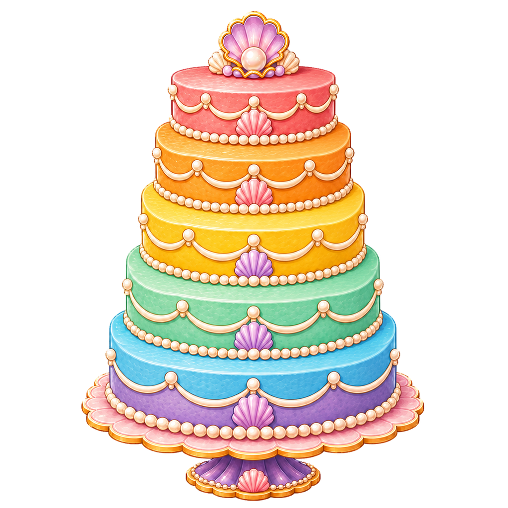

[Separate annotation / full reference](annotations/B01.svg)

**See:** Farmer supplies five strawberries; Chef finishes the six-tier frosting. Candy is the next story job.

**Touch:** Follow the active pictured room route to the Kitchen. The birthday foyer may guide to this same room.

**Roshan / contact:** Roshan must travel through the normal story route; the captures begin from an explicit Kitchen fixture.

**Result:** Cake begins frosted, with no mounted fruit or candle (0x1F).

**Next:** Tap the Candy Maker picture card.

**Evidence gap:** Normal preceding-story and foyer travel are not captured. MA-PLAY-005 remains open; no fresh-save reachability claim.

### B02 — Tap the Candy Maker picture card

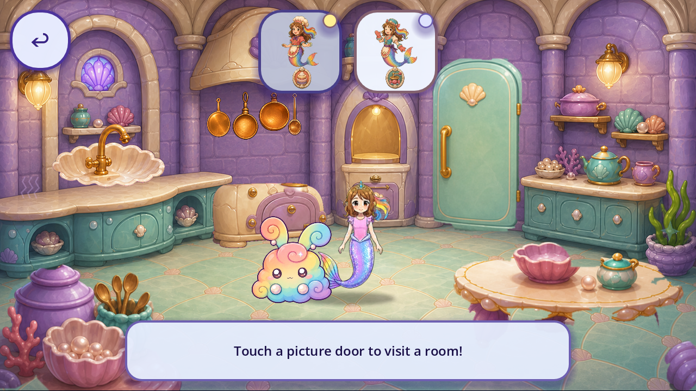

[Separate annotation / full reference](annotations/B02.svg) · [Full-size native original](native/view-00.png)

**See:** Chef is the left card; Candy Maker is the right card. The pale pearl is the completion cue.

**Touch:** Tap the right picture card at the top (recorded point 728,95).

**Roshan / contact:** Roshan is in the Kitchen beside the rainbow dust bunny.

**Result:** The real card opens the Candy workshop; no Candy phase is awarded by entry.

**Next:** Find the first glowing station.

**Evidence gap:** The Kitchen screenshot displays a generic room hint. A voiced, Candy-specific entry cue is not established here.

### B03 — Open COAT at the first glowing station

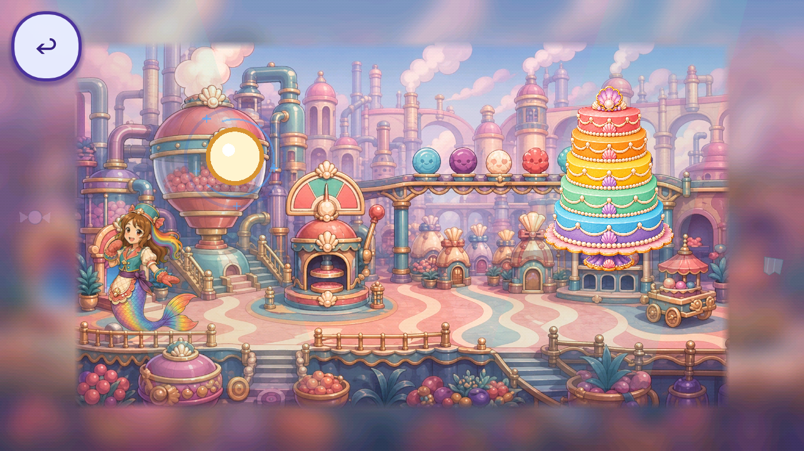

[Separate annotation / full reference](annotations/B03.svg) · [Full-size native original](native/view-01.png)

**See:** Five supplied berries will be coated; the bare frosting cake is on the right.

**Touch:** Tap the large glowing circle on the left machine (374.47,252).

**Scripted instruction:** “Tip the shiny coat over the strawberries!” Voice-catalog caption: “Tip the shiny coat over the strawberries!” (audio not recorded).

**Roshan / contact:** Roshan starts at the left, then approaches the selected station.

**Result:** Arrival opens the action panel without earning coating.

**Next:** Touch and hold the pictured pour control.

### B04 — Hold the coating pour control

[Separate annotation / full reference](annotations/B04.svg) · [Full-size native original](native/view-02.png)

**See:** Five strawberries and the purple control appear beside the unchanged cake.

**Touch:** Press and hold the purple control in the right panel (958.96,407.16); release to stop.

**Scripted instruction:** “Tip the shiny coat over the strawberries!” Voice-catalog caption: “Tip the shiny coat over the strawberries!” (audio not recorded).

**Roshan / contact:** Roshan has approached the station and holds her existing costume tools; continuous hand-to-control contact is unverified.

**Result:** Deliberate holding increases coating fill. Holding the pour control is the intended verb.

**Next:** Continue until all five coating marks are filled.

**Evidence gap:** No saved native mid-pour image or continuous pour sequence. Tool/stream contact remains a visual gap.

### B05 — Finish coating all five

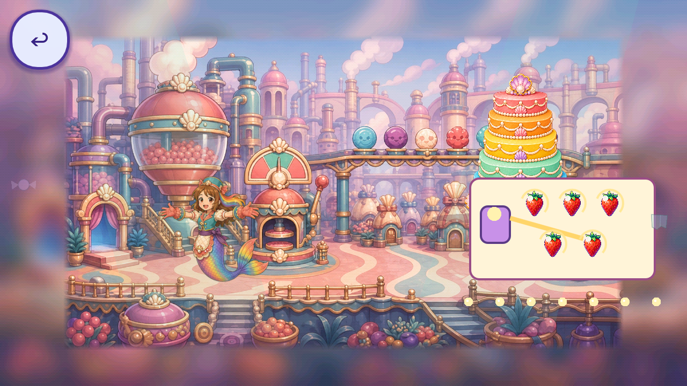

[Separate annotation / full reference](annotations/B05.svg) · [Full-size native original](native/view-03.png)

**See:** Yellow coating arcs surround all five berries and the bottom progress pearls fill.

**Touch:** Release after the coating completes; no extra tap is needed to advance.

**Scripted instruction:** “Tip the shiny coat over the strawberries!” Voice-catalog caption: “Tip the shiny coat over the strawberries!” (audio not recorded).

**Roshan / contact:** Roshan opens her arms in feedback; this does not prove a physically authored pour.

**Result:** COAT reaches 5/5. The persistent cake remains 0x1F and Candy phase 0 is saved.

**Next:** SORT becomes the next invitation.

### B06 — Open SORT at the centre machine

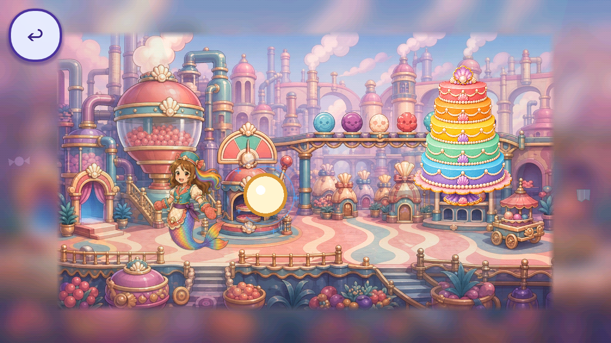

[Separate annotation / full reference](annotations/B06.svg) · [Full-size native original](native/view-04.png)

**See:** The next station is marked by the large yellow-white invitation circle.

**Touch:** Tap the glowing centre station (555.82,410.4).

**Scripted instruction:** “Sort the same strawberries by their matching color!” Voice-catalog caption: “Sort the strawberries by their matching color!” (audio not recorded).

**Roshan / contact:** Roshan approaches the new station.

**Result:** SORT opens with five unsorted strawberries; arrival gives no sorting credit.

**Next:** Drag one berry at a time into its matching colored lane.

### B07 — Drag matching strawberry colors

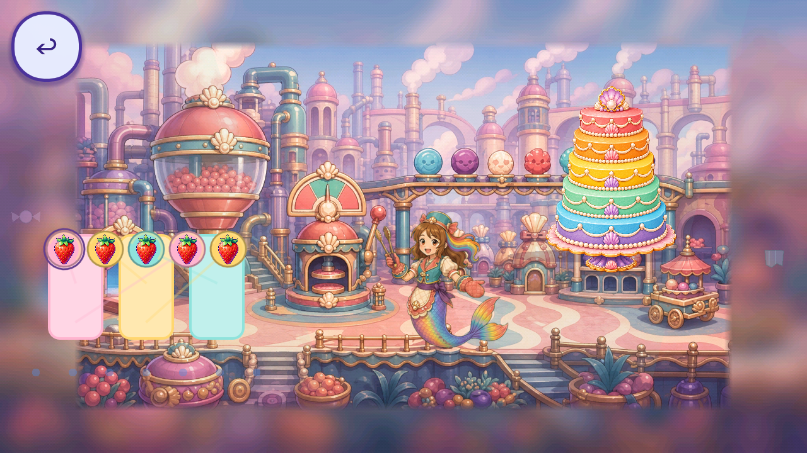

[Separate annotation / full reference](annotations/B07.svg) · [Full-size native original](native/view-05.png)

**See:** The five identical berry artworks have colored rings: pink/yellow/aqua/pink/yellow.

**Touch:** Drag each berry with one finger into its matching pink, yellow or aqua lane; release inside the lane.

**Scripted instruction:** “Sort the same strawberries by their matching color!” Voice-catalog caption: “Sort the strawberries by their matching color!” (audio not recorded).

**Roshan / contact:** Roshan stands at the centre-right work position, holding tools. The fruit move in a separate panel at the left.

**Result:** A real drag of at least 24 px into the matching lane accepts that distinct berry. Wrong-bin or stationary releases reset it without awarding progress.

**Next:** Repeat for the remaining berries.

**Evidence gap:** No native SORT midpoint/contact image. Arrows explain source/input anchors over the start image; they do not prove an intervening pose.

### B08 — Finish five sorted strawberries

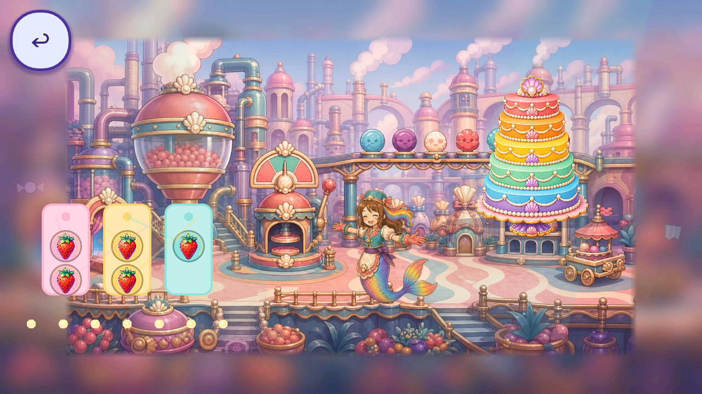

[Separate annotation / full reference](annotations/B08.svg) · [Full-size native original](native/view-06.png)

**See:** The sorted panel shows two pink, two yellow and one aqua strawberry.

**Touch:** Drop the fourth pink and fifth yellow berries into their matching lanes.

**Scripted instruction:** “Sort the same strawberries by their matching color!” Voice-catalog caption: “Sort the strawberries by their matching color!” (audio not recorded).

**Roshan / contact:** Roshan gives a cheerful open-arm response; carrying/drop contact remains unverified.

**Result:** SORT reaches 5/5; the persistent cake is still 0x1F.

**Next:** GLAZE is invited.

### B09 — Open GLAZE by the crank station

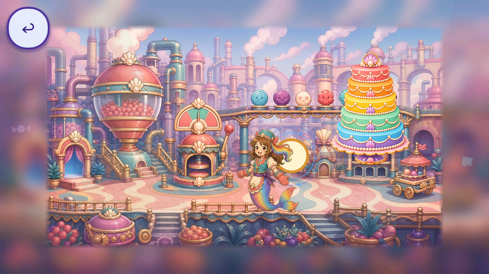

[Separate annotation / full reference](annotations/B09.svg) · [Full-size native original](native/view-07.png)

**See:** The invitation is beside Roshan, before the action panel opens.

**Touch:** Tap the glowing right-centre station (763.07,410.4).

**Scripted instruction:** “Twist the glaze around each strawberry!” Voice-catalog caption: “Twist the glaze around each strawberry!” (audio not recorded).

**Roshan / contact:** Roshan moves to the glaze work position.

**Result:** The panel opens without glaze credit.

**Next:** Trace around the purple crank.

### B10 — Trace circles around the crank

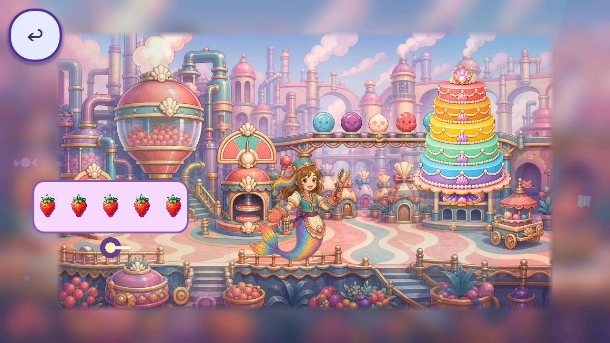

[Separate annotation / full reference](annotations/B10.svg) · [Full-size native original](native/view-08.png)

**See:** Five strawberries wait in the purple strip above the crank.

**Touch:** Keep one finger down and trace circles around the purple crank centre (232,520.4). The captured test radius was 40 px.

**Scripted instruction:** “Twist the glaze around each strawberry!” Voice-catalog caption: “Twist the glaze around each strawberry!” (audio not recorded).

**Roshan / contact:** Roshan holds gold tongs at the work position. The crank remains separated from her hands.

**Result:** Angular finger movement earns glaze progress; stationary taps or elapsed time alone do not.

**Next:** Keep circling toward two full turns.

**Evidence gap:** Gold tongs versus mittened-hand contact remains an unanswered owner decision.

### B11 — See glaze build at half a turn

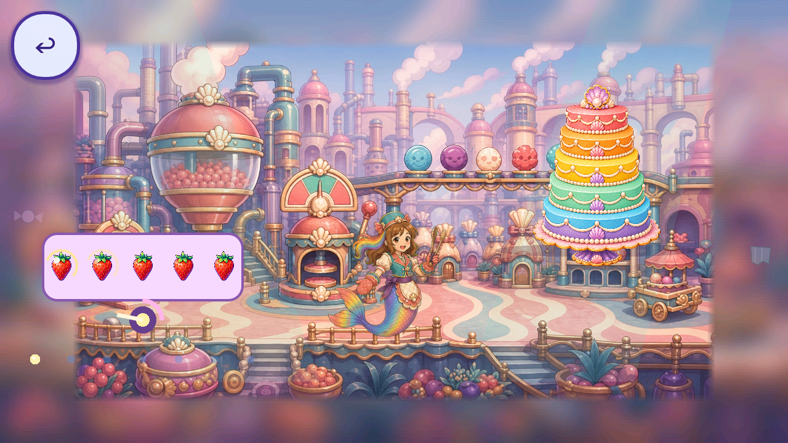

[Separate annotation / full reference](annotations/B11.svg) · [Full-size native original](native/view-09.png)

**See:** At roughly 0.5 of the 2-turn goal, yellow shine arcs appear on the early berries.

**Touch:** Continue tracing; lifting your finger pauses earned progress.

**Scripted instruction:** “Twist the glaze around each strawberry!” Voice-catalog caption: “Twist the glaze around each strawberry!” (audio not recorded).

**Roshan / contact:** Roshan remains in her tongs-holding pose; matching crank contact is not demonstrated.

**Result:** The real trace recorded a mid-action release and re-press without passive gain.

**Next:** Resume circles from the same control.

### B12 — Continue after nearly one turn

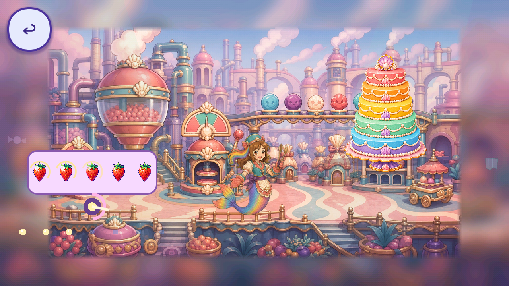

[Separate annotation / full reference](annotations/B12.svg) · [Full-size native original](native/view-10.png)

**See:** More strawberries show glaze shine; this checkpoint records progress 0.96875 of 2.

**Touch:** Continue circling with one finger until the 2-turn goal completes.

**Scripted instruction:** “Twist the glaze around each strawberry!” Voice-catalog caption: “Twist the glaze around each strawberry!” (audio not recorded).

**Roshan / contact:** The actor pose changes, but the tongs do not demonstrate berry contact.

**Result:** Progress continues only with traced rotation.

**Next:** Complete glazing all five.

### B13 — Finish glazing

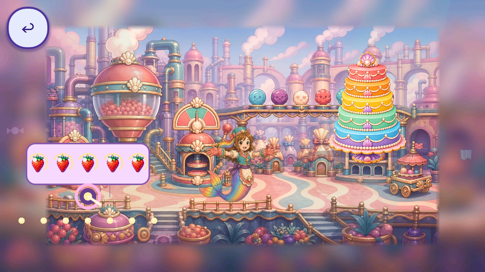

[Separate annotation / full reference](annotations/B13.svg) · [Full-size native original](native/view-11.png)

**See:** All five berries show shine arcs; the bottom progress pearls are full.

**Touch:** Release once the glaze goal has completed.

**Scripted instruction:** “Twist the glaze around each strawberry!” Voice-catalog caption: “Twist the glaze around each strawberry!” (audio not recorded).

**Roshan / contact:** Roshan celebrates with open arms.

**Result:** The milestone then adds cake bit 5:0x1F becomes 0x3F. No fruit is mounted on the cake yet.

**Next:** Look for the separate candied tray and PLACE station.

### B14 — Invite PLACE with the separate tray

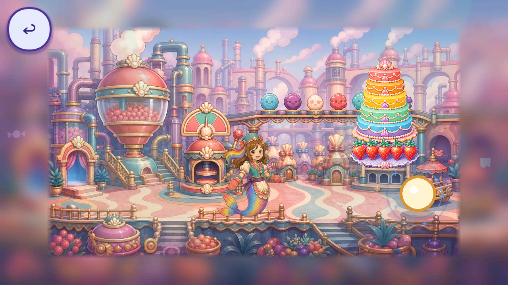

[Separate annotation / full reference](annotations/B14.svg) · [Full-size native original](native/view-12.png)

**See:** Exactly five candied berries sit on a separate tray directly below the bare frosted cake.

**Touch:** Tap the glowing cart-side station (1053.24,489.6).

**Scripted instruction:** “Place the five candied strawberries on the actual cake!” Voice-catalog caption: “Place the five candied strawberries on the cake!” (audio not recorded).

**Roshan / contact:** Roshan approaches the right-side work position.

**Result:** PLACE opens with 0/5 accepted berries.

**Next:** Tap each distinct berry in the placement panel.

**Evidence gap:** The separate tray visually resembles a fruit ring already attached to the cake. It is a separate sprite, not baked fruit in the frosting bitmap. Cake support/staging remains undecided.

### B15 — Tap each of the five tray berries

[Separate annotation / full reference](annotations/B15.svg) · [Full-size native original](native/view-13.png)

**See:** The task tray is at the left; Roshan and the large cake are at the right.

**Touch:** Tap the five distinct berries at (108,401.2),(170,401.2),(232,401.2),(138,475.2),(202,475.2).

**Scripted instruction:** “Place the five candied strawberries on the actual cake!” Voice-catalog caption: “Place the five candied strawberries on the cake!” (audio not recorded).

**Roshan / contact:** Roshan holds tongs; the purple helper stands between her and the detached tray.

**Result:** Each unique berry tap earns one placement. Repeating a filled slot does not consume a neighbour.

**Next:** Watch the first accepted berry.

**Evidence gap:** This native image is the older 480 placement drawing. Current A319 drawing is uncaptured; contact/action is not accepted.

### B16 — Accept berry 1 of 5

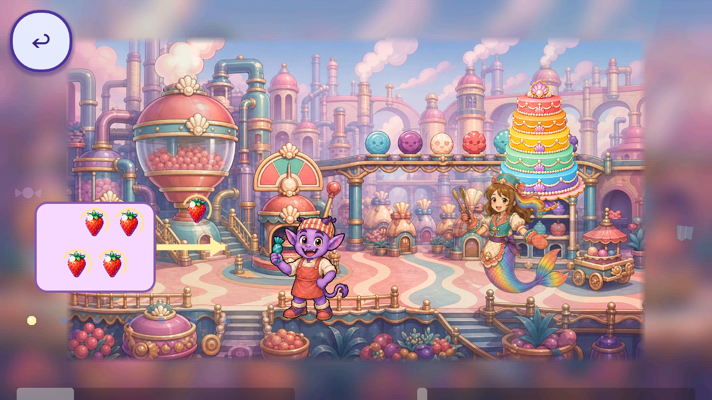

[Separate annotation / full reference](annotations/B16.svg) · [Full-size native original](native/frame-0025.png)

**See:** The tray loses the accepted berry. In captured 480, accepted berries form a column beside the stairs.

**Touch:** Tap distinct berry 1 at (108, 401.2); do not re-tap used berries.

**Scripted instruction:** “Place the five candied strawberries on the actual cake!” Voice-catalog caption: “Place the five candied strawberries on the cake!” (audio not recorded).

**Roshan / contact:** Roshan changes feedback pose at the right. No berry is carried by her tongs; placing contact, release and settle are missing.

**Result:** Accepted count 1/5. Cake mask stays 0x3F during the active phase.

**Next:** Tap the next unused berry.

**Evidence gap:** Frozen 480 visible defect: fruit appear remotely beside the stairs instead of on the cake. A319 changes destination drawing only; no native proof yet.

### B17 — Accept berry 2 of 5

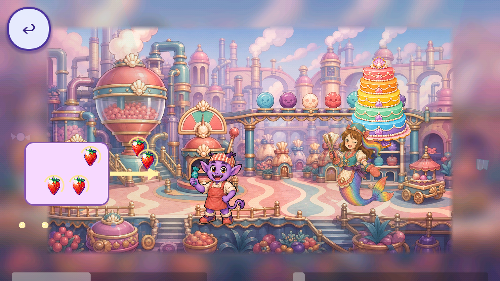

[Separate annotation / full reference](annotations/B17.svg) · [Full-size native original](native/frame-0033.png)

**See:** The tray loses the accepted berry. In captured 480, accepted berries form a column beside the stairs.

**Touch:** Tap distinct berry 2 at (170, 401.2); do not re-tap used berries.

**Scripted instruction:** “Place the five candied strawberries on the actual cake!” Voice-catalog caption: “Place the five candied strawberries on the cake!” (audio not recorded).

**Roshan / contact:** Roshan changes feedback pose at the right. No berry is carried by her tongs; placing contact, release and settle are missing.

**Result:** Accepted count 2/5. Cake mask stays 0x3F during the active phase.

**Next:** Tap the next unused berry.

**Evidence gap:** Frozen 480 visible defect: fruit appear remotely beside the stairs instead of on the cake. A319 changes destination drawing only; no native proof yet.

### B18 — Accept berry 3 of 5

[Separate annotation / full reference](annotations/B18.svg) · [Full-size native original](native/frame-0041.png)

**See:** The tray loses the accepted berry. In captured 480, accepted berries form a column beside the stairs.

**Touch:** Tap distinct berry 3 at (232, 401.2); do not re-tap used berries.

**Scripted instruction:** “Place the five candied strawberries on the actual cake!” Voice-catalog caption: “Place the five candied strawberries on the cake!” (audio not recorded).

**Roshan / contact:** Roshan changes feedback pose at the right. No berry is carried by her tongs; placing contact, release and settle are missing.

**Result:** Accepted count 3/5. Cake mask stays 0x3F during the active phase.

**Next:** Tap the next unused berry.

**Evidence gap:** Frozen 480 visible defect: fruit appear remotely beside the stairs instead of on the cake. A319 changes destination drawing only; no native proof yet.

### B19 — Accept berry 4 of 5

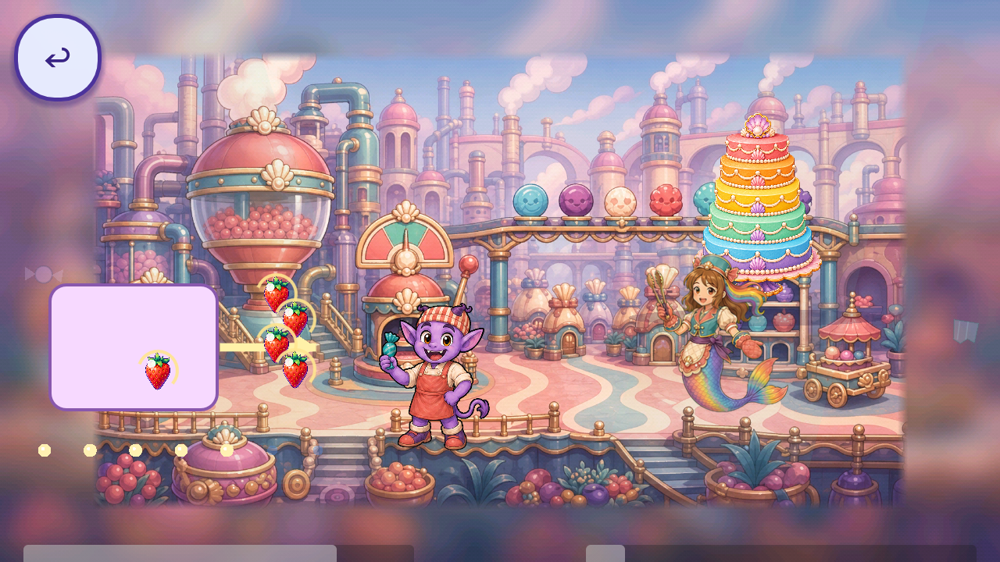

[Separate annotation / full reference](annotations/B19.svg) · [Full-size native original](native/frame-0049.png)

**See:** The tray loses the accepted berry. In captured 480, accepted berries form a column beside the stairs.

**Touch:** Tap distinct berry 4 at (138, 475.2); do not re-tap used berries.

**Scripted instruction:** “Place the five candied strawberries on the actual cake!” Voice-catalog caption: “Place the five candied strawberries on the cake!” (audio not recorded).

**Roshan / contact:** Roshan changes feedback pose at the right. No berry is carried by her tongs; placing contact, release and settle are missing.

**Result:** Accepted count 4/5. Cake mask stays 0x3F during the active phase.

**Next:** Tap the next unused berry.

**Evidence gap:** Frozen 480 visible defect: fruit appear remotely beside the stairs instead of on the cake. A319 changes destination drawing only; no native proof yet.

### B20 — Accept berry 5 of 5

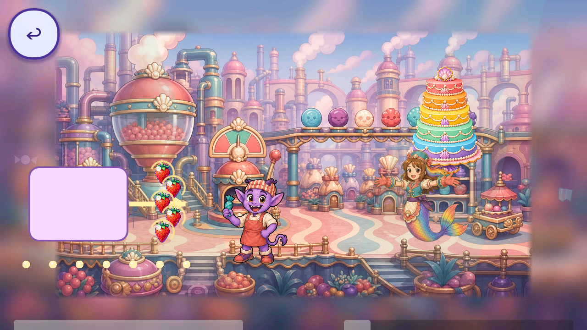

[Separate annotation / full reference](annotations/B20.svg) · [Full-size native original](native/frame-0057.png)

**See:** The tray loses the accepted berry. In captured 480, accepted berries form a column beside the stairs.

**Touch:** Tap distinct berry 5 at (202, 475.2); do not re-tap used berries.

**Scripted instruction:** “Place the five candied strawberries on the actual cake!” Voice-catalog caption: “Place the five candied strawberries on the cake!” (audio not recorded).

**Roshan / contact:** Roshan changes feedback pose at the right. No berry is carried by her tongs; placing contact, release and settle are missing.

**Result:** Accepted count 5/5. Cake mask stays 0x3F during the active phase.

**Next:** Let the earned phase close and show the saved cake.

**Evidence gap:** Frozen 480 visible defect: fruit appear remotely beside the stairs instead of on the cake. A319 changes destination drawing only; no native proof yet.

### B21 — Show the final saved cake

[Separate annotation / full reference](annotations/B21.svg) · [Full-size native original](native/view-15.png)

**See:** The task panel disappears and the five-strawberry grand cake replaces the frosting-stage image. There is no candle.

**Touch:** Wait through the earned result hold; repeated taps are unnecessary.

**Roshan / contact:** Roshan celebrates beside the cake; the helper may overlap the scene.

**Result:** Cake mask 0x7F and Candy phase mask 0x0F are earned and saved. The designed result hold is 2.2 seconds.

**Next:** Watch the final feedback and stage celebration.

**Evidence gap:** The final image swap does not prove the missing last-placement/release/settle action. The cake floats above its support.

### B22 — See the celebration pose

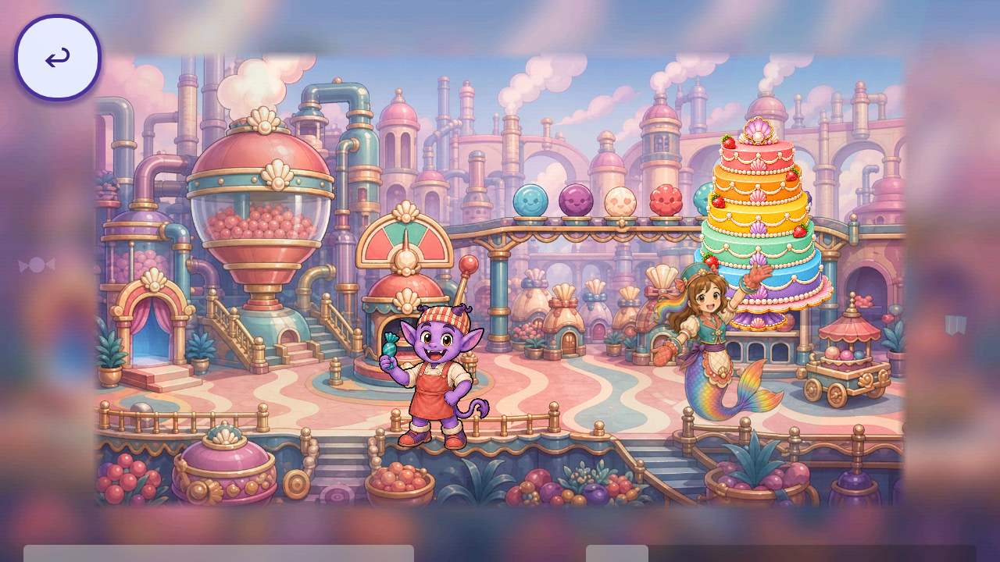

[Separate annotation / full reference](annotations/B22.svg) · [Full-size native original](native/frame-0087.png)

**See:** Roshan raises her hand beside the completed cake.

**Touch:** No gesture is required; let the reward sequence play.

**Roshan / contact:** A wave/open-hand pose supplies celebration feedback, not a placing action.

**Result:** The cake remains 0x7F during feedback.

**Next:** The scene moves to the reward stage.

**Evidence gap:** Sparse stills are not full-speed or frame-step coverage of every transition.

### B23 — Receive the birthday-job reward

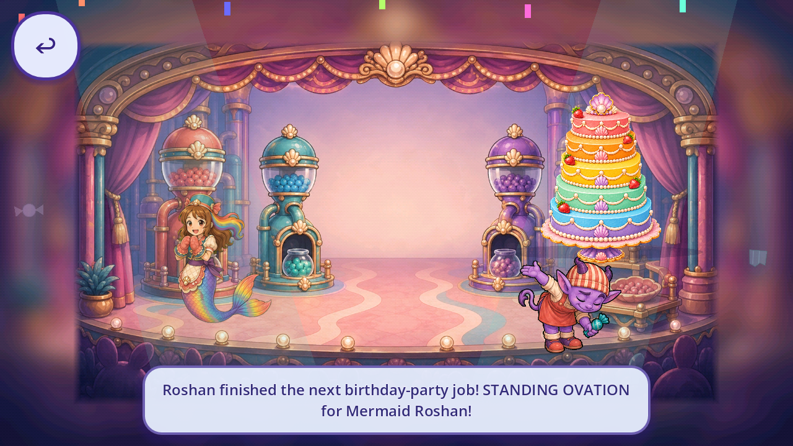

[Separate annotation / full reference](annotations/B23.svg) · [Full-size native original](native/frame-0088.png)

**See:** Confetti, the helper and Roshan appear on the reward stage. The visible message says: Roshan finished the next birthday-party job! STANDING OVATION for Mermaid Roshan!

**Touch:** Let the short stage celebration finish.

**Roshan / contact:** Roshan claps while the helper bows.

**Result:** The birthday route advances the party job; it does not earn an ordinary Opera star.

**Next:** Return automatically to the Kitchen.

**Evidence gap:** No audio recording or device pacing is available; the visible reward caption is genuine.

### B24 — Return to the Kitchen

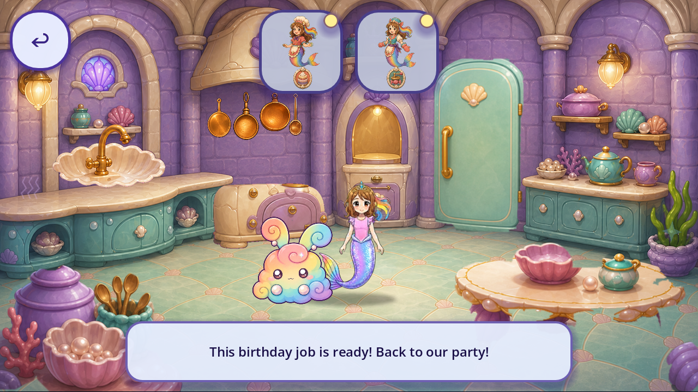

[Separate annotation / full reference](annotations/B24.svg) · [Full-size native original](native/view-16.png)

**See:** The Candy card now has a gold completed pearl. The visible caption says: This birthday job is ready! Back to our party!

**Touch:** The earned return is automatic. Use the pictured Back/room routes to continue the party.

**Roshan / contact:** Roshan and the rainbow dust bunny are back in the Kitchen.

**Result:** Saved cake 127/party 73/Candy-phase 15 remain intact. The birthday Candy card is completed/disabled.

**Next:** Move on to the next story job, Painter.

**Evidence gap:** Next normal story travel and Painter are outside this Candy capture. No full-party or fresh-save route acceptance.

## Leave, save and resume

What the machine tests established, with explicit native-image gaps.

### L01 — Leave after a completed phase and resume

**SOURCE ONLY · NO NATIVE SCREENSHOT.** Approved artwork reference; this is not a gameplay frame.

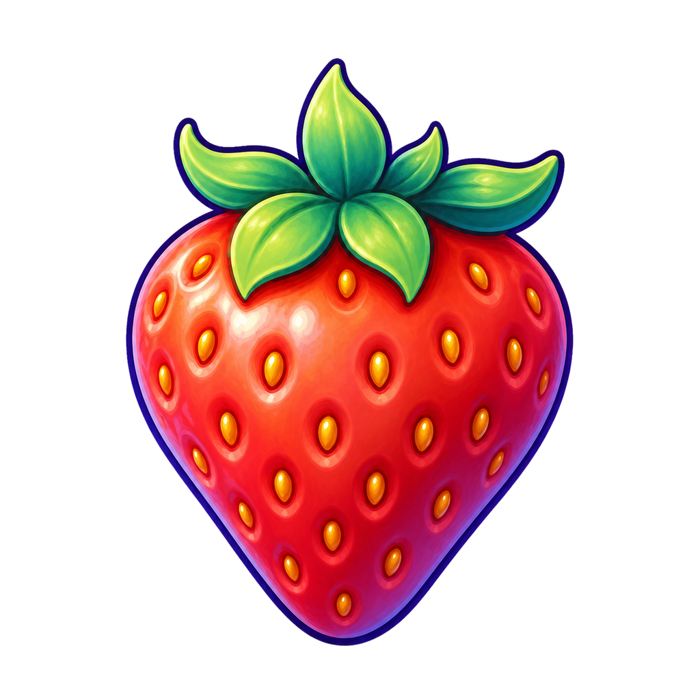

[Separate annotation / full reference](annotations/L01.svg)

**See:** A completed coating phase is stored; the next task invitation is SORT.

**Touch:** Use Back after completing COAT, then re-open the same Candy card.

**Roshan / contact:** Roshan returns to the Kitchen, then approaches the next station on re-entry.

**Result:** A separate real-input test earned phase 0, tapped Back, reopened the card and resumed SORT at zero sorting progress.

**Next:** Continue from B06.

**Evidence gap:** Machine evidence only. No native leave/re-entry panels; no fresh-process partial-phase or partial-gesture retention claim.

### L02 — Reload a completed birthday job

**SOURCE ONLY · NO NATIVE SCREENSHOT.** Approved artwork reference; this is not a gameplay frame.

[Separate annotation / full reference](annotations/L02.svg)

**See:** The birthday cake and completed pearl are retained.

**Touch:** Choose Continue, reopen the Kitchen and inspect the completed Candy card.

**Roshan / contact:** Roshan returns via production Continue in the headless test; the Kitchen is explicitly mounted.

**Result:** Separate-engine restore retained 113 existing keys, cake 127 and party 73. The completed birthday card stays disabled.

**Next:** Continue the remaining party jobs; ordinary play is a later route.

**Evidence gap:** Native Continue/restore/travel images are missing. Headless fixture entry does not establish normal-route travel.

## Held current source: uncaptured placement repair

The newer drawing change. No repaired screenshot, new staging, animation or acceptance is claimed.

### R01 — Current placement change has no screenshot yet

**SOURCE ONLY · NO NATIVE SCREENSHOT.** Approved artwork reference; this is not a gameplay frame.

[Separate annotation / full reference](annotations/R01.svg)

**See:** The current A319 source draws accepted berries at five upper-tier frosting sockets, with the next cue on that same cake transform.

**Touch:** The held current preview still accepts one tap per distinct tray berry; input rules are unchanged.

**Roshan / contact:** The change adds no holding/contact/release/settle animation and chooses no cake support.

**Result:** 240 CPU coordinate cases plus parser/lint/static gates passed. No current-source engine/native evidence. The earlier 600 s preparation cap overran to 675.034207 s and remains FAIL.

**Next:** Wait for dependent owner decisions and a new authorized verification basis.

**Evidence gap:** UNCAPTURED CURRENT SOURCE A319. This reference drawing is not an engine screenshot or acceptance. Cart versus prep table and tongs versus mittened hand remain pending.

## Ordinary play: syrup, sort, wrap and share

A distinct post-story variant with four generic candy phases. Approved source artwork explains each uncaptured step.

### O01 — Enter ordinary play after the birthday story

**SOURCE ONLY · NO NATIVE SCREENSHOT.** Approved artwork reference; this is not a gameplay frame.

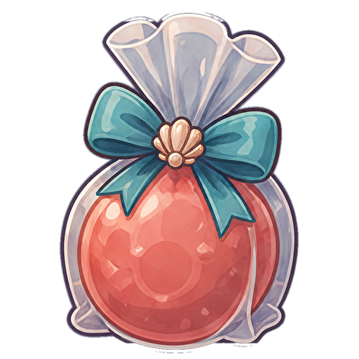

[Separate annotation / full reference](annotations/O01.svg)

**See:** Ordinary Candy uses syrup/sort/wrap/share rather than five story strawberries.

**Touch:** After Chapter 2 story prerequisites, use the enabled Candy Maker Kitchen card. Opera foyer guidance leads to this same Kitchen activity.

**Roshan / contact:** Roshan enters the same career world and approaches each active station.

**Result:** The ordinary test started with declared completed-story prerequisites and zero stars, then genuinely earned a new Candy star.

**Next:** Open SYRUP.

**Evidence gap:** All ordinary native entry/action/reward images are missing. Completed story is a normalized prerequisite fixture, not a newly played whole story.

### O02 — Pour syrup into the mold

**SOURCE ONLY · NO NATIVE SCREENSHOT.** Approved artwork reference; this is not a gameplay frame.

[Separate annotation / full reference](annotations/O02.svg)

**See:** The approved copper ladle is a reused widget reference. Exact ordinary placement is uncaptured.

**Touch:** Open the pictured pour station, then hold its syrup/ladle control; release to stop.

**Scripted instruction:** “Tip the syrup into the candy mold!” Scripted voice cue from phase source: “Tip the syrup into the candy mold!” (audio not recorded).

**Roshan / contact:** Roshan approaches the station; actual ladle-to-mold contact is not visually verified.

**Result:** Intentional pour reaches goal 5; the existing generic candy surface handles the pour.

**Next:** Open SORT.

**Evidence gap:** ASSET-BACKED ILLUSTRATION ONLY. Native before/mid-pour/after and real voice playback are missing.

### O03 — Sort six candies by matching shape

**SOURCE ONLY · NO NATIVE SCREENSHOT.** Approved artwork reference; this is not a gameplay frame.

[Separate annotation / full reference](annotations/O03.svg)

**See:** The coral-flower candy token is one approved piece reference. The full bin layout is not shown here.

**Touch:** Drag each candy token to its matching shape box and release, using one finger at a time.

**Scripted instruction:** “Drag each candy into its matching shape box!” Scripted voice cue from phase source: “Drag each candy into its matching shape box!” (audio not recorded).

**Roshan / contact:** Roshan works at the sorting station; carrying/drop contact is unverified.

**Result:** Six correct generic-surface drops earn SORT.

**Next:** Open WRAP.

**Evidence gap:** ASSET-BACKED ILLUSTRATION ONLY. Different from the birthday five-berry color lanes; native six-piece states are missing.

### O04 — Twist the wrappers

**SOURCE ONLY · NO NATIVE SCREENSHOT.** Approved artwork reference; this is not a gameplay frame.

[Separate annotation / full reference](annotations/O04.svg)

**See:** The approved finished-candy goal artwork is a source reference, not a screenshot.

**Touch:** Trace circles on the wrapping control until the 1.8-turn goal completes.

**Scripted instruction:** “Twist the finished wrappers in circles!” Scripted voice cue from phase source: “Twist the finished wrappers in circles!” (audio not recorded).

**Roshan / contact:** Roshan approaches the wrapping station; fingers/wrapper contact is unverified.

**Result:** Deliberate circles earn wrapping through the existing generic surface.

**Next:** Open SHARE.

**Evidence gap:** ASSET-BACKED ILLUSTRATION ONLY. Native wrapper deformation, midpoints, finish and voice playback are missing.

### O05 — Share six finished candies

**SOURCE ONLY · NO NATIVE SCREENSHOT.** Approved artwork reference; this is not a gameplay frame.

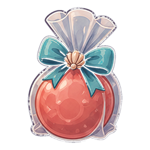

[Separate annotation / full reference](annotations/O05.svg)

**See:** The approved mover is a source reference; the full friend arrangement is uncaptured.

**Touch:** Tap each distinct sharing target once. The instruction identifies them as waving friends.

**Scripted instruction:** “Give one finished candy to every waving friend!” Scripted voice cue from phase source: “Give one finished candy to every waving friend!” (audio not recorded).

**Roshan / contact:** Roshan is at the sharing station. Hand-to-friend exchange and complete acting are unverified.

**Result:** Six genuine target taps earn SHARE and the ordinary Candy star (bit 3:0→8).

**Next:** Receive the ordinary finale, then return to the Kitchen.

**Evidence gap:** ASSET-BACKED ILLUSTRATION ONLY. Native friends, exchange/contact, finale, star award and return are missing.

### O06 — Continue and replay ordinary Candy

**SOURCE ONLY · NO NATIVE SCREENSHOT.** Approved artwork reference; this is not a gameplay frame.

[Separate annotation / full reference](annotations/O06.svg)

**See:** Ordinary completion retains a completed pearl while leaving the card enabled for replay.

**Touch:** Choose Continue, return to the Kitchen and tap the completed Candy card again.

**Roshan / contact:** The headless restart reached the actual Continue menu and real card touch; normal travel was explicitly mounted.

**Result:** The saved Candy star mask is 8 (0x08); cake 127 and story prerequisites persist. Re-tapping the ordinary card starts SYRUP without deleting story progress.

**Next:** Replay O02–O05.

**Evidence gap:** Machine-backed diagram only. Native Continue/reward/return/replay and device/child/owner acceptance remain open.

## Coverage and provenance

No Candy-only initial tutorial or two-act practice is naturally enabled. The Chapter2 foyer guides into the same Kitchen rather than supplying a separate Candy game. Legacy six-phase combat is excluded.

Captured: Kitchen → COAT5 → SORT5 → GLAZE2turns → PLACE5 → saved five-fruit cake → stage reward → Kitchen. Ordinary: SYRUP5 → SORT6 → WRAP1.8turns → SHARE6 → ordinary star → return/replay.

[Source binding](SOURCE_BINDING.json) · [Asset provenance](ASSET_PROVENANCE.json) · [Local validation](VALIDATION.json) · [Remote verification](REMOTE_VERIFICATION.json). Historical receipts describe130 original images; this review ships only25 selected originals. All displayed image dependencies are included.

The native-supervisor filenameFAIL and later preparation-wall-capFAIL remain preserved under evidence/. Re-verification does not overwrite failures. Machine checks do not establish contact, nativeA319, full-speed motion, device, child, owner or≥4.6 clearance.

Documentation baseline: 6238934447cf28834874396dfbaff65effafda46. Runtime clearance remains blocked; pending support/tool decisions are unchanged.
