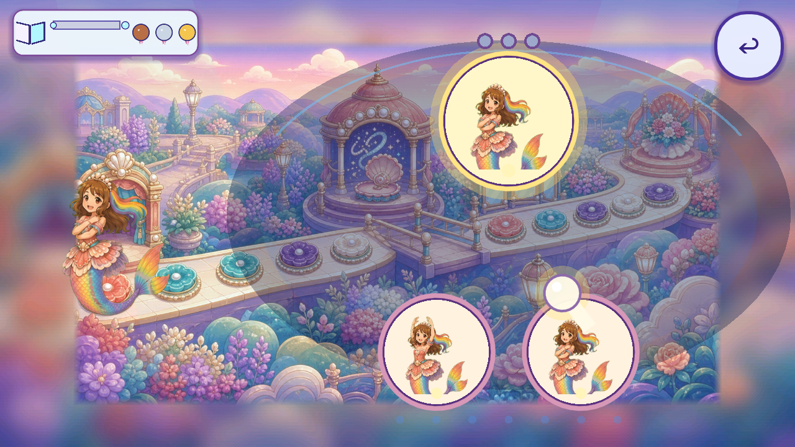
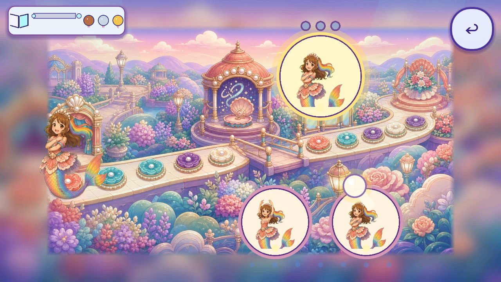
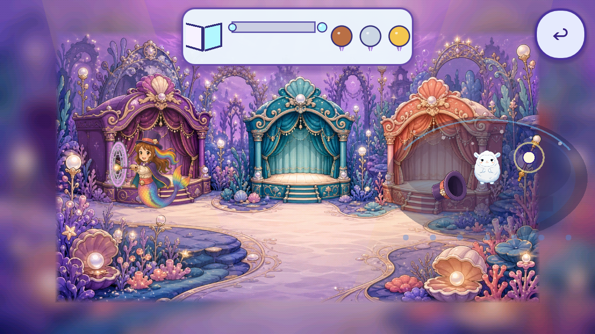
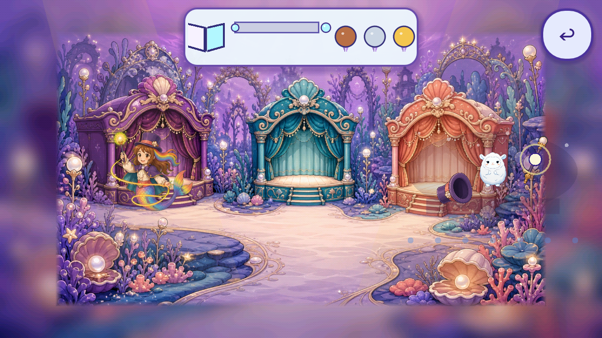
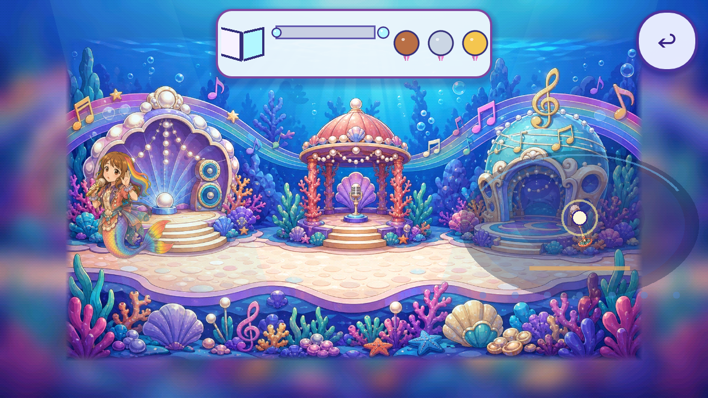
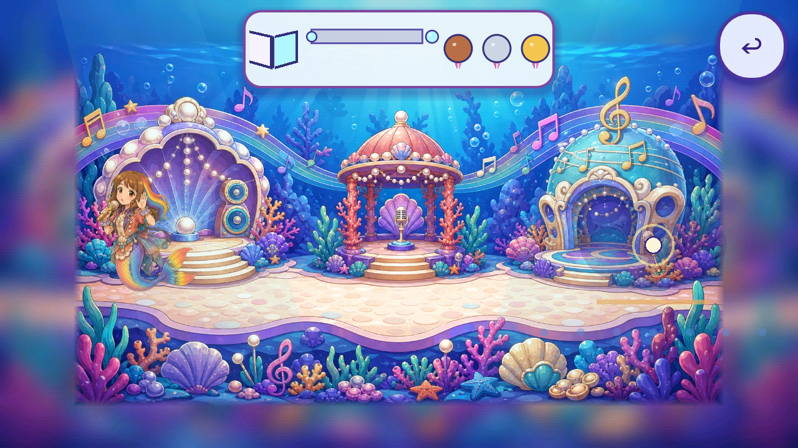
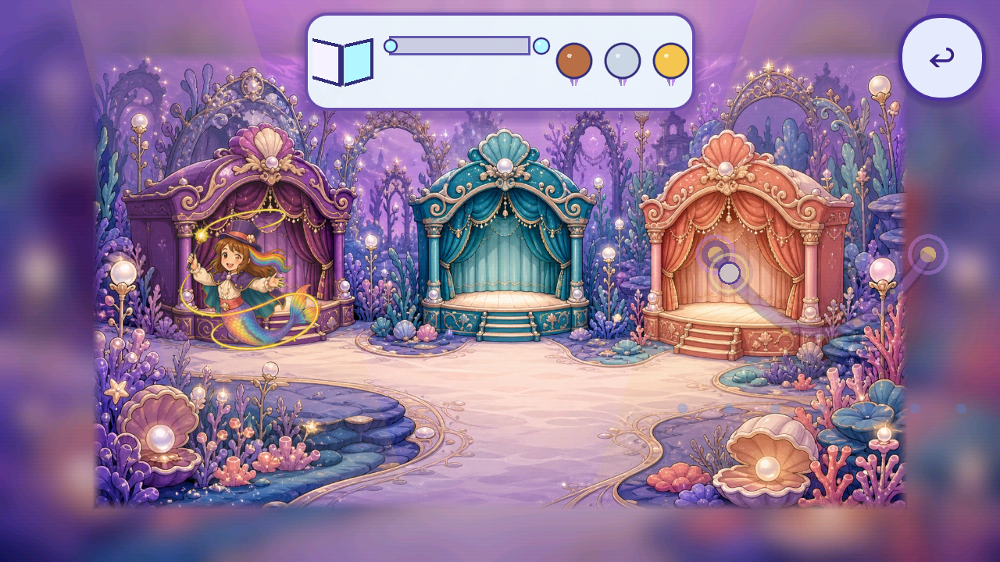
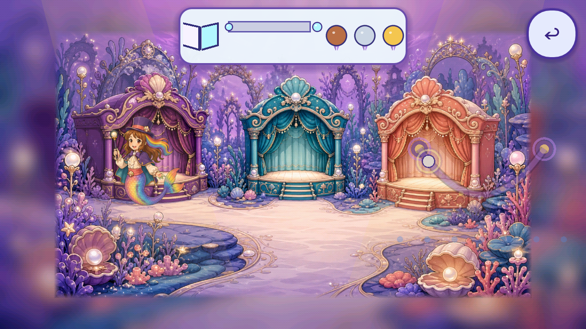
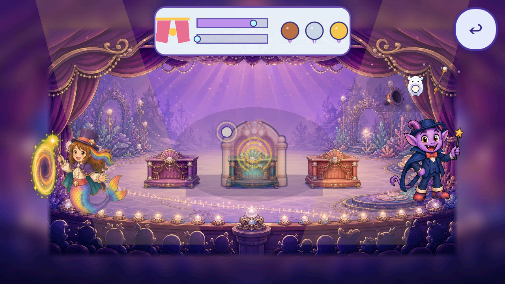
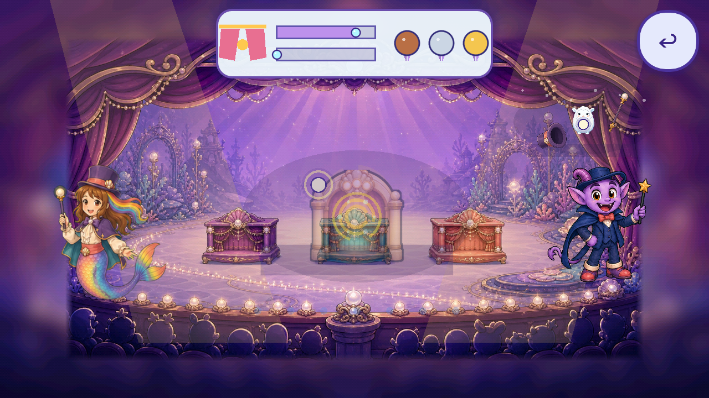

# Opera Hall visual comparison

This reviewer-facing comparison uses exact archived Hall PNGs. No transforms or
new imagery were made. The captures use configured phases, normal SceneTree
processing, Mobile 1280×720, and sparse still samples. They do not establish
natural navigation, cadence, target-phone, child or owner acceptance.

## Matched first-phase views

Candidate05 provides the most complete same-phase set. Practice and stage both
use source phase 0 under the performance plan; stage changes backdrop and
staging context.

### Baseline versus candidate inline controls

These matched practice-intro pairs compare the archived 8b7 baseline run02
with the candidate05 repaired-context packet. They compare the same semantic
intro state and do not imply candidate05 has passed the full art gate.

| Career | 8b7 baseline run02 | Candidate05 repaired-context intro |
|---|---|---|
| Ballerina PEARL MIRROR |  |  |
| Magician VANISH |  |  |
| Pop Star SOUND CHECK |  |  |

| Career/state | Practice | Stage | Observation |
|---|---|---|---|
| Ballerina intro | [practice](evidence/hall-followup/hall/candidate05/captures/ballerina_practice_pearl_mirror_intro.png) | [stage](evidence/hall-followup/hall/candidate05/captures/ballerina_stage_pearl_mirror_intro.png) | Both backgrounds are polished and coherent. The large translucent gesture arc and plain circular choice mounts sit apart from the painted finish. |
| Ballerina held contact | [practice](evidence/hall-followup/hall/candidate05/captures/ballerina_practice_pearl_mirror_held_contact.png) | [stage](evidence/hall-followup/hall/candidate05/captures/ballerina_stage_pearl_mirror_held_contact.png) | Candidate05 shows a pose change and selected target. Actor edge placement and pointer/arc occlusion remain weak; stills do not prove motion. |
| Ballerina payoff | [practice](evidence/hall-followup/hall/candidate05/captures/ballerina_practice_pearl_mirror_phase_payoff.png) | [stage](evidence/hall-followup/hall/candidate05/captures/ballerina_stage_pearl_mirror_phase_payoff.png) | A payoff frame exists, but it remains configured diagnostic evidence requiring temporal/device review. |
| Magician intro | [practice](evidence/hall-followup/hall/candidate05/captures/magician_practice_vanish_intro.png) | [stage](evidence/hall-followup/hall/candidate05/captures/magician_stage_vanish_intro.png) | Booths and cabinets clearly establish VANISH in both contexts, while the activity cluster is small relative to the painted scene. |
| Magician held contact | [practice](evidence/hall-followup/hall/candidate05/captures/magician_practice_vanish_held_contact.png) | [stage](evidence/hall-followup/hall/candidate05/captures/magician_stage_vanish_held_contact.png) | Roshan and the wand target are legible. The broad arc competes with the cabinet/lamb relationship. |
| Magician payoff | [practice](evidence/hall-followup/hall/candidate05/captures/magician_practice_vanish_phase_payoff.png) | [stage](evidence/hall-followup/hall/candidate05/captures/magician_stage_vanish_phase_payoff.png) | Lamb disappearance and hat/wand emphasis read clearly; thin rings and particles are flatter than the painted set. |
| Pop Star intro | [practice](evidence/hall-followup/hall/candidate05/captures/popstar_practice_sound_check_intro.png) | [stage](evidence/hall-followup/hall/candidate05/captures/popstar_stage_sound_check_intro.png) | Musical identity is strong. Practice microphone is tiny/peripheral; stage microphone and arrow pads compete for attention. |
| Pop Star held contact | [practice](evidence/hall-followup/hall/candidate05/captures/popstar_practice_sound_check_held_contact.png) | [stage](evidence/hall-followup/hall/candidate05/captures/popstar_stage_sound_check_held_contact.png) | Notes and waves establish feedback, but their flatter geometry and distant target weaken scene ownership. |
| Pop Star payoff | [practice](evidence/hall-followup/hall/candidate05/captures/popstar_practice_sound_check_phase_payoff.png) | [stage](evidence/hall-followup/hall/candidate05/captures/popstar_stage_sound_check_phase_payoff.png) | Microphone-centered payoff is readable; notes/waves remain a style mismatch requiring local review. |

The earlier run01 pair remains a baseline control for composition, but its
Ballerina `held_contact` files are rejected contact evidence because input was
sent while `demo_active` blocked it: [run01 baseline](evidence/hall-followup/hall/run01/captures/ballerina_practice_pearl_mirror_intro.png), [candidate manifest](evidence/hall-followup/hall/candidate05/captures/manifest.json).
Numeric review records are [the first-phase runtime review](hall_art_runtime_review.json), [the Hall review plan](hall_art_review_plan.json), and [the neutral Magician review](hall_magician_neutral_review.json). The numeric dimensions below are baseline review values, not candidate05 acceptance scores.

## Magician ROPE and PORTAL containment comparison

Candidate02 was rejected for ROPE because an unrelated yellow orbit wrapped
Roshan and competed with the rope path. Neutral03 removes that orbit, leaving
the purple task path as the sole rope-like cue. This is bounded containment,
not complete action or 4.5 acceptance.

| State | Rejected candidate | Neutral candidate | Disposition |
|---|---|---|---|
| ROPE |  |  | Retain neutral mapping as containment; rope contact, motion and child/device review remain open. |
| PORTAL |  |  | Neutral removes the duplicate/unrelated effect and keeps the portal readable; completion animation remains unassessed. |

## Dimension evidence and next review

The existing first-phase runtime review scored visible still dimensions only.
Its lowest bounded values were Ballerina practice 3.8 contact/occlusion,
Ballerina stage 3.5 contact/occlusion, Magician practice 3.8 scene ownership,
Magician stage 3.9 scene ownership, Pop Star practice 3.8 contact/occlusion,
and Pop Star stage 3.9 contact/occlusion. Animation was unassessed. These are
dated composition observations, not family averages or acceptance.

Next, retain the actor and background art while localizing the oversized arc,
strengthening object-to-station contact, and reconciling flat rings/notes/pads
with the painted prop language. Recapture the same states and later source
phases under normal timing before applying any 4.5 gate. No source replacement
is justified by this comparison alone.
