# Nursery — illustrated walkthrough

Owner-requested review package ·2026-10-07. **Documentation only. Nursery 4.6 goal BLOCKED; master audit UNSATISFIED.**

Follow24 numbered steps below. Download this directory and open [index.html](index.html) for the responsive viewer/route filters. GitHub displays this README; HTML is a downloadable artifact.

**COVERAGE_GAP** panels are existing-asset illustrations, not game screens. **HISTORICAL_NATIVE_FIXTURE** panels preserve R1 terminal-stage captures with direct phase 4/open bypass; current source differs. No natural current route/contact or numeric acceptance.

## 01. Reach the Castle hall

**COVERAGE_GAP** · Nursery career · Castle freeplay, after Chapter 2 story completion

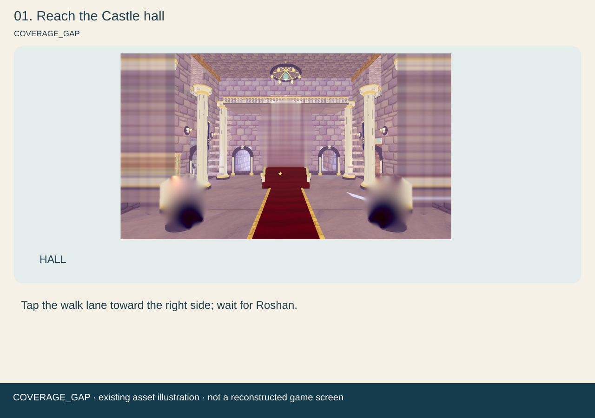

**One finger:** Tap the walk lane toward the right side; wait for Roshan.

**See/hear:** Room doors appear as the camera follows. Exact spoken entry cue/current native view missing.

**Before:** Nursery remains locked until freeplay opens.

**After:** Bubble Bath door becomes visible. R9 used two floor touches; that is not a universal requirement.

**Roshan/contact:** Roshan travels via the normal walk motor. The startup fixture does not prove fresh-save unlock; MA-PLAY-005 is the dated prerequisite finding.

**Next:** Tap Bubble Bath.

[Full-size annotated panel](panels/01.svg)

## 02. Enter Bubble Bath

**COVERAGE_GAP** · Nursery career · Castle room door

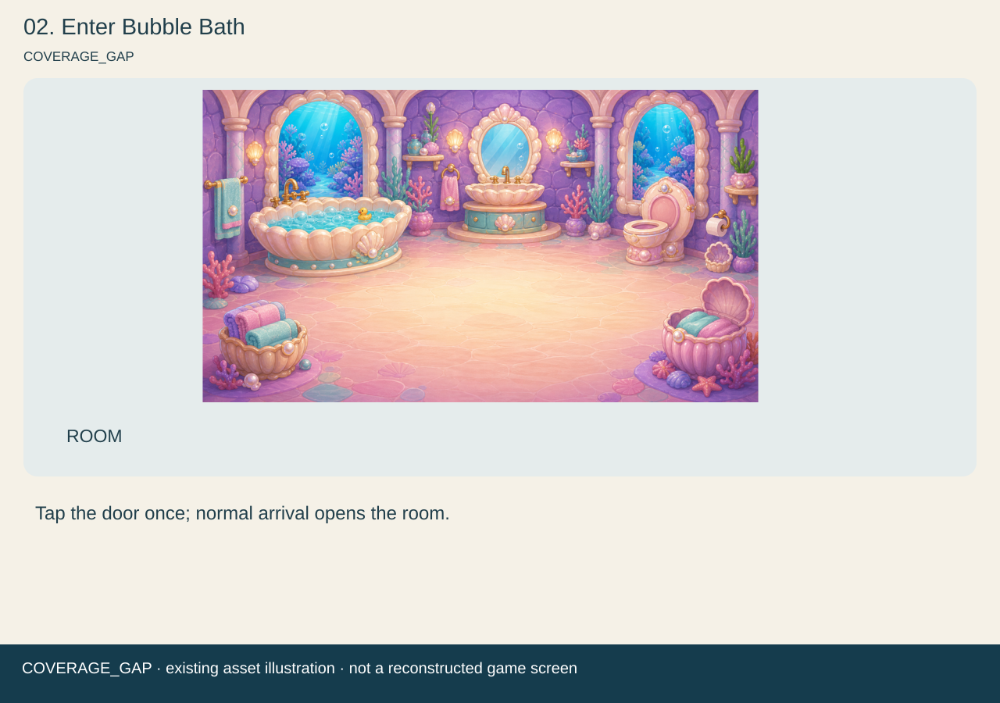

**One finger:** Tap the door once; normal arrival opens the room.

**See/hear:** Picture door/arrival cue; current native transition missing.

**Before:** Hall door visible.

**After:** Bubble Bath room exposes the Nursery card.

**Roshan/contact:** Normal Castle travel/arrival owns the transition; image here is existing room art only.

**Next:** Choose Nursery.

[Full-size annotated panel](panels/02.svg)

## 03. Choose Nursery Nurse

**COVERAGE_GAP** · Nursery career · Bubble Bath career rail

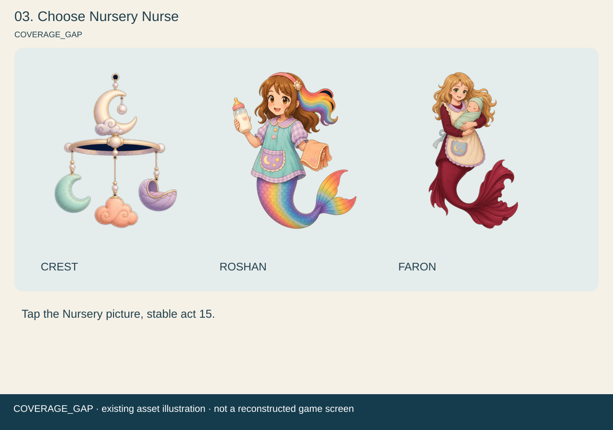

**One finger:** Tap the Nursery picture, stable act 15.

**See/hear:** Nursery crest; one finger, no confirm dialog.

**Before:** Room career rail available.

**After:** Nursery world opens with Faron and first station.

**Roshan/contact:** Approved Nursery Roshan and Faron appearances; source cards do not prove complete acting/contact.

**Next:** Tap the basin station.

[Full-size annotated panel](panels/03.svg)

## 04. Walk to the basin

**COVERAGE_GAP** · Nursery career · Nursery wash_basin station

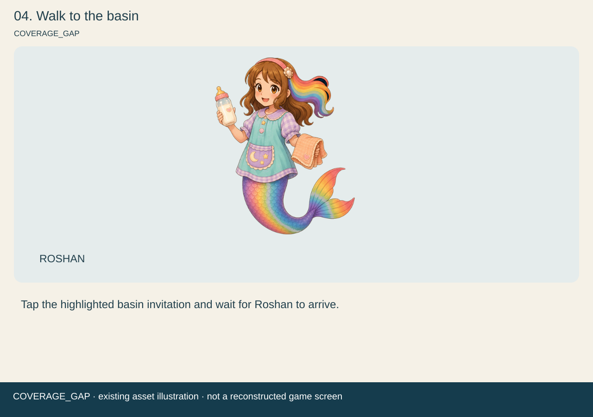

**One finger:** Tap the highlighted basin invitation and wait for Roshan to arrive.

**See/hear:** Station highlight/pointer, then wash instruction.

**Before:** WASH task closed; waiting earns no care.

**After:** WASH opens after arrival.

**Roshan/contact:** Station motor and work animation implemented; attached hand/basin contact unverified.

**Next:** Hold the wash surface.

[Full-size annotated panel](panels/04.svg)

## 05. Hold to wash

**COVERAGE_GAP** · Nursery career · Nursery WASH HANDS surface

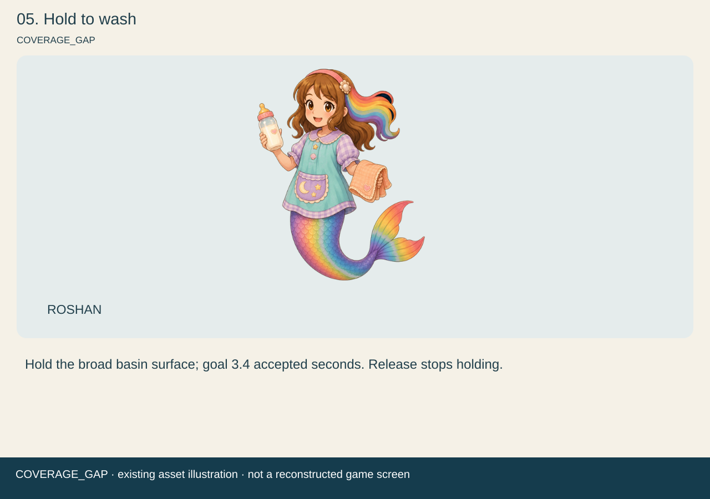

**One finger:** Hold the broad basin surface; goal 3.4 accepted seconds. Release stops holding.

**See/hear:** Basin/water/bubbles/progress; wash prompt.

**Before:** 0 wash progress; R9 passive wait earned nothing.

**After:** Wash completes and next invitation appears.

**Roshan/contact:** Procedural wash tableau/work state; whole-figure hand action remains a native review gap.

**Next:** Tap cuddle_cushions.

[Full-size annotated panel](panels/05.svg)

## 06. Walk to the catch station

**COVERAGE_GAP** · Nursery career · Nursery cuddle_cushions station

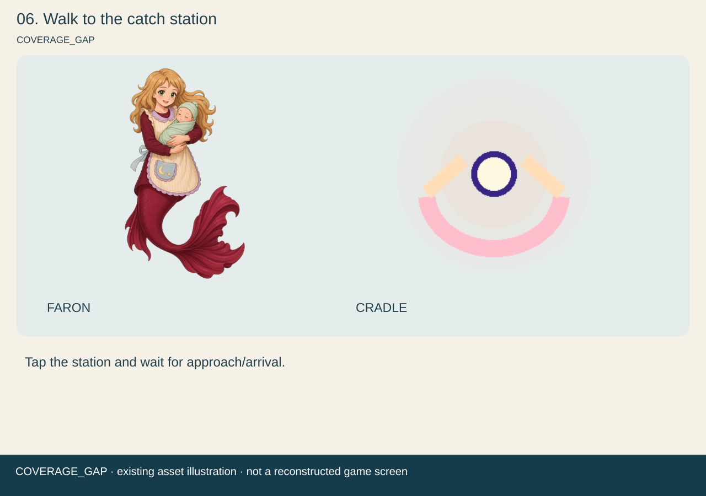

**One finger:** Tap the station and wait for approach/arrival.

**See/hear:** Highlighted station; Faron catch instruction.

**Before:** Wash complete; catch closed.

**After:** Five-catch task opens.

**Roshan/contact:** Roshan approaches; Faron is a cooperative partner.

**Next:** Slide the cradle.

[Full-size annotated panel](panels/06.svg)

## 07. Catch five babies

**COVERAGE_GAP** · Nursery career · Nursery catch surface

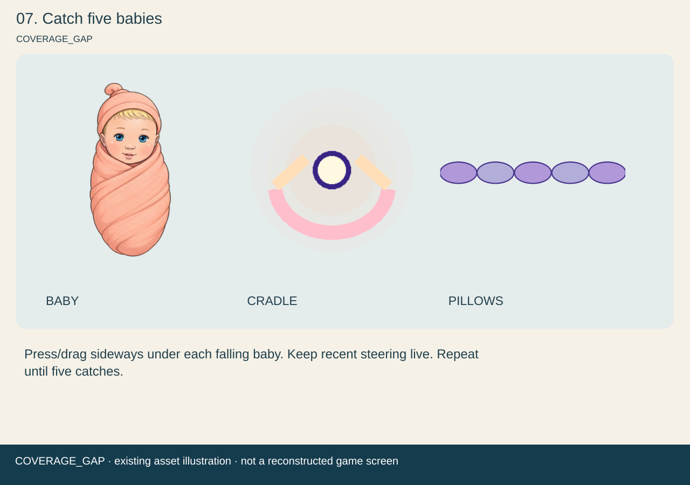

**One finger:** Press/drag sideways under each falling baby. Keep recent steering live. Repeat until five catches.

**See/hear:** Faller, broad cradle and filled picture pips.

**Before:** 0/5; up to two fallers.

**After:** One real catch adds one; five completes.

**Roshan/contact:** Cradle moves with finger x; Roshan work feedback/Faron visible. Attached arms/cradle/support need review.

**Next:** Go to the bottle nook.

[Full-size annotated panel](panels/07.svg)

## 08. A miss stays safe

**COVERAGE_GAP** · Nursery career · Optional catch miss

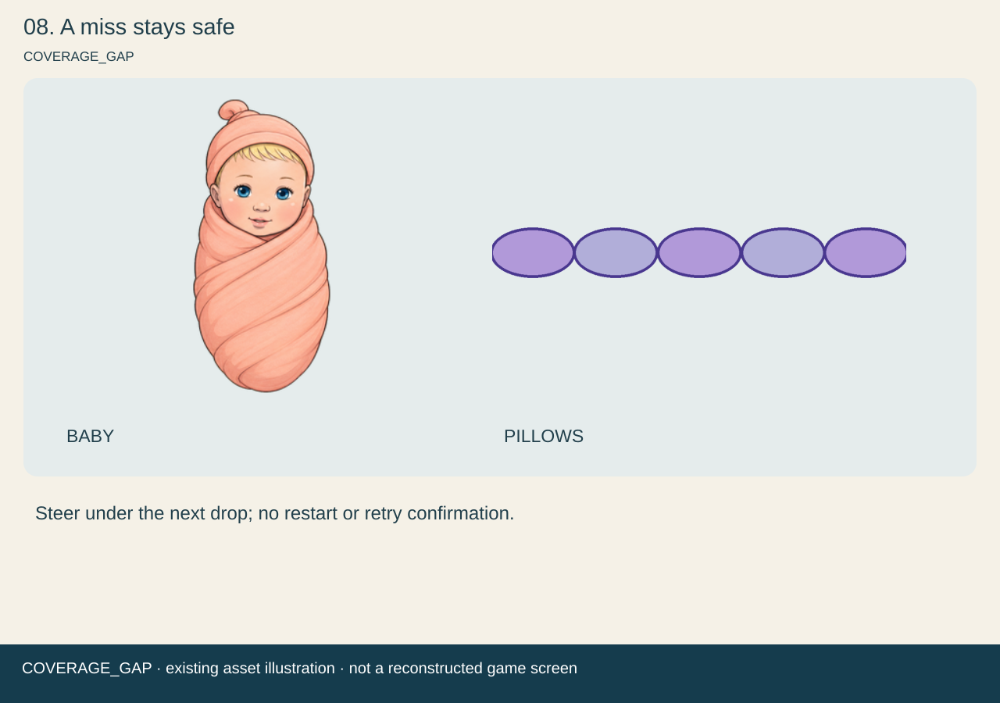

**One finger:** Steer under the next drop; no restart or retry confirmation.

**See/hear:** Pillow landing; mercy slows/recentres later drops.

**Before:** Baby passes cradle.

**After:** Caught progress stays; a miss never ends the job. No live steering means no catch credit.

**Roshan/contact:** Safe landing implemented; pillow material/cradle shape/contact remain open.

**Next:** Continue to five catches.

[Full-size annotated panel](panels/08.svg)

## 09. Feed the babies

**COVERAGE_GAP** · Nursery career · Nursery bottle_nook / FEED

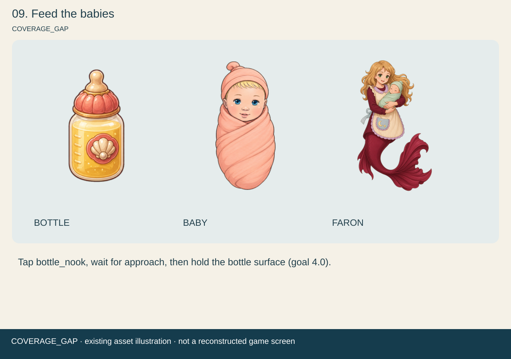

**One finger:** Tap bottle_nook, wait for approach, then hold the bottle surface (goal 4.0).

**See/hear:** Bottle moves toward three mouths; drain pip/progress.

**Before:** Catch complete; feed starts at 0.

**After:** Feed completes; pat station invited.

**Roshan/contact:** Bottle moves/tilts between babies; attached Roshan hand/feeding contact not proved. Faron remains visible.

**Next:** Tap cuddle_cushions again.

[Full-size annotated panel](panels/09.svg)

## 10. Four gentle pats

**COVERAGE_GAP** · Nursery career · Nursery cuddle_cushions / BURP

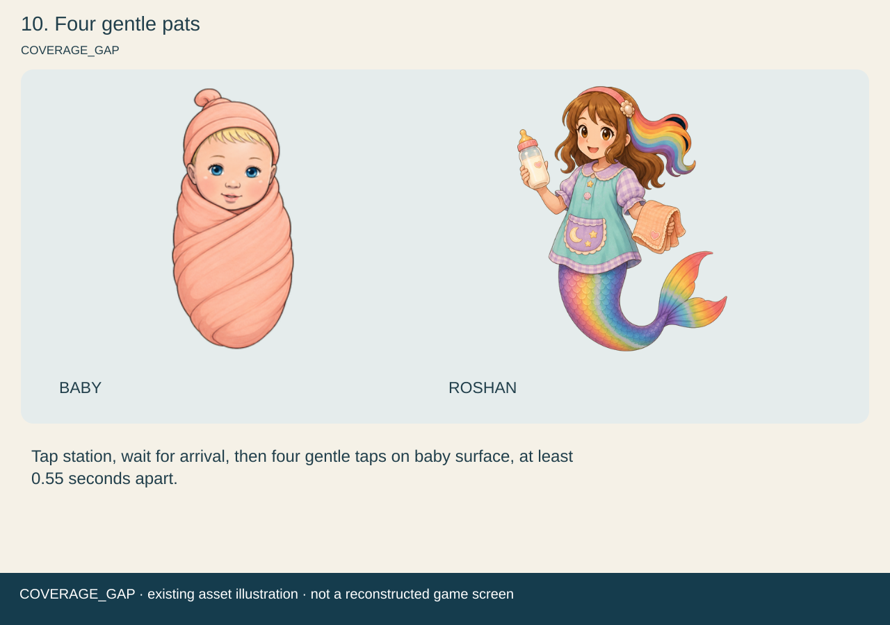

**One finger:** Tap station, wait for arrival, then four gentle taps on baby surface, at least 0.55 seconds apart.

**See/hear:** Baby/hand reaction, pips and slow-pat prompt.

**Before:** 0/4 pats.

**After:** Four paced pats complete; fast taps rehint instead of filling count.

**Roshan/contact:** Procedural hand circle, small baby deformation/reaction bubbles; attached anatomy/whole-figure acting still open.

**Next:** Tap the moon bed.

[Full-size annotated panel](panels/10.svg)

## 11. Walk to the moon bed

**COVERAGE_GAP** · Nursery career · Nursery moon_bed / BEDTIME

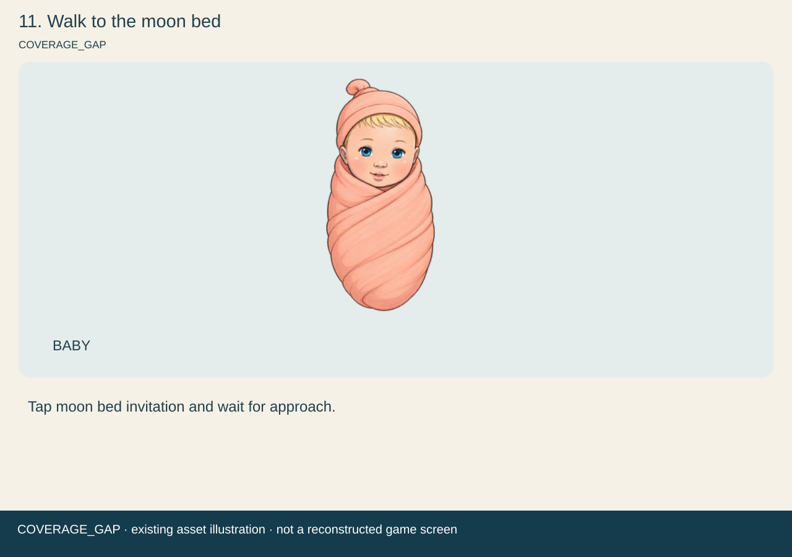

**One finger:** Tap moon bed invitation and wait for approach.

**See/hear:** Downward blanket cue; Faron bedtime instruction.

**Before:** BURP complete.

**After:** Three blanket slots open, left to right.

**Roshan/contact:** Normal route approaches bed. Following historical fixture images bypass that approach/earlier care.

**Next:** Start the left blanket.

[Full-size annotated panel](panels/11.svg)

## 12. Find the first blanket edge

**HISTORICAL_NATIVE_FIXTURE** · Nursery career · Historical R1 BEDTIME start

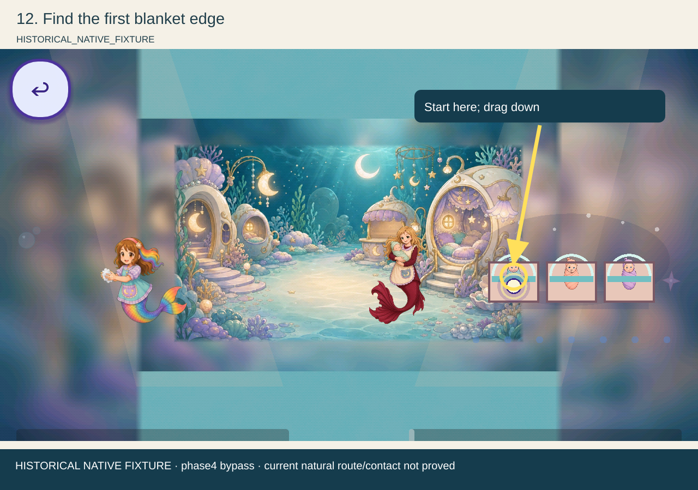

**One finger:** Press highlighted left blanket zone below baby face.

**See/hear:** Ring marks first unfinished blanket.

**Before:** 0/3 tucks.

**After:** Downward drag can begin; no input earns nothing.

**Roshan/contact:** Native image places Roshan apart from cribs; attached tuck acting unproved.

**Next:** Drag down. 

[Full-size annotated panel](panels/12.svg) · [Untouched screenshot](originals/captures/00_start.png)

## 13. Drag down to cover the body

**HISTORICAL_NATIVE_FIXTURE** · Nursery career · Historical R1 partial drag

**One finger:** Keep the same finger held and drag down; this key is half travel.

**See/hear:** Cloth lower edge grows; face stays uncovered.

**Before:** First cloth at rest.

**After:** Cloth0.5; completed count 0/3.

**Roshan/contact:** Object/cloth response only; no attached arm/hand proof.

**Next:** Continue to full tuck.

[Full-size annotated panel](panels/13.svg) · [Untouched screenshot](originals/captures/02_partial.png)

## 14. Retry an unfinished drag

**HISTORICAL_NATIVE_FIXTURE** · Nursery career · Optional R1 release/wrong direction

**One finger:** If released early or dragged upward, begin again from highlighted blanket.

**See/hear:** Rehint, no punitive fail state.

**Before:** Partial/wrong-direction input.

**After:** Partial cloth resets; no tuck/reward. Completed blankets stay.

**Roshan/contact:** This original is cancelled partial; wrong-way original is separately preserved.

**Next:** Try a full downward drag.

[Full-size annotated panel](panels/14.svg) · [Untouched screenshot](originals/captures/03_cancelled.png)

## 15. First baby tucked

**HISTORICAL_NATIVE_FIXTURE** · Nursery career · Historical R1 first committed

**One finger:** Complete downward travel, then lift finger.

**See/hear:** First blanket stays; middle is invited.

**Before:** 0/3 complete.

**After:** 1/3. Repeating first earns no duplicate.

**Roshan/contact:** Body covered/face clear; Roshan separate, care contact pending.

**Next:** Tuck middle.

[Full-size annotated panel](panels/15.svg) · [Untouched screenshot](originals/captures/07_blanket0_committed.png)

## 16. Second baby tucked

**HISTORICAL_NATIVE_FIXTURE** · Nursery career · Historical R1 second committed

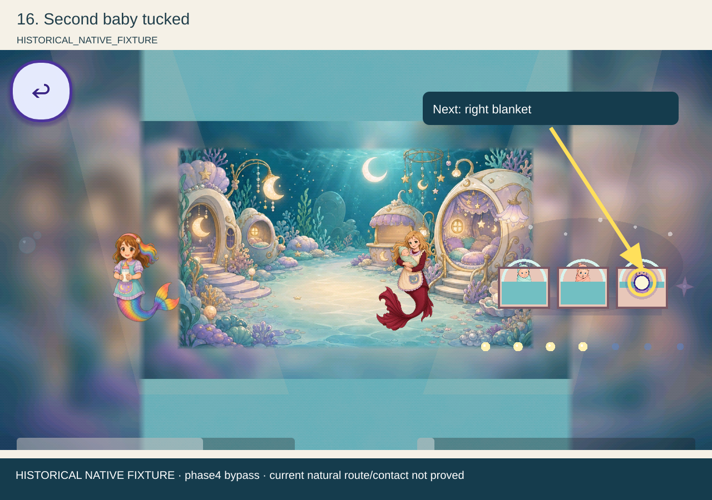

**One finger:** Press middle blanket zone, drag down, release.

**See/hear:** Middle fills; right invited.

**Before:** 1/3.

**After:** 2/3.

**Roshan/contact:** Two covered bodies, not whole-figure hand-to-cloth proof.

**Next:** Tuck right.

[Full-size annotated panel](panels/16.svg) · [Untouched screenshot](originals/captures/10_blanket1_committed.png)

## 17. All three tucked

**HISTORICAL_NATIVE_FIXTURE** · Nursery career · Historical R1 third committed

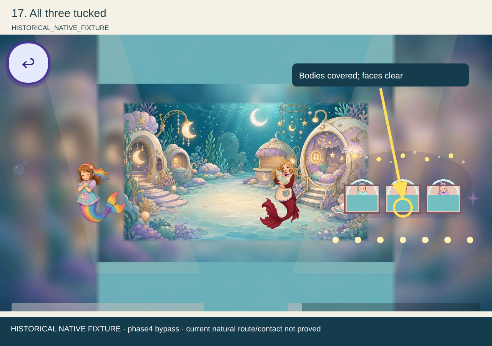

**One finger:** Press right blanket and drag down fully.

**See/hear:** All cloth stays filled; stars/completion feedback.

**Before:** 2/3.

**After:** 3/3; short readable result hold begins.

**Roshan/contact:** Roshan cheer state; selected historical key only.

**Next:** Let result settle.

[Full-size annotated panel](panels/17.svg) · [Untouched screenshot](originals/captures/13_blanket2_committed.png)

## 18. Read the bedtime result

**HISTORICAL_NATIVE_FIXTURE** · Nursery career · Historical R1 held completion

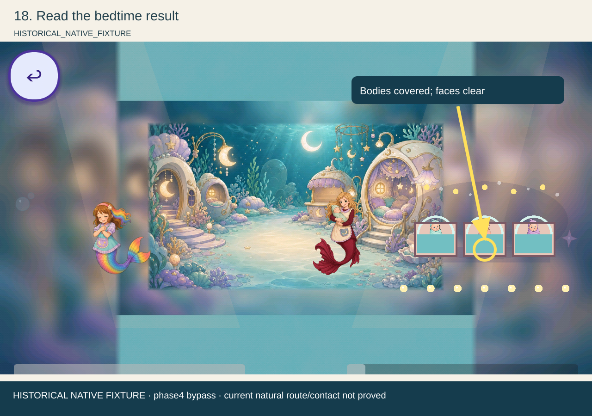

**One finger:** Release; let automatic hold finish.

**See/hear:** Covered bodies, clear faces, restrained stars.

**Before:** Last tuck accepted.

**After:** All three conserved during hold; wide 1600 original in gallery.

**Roshan/contact:** No boxing puff obscures result. Continuity/attached care acting unverified.

**Next:** Normal runtime advances.

[Full-size annotated panel](panels/18.svg) · [Untouched screenshot](originals/captures/14_held_completion.png)

## 19. Earn the career result

**HISTORICAL_NATIVE_FIXTURE** · Nursery career · R1 historical post-hold / R9 headless completion

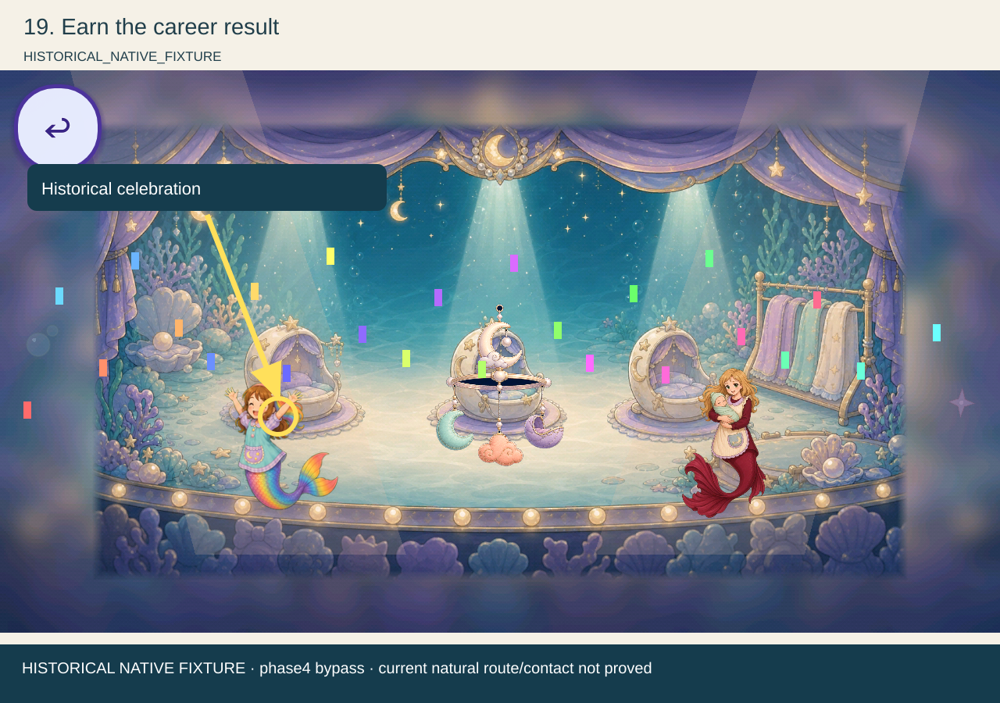

**One finger:** No extra confirm; completion advances after hold.

**See/hear:** Cheer/celebration, saved star and reward.

**Before:** Five phases earned by actual input in R9.

**After:** Ordinary first completion +3 pearls/bit 15, replay +1. Entire live Opera set completion can separately add 50 pearls/showtime.

**Roshan/contact:** R1 shows celebration from terminal fixture. R9 proves five-phase headless path separately; neither proves current natural native playback.

**Next:** Automatic Bubble Bath return.

[Full-size annotated panel](panels/19.svg) · [Untouched screenshot](originals/captures/15_post_hold.png)

## 20. Return, save and replay

**COVERAGE_GAP** · Nursery career · Castle Bubble Bath

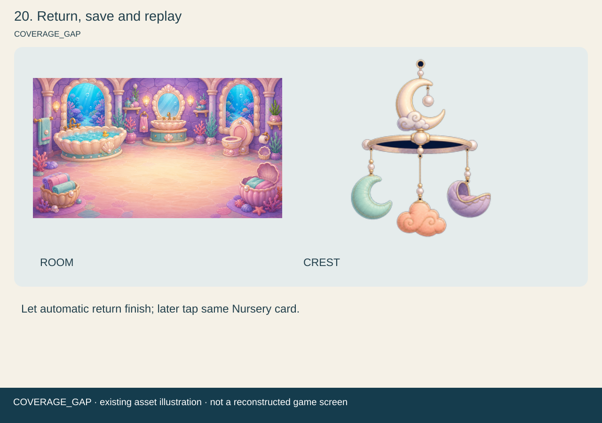

**One finger:** Let automatic return finish; later tap same Nursery card.

**See/hear:** Same room/route and earned star; native return/replay image missing.

**Before:** Career accepted.

**After:** R9 disk save retained star/reward, cleared only Nursery checkpoint; fresh-process replay +1.

**Roshan/contact:** Normal route/layer handoff has source/state evidence, no current native transition.

**Next:** Replay the five phases.

[Full-size annotated panel](panels/20.svg)

## 21. Leave mid-care and resume

**COVERAGE_GAP** · Nursery career · Back/focus/save variant

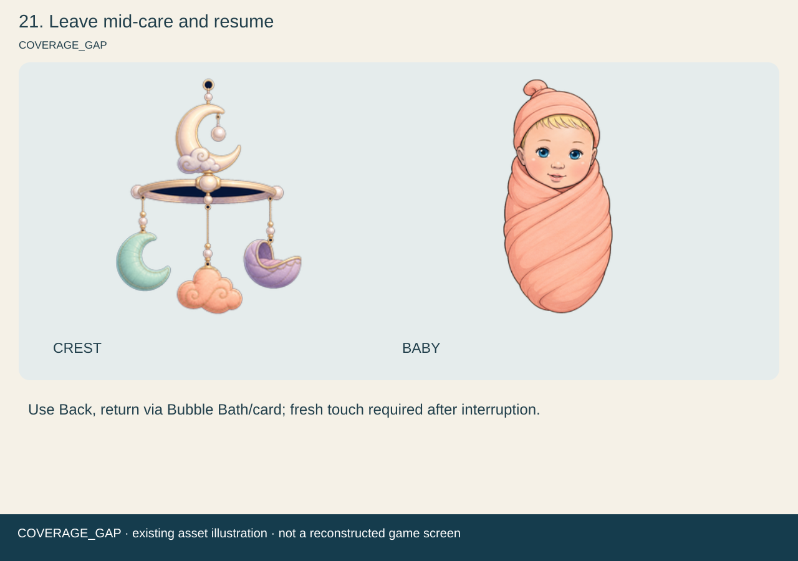

**One finger:** Use Back, return via Bubble Bath/card; fresh touch required after interruption.

**See/hear:** Same phase invitation; no ghost held finger.

**Before:** Meaningful partial care accepted.

**After:** R11 Back/disk/fresh-load preserved wash 0.85/3.4, two caught IDs, feed 1/4, two pats or one completed tuck. Unfinished drag resets.

**Roshan/contact:** State evidence only. Native pause/focus-loss/resume/device review open.

**Next:** Finish remaining care.

[Full-size annotated panel](panels/21.svg)

## 22. Meet Faron for Dolls

**COVERAGE_GAP** · Separate Faron Dolls · Separate in-world friend route, where available

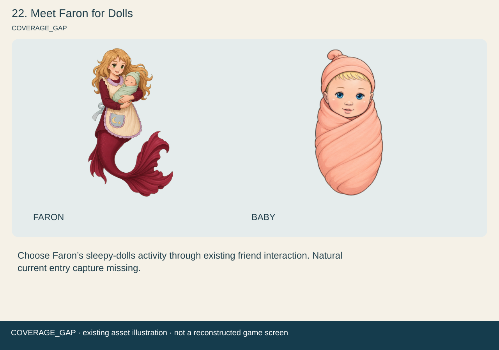

**One finger:** Choose Faron’s sleepy-dolls activity through existing friend interaction. Natural current entry capture missing.

**See/hear:** Faron picture/generic greeting; exact spoken catch-three objective missing.

**Before:** Different activity, not Nursery 15/birthday/practice.

**After:** Bounded Canvas stage/three pips opens over Nursery tiles.

**Roshan/contact:** Selected Roshan skin is used, not this illustrative career costume. Exact-skin/natural-entry native proof absent.

**Next:** Catch three.

[Full-size annotated panel](panels/22.svg)

## 23. Catch three with the sling

**COVERAGE_GAP** · Separate Faron Dolls · Separate Dolls Canvas

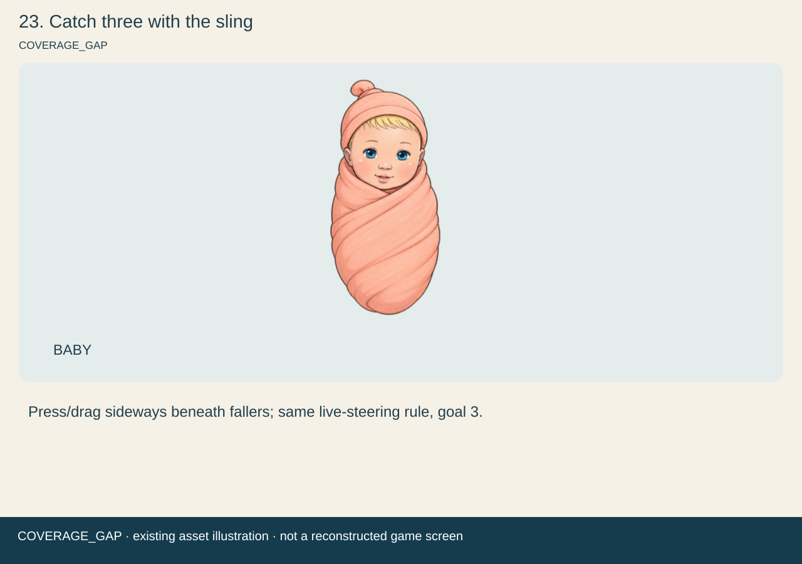

**One finger:** Press/drag sideways beneath fallers; same live-steering rule, goal 3.

**See/hear:** Three pips, U-shaped focus halo, rounded sling/procedural mat.

**Before:** 0/3.

**After:** Real catches progress; misses never end activity.

**Roshan/contact:** Selected-skin Roshan follows behind sling/babies. Opera placeholder cradle/pillow textures are not loaded.

**Next:** Fill all three pips.

[Full-size annotated panel](panels/23.svg)

## 24. Dolls finish and replay

**COVERAGE_GAP** · Separate Faron Dolls · Separate Dolls result/friend return

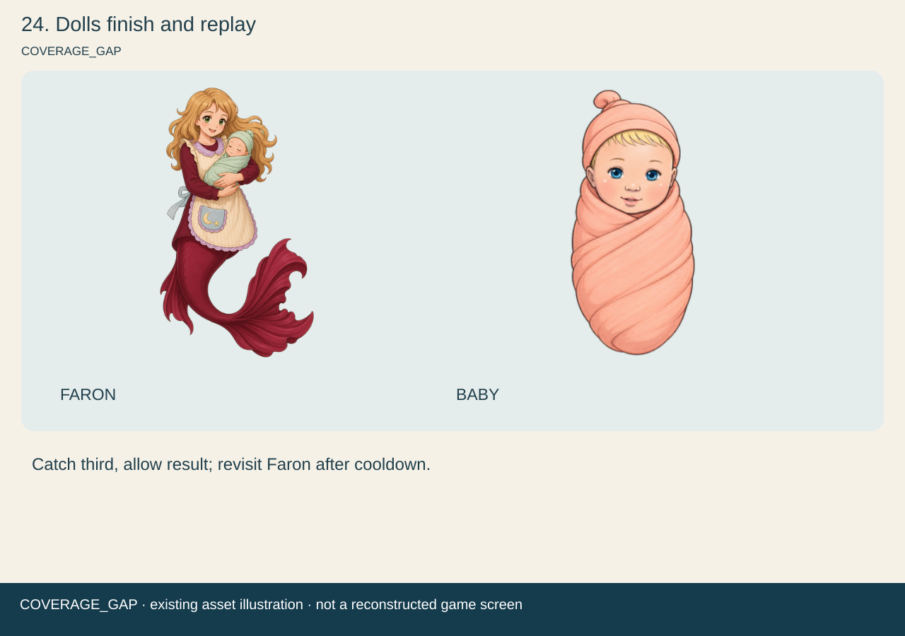

**One finger:** Catch third, allow result; revisit Faron after cooldown.

**See/hear:** Source UI says all cozy; exact catch-three instruction recording still missing.

**Before:** 3 accepted catches.

**After:** Source _end_game awards medal/first friend trophy-reward, cleans up/writes save. Native reward/return/re-entry/load missing.

**Roshan/contact:** Sibling source path, not Opera star. Dolls partial progress is not the Opera care checkpoint schema.

**Next:** Return to ordinary friend play; route/device verification remains.

[Full-size annotated panel](panels/24.svg)

## Variants and evidence

Bubble Bath Nursery15; Opera Hall2/13/8 and birthday6/0/3/10/2/13/11/1 exclude Nursery. Dolls is separate.

R9: 26 first-play +29 fresh-replay checks after declared freeplay startup; real viewport input/automatic ticks, +3/+1, bit15, Bubble Bath return and disk save. R11: 108 partial-care Back/save/load checks. R1: historical selected native BEDTIME keys. Current natural native full route/acting/contact, fresh-save unlock, listening, independent per-item 4.6, actual M11 Mobile/Speedy performance, child and owner acceptance remain open.

[Source hashes / availability](SOURCE_BINDINGS.json) · [Media](MEDIA_PROVENANCE.json) · [R9](evidence/r9/RESULT.json) · [R11](evidence/r11/RESULT.json) · [Impact](../../design/audit_impacts/nursery-walkthrough-20261007.json)

Family recordings, full source snapshots and private publishing metadata are omitted from this public packet. The owner has a separate local full review viewer; it is not an external handoff. Written cues and scoped input/capture receipts remain available here.
