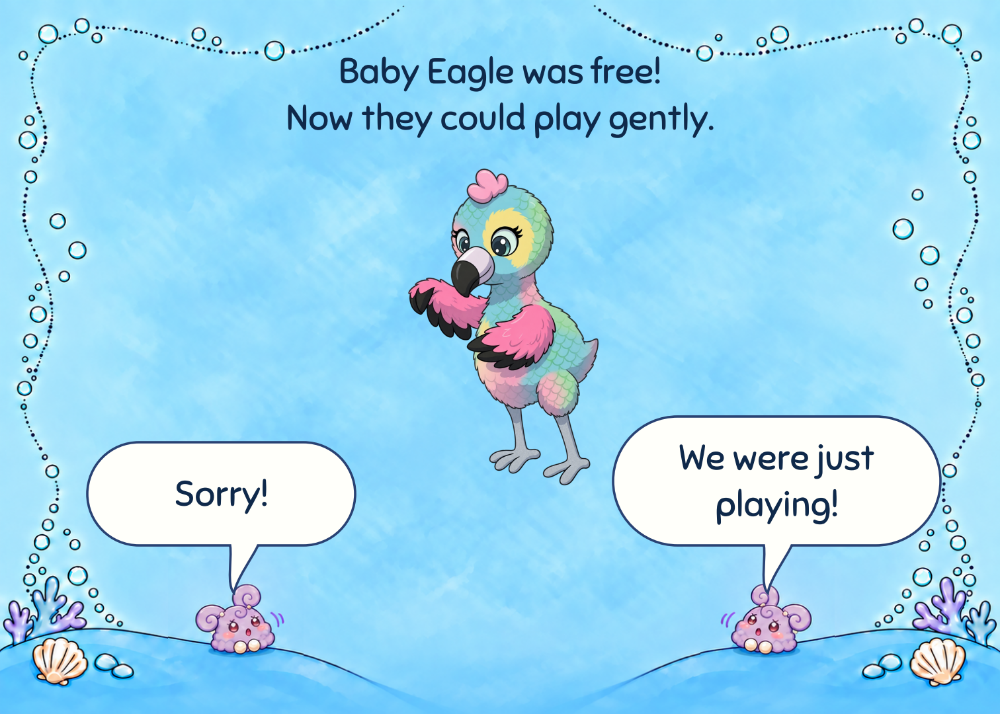
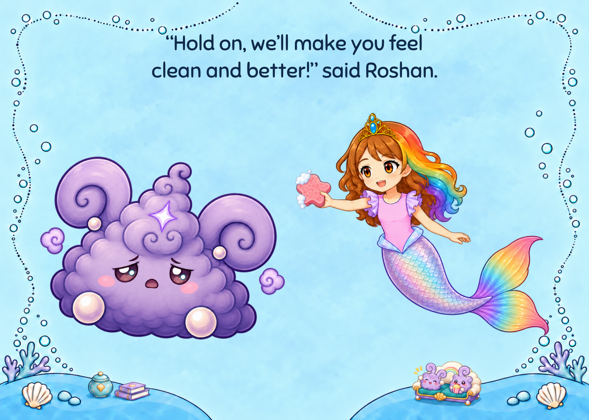
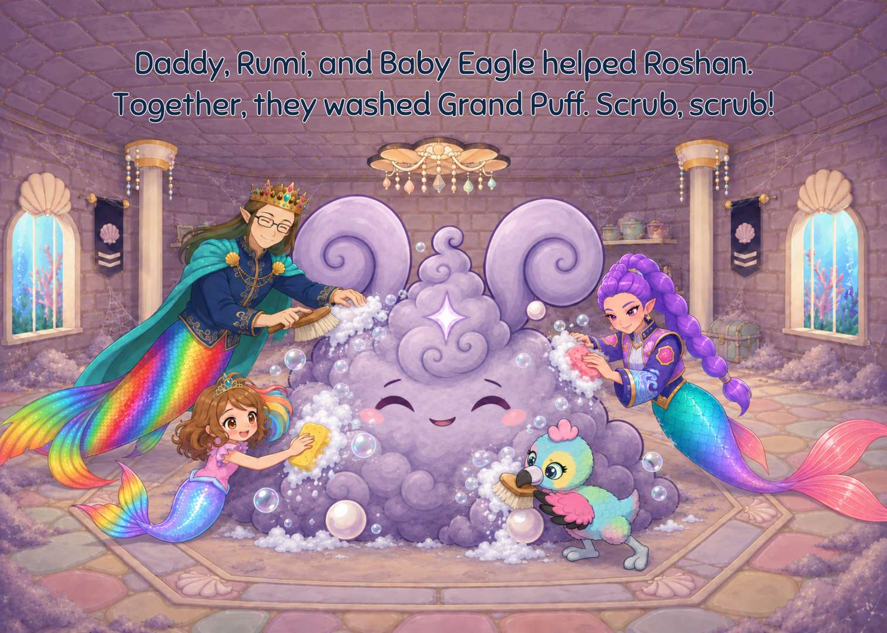

# V28 — Helping Grand Puff

Full 34-page review revision:32 story pages plus front/rear covers,7 × 5 in landscape, Sniglet. This revision applies the owner's preview approvals and latest book-only cleaning plot.

- Former19 →20: small apology bunnies, rounded editable balloons, Eagle as the main focus.
- Former23 removed: new3 uses an existing Grok castle-door frame to establish entry into the dirty castle.
- Former26 →25: Roshan holds a soapy star sponge and offers the owner's reassurance. Friends wash Puff on 26; no shell attack or dizzy expression.
- Door23/Puff24 and bubbles27/rainbow28 protect the reveals across page turns. Quiet play 31 precedes the shared bubble nap 32.

[Read the full book](complete/READ_BOOK.html) · [Review PDF](complete/Mermaid_Roshan_LANDSCAPE_ROUGH.pdf) · [Before/after comparison](REVISION_REVIEW.html) · [Page map](pagination.json) · [Source and prompt evidence](generation_evidence.json) · [Manifest](manifest.json)

The PDF preserves decoded artwork pixels through lossless stream encoding. Native source density varies; it is a review proof, not a300 ppi press master. Three older finale ceiling strips and the waterfall-action/rescue-room continuity questions remain open. See the [current review](../../REVIEW.md) and [visual audit](visual_review.json). Owner, child and print acceptance remain separate from machine checks.

Published on the dedicated `codex/mermaid-roshan-picture-book` branch. Game/runtime files and protected originals are outside this change. No game finding is closed. [Audit impact](../../../../../design/audit_impacts/picture-book-kindness-v28-20260930.json).
