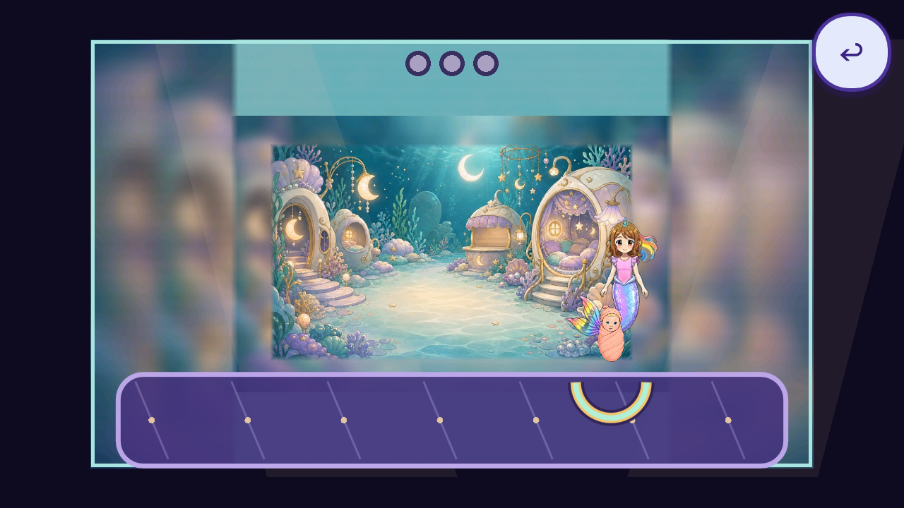

# Minigame art and animation audit — 5 September 2026

> Reconciliation note: baseline captures and scores remain historical evidence from the original `775ceee1` worktree. The original repairs were reconciled onto core base `f4a5de33` and published as `9df00099`. Later Garden and phase-pose follow-ups have their own dated source manifests. No historical capture is promoted to acceptance of a changed build. Game-wide coverage and the 4.5 threshold remain open.

**Status: IN PROGRESS / standard not met.** This is a review and repair candidate, not a release, owner acceptance, or closure of the master audit. The art scope is game-wide; the previously requested practice → stage mechanics remain confined to Ballerina, Magician and Pop Star in the Opera Hall.

The published checkpoint `8b7f116870eec8abf0368a25bf47eac404a23b25` now has a complete [green remote CI run](https://github.com/Ebonyks/mermaid-roshan-reef/actions/runs/34032123568), alongside the sealed local Full08 result. The subsequent Hall follow-up below is a separate candidate, reconciled with upstream `6bf16bbc16e9724e667b04230d4158cddc68307b`; its separate Full09 run now passes all 78 trusted processes with unchanged frozen sources. The new still reviews retain explicit below-4.5 findings; passing code checks does not close the art audit.

The user's impression of inconsistency is supported by the inspected images. Richly painted characters, rooms and large props sit beside simpler activity boards, diagrams and effects. Some individually attractive character sheets contain separate poses that the runtime treats as short animation loops. Composition, action meaning and contact are therefore as important as replacing weak PNGs.

The earlier art candidate `9df000999a94572b64537c98f558841f6f3e3260` passed the full local suite (78 trusted probe invocations; headless visual capture is skipped) and [exact-head remote CI](https://github.com/Ebonyks/mermaid-roshan-reef/actions/runs/34009153104). Checkpoint `8b7f1168` reconciled upstream `a6ffa14d0160ad6830464b73df33e1db20641fa1`, including pool travel/scoop action and Back navigation replacing the removed early-room picture handoff card. The subsequent `6bf16bbc` reconciliation retains those changes alongside stage navigation and the Chapter 2 lawn. Eleven task-specific pose holds for Doctor, Farmer and Racer remain bounded evidence. [The follow-up review](../audit/minigame_art_quality_2026-09-05/phase_pose_followup.md) compares 33 baseline and 33 candidate frames under normal processing, with explicitly configured phases. It supports pose containment only; source artwork, complete action animation, device performance and game-wide acceptance remain separate open gates.

[Current mechanics follow-up](../audit/minigame_art_quality_2026-09-05/current_mechanics_followup.md) reconciles the 61 base lessons with 70 runtime phases and documents the three Hall medal calibrations.

## Read the detailed findings

- [Opera: all fifteen career families, scores and live art owners](../audit/minigame_art_quality_2026-09-05/opera_review.md)
- [Non-Opera minigames: inspected assets, missing evidence and replacement specifications](../audit/minigame_art_quality_2026-09-05/nonopera_review.md)
- [Animation: pose selection, timing, anatomy and missing action states](../audit/minigame_art_quality_2026-09-05/animation_review.md)
- [Racer replacement attempt and independent rejection](../audit/minigame_art_quality_2026-09-05/racer_reaudit.md)
- [Current Teacher source review](../audit/minigame_art_quality_2026-09-05/teacher_current_source_followup.json), [Geologist source review](../audit/minigame_art_quality_2026-09-05/geologist_current_source_followup.json), and [Racer source review](../audit/minigame_art_quality_2026-09-05/racer_current_source_followup.json): verified bindings, reusable art and explicit gaps in rendered evidence
- [Current coverage follow-up](../audit/minigame_art_quality_2026-09-05/current_coverage_gap_followup.json): 16 additional gameplay groups, 27 verified sources now registered as unassessed; the registry has 89 records covering 81 distinct sources and remains nonexhaustive
- [Fairy source-family review](../audit/minigame_art_quality_2026-09-05/fairy_current_source_followup.json): retain eleven coherent painted sources; review their live overlays, transitions and scene mounting before replacing pixels
- [Seek atlas follow-up](../audit/minigame_art_quality_2026-09-05/seek_current_atlas_followup.json): measured current windows, clean companion sheets and corrected interpretation of faint Roshan border antialiasing
- [Current animation control audit](../audit/minigame_art_quality_2026-09-05/opera_current_animation_contract_followup.json): all fifteen career families, exact playback rules and missing action/contact/settle evidence
- [Geologist reuse and generation-gap ledger](../audit/minigame_art_quality_2026-09-05/geologist_reuse_gap_ledger.json): retain the brush and costume; name the missing material kits individually
- [Garden reuse inventory](../audit/minigame_art_quality_2026-09-05/garden_reuse_candidates_followup.json): two credible mature-flower candidates, duplicate aliases identified, sprout and remaining distinct flower roles still missing
- [Machine-readable open registry](../audit/minigame_art_quality_2026-09-05/registry.json) and [repeatable review protocol](../audit/minigame_art_quality_2026-09-05/protocol.md)

Sol reviewed the master criteria, Opera surfaces, animation sheets and repair candidates. Luna traced non-Opera callers, inspected weak source assets and prepared state captures. The parent reviewed evidence and implementation claims, rejected stale/obscured captures and corrected diagnoses that did not match live code. In particular, shipping hold/circle/swipe activities already route through painted widget families: deleting their unused generic fallback would not improve the current game.

## Scores: strengths, weaknesses and specific next work

These are subjective **baseline composition scores**, not complete eight-dimension acceptance. Historical captures are dated in the detailed report and cannot establish a changed candidate's score. No family is certified at 4.5. A weak state cannot be averaged into a passing family.

| Career | Baseline /5 | Keep | Weakness to repair | Specific next batch |
|---|---:|---|---|---|
| Chef | 3.6 | Kitchen, costume and painted baking vocabulary | Bowl/fill/contact cues look diagrammatic beside the room | Consistent bowl and pitcher states; bind pour to the actual vessel and visible fill |
| Detective | 4.1 | Clue board, magnifier, costume | Weak slot contrast and excessive vignette/cursor dominance | Larger painted clue cards; local lens reveal and settle |
| Ballerina | 4.0 | Reviewed bounded pose holds, room and music box | Large ribbon/twirl guides resemble instrumentation | Fabric ribbon progression and shell checkpoints; retain the `DL-MOT-09` pose restriction |
| Candy Maker | 3.4 | Factory and characters | Framed syrup composition and mismatched activity layers | One factory-compatible mold/pour/wrapper family with transparent boundaries |
| Stuffie Doctor | 3.8 | Clinic, costume and patient art | Activity emphasis and diagnostic widgets compete with the patient | Increase patient/contact ownership; local scan, wash and bandage states |
| Farmer | 3.1 | Garden beds and approved plants | Flat seed treatment; incomplete material/contact relationship | One consistent seed → sprout → mature plant kit; preserve distinct plant roles |
| Boxer | 4.2 | Room, imp, mitts and belt | Foreground glove/telegraph finish is simpler | Matched glove anticipation/contact/recoil; small local telegraphs |
| Magician | 4.1 | Cabinet, rope, hat, characters | Small objects and schematic task presentation | Large object-specific choices, cabinet and reveal states |
| Painter | 3.3 | Paint garden, easel and palette vocabulary | Canvas/trace/progress feels detached | Anchor the canvas to one easel; truthful progressive paint coverage |
| Astronaut | 2.8 | Lab, rocket and costume | Pipes and connection grid look like diagrams | Coherent brass/aqua pipe pieces, sockets, flow and valve states |
| Racer | 4.1 | Existing driving engine, circuit, kart and finish | Large lower control, small/crowded drivers, unfinished feedback | Correctly identified directional control and clearer cockpit composition; see rejected tire experiment |
| Pop Star | 3.8 | Stage, singer, costumed imp | Oversized flat pads and schematic practice card | Painted shell-note pads with beat/contact feedback tied to actual notes |
| Nursery | 3.1 | Nursery setting and character identity | Catch/feed/wash interaction art reads as diagrams | Readable baby/cradle roles and authored catch/contact/settle states |
| Geologist | 2.7 | Rebuilt four mechanics and complete-fin costume poses | Striped fallback backdrop, empty board, coarse pan/geode/fossil materials | Cave/workbench composition plus fossil, pan, geode and mineral action kits |
| Teacher | 3.5 | Library, teacher costume, simple learning progression | Worksheet-like surface and jumping pointer poses | Coherent classroom manipulatives and pointer-to-target staging; preserve mathematical shape/count meaning |

Racer's later independent repair review scored the attempted tire-thumb control 4.44, with a critical meaning score of 3.8; the full inspected scene scored 3.9. This is a different dated review, not an averaged replacement for the baseline number. The tire experiment was rejected and removed.

Historically inspected weak non-Opera source assets include `assets/mg/carrot.png` (3.0), `wateringcan.png` (2.5), `k_sprout.png` (3.0), and the five live mature results `k_flower1.png`, `flower.png`, `flower2.png`, `k_flower2.png`, `flower3.png` (3.0 each). The watering can includes unwanted source/background material. The carrot and garden family have much simpler material and contour treatment than neighboring painted props. `flower4.png` exists but is not in the current live garden list; it must not drive an unnecessary commission.

The broader registry names 33 known surfaces/families and 89 source records covering 81 distinct sources, including the eight weak picture props, all fifteen actor sheets and 27 additional traced gameplay sources. It is an initial source-bound inventory, **not an exhaustive list of every raster, atlas cell and indirect runtime dependency**. Uncaptured families remain unscored. Grand Puff's rebuild is integrated in the development base; its changed runtime needs fresh capture and source-hash review before grading.

The four active picture cards were also inspected at 1280×720: Snowman 3.5, Garden 3.0, Trampoline 3.2 and Xmas 4.1 before the final garden presentation repair. A separate independent reaudit raised Garden to **3.7/5** after that repair, still below threshold. These are observed-state scores, with natural animation cadence still unverified. The retired slide card delegates to the Lagoon playground and is not a fifth active picture card.

A [later Garden follow-up on published 9df](../audit/minigame_art_quality_2026-09-05/garden_realtime_followup.md) captured eight callback-built still states. Its harness did not enter the Level 2 picture-game tick, so elapsed waits do not establish gameplay motion. All five completed flowers remain visible and grounded through the reward. Sprout finish and consistency remain the weakest observed dimensions (2.8); animation is unassessed from these stills.

## Repairs actually made and their reaudits

1. **Geologist brush reuse.** Bound the existing approved `magic_cleaning_brush.png`, preserved its aspect ratio and placed its bristle contact at the finger. No source pixels were changed. Independent isolated-art score: 4.7, keep. Current contact presentation: 3.5, still open; the scene needs visible excavation/contact and better material context. A good brush does not make the workbench pass.
2. **Geologist and Teacher pose playback.** The previous 7 fps work cycle revisited unrelated poses every approximately 0.57 seconds. Geologist's crystal repeatedly appeared/disappeared; Teacher's pointer changed direction abruptly. Held semantic cells replace these loops, and Geologist menu/idle avoid the two incomplete-fin cells. Celebrations now play once at 2 fps and hold. Originals are preserved. Independent review accepts this as containment, while authored-action completeness remains 2.5: proper idle, travel and work sequences are still required.
3. **Racer trial and rejection.** Reused a painted wheel as a drag token, captured center/left/right/lap states, then independently reaudited it. It was actually a tire, not a steering wheel. Its finish could not compensate for uncertain interaction meaning. Restored the prior clearer control and retained only the small lap flags, which explain the existing lap dials. Driving, steering hit area, turbo and save behavior are unchanged.
4. **Generated washing pan trial and rejection.** The new pan has an attractive painted surface but arrived as RGB with a painted checkerboard. It is not a transparent cutout and was never loaded into runtime. The original, exact prompt, references, hashes and rejected disposition are preserved in `assets_src/minigame_art_quality_2026-09-05/`. No false alpha acceptance and no destructive source repair.
5. **Picture-game composition and payoff.** Gave the objective, roll instruction, hint and success labels explicit layout boxes; objectives had been wrapping one letter wide. Moved the garden sun below the header. Kept the five mature flowers visible and disabled through the reward instead of hiding their owning buttons, and removed the large button panels behind the plants while preserving touch areas. A new regression check confirms that all five flowers remain visible at completion. The weak source flower and watering-can art remain open replacements.

6. **Doctor, Farmer and Racer task-pose containment.** Eleven ordinary phases now hold the reviewed work cell instead of restarting a cycle of unrelated props. The independent follow-up compares 33 baseline and 33 candidate screenshots and binds the unchanged source atlases. This is a limited consistency repair; full action/contact/settle animation and other routes remain unaccepted.
7. **Watering-can extraction attempts.** A targeted third ImageGen edit again returned RGB with painted checkerboard pixels, despite requesting genuine alpha. The native output, exact prompt and rejection are preserved. No generated can has replaced the runtime asset; another identical extraction attempt is not justified.

8. **Approved carrot reuse discovered.** A later bounded inventory found the painted Farmer carrot token already in the repository. The pending candidate reuses its exact bytes in dinner, the Snowman selector and a centered, rotated nose. Original weak art is preserved; source reuse is confirmed while mounted review remains pending. The [current scope addendum](../audit/minigame_art_quality_2026-09-05/current_scope_addendum.md) also records new dinner/movie/bedtime art gaps and nine independent source/role reviews.

9. **Historical room-handoff preview overflow.** Earlier pool captures exposed a full-size room image overflowing a route card; the old preview card/order repair and its four preview-geometry assertions are historical because that early-room card was removed by the current `a6ffa14d` Back-navigation flow. Do not present those assertions as current route acceptance. The pool source-window correction remains retained, alongside the current travel/scoop action, and current character/payoff occlusion remains below the art bar. See the [pool review](../audit/minigame_art_quality_2026-09-05/pool_runtime_followup.md) and [carrot reuse follow-up](../audit/minigame_art_quality_2026-09-05/carrot_runtime_followup.md).

## Current Teacher, Geologist and Racer rendered follow-up

The [current capture archive](../audit/minigame_art_quality_2026-09-05/evidence/current-capture-archive.json) preserves 94 unedited PNGs across seven runs, including failed harness attempts. Valid current runs contain twelve Teacher states, twelve Geologist states and eleven Racer states; earlier/after repair copies account for the larger archive count. Captures use actual Godot 4.7.2 Mobile rendering at 1280×720, isolated profiles and progressing runtime clocks. They enter explicitly configured phases and send GUI callbacks. They do not establish natural navigation, continuous animation quality, phone performance or child completion rates.

| Current inspected surface | Visible strengths | Below-4.5 findings and next repair |
|---|---|---|
| Teacher: PATTERN, COUNT, ADD, MATCH | Clear mathematical shapes and quantities, stable card bounds, recognizable costume, visible success state | Painted Library and actor contrast with the plain board; the pointer does not indicate the active material. Improve classroom composition and purposeful pointing while retaining exact shapes, count meaning and generous targets. [Twelve-state review](../audit/minigame_art_quality_2026-09-05/teacher_current_runtime_review.json). |
| Geologist: RIVER | Visible progress contrast, fixed readable route and stable bounds | The channel reads as a pipe diagram. Observed identity 2.8 and finish 2.6. Build credible stone/soil banks and a wet material response around the existing route. |
| Geologist: FOSSIL | Recognizable final spiral and clear celebration | Rectangular opaque dirt masks and flat fossil reveal; observed finish 2.4 and readability 3.3. Use shaped sediment and a local reveal that follows the brush, then capture held contact. |
| Geologist: PAN | Large wash area and visible three-find progression | Flat vessel material, sparse sediment and generic mineral icons; observed finish 2.8. Keep reversal mechanics and make sediment removal and mineral discovery materially convincing. |
| Geologist: GEODE | Five countable seam targets and clear opening state | Capsule-like shell, circles without visible cracks, detached crystal insert; observed finish 2.6. Author a coherent shell, crack and mineral interior family around the existing pull geometry. [Twelve-state Geologist review](../audit/minigame_art_quality_2026-09-05/geologist_current_runtime_review.json). |
| Racer: two-lap driving | Painted circuit 4.8, reusable kart/character sources, real driving-engine progression | Contact/depth 3.6: crowded vehicles, weak driver-to-cockpit mounting and bend grounding. Refine placement, scale, layering and separation before replacing these strong individual rasters. [Eleven-state review](../audit/minigame_art_quality_2026-09-05/racer_current_runtime_review.json). |

These scores describe named visible dimensions and retain their source-bound before/after state. They are not new whole-game acceptance scores. In particular, Geologist's polished character art does not raise its weak materials to the target.

Two small repairs now have independent still review. [Teacher pearl sizing](../audit/minigame_art_quality_2026-09-05/teacher_pearl_repair_review.json) enlarges sparse COUNT/ADD groups and bounds dense groups to the existing cards; the reviewed size/separation change scores 4.8. Higher-tier quantities have arithmetic fit checks, not rendered acceptance. [Racer lap layout](../audit/minigame_art_quality_2026-09-05/racer_lap_layout_repair_review.json) moves the two dials clear of the back button and scores 4.8 for that local arrangement. Both games retain substantial open scene and animation defects.

The repaired candidate passes the focused Opera runtime probe. The complete sixth validation attempt returned exit 1 after the Opera process stopped before its final verdict; its [disposition and raw evidence](../audit/minigame_art_quality_2026-09-05/validation/navigation-reconciled/full-ci-attempt06-disposition.json) remain preserved. A focused rerun passed, but does not turn that full run green. Full07 completed with all 78 process exits recorded; only `probe_audit` returned exit 127 after a truncated replay section, so Full07 is failed and remains historical evidence. A direct native Godot 4.7.2 full-audit diagnostic passed exit 0, but that does not prove the wrapper caused the Full07 failure and does not replace a complete green Full08 run. Full08 completed successfully in 2,399.609 seconds against the frozen reconciled source: all 78 trusted processes exited 0 using the same native Godot 4.7.2 executable and isolated profiles. The [validation manifest](../audit/minigame_art_quality_2026-09-05/validation/navigation-reconciled/manifest.json) binds the exact log and source inventory; the [raw run result](../audit/minigame_art_quality_2026-09-05/validation/navigation-reconciled/full-ci-attempt08-result.json) records process and elapsed-time evidence. No matching Windows crash event was found in the checked time window; the termination cause remains unproved. Full08 validates the `a6ffa14d` reconciliation published as `8b7f1168`; pool travel/scoop and Back navigation are retained in the later `6bf16bbc` candidate, while the removed preview-card assertions remain historical. Per-probe exit codes are now printed so any recurrence has explicit process-level evidence. Racer run05 was rejected for a floating torso. Run06 closes that gap with separate character offsets and remains a bounded improvement below the full art bar.

The [continued capture archive](../audit/minigame_art_quality_2026-09-05/evidence/continued-capture-archive.json) adds 38 exact PNGs: eleven each from Racer runs05/06 and eight each from Geologist held-contact runs01/02. Racer05 is a rejected mounting trial; Geologist01 is invalid because duplicate audit callbacks mislabeled phase evidence. Both remain preserved. Corrected Geologist02 has phase-correct callbacks and no capture errors. The two archives contain 132 PNG file entries in total; this counts preserved files, not unique visual states.

The [Racer seating reaudit](../audit/minigame_art_quality_2026-09-05/racer_seating_followup_review.json) retains run06's larger, alpha-safe upper-body crops and separate seat offsets. Visible face readability reaches 4.5 and crop integrity 4.6 in these desktop stills. Seat/contact remains 4.3, shadow contact 4.1, shared vehicle ownership 3.5 and overlap/depth 3.6. Roshan's separate steering wheel, the shared kart-tail artwork and crowded bends need distinct repairs; lowering the portraits again is not an evidence-backed solution.

The [Geologist held-contact review](../audit/minigame_art_quality_2026-09-05/geologist_held_contact_review.json) scores the sampled river pair 3.9, fossil pair 4.4, pan pair 3.5 and geode pair 4.2. Bristle alignment is the strongest contact case. River flow still resembles a diagram; the panning gesture has weak visible contact/causality; geode separation follows the drag but its shell and seam remain schematic. These later pair-specific scores do not replace earlier material scores or establish full animation acceptance.

The [current repair queue](../audit/minigame_art_quality_2026-09-05/current_repair_queue.json) separates observed defects, rejected trials, retained bounded repairs and unassessed families. It names reuse candidates, generation gaps and the required before/after runtime states. Missing evidence remains a capture task rather than an automatic regeneration order.

A bounded geode trial now has real transparent source candidates. The [closed extraction](../assets_src/minigame_art_quality_2026-09-05/geode-extraction-attempt01/manifest.json) retains the existing lavender stone, while the [opened-pair extraction](../assets_src/minigame_art_quality_2026-09-05/geode-open-alpha-attempt02/manifest.json) removes the baked checkerboard from its separately preserved rejected first attempt. The opened source scores 4.6–4.8 on its assessed visual dimensions; the closed stone still has isolated semantic ambiguity at 4.4. These are source reviews, not a passing gameplay pair. Both native files are 1254×1254 and remain outside runtime; proportional production sizing, matched transition geometry and mounted review are unresolved. No source pixels have been edited outside ImageGen.

## Master criteria and acceptance process

Authority remains [the canonical master audit](../audit/MASTER_AUDIT_2026-08-09.md) and [the comprehensive design language](06_COMPREHENSIVE_DESIGN_LANGUAGE.md). This supporting review does not weaken them.

Review each live item for identity, painted finish, contours/alpha edges, phone readability, animation/contact, scene ownership, consistency and technical integrity. A 4.5 candidate needs every applicable dimension at least 4.5, current runtime evidence for every declared relevant state and no unresolved blocking defect. Static props may mark animation inapplicable with a specific reason. A required animated subject may not use that exception. A source illustration score is separate from its scene presentation score. Owner runtime acceptance remains necessary for 5/5 under `DL-VIS-07`.

For each item:

1. Freeze the current source/hash and capture the failing state. Identify the live caller, touch bounds, visual anchor, palette, light, layer and contact point.
2. Inventory approved equivalents. Reuse only when the object and state mean the same thing; a tire cannot automatically substitute for a steering wheel, and two flowers cannot replace five distinct mature results.
3. Repair composition or routing before commissioning pixels. Generate only the named missing object/state or scene. Preserve originals, rejected attempts, prompts, hashes and provenance. Respect native per-screen background coverage; enlargement is not native detail.
4. Inspect source edges, identity, topology, padding and material. Reject painted transparency, contaminated cutouts, missing fins, duplicated props and inconsistent neighboring states before import.
5. Import and exercise real input. Capture idle/demo, active contact, changed state, payoff and settle at Mobile 1280×720 and a representative phone aspect. Record actual renderer, source hashes and state. A frozen simulation sequence is not a real-time motion or target-device performance test.
6. Have a different Sol/Luna reviewer inspect the candidate. Preserve prior and candidate scores. Rejection returns the item to production; do not round up or average away a critical weakness.
7. Run focused gameplay and asset gates, then the full repository gate. Retain no-fail play, one-finger input, voice/pointer objectives, save compatibility and protected art.
8. Repeat the dependency inventory and independent runtime audit before claiming game-wide completion. Keep owner, child and device gates explicit.

## Reconciled candidate verification

The gameplay parent `f4a5de339f3a8b7b9e4081924f4d3127d54959d7` passes exact-head [CI run 34003370178](https://github.com/Ebonyks/mermaid-roshan-reef/actions/runs/34003370178), including the probe and music-provenance jobs. The same commit is integrated into `dev` and also passes [dev CI run 34007118167](https://github.com/Ebonyks/mermaid-roshan-reef/actions/runs/34007118167). This verifies the Racer, Geologist, Teacher and Hall mechanics candidate; it does not certify the additional art repairs or art quality.

The art registry now has nineteen passing focused contract tests and six rejecting stress fixtures. It checks real PNG structure/dimensions, rejects one screenshot relabeled across states, limits static-animation exceptions, and explicitly disclaims master/game-wide provenance authority. Code-source records explicitly normalize UTF-8 CRLF to LF for Windows/Linux portability; images and captures retain exact-byte hashes. Integrity mode passes while strict quality mode deliberately exits nonzero with `UNSATISFIED`. Coverage, Git revision and capture-origin declarations still require the canonical same-process runtime evidence contract and independent review.

Published `9df00099` passed the complete isolated `scripts/ci.sh` run on exact Godot 4.7.2, with 78 trusted probe invocations; the headless visual-capture probe explicitly skips rendered review. The [reconciled validation manifest](../audit/minigame_art_quality_2026-09-05/validation/reconciled/manifest.json) binds the six changed runtime/probe sources, complete raw log and readable transcript. Art quality remains unaccepted. Earlier focused probes were rerun with isolated user data after a test-profile mistake. The default desktop save and its rolling backup were modified during the initial unisolated runs; available files were preserved locally, but no immediate pre-run snapshot exists. No user save data is included in this publication.

The [native-source follow-up](../audit/minigame_art_quality_2026-09-05/opera_native_coverage_followup.md) found no authored same-room native-detail 2048×2048 source for any of the fifteen career rooms. This is a provenance/2K-screen benchmark gap, not a blanket regeneration order: Opera is a fixed 1280×720 Canvas scene and each route must be reviewed at actual shipping scale. Teacher was corrected in that follow-up: its live Library route uses eight `interactions_v4` tiles reconstructed from a 3640×2048 master, but the current master (`SHA-256 8c4dd2…618a2`) is the recorded whole-canvas Lanczos normalization of the 1672×941 generated ownership source, so it supplies geometric coverage without native authored detail. Smaller approved sources remain continuity references; padding or enlargement cannot establish native detail by metadata alone. The [repair backlog](../audit/minigame_art_quality_2026-09-05/art_repair_backlog.md) records per-game work and required states. The additional watering-can trial also failed actual alpha and stays outside runtime.

## Historical verification and remaining work

The following records describe the preserved pre-reconciliation art candidate. Its typography failures and counts are historical, not the current gameplay parent's status.

- Godot 4.7.2 Mobile import completed. Current visual diagnostics use a desktop RTX 3060 Ti, not the target Android device.
- Full Opera runtime probe: **ALL OK**, fifteen careers and seventy playable phases, including the new held-pose contracts.
- Existing Opera atlas integrity gate: **ALL OK**, thirteen careers and 208 reviewed cells. It excludes Geologist and Teacher and does not prove animation smoothness.
- Picture-game runtime probe: **OK**, all four active cards, ten garden growth steps, final-flower visibility, and feedback teardown/re-entry.
- True-2D regression gate: **NO_REGRESSION**, zero model files and 56 remaining production 3D files. The canonical migration remains **UNSATISFIED**; this art pass adds no 3D debt.
- Document authority: **ALL OK**, 530 inventory/ledger entries after classifying the supporting reports.
- New registry validator: twelve unit tests and six deliberately bad fixtures pass/reject as expected. Each claimed state must independently have current Mobile/HUD evidence; one good idle capture cannot legalize stale or diagnostic payoff evidence.
- Full `scripts/ci.sh`: **blocked by two existing typography contract failures**, including the stale U+2019 allowance and exact-line Dust Boss fixture. The full suite did not reach a green result. No integration or release is claimed.
- The registry deliberately reports **UNSATISFIED**. Missing asset-level coverage, action sequences, physical scene kits and target-device review are open work.

The pending production choice is explicit authorization for non-destructive Python cutout cleanup of generated RGB candidates. The image-editing tool instructions require that authorization; it has not been inferred from elapsed time. Until answered, rejected checkerboard art remains outside runtime. Background native-resolution gaps remain separate and cannot be solved by cutout cleanup.

The September6 continuation adds a [cell-by-cell pool review](../audit/minigame_art_quality_2026-09-05/pool_atlas_followup.json) and [corrected-region room captures](../audit/minigame_art_quality_2026-09-05/evidence/pool-runtime/atlas-fixed/manifest.json). Two source sampling windows now preserve the wrapper and exclude its pixels from the can. The original raster is unchanged. The [Slide diagnostics](../audit/minigame_art_quality_2026-09-05/evidence/slide-diagnostics/manifest.json) retain failed as well as passing runs and explain the strengthened probe; artificially slowed accelerated runs are not device or full-suite passes. The published checkpoint `8b7f116870eec8abf0368a25bf47eac404a23b25` reconciles upstream `a6ffa14d0160ad6830464b73df33e1db20641fa1`; Full07 is failed historical evidence, native-direct07 passed only as a diagnostic, and Full08 passed all 78 trusted processes. The sealed validation manifest above binds that local result. [Remote CI for the checkpoint](https://github.com/Ebonyks/mermaid-roshan-reef/actions/runs/34032123568) is separate evidence; no integration or release follows from the local pass alone.

The [publication consistency follow-up](../audit/minigame_art_quality_2026-09-05/publication_consistency_followup.json) distinguishes current resolvable capture mappings from older external pointers. The historical Garden manifest names a temporary harness that is absent here, and `opera_findings.json` retains external/wildcard paths. Those strings are preserved as historical provenance and supply no current acceptance evidence.

The [specialist state mapping](../audit/minigame_art_quality_2026-09-05/specialist_registry_state_followup.json) makes Geologist brush/assembly and seam/open states explicit, normalizes Teacher COUNT/ADD/MATCH aliases, and preserves the earlier terms. Hint, demo, idle and settle coverage stays open; a state need not be a standalone lesson to require review.

A [focused pan extraction](../assets_src/minigame_art_quality_2026-09-05/pan-alpha-attempt02/manifest.json) also returned real RGBA. Its independent source-only review scores the preserved painted vessel 4.7; it remains 1254×1254, outside runtime, with sediment/mineral progression and mounted action still unreviewed. These focused extractions improve the source options without replacing approved game assets prematurely.

## Garden growth-art source trials

The [reuse inventory](../audit/minigame_art_quality_2026-09-05/garden_reuse_candidates_followup.json) found two plausible mature flowers but no complete ordinary sprout/five-flower family. Three built-in ImageGen sprout trials and their exact prompts are preserved under [the second candidate manifest](../assets_src/minigame_art_quality_2026-09-05/garden-sprout-attempt02/manifest.json) and its adjacent numbered trial directories. [Independent source review](../audit/minigame_art_quality_2026-09-05/garden_sprout_candidate_review.json) prefers attempt02: painted finish 4.6, source readability 4.8 and botanical meaning 4.6. Family consistency remains 4.2; later attempt03 adds unwanted saturation drift. All three are rejected for runtime because their checkerboards are opaque RGB pixels and their native size is 1254 square. No live Garden art changed. A consolidated request for Python transparency cleanup and proportional sizing remains unanswered; no local pixel editing or CLI/API generation has been performed.

The [non-executing prop-processing plan](../audit/minigame_art_quality_2026-09-05/prop_pixel_processing_plan.json) binds the strongest can, pan, geode and sprout candidates to proposed new output paths and explicit alpha, edge, size, family and runtime review gates. It is a reviewable next step, not evidence that pixel processing has occurred.

## Opera Hall practice and stage follow-up

The current plan repeats three practice puzzles before the full stage set: Ballerina 3 + 3, Magician 3 + 5, and Pop Star 3 + 4. These are the actual `OperaPerformancePlan` entries, not the older finale dictionaries. Chapter 2 adapters and other careers do not receive the expanded structure. The [source contract](../audit/minigame_art_quality_2026-09-05/hall_art_review_plan.json) and [current still review](../audit/minigame_art_quality_2026-09-05/hall_art_runtime_review.json) distinguish the practice and stage compositions.

[Open the visual comparison](../audit/minigame_art_quality_2026-09-05/hall_visual_comparison.md) for matched before/after screenshots and the rejected versus retained Magician poses. The pre-`6bf16bbc` first-phase captures and the later neutral-pose captures retain their separate source and timing records.

| Game | Current visible strengths | Remaining weaknesses below 4.5 | Specific repair direction |
|---|---|---|---|
| Ballerina | Painted stage, stable semantic costume poses, large wordless pose choices | Stage contact 3.5 and scene ownership 3.6 in the reviewed baseline: Roshan overlaps the lower proscenium; large portraits and the demo pointer dominate the stage | Place Roshan on the visible stage floor; keep hand poses legible while moving the demo pointer clear of the portrait. Retain the reviewed bounded pose holds and one-shot curtain-call rules. |
| Magician | Coherent cabinets, hat, lamb, wand, costume and imp; stage identity 4.7 | Baseline stage contact 4.0 and ownership 3.9; small practice props, ambiguous contact order, flat payoff rings and unrelated atlas tricks | Keep one interactive prop as the trick owner. Reuse neutral presenting poses when the atlas lacks the relevant action; author missing physical action only after a named reuse gap is demonstrated. |
| Pop Star | Strong musical architecture, singer identity and painted stage pads; stage identity 4.7 | Practice target readability 4.0 and ownership 3.8: the active microphone is small and far right while a decorative center microphone dominates. Stage arrows suggest DANCE during SOUND CHECK. | Mount SOUND CHECK on a single prominent microphone; make the active phase visually distinct from the decorative dance pads; connect sound feedback to the same prop. |

These are dimension-specific still scores. They do not establish full-career, full-animation, child, phone or owner acceptance. The [Hall evidence cohort](../audit/minigame_art_quality_2026-09-05/hall_cohort_manifest.json) preserves 140 PNG entries across failed, baseline and candidate runs. First-phase Hall evidence covers intro, input and phase payoff; the Magician sets additionally cover all eight configured practice/stage entries at three sparse times. Nominal `t000/t250/t500` filenames are not exact elapsed times; the recorded runtime timestamps govern interpretation.

The first two Ballerina runs pressed during the demonstration, so their attempted-contact labels are rejected: those pixels show a demo after ignored input. Run03 failed to compile its disposable harness. Run04 reached real contact and payoff but failed an incorrect test expectation that the pose round should remain zero. Candidate05 uses the correct increment expectation and passed with eighteen captures and no unsupported states. These failures remain preserved rather than being relabeled as successful runs.

The [first-phase repair review](../audit/minigame_art_quality_2026-09-05/hall_first_phase_repair.json) supports removing only the decorative, room-sized dark activity lens in the three Hall performances. Local target cues, progress pearls, input and the top status panel remain. Reviewed readability improves to 4.5 for Ballerina practice/stage, 4.5/4.6 for Magician, and 4.4/4.6 for Pop Star. Broader mounting and contact weaknesses remain. The separate local cabinet/portal panels are unchanged; this is not a claim that every dark overlay was removed.

The [Magician pose trial review](../audit/minigame_art_quality_2026-09-05/hall_magician_pose_repair.json) rejected the initial ROPE orbit and actor-side PORTAL effect: the former did not depict rope handling, and the latter duplicated the central doorway. The subsequent [neutral-pose review](../audit/minigame_art_quality_2026-09-05/hall_magician_neutral_review.json) records the replacement trial. VANISH keeps its contained casting pose, TRACK uses a quiet attentive pose, and ROPE/CABINET/PORTAL use a neutral open-hand presentation so their interactive props retain ownership. Stable posing contains contradictory effects; it does not supply missing physical action or satisfy the whole animation bar. Cheer playback is unchanged, so different sampled payoff cells are not credited as a repair.

The new upstream stage-pathfinding and floor-return changes are retained in the reconciliation. Existing eleven career-pose checks remain, with eight additional Magician practice/stage containment checks that also verify zero-credit input cannot change score or phase progress. Full09 completed in 2,227.839 seconds on exact native Godot 4.7.2: all 78 trusted processes exited zero. The [new validation manifest](../audit/minigame_art_quality_2026-09-05/validation/hall-reconciled/full-ci-manifest.json) preserves the exact raw log and the [independent verification](../audit/minigame_art_quality_2026-09-05/validation/hall-reconciled/full09-independent-verification.json) confirms the ordered roster and all 24 frozen source records. Five additional focused checks cover Opera, diegetic paths, stage navigation, Chapter 2 lawn and performances. This validates the reconciled code; it does not establish full animation, phone or game-wide visual acceptance. No Android device was attached at the 6 September tooling check.

## Dolls source-art follow-up

The [Dolls source review](../audit/minigame_art_quality_2026-09-05/dolls_source_art_followup.json) traces the live three baby cutouts and four nursery background tiles. The inspected baby artwork scores 4.6 for identity, finish, contour, source readability and family consistency; the nursery painting scores 4.6–4.7 on its applicable source dimensions. No reviewed live raster was proven below 4.5 at the source-only stage, which called for mounted review before regeneration. The source-only record left Roshan skin selection unresolved because it depends on runtime save state. This source review covers the separate Dolls catch game; it does not regrade the broader Opera Nursery catch/feed/wash baseline above. The sling, safety mat, progress pips, tile assembly, overlapping falling babies and complete catch/safe-miss/payoff sequence remain open. Retired widget/cradle art that the live override does not draw is excluded from replacement work.

The [next-family priority record](../audit/minigame_art_quality_2026-09-05/next_art_priorities_followup.json) names Pool, Seek and Fairy for follow-up. Pool's below-bar scores are historical pre-`a6ffa14d` still evidence: its current travel/scoop and source-window changes require new captures before regrading. Seek and Fairy have reusable source art but lack current mounted-state and motion evidence. These evidence gaps do not justify replacing their source rasters.

## Dolls mounted-state review

The [new six-state capture archive](../audit/minigame_art_quality_2026-09-05/dolls_capture_archive.json) resolves the configured classic Roshan skin and shows why strong source files do not guarantee a coherent game scene. [Sol’s visual review](../audit/minigame_art_quality_2026-09-05/dolls_current_runtime_review.json) finds the large flat purple mat weaker than the painted room (finish 3.6), the U-shaped sling detached from Roshan and caught babies (contact as low as 2.7), small settled baby identities (readability 3.4), and blurred side regions plus the broad aqua band weakening room composition (ownership 3.3). Keep the baby cutouts and nursery painting; repair crop, scale and the relationship between Roshan, sling, baby and safe landing before commissioning replacement pixels.

The [independent capture audit](../audit/minigame_art_quality_2026-09-05/dolls_current_capture_review.json) accepts the six PNGs as bounded evidence and corrects one false description: `00_ready` already contains the first falling baby, so it is early active entry, not an empty screen. The held drag uses real viewport touch callbacks; catch and safe miss use shipping processing from configured approach positions. The three-settled frame is a configured drawing state and does not prove natural success, payoff or teardown. All six stills are excluded from animation-cadence, target-phone, other saved-skin, child and owner acceptance. No Dolls raster or runtime code was changed.

[Luna’s reuse inventory](../audit/minigame_art_quality_2026-09-05/dolls_reuse_options.json) found no ready painted cradle or mat that fixes this presentation unchanged. The retired cradle and pillows repeat the flat geometry, while the better-painted basin has the wrong function. Repair placement and scale first; a painted catching socket becomes a new-art gap only if those repairs still need one.
