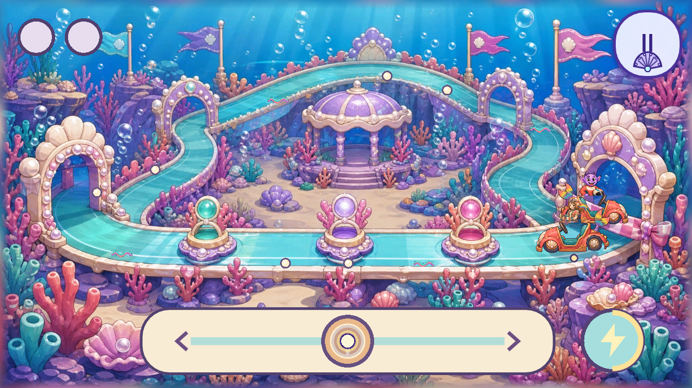

# Opera Racer: existing engine integration

> Historical individual-candidate report on base `775ceee1`. For the combined candidate reconciled onto `8aab459c` and current validation status, see [Opera reconciliation](OPERA_TWO_ACT_PERFORMANCES_2026-09-05.md#reconciliation-onto-current-dev--2026-09-05). Earlier green probes and typography blockers below retain their original scope.

Status: **local implementation candidate; not merged or released**. Supporting implementation and visual-review evidence, not device acceptance or master-audit closure. Based on `origin/dev` commit `775ceee1b9f20118abec25ce933db292bb3c847e`.

The audit recommendation needs a correction in emphasis: the project already has a substantial racing engine in `scripts/kart.gd`. The defect was that Opera's RACE phase did not use it. Its one-circle gesture could return the trophy without a race, although the act introduction promised two laps, steering, zoom strips, and Turbo.

This candidate connects the existing driving logic to a true 2D Opera presentation. The sequence is now **finish the pit stop → push the kart to the line → drive two laps → Opera trophy and curtain call**. It does not create another reward owner or launch the legacy spatial race scene inside the Opera world.

## Shared mechanics

[`KartDriving`](../scripts/kart_driving.gd) extracts the established scalar driving calculations. Both [`KartGame`](../scripts/kart.gd) and [`OperaRacerSurface`](../scripts/opera_racer_surface.gd) call it for track progress, pickup charge, acceleration, turbo state, steering response, drift entry/tiers/release, and touch wall assistance. The old engine keeps its track geometry, vehicle choices, effects, AI, and payout behavior. Its existing 3D presentation remains migration debt; this change adds no 3D presenter.

The Opera circuit uses a closed `Curve2D` aligned to the approved painting. Steering changes the kart's lateral position and racing line. Pearl pickups and zoom strips occupy alternating lanes; a stationary centered finger cannot collect them all. Pickups charge the existing turbo meter. The rival follows bends and adjusts its pace to the player's position. A wall produces a gentle rebound; it never removes completed distance or collected pearls. Reaching the end of the second lap wins regardless of placement.

The short Opera version deliberately omits the old engine's vehicle selection, item attacks, ramps, braking, and pack collisions. Those are not required to complete this career and have not been claimed as ported. Shared drift thresholds remain unchanged; the shorter painted circuit currently reaches the silver tier under the diagnostic hard-steering policy, rather than demonstrating every tier from the longer original courses.

## Timing and introduction

There is no separate instruction screen. The race opens on the circuit with two pictorial lap indicators, a large steering control, and the Turbo lightning symbol. It reuses the existing recorded `op_racer_steer` line exactly: “Swipe to steer through the coral gates!” A moving touch indicator demonstrates the steering control without moving either kart.

The first deliberate touch starts a 1.5-second, three-pearl countdown with chimes. The nominal lap pace is 24 seconds; the two-lap center-hold diagnostic takes about 49.8 seconds including countdown and acceleration. An inside-line diagnostic takes about 43.3 seconds, collects six pearls, and triggers four turbos. These are deterministic controller simulations, not child playtest timings. The competition's internal pace reference is now 70 seconds so the longer real race does not inherit the old 34-second gesture target.

A single finger can steer, lift, and tap Turbo. A second finger may also tap Turbo while the first remains on steering. Holding Turbo remains live beyond the countdown. A full meter retains the original touch auto-fire assistance. An ordinary lift gets a two-second repositioning grace period, after which distance freezes and the touch demonstration returns. Scene-tree pause, application pause, and lost focus clear touch ownership while retaining the in-memory race position. There is no unattended finish or reward.

The full career still uses the existing exit/re-entry behavior: leaving the act and starting it again resets its active race. This candidate does not add a new disk checkpoint for a partly completed lap. Chapter 2 retains its existing completed-phase persistence and inherits the new Racer mode through the adapter.

## Artwork and scene construction

All runtime art is reused; no image generation or protected-source edits were performed.

| Existing art | How it is used |
|---|---|
| `assets_src/imagegen/opera_codex_2026-08-02/native/world_racer_native.png` and four shipped world tiles | The unchanged 1672×941 painted circuit is reconstructed from its padded 1024-pixel tiles, using its native image region rather than the blurred padding. |
| `assets/opera/worlds/widgets/widget_crank_racer_kart.png` | The same coral-and-gold kart used in the pit stop becomes the moving vehicle. Its square source proportions are preserved. |
| `assets/opera/worlds/widgets/widget_crank_racer_wheel.png` | The repaired rear wheel remains installed at the authored hub; the already-painted front wheel is not doubled. |
| `assets/opera/worlds/widgets/widget_push_racer_mover.png` | The existing rear-view kart continues to illustrate the push-to-the-line phase. |
| `assets/opera/worlds/actors/roshan_racer.png` and `rival_racer.png` | The approved upper-body artwork is clipped at the cockpit and drawn behind the kart body, preserving source aspect, identity, colors, and outlines. |
| `assets/kart/boost_ribbon.png` | Reused for the visible zoom strips. |
| Existing Opera trophy, animation atlas, music, chime, and voice assets | Continue to supply preparation, instructions, feedback, and the final celebration. |

Cars remain upright authored cutouts and mirror together at changes of direction. Depth scaling, contact shadows, a small drift-entry hop, and restrained boost/drift sparkles place them on the 2D circuit. The front line passes in front of the painted pearl daises. The large steering control uses the game's cream, lavender, aqua, and gold UI colors. Racer's old focus ellipse and duplicated standing actors are hidden during driving.

The painting is still a flattened scene. It does not supply separate occlusion masks or alternate vehicle angles, so arch crossings and tight turns remain simpler than a fully layered racing scene. Its 1672×941 native source also remains below the master audit's native background-coverage requirement; reconstructing it from POT tiles does not increase native detail. Neither issue is marked closed.

## Validation and remaining acceptance

The evidence packet is [here](../audit/evidence/opera-racer-integration-20260905/manifest.json). Captures use the actual guarded Castle career route, official **Godot 4.7.2-stable**, and the **Mobile** renderer. They cover pit stop, starting circuit at 1280×720 and 1600×720, driving, second lap, and trophy. They are desktop review evidence, not a Lenovo Tab M11 performance result.

- The full Opera 2D probe exercises all 14 careers / 57 phases, including genuine Racer touch events, both laps, simultaneous steering/Turbo, wrong-finger rejection, interruption, re-entry, trophy ownership, and bounded Canvas lifecycle.
- Chapter 2's probe passes with the adapter accepting `kart_race`.
- The existing kart feel probe retains its measured inside-line advantage, reachable rainbow drift, speed response, frame-rate-scaled pickup charge, touch rocket start, and save/payout checks. Before/after race times differ by at most about 0.02 seconds. Its portal leave/re-enter failure was present before the extraction and remains unresolved.
- The game-wide 2D regression gate reports `NO_REGRESSION`; existing production 3D debt remains `UNSATISFIED`.
- Full local CI stops at two existing typography fixtures: the stale U+2019 allowlist entry and the recorded `dust_boss.gd:1118` source-line assertion. No unrelated fixture was relaxed to pass this candidate. Because the full required gate is red, there is no commit, push, integration, or release claim.

Before promotion: clear the repository gate failures and rerun exact-head validation; play the race on the target tablet for touch reach, readable lateral movement, car/arch contact, audio timing, and sustained 30 fps. Preserve the prior audit's original score as a record of the old one-circle build. A revised score should distinguish this tested implementation candidate from target-device acceptance.
