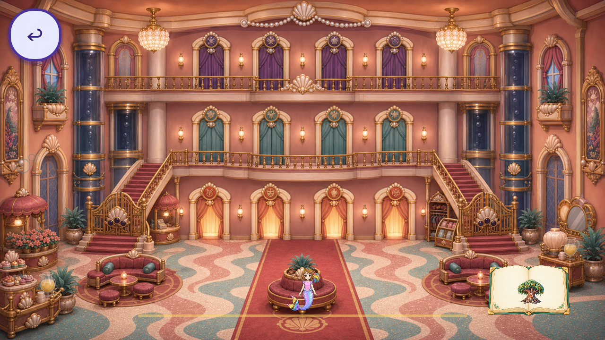
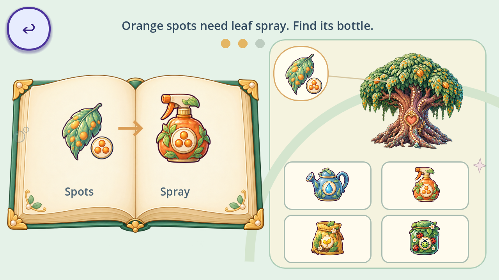
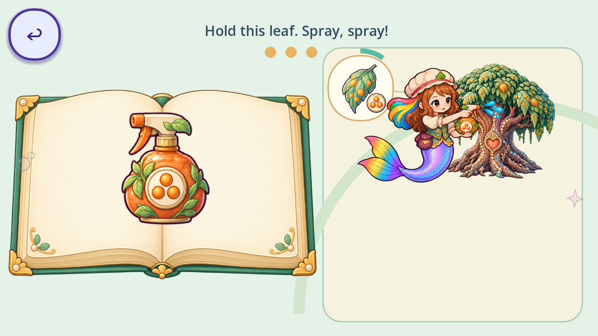
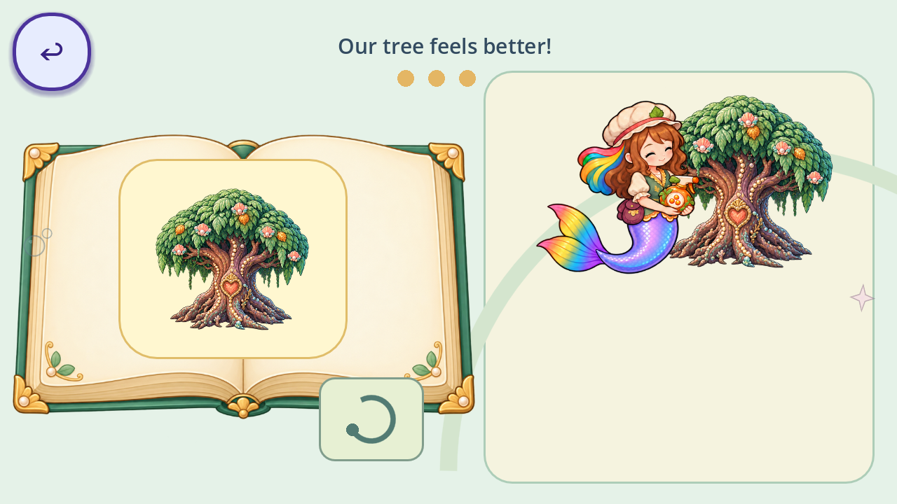

# Opera House Tree Book test level

Status: implemented test activity; owner, child and Android acceptance pending.
This is one orange-spotted pearl-heart patient, outside the stable career/star namespace.
It does not integrate the Arborist into Day Two or place Candy Maker in the Kitchen.

## Enter and play

In the Opera House, tap the illustrated tree book on the lower-right foyer floor.
For a focused desktop review, run Godot 4.7.2 with
`--path . scenes/arborist_tree_book_test.tscn`.
The standalone scene quits on Back; the in-game entrance returns to the Opera House.

1. Match the patient tree to one of four pictures in the left book.
2. Match its diseased leaf to one of four leaf pictures.
3. Read the picture equation: orange spots → orange-spotted spray bottle.
   Select one of four medicines on the right.
4. Roshan carries the bottle toward the patient. Hold the enlarged spotty leaf to spray.
5. The same patient blooms and its picture becomes a book sticker. The circular arrow repeats practice.

Exact generated Roshan cues accompany each page, plus two gentle wrong-choice cues.
Five idle seconds highlight the answer; ten show a moving hand. Neither makes a choice.
A second finger, canceled tap, focus loss, pause or an old held press cannot answer.
The additive `arborist_tree_book_test` save contains schema, patient, step and partial treatment.
It leaves career stars and chapter masks alone.

## Artwork and motion

Book, patient pair, leaves, medicines and reading pose reuse the [published packet](ARBORIST_TREE_BOOK_HANDOFF_2026-09-29.md).
Only the missing carry/aim/spray/finish action was generated for this test.
Native images, rejected candidates, prompts, hashes, measured atlas regions and logical
padding are in `assets_src/imagegen/arborist_test_20260930/PROVENANCE.json`.
Runtime PNGs use lossless imports and at most 1024 pixels on the longest side.
The action remains a Canvas game interaction, not cinematic delivery.

The test deliberately has four choices throughout. It follows Teacher's intentional
press/release and kind-help behavior but owns its separate book geometry and case state;
it does not claim to use the adaptive maths lesson generator.

## Evidence and remaining acceptance

[Audit impact](audit_impacts/opera-tree-book-test-20260930.json) records the exact baseline and gates.
`probe_tree_book_test.gd` exercises the state/input contract.
The trusted `probe_opera_2d.gd` also runs the shared checks with a real ReefMain and Opera House venue,
including enter, saved exit, reentry, teardown and unchanged stars.
Desktop Mobile-renderer captures cover the six states and foyer entrance.

Still required: phone/tablet touch feel, child comprehension, owner artwork and voice review.
The legacy project font authority remains unresolved; the test uses the existing StorybookUI role.
Tree-card distractors include two recovered low-resolution reference drawings; their background treatment
still needs art direction before this becomes a shipping career. Three patient cases, species-specific
diseased leaf variants, and Day Two integration remain future work.
No MA finding is closed by this prototype.

## Review images

Reproduce controlled composition captures with `--rendering-method mobile --script tools/capture_tree_book_test.gd`; use isolated APPDATA/LOCALAPPDATA for review.

Final focused validation: 49 standalone and 56 integrated checks pass. The full local run passed its static/import gates and 76 of 77 trusted probe executions; `probe_load` exited 127 without an assertion failure and passed an isolated rerun (exit 0). See [verification receipt](../assets_src/review/tree_book_test_20260930/VERIFICATION.json). A clean remote CI run is still required before integration.
