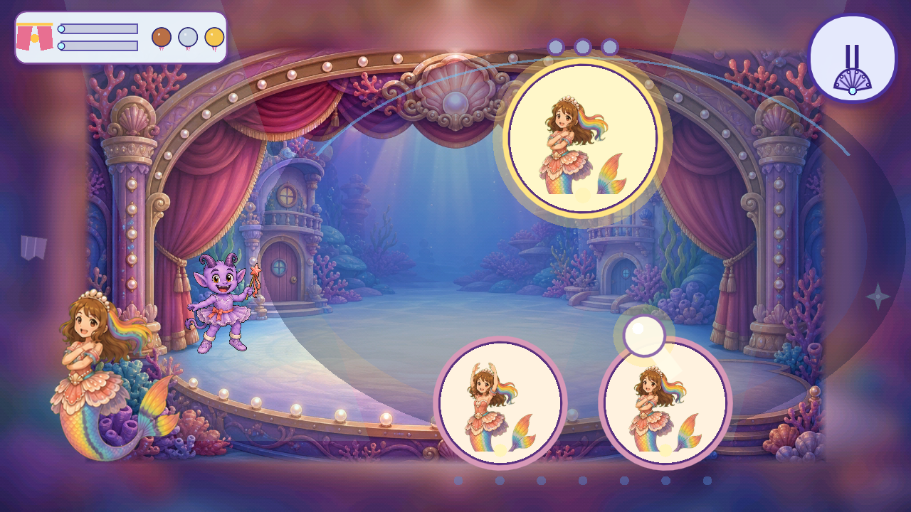
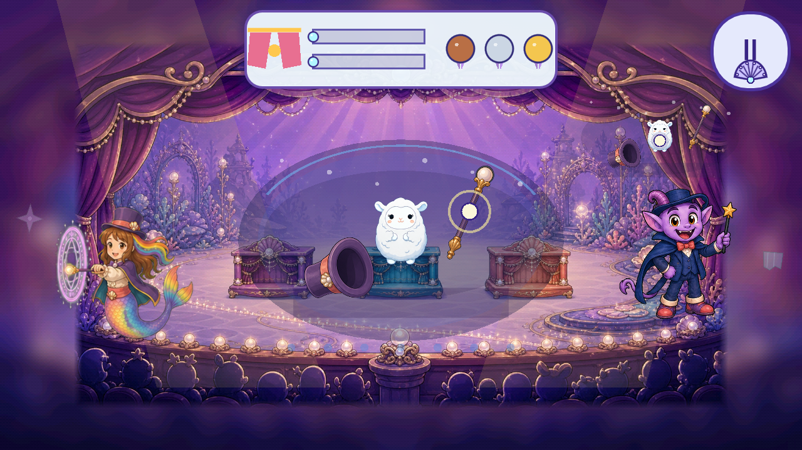
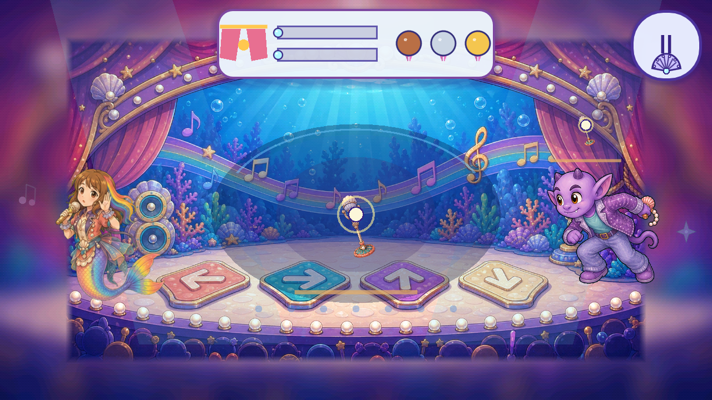

# Opera Hall two-act performances and mastery review

**Review date:** 2026-09-05
**Scope:** the literal Opera Hall venue only: Ballerina, Magician and Pop Star. This report reviews the current local implementation and its preserved three-candidate consolidation. It does not extend the Chapter 2 story tutorial or add a second tutorial system.

**Status:** reconciled candidate on `dev` base `8aab459c`; the complete local gate passes all 78 trusted probes, and the two additional mastery/performance probes pass. Earlier typography and Teacher music failures below are preserved historical results. Remote exact-commit CI remains a separate integration gate. Child/device acceptance and the game-wide 4.5 art standard are not established by this report.

## How the two acts work now

`scripts/opera_performance_plan.gd` enables exactly `ballerina`, `magician` and `popstar` when the run is ordinary freeplay. Chapter 2 story configurations, phase overrides and scene adapters opt out. The plan prepends three copies of the first source phases as `practice`, then appends the complete source phase list as `stage`; `stage_start` is therefore `3` for all three Opera Hall games.

The room act remains the existing Opera career world. A child reaches the painted rehearsal object, opens the tactile surface, and completes the practice copy. The current world code keeps stations armed until the child reaches them (`scripts/opera_career_world_2d.gd`). It then disables the room hotspots and opens the stage task when `phase_index >= performance_stage_start`. The stage swaps to the native stage tile set, lays out the actors, and opens the same surface without requiring a second room hotspot.

The transition is visually legible. `scripts/opera_performance_overlay.gd` uses a book symbol during practice, a curtain symbol on stage, one child progress bar, and a second rival bar only on stage. The overlay is wordless and passive. It does not turn the central play area into a text-heavy menu. The stage layout gives the child the working area in the middle; Ballerina places Roshan at `(12,372)` and the costumed imp at `(238,350)`, size `150×150` (`scripts/opera_career_world_2d.gd`), which reads as a rear-left partner. Magician and Pop Star use the shared central activity surface, Roshan at the left, and the costumed rival at the right. Their small passive rival-work surface is created at `(916,144)`, scaled to `0.70`, and input-transparent (`scripts/opera_career_world_2d.gd`). This is the correct visual relationship for a rival that demonstrates parallel progress without stealing the child's touch lane.

The imp is a scripted pacer, not an opponent with authority over the child's outcome. `OperaCompetition.tick()` advances `rival_progress` from elapsed stage time and emits `rival_step`; the rival does not read a second input stream. On completion it bows at `rival_progress >= 0.999` (`scripts/opera_career_world_2d.gd`). `OperaCompetition.complete()` completes the child and, for cooperative cases only, joins the partner's progress; these three Opera Hall acts use the ordinary performance path. There is no damage, lost star or forced fail in the two-act path. A stage miss increments optional mastery telemetry, while the task remains open and progress is retained (`scripts/opera_career_world_2d.gd`).

## Practice-to-stage coherence

| career | practice copies | stage replay | native scene/actor continuity | assessment |
|---|---:|---|---|---|
| **Ballerina** | 3: Pearl Mirror, Ribbon Trail, Grand Twirl | Repeats all 3 source phases after the three practice copies | `stage/finale_stage_c0r0.png`…`c1r1.png` is selected for Ballerina; the stage has three recital marks. Roshan uses `roshan_ballerina_sheet_a.png`; the rear-left partner uses `rival_ballerina.png` and state art. | Strongest transition. The child learns a fixed pose → ribbon → circle vocabulary, then recognizes it in a cleaner recital frame. The three marks give the stage a visible reason to replay the same order. |
| **Magician** | 3: Vanish, Track, Rope | Repeats all 5 source phases: Vanish, Track, Rope, Cabinet, Portal | `stage_magician_c0r0.png`…`c1r1.png`, `roshan_magician_sheet_a.png`, and the complete `rival_magician_*` family. Passive mirrored widget is outside the central input surface. | The first three copies teach the core verbs; Cabinet and Portal arrive as a genuine stage extension. The stage can feel like a show rather than a duplicate because the actor and magic backdrop stay visible while the child moves through the familiar verbs. |
| **Pop Star** | 3: Sound Check, Dance, Rhythm | Repeats all 4 source phases, adding Encore on stage | `stage_popstar_c0r0.png`…`c1r1.png`, `roshan_popstar_sheet_a.png`, and the complete `rival_popstar_*` family. Passive mirrored widget is outside the central input surface. | Clear progression from microphone hold to arrow choice to echo, then a short circle encore. The extra stage phase is an appropriate curtain-call mechanic, but the echo phase needs especially clear auditory and visual confirmation on a phone. |

The implementation preserves the “same skill, new framing” principle. The repeated stage phase uses the original phase dictionary, mode and goal; it does not invent a competing puzzle. The costumed imp shows parallel work in the Magician and Pop Star mini-view, while Ballerina's imp remains a visible partner rather than a second tiny work surface. This is a good asymmetry: Ballerina's specialist surface already carries the visual instruction and the rear-left actor reinforces the duet.

The main coherence risk is repetition length. Ballerina runs six phases total, Magician eight and Pop Star seven. A child who completes every practice copy sees the same first three gestures immediately again, now with a rival bar and stage frame. The art transition supplies novelty, but the feedback should make the repeated action feel like a performance reprise: preserve the same object target, add one short rival cue, then return attention to the child. Do not add extra stage-only mechanics that would break recognition.

## Current mastery and medal contract

The pure model is in `scripts/opera_mastery.gd`. Practice never awards a medal. A confirmed stage completion always earns Bronze, even if optional telemetry is absent or malformed. `actions` is not raw touch count: the model counts unique quarter milestones, with four possible milestones per completed stage phase. This prevents repeated held frames, duplicate taps or helper animation from manufacturing mastery. `misses` counts incorrect/off-target inputs and `assists` counts a revealed answer or guided action. `active_seconds` is accumulated only while the stage interaction has started and competition is active (`scripts/opera_career_world_2d.gd`); navigation, room discovery and pauses are excluded.

| career | stage phases | minimum milestone actions | Bronze | Silver | Gold |
|---|---:|---:|---|---|---|
| Ballerina | 3 | 12 | Any confirmed stage completion | ≥12 actions, ≤2 misses, ≤1 assist, active time ≤86s | ≥12 actions, 0 misses, 0 assists, active time ≤54s |
| Magician | 5 | 20 | Any confirmed stage completion | ≥20 actions, ≤2 misses, ≤1 assist, active time ≤68s | ≥20 actions, 0 misses, 0 assists, active time ≤40s |
| Pop Star | 4 | 16 | Any confirmed stage completion | ≥16 actions, ≤2 misses, ≤1 assist, active time ≤66s | ≥16 actions, 0 misses, 0 assists, active time ≤40s |

These are exact current values from `OperaMastery.RULES` (`scripts/opera_mastery.gd`). The model evaluates Gold first, then Silver, so a clean act beyond the Gold time but within the Silver time receives Silver. Silver is deliberately limited to two misses and one hint for these three acts. Bronze does not punish a slow or assisted completion.

The current probes test the threshold ordering, malformed telemetry fallback, practice exclusion, pause exclusion, upgrade-only behavior and token arithmetic (`scripts/probe_opera_mastery.gd`). Those probes are model evidence, not child-play evidence. The threshold values remain provisional tuning until a real listening/touch review establishes whether they are comfortable on the target phone. Automated completion is not a four-year-old performance benchmark.

## Game-by-game quality review

### Ballerina — 4/5 provisional

**Pros:** The three-phase vocabulary is unusually coherent. Pearl Mirror establishes imitation, Ribbon Trail turns that imitation into a guided trace, and Grand Twirl gives a simple celebratory circle. `BalletSurface` owns a deliberate held-pose atlas rather than a generic chronological animation; the focused probe checks Pearl Mirror, the exact pose frames and the no-chrome practice state (`scripts/probe_opera_2d.gd`). The stage art has three open recital marks, so the child can read the transition spatially. The rival Ballerina is visually consistent through idle, windup, bow and recovery state art, and its rear-left placement leaves the central specialist surface clear.

**Cons:** The stage repeats all three phases immediately after three practice copies, so the second act depends heavily on curtain framing and partner acting for freshness. At 720p, some pose choices have similar silhouettes; arm placement needs to remain immediately distinguishable without relying on small hand details. A pose-matching miss can also be hard to distinguish from a deliberate held pose if the mirror response is too quiet. The Gold window of 54 seconds is plausible for a short three-phase act, but it is unverified on the target device with the actual voice holds and child pauses. The rear-left rival reads as a partner; it needs a clear small bow/turn cue so it does not look like a decorative cutout.

**Potential improvement:** Keep the exact phase order and add one distinct, non-reading stage cue per phase: the rear-left imp mirrors the selected pose, points its wand toward the ribbon lane, then opens its arms for the twirl. Use the existing Ballerina state art and stage marks. Treat the child’s successful stage reprise as the main performance, with the rival pacing visually rather than competing for touch focus.

### Magician — 3.5/5 provisional

**Pros:** Magician has the broadest tactile variety of the three: hold to vanish, choice to track, swipe to unrope, a cabinet-specific interaction, and a circle portal. The first three practice copies teach the core verbs before Cabinet and Portal expand the stage act. The costume identity is strong: the rival remains the same purple imp while the hat-and-wand silhouette explains its role. The small mirrored work view at the right lets the child see the rival advance without moving the main activity surface. The 40-second Gold and 68-second Silver windows are explicit and easy to audit.

**Cons:** Five stage phases create the longest Opera Hall replay at eight total phases. Track and Cabinet both rely on following a moving or revealed target, so two nearby visual demands may feel similar if the stage prop contrast is weak. The passive mirrored surface is intentionally non-interactive, but a child may still tap it; the input-transparent behavior protects the puzzle while leaving a possible comprehension gap. The scripted rival progress is time-based, so its apparent trick success is only loosely connected to what the child is doing.

**Potential improvement:** Use the rival mini-view as a simple visual clock: show one unmistakable completed hat, rope or cabinet state per rival step, then return to the child’s full-sized work surface. Hold the rival view steady during the child’s choice and change it only at a phase boundary. Keep the stage's central portal and cabinet art as the recognition anchors. A single spoken cue and pointer after an idle interval is sufficient; extra decoys would weaken the clean magic lesson.

### Pop Star — 3.5/5 provisional

**Pros:** The sequence has a satisfying concert arc: microphone sound check, arrow dance, three-star echo, and an encore spin. The stage tile set, actor costumes and arrow-lane composition support a visibly different second act while retaining the same musical verbs. The rival’s passive mirrored work view gives the child a clear “another performer is moving too” signal without splitting the touch lane. The 40-second Gold and 66-second Silver limits are explicit tuning hypotheses; they have not yet been validated with a child.

**Cons:** Echo is the most listening-sensitive phase. A child may complete the gesture or tap sequence correctly while the sound is masked by room noise, a low device volume or overlapping voice. The stage replay adds one Encore phase after the three practice copies, so the show is long enough for the last phase to feel like a new task rather than a reward. The rival's scripted progress can read as a race bar instead of a musical partner if its visual changes are not synchronized with the phrase feedback.

**Potential improvement:** Make every echo success visible as a large, short-lived three-star replay on the stage lane before the next cue; retain the existing voice and avoid adding reading-dependent labels. Let the rival finish a phrase and bow while the child still has full control. Treat Encore as a celebratory reprise with a slower, forgiving circle target so the final action feels like a reward for participation rather than a hidden extra test.

## Encore tokens and persistence

`OperaMastery.TIER_VALUE` assigns lifetime values of 1 Bronze, 3 Silver and 6 Gold. `apply_result()` grants only the increase over the previous best: first Bronze +1, Bronze→Silver +2, Silver→Gold +3, and no tokens on a replay at the same or lower tier (`scripts/opera_mastery.gd`). The saved ledger keeps each career's best tier and an Encore wallet; `OperaAct._win()` stores it under `opera_mastery`, mirrors the best tier to `medals["opera_" + career]`, writes the save, and updates the HUD (`scripts/opera_act.gd`). The result overlay shows the earned delta and retained balance as two pearl counters (`scripts/opera_performance_overlay.gd`).

The wallet is an achievement record only at this point. Spending or upgrade purchases are not built, so the report treats Encore tokens as persistent cumulative rewards with delta-only upgrades. A slower replay cannot downgrade a medal or mint duplicate tokens. The save normalizer adds `opera_mastery` and `opera_performance_checkpoints` with safe defaults (`scripts/save_state.gd`), preserving existing save compatibility.

## Research basis and limits

The recommendations use official early-childhood guidance as design context, not as evidence of this child’s behavior or a universal four-year-old timing standard.

- Head Start describes responsive teaching, supportive feedback and motivation to continue effort: [Teaching Practices](https://headstart.gov/teaching-practices).
- Head Start describes scaffolding as observing a child's current level, offering support, then observing again, with graduated challenge in its curriculum review: [Tools of the Mind curriculum review](https://headstart.gov/curriculum/consumer-report/curricula/tools-mind).
- Head Start includes coordinated cooperative play, turn-taking and shared goals in its preschool social-emotional framework: [Social Preschool](https://headstart.gov/school-readiness/article/social-preschool).
- NAEYC defines developmentally appropriate practice as strengths-based, play-based and joyful, with attention to individuality and context: [Defining DAP](https://www.naeyc.org/node/3807). Its position statement calls for frequent, timely, specific feedback and experiences in which children can be challenged and genuinely successful: [DAP position statement PDF](https://www.naeyc.org/sites/default/files/globally-shared/downloads/PDFs/resources/position-statements/dap_ps_final.pdf).

The current three-game Opera Hall slice applies those principles through repeated low-risk practice, recognizable stage reprise, timely visual cues and an upgrade-only reward ladder. The scores above are subjective implementation-quality scores, not child outcomes. Exact-engine focused checks pass. Target-device review, audio listening review and owner visual acceptance remain pending.

## Timing, illustration-to-scene interpretation, and remaining polish

The current required work is explicit, so tutorial length can be tuned by reducing repetition without changing the skill:

| Game | Introductory work before stage | Additional stage-only work | Timing observation |
|---|---|---|---|
| Ballerina | Three pose matches, one S-shaped ribbon trace, one guided twirl | None; all three skills return | 2.15s pose demo, 1.55s action demo; three practices plus three stage phases. |
| Magician | 3.8s wand hold, five successful hat choices, five rope swipes | One cabinet pull and two portal rotations | Hat shuffle is 1.5s with at least 2.2s cue flash; five repeated choices are the largest rehearsal-length lever. |
| Pop Star | 3.8s microphone hold, six arrow choices, three echo verses of 2/3/3 notes | 1.8 encore rotations | Echo demonstrations space notes by 0.55s; response has no tap-tempo requirement. Six arrow choices may be excessive immediately before a stage reprise. |

These counts are code requirements, not stopwatch measurements. Navigation, voiced instructions, corrective attempts and the child's own looking time make total session duration longer. A useful next child test compares three versus five Magic hat choices and three versus six Pop Star arrow choices; retain the version that teaches the skill with less fatigue.

Ballerina gives a 2.15-second pose demonstration and 1.55-second action demonstrations. Its native help increases after five and ten stuck seconds; the world also repeats an instruction after its idle interval. These are instruction timings from code, not measured whole-session lengths. The new stage clock starts with the first actual interaction in each phase. Initial looking time, discovery and the pause screen are excluded; thinking time after interaction starts still counts. Gold/Silver should be calibrated against several actual child sessions before becoming a progression requirement. Later story access must never depend on beating the pacer.

The stage is a genuine change of background ownership: room interaction markers disappear, approved stage tiles take over, and the child’s familiar puzzle opens directly. It is still a composition of a flattened painting and live 2D controls. Native painted props do not automatically become depth masks, contact geometry or interactive objects. Accordingly, this candidate does not close the master audit’s native-source resolution, occlusion, identity-review or target-device performance requirements merely because the stage looks complete at 720p.

The first capture pass exposed a Ballet header covering the target portrait and floating rival placement in Magic. The Ballet header is now a compact upper-left display outside the specialist input surface. Its imp is a smaller rear-left actor. Magic and Pop Star place the imp at `(974,294)`, with a separate, passive work preview above its head. These choices preserve the main touch area and align the rival with the painted performance floor. The preview remains an inset demonstration; it is not a fully simulated second player or physically joined stage prop.

Magic’s VANISH previously represented Lamb-a with three white circles. It now directly draws the first 256×256 frame of the approved `assets/minigames/seek/lamma_animation.png` atlas, keeping its face, outline, wool shading and source pixels. The existing hat, wand, disappearance curve and empty-hat payoff are preserved. No asset was generated, altered, re-encoded or substituted in the protected original folders. This closes one visible identity placeholder; it does not imply that every Magic prop or transition passes the full art audit.

The bars and medals use shared storybook UI colors but remain simpler and flatter than the painted costumes. The next useful polish work is to make the player/rival bars identifiable by small existing character portraits, tie each rival pose to a recognizable action beat, and observe whether children mistake the inset for a second touch target. Do not solve that by shrinking the child’s puzzle or adding written instructions.

The introductory acts preserve existing voiced objectives and gesture demonstrations. The new book/curtain framing has no distinct authored spoken transition yet. A short exact “Now let’s do our show” cue and a pause for recognition would improve the change of act; the current immediate stage opening should be assessed during listening review. No additional mandatory reading screen has been added.

## Consolidation and review authority

This worktree combines the previously separate [Racer integration](OPERA_RACER_ENGINE_INTEGRATION_2026-09-05.md), [Geologist rebuild](GEOLOGIST_REBUILD_2026-09-05.md), and [Teacher learning engine](TEACHER_LEARNING_ENGINE_2026-09-05.md) candidates from the same base commit. Their reports and evidence remain historical snapshots of those individual builds; the current combined roster has **15 live careers and 70 phase units**, including the nine additional practice copies in the three Hall games. No two-act behavior was added to Teacher, Geologist, Racer, other Castle careers, or Chapter 2 story adapters.

The earlier whole-roster mechanics audit remains a separate review artifact at `../opera-mechanics-reaudit-20260905/audit/OPERA_MECHANICS_REAUDIT_2026-09-05.md` relative to this worktree's parent. Its scores describe the earlier implementations and must not be silently rewritten as scores for these rebuilt candidates.

Current diagnostic captures use the actual guarded Opera Hall route, official Godot 4.7.2-stable and the Mobile renderer on a desktop GPU. The capture harness opens the initial practice and stage explicitly and injects a 57% rival state and a sample Silver result to inspect their layout. These images prove visual composition at 1280×720 and 1600×720; they are not evidence that a child earned Silver, an autonomous opponent solved the puzzles, or the target phone sustains 30 fps.

## Interruption behavior added during verification

The initial two-act candidate saved completed phases but restarted the open puzzle. That gap was repaired: each career checkpoint now includes a validated current-phase identity and normalized progress. Ballerina restores accepted poses, ribbon coverage and twirl progress; Magic/Pop Star restore accepted hold, choice, swipe and rotation work. Pop Star additionally retains its accepted note prefix within the current echo verse. Active fingers, cabinet pull-in-flight, pointer positions and animation timers are transient and are not replayed.

A validated snapshot remains banked while Roshan walks back to a practice object, so exiting again before opening it does not overwrite that work. A checkpoint captured during an earned completion hold advances to the next phase on return. The final completed phase awards its already-earned result once; the upgrade-only medal ledger prevents repeat currency. Save writes occur at accepted progress milestones, Echo note prefixes, periodic active-stage intervals and lifecycle/phase boundaries. Sudden OS termination between writes is distinct from a normal pause/exit; device interruption testing remains required.

## Historical verification on base `775ceee1`

These results describe the preserved pre-reconciliation candidate, not current `dev`. All runtime checks below used the official Godot **4.7.2-stable** binary and separate probe save directories:

| Check | Result |
|---|---|
| Pure mastery/Encore ledger | ALL OK; practice exclusion, tiers, upgrade-only rewards, spent-balance preservation and malformed data |
| Full Opera 2D | ALL OK; 15 careers / 70 phases, including the combined Teacher, Geologist and Racer engines |
| Connected Hall performance | ALL OK; 16 contracts covering real input, clock/pause boundaries, imp-first continuation, partial save restore, Echo prefix, phase promotion and duplicate payout |
| Gesture quality | ALL OK; 274 checks including approved Lamb-a atlas identity |
| Opera routing/rewards | ALL OK |
| Save recovery and legacy load | Pass |
| Chapter 2 progression/story boundary | Pass |
| Voice, living world and cooperative Nursery | Pass |
| Changed-script parser, inference lint and analyzer | Pass |
| Document authority | Pass after preserving the complete historical Racer evidence packet |
| Game-wide 2D regression | NO_REGRESSION; existing 56 production 3D files remain UNSATISFIED |
| Full `scripts/ci.sh` | **Blocked**: 40 typography/layout tests, two inherited failures, one skipped |

The full CI failures are the stale glyph allowlist entry `U+2019` and the exact-source fixture pointing to `scripts/games/dust_boss.gd`. Neither is changed or waived by this work. A separate initial performance-probe launch collided with an unrelated concurrent Godot capture and exited without a verdict; the isolated retry passed and is the retained acceptance log.

Because the required complete gate remains red, this is a **reviewable local candidate**, not a commit, push, dev integration, APK or release. No existing child save was used for validation. The review package preserves the patch, changed/new source and authored assets, screenshots, logs and hashes. Green exact-head CI and a short child/device playtest remain the next release gates; medal thresholds and the later uses of Encore tokens remain adjustable product decisions.

## Reconciliation onto current dev — 2026-09-05

The combined gameplay candidate has been reapplied without rebasing the original worktrees onto `8aab459ceea61c204aa943fb1d82e0cc62ea0ba0`, on branch `codex/opera-preserved-dev-reconcile-20260905`. All six original dirty worktrees and their import sidecars were preserved in verified archives before reconciliation. Shared documentation retains both the intervening dev additions and the candidate's provenance. The linked visual captures remain historical evidence from the source candidates.

The fresh run passes the 40 typography/layout contract tests (one skipped), the Roshan 2D gate, game-wide 2D contract tests and stress cases, probe parity, and document authority after restoring both complete screenshot evidence folders. This supersedes the earlier claim that the two typography fixtures block the candidate. Full validation and exact-head remote CI are still pending; no integration, release, device acceptance or 4.5/5 art acceptance is claimed.

The reconciled candidate also passes exact Godot 4.7.2 import with no script errors, analyzer checks for every changed GDScript, and eight explicit runtime probes: Opera 2D (15 careers / 70 phases), Opera routing, save recovery, Kart feel, voice, living world, mastery, and connected Hall performance. The last two are additional checks outside the standard trusted probe roster. Save recovery deliberately exercises corrupt/newer-save refusal; its expected warnings are retained in the log. Kart feel reports its existing exit-time ObjectDB leak warning, so this pass is not a memory-leak or target-device certification.

The new Teacher speech exposed a separate audio-authority integration gap: the legacy generator catalogs had been interpreted as filler-only, while Teacher's 17 clips have a separate runtime directory and provenance manifest. The current repair classifies them as voice and validates the separate manifest's file list, text/speaker authority and hashes. Listening, voice identity and child comprehension remain open. Full-suite results must be read from the final reconciliation validation record rather than inferred from the earlier individual-candidate logs.

Final Teacher authority hardening passes 24 focused contract tests and a fresh production validation of all 17 clips. Missing or nested files, arbitrary legacy-cohort reassignment, altered source/text/speaker/media claims, clipping and exceeded true-peak limits are blocking. The original generation script is preserved in `assets_src/teacher_learning_2026-09-05/make_voices_generation_source.py.gz`; its exact decompressed hash matches the unchanged manifest and its normalized text matches the current generator. Model/voice hashes are pinned recorded generation evidence, not locally remeasured weight files. The 796-row complete audio check passed; the later stricter authority checks do not change the ledger rendering. Existing 779 rows retain all human-review fields, with only four Racer runtime-reference counts updated.

The complete pre-music-repair reconciliation run reached all **78 trusted probes** and exited 1. Exactly one probe failed: `probe_audio` found that Teacher reused Nursery's cue, violating the established unique-career music contract. The other 77 trusted probes passed. Earlier static, typography, source-art, music/audio, visual-contract, scene and import/regression checks all completed without a blocking failure; the advisory art audit remains open. This is a real candidate defect, not an inherited typography blocker. Its original log is retained at `tmp/validation/full-ci-reconciled.log`, with a structured summary at `tmp/validation/full-ci-before-music-summary.json`. A distinct Teacher cue and a fresh complete gate are required before committing or claiming readiness.

Teacher now routes to its distinct `opera_teacher` cue, “Pearls in a Pattern”: a 30-second, 96 BPM, low-energy music-box loop with no percussion and repeated note groups separated by rests. The canonical catalog/manifest now covers 44 cues. The complete isolated build reproduced all 43 prior catalog OGGs byte-for-byte; their live files and import settings were preserved, including Godot-added UID lines. The pre-existing non-catalog Geologist cue was also preserved. The new track has loop tags, 48 kHz stereo Vorbis at approximately 93 kbps, measured -17.98 LUFS and -6.63 dBTP. These are technical measurements, not listening, child or device acceptance. A fresh complete gate is running against this correction.

## Current local validation result

The corrected reconciliation candidate passes the complete `scripts/ci.sh` gate with **exit code 0 and all 78 trusted probes** on official Godot 4.7.2-stable. The two additional mastery/performance probes also pass. The final run includes the distinct Teacher cue, full 44-cue music provenance check, 797-file audio check, all 24 hardened audio contract tests, and the established visual/scene/import/2D-regression gates. The earlier music failure remains preserved as historical evidence.

The [validation manifest](../audit/evidence/opera-reconciliation-20260905/manifest.json) binds the [complete passing log](../audit/evidence/opera-reconciliation-20260905/full-ci-final.log), earlier failed run, focused contracts, Teacher provenance checks, and preservation comparisons by hash. No original dirty worktree or import churn was discarded. This local result does not itself establish remote exact-commit CI, integration, release, child/device acceptance or game-wide 4.5 art acceptance.

The validation packet keeps exact original captured log bytes in deterministic `.log.gz` files. Its readable `.log` copies remove only trailing horizontal whitespace and surplus EOF blank lines and normalize line endings; their hashes and roles are recorded separately. Test verdicts and content lines are preserved.
