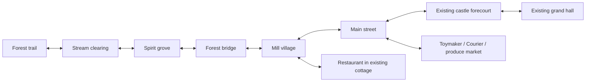

# Northern Christmas — source-led world and career draft

Status: `PROPOSAL_DEFERRED`, revision 2, 2026-09-05. The owner found the
interaction concept stronger but rejected the severe truncation of existing
Northern art, the recreated castle and the bridge pathfinding mismatch.
Those corrections control this revision. The community premise and career
details remain proposals; no game implementation is commissioned here.
Parent: [Northern planning branch](NORTHERN_ICE_WORLD.md).
Current [illustrated guide](../../assets_src/concepts/northern_christmas_2026-09-05/guide.html).
Complete [recovery inventory](../../assets_src/concepts/northern_christmas_2026-09-05/recovery_manifest.json).

## 1. Keep the interaction idea; restore the actual world

**Working title: Christmas in the Blue Forest.** Roshan helps the existing
Northern village prepare a Christmas gathering in its established crystal
castle. Familiar and new careers contribute food, decorations, a toy, an
invitation and a song. Results remain visible and progress remains safe.

The setting is the full authored sequence: forest trail, stream clearing,
spirit grove, forest bridge, mill village, main street, castle forecourt and
grand hall. Do not compress it into a new single village overview. The
original brief called for a long forest approach (roughly 20–30 seconds of
travel before optional stops), a road through the riverside settlement, then
a castle with rounded stairs and upper bedrooms. Timing remains a design
target pending child/device review; no forced walking grind is required.

No Ember continuation, Santa-led plot, named major new cast, or replacement
of Chapter 2's birthday is established. Incidental customers remain candidates.
The V1 restaurant board survives only as a useful ordering/workspace/serving
composition. Its invented room and fox are not appearance or cast authority.
The V1 village image is withdrawn as world, architecture and navigation guidance.

## 2. Recovered art authority and provenance

The missing art was located in `.worktrees/codex-northern-long-stage`, in
staged/uncommitted files. Its base commit `e9484c706d37a9c5802a045f76d92716dde18683`
does **not** contain the staged art, so a commit URL to that base would be
misleading. This explains why the initial main-tree/Git-history search failed.
The original art task is `019fa1c7-0af1-7c51-ab41-ef3bf1a142ca`, started July 26
and continued into late July. Exact files are now copied byte-for-byte into
the non-runtime review packet with source paths, dimensions and SHA-256.

Recovered together: eight original native panel generations, ten historical
concept/door-variant images and 71 separated layer candidates: 89 PNGs total.
The native-output catalog contains 22 files; the other outputs include rejected
fidelity attempts and later candidates, not 22 accepted environments. Historical
layer crops also need current seam/alpha/ownership review before any reuse.

| Panel | Identity and existing useful content | Planning use |
|---|---|---|
| Forest trail | Russet/gold canopy, teal firs, turquoise stream, cream foreground path | Arrival and unhurried discovery; retain this art rather than regenerating a winter entrance. |
| Stream clearing | Large stones, open bank, stream into the forest | Quiet observation; separately define foreground travel and optional depth crossing. |
| Spirit grove | Standing-stone ring and broad central clearing | Reserve optional Geologist/light-play or a later commissioned friendly encounter. |
| Forest bridge | Rope/plank crossing and rising right-bank path | Navigation correction candidate; prove crossing before adding an activity. |
| Mill village | Existing five-house frontage, watermill island and access bridge | Candidate restaurant in an actual cottage; Painter uses an actual window. Keep the mill and its route. |
| Main street | Smithy, cottages, produce market and rear pier | Market gardener at the existing produce frontage; Toymaker and Courier in existing buildings. |
| Castle forecourt | Established lavender gate/towers, crystal shoulders and fountain | Christmas welcome; preserve castle silhouette and clear fountain approaches. |
| Grand hall | Vaults, central fountain, paired rounded stairs and three upper bedroom bays | Ground-floor gathering and Pop Star finale; preserve the room and reserve upper bays. |

The recovered [original prompt record](../../assets_src/concepts/northern_christmas_2026-09-05/recovered/HISTORICAL_SOURCE_PROMPTS.txt)
binds the eight generation IDs to their panels. It also identifies the previously
confirmed July 29 image as `call_tzfmJgUoo9nr6dJSCMjBc3PU`, a later forest-trail
fidelity attempt rejected for resolution. Its family identification was useful;
it was never the entire family. Recovered licensing describes project-original
built-in generation using project art. Historical 3D and older resolution
instructions in that record are superseded; they are evidence, not work orders.

No source worktree, original PNG, protected asset, model or game script was
modified by recovery. Source native dimensions are recorded from PNG headers;
the historical note's approximate dimension description is not substituted for
measurement. These concepts do not meet the current 2048×2048 native coverage
per playable screen. No upscaling or runtime acceptance is claimed.

## 3. Geography and bridge correction

The panel sequence is not a proven seamless panorama. Author explicit exit and
entry anchors, camera ownership and transitions. The bridge's rising exit must
not be concatenated directly to a different-height village lane with a jump.
Do not stretch or repaint established scenes to hide unresolved navigation.

### Bridge finding and proposed repair

The recovered `scripts/arena/northern_promenade.gd` defines foot-source heights
370 and 485. `_sync_player_cards` interpolates between them using only the
depth coordinate; the selected panel and horizontal position do not influence
ground height. At central depth the source-foot height is 427.5 pixels. The
painted bridge deck is mostly around y=350–390 in the 1024×576 concept. A single
horizontal foot line therefore passes below the deck. This is a static-source
finding, not a reproduced current-build pathfinding result. The withdrawn V1
overview independently had no checked bridge/landing topology.

The guide overlays the unchanged original bridge with a **candidate ground
anchor route**: left bank → actual left landing → deck interior → right landing
→ rising right-bank path. A slider inspects that route; it is a planning
inspection, not a game or a runtime pathfinder. Candidate concept coordinates:

`(30,470), (170,429), (295,392), (411,367), (449,372), (506,364),
(591,352), (680,340), (716,324), (785,298), (852,260), (927,226)`.

For future true-Canvas implementation:

- Define each bank and the bridge deck as walkable regions joined only by real
  landings. An off-path tap projects to a reachable region, never a shortcut
  through water, a rail, a building or the fountain.
- Position Roshan's ground anchor on the route and validate the full footprint,
  sprite scale and camera projection. A correctly placed dot is insufficient.
- Split near/far railing occlusion as needed using approved pixels. Preserve
  bridge silhouette and avoid duplicating painted rails or hiding the full actor.
- Test both directions, tap-across, held movement, stop/turn, resume-on-deck,
  focus loss and screen transition. Check representative sprite sizes/aspects.
- Review the stream stones, mill island access, castle fountain and stairs
  separately. They cannot inherit a bridge PASS or use a global free-walk strip.

Do not patch or revive the old Sprite3D host to satisfy this plan. No runtime
navigation fix is claimed until the commissioned Canvas implementation passes
actual movement and in-context visual checks.

## 4. Six core careers, two optional extensions

First-pass complete chapter target: roughly 10–15 minutes of active play,
divisible into 30–90 second useful steps across many visits. Timing is a design
target, not a deadline or measured evidence. The child's pace always wins.

| Role | Old/new | What Roshan actually does | Shared contribution | Reuse and meaningful change |
|---|---|---|---|---|
| Market gardener / Farmer | Returning | Choose suitable produce at the existing market, fill a pictured basket and bring it to the restaurant | Ingredients become available in the restaurant | Inspect existing harvest, choice and placement behavior. Use actual produce states; do not invent a greenhouse when the market and garden frontages already exist. |
| Village restaurant / Chef | Returning, expanded | Read a dish picture by sight, choose its matching ingredients, perform a short recipe and serve that same dish to its customer | A warm dish appears on the shared table | Pour/circle/choice plus a new persistent order-to-dish relationship. This is the first representative prototype because it exercises the strongest mechanic remix. |
| Cottage window artist / Painter | Returning | Sweep color across two broad window shapes, then choose and place a large star decoration | That actual village window stays decorated | Inspect `paint_reveal` and large placement surfaces. Preserve the child's selected colors; do not replace the finished painting with a generic award. |
| Wooden toy maker | New local career | Fit two or three generous toy-boat pieces to matching silhouettes, then pull it once along a broad test track | The child's boat sits in the workshop display and later at the gathering | Combine picture placement with deliberate track motion; assembly and test are causal. Prefer a suitable existing toy family if found. Avoid miniature components, tools with danger, or adding a generic tap phase. |
| Christmas postal courier | New local career | Match an envelope's portrait to the same portrait on a door, follow one highlighted route, and intentionally post it | A neighbor joins or an invitation appears at the courtyard entrance | Reuse picture matching and established world routing. New contribution is carrying one persistent, visible item between places. No reading addresses, parcel count, delivery timer or map-memory requirement. |
| Grand-hall singer / Pop Star | Returning | Touch the illustrated instrument for a gentle sound check, then follow broad musical prompts to complete a short song | Lights and the gathering celebrate Roshan's completed contributions | Inspect Pop Star sound-check and musical input contracts. Missed prompts wait/recur kindly; no score or timing loss. Finale begins only on an intentional start action. |

Optional later candidates, excluded from the first six-career scope:

- **Geologist:** inspect existing Northern crystal art and the current Geologist
  lens/selection contracts; compare two large specimens and place a selected
  crystal in a window display. The crystal need not power an invented crisis.
- **Stuffie Doctor:** repair a village visitor's familiar toy using existing
  care/placement verbs. Use approved toy imagery; preserve protected friend
  portraits. This offers a quiet indoor activity if useful art supports it.

Do not add new permanent global career bits or move existing career homes just
to express these local roles. Chapter-specific progress is independent of the
existing global career completion mask and Chapter 2 milestones.

## 5. Restaurant visual and interaction specification

**Working name: The Lantern Kitchen.** Select an actual village cottage exterior; an optional removable
bowl sign can explain its restaurant use without changing the building.
Inside: indigo/teal painted timber, amber light, a snowy forest window, small
evergreen garland and muted red textile accents. Keep the existing Chef actor's
identity and outfit. A seasonal hat/costume is not needed for the premise.

Landscape stage composition, normalized against the safe content rectangle:

| Zone | Draft bounds | Purpose |
|---|---|---|
| Return and repeated voice | Upper left / upper right corners, 8% inset from device edges | One clear return affordance and replayable exact objective; no accidental overlap with order or workspace. |
| Active customer and order | Right 27% of width, upper/middle 65% of height | One kind customer with one large pictured dish. Keep request visible throughout cooking. Other patrons, if present, remain quiet background. |
| Roshan | Left 25% of width, middle/lower stage | Entire character including tail stays readable beside the workstation. Do not hide her lower half behind a counter or HUD card. |
| Preparation surface | Center 45% of width, middle/lower stage | One large bowl, pan or plate at a time, with two or three spaced choices. The active dish is the dominant touch target. |
| Serving destination | At the customer's table edge | Large plate silhouette/pointer that accepts the finished dish with forgiving tap-to-select/tap-to-place as well as drag. |

These are layout intentions to validate at actual aspects, not baked pixel
coordinates. Keep nonessential foreground garland/snow away from touch targets.
The V1 restaurant board is an interaction composition reference only. Its
invented room is not selected art or a hitbox screenshot.

### First recipe and order storyboard

Use **one berry-porridge order** for the first future playable experiment; two
additional dishes can follow after the core relationship works. Porridge is a
fictional menu choice, not a claim of cultural authenticity.

| Frame | What is visible | Intentional action / proposed spoken cue | Saved result |
|---|---|---|---|
| R1. Ask | Customer, large bowl-with-berries picture, empty work bowl | Touch matching bowl picture: “Let's make this warm berry bowl.” | Stable order identity, customer identity and selected recipe. |
| R2. Pour | Large jug, bowl, same order picture | Hold/drag the forgiving jug control: “Pour into the bowl.” | Poured stage. No auto-pour on a help-only demonstration. |
| R3. Stir | Spoon in the visibly filled bowl | Broad circular movement: “Stir the bowl in big circles.” | Stirred stage, with partial progress preserved as needed for interruption. |
| R4. Finish | Prepared bowl, berry dish and one irrelevant choice | Select berries and place them: “Put the berries on top.” | Finished dish tied to this order; wrong choice remains recoverable. |
| R5. Serve | Same finished bowl, same order picture, plate target | Touch dish then plate or drag: “Bring the bowl to our friend.” | Serve once; mark contribution once; customer receives the matching dish. |
| R6. Enjoy | Customer enjoying that bowl, contribution shown outside | Optional next visitor or return | Completed orders persist. Replay is optional; leaving never cancels a win. |

Draft expansion menu: a star biscuit (press/choose shape → decorate → serve)
and warm cocoa (pour → stir → select topping → serve). Each needs recognizable
ingredient, intermediate and finished art before implementation. No burning,
cooling penalty, expired orders, money loss or simultaneous queue management.
If suitable existing food families make a different menu more coherent, the
agent may substitute dishes within the approved restaurant premise.

## 6. Visual language for all rooms

| Layer | Direction |
|---|---|
| Background | Mist blue `#768FC0`, lavender `#8C82AC`, teal fir `#215C68`; soft distant contrast. These are approximate draft swatches, not sampled replacements for source art. |
| Playable plane | Cream paths/work surfaces `#EADAB5`, deep navy outlines `#263953`; large clean shapes and readable silhouettes. |
| Warm invitations | Window amber `#F5C778`, small cranberry `#AE455B` and evergreen accents. Warmth identifies people and useful destinations. |
| Christmas accents | Evergreen garlands, star lanterns, wrapped presents, one central tree, snow caps. Use a few large motifs rather than dense tiny twinkles. |
| Motion | Sparse 2D snow/sparkles away from targets; still painted architecture. No new 3D lights, meshes or camera logic. |
| Roshan | Reuse accepted RGBA identity/career art; full tail and clear hands visible. Proposed boards never authorize a character redesign. |

The workshop has a broad blue workbench, two or three honey-colored toy pieces
and an empty display shelf; finished toys fill it. The post house has one large
envelope slot and portrait plaque; no written addresses. The existing produce stall provides
a clear place for the Farmer role without adding another building.
The Painter's window is a large quiet drawing surface that remains part of the
village afterward. The grand hall ground floor has space for Roshan's
performance and contributions; keep fountain and staircase circulation clear.

## 7. Asset selection and Christmas additions

First select an actual cottage and inspect its historical door-role variants.
Earlier Doctor/Farmer/Boxer/Magician patches are candidates from an unfinished
worktree, not permission to move current canonical career homes. Northern
local roles keep independent chapter progress.

Christmas additions should be small, removable and useful: garlands on existing
lintels, a star lantern in a window, a modest tree in a free forecourt area,
wrapped gifts on a real shelf and the shared food table on the hall floor.
Preserve autumn forest colors and the established blue-night/aurora palette.
The snowy architectural redesign is withdrawn. No additional image generation
was performed for revision 2.

| Need | Current state | Next bounded action |
|---|---|---|
| Forest / village / castle / hall | Recovered original family | Review exact selected panel and layer hashes; keep the original identity and layout. |
| Restaurant exterior | Existing cottages available | Select one whose doorway and approach suit the activity; inspect prior bindings. |
| Restaurant interior / food states | Interaction plan retained; source selection open | Inventory suitable existing rooms, counters, bowl/oven/ingredient and dish states. Commission only a named gap after reuse review. |
| Toymaker / Courier / Painter / Farmer | Existing buildings, market and windows provide homes | Bind concrete interaction anchors and required state art; no new building required by the current plan. |
| Castle gathering | Existing forecourt and grand hall selected as references | Lay out contributions around the actual fountain/stair routes. Upper bedroom bays remain reserved. |
| Voices / music | Draft cues; existing Northern music candidate | Locate exact usable recordings and audition the bed; record genuine cue gaps. |

Every selected asset needs provenance, usage and approval checks, dimensions,
states and benefit/cost reasoning. The 71 old layers are candidates, not a
blanket-ready sprite kit. Historical source presence does not prove unusedness
or current child/device acceptance. Retain all protected originals and save keys.

## 8. Development sequence after review

1. Review the recovered artwork and the local Christmas premise. Use the eight
   existing panels as the visual brief and establish a bounded implementation
   commission; no numbered-chapter or major-cast decision is implied.
2. Produce the route blockout and source-bound restaurant layout. Resolve the
   bridge, mill access and room transitions before treating navigation as ready.
3. Build one complete customer order: entry, pictured request, preparation,
   intentional service, saved contribution, leave and return. Test real input,
   wrong choices, help-only/passive behavior and interruption before expansion.
4. Within an approved commission, expand the existing six-career interaction
   plan autonomously. Preserve the forest and other reserved spaces instead of
   filling every panel with a compulsory game. Major scope/canon changes remain
   reserved; routine detail work does not require repeated approval.
5. Review the playable result with actual art/voices, then earn device, child,
   owner and release evidence separately. Current concepts are not runtime-ready.

Future checks include repeated serving, no-input/help-only input, interruption
at every stage, partial save/load, malformed/new save fields, no duplicated
contributions, exact launching-room return and sibling/global-career regressions.
Use additive independent Northern state and preserve completed milestones.
Measure Mobile/Speedy at the required 30 fps on the target device.

## 9. Review status

- Owner correction is binding: restore broad source coverage, retain the
  established castle and resolve bridge navigation before expansion.
- Original eight panels and 71 layers are recovered; current source-led design
  and the proposed route still need review, not another invented world image.
- Community Christmas story, local career details and restaurant building choice
  remain proposals. Santa-led plot and major new cast are not assumed.
- Revision 2 edits planning artifacts only. No game code or old worktree was
  modified, and no runtime pathfinding or final-art acceptance is claimed.
