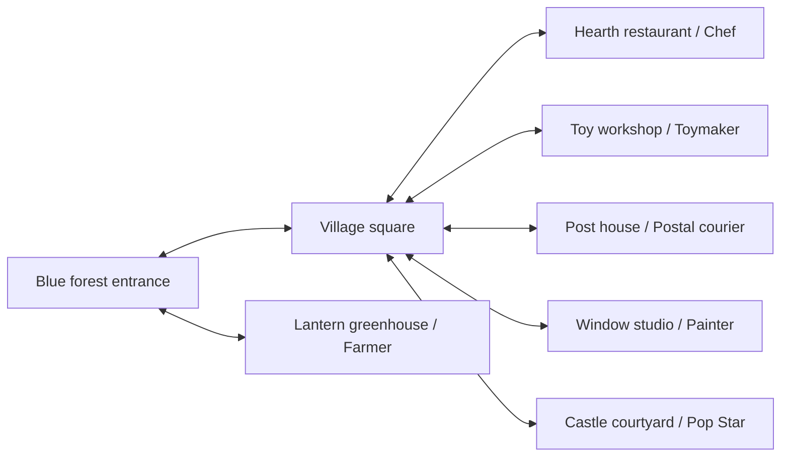

# Northern Christmas — world and career draft

Status: `PROPOSAL_DEFERRED`, 2026-09-05. Owner requested a rough Northern/Nordic
Christmas world, mixing existing and new careers, with a gameplan and detailed
visual guide before games are produced. This packet fulfils that design scope;
the proposed story, cast, layout and activities are review candidates.
Parent: [Northern planning branch](NORTHERN_ICE_WORLD.md).
Visual review: [illustrated guide](../../assets_src/concepts/northern_christmas_2026-09-05/guide.html).
Source hashes and generation prompts: [manifest](../../assets_src/concepts/northern_christmas_2026-09-05/manifest.json).

## 1. The chapter in one picture

**Working title: Christmas in the Blue Forest.** Roshan arrives in a blue-mist
forest beside a small Nordic-inspired village. Its restaurant, garden, workshop
and post house are preparing a Christmas gathering in the castle courtyard.
Roshan helps each place contribute something real: food, decorations, a toy,
an invitation and a song. Each finished job leaves a visible change in the
village. Christmas is already welcome and safe; nobody loses it if play stops.

The emotional sequence is curiosity → belonging → useful work → shared joy.
This is a proposed local chapter, not an Ember King continuation, a rescue
crisis, a new major character arc, or a replacement for Chapter 2's birthday.
Use friendly incidental villagers, with identities selected from suitable
approved art before inventing new cast. No Santa or named franchise characters
are assumed. A different Christmas story emphasis can be chosen at review.

## 2. What comes from the existing artwork

The owner-confirmed July 29 forest is the principal appearance reference:
deep teal firs, blue/lavender atmospheric distance, turquoise water, rounded
rocks, a generous cream-colored path and selective russet/gold foliage. Keep
that combination. Winter reaches the village roofs and distant slopes; the
entrance remains a recognizable magical autumn/winter border. Do not bleach
the entire source family into a generic white snow scene.

| Element | Draft treatment | Status and evidence |
|---|---|---|
| Forest entrance | Preserve the original composition as the visual anchor; stepping stones and stream lead toward the settlement | Exact July 29 source recovered unchanged for this review; owner confirmed family membership. Source-specific licensing remains unresolved for production. |
| Blue forest and castle family | Reserve continuity with the remembered late-July backgrounds; use their actual buildings when located | Only one confirmed family member recovered so far. New overview architecture is a placeholder proposal, never a replacement approval. |
| July 19 building kit | Retain as an archival discovery lead only | Inspected: isolated, volumetrically shaded houses/gate/trees. It is not the confirmed flat-background family and is not bound into the new boards. No retired models restored. |
| Chef art | Inspect existing Chef actor, bowl/whisk, recipe-board and oven illustrations for reuse | Existing actor and July 21 gameplay sheet visually inspected. Their current appearance is shown in the guide; static usage alone does not establish child/device acceptance. |
| Farmer, Painter, Pop Star | Reuse useful verbs and suitable approved career identities; keep local Northern context | Existing career homes and mechanisms are documented in `01_GAME_DESIGN.md`; no relocation of their original entries is proposed. |
| Existing music | Audition `assets/audio/music/northern.ogg` as the regional bed | Candidate only; no new Christmas music commissioning until listening and rights review identify a real gap. |

**Named generation gaps:** no inspected source supplies this combined Christmas
village overview or a Northern customer-order kitchen composition. Two new
non-runtime concept boards explore those layouts using the confirmed forest
and inspected Chef references. They do not authorize replacing the remaining
unlocated collection, commissioning all game art, or shipping generated dishes
and buildings. Original source files remain unchanged.

## 3. Route and composition

Treat the overview as a story map, not one densely interactive screen. Build
three readable outdoor views later, with interiors entered individually.

The tutorial recommendation is garden → restaurant; the other village jobs
can then be approached in either order. A short, always-visible return route
leads home. Doors remain visitable while a contribution is unfinished. The
festival setup is visible from the beginning, with useful work accumulating
around it; the finale invitation appears after the six contributions. Player
confirmation starts the song. Re-entering later preserves the completed scene.

| View | Composition and navigation | Persistent contribution |
|---|---|---|
| A. Forest edge | Original-style stream crossing; blue firs frame an open foreground; warm greenhouse on a side path; village roof silhouette beyond | A berry basket appears beside the greenhouse and at the restaurant supply shelf. |
| B. Village square | Wide foreground lane; restaurant left, workshop right, small post house beside the bridge; Painter works at one existing window rather than needing a fourth large building | Restaurant serving window opens, toy appears in workshop display, decorated window remains painted, posted invitation appears at castle gate. |
| C. Castle approach | Short bridge leads to the existing-family castle; tree and small performance dais occupy the courtyard, with broad empty space for Roshan | Shared table receives food; toy/display and decoration persist; after singing, villagers gather in the finished Christmas setting. |

Landmark symbols are concrete objects: bowl/ladle, toy boat, envelope with
portrait, watering can, brush and microphone. Use them with voice and a single
contextual pointer, never text-only signs or six competing objective arrows.
The overview's labels and numbers are for adult planning, not intended game HUD.

## 4. Six core careers, two optional extensions

First-pass complete chapter target: roughly 10–15 minutes of active play,
divisible into 30–90 second useful steps across many visits. Timing is a design
target, not a deadline or measured evidence. The child's pace always wins.

| Role | Old/new | What Roshan actually does | Shared contribution | Reuse and meaningful change |
|---|---|---|---|---|
| Winter gardener / Farmer | Returning | Water a greenhouse planter, touch ripe berries, place the pictured basket at the restaurant hatch | Ingredients become available in the restaurant | Inspect `garden_plant`, existing harvest/placement behavior. Growth can respond to care; do not require waiting or award untouched harvests. This is an indoor winter garden, not a snowy re-skin of the birthday route. |
| Village restaurant / Chef | Returning, expanded | Read a dish picture by sight, choose its matching ingredients, perform a short recipe and serve that same dish to its customer | A warm dish appears on the shared table | Pour/circle/choice plus a new persistent order-to-dish relationship. This is the first representative prototype because it exercises the strongest mechanic remix. |
| Christmas window artist / Painter | Returning | Sweep color across two broad window shapes, then choose and place a large star decoration | That actual village window stays decorated | Inspect `paint_reveal` and large placement surfaces. Preserve the child's selected colors; do not replace the finished painting with a generic award. |
| Wooden toy maker | New local career | Fit two or three generous toy-boat pieces to matching silhouettes, then pull it once along a broad test track | The child's boat sits in the workshop display and later at the gathering | Combine picture placement with deliberate track motion; assembly and test are causal. Prefer a suitable existing toy family if found. Avoid miniature components, tools with danger, or adding a generic tap phase. |
| Christmas postal courier | New local career | Match an envelope's portrait to the same portrait on a door, follow one highlighted route, and intentionally post it | A neighbor joins or an invitation appears at the courtyard entrance | Reuse picture matching and established world routing. New contribution is carrying one persistent, visible item between places. No reading addresses, parcel count, delivery timer or map-memory requirement. |
| Courtyard singer / Pop Star | Returning | Touch the illustrated instrument for a gentle sound check, then follow broad musical prompts to complete a short song | Lights and the gathering celebrate Roshan's completed contributions | Inspect Pop Star sound-check and musical input contracts. Missed prompts wait/recur kindly; no score or timing loss. Finale begins only on an intentional start action. |

Optional later candidates, excluded from the first six-career scope:

- **Geologist:** inspect existing Northern crystal art and the current Geologist
  lens/selection contracts; compare two large specimens and place a selected
  crystal in a window display. The crystal need not power an invented crisis.
- **Stuffie Doctor:** repair a village visitor's familiar toy using existing
  care/placement verbs. Use approved toy imagery; preserve protected friend
  portraits. This offers a quiet indoor activity if useful art supports it.

Do not add new permanent global career bits or move existing career homes just
to express these local roles. Chapter-specific progress is independent of the
existing global career completion mask and Chapter 2 milestones.

## 5. Restaurant visual and interaction specification

**Working name: The Lantern Kitchen.** The outside reads as one of the village
buildings; its bowl-shaped hanging sign and warm window explain its purpose.
Inside: indigo/teal painted timber, amber light, a snowy forest window, small
evergreen garland and muted red textile accents. Keep the existing Chef actor's
identity and outfit. A seasonal hat/costume is not needed for the premise.

Landscape stage composition, normalized against the safe content rectangle:

| Zone | Draft bounds | Purpose |
|---|---|---|
| Return and repeated voice | Upper left / upper right corners, 8% inset from device edges | One clear return affordance and replayable exact objective; no accidental overlap with order or workspace. |
| Active customer and order | Right 27% of width, upper/middle 65% of height | One kind customer with one large pictured dish. Keep request visible throughout cooking. Other patrons, if present, remain quiet background. |
| Roshan | Left 25% of width, middle/lower stage | Entire character including tail stays readable beside the workstation. Do not hide her lower half behind a counter or HUD card. |
| Preparation surface | Center 45% of width, middle/lower stage | One large bowl, pan or plate at a time, with two or three spaced choices. The active dish is the dominant touch target. |
| Serving destination | At the customer's table edge | Large plate silhouette/pointer that accepts the finished dish with forgiving tap-to-select/tap-to-place as well as drag. |

These are layout intentions to validate at actual aspects, not baked pixel
coordinates. Keep nonessential foreground garland/snow away from touch targets.
Restaurant board is an atmosphere/composition proposal, not a hitbox screenshot.

### First recipe and order storyboard

Use **one berry-porridge order** for the first future playable experiment; two
additional dishes can follow after the core relationship works. Porridge is a
fictional menu choice, not a claim of cultural authenticity.

| Frame | What is visible | Intentional action / proposed spoken cue | Saved result |
|---|---|---|---|
| R1. Ask | Customer, large bowl-with-berries picture, empty work bowl | Touch matching bowl picture: “Let's make this warm berry bowl.” | Stable order identity, customer identity and selected recipe. |
| R2. Pour | Large jug, bowl, same order picture | Hold/drag the forgiving jug control: “Pour into the bowl.” | Poured stage. No auto-pour on a help-only demonstration. |
| R3. Stir | Spoon in the visibly filled bowl | Broad circular movement: “Stir the bowl in big circles.” | Stirred stage, with partial progress preserved as needed for interruption. |
| R4. Finish | Prepared bowl, berry dish and one irrelevant choice | Select berries and place them: “Put the berries on top.” | Finished dish tied to this order; wrong choice remains recoverable. |
| R5. Serve | Same finished bowl, same order picture, plate target | Touch dish then plate or drag: “Bring the bowl to our friend.” | Serve once; mark contribution once; customer receives the matching dish. |
| R6. Enjoy | Customer enjoying that bowl, contribution shown outside | Optional next visitor or return | Completed orders persist. Replay is optional; leaving never cancels a win. |

Draft expansion menu: a star biscuit (press/choose shape → decorate → serve)
and warm cocoa (pour → stir → select topping → serve). Each needs recognizable
ingredient, intermediate and finished art before implementation. No burning,
cooling penalty, expired orders, money loss or simultaneous queue management.
If suitable existing food families make a different menu more coherent, the
agent may substitute dishes within the approved restaurant premise.

## 6. Visual language for all rooms

| Layer | Direction |
|---|---|
| Background | Mist blue `#768FC0`, lavender `#8C82AC`, teal fir `#215C68`; soft distant contrast. These are approximate draft swatches, not sampled replacements for source art. |
| Playable plane | Cream paths/work surfaces `#EADAB5`, deep navy outlines `#263953`; large clean shapes and readable silhouettes. |
| Warm invitations | Window amber `#F5C778`, small cranberry `#AE455B` and evergreen accents. Warmth identifies people and useful destinations. |
| Christmas accents | Evergreen garlands, star lanterns, wrapped presents, one central tree, snow caps. Use a few large motifs rather than dense tiny twinkles. |
| Motion | Sparse 2D snow/sparkles away from targets; still painted architecture. No new 3D lights, meshes or camera logic. |
| Roshan | Reuse accepted RGBA identity/career art; full tail and clear hands visible. Proposed boards never authorize a character redesign. |

The workshop has a broad blue workbench, two or three honey-colored toy pieces
and an empty display shelf; finished toys fill it. The post house has one large
envelope slot and portrait plaque; no written addresses. The greenhouse makes
green plants and red berries stand out against cool glass and snowy scenery.
The Painter's window is a large quiet drawing surface that remains part of the
village afterward. The courtyard has enough empty foreground for Roshan's
performance and a stable place for each contribution, visible before and after.

## 7. Asset decisions and open production evidence

For each selected family, record exact source and hash, license/provenance,
current usage (runtime reference, dynamic loader or export inclusion), visual
approval, role, native dimensions, needed states, and select/reserve/reject
reason. Do not label an asset “unused” merely because this planning search did
not find a reference. No inventory completion or runtime readiness is claimed.

| Need | Current decision | Next bounded action |
|---|---|---|
| Late-July forest/castle/buildings | Select the confirmed forest as reference; reserve final architecture selection | Continue tracing sibling flat sources from the recovered commit and inventories. Choose actual restaurant exterior only after inspection. |
| Chef actor and cooking tools | Reuse candidates | Check runtime sheets and permitted source derivation; establish useful bowl/pour/stir/serve states without touching birthday cake art. |
| Customer portraits | Open | Select approved incidental cast with enough request/enjoyment states; do not silently invent a major character. |
| Toy pieces/envelopes/window paint/greenhouse | Open | Inventory existing toys, UI pictures, painted decorations and plants. Only commission missing named states. |
| Christmas overview/interior | Two draft-only boards | Review world mood, object spacing and district relationships. These are no substitute for runtime art families. |
| Voices | Draft cue text only | Locate exact matching recordings; create a named cue gap list where existing words do not truthfully describe the action. Never relabel a birthday cue for a different dish. |

Future background delivery must meet at least 2048×2048 native coverage per
playable screen before slicing; three horizontal screens require 6144×2048
native coverage. The draft overview is a map, not a qualified panorama. Neither
board has passed runtime, licensing, device, child or final art acceptance.

## 8. Development sequence after design review

1. Confirm the local Christmas premise and bounded first implementation scope.
   Select actual art and record gaps; preserve current chapter numbers and canon.
2. Make a static Canvas route blockout with the selected backgrounds and a
   representative restaurant view. Keep source identity and child-readable
   space. This step does not require implementing all six games.
3. Build the single berry-order vertical slice: entry, ask, preparation, serve,
   saved contribution, leave and return. Verify real input and help/passive
   behavior before treating the pattern as reusable.
4. Extend within the commissioned scope, preferably garden/restaurant first,
   then workshop/post pairing, then persistent window art and courtyard song.
   An approved chapter commission permits this progression without repeated
   routine permission requests. Major plot/cast/boundary changes remain reserved.
5. Review the playable chapter with its actual art/voices. Advance device,
   child, owner and release claims only with their own evidence.

Required future checks: correct/incorrect matching, zero input, help-only,
double serving, leave mid-gesture, focus loss, reload each stage, missing/new
save fields, no duplicate contributions, correct room return, sibling Chef and
global career regressions. Save stable recipe/customer/stage identities and
completed contributions with additive defaults; completed milestones never
regress. Measure Mobile/Speedy at 30 fps on the target device; observe whether
the child understands each pictured job without reading or adult explanation.

## 9. Review decisions that materially change the next draft

- Does a community Christmas gathering fit, or should Santa's workshop become
  the central story? This changes cast, premise and the workshop's importance.
- Does the mix of four returning careers and two new local careers feel right?
  Swap one before expanding source-state requirements, not after six builds.
- Does the autumn-to-snow transition preserve the Northern artwork the owner
  loves? The current overview proposes a winter village around that anchor.

Current delivery is a design packet only. No scenes, game scripts, saved-game
schemas, protected originals, dev or master were changed for this draft.
