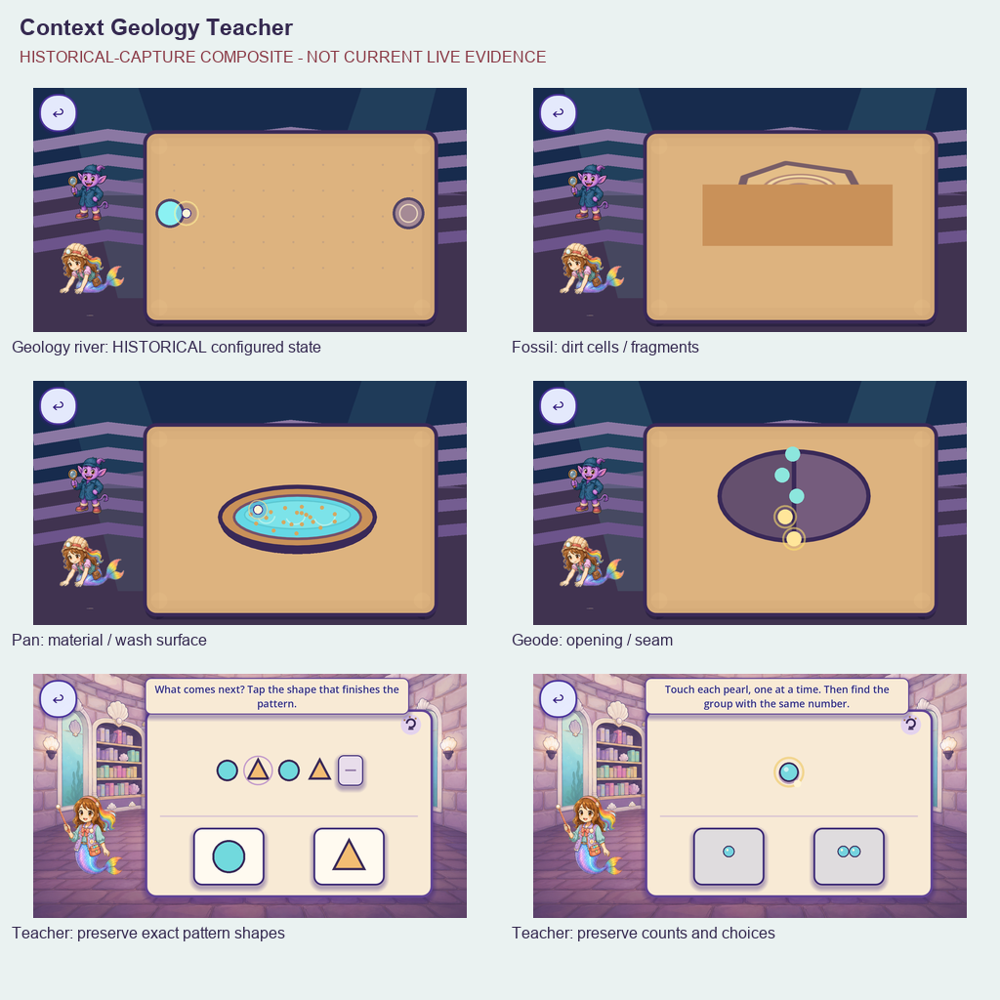
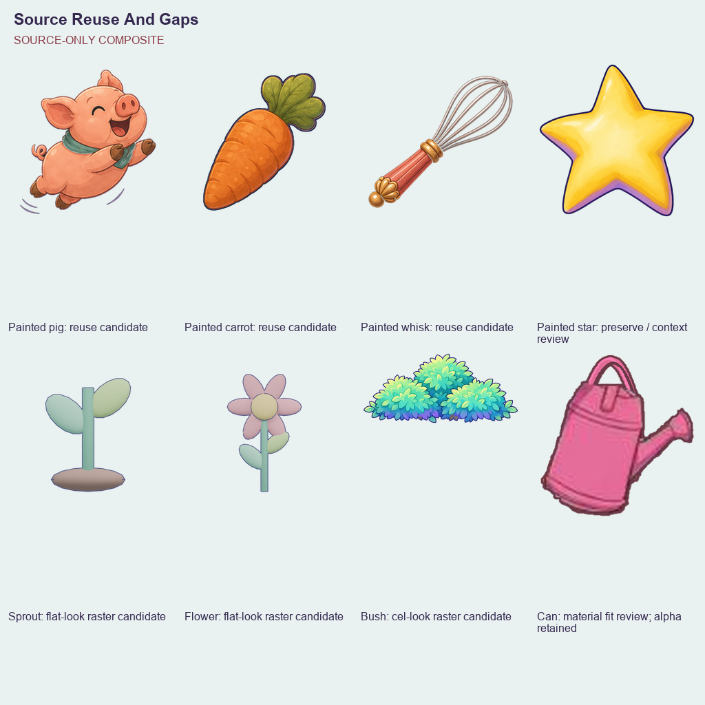

# Full-game flat-vector weakness audit — 2026-10-07

R5 adds [250 current companion, logo and attack Mobile/Speedy frames](live_v5/README.md), bringing cumulative evidence to 604 frames. Forty-three of 176 overlapping entries have partial context; zero is complete. Six source scopes are classified: two earlier functional masks, the prior 40-instance menu helper and three editor scopes split into 23 named art instances requiring replacement. This leaves 363 unresolved scopes and 39 with partial context. The individual-art denominator remains unknown; zero replacements or accepted removals. Complete, publish and remotely verify the full weakness inventory before new replacement pixels.

R4 adds [62 current shared UI Mobile/Speedy frames](live_v4/README.md), bringing cumulative evidence to354 frames. Thirty-nine of176 overlapping entries have partial context;zero is complete. Three source scopes are classified:two earlier functional masks and one flat-art helper split into five roles on eight buttons (40 named instances requiring replacement). This leaves366 unresolved scopes and34 with partial context. The individual-art denominator remains unknown;zero replacements or accepted removals. Complete, publish and remotely verify the full weakness inventory before new replacement pixels.

Historical R2 evidence: [Castle/Opera visual review](live_v2/README.md) adds192 current captures, all15 free-play careers and70 live open phases; 24/176 partial entries, zero complete, all369 scopes unresolved. Historical source-only gaps below remain scoped to R1; current full-game coverage is still incomplete. New replacement pixel production remains sequenced after completion/publication of the full current inventory.

Status: `SUPPORTING_CURRENT` source/context audit at `92c9fe70319ef46bfaa8f61348a6f51512141ec3`. It is comprehensive for the declared source inventory and review coverage, **not an exhaustive accepted visual inspection of today's game**. See [the handoff](README.md), [individual register](per_piece.json), [source scopes](source_scopes.json) and [coverage matrix](scene_coverage.json). The actual whole-game flat-vector-art piece count is unknown while current capture/dynamic-state gaps remain. No runtime art or code changes occur in this phase.

## What is weak, and what remains uncertain

| Context | Evidence and weakness | Contextual update | Limits |
|---|---|---|---|
| Geologist river | Current source draws dry dots and wet cells as circles joined by thick uniform lines; historical configured captures show a diagrammatic work surface. | One coherent painted riverbed with dry/dug/flowing junction states; maintain any valid four-neighbour excavation rather than baking only the suggested path. | Current route/phone capture pending; existing native geology candidates require exact alpha/angle inspection. |
| Geologist fossil | Spiral/polygon SVG under opaque rectangular scrub cells, divided into three draggable fragments. | A single fossil-bearing relief slab, painted dirt coverage, and three fragments derived from the same whole. | Preserve scrub grid and snapping; no independent fossil per fragment. |
| Geologist pan | `PAN_PATH` empty; nested ellipses, arcs, sand dots and geometric specimens. | Whole pan with thickness/material and compatible covered/washing/revealed contents; inspected existing local ripple family first. | Keep nine reversals, travel and pan region; prior checkerboard candidate remains rejected. |
| Geologist geode/gallery | `GEODE_PATH` empty; flat polygon shell halves/seam targets and crystal SVG. | One closed source, matching opening halves/interior and supported specimen gallery. | Five seam targets/120px pull unchanged; do not paste unrelated crystals over a baked copy. |
| Teacher | Flat board SVG, worksheet-like frame, exact shape tokens, count groups and demo pointer. | Tangible painted teaching board/token material with quiet framing and truthful target pointer. | Identical geometric shapes, counts, colors and answers are educational semantics; no shell substitution or noisy detail. |
| Dirty castle rooms | Remaining code wash/edge grime/drips/cracks covered by `MA-VIS-008`; Pool's later scoped repair already removed its shared dressing. | Object-owned authored dirt where current owner scope permits, preserving Roshan colors; retire unnecessary full-screen decoration. | Owner dirty-look scope remains room-specific/unresolved. September Pool picture is historical and cannot undo GS repairs. |
| Room shells | Royal Bedroom, Sleepover Bedroom, Dining Room, Movie Lounge and Family Gallery source masters mix flat ceiling/insets/floor/rugs with painted furniture; inspected historical Bedroom shows the contrast clearly. | Retain existing scene geometry/furniture; paint calm material in the actual native plate and preserve unique background/card ownership. | Source master alone does not prove today's tile/fixture path; measure actual piece bounds and current state first. |
| Shared Opera backdrop | Geometric spotlights can still overlay painted tiles; full fallback prop sets remain guarded by missing-art paths. | Remove redundant spotlight/ambient layers or use suitable authored scene-specific accents; retire obsolete fallback builders after resource proof. | A source fallback's presence does not justify repainting the accepted environment. Geologist missing backdrop search is source evidence. |
| Shared Opera gestures | Numerous procedural vessel, valve, pipe, pad, trace, cue, portal, fallback object and feedback branches remain across career surfaces. | Each named design has a route/action/geometry brief; preserve accepted painted inputs and replace every visible flat-vector art state of its real job object. | State/texture guards, auxiliary helper scope, painted presentation and literal object visibility must be reviewed individually. |
| Melody | Proscenium curtains/header/apron, rail/notes, guide/start/pips and reward constructions use flat polygons/lines/circles over existing painted art. | Context-bound fabric/support frame, note/rest/hit states and quiet direct control materials, suitable existing stage kit first. | Seven pitch/color identities and timing/84px visual/120px touch geometry retained; no current live action review. |
| Dolls | Painted babies/background remain; mat/quilt/pips/cradle/focus and landing accents are procedural. | One coherent padded mat and whole cradle/slings, supported landing/catch states, object-bound focus and pictured earned count. | Preserve mercy/no-fail landing, moving catcher and selected skins; never revive rejected pillow-strip widgets. |
| Garden | Current RGBA `wateringcan.png` is a low-resolution rough-cutout/material candidate; surrounding hidden RGB has alpha zero and is not proof of visible contamination. Inspected sprout/flower have smooth flat masses and angular contours. Five distinct mature outcomes are dynamically bound. | One rooted common sprout and five individually distinct mature plants from the actual planting context, plus a watering-tool fit review and, only if needed, a whole painted tool with correct spout/contact. | No sixth `flower4` commission; other four native flower reviews and current natural cadence remain gaps. |
| Snowman/trampoline/slide | Snow field/balls use flat panels; trampoline is a squashed round blue panel; six rotated ColorRects form the slide. | Supported painted snow/ball material, trampoline/contact family and coherent rainbow slide in the current action geometry. | Painted carrot is already active at 95×60, -135°; painted star/Roshan are retained. Old flat carrot is a leftover candidate, not current Snowman. |
| Shared UI | Paper/shell StyleBoxFlat panel/button/card materials, shell ornaments, glyph icons and local flat highlights. | Appropriate bounded authored texture/NinePatch materials and explicit pressed/focus states, picture-first icons. | Functional Controls, generous hit regions, ordinary font rendering and input cancellation stay intact. Visible UI art is not silently exempt. |
| Shared ambience | Stage-local bubble/frond/leaf/fish/flower/butterfly/cloud/snow/lantern/ember/note/ribbon/etc branches are procedural. | Needed scene-specific accents reuse fitting authored sources; remove competing decorative layers. | Keep actual stage palette/pivot, idle-only behavior and quiet motion budgets; no generic sticker quota. |
| Ember party | Current source expressly unapproved Scout/King/Prince polygon identities plus separate candle-taking line arm. | Locate authoritative existing identities and coherent whole-unit arrival/approach/grasp/carry/exit states. | Four named rows blocked on exact source/pose authority, not invented characters. Existing King/Prince sources require inspection. |
| Candle | Flat fallback is skipped when both painted unlit/lit sprites exist. | Keep existing accepted pixels, prove resources, retire fallback/recreation path. | `REUSE_READY` is scoped readiness only, not accepted removal. |
| Legacy worlds | Production reef/Northern/kart/galaxy/arena/dungeon builders still have primitive-mesh/card/procedural candidates. | Review visible art on actual routes while following shrinking true-2D migration; reuse accepted painted environment art before named gaps. | Separate 3D debt remains; no new meshes, archive fallback or false zero-vector claim. |

No new 5/5, 4.5/5, human acceptance or defect score is invented. These observations link to individual source/hash/line records and separate current-evidence gaps. Generic source matches are candidates, not confirmed quality failures.

## Whole-game coverage and count units

The source inventory covers every Git-declared production/standalone GDScript (probe/debug/test/vendor exclusions recorded), every runtime/source image, scene visual-node candidates, generator/validator candidates, dynamic bindings, glyph strings, shaders and primitive-mesh stand-ins. Class/type mentions deliberately overapproximate potential reachability. Actual callback branches, dynamic concatenated resources, saved variants and imported/export-only artifacts need runtime enumeration; never treat an absent literal reference as proof of dead art.

The route matrix includes reef districts/islands/Ocean Kingdoms, castle and every room, Day One activities and Grand Puff, courtyard/train/playground/forest, Fetch/Dolls/Seek/Melody/race/shop/treasure/fairy/picture games, Sky Lagoon, Northern/kart/galaxy/combat/dungeons, all 15 current Opera careers, Chapter Two party/cake/candle/Ember routes, Fashion Designer, commissioned conservatory/Butterfly House Chapter Three routes, prototype scene entries and all shared overlays. Existing Northern content and standalone prototypes are recorded separately from uncommissioned chapter expansion. The runtime registry remains the source for live careers and phases; older 13-career summaries retain historical scope.

| Unit | Count | Meaning |
|---|---:|---|
| Named art design/state records | 224 | Lower bound; each named role gets an individual context brief; repeated instances/unknown variants excluded. |
| Context families | 29 | Grouping for palette, material, budget and shared dependencies; not an object count. |
| Source drawing scopes | 369 | Named functions/helpers awaiting complete visibility and piece split/disposition. |
| Broader source construction sites | 1,451 | Primitive calls/generated textures/styles/mesh candidates; no visual-piece total inferred. |
| Complementary narrow construction sites | 1,246 in 61 scripts | Frozen Git-blob scan with a narrower primitive set, independently validated. |
| Production/standalone scripts | 165 | Includes raster-only and unresolved reachable/standalone sources. |
| Image files | 10,046 | Runtime/source/review images with dimensions/hash/consumer candidates; not all inspected or live. |
| Runtime SVG assets | 5 | Literal filename candidates; painted catalog presentation may suppress pixels. |
| Glyph candidate rows | 348 | Decorative icons/object pictograms versus ordinary text need per-use disposition. |
| Living-stage rows | 100 | Catalogue registrations, not proven current reachability or distinct screens. |
| Route/overlay/game/scene entries | 176 | Overlapping coverage targets; all lack current Mobile audit capture. |
| Current live Opera careers/phases | 15 / 61 | Exact current table, sparse saved slots preserved; Fashion Designer separately recorded. |
| Replaced / integrated / fully accepted | 0 / 0 / 0 | Phase 1 changes only audit evidence. |

Actual total individual flat-vector-art pieces, actual distinct screens, instance/variant counts and regression count remain unknown. Strong painted candidates and functional infrastructure are separately dispositioned. No proven valid painted-vector-origin asset has yet been established; unknown origin stays unknown rather than inferring method from raster appearance.

## Inspectable evidence and source reuse

This is a labelled composite of September configured captures. It demonstrates that material/context concerns have real historical evidence; it is not a current build screenshot. Full native originals and capture manifests remain at the source paths in [contact_index.json](contact_index.json).

The painted pig, carrot, whisk and star are suitable **reuse candidates**, subject to actual purpose/angle/scale/contact and current-context review. The bird's grayscale shading is legitimate coloring-layer content, not a defect for lacking color. Sprout/flower/bush have flat-look candidates; raster format does not prove vector origin. Watering-can visible fringe/contamination remains unproved; hidden RGB is not a defect. Its low-resolution material/contact suitability needs runtime review. Protected originals are immutable.

- [Castle context sheet](review/context_castle.png): flat shell/painted furniture, dirty-room context and expressly historical Pool state.
- [Activity context sheet](review/context_activities.png): historical Chef, Garden, trampoline and Snowman contexts.
- [Root source observations](context_review_observations.json), [current garden caller/image observations](garden_context_review.json), [baseline narrow scan](vector_source_scan.json).
- [Functional part-only dispositions](functional_dispositions.json), [glyphs](glyph_inventory.json), [shaders](shader_inventory.json), [legacy stand-ins](legacy_standins.json), [method dispositions](vector_method_dispositions.json).

All 224 named designs have one [individual brief](per_piece_briefs.json) with scene route, exact source scope, action/state, proposal, inherited palette/material/light, support/contact/occlusion, geometry expressions, reusable candidate status, output ownership and unchanged contracts. Null current bounds/unknown contact or uninspected sources block production choices that depend on them. The proposal is made concrete where source evidence supports it and remains a named review task where it does not.

## Acceptance and completion

One scene-bound piece proceeds through source reuse inspection, exact gap decision, candidate, current Mobile before/after full action review, runtime/source/provenance/geometry/save/passive/teardown gates, green exact-head CI/integration, device/child/owner evidence and safe retirement of old fallback/export/generator references. Whole-unit identity/acting, native per-screen background coverage, one-owner pixels and Mobile/Speedy overdraw are hard requirements. Existing selected Day One story clips remain untouched.

The zero-vector goal is only complete when every reachable art state and source scope is dispositioned, no flat-vector/procedural/raster-lookalike art or recreation path remains, the current route/variant review has no gaps and all applicable acceptance evidence is recorded. A green source scan, an extension count of zero, a PNG conversion or passing logic probes cannot establish that claim. The master audit remains `UNSATISFIED`; this source/context packet closes no finding.
