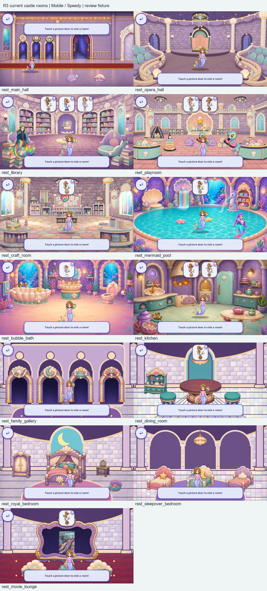
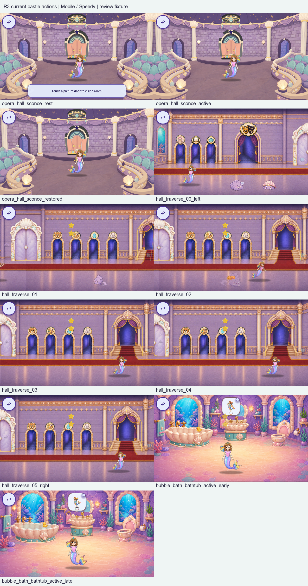
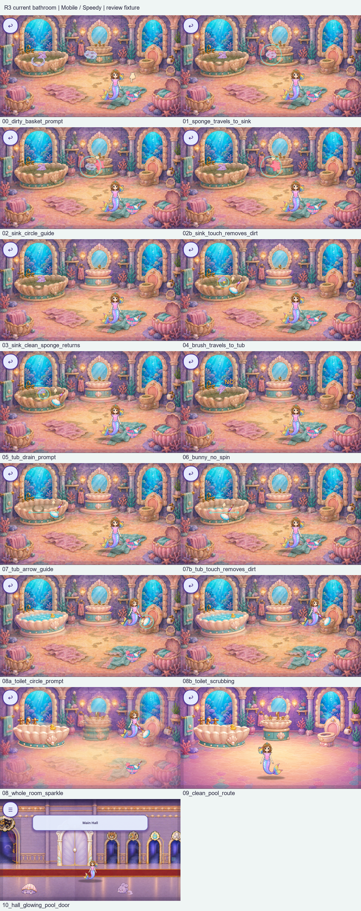
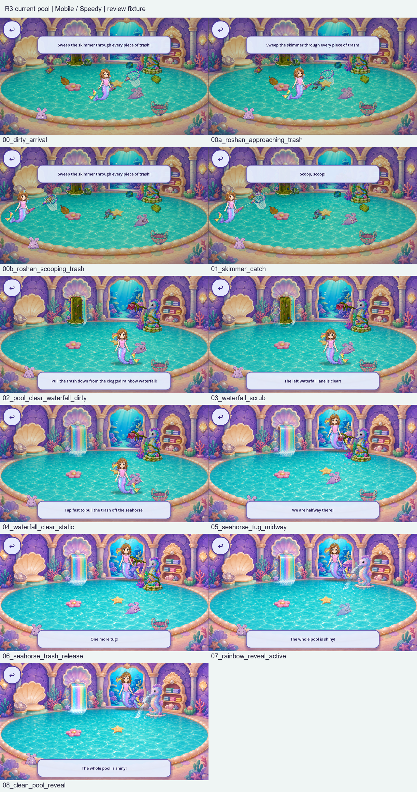

# Current Castle and Day One visual evidence — R3

This is a partial current inventory within the active whole-game zero-flat-vector-art goal. R3 adds **100 actual Mobile/Speedy frames**, not replacement artwork. [Parent audit](../README.md), [observations](observations.json), [component candidates](components.json), [coverage](coverage.json), [scope review](scope_review.json), [functional classifications](functional_dispositions.json), [machine evidence](MACHINE.json), [launch/derivation](CAPTURE_LAUNCH.json) and [diagnostics](diagnostics/attempts.json) bind the evidence.

Production source `fab9043e3e5f0b317424d89e234d6865a9605c11` remains identical to runtime baseline `92c9fe70319ef46bfaa8f61348a6f51512141ec3`. Native Windows Vulkan Mobile uses exact Godot4.7.2-stable official.ed1daf0bf, Speedy, RTX3060Ti, Dummy audio and fresh isolated SaveState before Main enters the tree. Normal child-save/backups remain byte-identical. Desktop capture supplies no target-device, voice, child or owner acceptance.

Each aspect1280×720 and1600×720 contains24 Castle states (13 rest rooms, three Opera sconce samples, six staged hall positions and two bathtub action samples),15 Bathroom supply/gesture/dirty-to-clean/hall states, and11 Pool scoop/waterfall/seahorse/clean-reveal states. Direct route/unlock/checkpoint fixtures and bounded helper inputs are declared. Story clips are suppressed as already-seen fixture seams; no selected clip or source art is changed. Main processing is disabled for Bathroom samples after its staged entry caption expires, and the skimmer process briefly stops for its scoop sample. Capture itself never pauses the SceneTree. The eight seahorse probes each await the actual production contact completion. These samples do not establish natural play, every motion transition or save/fallback variants.

Castle and Pool manifests explicitly check menu/intro/movie, pause, stage/layer visibility and effective fade alpha. Earlier successful Bathroom manifests retain their exact original harness: current visual review confirms the visible room, native checks establish active toilet contact, and the validator rejects any visible VideoStreamPlayer. No later metadata is retroactively added. Native PNGs preserve complete viewport bytes; boards reduce them by Lanczos to640×360 with captions.

Five room backdrops expose flat raster fields around painted furniture/doors. Bathroom circle/arrow/drain guides and shared panels/buttons are visible instructional/decorative ART. The new13 component rows are context families/candidates, not13 final individual objects or an addition to the frozen224 named-family lower bound. Source format alone never supplies exemption.

Two exact scopes are classified as functional texture reveals: `_add_fixture_cutout` enumerates the sink/tub/toilet polygons and carries the existing painted clean-room texture with white RGB/edge alpha; `setup_scrub` creates an L8 mask whose shader changes alpha only. Three cutouts and two scrub masks are accounted for. This disposition changes the unresolved-scope count to367; it removes no art and grants no acceptance. A new color-art branch, RGB shader or caller invalidates it. Flat visible guides remain in scope.

Current cumulative evidence is292 native frames: R2's192 plus R3's100. **30/176 overlapping entries have partial context; zero is complete.** Twenty-two scopes have partial current context, two have the exact functional disposition, and367 remain unresolved. The whole-game individual-art denominator remains unknown. At wide aspect, dark side-margin geometry is distinct from visible decorative glyphs/effects; those decorations remain unreviewed art candidates. One staged hall sample crops Roshan out and cannot prove actor-navigation correctness.

Rejected fixture trials are diagnostic logs/text only: obsolete field names/zero-frame exits, pause-cancelled toilet action, menu/movie-obscured scenes, incomplete fade metadata and saturated tug queues. Final matrices use fresh paired profiles and pass; failed end-state filenames never become accepted captures. Production probes/expectations are unchanged.

Run `python -B live_v3/validate.py` and `--stress` from the parent packet directory. Image/source/board/launch/save checks, exact matrices and nine falsification cases are machine evidence only. The prior82/82 full local exact-engine suite is inherited because production inputs are unchanged, not a newly run full suite. Captured source-head [CI37742818089](https://github.com/Ebonyks/mermaid-roshan-reef/actions/runs/37742818089) completed successfully forfab9043e. New R3 publication/receipt-head CI remains separate.

Implementation: audit/capture/classification only; zero replacements, retirements or runtime changes. Machine verification:100 new native frames and source/save contracts. Human: Codex static context review with stated limits. Device, child, owner artistic acceptance, complete full-current inventory and master-audit satisfaction remain pending. Complete, publish and remotely verify the full weakness inventory before new replacement pixels; reuse investigation and reversible capture continue without a new approval checkpoint.
