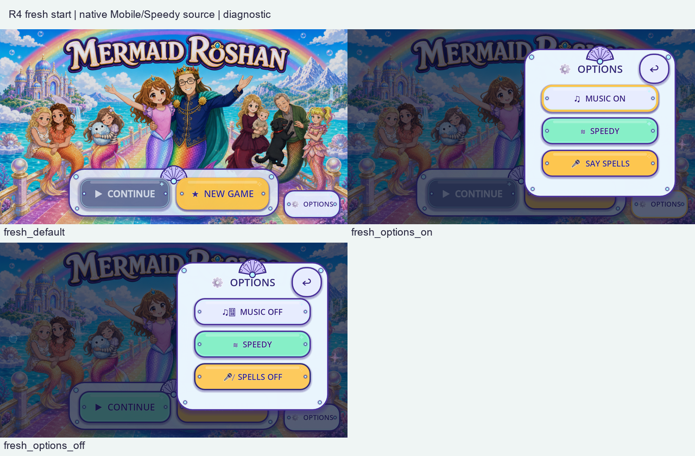
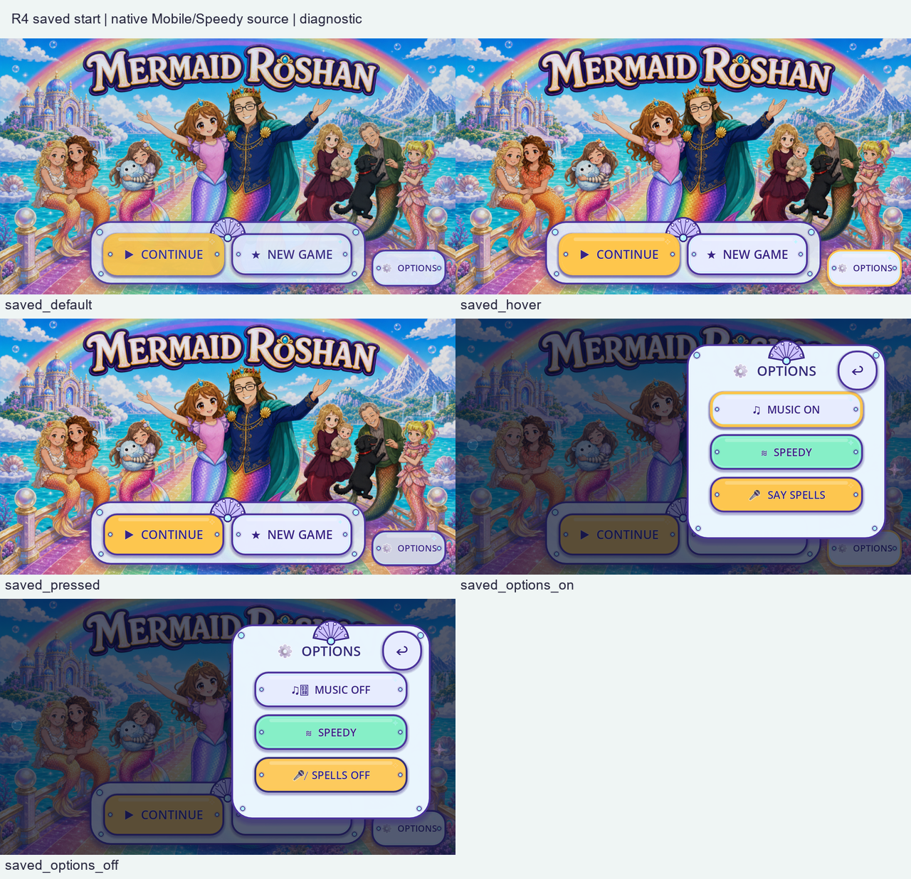
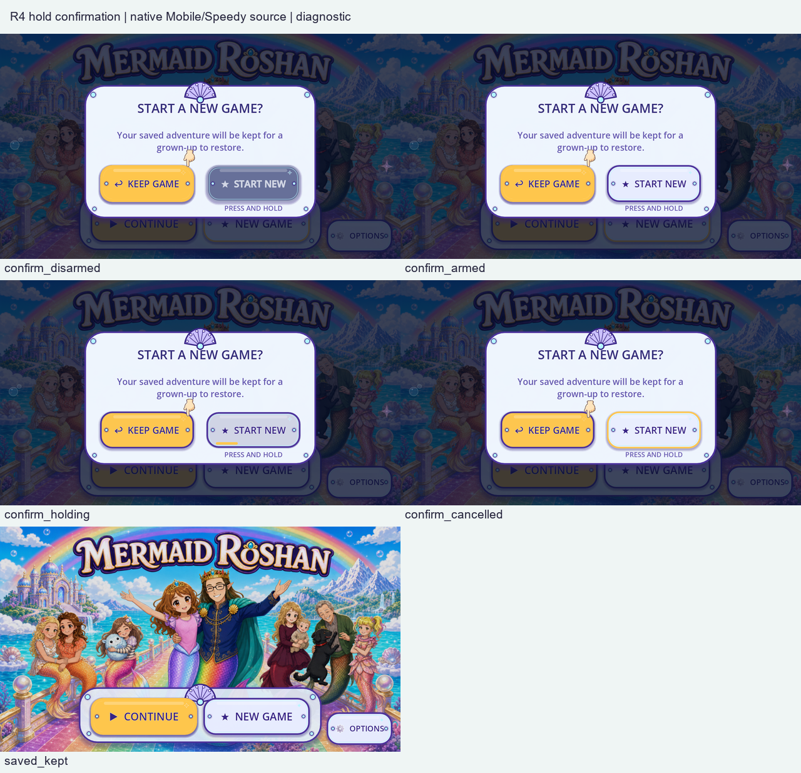
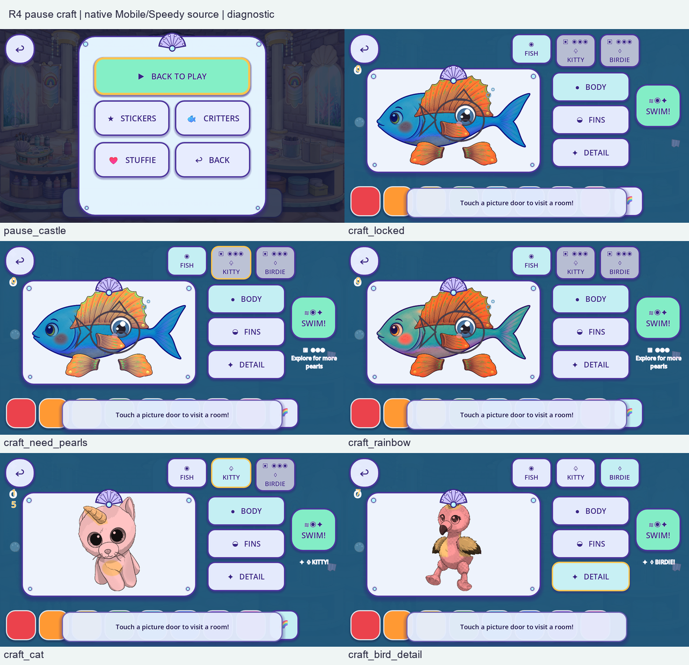
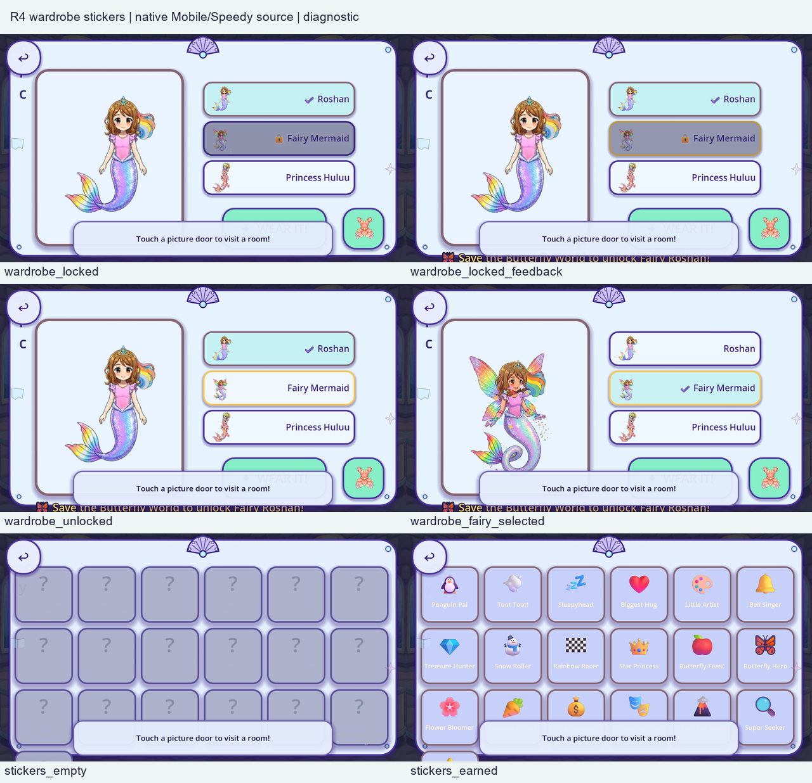
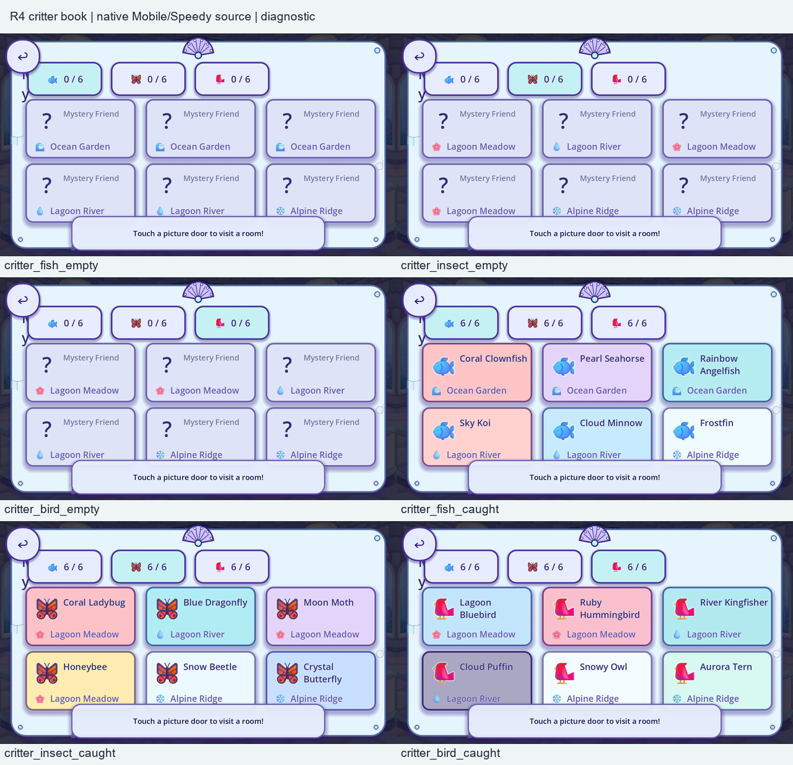

# R4 current shared UI review

R4 adds **62 native Mobile/Speedy frames**,31 per aspect at1280×720 and1600×720, from exact source `e97a6db8ce823a6730b08318d463469d16d9a472`. Production inputs remain identical to `92c9fe70319ef46bfaa8f61348a6f51512141ec3`.

Cumulative evidence is354 frames: **39/176 overlapping entries partial,zero complete**. Three source scopes are classified:two earlier functional masks and one flat-art helper with five roles on eight buttons (**40 named instances**). **366 scopes remain unresolved**,34 with partial current context; the all-game individual-art denominator remains unknown. Zero replacements or accepted removals. Complete and remotely verify the full weakness inventory before new replacement pixels.

[Current entry/state coverage](coverage.json), [source-scope review](scope_review.json), [40-instance source/capture split](scope_dispositions.json), [per-instance context briefs](instance_briefs.json), [11 component/context rows](components.json), [observations](observations.json), [intro route evidence](route_dispositions.json), [machine/source bindings](MACHINE.json), [launch/derivation records](CAPTURE_LAUNCH.json), and [exact planned matrix](EXPECTED_MATRIX.json) retain distinct evidence claims.

The visible flat materials include menu/pause/overlay panels, button treatments, drawn shell/pearl ornaments, pictograms, palette swatches and the hold bar. The painted title/portraits remain protected source art. PNG previews/ghost hand and layered creature art still need source-native review. The Castle caption remains above several overlays and covers lower controls/cards; last Sticker rows and some headings/toasts are clipped or absent in this fixture. These are observed weaknesses, not accepted layouts.

[Board provenance](contact_index.json) binds every reduced preview to unchanged native PNG bytes. Native files are under fresh/saved/overlays aspect directories. No scene was redrawn. Original art and normal child-save/backup hashes remain unchanged; the parent launcher independently rechecks saves after process exit.

Menu variants use actual synthetic pointer events and normal focus. Saved confirmation covers disarmed,armed,partial hold,cancel and Keep Game; no full reset was performed. Options toggles persist only to the isolated fixture. Craft unlocks use actual controls with synthetic20pearls; unlocked Wardrobe/all-earned/all-caught flags are isolated. The Castle craft-room route is a direct fixture. Pause uses the real controller and is expected only for its own frame. Source-only IntroOverlay is retained for headless first-session probes; normal display startup builds StartMenu. No retired intro capture is claimed as a current display route.

Successful fresh/saved/overlay cases each preserve their exact harness version. Rejected trials/logs are under diagnostics: a saved-run exit resource error required explicit fixture teardown; the first overlay snapshot accessed freed menu controls and was rejected. Failed images never enter the62-frame matrix. These harness fixes changed no production script or probe.

Run `python -B validate.py` and `python -B validate.py --stress`. Re-capture with `run_capture.py`; it resolves the exact approved engine and stages fresh outputs under ignored tmp. Existing82/82 exact-engine full-local results are inherited because production is unchanged; R4 focused gates are separate. Native metadata/PNGs are diagnostic and do not earn `DL-QA-11` independent live-target PASS. Target-device30fps/touch/overdraw, every motion/seam/contact, natural saved/fallback routes, observed child and owner acceptance remain outstanding.

[R3 historical slice](../live_v3/README.md) · [whole handoff](../README.md) · [immutable payload manifest](../MANIFEST.json) · [remote receipt](../REMOTE_VERIFICATION.json)
