# Aesthetics plan: make the painted world breathe (2026-09-25)

**Status:** `PROPOSED / CANDIDATE` recommendations.
- Prepared by Claude, which made no game changes; Codex implements, and any new art goes
  through Codex's image generation under the [style-matching protocol](#style-matching-protocol-for-any-new-art).
- The owner approves anything that changes how the game looks, in context on the phone
  (`DL-VIS-07`).

**Baseline:** `dev` at `f76a8ba5`, exact Godot 4.7.2 display captures.

## The finding in one paragraph

The painted rooms are the game's greatest strength, but the engine barely touches them.
Water, waterfalls, ocean windows, lamps, curtains and plants never move at rest, and the
game uses none of Godot's 2D particle, parallax or light tools. Most of the remaining
beauty can therefore come from engine-side work on the existing art. Only four flat
rooms and Roshan's walk and swim animation genuinely need new art.

## What the game looks like today

All images are full frames from the current build. Nothing is cropped.

### Painted rooms: keep them, bring them to life

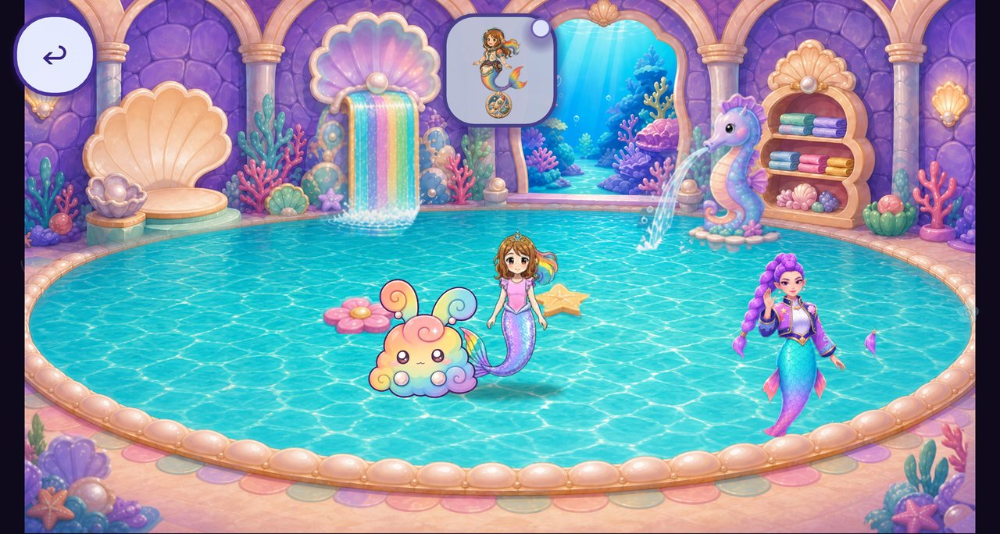

Mermaid Pool: rich and cohesive, but the water, waterfall and fountain are still.

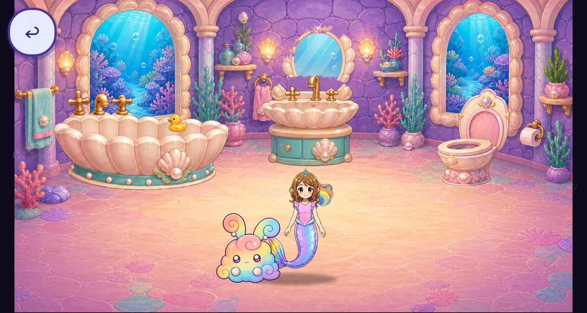

Bubble Bath: painted lamps and ocean windows, all static.

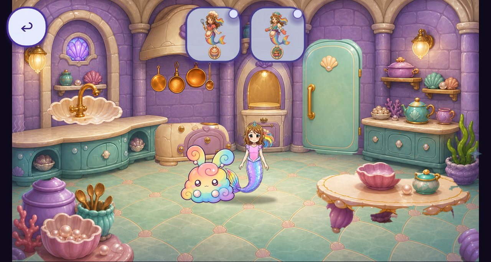

Royal Kitchen: lamps and oven painted as lit, never glowing.

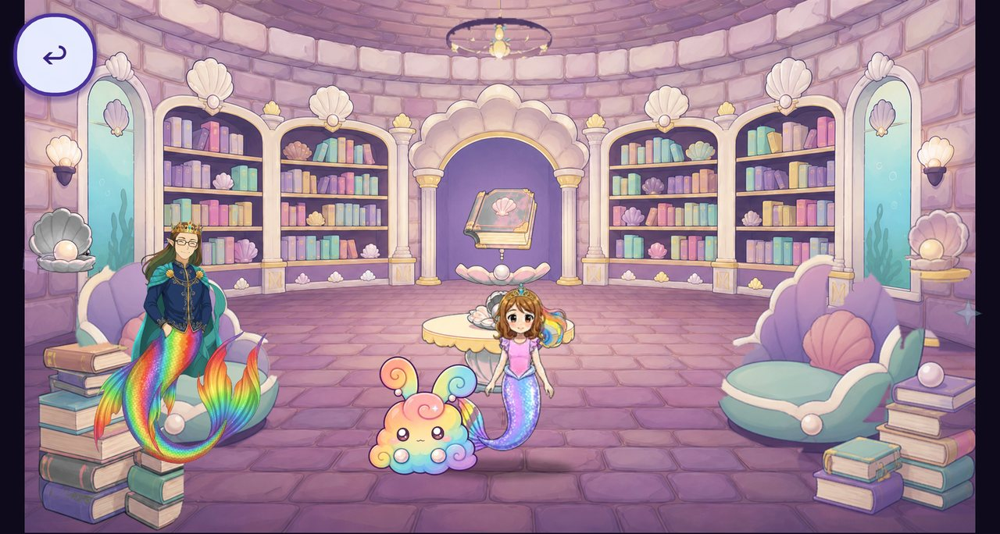

Royal Library: the magic book in the central arch is the owner's chosen replay-menu
entry.

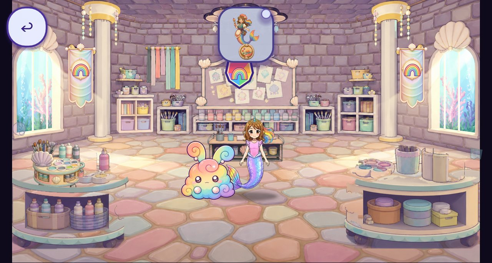

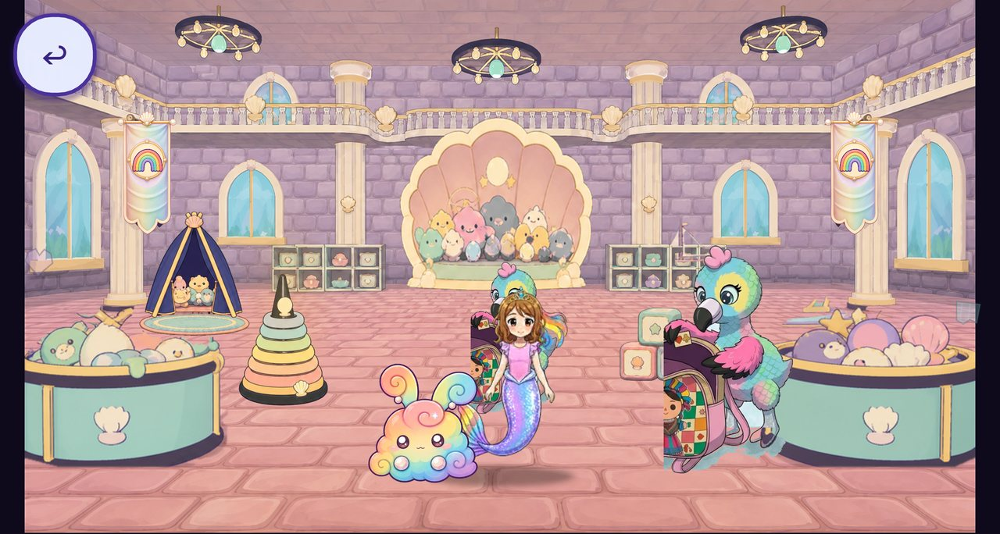

Stuffie Playroom: Baby Eagle still appears as the book crop with its backpack (see
audit T2).

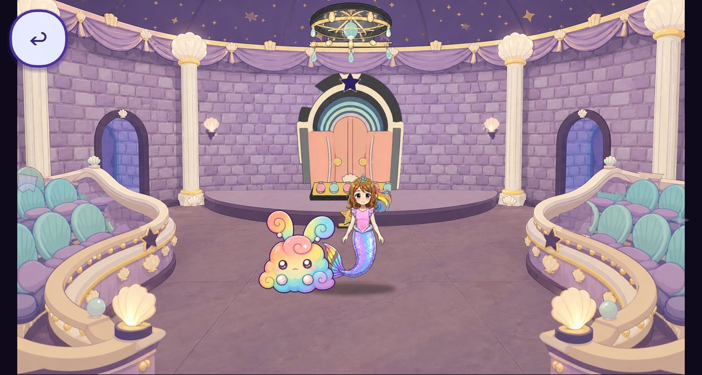

### Flat rooms: need repainting

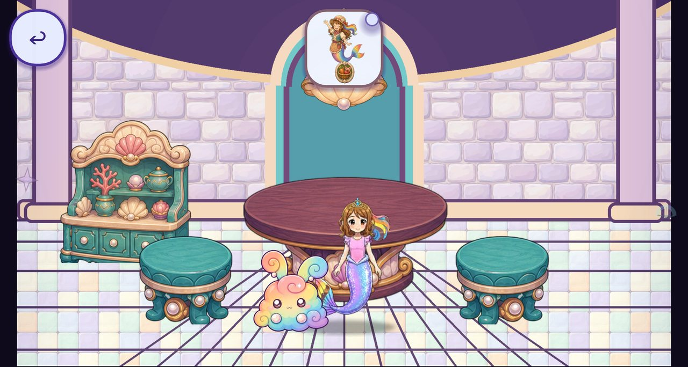

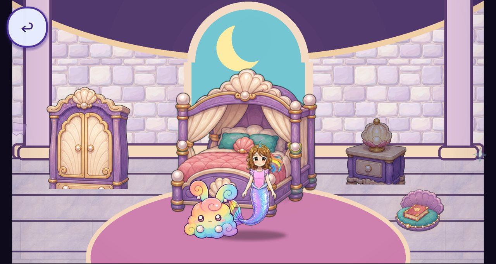

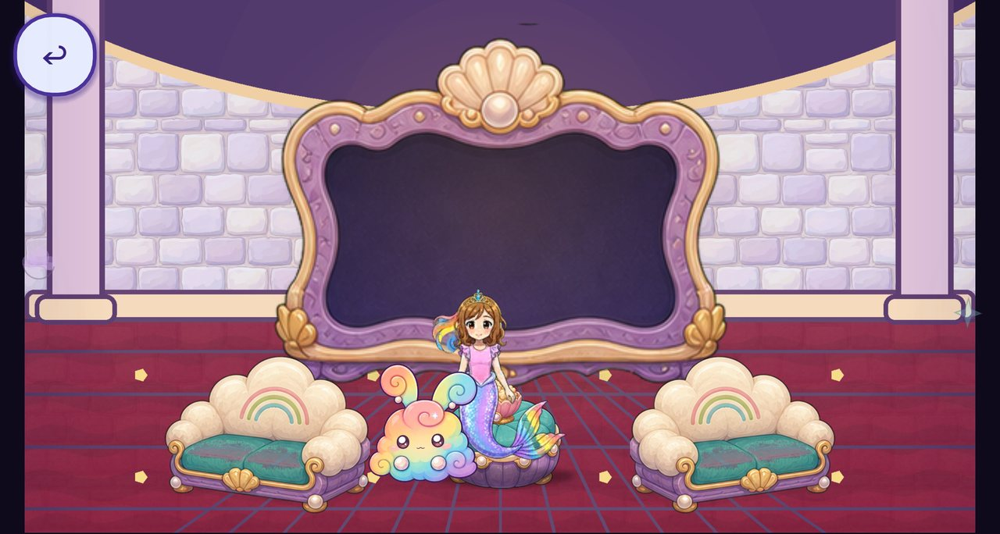

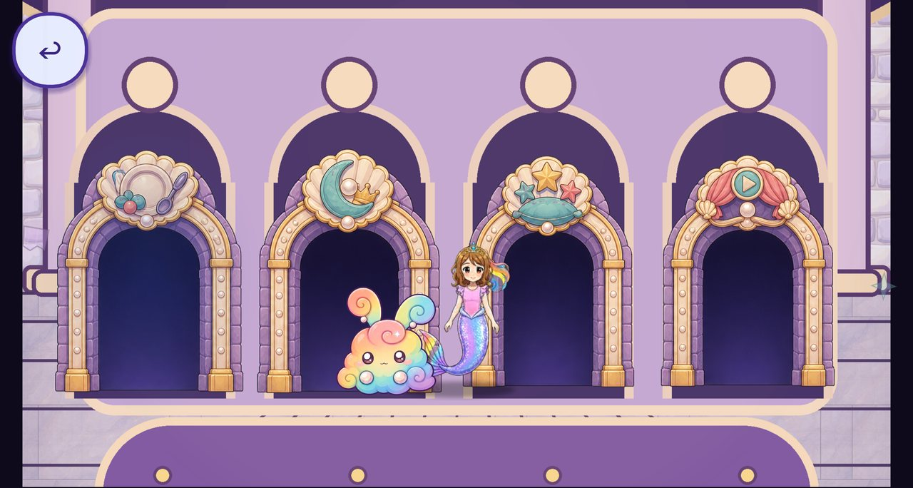

These four read as placeholders beside the painted family. No engine effect closes that
gap.

### Outdoors, the hall and Day One

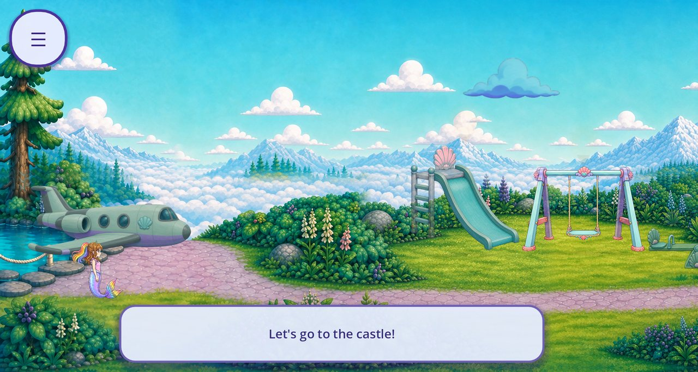

Sky Lagoon: bright and crisp, with one drifting cloud and one swaying tree. Its texture is
sharper than the castle's.

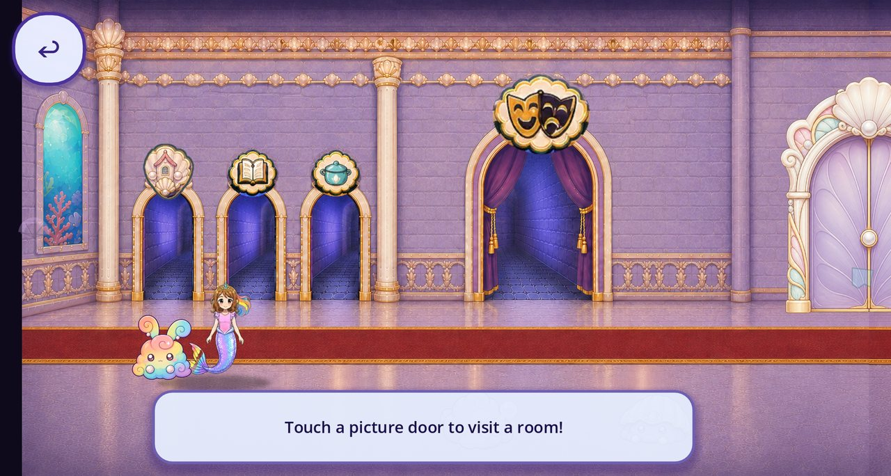

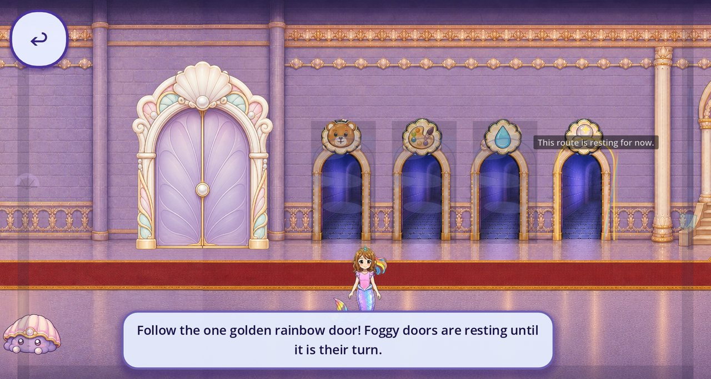

Main Hall: a long flat wall, and resting doors read as dark holes.

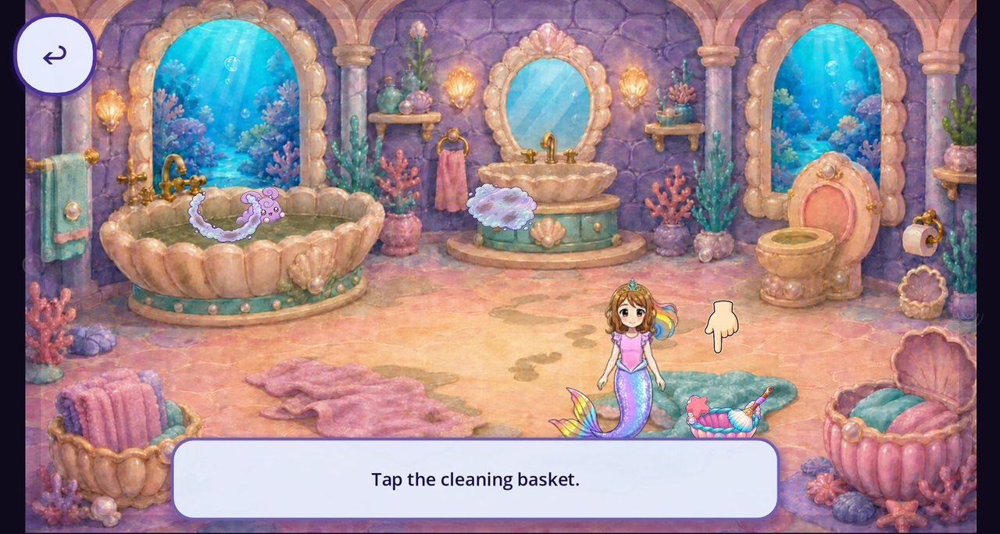

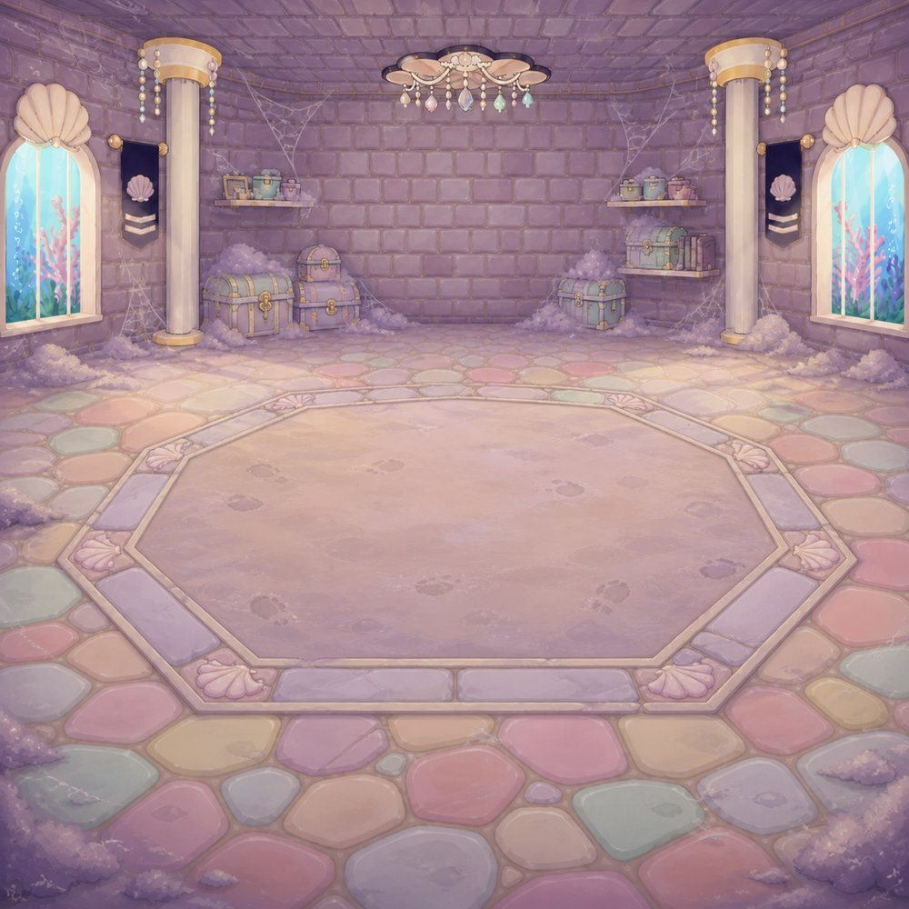

Grand Puff's attic backdrop. The fight itself still runs on the old 3D arena rig.

### Findings

- **The environment is still.** Only characters and tapped props animate.
- **Godot's 2D toolkit is unused.** There are no 2D particle systems, no Parallax2D and no
  2D lights. Sparkles are hand-tweened sprites, and the castle's two canvas shaders serve
  tapped water fixtures and switchable wall lights only.
- **Two art families.** The painted rooms sit next to four flat vector rooms.
- **Characters float.** A small contact shadow is the only grounding. The rainbow bunny is
  nearly Roshan's size and is drawn over her.
- **The interface is heavy.** Instruction panels cover the lower third, and resting doors
  are solid dark arches.
- **Places change with a hard cut.** Short black cuts or plain crossfades.
- **Room detail is soft on a phone.** Rooms draw from 2K tiles, but most are upscales of
  1024×576 originals; the kitchen is the exception.
- **The quality switch does nothing for 2D.** Sparkly/Speedy toggles retired 3D features
  only.
- **Sprite errors.** Neighbouring-frame bleed, cut-off crops and see-through fabric; see
  [TRANSPARENCY_AUDIT.md](TRANSPARENCY_AUDIT.md).

## Two prototypes on the real game

Scratch scripts injected effect nodes into the running game. Masks, lamp positions and
particle areas were derived from the existing painted pixels; nothing was redrawn and
nothing was added to the project. Scripts and masks are in [`tools/`](tools/). They are
rough: tuning, phone budgets and owner review come next.

**Mermaid Pool: living water.**
- Rippling water with moving caustic light, masked to the painted water (reusing
  `assets/terrain/caustics.png` and `up_water_nrm.jpg`).
- Flowing highlights on the existing waterfall and seahorse-spray cards, with foam and
  droplets.
- Light shafts and bubbles in the ocean window, slow white glints, and a lavender
  vignette.

| Today | Prototype |
|---|---|
|  | [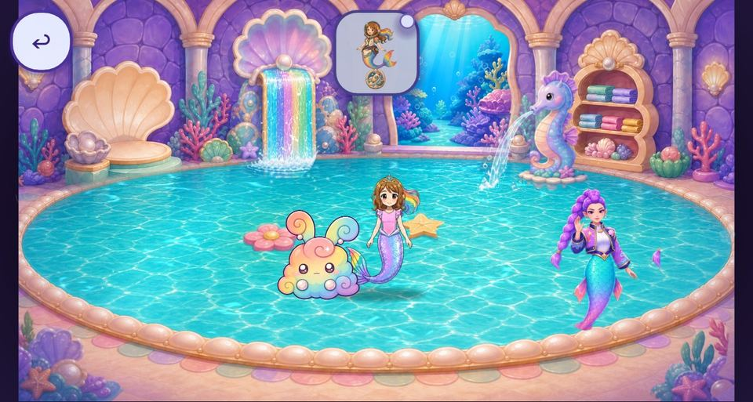](media/prototypes/pool_after.mp4) |

**Bubble Bath: warm, breathing light.** Additive glow on the painted lamps with a slow
breath and a faint flicker, soft shafts and bubbles in both windows, and one warm beam with
drifting motes. The painting itself is never relit.

| Today | Prototype |
|---|---|
|  | [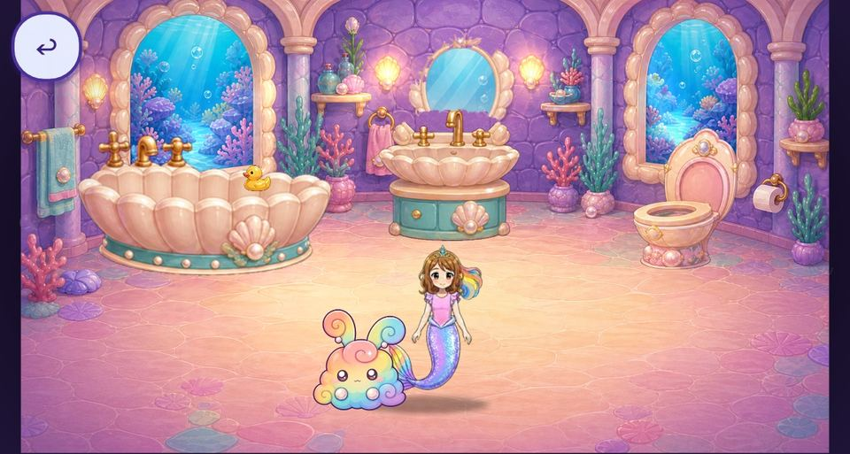](media/prototypes/bath_after.mp4) |

Select a poster to play its clip.

## Rules every change keeps

- **Identity first.** Never repaint or relight approved characters, book art or Rumi
  (`DL-VIS-06`). Effects add light and motion on top of the painting.
- **Calm motion.** Keep it small and slow, away from the objective, and quieter during a
  task (`DL-MOT-03`).
- **Roshan stays visible.** No effect, follower or overlay covers her (`DL-READ-05`).
- **Phone budget.** 30 fps with P95 at or under 33 ms on the family phone. Every effect has
  Sparkly, Speedy and Off tiers and a measured cost (`DL-PERF-02`, `DL-PERF-03`).
- **One shared effects library.** Per-room data, not per-room code.
- **Owner sees it in context** before it counts (`DL-VIS-07`).

## Ten engine-side interventions (no new art)

| Intervention | What the child sees | Where first | How | Cost and guardrail |
|---|---|---|---|---|
| Living water | Water shimmers with moving light; waterfalls and fountains flow; spray lands in droplets | Pool, bathtub, kitchen sink, Sky Lagoon lake, ocean windows | Masked canvas shader per water region (1–2 px screen-texture ripple plus caustics); flow shader on existing waterfall/fountain cards; small droplet particles | One screen copy per room; Speedy drops the ripple |
| Breathing light | Lamps and candles glow and breathe; windows cast shafts; stage spotlights | Every painted lamp, library chandelier, kitchen oven, opera stage | Additive glow and shaft cards on the painted lamps; slow sine breath, faint candle flicker; never tint or relight the painting | A few additive quads per room; Speedy halves them |
| Air and particles | Bubbles in windows, motes in sunbeams, petals and butterflies outdoors, attic dust around Grand Puff that settles as he is cleaned | Every room with a window or light shaft; Sky Lagoon; attic | One shared CPUParticles2D preset library with soft textures made in code; spawn areas from masks; pause during story clips | About 40 particles per screen on Speedy |
| Wind and sway | Trees, flowers, banners, curtains and plants move in a light breeze; clouds drift in two layers | Sky Lagoon trees; castle banners and curtains | Vertex-sway shader anchored at each card's base; castle pieces need cut-outs lifted from the painting, otherwise they stay still | Near-zero amplitude near an objective |
| Grounding and presence | Characters stand in the room instead of floating on it | Every room | One soft lavender contact shadow that scales with depth; follower rules (rainbow bunny about 60% of Roshan's height, behind her feet, never over her face); gentle idle breathing for Rumi, Daddy and followers | `DL-READ-05` |
| Depth and camera | The promenade has depth; rooms feel like places | Sky Lagoon promenade; room entry | Parallax2D layers (`DL-LAY-02` asks for at least two); light far-layer haze; a 2–3% ease-in on room entry; foreground framing shifts slightly with Roshan | Gentle and predictable (`DL-MOT-06`) |
| Transitions and touch feedback | A bubble-iris or storybook page wipe instead of a black cut; props squash when tapped; a sparkle trail follows a scrubbing finger | Every place change; every tappable prop | Full-screen transition shader reading the last frame; tweened squash-and-stretch; Line2D swipe trails; celebrations from the shared library | In sync with sound (`DL-MOT-04`) |
| Colour and finish | Each room keeps one mood; edges soften into a storybook frame | Every room | Per-room grade profiles on the existing Environment grade (the grade-headroom check guards clipping); lavender vignette; optional light paper grain; a soft-light pass to tone down the flat rooms until they are repainted | Grade-headroom check stays green |
| Interface harmony | Smaller speech bubbles with the speaker's face, away from the action; misty resting doors instead of dark holes; breathing pointers | Castle and Sky Lagoon HUD | Restyle the caption panel (size, position, portrait slot); a mist shader on resting door arches; one icon family on the hall signs | Typography roles unchanged (`DL-TYPE-05`) |
| Effect tiers and budgets (do first) | Nothing directly; everything else depends on it | Global | One effects satellite (RefCounted, like the project's satellites) builds each room's effects from a data table; Sparkly/Speedy/Off wired to the quality switch; a probe records per-room frame time on the phone; one screen-texture read per frame at most; effects pause during story clips and focus loss | `DL-PERF-02`, `DL-PERF-03` |

## Art that needs Codex's image generation

- **The four flat rooms** (Dining Room, Family Gallery, Royal Bedroom, Movie Lounge):
  repaint into the painted family. This is the single biggest visual gain, and it also
  clears audit findings T3, T4 and T11.
- **Roshan's swim and walk** in the castle and the Sky Lagoon. The September Grok takes are
  motion reference only; the frame sheets were never rebuilt from them.
- **Baby Eagle:** the backpack-free cutout the owner approved on 2026-09-24. Integration
  only, no generation.
- **Optional, owner's call:** sharper room masters by careful super-resolution of the
  approved paintings.

Everything in the ten interventions needs no image generation.

## Style-matching protocol for any new art

1. **Reference pack per asset:**
   - 3–5 crops from approved painted rooms (outline width, palette, light direction,
     texture);
   - the asset's current art;
   - the rules `DL-VIS-01` to `DL-VIS-10`.
2. **Image-to-image from the existing art** with that pack, never text-only. Composition,
   camera and object positions stay put so tap areas still line up.
3. **Numeric gate before review:**
   - palette within the painted-room swatch set;
   - deep indigo or plum outlines at 2–4 px (`DL-VIS-02`);
   - high-key values (`DL-VIS-03`);
   - no readable text (`DL-READ-04`);
   - cells with clear gutters that pass the audit's cell sweep.
4. **In context:** a phone-size capture next to an approved room, then owner sign-off
   (`DL-VIS-07`).
5. **Never regenerate** Roshan's frame sheets, book art, family voices or Rumi
   (`DL-VIS-06`, `DL-MED-02`).

Claude can build the reference packs and the numeric gate and review Codex's results
against them. Claude does not generate or edit art.

## Suggested order

1. **Foundation:**
   - the effects satellite and tiers;
   - the phone frame-time probe;
   - a mask tool that derives water, lamp and window masks from each painted room for
     review;
   - the sprite-sheet cell gate from the audit.
2. **First impressions:** the Sky Lagoon arrival, Main Hall, pool and bath get living
   water, breathing light, air and the new transitions.
3. **Every painted room:** two or three quiet signature motions, plus grounding and the
   interface pass.
4. **Art:**
   - repaint the four flat rooms under the protocol;
   - rebuild Roshan's swim and walk;
   - re-pack the sheets flagged in the audit.
5. **Tune and sign off:** phone budgets, a playtest with Roshan, and owner approval room by
   room.
